# CrossFlow-X · CF0 架构规格冻结实现方案设计文档

> **阶段标记**：CF0 — Architecture Specification / Freeze
> **对应需求规格**：`.codeartsdoer/specs/cf0_arch_freeze/spec.md`（v2，892 行，五个地基 CF0-S01～CF0-S05 + 7 个核心契约 + C++20 技术栈约束）
> **架构原则**：Driverless User-Mode Architecture（第一版不碰驱动，Virtual HID 作为后续性能路线）
> **技术栈基线**：C++20（由 C++17 升级；为 std::span / std::expected / std::jthread / coroutine / concepts / chrono / variant / atomic / lock-free 等大量依赖预留地基）
> **文档状态**：DRAFT v3 → 待用户审查冻结（v1 基线对应提交 f4706d9；v2 完成 C++20 升级 + Handoff 六态 FSM + 防抖动四重契约 + 并发与线程安全模型 + 7 契约保障；**v3 按大G项目经理 6 项架构级修改意见修订**：①防抖参数行为契约 ②FSM 超时/失败路径 + 安全不变量 ③ACK 事务语义 PREPARE→ACK→COMMIT→ACTIVE ④Coordinate Space 绝对位置 vs 相对运动 ⑤C++20 特性分级 MUST/SHOULD/OPTIONAL/FORBIDDEN ⑥7 契约可验证性统一格式 + 新增 CF0 Architecture Safety Invariant）
> **设计范围**：仅覆盖 CF0-S01～CF0-S05 五个架构地基的增量设计方案 + 7 个核心契约的设计保障措施 + C++20 技术栈使用方案 + CF0 Architecture Safety Invariant，不引入规格外能力
> **存量代码基线**：提交 f4706d9 已落地 TASK-001~007（C++17 项目骨架、错误码体系、JSON Lines 日志器、核心领域对象、平台抽象接口、业务核心接口、6 个单元测试通过）

---

# 一、需求与存量功能关系分析

## 1.1 需求功能与存量功能对比

### 1.1.1 已实现功能

CrossFlow-X 仓库已落地提交 `f4706d9`（TASK-001~007），存量代码位于 `C:\Users\DELL\IDEProjects\CrossFlow-X`。下表对照 spec.md v2 需求与已实现存量代码的匹配度。匹配度分四档：100%（完全匹配，无需改动）、75%（主体匹配，需小幅对齐）、50%（部分匹配，需改造）、25%（骨架存在，需大幅补全）。

| 需求功能（spec.md v2） | 存量功能（f4706d9） | 代码位置 | 匹配度 |
|---------|---------|---------|--------|
| C++20 编译基线（spec §4.5.4 / §8.1） | C++17 编译基线 | `CMakeLists.txt:9`（`set(CMAKE_CXX_STANDARD 17)`） | 25% |
| 编译器兼容矩阵 Apple Clang≥15 / MSVC≥19.3x / Clang≥17（spec §4.5.5 / §8.1.2） | 仅配置 `/W4 /WX` 与 `-Wall -Wextra -Werror`，未声明编译器版本下限 | `CMakeLists.txt:26-31` | 25% |
| 结构化错误码体系 18 个 CFX-`<level>-<module>-<reason>`（spec §4.4.1） | 18 个错误码枚举 + `CfxError` 类型 + `to_string/levelOf/moduleOf/reasonOf` 解析 | `core/common/error_code.hpp`、`core/common/error_code.cpp` | 75% |
| JSON Lines 异步结构化日志器（spec §4.4.1 / §4.6.6） | JSON Lines 输出 + 链式字段构建 + 异步队列，但使用 `std::thread` + `std::mutex` + `std::condition_variable`（非 `std::jthread`，热路径持锁） | `core/common/logger.hpp`、`core/common/logger.cpp` | 50% |
| 核心领域对象 NodeId/TraceId UUIDv4 + variant 负载 + validate()（spec §6） | `NodeId`/`TraceId`（u128 拆 high/low）+ `EventPayload` variant + `CanonicalInputEvent::validate()` + `TopologyView::isLinear/hasDuplicateNodeIds` | `core/common/domain.hpp`、`core/common/domain.cpp` | 75% |
| EndpointState 三态枚举（spec §5.3.1.1 宏观三态） | `enum class EndpointState { Master, Slave, Idle }` | `core/common/domain.hpp:31-35` | 50% |
| Handoff FSM 完整六态 ARMED/PENDING/ACK/ACTIVE/COOLDOWN/RECOVERY（spec §5.3.1.2 / 契约②） | **未实现**（仅三态枚举，无 FSM 类、无转移表、无 COOLDOWN/RECOVERY） | 无 | 25% |
| 平台无关抽象接口 IInputCapture/IInputInjector/IMonotonicClock/IScreenQuery（spec §4.5.3 / 契约①） | 四接口完整定义 + `RawInputEvent`/`RawPayload` variant + `CaptureHandle`/`InjectResult`/`ReleaseResult`/`PressedStateSnapshot` | `platform/common/platform_ports.hpp` | 75% |
| 业务核心接口 6 个 + ControlMessage variant + HandoffOutcome variant（spec §5） | `IEventNormalizer`/`ITopologyManager`/`IHandoffOrchestrator`/`ICoordMapper`/`IControlPlaneChannel`/`IInputPlaneChannel` + `ControlMessage`/`HandoffOutcome` variant | `core/s0{1..5}_*/i_*.hpp`、`core/common/messages.hpp` | 50% |
| 防抖动四重契约：冷却期≥80ms / 最小停留≥50ms / 抖动频率≤5次/秒 / 抖动熔断（spec §4.2.6-8 / §5.3.1.11-13 / 契约②） | **未实现** | 无 | 0% |
| 并发与线程安全模型 9 条约束（spec §4.6 / 契约⑦） | **未实现**（仅 logger 内部 1 个 std::thread，无显式线程模型文档） | 无 | 0% |
| 7 个核心契约的设计保障（spec §7） | **未实现**（契约审查尚未在代码层落地） | 无 | 0% |
| C++20 设施使用方案：std::span/std::expected/std::jthread/coroutine/concepts/chrono/variant/atomic/enum class（spec §8.2） | variant + enum class 已用；atomic 已用于 logger；chrono/jthread/expected/span/concepts/coroutine 未用 | 散见于 `domain.hpp`、`logger.hpp` | 25% |

**结论**：存量代码已完成 CF0 地基的"骨架 + 领域模型 + 抽象接口"层，但与 spec.md v2 的差距集中在五个增量面：
1. **C++17 → C++20 升级**（编译基线、编译器矩阵、9 项 C++20 设施使用）；
2. **Handoff FSM 三态 → 六态**（新增 ARMED/PENDING/ACK/ACTIVE/COOLDOWN/RECOVERY + 9 条转移路径）；
3. **防抖动四重契约**（cooldown 定时器、dwell time 检测、抖动熔断器、FSM 不可重入）；
4. **并发与线程安全模型**（std::jthread 线程模型、无锁队列、coroutine 异步传输、线程数≤8、终止清理≤200ms）；
5. **7 个核心契约的设计保障措施**。

### 1.1.2 需要扩展的功能

下表列出存量代码已部分实现、需在现有基础上改造对齐 v2 的功能项。

| 需求功能 | 存量功能 | 差异说明 | 扩展方向 |
|---------|---------|---------|---------|
| C++20 编译基线 | C++17 基线 | `CMAKE_CXX_STANDARD` 值为 17；未要求 Apple Clang≥15 / MSVC≥19.3x / Clang≥17 | `CMakeLists.txt` 改 `CMAKE_CXX_STANDARD 20`；`cmake/Platform.cmake` 增编译器版本检测；CI 矩阵覆盖三编译器 |
| 错误处理改 `std::expected<T, CfxError>` | 错误码 + `CfxError` 类 | 接口返回 `std::optional` 或 bool，未用 `std::expected`；热路径无异常但错误信息不完整 | 可失败操作签名改 `std::expected<T, CfxError>`；保留 `CfxError` 作为 E 类型 |
| 日志器线程升级 | `std::thread` + `std::mutex` + `std::condition_variable` | 长 lifecycle 线程未用 `std::jthread`；队列用 `std::deque` + mutex（非无锁）；热路径提交持锁 | 改 `std::jthread`；提交队列改 SPSC 无锁环形缓冲；移除热路径 mutex |
| `EndpointState` 三态 → `HandoffState` 六态 | `enum class EndpointState { Master, Slave, Idle }` | 缺 ACK/PENDING/COOLDOWN/RECOVERY；无转移表；无 FSM 类 | 新增 `enum class HandoffState { Armed, Pending, Ack, Active, Cooldown, Recovery }`；保留 `EndpointState` 作宏观映射；新增 `HandoffFsm` 类与转移表 |
| 接口签名 C++20 化 | C++17 风格签名 | 序列参数用 `std::vector` 拷贝；时间用裸 `u64`；模板无 concepts 约束 | 序列改 `std::span`；时间改 `std::chrono::duration`；模板加 concepts；可失败返回 `std::expected` |
| `IHandoffOrchestrator` 对齐六态 | 接口签名返回 `HandoffOutcome` variant | 未暴露 FSM 状态查询、cooldown 剩余时间、dwell time 计时；无防抖动入口 | 增 `currentState()`、`cooldownRemaining()`、`dwellTimeElapsed()` 查询；增 `IHandoffFsm` 独立接口 |
| `ITopologyManager` 循环支持 | `neighbor(direction)` 返回 `std::optional<EndpointIdentity>` | 回环映射未在接口契约显式声明；无"禁两点退化"校验入口 | 接口文档显式声明回环；增 `isCircular()` 与 `segmentCount() >= 2` 校验 |
| 双平面通道线程隔离声明 | `IControlPlaneChannel`/`IInputPlaneChannel` 接口 | 接口未声明线程归属；未要求双平面独立线程 | 接口契约补充"独立线程、独立队列、无共享可变状态"；实现侧各持 `std::jthread` |

### 1.1.3 需要新增的功能或接口

以下按业务模块分组，列出 CF0 v2 需从零新增的全部功能点。每个功能点标注输入、输出、核心逻辑及依赖。

#### 模块 A：规范输入事件模型（CF0-S01）—— v2 增量

| 编号 | 功能点 | 输入 | 输出 | 核心逻辑 | 依赖 |
|-----|--------|-----|-----|---------|------|
| A-01 | 平台原始事件捕获 | 本机输入子系统事件流 | 平台无关 `RawInputEvent` | 用户态 API 订阅（macOS: CGEventTap；Windows: WH_MOUSE_LL/WH_KEYBOARD_LL）；回调仅轻量采集，≤1ms 返回 | 模块 F |
| A-02 | 事件规范化转换 | `RawInputEvent` | `CanonicalInputEvent` | 类型映射、坐标增量、键码统一；平台特殊逻辑隔离在适配层（契约①） | A-01 |
| A-03 | 序号与时间戳分配（`std::chrono`） | `CanonicalInputEvent`（未填） | `CanonicalInputEvent`（已填） | 本端单调序号 `std::atomic<u64>`；`std::chrono::steady_clock` 微秒时间戳 | 无 |
| A-04 | 修饰键独立状态追踪 | 修饰键按下/释放事件 | `ModifierState` 位图 | `std::atomic<ModifierState>` 无锁；跨端切换显式同步 | A-02 |
| A-05 | 源端 NodeID 标注 | `CanonicalInputEvent` | 含 `source_node_id` 的事件 | 从本端 `EndpointIdentity` 注入 | 模块 B |
| A-06 | 未知事件类型丢弃 | 平台原始事件 | 告警日志 | 类型枚举校验，未定义丢弃 + 告警 `CFX-W-NORM-UNKNOWN` | A-02 |
| A-07 | 输入注入（被控态） | `CanonicalInputEvent` | 本机注入指令 | 平台用户态注入 API（macOS: CGEventPost；Windows: SendInput） | 模块 F |
| A-08 | 批量注入（`std::span` 视图） | `std::span<const CanonicalInputEvent>` | `InjectResult` | 零拷贝批量注入，断线释放清单专用 | A-07 |

#### 模块 B：端点身份与拓扑模型（CF0-S02）—— v2 增量

| 编号 | 功能点 | 输入 | 输出 | 核心逻辑 | 依赖 |
|-----|--------|-----|-----|---------|------|
| B-01 | NodeID 生成与持久化（UUIDv4） | 首次启动信号 | `NodeId`（u128） | UUIDv4 生成，本地 JSON 持久化，IP 变化不变 | 无 |
| B-02 | 平台类型声明 | 本机 OS 探测 | `Platform` 枚举 | macOS/Windows 运行时探测 | 无 |
| B-03 | 屏幕边界声明 | 本机分辨率 | `ScreenBoundary` | 用户态屏幕查询 API | 无 |
| B-04 | 拓扑配置加载与线性校验 | 运维配置文件 | `TopologyView` | 解析端点清单+邻居；校验线性排列、邻居数≤2、回环闭合、**段数≥2（禁两点退化，契约③）** | 无 |
| B-05 | 拓扑声明广播 | 本端 `EndpointIdentity` | 拓扑声明报文 | 经 Control Plane 广播 | 模块 E |
| B-06 | NodeID 唯一性校验 | 收到的拓扑声明 | 接受/拒绝 | 冲突拒绝 + 告警 `CFX-E-TOPO-NODEID-DUP` | B-04 |
| B-07 | 拓扑视图合并与同步 | 多端拓扑声明 | 一致拓扑视图 | 配置版本号裁决，全拓扑同步 | B-04, 模块 E |
| B-08 | 邻居失联标记 | 心跳超时事件 | 邻居状态标记 | 失联方向暂停 Handoff 触发 | 模块 C, 模块 E |
| B-09 | 循环切换回环映射 | 最左/最右边缘越界 | 回环邻居 NodeId | 最左端左邻居=最右端，最右端右邻居=最左端（契约③） | B-04 |

#### 模块 C：Handoff 六态状态机（CF0-S03）—— v2 重写

| 编号 | 功能点 | 输入 | 输出 | 核心逻辑 | 依赖 |
|-----|--------|-----|-----|---------|------|
| C-01 | **六态 FSM 维护** | 状态转移事件 | 当前 `HandoffState`（六态之一） | `enum class HandoffState { Armed, Pending, Ack, Active, Cooldown, Recovery }`；FSM 单线程所有权（契约⑦）；转移延迟≤1ms | 无 |
| C-02 | **9 条合法转移路径执行** | (当前态, 事件) | 下一态 + 动作 | 转移表见 §2.5.2；非法转移拒绝并告警；PENDING/ACK/COOLDOWN/RECOVERY 期间禁止重入（spec §5.3.1.18） | C-01 |
| C-03 | 三态/六态宏观映射 | `HandoffState`（六态） | `EndpointState`（三态） | ARMED/PENDING/COOLDOWN→主控态；ACTIVE→被控态；RECOVERY→空闲态（spec §5.3.1.1） | C-01 |
| C-04 | 边缘越界检测 | 鼠标位置 + 屏幕边界 | 越界事件（方向+越界量） | 实时比较光标坐标与边界，仅左右边缘触发 | 模块 D |
| C-05 | Handoff 请求发起 | 越界事件 + 在线邻居 | `HandoffContext` + 请求报文 | 生成 `TraceId`（UUIDv4），封装越界量/修饰键快照，经 Control Plane 发送 | A-04, B-08, 模块 E |
| C-06 | Handoff 请求处理 | Handoff 请求报文 | 接受/拒绝应答 | 校验配对、拓扑、状态；预转入主控 | B-06, C-01 |
| C-07 | 控制权转移执行 | 握手成功信号 | 状态变更 + 注入启停 | 源端转被控/空闲，目标端转主控，键盘跟随 | C-01, A-07 |
| C-08 | 握手超时回退（经 COOLDOWN） | 超时定时器 | PENDING→COOLDOWN→ARMED | 超时阈值 20ms；**必经 COOLDOWN，不直接跳回 ARMED（契约②）** | C-05 |
| C-09 | 双向同时触发裁决 | 两个并发 Handoff 请求 | 单一胜出 | `TraceId` 较小者胜（避免 NTP 依赖） | C-05 |
| C-10 | 断线键鼠状态释放（经 RECOVERY） | 链路断开事件 | 强制释放指令清单 | 任意态→RECOVERY；100ms 内释放所有按下键/按钮；完成后回 ARMED 或空闲 | A-07, 模块 E |
| C-11 | 循环切换支持 | 最左/最右边缘越界 | 回环 Handoff | 拓扑回环邻居映射（契约③） | B-09, C-05 |
| C-12 | 握手期间注入抑制 | 握手进行中标志 | 缓存/丢弃对端输入 | PENDING/ACK 期间禁止注入本机（spec §5.3.1.15） | C-06, A-07 |
| C-13 | **FSM 单线程所有权** | 非 FSM 线程的事件 | 经无锁 SPSC 队列递交 | FSM 状态读写由单一专属线程串行；跨线程经无锁原子队列（契约⑦） | 模块 G |

#### 模块 D：坐标空间与屏幕映射（CF0-S04）—— v2 增量

| 编号 | 功能点 | 输入 | 输出 | 核心逻辑 | 依赖 |
|-----|--------|-----|-----|---------|------|
| D-01 | 屏幕边界管理 | 分辨率查询/变更事件 | `ScreenBoundary` 维护 | 原点固定左上角 (0,0)，宽高正整数（契约⑤） | B-03 |
| D-02 | 边缘方向映射 | 越界方向 | 邻居方向 | 左边缘→左邻居，右边缘→右邻居，上下不触发 | B-04 |
| D-03 | 越界量换算 | 源端边界+越界量+纵向+目标端边界 | 入射坐标 | 入射深度=越界量，纵向按高度比例映射；**不依赖画面数据（契约⑤）** | 无 |
| D-04 | 入射坐标钳制 | 换算后坐标 + 目标端边界 | 有效坐标 | 超出范围钳制到边缘内侧 | D-03 |
| D-05 | 分辨率变更同步 | 分辨率变更事件 | 全拓扑边界更新 | 重新声明边界，同步全拓扑，进行中 Handoff 用新边界 | B-07, 模块 E |
| D-06 | 多显示器合并声明 | 多显示器探测结果 | 单一逻辑边界或拒绝 | 第一版按单一逻辑屏处理，未声明合并则拒绝 | B-03 |

#### 模块 E：低延迟传输协议（CF0-S05）—— v2 增量

| 编号 | 功能点 | 输入 | 输出 | 核心逻辑 | 依赖 |
|-----|--------|-----|-----|---------|------|
| E-01 | 二进制帧编解码 | 报文对象 | 二进制帧 / 报文对象 | 固定头+变长负载，版本号字段前置；零拷贝热路径 | 无 |
| E-02 | 双平面帧类型隔离 | 报文 | 帧类型标识 | Input Plane 与 Control Plane 独立帧类型、独立处理路径、独立线程（契约⑥） | 无 |
| E-03 | Control Plane 可靠有序传输 | 控制报文 | 确认/重传 | 序号+ACK+重传定时器，超限判断线 | 无 |
| E-04 | Input Plane 低延迟队列 | 输入事件帧 | 发送/丢弃 | 队列积压超阈值丢过期帧，优先最新 | 无 |
| E-05 | 心跳发送与应答 | 心跳周期定时器 | 心跳报文 | 周期 ≤50ms，经 Control Plane | E-03 |
| E-06 | 断线判定 | 心跳应答时序 | 断线事件 | 连续 3 周期无应答判断线（≤200ms） | E-05 |
| E-07 | 协议版本协商 | 双方版本号 | 兼容/拒绝 | 连接建立首步，不兼容拒绝 | 无 |
| E-08 | 配对确认机制 | 配对码 | 配对成功/失败 | 链路建立前必须配对，未配对拒绝业务报文 | 无 |
| E-09 | 自动重连 | 断线事件 | 重连尝试 | 指数退避重连，成功后重新协商版本+恢复拓扑 | E-07, B-07 |
| E-10 | 用户态传输实现 | 网络收发 | 字节流 | 禁止内核态组件，纯用户态 socket | 无 |
| E-11 | **coroutine 异步传输** | socket I/O | 异步完成通知 | C++20 coroutine 或平台原生异步 I/O（io_uring / IOCP）；禁传输线程内阻塞 socket（spec §4.6.7） | 无 |
| E-12 | **双平面线程隔离** | 双平面报文 | 各平面独立线程处理 | Input Plane 与 Control Plane 各持独立 `std::jthread`，无共享可变状态（契约⑥/⑦） | 无 |

#### 模块 F：跨平台抽象层（spec §4.5 兼容性 + 契约①）—— v2 增量

| 编号 | 功能点 | 输入 | 输出 | 核心逻辑 | 依赖 |
|-----|--------|-----|-----|---------|------|
| F-01 | macOS 输入捕获抽象 | CGEventTap 事件 | 平台无关 `RawInputEvent` | 用户态事件监听，无 kext；回调≤1ms 返回 | 无 |
| F-02 | macOS 输入注入抽象 | `CanonicalInputEvent` | CGEventPost 调用 | 用户态注入，无内核驱动 | 无 |
| F-03 | Windows 输入捕获抽象 | WH_MOUSE_LL/WH_KEYBOARD_LL | 平台无关 `RawInputEvent` | 低级钩子，无驱动；回调≤1ms 返回 | 无 |
| F-04 | Windows 输入注入抽象 | `CanonicalInputEvent` | SendInput 调用 | 用户态注入 | 无 |
| F-05 | 平台无关时钟抽象 | 无 | `std::chrono::steady_clock::time_point` | macOS mach_absolute_time / Windows QPC；统一 chrono 强类型 | 无 |
| F-06 | **平台逻辑隔离审查点** | Core 层源码 | 审查报告 | grep Core 层无 `#ifdef __APPLE__`/`#ifdef _WIN32`/`CGEvent`/`windows.h`（契约①） | 无 |

#### 模块 G：防抖动机制（spec §4.2.6-8 / §5.3.1.11-13 / 契约②）—— v2 新增

| 编号 | 功能点 | 输入 | 输出 | 核心逻辑 | 依赖 |
|-----|--------|-----|-----|---------|------|
| G-01 | **冷却期定时器（CooldownTimer）** | Handoff 完成/回退事件 | 冷却期门控信号 | 一次 Handoff 结束后强制 ≥80ms 静默；冷却期内越界事件丢弃或钳制回本端边缘内侧；冷却结束触发 COOLDOWN→ARMED | C-01 |
| G-02 | **最小停留时间检测（DwellTimeGuard）** | 控制权转移完成 + 鼠标位置流 | 是否允许越界触发 | 进入 ACTIVE 后强制鼠标在目标端屏幕内停留 ≥50ms 才允许再次越界 Handoff；未达标越界事件忽略 | C-01, C-04 |
| G-03 | **抖动频率检测器（JitterDetector）** | Handoff 完成事件流 | 抖动告警/熔断信号 | 1 秒滑动窗口统计同一对相邻端点 Handoff 次数；>5 次/秒触发熔断 | C-01 |
| G-04 | **抖动熔断器（JitterCircuitBreaker）** | 抖动告警信号 | 冷却期提升 + 运维告警 | 熔断时冷却期提升至 ≥300ms；连续 3 次熔断向运维告警要求人工介入 | G-03 |
| G-05 | **FSM 不可重入守卫** | FSM 当前态 + 新事件 | 排队/丢弃决策 | PENDING/ACK/COOLDOWN/RECOVERY 期间新越界事件排队或丢弃，禁止重入（spec §5.3.1.18） | C-01 |

#### 模块 H：并发与线程安全模型（spec §4.6 / 契约⑦）—— v2 新增

| 编号 | 功能点 | 输入 | 输出 | 核心逻辑 | 依赖 |
|-----|--------|-----|-----|---------|------|
| H-01 | **显式线程模型声明** | 无 | 线程职责文档 | 8 个线程：主线程、Capture、Injection、InputPlane Rx/Tx、ControlPlane Rx/Tx、FSM、Logger、Scheduler；均用 `std::jthread` | 无 |
| H-02 | **FSM 单线程所有权** | 非 FSM 线程事件 | 经无锁 SPSC 队列递交 FSM 线程 | FSM 状态读写由 FSM 专属线程串行；跨线程经无锁原子队列（spec §4.6.2） | C-13 |
| H-03 | **Input/Control Plane 线程隔离** | 双平面报文 | 各平面独立线程处理 | 双平面各持独立 `std::jthread`，无共享可变状态；跨平面交换经无锁队列（spec §4.6.3） | E-12 |
| H-04 | **捕获回调轻量化** | 平台原始事件 | 异步派发到处理线程 | 回调仅轻量采集 + 异步派发；禁止锁等待/IO/内存分配/跨平面调用；≤1ms 返回（spec §4.6.4） | F-01, F-03 |
| H-05 | **共享状态无锁优先** | 跨线程热路径状态 | `std::atomic` 读写 | FSM 状态快照、链路状态、修饰键状态用 `std::atomic`（lock-free）；非热路径控制报文处理允许互斥量，持锁≤100us（spec §4.6.5） | 无 |
| H-06 | **禁止阻塞热路径** | Input Plane 转发/注入路径 | 无阻塞操作 | 禁磁盘 IO/网络等待/锁竞争/sleep；日志异步派发（spec §4.6.6） | 无 |
| H-07 | **coroutine 调度器独立** | 异步 I/O 任务 | coroutine 调度 | 协程调度器独立于 FSM 线程与捕获线程（spec §4.6.7） | E-11 |
| H-08 | **线程数上界≤8** | 无 | 线程计数审查 | 单 Agent 线程数 ≤8（含主线程）；超出即架构破坏（spec §4.6.8） | H-01 |
| H-09 | **终止清理≤200ms** | 终止信号 | 全线程清理退出 | 所有线程 ≤200ms 完成清理（释放钩子、关闭链路、flush 日志）；禁止泄漏/悬挂（spec §4.6.9） | H-01 |

#### 模块 I：7 个核心契约设计保障（spec §7）—— v2 新增

| 编号 | 功能点 | 输入 | 输出 | 核心逻辑 | 依赖 |
|-----|--------|-----|-----|---------|------|
| I-01 | 契约① CanonicalInputEvent 规范化隔离保障 | Core 层 + 适配层代码 | 审查通过/失败 | 平台特殊逻辑隔离在适配层；Core 层禁平台条件分支；新增 Linux 仅增适配层（spec §7.1） | F-06 |
| I-02 | 契约② Handoff FSM 完整状态保障 | FSM 实现 | 审查通过/失败 | 六态全部存在；转移路径与 spec §5.3.1.2 完全一致；防抖动四重机制齐全（spec §7.2） | C-01, G-01~G-05 |
| I-03 | 契约③ Topology 循环支持保障 | 拓扑配置 | 审查通过/失败 | 支持 ≥2 段线性循环；禁两点退化；回环闭合（spec §7.3） | B-09 |
| I-04 | 契约④ Input Plane 直通保障 | Input Plane 路径 | 审查通过/失败 | 路径仅含 {捕获, 规范化, 传输, 注入}；禁经 GUI/DB/日志同步/Control Plane 等待（spec §7.4） | A-01~A-08, E-04 |
| I-05 | 契约⑤ Coordinate Space 坐标空间保障 | 坐标换算实现 | 审查通过/失败 | 原点为屏幕左上角；纵向按高度比例映射；禁画面依赖（spec §7.5） | D-01~D-06 |
| I-06 | 契约⑥ Transport 双平面隔离保障 | 传输层实现 | 审查通过/失败 | 帧类型/处理路径/线程三维度隔离；Control 可靠有序，Input 低延迟可丢帧（spec §7.6） | E-02, E-12, H-03 |
| I-07 | 契约⑦ Concurrency/Threading 并发模型保障 | 线程模型实现 | 审查通过/失败 | 显式线程模型；FSM 单线程所有权；双平面线程隔离；回调≤1ms；无锁优先；线程数≤8（spec §7.7） | H-01~H-09 |

#### 模块 J：C++20 技术栈使用方案（spec §8）—— v2 新增

| 编号 | 功能点 | 输入 | 输出 | 核心逻辑 | 依赖 |
|-----|--------|-----|-----|---------|------|
| J-01 | C++20 编译基线 | CMakeLists | `-std=c++20` / `/std:c++20` | `CMAKE_CXX_STANDARD 20`；禁降级（spec §8.1.1） | 无 |
| J-02 | 编译器兼容矩阵 | CI 配置 | 三编译器覆盖 | Apple Clang≥15 / MSVC≥19.3x / Clang≥17；CI 全组合（spec §8.1.2） | J-01 |
| J-03 | `std::span` 只读序列视图 | 接口签名 | 零拷贝序列传参 | 跨模块只读连续序列用 `std::span` 替代裸指针+长度或 vector 拷贝（spec §8.2.1） | 无 |
| J-04 | `std::expected` 错误处理 | 可失败操作 | `std::expected<T, CfxError>` | 替代异常/错误码+出参；热路径禁异常（spec §8.2.2） | 无 |
| J-05 | `std::jthread` 长生命周期线程 | 线程创建 | 自动 join + 可中断 | 替代裸 `std::thread`（spec §8.2.3） | H-01 |
| J-06 | coroutine 异步传输 | socket I/O | 异步完成 | C++20 coroutine 或 io_uring/IOCP；禁阻塞 socket（spec §8.2.4） | E-11 |
| J-07 | concepts 接口约束 | 模板参数 | concept 约束 | 替代 SFINAE / static_assert（spec §8.2.5） | 无 |
| J-08 | `std::chrono` 强类型时间 | 时间相关接口 | `std::chrono::duration` | 替代裸整数毫秒/微秒（spec §8.2.6） | 无 |
| J-09 | `std::variant` + `std::visit` 多态负载 | 多态对象 | variant + visit | 替代裸 union / 虚函数继承体系（spec §8.2.7） | 无 |
| J-10 | `std::atomic` lock-free 状态 | 跨线程状态 | atomic 状态快照 | FSM/链路/修饰键状态用 `std::atomic` 且 `is_lock_free()`（spec §8.2.8） | H-05 |
| J-11 | `enum class` 强类型枚举 | 全部枚举 | 作用域枚举 | 禁裸 enum；禁隐式转换（spec §8.2.9） | 无 |
| J-12 | 禁提案特性/禁降级/禁异常热路径/禁裸 new-delete | 代码审查 | 审查通过/失败 | 4 项禁止项保障（spec §8.3） | 无 |

## 1.2 存量功能详细分析

本节对 1.1.1 中匹配度≥50% 的存量代码进行接口契约、业务规则、扩展点、约束四维度深入解读，并分析外部系统依赖的存量接口契约（构成增量设计的落地边界）。

### 1.2.1 错误码体系（`core/common/error_code.hpp`）存量分析

- **接口契约**：`enum class ErrorCode`（18 个码）+ `CfxError` 类；`levelOf/moduleOf/reasonOf/to_string` 解析函数。格式 `CFX-<level>-<module>-<reason>`，level ∈ {E, W, I}。
- **业务规则**：错误码与模块一一映射（Cap/Inj/Norm/Topo/Handoff/Map/Cp/Ip/Proto/Link/Pair）；`to_string` 输出严格匹配规范（如 `CFX-E-CAP-PERM`）。
- **扩展点**：新增错误码仅需在 `ErrorCode` 枚举追加 + 解析表登记。
- **约束**：
  - **C++20 对齐差距**：当前 `CfxError` 仅承载 `ErrorCode`，未与 `std::expected<T, CfxError>` 集成；扩展方向是将 `CfxError` 作为 `std::expected` 的 E 类型。
  - **线程安全**：解析函数为纯函数，线程安全。
  - **测试覆盖**：`tests/common/test_error_code.cpp` 已覆盖 18 码解析。

### 1.2.2 JSON Lines 日志器（`core/common/logger.hpp`）存量分析

- **接口契约**：`Logger` 单例 + `LogEntry` 链式构建 + `CFX_LOG` 宏；`start(Sink)`/`stop()`/`submit(jsonLine)`/`flush()`/`droppedCount()`。字段：`ts/level/nodeId/traceId/eventId/linkState/msg/code`。
- **业务规则**：异步队列（容量 4096）+ 后台 worker 线程写 Sink；JSON Lines 每行合法 JSON；溢出丢弃并计数。
- **扩展点**：`Sink` 可替换（文件/stdout/网络）。
- **约束**：
  - **C++20 对齐差距**：worker 用 `std::thread`（非 `std::jthread`）；队列用 `std::deque` + `std::mutex` + `std::condition_variable`（非无锁）；提交路径持锁（热路径潜在阻塞）。扩展方向：worker 改 `std::jthread`；队列改 SPSC 无锁环形缓冲；提交路径无锁。
  - **线程安全**：当前 mutex 保护队列；改造后无锁。
  - **资源限制**：队列容量 4096，溢出丢弃。
  - **测试覆盖**：`tests/common/test_logger.cpp` 已覆盖 JSON 合法性、异步、字段注入。

### 1.2.3 核心领域对象（`core/common/domain.hpp`）存量分析

- **接口契约**：`NodeId`/`TraceId`（u128 拆 high/low，`<`/`==`/`isNull`/`generate`）+ `ScreenBoundary`/`EntryCoord`/`ModifierState`/`EventPayload` variant + `CanonicalInputEvent::validate()` + `EndpointIdentity`/`NeighborRelation`/`TopologyView`/`HandoffContext`/`Link`。
- **业务规则**：`NodeId.generate()` UUIDv4；`TopologyView.isLinear()` 线性校验；`hasDuplicateNodeIds()` 唯一性校验；`neighborOf(nodeId, direction)` 邻居查询。
- **扩展点**：`EventPayload` variant 可扩展新事件类型。
- **约束**：
  - **C++20 对齐差距**：`EndpointState` 仅三态 `{Master, Slave, Idle}`，缺六态；`validate()` 返回 `bool`（应改 `std::expected<void, CfxError>`）；时间戳用裸 `u64`（应改 `std::chrono`）；序列用 `std::vector`（应改 `std::span` 视图）。
  - **线程安全**：领域对象本身无共享状态，线程安全。
  - **测试覆盖**：`tests/common/test_domain.cpp` 已覆盖 NodeId/TraceId/TopologyView/CanonicalInputEvent。

### 1.2.4 平台抽象接口（`platform/common/platform_ports.hpp`）存量分析

- **接口契约**：`IInputCapture`（`start/stop/queryScreenBoundary`）+ `IInputInjector`（`inject/injectBatch/releaseAllPressed`）+ `IMonotonicClock`（`nowUs`）+ `IScreenQuery`（`primaryBoundary`）+ `RawInputEvent`/`RawPayload` variant + `CaptureHandle`/`InjectResult`/`ReleaseResult`/`PressedStateSnapshot`。
- **业务规则**：捕获层产出 `RawInputEvent`，规范化层消费；注入层消费 `CanonicalInputEvent`。
- **扩展点**：四接口为抽象基类，macOS/Windows 各提供实现。
- **约束**：
  - **C++20 对齐差距**：`start(onEvent)` 用 `std::function`（可改 concept 约束的 callable）；`injectBatch` 用 `std::vector`（应改 `std::span`）；`nowUs()` 返回裸 `u64`（应改 `std::chrono::steady_clock::time_point`）。
  - **线程安全**：回调在系统指定线程，需异步派发。
  - **测试覆盖**：`tests/common/test_platform_ports.cpp` 已覆盖接口可实例化。

### 1.2.5 业务核心接口（`core/s0{1..5}_*/i_*.hpp` + `messages.hpp`）存量分析

- **接口契约**：6 接口（`IEventNormalizer`/`ITopologyManager`/`IHandoffOrchestrator`/`ICoordMapper`/`IControlPlaneChannel`/`IInputPlaneChannel`）+ `HandoffRequest`/`HandoffResponse`/`HandoffOutcome` variant + `ControlMessage` variant。
- **业务规则**：接口对应 spec §5 五个地基；`HandoffOutcome = variant<HandoffTransferred, HandoffRolledBack>`；`ControlMessage` 联合 6 类控制报文。
- **扩展点**：接口为抽象基类，可多实现。
- **约束**：
  - **C++20 对齐差距**：`IEventNormalizer::normalize` 返回 `std::optional`（应改 `std::expected`）；`ITopologyManager::neighbor` 返回 `std::optional`（应改 `std::expected`）；`IHandoffOrchestrator` 未暴露 FSM 状态查询、防抖动入口；`IInputPlaneChannel::backlog()` 返回裸 `u32`（可保留，但需文档化线程安全）。
  - **线程安全**：接口未声明线程归属；扩展方向是文档化每个接口的线程归属（FSM 接口归 FSM 线程，通道接口归各平面线程）。
  - **测试覆盖**：`tests/common/test_business_interfaces.cpp` 已覆盖接口可实例化。

### 1.2.6 macOS 输入子系统接口契约（外部存量）

- **接口契约**：捕获 `CGEventTapCreate`；注入 `CGEventPost(kCGHIDEventTap, event)`；屏幕 `CGDisplayPixelsWide/High`；时钟 `mach_absolute_time` + `mach_timebase_info`。
- **业务规则**：事件类型由 `CGEventType` 枚举；修饰键由 `CGEventGetFlags` 独立读取。
- **扩展点**：CGEventTap mask 选择性监听。
- **约束**：
  - **用户态约束**：CGEventTap 需 Accessibility 权限，不涉及 kext（spec §4.5.3）。
  - **线程安全**：回调在系统指定线程，需异步派发到 Capture Thread（契约⑦）。
  - **回调轻量化**：回调内禁锁等待/IO/内存分配，≤1ms 返回（spec §4.6.4）。
  - **资源限制**：事件吞吐受系统调度影响，需本地压测验证 ≥1000 events/s。
  - **macOS 12+ 兼容**：CGEventTap API 在 macOS 12+ 稳定可用。
  - **编译器**：Apple Clang ≥15 完整支持 C++20（spec §4.5.5）。

### 1.2.7 Windows 输入子系统接口契约（外部存量）

- **接口契约**：捕获 `SetWindowsHookEx(WH_MOUSE_LL/WH_KEYBOARD_LL, ...)`；注入 `SendInput`；屏幕 `GetSystemMetrics(SM_CXSCREEN/SM_CYSCREEN)`；时钟 `QueryPerformanceCounter` + `QueryPerformanceFrequency`。
- **业务规则**：低级钩子回调可返回非零值阻断事件；SendInput 支持批量注入。
- **扩展点**：WH_MOUSE_LL/WH_KEYBOARD_LL 为全局低级钩子。
- **约束**：
  - **用户态约束**：低级钩子运行在用户态，无需驱动；需进程具备钩子安装能力。
  - **线程安全**：低级钩子回调在系统消息线程，需及时返回避免超时（`LowLevelHooksTimeout` 注册表项控制）；异步派发到 Capture Thread。
  - **回调轻量化**：≤1ms 返回（spec §4.6.4）。
  - **资源限制**：SendInput 单次支持任意数量事件，高频注入受系统消息队列限制。
  - **Windows 10+ 兼容**：WH_MOUSE_LL/WH_KEYBOARD_LL 与 SendInput 在 Windows 10+ 稳定可用。
  - **编译器**：MSVC ≥19.3x（VS 2022）与 Clang ≥17 完整支持 C++20（spec §4.5.5）。

### 1.2.8 对等网络传输约束（外部存量）

- **接口契约**：用户态 TCP/UDP socket（Berkeley socket / Winsock2），无内核扩展。
- **业务规则**：TCP 提供可靠有序流；UDP 提供低延迟但可丢包。
- **扩展点**：无。
- **约束**：
  - **用户态约束**：socket 为用户态 API，符合 spec §4.5.3。
  - **异步约束**：传输层异步 I/O 必须用 C++20 coroutine 或平台原生异步 I/O（io_uring / IOCP），禁传输线程内阻塞 socket（spec §4.6.7）。
  - **资源限制**：单连接吞吐受网卡与内核协议栈影响，需本地压测。
  - **不依赖固定 IP**：端点发现基于广播/mDNS/配置中心，不绑定固定 IP（spec §5.2.1.3）。

### 1.2.9 存量约束对增量设计的影响汇总

| 存量约束 | 影响的地基 | 设计应对 |
|---------|-----------|---------|
| macOS Accessibility 权限 | CF0-S01 (A-01, A-07), 模块 F | 启动时检测权限，缺失则提示用户授权，不引入 kext |
| Windows 低级钩子超时 | CF0-S01 (A-01), 模块 F | 钩子回调仅轻量采集 + 异步派发，≤1ms 返回（契约⑦） |
| socket 用户态 | CF0-S05 (E-10) | 传输层纯 socket 实现，禁驱动 |
| socket 异步约束 | CF0-S05 (E-11), 模块 H | C++20 coroutine 或 io_uring/IOCP 异步 I/O |
| 不依赖固定 IP | CF0-S02 (B-05) | 端点发现用 mDNS/广播+配对码，NodeID 解耦 IP |
| 单调时钟 | CF0-S01 (A-03) | `IMonotonicClock` 返回 `std::chrono::steady_clock::time_point` |
| Apple Clang≥15 / MSVC≥19.3x / Clang≥17 | 全局 | CMake 编译器版本检测 + CI 矩阵覆盖（J-02） |
| C++17 现状 | 全局 | 升级 C++20 编译基线 + 9 项设施使用 + 4 项禁止项保障（模块 J） |

---

# 二、增量设计方案

## 2.1 实现模型

### 2.1.1 上下文视图

下图展示 CrossFlow-X Agent 与外部参与方的交互关系，标注通信协议、调用频率与线程归属。本组件以对称对等形态部署在每台端点上，无中心服务器。线程标注对应 §2.7 并发模型。

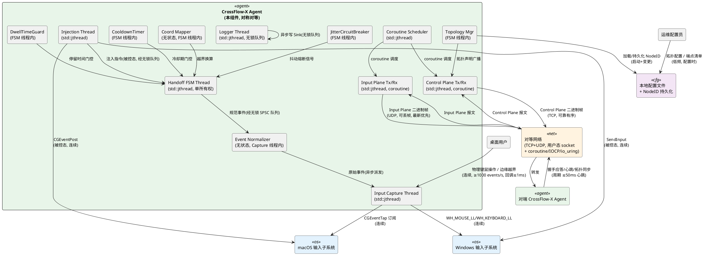

**通信协议与频率说明**：

| 交互链路 | 协议 | 频率/特性 | 平面归属 | 线程归属 |
|---------|------|----------|---------|---------|
| 用户 → 输入捕获 | OS 事件回调 | 连续，≥1000 events/s，回调≤1ms | 本地 | Capture Thread |
| 输入捕获 → 规范化 | 进程内异步派发 | 同上 | 本地 | Capture Thread |
| 规范化 → FSM | 无锁 SPSC 队列 | 事件递交 | 本地 | Capture → FSM Thread |
| Input Plane 转发 | UDP 二进制帧 + coroutine | 连续，可丢帧，最新优先 | Input Plane | Input Plane Thread |
| Control Plane 握手 | TCP 二进制帧 + coroutine | Handoff 触发时，可靠有序 | Control Plane | Control Plane Thread |
| 心跳 | TCP 二进制帧 | 周期 ≤50ms | Control Plane | Control Plane Thread |
| 拓扑同步 | TCP 二进制帧 | 变更触发，可靠有序 | Control Plane | Control Plane Thread |
| 配置加载 | 本地文件 | 启动+低频变更 | 本地 | Main Thread |
| 日志写入 | 异步无锁队列 | 高频，不阻塞热路径 | 本地 | Logger Thread |

**部署形态**：每台端点运行一个 Agent 进程；Agent 间通过对等网络直连，无中心节点；第一版限定局域网部署（DFX 红线基于局域网内延迟目标）。

**线程数核算**（契约⑦ ≤8）：主线程(1) + Capture(1) + Injection(1) + Input Plane Tx/Rx(1) + Control Plane Tx/Rx(1) + FSM(1) + Logger(1) + Scheduler(1) = **8 个**，达上界。Coroutine 调度器复用 Input/Control Plane 线程的 coroutine await 上下文，不额外增线程（若实现需要独立调度器则合并 Scheduler 与某平面线程以守≤8 红线）。

### 2.1.2 服务/组件总体架构

下图展示 Agent 内部的模块划分、核心类职责与依赖关系。模块按九个职责域组织（CF0-S01～S05 + 跨平台抽象层 F + 防抖动 G + 并发 H + 契约保障 I + C++20 设施 J；其中 H/I/J 为横切关注点，不单独画组件，融入各模块实现）。

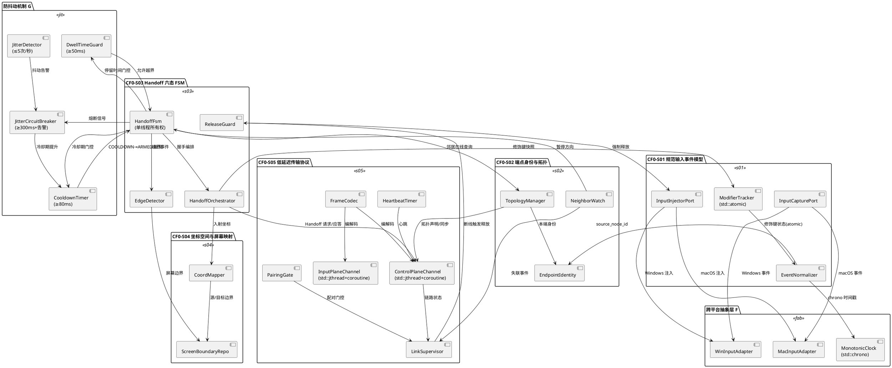

**模块职责说明**：

| 模块 | 职责 | 关键类 | 配置项 |
|-----|------|--------|--------|
| CF0-S01 | 平台无关事件规范化、修饰键追踪（atomic）、注入（span 批量） | EventNormalizer, ModifierTracker | 事件队列容量（默认 256） |
| CF0-S02 | NodeID 生成持久化、拓扑视图维护、邻居失联监视、循环回环 | TopologyManager, EndpointIdentity | 拓扑配置文件路径 |
| CF0-S03 | **六态 FSM**（单线程所有权）、边缘检测、握手编排、断线释放（经 RECOVERY） | HandoffFsm, HandoffOrchestrator | 握手超时（默认 20ms）、裁决策略 |
| CF0-S04 | 屏幕边界管理、越界换算、入射钳制（禁画面依赖） | CoordMapper, ScreenBoundaryRepo | 多显示器合并策略 |
| CF0-S05 | 二进制编解码、双平面通道（jthread+coroutine）、心跳、断线判定、配对门控 | FrameCodec, ControlPlaneChannel, InputPlaneChannel | 心跳周期（≤50ms）、断线阈值（3 周期）、重传上限 |
| 抽象层 F | macOS/Windows 输入捕获注入、单调时钟（chrono） | MacInputAdapter, WinInputAdapter, MonotonicClock | 无（平台编译期选择） |
| 防抖动 G | 冷却期定时器、最小停留检测、抖动频率检测、熔断器 | CooldownTimer, DwellTimeGuard, JitterCircuitBreaker | 冷却期≥80ms、停留≥50ms、熔断≥300ms |
| 并发 H | 8 线程模型、无锁队列、coroutine 调度、终止清理 | ThreadModel, SpscQueue, CoroutineScheduler | 线程数≤8、清理≤200ms |
| 契约 I | 7 契约审查点 | ContractAuditor | 审查脚本 |
| C++20 J | 编译基线、9 设施使用、4 禁止项 | CMake 配置 | CXX_STANDARD=20 |

**配置项取值策略**：

- **握手超时**：20ms（DFX 红线 30ms 端到端，预留 10ms 给注入与网络抖动）。
- **心跳周期**：50ms（DFX 红线 ≤50ms，取上限以减少控制流量）。
- **断线判定阈值**：3 个心跳周期 = 150ms（DFX 红线 ≤200ms，留 50ms 余量）。
- **Input Plane 队列容量**：256 帧（积压超阈值丢过期帧，保证最新优先）。
- **重传上限**：5 次（超限判断线，触发释放）。
- **冷却期**：80ms（DFX 红线 ≥80ms，取下限以最快恢复；熔断时提升至 300ms）。
- **最小停留时间**：50ms（DFX 红线 ≥50ms，取下限）。
- **抖动频率阈值**：5 次/秒（DFX 红线 ≤5 次/秒，超限触发熔断）。
- **熔断连续阈值**：3 次（连续 3 次熔断向运维告警）。
- **FSM 转移延迟预算**：≤1ms（禁 I/O、禁锁等待、禁异常）。
- **线程数上界**：8（含主线程）。
- **终止清理预算**：≤200ms。

### 2.1.3 实现设计文档

#### 2.1.3.1 Handoff 六态状态机设计

下图展示端点 Handoff 六态有限状态机（spec §5.3.1.2 / 契约②）。每个端点在任意时刻处于且仅处于六态之一。状态转移由 `HandoffOrchestrator` 驱动，FSM 单线程所有权（契约⑦），所有转移携带 `TraceId` 用于链路追踪。转移延迟 ≤1ms（spec §4.1.9）。

**v3 修订（修改 2）**：补全超时/失败路径，明确 PENDING/ACK/ACTIVE 在超时、无效应答、断线场景下必须经 RECOVERY 态清理后再回 ARMED/COOLDOWN，**绝不允许在失败路径上丢失本地控制权**（CF0 Architecture Safety Invariant，见 §2.17）。

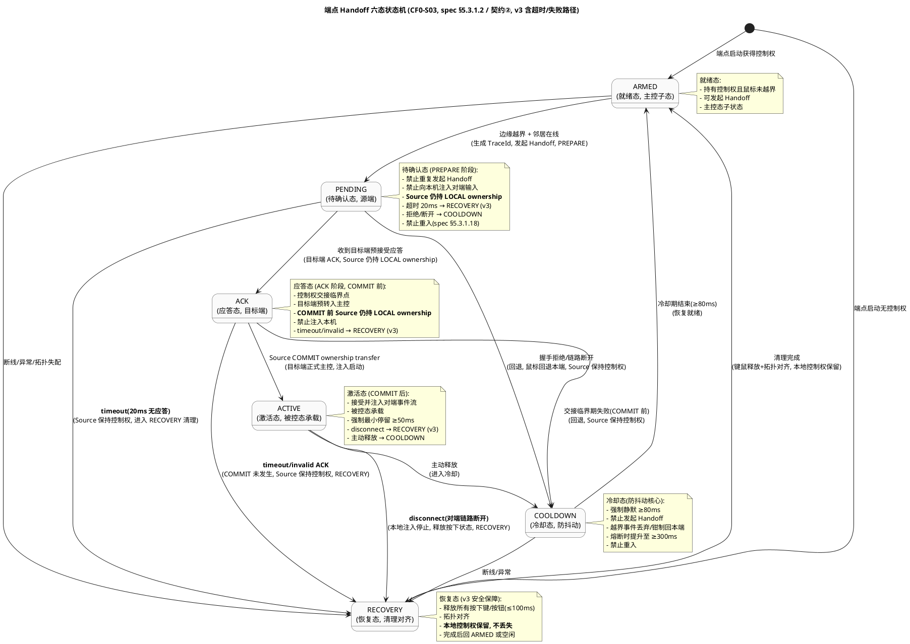

**v3 修订后的合法转移路径**（与 spec §5.3.1.2 完全一致 + 显式化超时/失败路径）：

| # | 转移 | 触发条件 | 处理策略 | 不变量 |
|---|------|---------|---------|--------|
| 1 | ARMED → PENDING | 边缘越界 + 邻居在线 | 生成 TraceId，发送 Handoff 请求（PREPARE），启动 20ms 超时定时器 | **Source 仍持 LOCAL ownership** |
| 2 | PENDING → ACK | 收到目标端预接受应答 | 源端准备转被控，目标端预转入主控（ACK 阶段，COMMIT 未发生） | **Source 仍持 LOCAL ownership** |
| 3 | PENDING → COOLDOWN | 握手拒绝/链路断开 | 鼠标回退本端，启动冷却期 ≥80ms | **Source 保持控制权** |
| 4 | **PENDING → RECOVERY（v3 显式）** | **握手超时 20ms 无应答** | **Source 保持控制权，进入 RECOVERY 清理后回 ARMED** | **本地控制权不丢失** |
| 5 | ACK → ACTIVE | Source COMMIT ownership transfer（控制权交接完成） | 目标端正式主控，启动注入，启动最小停留 ≥50ms 计时 | 主控态数量 ≤1 |
| 6 | ACK → COOLDOWN | 交接临界期失败（COMMIT 前） | 回退，启动冷却期 | **Source 保持控制权** |
| 7 | **ACK → RECOVERY（v3 显式）** | **ACK 超时 / invalid ACK 应答** | **COMMIT 未发生，Source 保持控制权，RECOVERY 清理** | **本地控制权不丢失** |
| 8 | ACTIVE → COOLDOWN | 主动释放 | 停止注入，启动冷却期 | 控制权释放 |
| 9 | **ACTIVE → RECOVERY（v3 显式）** | **对端链路断开 disconnect** | **本地注入停止，释放按下状态（≤100ms），RECOVERY** | **本地不出现粘键/双控** |
| 10 | COOLDOWN → ARMED | 冷却期结束（≥80ms，熔断时 ≥300ms） | 恢复就绪 | 可发起 Handoff |
| 11 | RECOVERY → ARMED | 清理完成（键鼠释放+拓扑对齐） | 恢复就绪 | 无粘键，**本地控制权保留** |
| 12 | 任意态 → RECOVERY | 断线/异常/拓扑失配 | 释放键鼠（≤100ms），对齐拓扑 | 安全状态，**不丢失本地控制权** |

**核心安全性质（v3 必入验收，对应 CF0 Architecture Safety Invariant §2.17）**：

> **任何 Handoff 失败不得丢失本地控制权。**
>
> 典型场景：Mac PENDING → Windows 无响应 → TIMEOUT → RECOVERY → Mac 继续拥有控制权。
>
> 禁止反例：Mac PENDING → Windows 无响应 → Mac 键鼠也失效（**架构破坏**）。
>
> 证明思路：在 PREPARE → ACK → COMMIT → ACTIVE 事务模型（§2.5.6）下，COMMIT 之前 Source 永远保持 LOCAL ownership；任何超时/拒绝/invalid/disconnect 都在 COMMIT 之前发生，因此 Source 的本地控制权在失败路径上恒成立；RECOVERY 态仅做键鼠释放与拓扑对齐，不释放本地控制权。

**禁止转移**（FSM 不可重入，spec §5.3.1.18）：
- PENDING/ACK/COOLDOWN/RECOVERY 期间新越界事件：**排队或丢弃**，禁止重入状态机打断进行中的转移。
- COOLDOWN 期间禁止发起任何 Handoff（spec §5.3.1.17）。
- 禁止跳过 COOLDOWN 直接 PENDING → ARMED 或 ACK → ARMED（契约②验收条件 b）。
- **v3 新增禁止**：禁止任何失败路径直接跳过 RECOVERY 回 ARMED（PENDING timeout → ARMED、ACK invalid → ARMED 均非法，必须经 RECOVERY 清理保证 Safety Invariant）。

**六态与三态宏观映射**（spec §5.3.1.1）：

| HandoffState（六态） | EndpointState（三态宏观） | 语义 |
|---------------------|-------------------------|------|
| ARMED | 主控态（Controlling） | 持有控制权，可发起 Handoff |
| PENDING | 主控态（Controlling） | 持有控制权，握手进行中 |
| COOLDOWN | 主控态（Controlling） | 持有控制权，冷却静默 |
| ACTIVE | 被控态（Controlled） | 接受对端事件注入 |
| RECOVERY | 空闲态（Idle） | 清理对齐过渡 |
| （空闲态稳态） | 空闲态（Idle） | RECOVERY 完成后若未获控制权则停留空闲 |

#### 2.1.3.2 防抖动四重契约实现设计

防抖动机制由四个协同组件构成，全部运行在 FSM 专属线程内（无跨线程锁竞争），实现 spec §4.2.6-8 / §5.3.1.11-13 / 契约② 的四重契约。

```plantuml
@startuml
title 防抖动四重契约协同 (spec §4.2.6-8 / 契约②)

rectangle "CooldownTimer\n(第一道防线)" as CT {
    :Handoff 完成/回退事件;
    :启动冷却期 ≥80ms;
    :冷却期内越界事件\n→ 丢弃/钳制回本端边缘内侧;
    :冷却结束 → COOLDOWN→ARMED;
}

rectangle "DwellTimeGuard\n(第二道防线)" as DT {
    :ACTIVE 进入事件;
    :启动停留计时 ≥50ms;
    :停留未达标 + 越界事件\n→ 忽略;
    :停留达标 → 允许越界触发;
}

rectangle "JitterDetector\n(第三道防线)" as JD {
    :Handoff 完成事件流;
    :1 秒滑动窗口统计\n同一对端点 Handoff 次数;
    :>5 次/秒 → 触发熔断信号;
}

rectangle "JitterCircuitBreaker\n(第四道防线)" as JCB {
    :熔断信号;
    :冷却期提升至 ≥300ms;
    :记录抖动告警;
    :连续 3 次熔断\n→ 向运维告警要求人工介入;
}

CT --> JCB : 冷却期参数
JD --> JCB : 抖动告警
JCB --> CT : 提升冷却期至 300ms
@enduml
```

**四重契约对应关系**：

| 契约 | spec 条目 | 实现组件 | 关键参数 | 验收条件 |
|------|---------|---------|---------|---------|
| ① 冷却期强制静默 | §4.2.6 / §5.3.1.11 | CooldownTimer | ≥80ms（熔断时 ≥300ms） | 冷却期内越界事件被丢弃，鼠标钳制回边缘内侧 |
| ② 最小停留时间 | §4.2.7 / §5.3.1.12 | DwellTimeGuard | ≥50ms | 停留未达标越界事件被忽略 |
| ③ 抖动频率上限 + 熔断 | §4.1.8 / §4.2.8 / §5.3.1.13 | JitterDetector + JitterCircuitBreaker | ≤5 次/秒，熔断 ≥300ms，连续 3 次告警 | 1 秒内 6 次 Handoff → 触发熔断；连续 3 次熔断 → 运维告警 |
| ④ FSM 不可重入 | §4.2.10 / §5.3.1.18 | HandoffFsm 守卫 | PENDING/ACK/COOLDOWN/RECOVERY 期间 | 新越界事件排队或丢弃，禁止重入 |

**实现策略**：
- **CooldownTimer**：基于 `std::chrono::steady_clock` 计时；FSM 进入 COOLDOWN 态时启动计时；越界事件到达时检查剩余时间，未到期则丢弃并钳制鼠标回本端边缘内侧（通过 `IInputInjector` 注入钳制事件）；到期则触发 COOLDOWN→ARMED 转移。
- **DwellTimeGuard**：FSM 进入 ACTIVE 态时启动计时；记录鼠标位置流，若鼠标离开屏幕则重置计时；越界事件到达时检查停留时长，未达标则忽略；达标则放行至 EdgeDetector。
- **JitterDetector**：维护以"端点对(NodeId, NodeId)"为键的滑动窗口计数器（环形缓冲，1 秒窗口）；每次 Handoff 完成递增计数；窗口内计数 >5 则触发熔断信号。
- **JitterCircuitBreaker**：维护以"端点对"为键的熔断状态机（Normal → Tripped → Escalated）；收到熔断信号时将该端点对的冷却期提升至 300ms 并记录告警 `CFX-W-HANDOFF-JITTER`；连续 3 次熔断转为 Escalated 并告警 `CFX-E-HANDOFF-JITTER-ESCALATE` 要求人工介入。
- **FSM 不可重入守卫**：`HandoffFsm` 在 `submit(event)` 入口检查当前态，若处于 PENDING/ACK/COOLDOWN/RECOVERY 则将越界事件入队（队列容量 16）或丢弃（队列满时），不调用转移函数。

#### 2.1.3.3 并发与线程安全模型设计

下图展示 Agent 进程的 8 线程架构、职责、所有权与通信路径（spec §4.6 / 契约⑦）。

```plantuml
@startuml
title CrossFlow-X Agent 线程架构 (spec §4.6 / 契约⑦, ≤8 线程)

rectangle "Main Thread\n(主线程, std::jthread)" as Main {
    :配置加载/信号处理/生命周期;
}

rectangle "Capture Thread\n(输入捕获, std::jthread)" as Cap {
    :平台事件回调(≤1ms返回);
    :轻量采集 + 异步派发;
}

rectangle "Injection Thread\n(输入注入, std::jthread)" as Inj {
    :消费 Input Plane 事件流;
    :被控态注入本机;
}

rectangle "Input Plane Thread\n(收发, std::jthread+coroutine)" as Ip {
    :Input Plane 帧收发;
    :coroutine 异步 I/O;
    :最新优先丢帧;
}

rectangle "Control Plane Thread\n(收发, std::jthread+coroutine)" as Cp {
    :Control Plane 帧收发;
    :coroutine 异步 I/O;
    :可靠有序重传;
}

rectangle "FSM Thread\n(Handoff FSM, std::jthread)" as Fsm {
    :FSM 状态读写(单所有权);
    :防抖动四重机制;
    :拓扑视图维护;
}

rectangle "Logger Thread\n(日志, std::jthread)" as Log {
    :消费无锁队列;
    :异步写 Sink;
}

rectangle "Scheduler Thread\n(coroutine 调度, std::jthread)" as Sched {
    :coroutine 调度;
    :独立于 FSM/Capture;
}

' 通信路径(均无锁 SPSC 队列或 atomic)
Main --> Fsm : 配置/信号(atomic)
Cap --> Fsm : 规范事件(SPSC 无锁队列)
Fsm --> Inj : 注入指令(SPSC 无锁队列)
Fsm --> Ip : Input Plane 发送(SPSC 无锁队列)
Fsm --> Cp : Control Plane 发送(SPSC 无锁队列)
Ip --> Inj : Input Plane 接收事件(SPSC 无锁队列)
Cp --> Fsm : Control Plane 接收报文(SPSC 无锁队列)
Cap --> Log : 日志(无锁 MPMC 队列)
Fsm --> Log : 日志(无锁 MPMC 队列)
Ip --> Log : 日志(无锁 MPMC 队列)
Cp --> Log : 日志(无锁 MPMC 队列)
Sched --> Ip : coroutine 调度
Sched --> Cp : coroutine 调度

note right of Fsm
  FSM 单线程所有权(契约⑦):
  - 状态读写由本线程串行
  - 跨线程事件经无锁 SPSC 队列
  - 禁止共享可变状态加锁
  - 转移延迟 ≤1ms
end note

note right of Cap
  捕获回调轻量化(契约⑦):
  - 回调内禁锁等待/IO/内存分配
  - ≤1ms 返回
  - 异步派发到 FSM Thread
end note
@enduml
```

**8 线程职责与所有权声明**（spec §4.6.1 显式线程模型）：

| # | 线程名 | 类型 | 职责 | 所有权 | 生命周期 | 通信入 | 通信出 |
|---|--------|------|------|--------|---------|--------|--------|
| 1 | Main | std::jthread | 配置加载、信号处理、生命周期管理 | Agent 进程 | 进程全程 | 用户信号 | 配置/信号(atomic) |
| 2 | Capture | std::jthread | 平台输入捕获回调（≤1ms 返回）、轻量采集、异步派发 | Agent 进程 | 会话全程 | 平台事件 | 规范事件(SPSC→FSM)、日志(MPMC→Logger) |
| 3 | Injection | std::jthread | 消费 Input Plane 事件流、被控态注入本机 | Agent 进程 | 会话全程 | 注入指令(SPSC←FSM)、Input 事件(SPSC←Input Plane) | 平台注入 API、日志 |
| 4 | Input Plane | std::jthread + coroutine | Input Plane 帧收发、coroutine 异步 I/O、最新优先丢帧 | Agent 进程 | 链路全程 | Input 发送(SPSC←FSM)、网络帧 | Input 接收事件(SPSC→Injection)、日志 |
| 5 | Control Plane | std::jthread + coroutine | Control Plane 帧收发、coroutine 异步 I/O、可靠有序重传 | Agent 进程 | 链路全程 | Control 发送(SPSC←FSM)、网络帧 | Control 接收报文(SPSC→FSM)、日志 |
| 6 | FSM | std::jthread | Handoff FSM 状态读写（单所有权）、防抖动四重机制、拓扑视图维护 | Agent 进程 | 会话全程 | 规范事件(SPSC←Capture)、Control 报文(SPSC←Control Plane)、配置(atomic) | 注入指令(SPSC→Injection)、Input 发送(SPSC→Input Plane)、Control 发送(SPSC→Control Plane)、日志 |
| 7 | Logger | std::jthread | 消费无锁 MPMC 队列、异步写 Sink | Agent 进程 | 进程全程 | 日志条目(MPMC←所有线程) | Sink(文件/stdout) |
| 8 | Scheduler | std::jthread | coroutine 调度（独立于 FSM/Capture） | Agent 进程 | 会话全程 | coroutine 任务 | coroutine 完成通知 |

**无锁策略**（spec §4.6.5）：

| 通信链路 | 数据结构 | 同步原语 | 理由 |
|---------|---------|---------|------|
| Capture → FSM | SPSC 环形缓冲 | `std::atomic<size_t>` head/tail | 单生产者单消费者，无锁无竞争 |
| FSM → Injection | SPSC 环形缓冲 | `std::atomic<size_t>` | 同上 |
| FSM → Input Plane | SPSC 环形缓冲 | `std::atomic<size_t>` | 同上 |
| FSM → Control Plane | SPSC 环形缓冲 | `std::atomic<size_t>` | 同上 |
| Input Plane → Injection | SPSC 环形缓冲 | `std::atomic<size_t>` | 同上 |
| Control Plane → FSM | SPSC 环形缓冲 | `std::atomic<size_t>` | 同上 |
| 所有线程 → Logger | MPMC 环形缓冲 | `std::atomic` + 轻核数 sharding | 多生产者单消费者，分片降低竞争 |
| FSM 状态快照 | `std::atomic<HandoffState>` | atomic | 跨线程读快照，FSM 线程写 |
| 链路状态 | `std::atomic<LinkState>` | atomic | 同上 |
| 修饰键状态 | `std::atomic<ModifierState>` | atomic | 同上 |

**热路径禁锁清单**（spec §4.6.5 / §4.6.6）：
- Input Plane 事件转发与注入路径：禁 `std::mutex::lock`、禁阻塞 I/O、禁 sleep。
- FSM 状态转移路径：禁 I/O、禁锁等待、禁异常（≤1ms）。
- 捕获回调：禁锁等待、禁 I/O、禁内存分配、禁跨平面调用（≤1ms）。
- 非热路径控制报文处理：允许互斥量，持锁 ≤100us。

**终止与清理契约**（spec §4.6.9）：
- 进程收到终止信号（SIGTERM/SIGINT）→ Main Thread 通过 `std::jthread::request_stop()` 通知所有线程。
- 各线程在 ≤200ms 内完成清理：Capture 释放钩子、Injection flush 释放清单、Input/Control Plane 关闭链路、FSM 转 RECOVERY 释放键鼠、Logger flush 队列、Scheduler 取消所有 coroutine。
- `std::jthread` 析构自动 join，保证无泄漏。

#### 2.1.3.4 双向同时触发裁决流程

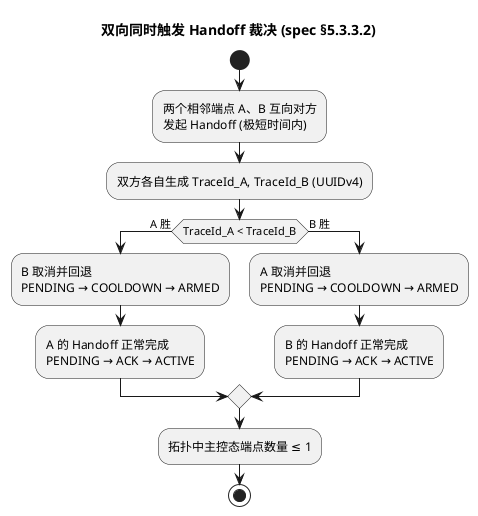

**裁决策略选择理由**：`TraceId` 为 UUIDv4（u128），全局唯一且可比较；以 `TraceId` 较小者胜避免时间戳跨端时钟同步问题，无需 NTP 依赖，符合"不依赖固定 IP/外部时间服务"约束。败方经 COOLDOWN 回退（必经冷却期，契约②）。

#### 2.1.3.5 断线释放事务设计

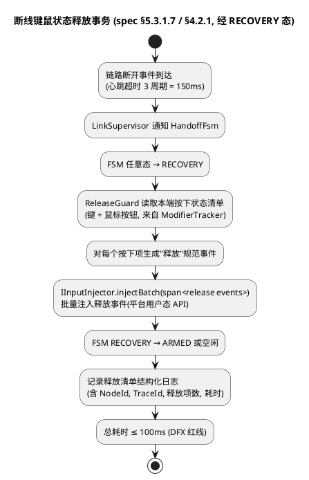

**事务边界**：释放操作为本地原子事务，不涉及对端确认（对端已断线）；释放清单写入结构化日志后事务结束。若注入 API 部分失败，重试剩余项直至 100ms 预算耗尽，超时项记告警但不阻塞状态转移。**必经 RECOVERY 态**（契约②，不直接从 ACTIVE 跳回 ARMED）。

#### 2.1.3.6 双平面隔离扩展点设计

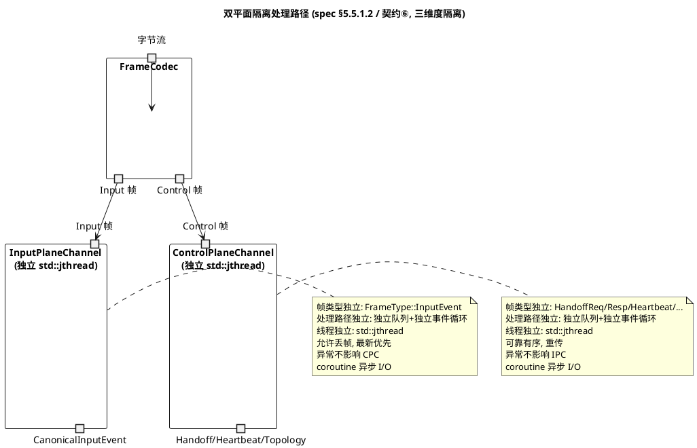

**三维度隔离**（契约⑥）：
1. **帧类型隔离**：`Frame.plane` 字段（0=Control, 1=Input）独立标识；`FrameType` 枚举 Input Plane 仅 `InputEvent`，Control Plane 含 Handoff/Heartbeat/Topology/Pairing。
2. **处理路径隔离**：独立队列、独立事件循环、独立重传/丢帧策略。
3. **线程隔离**：各持独立 `std::jthread`，无共享可变状态；跨平面交换经无锁队列。

**扩展点**：未来 CF8 强加密阶段可为每个平面独立挂载加密层，互不影响。

---

## 2.2 接口设计

### 2.2.1 总体设计

接口按职责域分为八组，全部为进程内接口（CF0 不暴露跨进程 RPC）。接口命名遵循领域术语（spec.md 第 2 章），类型安全优先，禁止 `any`/字符串 Map 传参。**全部接口签名对齐 C++20 设施**（spec §8.2）：可失败操作返回 `std::expected<T, CfxError>`，序列参数用 `std::span`，时间用 `std::chrono::duration`，模板参数用 concepts 约束，多态对象用 `std::variant` + `std::visit`，枚举用 `enum class`。

| 接口组 | 接口数量 | 稳定性 | 说明 |
|-------|---------|--------|------|
| 输入捕获/注入（IInputCapture / IInputInjector） | 2 | 稳定 | 平台抽象，编译期选择实现 |
| 事件规范化（IEventNormalizer） | 1 | 稳定 | CF0-S01 核心 |
| 拓扑管理（ITopologyManager） | 1 | 稳定 | CF0-S02 核心 |
| Handoff FSM + 编排（IHandoffFsm / IHandoffOrchestrator） | 2 | 稳定 | CF0-S03 核心，**v2 新增 IHandoffFsm** |
| 坐标映射（ICoordMapper） | 1 | 稳定 | CF0-S04 核心 |
| 传输通道（IControlPlaneChannel / IInputPlaneChannel） | 2 | 稳定 | CF0-S05 核心 |
| 防抖动机制（ICooldownTimer / IDwellTimeGuard / IJitterCircuitBreaker） | 3 | 稳定 | **v2 新增**，CF0-S03 防抖动 |
| 并发模型（IThreadModel） | 1 | 稳定 | **v2 新增**，契约⑦ 保障 |

**接口变更策略**：CF0 阶段所有接口为新增或 v2 升级，冻结后变更需递增版本号并保证向前兼容（spec §4.5.2）。新增可选参数以默认值保证旧调用方兼容。

**类型安全约束**（spec §8.2）：

- 所有接口参数使用强类型结构体/接口，禁止 `any`、禁止字符串 Map。
- 枚举值显式定义为 `enum class`（spec §8.2.9），禁止裸 enum、禁止隐式转换。
- 可空字段使用 `std::optional<T>` 显式标注，禁止用空字符串/零值表示无。
- 二进制协议字段使用固定宽度整数（u8/u16/u32/u64），字节序固定为 Little-Endian。
- 可失败操作返回 `std::expected<T, CfxError>`，禁止抛异常（spec §8.2.2 / §8.3.3）。
- 只读序列参数使用 `std::span<const T>`，禁止裸指针+长度或 `std::vector` 拷贝（spec §8.2.1）。
- 时间参数使用 `std::chrono::duration` 强类型，禁止裸整数毫秒/微秒（spec §8.2.6）。
- 模板参数使用 C++20 concepts 约束，禁止 SFINAE / static_assert（spec §8.2.5）。
- 多态对象使用 `std::variant` + `std::visit`，禁止裸 union（spec §8.2.7）。
- 跨线程共享状态使用 `std::atomic` 且 `is_lock_free()`，禁止热路径互斥量（spec §8.2.8）。

### 2.2.2 接口清单

#### 2.2.2.1 输入捕获接口（IInputCapture）

```cpp
// C++20 signature, spec §8.2 设施对齐
class IInputCapture {
public:
    virtual ~IInputCapture() = default;

    // 启动本机输入捕获，订阅原始事件流
    // onEvent 满足 CaptureCallback concept（轻量、≤1ms 返回、禁锁/IO/分配）
    virtual std::expected<CaptureHandle, CfxError>
    start(std::invocable<const RawInputEvent&> auto&& onEvent) = 0;

    // 停止捕获
    virtual void stop(CaptureHandle handle) = 0;

    // 查询本端屏幕边界（用于边缘检测）
    virtual ScreenBoundary queryScreenBoundary() = 0;
};
```

- **业务说明**：用户态订阅本机输入事件流，macOS 实现基于 CGEventTap，Windows 实现基于 WH_MOUSE_LL/WH_KEYBOARD_LL。回调在 Capture Thread 执行，仅轻量采集 + 异步派发到 FSM Thread（契约⑦）。
- **前置条件**：macOS 已获 Accessibility 权限；Windows 进程具备钩子安装能力。
- **后置条件**：启动后系统持续回调 onEvent 直到 stop 调用。
- **异常映射**：权限缺失 → `CFX-E-CAP-PERM`；平台 API 失败 → `CFX-E-CAP-API`。
- **调用示例**：
```cpp
auto result = capture->start([&](const RawInputEvent& raw) {
    // 轻线程异步派发到 FSM Thread（无锁 SPSC 队列）
    fsmQueue->push(raw);
});
if (!result) logger.error("capture start failed", result.error());
```

#### 2.2.2.2 输入注入接口（IInputInjector）

```cpp
class IInputInjector {
public:
    virtual ~IInputInjector() = default;

    // 向本机注入规范输入事件（被控态使用）
    virtual InjectResult inject(const CanonicalInputEvent& event) = 0;

    // 批量注入（std::span 零拷贝视图，断线释放清单专用）
    virtual InjectResult injectBatch(std::span<const CanonicalInputEvent> events) = 0;

    // 强制释放所有按下状态（断线释放专用，经 RECOVERY 态）
    virtual ReleaseResult releaseAllPressed(const PressedStateSnapshot& pressed) = 0;
};
```

- **业务说明**：被控态下将规范事件注入本机输入子系统；macOS 用 CGEventPost，Windows 用 SendInput。批量注入用 `std::span` 零拷贝（spec §8.2.1）。
- **前置条件**：本端处于被控态（ACTIVE）；源端 NodeID 校验通过。
- **后置条件**：本机输入子系统收到对应事件。
- **异常映射**：注入失败 → `CFX-E-INJ-API`；权限缺失 → `CFX-E-INJ-PERM`。
- **调用示例**：
```cpp
std::array<CanonicalInputEvent, 8> releaseEvents = buildReleases(pressed);
auto result = injector->injectBatch(std::span{releaseEvents});
if (result.failedCount > 0) logger.warn("inject partial fail", result);
```

#### 2.2.2.3 事件规范化接口（IEventNormalizer）

```cpp
class IEventNormalizer {
public:
    virtual ~IEventNormalizer() = default;

    // 将平台原始事件转换为规范输入事件（std::expected 错误处理）
    virtual std::expected<CanonicalInputEvent, CfxError>
    normalize(const RawInputEvent& raw) = 0;

    // 查询当前修饰键状态快照（atomic 读取，无锁）
    virtual ModifierState snapshotModifiers() = 0;

    // 强制对齐修饰键状态（Handoff 后同步用）
    virtual void alignModifiers(const ModifierState& target) = 0;
};
```

- **业务说明**：实现 spec §5.1.1 全部规则——序号单调递增（`std::atomic<u64>`）、时间戳单调（`std::chrono::steady_clock`）、修饰键独立追踪（`std::atomic<ModifierState>`）、源端 NodeID 标注、未知类型丢弃。**平台特殊逻辑隔离在适配层**（契约①）。
- **前置条件**：本端 EndpointIdentity 已初始化（NodeID 已生成）。
- **后置条件**：产出的 CanonicalInputEvent 满足 spec §6.1 全部字段约束。
- **异常映射**：未知事件类型 → `CFX-W-NORM-UNKNOWN`；序号回跳 → `CFX-W-NORM-SEQBACK`。
- **调用示例**：
```cpp
auto event = normalizer->normalize(raw);
if (event) inputPlane->send(*event);
else logger.warn("normalize failed", event.error());
```

#### 2.2.2.4 拓扑管理接口（ITopologyManager）

```cpp
class ITopologyManager {
public:
    virtual ~ITopologyManager() = default;

    // 加载本端身份（NodeID 持久化）
    virtual std::expected<EndpointIdentity, CfxError> loadIdentity() = 0;

    // 加载拓扑配置（端点清单+邻居关系），校验线性+回环+段数≥2（契约③）
    virtual std::expected<TopologyView, CfxError>
    loadTopology(const TopologyConfig& config) = 0;

    // 当前拓扑视图
    virtual TopologyView currentView() = 0;

    // 合并收到的对端拓扑声明
    virtual std::expected<MergeResult, CfxError>
    mergeRemoteDeclaration(const TopologyDeclaration& decl) = 0;

    // 查询指定方向的邻居（左/右，含回环映射）
    virtual std::optional<EndpointIdentity> neighbor(EdgeDirection direction) = 0;

    // 标记邻居失联/恢复
    virtual void setNeighborState(const NodeId& nodeId, NeighborState state) = 0;

    // 本端屏幕边界变更同步
    virtual void updateScreenBoundary(const ScreenBoundary& boundary) = 0;

    // 循环切换支持查询（契约③）
    virtual bool isCircular() const = 0;
    virtual std::size_t segmentCount() const = 0;  // 必须 ≥2，禁两点退化
};
```

- **业务说明**：实现 spec §5.2.1 全部规则——NodeID 唯一性、IP 解耦、线性排列、邻居数量上限、一致视图、平台声明、**循环回环支持（契约③）**、**禁两点退化（segmentCount ≥2）**。
- **前置条件**：本端 EndpointIdentity 已初始化。
- **后置条件**：拓扑视图版本号单调递增；全拓扑在有限时间内一致。
- **异常映射**：NodeID 冲突 → `CFX-E-TOPO-NODEID-DUP`；邻居数量超限 → `CFX-E-TOPO-NEIGHBOR-OVER`；非线形拓扑 → `CFX-E-TOPO-NONLINEAR`；两点退化 → `CFX-E-TOPO-TWOPOINT-DEGEN`（v2 新增）。
- **调用示例**：
```cpp
auto right = topo->neighbor(EdgeDirection::Right);
if (right && neighborWatch->isOnline(right->nodeId) && topo->segmentCount() >= 2) {
    handoffOrchestrator->initiate(req);
}
```

#### 2.2.2.5 Handoff FSM 接口（IHandoffFsm）—— v2 新增

```cpp
// Handoff 六态枚举（spec §5.3.1.2 / 契约②）
enum class HandoffState : u8 {
    Armed,      // 就绪态，可发起 Handoff
    Pending,    // 待确认态，源端等待应答
    Ack,        // 应答态，目标端预转入主控
    Active,     // 激活态，被控态承载
    Cooldown,   // 冷却态，防抖动
    Recovery,   // 恢复态，清理对齐
};

// 六态 → 三态宏观映射（spec §5.3.1.1）
EndpointState toMacroState(HandoffState s) noexcept;

class IHandoffFsm {
public:
    virtual ~IHandoffFsm() = default;

    // 当前 FSM 状态（atomic 快照读取，跨线程安全）
    virtual HandoffState currentState() const = 0;

    // 提交事件到 FSM（经无锁 SPSC 队列递交 FSM 专属线程，契约⑦）
    // 返回是否被接受（PENDING/ACK/COOLDOWN/RECOVERY 期间可能排队或丢弃）
    virtual bool submit(const FsmEvent& event) = 0;

    // 冷却期剩余时间（chrono 强类型）
    virtual std::chrono::milliseconds cooldownRemaining() const = 0;

    // 最小停留时间已停留时长（chrono 强类型）
    virtual std::chrono::milliseconds dwellTimeElapsed() const = 0;

    // 注册状态转移回调（FSM 线程内调用）
    virtual void onTransition(
        std::invocable<HandoffState, HandoffState, const TraceId&> auto&& handler) = 0;
};

// FSM 事件联合类型
using FsmEvent = std::variant<
    EdgeOverflowEvent,        // 边缘越界
    HandoffAckEvent,          // 收到目标端接受
    HandoffRejectEvent,       // 收到目标端拒绝
    HandoffTimeoutEvent,      // 握手超时
    CooldownExpiredEvent,     // 冷却期结束
    DwellTimeReachedEvent,    // 最小停留达标
    LinkDownEvent,            // 链路断开
    RecoveryDoneEvent         // 恢复完成
>;
```

- **业务说明**：实现 spec §5.3.1.2 完整六态 FSM + 9 条合法转移路径 + FSM 单线程所有权（契约⑦）+ FSM 不可重入（spec §5.3.1.18）。
- **前置条件**：FSM 由专属线程持有；其他线程经 `submit()` 递交事件。
- **后置条件**：FSM 状态始终为六态之一；转移延迟 ≤1ms；非法转移拒绝并告警。
- **异常映射**：非法转移 → `CFX-E-HANDOFF-ILLEGAL-TRANS`（v2 新增）；FSM 重入尝试 → `CFX-W-HANDOFF-REENTRY`（v2 新增）。

#### 2.2.2.6 Handoff 编排接口（IHandoffOrchestrator）

```cpp
class IHandoffOrchestrator {
public:
    virtual ~IHandoffOrchestrator() = default;

    // 发起 Handoff（源端 ARMED 态调用）
    virtual std::expected<HandoffOutcome, CfxError>
    initiate(const HandoffRequest& req) = 0;

    // 处理收到的 Handoff 请求（目标端调用）
    virtual std::expected<HandoffResponse, CfxError>
    handleIncoming(const HandoffRequest& req) = 0;

    // 处理握手应答（源端调用）
    virtual void handleResponse(const HandoffResponse& resp) = 0;

    // 通知断线触发释放（经 RECOVERY 态）
    virtual void onLinkDown(const NodeId& remoteNodeId) = 0;

    // 访问底层 FSM（用于状态查询）
    virtual IHandoffFsm& fsm() = 0;
};
```

- **业务说明**：实现 spec §5.3.1 全部规则——六态 FSM 驱动、边缘触发、控制权转移、键盘跟随、单一控制权、断线释放（经 RECOVERY）、握手超时回退（经 COOLDOWN）、循环切换、握手期间注入抑制、防抖动四重契约。
- **前置条件**：`initiate` 调用时本端处于 ARMED 态且邻居在线；`handleIncoming` 调用时本端处于空闲/被控态。
- **后置条件**：握手成功后拓扑中主控态端点数量 ≤1；失败时源端经 COOLDOWN 回到 ARMED。
- **异常映射**：握手超时 → `CFX-E-HANDOFF-TIMEOUT`；双向冲突 → 裁决后败方 `CFX-I-HANDOFF-YIELD`；目标拒绝 → `CFX-I-HANDOFF-REJECT`；非法态 → `CFX-E-HANDOFF-ILLEGAL-STATE`（v2 新增）。
- **调用示例**：
```cpp
auto outcome = handoffOrchestrator->initiate({
    .traceId = TraceId::generate(),
    .sourceNodeId = self->nodeId,
    .targetNodeId = right->nodeId,
    .edgeDirection = EdgeDirection::Right,
    .overflow = 5,
    .modifierSnapshot = normalizer->snapshotModifiers(),
});
if (!outcome) logger.error("handoff failed", outcome.error());
```

#### 2.2.2.7 坐标映射接口（ICoordMapper）

```cpp
class ICoordMapper {
public:
    virtual ~ICoordMapper() = default;

    // 越界量换算为目标端入射坐标
    virtual std::expected<EntryCoord, CfxError>
    mapOverflow(const OverflowMapInput& input) = 0;

    // 入射坐标钳制到目标端有效范围
    virtual EntryCoord clamp(const EntryCoord& coord, const ScreenBoundary& targetBoundary) = 0;
};
```

- **业务说明**：实现 spec §5.4.1 全部规则——边缘方向映射、越界量换算、坐标原点、纵向比例映射、入射钳制。**禁画面依赖**（契约⑤）。
- **前置条件**：source/target Boundary 均已声明（宽高正整数）。
- **后置条件**：返回的 EntryCoord 落在目标端屏幕有效范围内。
- **异常映射**：目标边界缺失 → `CFX-E-MAP-NOBOUNARY`。

#### 2.2.2.8 控制平面通道接口（IControlPlaneChannel）

```cpp
class IControlPlaneChannel {
public:
    virtual ~IControlPlaneChannel() = default;

    // 发送控制报文（可靠有序，自动重传，coroutine 异步）
    virtual std::expected<SendResult, CfxError>
    send(const ControlMessage& msg) = 0;

    // 订阅收到的控制报文（Control Plane Thread 内回调）
    virtual void onMessage(std::invocable<const ControlMessage&> auto&& handler) = 0;

    // 链路状态订阅
    virtual void onLinkState(std::invocable<const LinkStateEvent&> auto&& handler) = 0;
};
```

- **业务说明**：实现 spec §5.5.1.3 控制平面可靠有序传输；底层使用 TCP + 自定义序号/ACK/重传 + C++20 coroutine 异步 I/O（spec §4.6.7）。**独立线程、独立队列、无共享可变状态**（契约⑥/⑦）。
- **前置条件**：链路已配对且协议版本协商成功。
- **后置条件**：报文按发送顺序送达对端；丢失重传直至成功或判断线。
- **异常映射**：重传超限 → `CFX-E-CP-RETX-OVER` → 触发断线。

#### 2.2.2.9 输入平面通道接口（IInputPlaneChannel）

```cpp
class IInputPlaneChannel {
public:
    virtual ~IInputPlaneChannel() = default;

    // 发送规范输入事件（低延迟，可丢帧，最新优先，coroutine 异步）
    virtual void send(const CanonicalInputEvent& event) = 0;

    // 订阅收到的输入事件流（Input Plane Thread 内回调）
    virtual void onEvent(std::invocable<const CanonicalInputEvent&> auto&& handler) = 0;

    // 当前队列积压量（用于背压判定，atomic 读取）
    virtual u32 backlog() = 0;
};
```

- **业务说明**：实现 spec §5.5.1.4 输入平面低延迟队列；底层使用 UDP + 最新优先丢帧策略 + C++20 coroutine 异步 I/O。**独立线程、独立队列、无共享可变状态**（契约⑥/⑦）。
- **前置条件**：链路已建立。
- **后置条件**：积压超阈值时丢弃过期帧，最新帧优先发送。
- **异常映射**：队列积压 → `CFX-W-IP-BACKLOG` 告警（不中断）。

#### 2.2.2.10 防抖动机制接口（ICooldownTimer / IDwellTimeGuard / IJitterCircuitBreaker）—— v2 新增

```cpp
// 冷却期定时器（spec §4.2.6 / §5.3.1.11，第一道防线）
class ICooldownTimer {
public:
    virtual ~ICooldownTimer() = default;

    // 启动冷却期（Handoff 完成/回退时调用）
    virtual void start(std::chrono::milliseconds duration) = 0;

    // 查询剩余时间（chrono 强类型）
    virtual std::chrono::milliseconds remaining() const = 0;

    // 冷却期是否结束
    virtual bool expired() const = 0;

    // 注册结束回调（FSM 线程内调用，触发 COOLDOWN→ARMED）
    virtual void onExpired(std::invocable<> auto&& handler) = 0;
};

// 最小停留时间检测（spec §4.2.7 / §5.3.1.12，第二道防线）
class IDwellTimeGuard {
public:
    virtual ~IDwellTimeGuard() = default;

    // 启动停留计时（进入 ACTIVE 态时调用）
    virtual void start(std::chrono::milliseconds minDwell) = 0;

    // 鼠标位置更新（用于检测是否离开屏幕）
    virtual void onCursorPosition(const EntryCoord& pos, const ScreenBoundary& boundary) = 0;

    // 停留时间是否达标
    virtual bool reached() const = 0;

    // 已停留时长
    virtual std::chrono::milliseconds elapsed() const = 0;
};

// 抖动熔断器（spec §4.2.8 / §5.3.1.13，第三+四道防线）
class IJitterCircuitBreaker {
public:
    virtual ~IJitterCircuitBreaker() = default;

    // 记录一次 Handoff 完成（用于抖动频率检测）
    virtual void recordHandoff(const NodeId& a, const NodeId& b) = 0;

    // 查询端点对的当前冷却期（可能被熔断提升至 300ms）
    virtual std::chrono::milliseconds cooldownFor(const NodeId& a, const NodeId& b) const = 0;

    // 是否已熔断
    virtual bool isTripped(const NodeId& a, const NodeId& b) const = 0;

    // 是否已升级为人工介入
    virtual bool isEscalated(const NodeId& a, const NodeId& b) const = 0;

    // 注册熔断回调（FSM 线程内调用）
    virtual void onTrip(
        std::invocable<const NodeId&, const NodeId&, std::chrono::milliseconds> auto&& handler) = 0;

    // 注册人工介入告警回调
    virtual void onEscalate(
        std::invocable<const NodeId&, const NodeId&> auto&& handler) = 0;
};
```

- **业务说明**：实现 spec §4.2.6-8 / §5.3.1.11-13 / 契约② 防抖动四重契约。全部运行在 FSM 专属线程内，无跨线程锁竞争。
- **前置条件**：由 `HandoffFsm` 在状态转移时调用。
- **后置条件**：冷却期 ≥80ms（熔断时 ≥300ms）；最小停留 ≥50ms；抖动频率 ≤5 次/秒；连续 3 次熔断告警运维。
- **异常映射**：抖动告警 → `CFX-W-HANDOFF-JITTER`（v2 新增）；人工介入 → `CFX-E-HANDOFF-JITTER-ESCALATE`（v2 新增）。

#### 2.2.2.11 并发模型接口（IThreadModel）—— v2 新增

```cpp
// 线程职责枚举（spec §4.6.1 显式线程模型）
enum class ThreadRole : u8 {
    Main,
    Capture,
    Injection,
    InputPlane,
    ControlPlane,
    Fsm,
    Logger,
    Scheduler,
};

class IThreadModel {
public:
    virtual ~IThreadModel() = default;

    // 启动所有线程（均用 std::jthread）
    virtual std::expected<void, CfxError> start() = 0;

    // 请求停止所有线程（std::jthread::request_stop）
    virtual void requestStop() = 0;

    // 等待所有线程退出（join，≤200ms 清理契约）
    virtual std::expected<void, CfxError> joinAll(std::chrono::milliseconds timeout) = 0;

    // 查询当前线程数（必须 ≤8，契约⑦）
    virtual std::size_t threadCount() const = 0;

    // 查询指定线程是否运行
    virtual bool isRunning(ThreadRole role) const = 0;

    // 注册终止清理钩子（≤200ms 内完成）
    virtual void onShutdown(std::invocable<> auto&& hook) = 0;
};
```

- **业务说明**：实现 spec §4.6 / 契约⑦ 并发与线程安全模型。8 线程均用 `std::jthread`（自动 join + 可中断）；终止清理 ≤200ms。
- **前置条件**：Agent 进程启动时调用 `start()`。
- **后置条件**：线程数 ≤8；终止时所有线程 ≤200ms 内清理退出。
- **异常映射**：线程数超限 → `CFX-E-THREAD-OVER-LIMIT`（v2 新增）；清理超时 → `CFX-E-THREAD-SHUTDOWN-TIMEOUT`（v2 新增）。

---

## 2.3 数据模型

### 2.3.1 设计目标

数据模型需支持以下业务场景与质量目标：

| 维度 | 目标 |
|-----|------|
| 业务场景 | 规范输入事件流转、端点身份与拓扑维护（含循环回环）、Handoff 六态 FSM 全过程追踪、防抖动机制状态、链路状态管理、并发线程模型 |
| 性能 | 规范事件结构对齐友好（固定宽度字段），编解码零拷贝/零分配热路径；FSM 状态 atomic 读取 |
| 容量 | 单端点事件序号 u64 不溢出；拓扑端点数第一版 ≤32（线性序列足够）；防抖动滑动窗口固定大小 |
| 扩展性 | 协议报文版本号前置；新增字段向后兼容（旧版本安全忽略）；FSM 状态枚举可扩展 |
| 兼容策略 | NodeID 持久化文件跨版本可读；拓扑配置文件 schema 版本化；C++20 编译基线跨编译器兼容 |

**领域对象与存储方式分离**：先定义平台无关领域对象（对齐 spec.md 第 2 章术语），再考虑持久化。CF0 阶段持久化仅涉及 NodeID 本地文件、拓扑配置文件、结构化日志；不引入数据库。

### 2.3.2 模型实现

下图展示核心领域对象的类图与关系（v2 增量：六态 `HandoffState`、防抖动配置与统计、线程模型）。类图只显示属性与方法签名，关系线标注多重性。禁止技术字段（如 create_time）出现在领域对象中（日志层另议）。

```plantuml
@startuml
skinparam class {
    BackgroundColor #FAFAFA
    BorderColor #424242
    AttributeIconSize 0
}

title CrossFlow-X 核心领域对象 (CF0 v2)

class CanonicalInputEvent {
  + eventId : u64
  + sourceNodeId : NodeId
  + timestamp : std::chrono::steady_clock::time_point
  + eventType : EventType
  + payload : EventPayload
  + modifierState : ModifierState
  --
  + validate() : std::expected<void, CfxError>
}

class ModifierState {
  + shift : bool
  + ctrl : bool
  + alt : bool
  + cmd : bool
  + fn : bool
}

class EventPayload {
  <std::variant, 按 eventType 多态>
}

class MouseMovePayload {
  + deltaX : i32
  + deltaY : i32
}
class MouseButtonPayload {
  + button : MouseButton
}
class WheelPayload {
  + delta : i32
  + axis : WheelAxis
}
class KeyPayload {
  + keyCode : KeyCode
}

class EndpointIdentity {
  + nodeId : NodeId
  + platform : Platform
  + screenBoundary : ScreenBoundary
  --
  + persist() : std::expected<void, CfxError>
}

class NodeId {
  + high : u64
  + low : u64
  --
  + {static} generate() : NodeId
  + isNull() : bool
}

class ScreenBoundary {
  + width : u32
  + height : u32
  + originX : u32
  + originY : u32
  --
  + isValid() : bool
}

class TopologyView {
  + endpoints : std::vector<EndpointIdentity>
  + neighborRelations : std::vector<NeighborRelation>
  + version : u64
  --
  + isLinear() : bool
  + isCircular() : bool
  + segmentCount() : std::size_t
  + neighborOf(nodeId, direction) : std::optional<EndpointIdentity>
  + hasDuplicateNodeIds() : bool
}

class NeighborRelation {
  + nodeId : NodeId
  + leftNeighbor : std::optional<NodeId>
  + rightNeighbor : std::optional<NodeId>
  + leftState : NeighborState
  + rightState : NeighborState
  --
  + neighborCount() : u8
}

class HandoffContext {
  + traceId : TraceId
  + sourceNodeId : NodeId
  + targetNodeId : NodeId
  + edgeDirection : EdgeDirection
  + overflow : u32
  + entryCoord : EntryCoord
  + modifierSnapshot : ModifierState
  + createdAt : std::chrono::steady_clock::time_point
}

class TraceId {
  + high : u64
  + low : u64
  --
  + {static} generate() : TraceId
}

class EntryCoord {
  + x : u32
  + y : u32
}

class Link {
  + localNodeId : NodeId
  + remoteNodeId : NodeId
  + protocolVersion : u16
  + state : LinkState
  + paired : bool
  + lastHeartbeatAt : std::chrono::steady_clock::time_point
}

' v2 新增：六态 FSM
class HandoffFsmState {
  + current : HandoffState
  + previous : HandoffState
  + lastTransitionAt : std::chrono::steady_clock::time_point
  + activeTraceId : std::optional<TraceId>
}

enum HandoffState {
  Armed
  Pending
  Ack
  Active
  Cooldown
  Recovery
}

' v2 新增：防抖动配置与统计
class CooldownConfig {
  + minDuration : std::chrono::milliseconds
  + escalatedDuration : std::chrono::milliseconds
  --
  + {static} default() : CooldownConfig
}

class DwellTimeConfig {
  + minDwell : std::chrono::milliseconds
  --
  + {static} default() : DwellTimeConfig
}

class JitterStats {
  + windowSize : std::chrono::milliseconds
  + handoffCountInWindow : u32
  + threshold : u32
  + consecutiveTrips : u32
  + maxConsecutiveTrips : u32
}

class EndpointPair {
  + a : NodeId
  + b : NodeId
  --
  + normalized() : EndpointPair
}

' v2 新增：线程模型
class ThreadModelConfig {
  + maxThreadCount : std::size_t
  + shutdownTimeout : std::chrono::milliseconds
  + captureCallbackBudget : std::chrono::microseconds
  + fsmTransitionBudget : std::chrono::microseconds
}

' 关系
CanonicalInputEvent --> ModifierState : 持有
CanonicalInputEvent --> EventPayload : 持有
CanonicalInputEvent --> NodeId : 引用

EventPayload <|-- MouseMovePayload
EventPayload <|-- MouseButtonPayload
EventPayload <|-- WheelPayload
EventPayload <|-- KeyPayload

EndpointIdentity --> NodeId : 持有
EndpointIdentity --> ScreenBoundary : 持有

TopologyView "1" *-- "1..*" EndpointIdentity
TopologyView "1" *-- "1..*" NeighborRelation
NeighborRelation --> NodeId : 引用

HandoffContext --> TraceId : 持有
HandoffContext --> NodeId : 引用
HandoffContext --> EntryCoord : 持有
HandoffContext --> ModifierState : 持有

Link --> NodeId : 引用

HandoffFsmState --> HandoffState : 持有
HandoffFsmState --> TraceId : 引用

JitterStats --> EndpointPair : 键

note right of CanonicalInputEvent
  规格约束:
  - eventId 单调递增不回跳
  - timestamp 单调不倒流(chrono)
  - payload 禁止含像素数据
  - validate 返回 std::expected
end note

note right of TopologyView
  规格约束:
  - 线性序列
  - 邻居数 ≤2
  - 回环支持(契约③)
  - segmentCount ≥2(禁两点退化)
  - version 单调递增
end note

note right of HandoffState
  规格约束(契约②):
  - 六态完整
  - 9 条合法转移
  - 禁止重入
  - 转移 ≤1ms
end note

note right of JitterStats
  规格约束(契约②):
  - ≤5 次/秒
  - 熔断 ≥300ms
  - 连续 3 次告警
end note
@enduml
```

**对象生命周期与创建/销毁策略**：

| 对象 | 创建 | 销毁 | 持久化 |
|-----|------|------|--------|
| EndpointIdentity | 首次启动生成 NodeId | 进程退出 | NodeId 持久化文件 |
| TopologyView | 配置加载/远程声明合并 | 被新版本替换 | 配置文件（运维侧） |
| CanonicalInputEvent | 捕获回调时由 Normalizer 创建 | 注入完成或丢弃后 GC | 不持久化（日志记录关键字段） |
| HandoffContext | 边缘越界触发时创建 | 握手完成或超时回退后归档 | 不持久化（日志记录 trace_id） |
| HandoffFsmState | FSM 初始化时创建（初始 ARMED 或 RECOVERY） | 进程退出 | 不持久化（atomic 快照） |
| CooldownConfig / DwellTimeConfig / JitterStats | Agent 启动时初始化 | 进程退出 | 不持久化（运行时配置） |
| ThreadModelConfig | Agent 启动时初始化 | 进程退出 | 不持久化（编译期常量） |
| Link | 配对成功后创建 | 主动断开或重连失败上限后销毁 | 不持久化 |

**持久化策略（不包含表结构）**：

- **NodeId 持久化文件**：本地 JSON 文件 `~/.crossflow-x/identity.json`，含 `nodeId`、`createdAt`；启动时读取，不存在则生成并写入。IP 变化不影响此文件（spec §5.2.1.2）。
- **拓扑配置文件**：运维配置员下发，本地路径 `~/.crossflow-x/topology.json`，含端点清单、邻居关系、schema 版本号；加载时校验线性排列、邻居数量上限、**回环闭合、段数≥2（契约③）**。
- **结构化日志**：JSON Lines 格式，每行含 `ts`、`level`、`nodeId`、`traceId`、`eventId`、`linkState`、`msg`、`code`（spec §4.4.1）；异步无锁队列写入。

**二进制协议帧布局（FrameCodec 使用）**：

```
+--------+--------+--------+--------+--------+--------+--------+--------+--------+
| magic  | ver    | plane  | type   | flags  | seq    | srcNodeId              |
| u8=0xCF| u8     | u8     | u8     | u8     | u32    | u128 (16B)             |
+--------+--------+--------+--------+--------+--------+--------+--------+--------+
| payloadLen (u32) | payload (变长, payloadLen 字节)                              |
+--------+--------+--------+--------+--------+--------+--------+--------+--------+

字段说明:
- magic: 固定 0xCF, 用于流同步
- ver: 协议版本号, 协商后固定
- plane: 平面标识 (0=Control, 1=Input) — 契约⑥ 帧类型隔离
- type: 帧类型 (HandoffReq/HandoffResp/Heartbeat/TopologyDecl/TopologySync/InputEvent/Pairing)
- flags: 保留位, 旧版本安全忽略
- seq: 序号 (Control Plane 用于可靠有序; Input Plane 用于去重检测)
- srcNodeId: 源端 NodeId (u128)
- payloadLen: 负载长度
- payload: 类型相关负载 (规范事件/握手/心跳/拓扑声明)
字节序: Little-Endian
```

**向前兼容策略**（spec §4.5.2 / §5.5.1.8）：

- 新版本新增字段追加在 payload 末尾，旧版本按 payloadLen 截断忽略未知尾部。
- flags 保留位用于标记可选特性，旧版本不解析。
- ver 不兼容时拒绝连接（spec §5.5.1.7）。

---

## 2.4 跨平台抽象层设计

跨平台抽象层（模块 F）通过接口隔离 macOS 与 Windows 平台差异，上层模块仅依赖抽象接口，平台实现编译期选择。严格遵守 Driverless User-Mode Architecture（spec §4.5.3）与**契约① CanonicalInputEvent 规范化隔离**（spec §7.1）。

### 2.4.1 抽象层结构

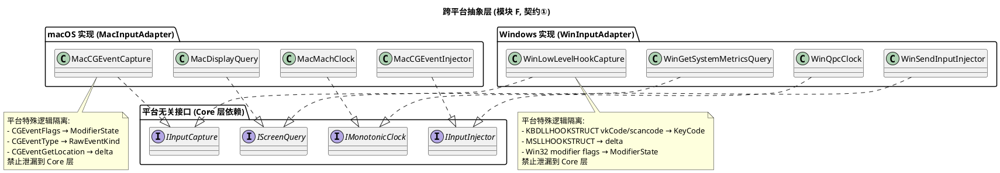

### 2.4.2 平台实现选型与理由

| 抽象接口 | macOS 实现 | Windows 实现 | 选型理由 |
|---------|-----------|-------------|---------|
| IInputCapture | CGEventTap (kCGSessionEventTap) | SetWindowsHookEx WH_MOUSE_LL + WH_KEYBOARD_LL | 均为用户态 API，无需 kext/驱动；CGEventTap 性能足够 ≥1000 events/s；低级钩子为 Windows 用户态最底层捕获 |
| IInputInjector | CGEventPost (kCGHIDEventTap) | SendInput | 用户态注入；CGEventPost 注入到 HID 层；SendInput 为 Windows 用户态注入标准 API |
| IMonotonicClock | mach_absolute_time + mach_timebase_info | QueryPerformanceCounter + QueryPerformanceFrequency | 均为高分辨率单调时钟，返回 `std::chrono::steady_clock::time_point`（spec §8.2.6） |
| IScreenQuery | CGDisplayPixelsWide/High | GetSystemMetrics SM_CXSCREEN/SM_CYSCREEN | 用户态查询主屏分辨率 |

**约束遵守**：

- 全部 API 均为用户态，不引入 kext/sys 驱动/root 特权（spec §4.5.3 / §5.5.1.9 / §5.5.1.12）。
- macOS Accessibility 权限为用户授权范畴，非内核特权。
- Windows 低级钩子无需驱动安装。
- **契约① 保障**：平台特殊逻辑（CGEventFlags、KBDLLHOOKSTRUCT vkCode/scancode 差异等）在适配层消化，Core 层禁平台条件分支（`#ifdef __APPLE__` / `#ifdef _WIN32`）与平台头文件直接引用。

### 2.4.3 平台编译期选择策略

- 通过构建系统条件编译（CMake `if(APPLE)` / `if(WIN32)`）选择平台实现。
- 上层模块仅 `#include "platform/common/platform_ports.hpp"`，链接期绑定平台实现。
- 不使用运行时 dlopen/插件机制（CF0 无需热插拔平台实现）。

### 2.4.4 契约① 审查保障机制

- **静态审查脚本**：grep Core 层源码，确认无 `#ifdef __APPLE__` / `#ifdef _WIN32` / `CGEvent` / `windows.h` 直接引用。
- **CI 门控**：每次提交运行审查脚本，违反即 CI 失败。
- **新增平台扩展**：新增 Linux 平台仅新增 `platform/linux/` 适配层实现，Core 层零改动（契约①验收条件 c）。

---

## 2.5 Handoff 六态状态机详细设计

### 2.5.1 状态集合与不变量

| 状态 | 含义 | 不变量 | 宏观映射 |
|-----|------|--------|---------|
| ARMED | 持有控制权且鼠标未越界，可发起 Handoff | 拓扑中主控态端点数量 ≤1（spec §5.3.1.5） | 主控态 |
| PENDING | 源端已发 Handoff 请求待应答（PREPARE 阶段） | **Source 仍持 LOCAL ownership**；超时 20ms → RECOVERY；拒绝/断开 → COOLDOWN；禁止重入 | 主控态 |
| ACK | 目标端收到请求预转入主控，回送应答（ACK 阶段，COMMIT 前） | **Source 仍持 LOCAL ownership**；控制权交接临界；禁止注入本机；timeout/invalid → RECOVERY | 被控态（目标端） |
| ACTIVE | Handoff 完成目标端正式主控，接受并注入事件流（COMMIT 后） | 仅接受当前主控端输入流（spec §4.3.4）；强制最小停留 ≥50ms；disconnect → RECOVERY | 被控态 |
| COOLDOWN | 强制静默期，禁止再次发起 Handoff | 冷却期 ≥80ms（熔断时 ≥300ms）；越界事件丢弃/钳制 | 主控态 |
| RECOVERY | 断线/异常/超时/失败后清理与状态对齐 | 释放键鼠 ≤100ms；**本地控制权保留不丢失**；完成后回 ARMED 或空闲 | 空闲态 |

**v3 Safety Invariant 全态成立**：任意态遭遇失败/超时/断线，必须保证 (a) 拓扑中主控态端点数量 ≤1（无双控）；(b) 本地键鼠不永久失效（无丢失）；(c) 必经 RECOVERY 或 COOLDOWN 清理后再回 ARMED（无跳过）。详见 §2.17 CF0 Architecture Safety Invariant。

### 2.5.2 状态转移表（v3 显式化超时/失败路径，与 spec §5.3.1.2 + Safety Invariant 一致）

| # | 当前状态 | 事件 | 下一状态 | 动作 | 守卫条件 | 不变量（v3） |
|---|---------|------|---------|------|---------|--------|
| 1 | ARMED | EdgeOverflow | PENDING | 生成 TraceId，发送 HandoffRequest（PREPARE），启动 20ms 超时 | 邻居在线 && 方向有邻居 && cooldown 无活跃 | **Source 仍持 LOCAL ownership** |
| 2 | PENDING | HandoffAck | ACK | 源端准备转被控，目标端预转入主控（ACK 阶段，COMMIT 未发生） | TraceId 匹配 | **Source 仍持 LOCAL ownership** |
| 3 | PENDING | HandoffReject / LinkDown | COOLDOWN | 鼠标回退本端，启动冷却期 ≥80ms | TraceId 匹配 | **Source 保持控制权** |
| 4 | **PENDING** | **HandoffTimeout（v3 显式）** | **RECOVERY** | **Source 保持控制权，进入 RECOVERY 清理后回 ARMED** | **20ms 超时，TraceId 匹配** | **本地控制权不丢失** |
| 5 | ACK | HandoffComplete（COMMIT） | ACTIVE | Source COMMIT ownership transfer，目标端正式主控，启动注入，启动最小停留 ≥50ms 计时 | 控制权交接成功 | 主控态数量 ≤1 |
| 6 | ACK | HandoffFail | COOLDOWN | 回退，启动冷却期（COMMIT 前） | 交接临界期失败 | **Source 保持控制权** |
| 7 | **ACK** | **AckTimeout / InvalidAck（v3 显式）** | **RECOVERY** | **COMMIT 未发生，Source 保持控制权，RECOVERY 清理** | **ACK 超时或应答无效** | **本地控制权不丢失** |
| 8 | ACTIVE | ReleaseRequest | COOLDOWN | 停止注入，启动冷却期 | 主动释放 | 控制权释放 |
| 9 | **ACTIVE** | **LinkDown disconnect（v3 显式）** | **RECOVERY** | **本地注入停止，释放按下状态（≤100ms），RECOVERY** | **对端链路断开** | **本地不出现粘键/双控** |
| 10 | COOLDOWN | CooldownExpired | ARMED | 恢复就绪 | 冷却期结束（≥80ms，熔断时 ≥300ms） | 可发起 Handoff |
| 11 | RECOVERY | RecoveryDone | ARMED | 恢复就绪 | 清理完成（键鼠释放+拓扑对齐） | 无粘键，**本地控制权保留** |
| 12 | 任意态 | LinkDown / Exception / TopologyMismatch | RECOVERY | 释放键鼠（≤100ms），对齐拓扑 | 断线/异常/拓扑失配 | 安全状态，**不丢失本地控制权** |

**禁止转移**（spec §5.3.1.17 / §5.3.1.18 + v3 Safety Invariant）：
- PENDING/ACK/COOLDOWN/RECOVERY 期间新越界事件：**排队（队列容量 16）或丢弃（队列满）**，禁止重入。
- COOLDOWN 期间禁止发起任何 Handoff。
- 禁止跳过 COOLDOWN：PENDING → ARMED、ACK → ARMED、ACTIVE → ARMED 均非法。
- **v3 新增禁止**：禁止任何失败路径跳过 RECOVERY 直接回 ARMED（PENDING timeout → ARMED、ACK invalid → ARMED、ACTIVE disconnect → ARMED 均非法）。RECOVERY 是 Safety Invariant 的清理保障点，必经。
- 非法转移尝试 → 告警 `CFX-E-HANDOFF-ILLEGAL-TRANS`，FSM 保持原态。

### 2.5.3 FSM 单线程所有权实现（契约⑦）

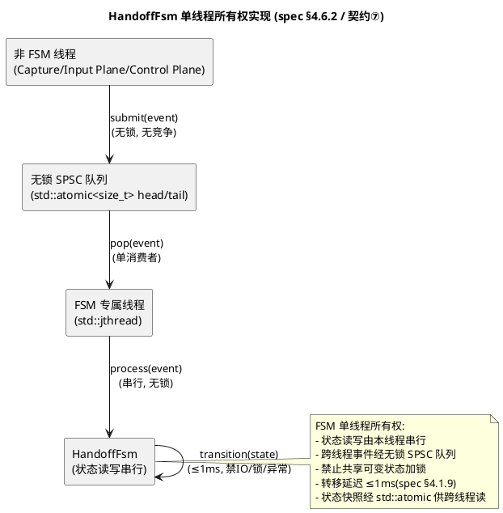

**实现要点**：
- `HandoffFsm` 实例由 FSM 专属 `std::jthread` 独占。
- 其他线程调用 `IHandoffFsm::submit(event)` 将事件推入无锁 SPSC 队列（`std::atomic<size_t>` head/tail，无竞争）。
- FSM 线程循环 pop 事件并串行处理，状态转移在 FSM 线程内完成，无锁。
- 跨线程查询当前状态经 `std::atomic<HandoffState>` 快照读取（`is_lock_free()` 保证）。
- 转移路径内禁 I/O、禁锁等待、禁异常（spec §4.1.9 ≤1ms）。

### 2.5.4 握手时序与延迟预算

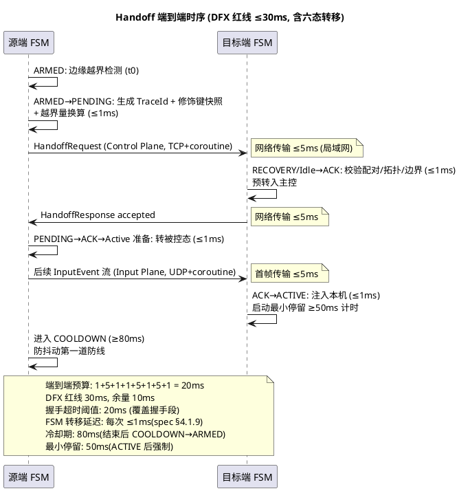

### 2.5.5 循环切换实现

拓扑为线性序列时（spec §5.2.1.4 / 契约③），最左端点的左邻居 = 最右端点，最右端点的右邻居 = 最左端点。`TopologyManager.neighbor()` 查询时按回环映射返回。`HandoffOrchestrator` 不感知回环，仅按 `neighbor()` 结果发起握手。

**契约③ 保障**：
- `TopologyManager.loadTopology()` 校验 `segmentCount() >= 2`，两点退化拒绝并告警 `CFX-E-TOPO-TWOPOINT-DEGEN`。
- `isCircular()` 返回 true 时回环映射生效。
- 最右端鼠标越过右边缘 → `neighbor(Right)` 返回最左端 → Handoff 正常发起，无死路。

### 2.5.6 ACK 事务语义设计（v3 修改 3：PREPARE → ACK → COMMIT → ACTIVE）

#### 2.5.6.1 事务模型动机

原 v2 设计中，PENDING → ACK → ACTIVE 转移仅描述"控制权交接"的时序，未明确"所有权何时真正转移"。在网络抖动、ACK 丢失、双向并发等场景下，可能出现 **split-brain**：源端认为自己已转被控、目标端也认为自己已转主控，导致双方都认为自己拥有键鼠；或反之双方都认为自己不拥有，导致输入永久丢失。

v3 引入显式事务提交模型，将 Handoff 所有权转移建模为分布式事务：

```
PREPARE → ACK → COMMIT → ACTIVE
```

- **PREPARE**：源端发起 HandoffRequest，进入 PENDING 态；**Source 永远保持 LOCAL ownership**，仅声明"我打算把控制权交给 Target"。
- **ACK**：Target 校验请求（配对、拓扑、边界、状态）后回送 HandoffAck；**Source 收到 ACK 仍持 LOCAL ownership**，仅声明"Target 已准备好接收"。
- **COMMIT**：Source 在收到合法 ACK 后，**才提交 Ownership Transfer**：本地从主控态转被控态，发送 HandoffComplete 给 Target。
- **ACTIVE**：Target 收到 HandoffComplete（COMMIT 通知）后正式进入主控态，启动注入。

#### 2.5.6.2 事务状态机映射

| 事务阶段 | FSM 状态 | Ownership 状态 | 可回滚性 |
|---------|---------|---------------|---------|
| PREPARE | PENDING | Source = LOCAL owner, Target = not owner | 可回滚（timeout/reject → COOLDOWN/RECOVERY，Source 保持控制权） |
| ACK（Target 已应答） | ACK | Source = LOCAL owner（**COMMIT 前**）, Target = pre-owner（预转入，未生效） | 可回滚（fail/invalid/timeout → COOLDOWN/RECOVERY，Source 保持控制权） |
| COMMIT（Source 提交） | ACK → ACTIVE 转移中 | Source = released, Target = owner（待 HandoffComplete 送达） | 不可回滚（COMMIT 后必须保证 HandoffComplete 送达 Target，否则 Target 永远停在 ACK） |
| ACTIVE | ACTIVE | Target = LOCAL owner, Source = not owner | 不可回滚（仅 disconnect → RECOVERY 释放） |

#### 2.5.6.3 事务时序图

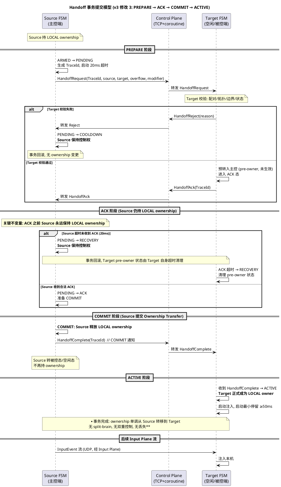

#### 2.5.6.4 Split-Brain 抑制证明

**性质**：在网络抖动、ACK 丢失、双向并发等任意故障下，拓扑中 ownership 持有者数量 ≤1（无 split-brain），且 ownership 不会永久丢失（无 void-owner）。

**证明骨架**：

1. **COMMIT 前不变量**：在 PREPARE 与 ACK 阶段，Source 恒持 LOCAL ownership，Target 仅持 pre-owner（未生效）。此时任意故障（timeout/reject/invalid/disconnect）均触发回滚（COOLDOWN 或 RECOVERY），Source 保持控制权，Target 清理 pre-owner 状态。ownership 持有者数量 = 1（Source）。
2. **COMMIT 原子性**：COMMIT 是 Source 单点决策（发送 HandoffComplete），一旦发出，Source 立即释放 ownership。此时 ownership 处于"在途"状态（在 Control Plane TCP 可靠通道上）。
3. **TCP 可靠有序**：Control Plane 使用 TCP + 序号/ACK/重传（§2.11.2），HandoffComplete 必然最终送达 Target（或判定断线触发 RECOVERY）。
4. **Target 收到 COMMIT 后**：Target 从 ACK 态进入 ACTIVE 态，正式成为 LOCAL owner。ownership 持有者数量 = 1（Target）。
5. **COMMIT 丢失场景**：若 HandoffComplete 重传超限（5 次），判定断线，Source 端 RECOVERY（但 Source 已释放 ownership，进入被控态/空闲态），Target 端 ACK 态超时 → RECOVERY 清理 pre-owner。此时 ownership 持有者数量 = 0（void-owner），但**本地键鼠不永久失效**：Source 在 RECOVERY 完成后回 ARMED 重新获得 LOCAL ownership（§2.5.6.5 void-owner 修复）。
6. **双向并发场景**：A→B 与 B→A 同时发起，由 TraceId 较小者胜（§2.1.3.4）。败方在 PREPARE 阶段回滚（PENDING → COOLDOWN），未进入 COMMIT，因此 ownership 仍由胜方持有。无 split-brain。

#### 2.5.6.5 Void-Owner 修复路径

当出现 void-owner（COMMIT 丢失，Source 已释放但 Target 未收到）时：

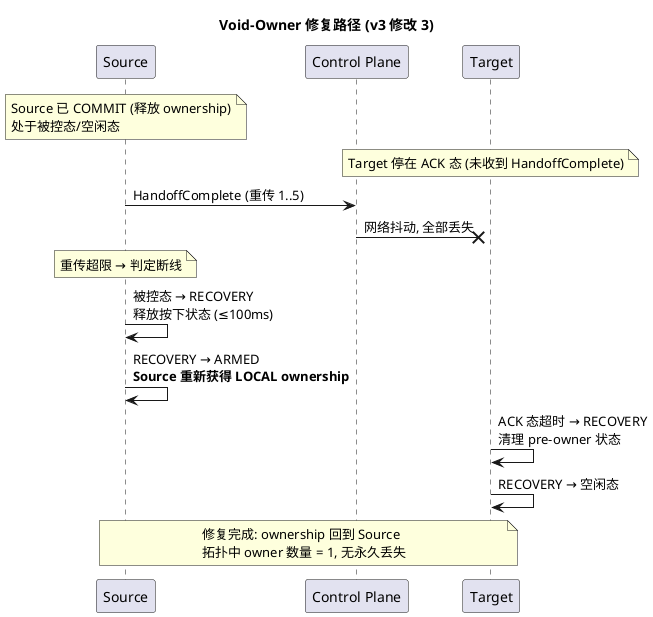

#### 2.5.6.6 接口契约补充

`IHandoffOrchestrator` 新增 COMMIT 阶段显式接口（v3）：

```cpp
class IHandoffOrchestrator {
public:
    // ... 原有接口 ...

    // v3 新增: Source 端 COMMIT ownership transfer
    // 仅在收到合法 HandoffAck 后调用; 调用后 Source 释放 LOCAL ownership
    // 返回 COMMIT 结果 (成功则发送 HandoffComplete 给 Target)
    virtual std::expected<CommitResult, CfxError>
    commitOwnership(const TraceId& traceId) = 0;

    // v3 新增: Target 端接收 COMMIT 通知, 进入 ACTIVE
    virtual std::expected<void, CfxError>
    onCommitReceived(const TraceId& traceId) = 0;
};
```

**调用约束**：
- `commitOwnership` 仅在 FSM 处于 ACK 态时可调用；其他态调用返回 `CFX-E-HANDOFF-ILLEGAL-STATE`。
- `onCommitReceived` 仅在 FSM 处于 ACK 态时可调用；其他态调用返回 `CFX-E-HANDOFF-ILLEGAL-STATE`。
- `commitOwnership` 调用后 FSM 不可回滚（COMMIT 不可撤销）；后续仅可经 disconnect → RECOVERY 释放。

#### 2.5.6.7 错误码补充（v3）

| 错误码 | 含义 | 级别 |
|--------|------|------|
| `CFX-E-HANDOFF-COMMIT-FAIL` | COMMIT 阶段失败（HandoffComplete 发送失败） | Error |
| `CFX-E-HANDOFF-COMMIT-LOST` | COMMIT 丢失（重传超限，触发 void-owner 修复） | Error |
| `CFX-W-HANDOFF-VOID-OWNER-RECOVERED` | void-owner 已修复（Source 重新获得 ownership） | Warn |
| `CFX-E-HANDOFF-SPLIT-BRAIN` | 检测到 split-brain（架构破坏，应永不出现） | Error |

---

## 2.6 防抖动机制详细设计

防抖动机制由四重契约构成（spec §4.2.6-8 / §5.3.1.11-13 / 契约②），全部运行在 FSM 专属线程内，无跨线程锁竞争。

### 2.6.0 防抖动行为契约（v3 修改 1：行为契约而非单纯参数契约）

**v3 修订要点**：80ms / 50ms 不仅是参数契约（"配置成 80ms"），更是**行为契约**（"系统在 80ms 内对边缘微小运动不重复触发 Handoff"）。验收时不只看参数是否配置正确，更看可观察行为是否满足下列时序性质。

#### 2.6.0.1 完整行为时序契约

```
进入 Edge Zone
    → ARMED
    → 持续向边缘运动 + dwell ≥ 50ms
    → PENDING (PREPARE)
    → 目标节点 ACK
    → Source COMMIT
    → ACTIVE
    → 离开边缘 / 完成切换
    → COOLDOWN ≥ 80ms
    → ARMED (恢复就绪)
```

#### 2.6.0.2 核心行为契约（必入验收）

| 契约 ID | 行为陈述 | 可观察证据 | 验收测试 |
|---------|---------|-----------|---------|
| **CF0-DEBOUNCE-001** | COOLDOWN 期间即使鼠标再次进入边缘，也不能重新触发同方向 Handoff | FSM 状态序列中 COOLDOWN 态不直接转 PENDING；越界事件被丢弃或钳制 | 模拟鼠标在边缘反复进出 10 次/秒，COOLDOWN 期间 0 次 Handoff 触发 |
| **CF0-DEBOUNCE-002** | Handoff 不得因为鼠标在边缘区域的正常微小运动而发生重复切换 | 同一对相邻端点在 1 秒内完成 Handoff 次数 ≤5；超限触发熔断 | 鼠标在 Mac↔Win 边缘抖动 1 秒，统计 Handoff 次数 ≤5 |
| **CF0-DEBOUNCE-003** | 进入 ACTIVE 后必须停留 ≥50ms 才允许再次越界触发 Handoff | ACTIVE 态进入时间戳与下一次 PENDING 进入时间戳差值 ≥50ms | 进入 ACTIVE 后 30ms 越界，事件被忽略；60ms 越界，事件被接受 |
| **CF0-DEBOUNCE-004** | 一次 Handoff 完成（ACTIVE）或回退（COOLDOWN）后必须强制静默 ≥80ms | COOLDOWN 进入时间戳与 ARMED 恢复时间戳差值 ≥80ms | 完成 Handoff 后 70ms 越界，事件被丢弃；90ms 越界，事件被接受 |
| **CF0-DEBOUNCE-005** | 抖动熔断后冷却期提升至 ≥300ms，连续 3 次熔断向运维告警 | 熔断后 COOLDOWN 时长 ≥300ms；连续 3 次熔断产生 `CFX-E-HANDOFF-JITTER-ESCALATE` | 1 秒内 6 次 Handoff → 熔断，冷却期 ≥300ms |

#### 2.6.0.3 行为契约 vs 参数契约的区分

| 维度 | 参数契约（v2） | 行为契约（v3） |
|------|--------------|--------------|
| 验收对象 | CooldownTimer 配置为 80ms | 系统在 80ms 内对边缘微小运动不重复触发 Handoff |
| 验收方法 | 检查配置项值 | 模拟边缘抖动，观察 Handoff 触发次数与 FSM 状态序列 |
| 失败判据 | 配置值 ≠ 80ms | 行为违反时序性质（如 COOLDOWN 期间触发 Handoff） |
| 架构意义 | 仅参数正确 | 行为正确，抑制 Mac↔Win 抖动 |

**v3 验收标准**：必须同时满足参数契约（配置正确）与行为契约（行为正确）。仅参数正确而行为违反（如 COOLDOWN 期间仍触发 Handoff）视为契约破坏。

### 2.6.1 冷却期定时器（CooldownTimer，第一道防线）

**契约**：spec §4.2.6 / §5.3.1.11 — 一次 Handoff 结束（成功转入 ACTIVE 或回退进入 COOLDOWN）后，发起端必须在整个冷却期（≥80ms）内禁止再次发起 Handoff；冷却期内鼠标越界事件必须被丢弃或钳制回本端边缘内侧。

**实现**：
- FSM 进入 COOLDOWN 态时，`CooldownTimer.start(80ms)` 启动计时（基于 `std::chrono::steady_clock`）。
- 越界事件到达时检查 `remaining()`，未到期则：
  - 丢弃越界事件；
  - 通过 `IInputInjector` 注入钳制事件，将鼠标光标钳制回本端边缘内侧（避免光标卡在边缘外）。
- 到期时触发 `onExpired` 回调，FSM 执行 COOLDOWN → ARMED 转移。
- 熔断时由 `JitterCircuitBreaker` 调用 `start(300ms)` 提升冷却期。

**参数**：
- 默认冷却期：`std::chrono::milliseconds(80)`（spec §4.1.6 下限）。
- 熔断冷却期：`std::chrono::milliseconds(300)`（spec §4.2.8）。

### 2.6.2 最小停留时间检测（DwellTimeGuard，第二道防线）

**契约**：spec §4.2.7 / §5.3.1.12 — 控制权转移到目标端并进入 ACTIVE 后，目标端必须强制要求鼠标在自身屏幕内停留 ≥50ms 才允许再次越界触发 Handoff；停留未达标时的越界事件必须被忽略。

**实现**：
- FSM 进入 ACTIVE 态时，`DwellTimeGuard.start(50ms)` 启动计时。
- 鼠标位置更新时调用 `onCursorPosition(pos, boundary)`：
  - 若 `pos` 超出 `boundary` 范围（鼠标离开屏幕），重置计时（视为未停留）。
  - 若 `pos` 在范围内，继续累计停留时长。
- 越界事件到达时检查 `reached()`，未达标则忽略（不发起 Handoff，不钳制鼠标——因为鼠标仍在屏幕内）。
- 达标后放行至 `EdgeDetector`。

**参数**：
- 最小停留时间：`std::chrono::milliseconds(50)`（spec §4.1.7 下限）。

### 2.6.3 抖动频率检测器（JitterDetector，第三道防线）

**契约**：spec §4.1.8 / §5.3.1.13 — 任意 1 秒滑动窗口内，同一对相邻端点之间完成的 Handoff 次数必须 ≤5 次；超过即视为抖动，系统必须强制进入更长的冷却期（≥300ms）。

**实现**：
- 维护以 `EndpointPair`（规范化 NodeId 对，小者为 a）为键的滑动窗口计数器。
- 滑动窗口：环形缓冲，1 秒窗口，每次 Handoff 完成时递增计数并淘汰过期记录。
- 窗口内计数 >5 时触发熔断信号，通知 `JitterCircuitBreaker`。

**参数**：
- 窗口大小：`std::chrono::seconds(1)`。
- 频率阈值：5 次/秒（spec §4.1.8）。

### 2.6.4 抖动熔断器（JitterCircuitBreaker，第四道防线）

**契约**：spec §4.2.8 / §5.3.1.13 — 当系统检测到同一对相邻端点在 1 秒内完成 Handoff 次数超过 5 次，必须触发抖动熔断：将该对端点之间的冷却期提升至 ≥300ms 并记录抖动告警；连续 3 次熔断后必须向运维配置员告警要求人工介入。

**实现**：
- 维护以 `EndpointPair` 为键的熔断状态机：`Normal → Tripped → Escalated`。
- 收到 `JitterDetector` 熔断信号时：
  - 状态转为 `Tripped`；
  - 调用 `CooldownTimer.start(300ms)` 提升冷却期；
  - 记录告警 `CFX-W-HANDOFF-JITTER`；
  - 递增 `consecutiveTrips`。
- 连续 3 次熔断（`consecutiveTrips >= 3`）时：
  - 状态转为 `Escalated`；
  - 记录告警 `CFX-E-HANDOFF-JITTER-ESCALATE`；
  - 通过结构化日志向运维配置员告警要求人工介入。
- 冷却期正常结束后 `consecutiveTrips` 清零，状态回 `Normal`。

**参数**：
- 熔断冷却期：`std::chrono::milliseconds(300)`。
- 连续熔断阈值：3 次（spec §4.2.8）。

### 2.6.5 FSM 不可重入守卫（spec §4.2.10 / §5.3.1.18）

**契约**：FSM 处于 PENDING/ACK/COOLDOWN/RECOVERY 期间，新触发的越界事件必须排队或丢弃，禁止重入状态机打断进行中的转移。

**实现**：
- `HandoffFsm.submit(event)` 入口检查当前态：
  - 若处于 ARMED/ACTIVE（可接收新事件的态），正常处理。
  - 若处于 PENDING/ACK/COOLDOWN/RECOVERY，将事件推入待处理队列（容量 16）。
  - 队列满时丢弃事件并告警 `CFX-W-HANDOFF-REENTRY`。
- FSM 转回 ARMED/ACTIVE 时消费待处理队列中的事件。

### 2.6.6 四重契约协同时序

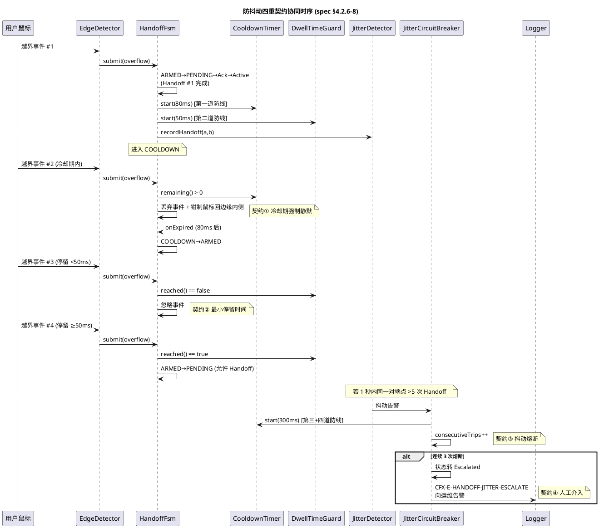

---

## 2.7 并发与线程安全模型详细设计

### 2.7.1 8 线程架构图

见 §2.1.3.3 并发与线程安全模型设计图。8 线程均用 `std::jthread`（自动 join + 可中断），线程数达上界 ≤8（spec §4.6.8 / 契约⑦）。

### 2.7.2 各线程职责与所有权

见 §2.1.3.3 线程职责与所有权声明表。每个线程的职责、所有权、生命周期、通信入/出均显式声明（spec §4.6.1）。

### 2.7.3 无锁队列与原子状态

**无锁 SPSC 队列**（单生产者单消费者）：
- 实现：环形缓冲 + `std::atomic<size_t>` head/tail。
- 用途：Capture→FSM、FSM→Injection、FSM→Input Plane、FSM→Control Plane、Input Plane→Injection、Control Plane→FSM。
- 特性：无锁无竞争；容量固定（默认 256）；满时丢弃或背压。

**无锁 MPMC 队列**（多生产者单消费者，日志专用）：
- 实现：分片 SPSC 队列（按线程数分片）+ `std::atomic` 索引。
- 用途：所有线程 → Logger Thread。
- 特性：分片降低竞争；溢出丢弃并计数。

**原子状态快照**（spec §8.2.8）：
- `std::atomic<HandoffState>` FSM 状态快照：FSM 线程写，其他线程读。
- `std::atomic<LinkState>` 链路状态：Control Plane 线程写，其他线程读。
- `std::atomic<ModifierState>` 修饰键状态：Capture 线程写，其他线程读。
- 全部要求 `is_lock_free() == true`（编译期 static_assert）。

### 2.7.4 coroutine 异步传输

**契约**：spec §4.6.7 / §8.2.4 — 传输层异步 I/O 必须使用 C++20 coroutine 或平台原生异步 I/O（io_uring / IOCP），禁止在传输线程内执行阻塞式 socket 调用；协程调度器必须独立于 FSM 线程与捕获线程。

**实现**：
- `ControlPlaneChannel` 与 `InputPlaneChannel` 的 socket 收发用 C++20 coroutine 封装：
  - macOS/Linux：基于 io_uring 或 epoll 的 coroutine awaitable。
  - Windows：基于 IOCP 的 coroutine awaitable。
- coroutine 调度由独立 Scheduler Thread 负责，不阻塞 FSM/Capture 线程。
- coroutine 在 Input Plane / Control Plane 线程的 `std::jthread` 内 await，调度器仅负责任务调度。

### 2.7.5 热路径禁锁与禁阻塞清单

| 热路径 | 禁止项 | 保障措施 |
|--------|--------|---------|
| 捕获回调 | 锁等待、I/O、内存分配、跨平面调用 | 回调仅轻量采集 + 异步派发到 SPSC 队列；≤1ms 返回 |
| FSM 状态转移 | I/O、锁等待、异常 | 转移在 FSM 线程内串行；无锁；≤1ms |
| Input Plane 转发 | 阻塞 I/O、锁竞争、sleep | coroutine 异步；无锁队列；最新优先丢帧 |
| Input Plane 注入 | 阻塞 I/O、锁竞争 | 平台注入 API 非阻塞；无锁队列 |
| Control Plane 收发 | 阻塞 socket、热路径 mutex | coroutine 异步；mutex 仅用于非热路径重传管理，持锁 ≤100us |

### 2.7.6 终止与清理契约

**契约**：spec §4.6.9 — 进程收到终止信号时，所有线程必须能在 ≤200ms 内完成清理（释放钩子、关闭链路、flush 日志）并退出；禁止线程泄漏或悬挂。

**实现**：
- Main Thread 收到 SIGTERM/SIGINT → 调用 `IThreadModel::requestStop()`。
- `requestStop()` 通过 `std::jthread::request_stop()` 通知所有 8 线程的 stop_token。
- 各线程检查 stop_token 并执行清理：
  - Capture Thread：释放 CGEventTap / 卸载低级钩子。
  - Injection Thread：flush 待注入队列。
  - Input Plane / Control Plane Thread：关闭 socket，取消所有 coroutine。
  - FSM Thread：若处于 ACTIVE/PENDING/ACK，转 RECOVERY 释放键鼠。
  - Logger Thread：flush 队列到 Sink。
  - Scheduler Thread：取消所有 coroutine 任务。
- `IThreadModel::joinAll(200ms)` 等待所有线程退出，超时则告警 `CFX-E-THREAD-SHUTDOWN-TIMEOUT`。
- `std::jthread` 析构自动 join，保证无泄漏。

---

## 2.8 C++20 技术栈使用方案

### 2.8.1 编译基线与编译器矩阵

**编译基线**（spec §8.1.1）：
- CMake: `set(CMAKE_CXX_STANDARD 20)`、`set(CMAKE_CXX_STANDARD_REQUIRED ON)`、`set(CMAKE_CXX_EXTENSIONS OFF)`。
- 禁降级 C++17（spec §8.3.2）；CI 检查 `CXX_STANDARD` 严格为 20。

**编译器矩阵**（spec §8.1.2）：
- macOS: Apple Clang ≥ 15（C++20 完整支持）。
- Windows: MSVC ≥ 19.3x（VS 2022）与 Clang ≥ 17（C++20 完整支持）。
- CI 矩阵覆盖全部组合，均编译通过 + 测试通过。

**CMake 编译器版本检测**（`cmake/Platform.cmake` 增量）：
- Apple Clang: 检测 `CMAKE_CXX_COMPILER_VERSION` ≥ 15。
- MSVC: 检测 `CMAKE_CXX_COMPILER_VERSION` ≥ 19.3。
- Clang: 检测 `CMAKE_CXX_COMPILER_VERSION` ≥ 17。
- 不达标则 `message(FATAL_ERROR "Compiler does not meet C++20 requirement")`。

**编译选项**（保留并补充）：
- MSVC: `/W4 /WX /permissive- /utf-8 /Zc:__cplusplus /std:c++20`。
- Clang/GCC: `-Wall -Wextra -Werror -Wpedantic -std=c++20`。
- 增 `-fcoroutines`（若编译器需要显式启用 coroutine）。

### 2.8.2 9 项 C++20 设施使用方案

#### 2.8.2.0 C++20 特性分级（v3 修改 5：MUST / SHOULD / OPTIONAL / FORBIDDEN）

**v3 修订要点**：原 v2 将 9 项 C++20 设施全部强制使用（MUST），易导致"为了用而用"的反模式。v3 调整为四级分级，明确每项特性的使用边界与禁止场景。

| 级别 | 特性 | 使用边界 | 验收严格度 |
|------|------|---------|-----------|
| **MUST** | `std::expected` | 全部可失败操作返回 `std::expected<T, CfxError>`；禁异常热路径 | 强制验收，未用即架构破坏 |
| **MUST** | `std::span` | 跨模块只读连续序列传参；禁裸指针+长度、禁 vector 拷贝 | 强制验收 |
| **MUST** | `std::chrono` | 全部时间戳/超时/周期用 `std::chrono::duration` 强类型；禁裸整数时间 | 强制验收 |
| **MUST** | `std::atomic` | 跨线程热路径状态（FSM 状态/链路状态/修饰键）用 `std::atomic` 且 `is_lock_free()`；禁热路径互斥量 | 强制验收 |
| **MUST** | `std::jthread` | 长生命周期线程（8 线程模型）用 `std::jthread`；禁裸 `std::thread` | 强制验收 |
| **SHOULD** | coroutine | **限定在 Transport/异步 I/O 层**（ControlPlaneChannel/InputPlaneChannel socket 收发）；不渗透到 Handoff FSM | 强烈推荐，但 FSM 层禁用 coroutine-driven state machine |
| **SHOULD** | `std::variant` + `std::visit` | 多态负载（EventPayload/ControlMessage/HandoffOutcome/FsmEvent）用 variant + visit；禁裸 union | 强烈推荐，简单两态场景可用 enum + struct 替代 |
| **SHOULD** | concepts | 模板参数约束用 concepts 替代 SFINAE/static_assert；**不要为了 concepts 而 concepts** | 强烈推荐，简单模板可不用 concepts |
| **OPTIONAL** | 其他 C++20 facilities | `std::format`、`std::source_location`、`std::bit_cast`、`std::ranges`、`std::numbers`、`std::ssize` 等 | 可选，按需使用，不强制验收 |
| **FORBIDDEN** | 复杂模板元编程 | 为了炫技引入复杂模板（如深度嵌套 SFINAE、变参模板递归） | 禁止，CI 审查模板深度 |
| **FORBIDDEN** | 协程状态机 | coroutine-driven state machine（用协程实现 FSM 状态转移） | 禁止，FSM 保持 deterministic + single-owner + easy-to-test |
| **FORBIDDEN** | 提案特性 | reflection P2996、pattern matching P1371 等未进入 C++20 IS 的特性 | 禁止（spec §8.3.1） |
| **FORBIDDEN** | 编译器扩展替代标准设施 | 用 `__builtin_*` 替代 `std::atomic` 等 | 禁止（spec §8.3.1） |

#### 2.8.2.1 分级关键约束（v3 必入验收）

| 约束 ID | 约束陈述 | 理由 | 验收测试 |
|---------|---------|------|---------|
| **CF0-CPP20-001** | **coroutine 限定在 Transport/异步 I/O 层，不渗透到 Handoff FSM** | FSM 应保持 deterministic + single-owner + easy-to-test；coroutine-driven state machine 难以测试与推理 | grep FSM 层源码无 `co_await` / `co_yield` / `co_return` |
| **CF0-CPP20-002** | **FSM 保持 deterministic + single-owner + easy-to-test** | 状态转移应纯函数式（当前态 + 事件 → 下一态 + 动作），无异步等待 | FSM 单元测试可纯同步驱动，无 coroutine 调度器依赖 |
| **CF0-CPP20-003** | **enum class 已经是成熟基础设施，不作为"C++20 特性"重点验收** | enum class 自 C++11 即可用，非 C++20 新特性；v2 将其列为 9 项设施之一过度强调 | enum class 使用正确即可，不单独验收 |
| **CF0-CPP20-004** | **concepts 可以使用，但不要为了 concepts 而 concepts** | 简单模板（如单参数 callable）可不用 concepts；过度使用 concepts 增加编译时间与阅读成本 | 审查 concepts 使用，每处应有明确契约表达目的 |
| **CF0-CPP20-005** | **MUST 级特性未用即架构破坏** | expected/span/chrono/atomic/jthread 是 CF0 地基设施 | CI 检查 MUST 级特性使用证据 |
| **CF0-CPP20-006** | **FORBIDDEN 级特性出现即架构破坏** | 复杂模板/协程状态机/提案特性/编译器扩展破坏可维护性 | CI 静态审查 + 模板深度检查 |

#### 2.8.2.2 原表（保留 v2 内容，按分级重新标注）

| # | 设施 | 分级（v3） | 用途 | 使用位置 | 验收条件 |
|---|------|-----------|------|---------|---------|
| 1 | `std::span` | **MUST** | 只读序列视图（零拷贝） | `IInputInjector::injectBatch(std::span<const CanonicalInputEvent>)`、FrameCodec 缓冲视图 | 接口签名无裸指针+长度、无 vector 拷贝 |
| 2 | `std::expected<T, CfxError>` | **MUST** | 错误处理（替代异常/错误码+出参） | 全部可失败操作：`IInputCapture::start`、`IEventNormalizer::normalize`、`ITopologyManager::loadTopology`、`IHandoffOrchestrator::initiate`、`ICoordMapper::mapOverflow`、`IControlPlaneChannel::send`、`IThreadModel::start` 等 | 可失败操作返回 `std::expected`，无 throw |
| 3 | `std::jthread` | **MUST** | 长生命周期线程（自动 join + 可中断） | 8 线程：Main、Capture、Injection、InputPlane、ControlPlane、FSM、Logger、Scheduler | 长生命周期线程均用 `std::jthread`，无裸 `std::thread` |
| 4 | coroutine | **SHOULD（限 Transport 层）** | 异步传输 I/O | `ControlPlaneChannel`、`InputPlaneChannel` 的 socket 收发；Scheduler Thread 调度 | 异步 I/O 基于 coroutine 或 IOCP/io_uring，无阻塞 socket；**FSM 层无 coroutine** |
| 5 | concepts | **SHOULD** | 模板参数约束 | `IInputCapture::start(std::invocable<const RawInputEvent&> auto&&)`、`IHandoffFsm::onTransition`、`ICooldownTimer::onExpired` 等回调参数 | 模板约束用 concepts，无 SFINAE；**不过度使用** |
| 6 | `std::chrono` | **MUST** | 强类型时间 | 时间戳（`std::chrono::steady_clock::time_point`）、超时（`std::chrono::milliseconds`）、周期（`std::chrono::milliseconds`）、冷却期、停留时间 | 时间相关接口用 `std::chrono::duration`，无裸整数 |
| 7 | `std::variant` + `std::visit` | **SHOULD** | 多态负载 | `EventPayload`（事件负载）、`ControlMessage`（控制报文）、`HandoffOutcome`（Handoff 结果）、`FsmEvent`（FSM 事件）、`MouseMotionPayload`（v3 坐标语义） | 多态对象用 variant + visit，无裸 union |
| 8 | `std::atomic` | **MUST** | 跨线程状态（lock-free） | `std::atomic<HandoffState>` FSM 状态、`std::atomic<LinkState>` 链路状态、`std::atomic<ModifierState>` 修饰键、`std::atomic<u64>` 事件序号、无锁队列 head/tail | `std::atomic` 且 `is_lock_free()` 为 true |
| 9 | `enum class` | **成熟基础设施（非 C++20 重点验收）** | 强类型枚举（作用域枚举） | `EventType`、`EdgeDirection`、`HandoffState`、`EndpointState`、`Platform`、`FrameType`、`LinkState`、`NeighborState`、`MouseButton`、`WheelAxis`、`RejectReason`、`RollbackReason`、`ThreadRole`、`ErrorLevel`、`ErrorModule`、`ErrorCode`、`CoordinateSpace`（v3） | 全部枚举为 `enum class`，无裸 enum |

### 2.8.3 4 项禁止项保障

| # | 禁止项 | 保障措施 | 验收条件 |
|---|--------|---------|---------|
| 1 | 禁提案特性（spec §8.3.1） | CI 编译选项禁用编译器扩展；代码审查无 reflection P2996、pattern matching P1371 等 | 无提案特性，无编译器扩展替代标准设施 |
| 2 | 禁降级（spec §8.3.2） | CMake `CXX_STANDARD` 严格为 20；CI 检查 | `CXX_STANDARD` 严格为 20 |
| 3 | 禁异常热路径（spec §8.3.3） | Input Plane 转发/注入、FSM 状态转移路径无 throw/try/catch；错误经 `std::expected` 返回 | 热路径代码无 throw，无 try/catch |
| 4 | 禁裸 new/delete（spec §8.3.4） | 资源管理用 RAII（`std::unique_ptr`、`std::shared_ptr`、容器） | 无裸 new/delete，均用 RAII |

### 2.8.4 CMake 构建方案升级

**`CMakeLists.txt` 升级要点**：
- `set(CMAKE_CXX_STANDARD 20)`（由 17 升级）。
- 增编译器版本检测（include `cmake/CompilerCheck.cmake`）。
- 增 coroutine 启用选项（按编译器需要）。
- 保留平台条件编译与 CTest 框架。

**`cmake/Platform.cmake` 升级要点**：
- 增 Apple Clang / MSVC / Clang 版本检测。
- 不达标 FATAL_ERROR。

**CI 矩阵**（`.github/workflows/matrix.yml` 或等效）：
- macOS: Apple Clang 15+（Xcode 15+）。
- Windows: MSVC 19.3x+（VS 2022）+ Clang 17+。
- 全组合编译 + 测试通过。

---

## 2.9 7 个核心契约设计保障措施

本节为 spec §7 的 7 个核心契约提供具体设计保障措施。任一契约被破坏即视为架构破坏，必须回退修正。

**v3 修订（修改 6）**：全部契约采用统一可验证格式，每个契约包含 Contract / Invariant / Violation / Observable Evidence / Acceptance Test 五要素，并分配架构测试 ID（CF0-ARCH-*-001/002/...），验收时不只看"代码看起来没有"，而是要有可执行的架构测试/evidence。

### 2.9.1 契约①：CanonicalInputEvent 规范化隔离保障（spec §7.1）

```text
Contract
  macOS/Windows/Linux 原始事件必须经统一规范化路径转换为平台无关 CanonicalInputEvent；
  平台特殊逻辑（macOS CGEventFlags、Windows KBDLLHOOKSTRUCT vkCode/scancode 差异）必须被隔离在平台适配层内部，
  禁止泄漏到 Core 业务层。

Invariant
  Core 层源码不包含任何平台条件分支（#ifdef __APPLE__ / #ifdef _WIN32）；
  Core 层不直接引用任何平台头文件（CGEvent.h、windows.h）；
  平台差异在适配层（MacInputAdapter / WinInputAdapter）内消化为平台无关 RawInputEvent / CanonicalInputEvent。

Violation
  Core 层出现 #ifdef __APPLE__ 或 #ifdef _WIN32；
  Core 层直接 #include <CGEvent/CGEvent.h> 或 <windows.h>；
  macOS 与 Windows 产生相同物理事件但规范化后 CanonicalInputEvent 语义不等价。

Observable Evidence
  CF0-ARCH-NORM-001: grep Core 层源码，输出空列表（无平台条件分支/平台头文件引用）
  CF0-ARCH-NORM-002: macOS 鼠标移动 + Windows 鼠标移动 → 规范化后 CanonicalInputEvent.eventType 相同、payload 语义等价
  CF0-ARCH-NORM-003: 新增 Linux 平台 → 仅新增 platform/linux/ 适配层，Core 层 git diff 为空

Acceptance Test
  CF0-ARCH-NORM-001: CI 运行 grep 审查脚本，违反即 CI 失败
  CF0-ARCH-NORM-002: 单元测试覆盖 macOS/Windows 同事件规范化等价性
  CF0-ARCH-NORM-003: 架构测试模拟新增 Linux 适配层，验证 Core 层零改动
```

**设计保障**：
1. **接口隔离**：Core 层仅依赖 `IInputCapture`/`IInputInjector`/`IMonotonicClock`/`IScreenQuery` 抽象接口（`platform/common/platform_ports.hpp`），不直接引用平台头文件。
2. **适配层消化**：平台特殊逻辑在 `MacInputAdapter`/`WinInputAdapter` 内部转换为平台无关 `RawInputEvent`/`CanonicalInputEvent`。
3. **静态审查**：CI 运行审查脚本，grep Core 层源码确认无 `#ifdef __APPLE__` / `#ifdef _WIN32` / `CGEvent` / `windows.h` 直接引用。
4. **扩展保证**：新增 Linux 平台仅新增 `platform/linux/` 适配层实现，Core 层零改动。

### 2.9.2 契约②：Handoff FSM 完整状态保障（spec §7.2）

```text
Contract
  Handoff 必须由完整六态 FSM 承载：ARMED → PENDING → ACK → ACTIVE → COOLDOWN → RECOVERY，
  合法转移路径见 §2.5.2（v3 含超时/失败路径）；
  禁止使用三态或更少态的简化模型，禁止省略 COOLDOWN/RECOVERY 态。
  FSM 必须通过 COOLDOWN 态 + 冷却期（≥80ms）+ 最小停留时间（≥50ms）+ 抖动熔断（1 秒 5 次阈值）四重机制抑制 Mac↔Win 抖动。
  v3 补充：任何 Handoff 失败/超时/断线必经 RECOVERY 清理，不丢失本地控制权（Safety Invariant §2.17）。

Invariant
  FSM 状态枚举包含全部六态 {ARMED, PENDING, ACK, ACTIVE, COOLDOWN, RECOVERY}；
  转移路径与 §2.5.2 表完全一致（v3 含 PENDING→RECOVERY / ACK→RECOVERY / ACTIVE→RECOVERY 显式超时/失败路径）；
  握手失败必经 COOLDOWN 回到 ARMED，不直接跳回；
  超时/失败必经 RECOVERY 清理，不直接跳回 ARMED；
  防抖动四重机制（CooldownTimer/DwellTimeGuard/JitterDetector/JitterCircuitBreaker + FSM 不可重入守卫）齐全。

Violation
  FSM 状态枚举缺失任一态（如省略 COOLDOWN 或 RECOVERY）；
  转移路径与 §2.5.2 不一致（如 PENDING timeout 直接跳 ARMED 未经 RECOVERY）；
  握手失败直接从 PENDING 跳回 ARMED 未经 COOLDOWN；
  防抖动四重机制缺失任一；
  FSM 重入（PENDING/ACK/COOLDOWN/RECOVERY 期间新事件重入状态机）。

Observable Evidence
  CF0-ARCH-FSM-001: FSM 状态枚举 = {ARMED, PENDING, ACK, ACTIVE, COOLDOWN, RECOVERY}，六态齐全
  CF0-ARCH-FSM-002: 转移表与 §2.5.2 完全一致（含 v3 超时/失败路径）
  CF0-ARCH-FSM-003: 模拟握手失败 → FSM 状态序列含 PENDING → COOLDOWN → ARMED，不直接 PENDING → ARMED
  CF0-ARCH-FSM-004: 模拟 PENDING timeout → FSM 状态序列含 PENDING → RECOVERY → ARMED，Source 保持控制权
  CF0-ARCH-FSM-005: 模拟鼠标边缘反复越界 10 次/秒 → 实际 Handoff ≤5 次/秒，超出被丢弃
  CF0-ARCH-FSM-006: 模拟 COOLDOWN 期间越界 → 事件被丢弃，FSM 不转 PENDING
  CF0-ARCH-FSM-007: 模拟 PENDING 期间新越界 → 事件排队或丢弃，FSM 不重入

Acceptance Test
  CF0-ARCH-FSM-001: 单元测试断言 HandoffState 枚举值集合
  CF0-ARCH-FSM-002: 单元测试覆盖 §2.5.2 全部 12 条转移路径
  CF0-ARCH-FSM-003: 集成测试模拟握手拒绝，断言 FSM 状态序列
  CF0-ARCH-FSM-004: 集成测试模拟 PENDING 超时，断言 Source 控制权保留
  CF0-ARCH-FSM-005: 集成测试模拟 10 次/秒越界，统计 Handoff 次数 ≤5
  CF0-ARCH-FSM-006: 集成测试模拟 COOLDOWN 期间越界，断言事件丢弃
  CF0-ARCH-FSM-007: 集成测试模拟 PENDING 期间新事件，断言排队/丢弃
```

**设计保障**：
1. **六态枚举**：`enum class HandoffState { Armed, Pending, Ack, Active, Cooldown, Recovery }`（`domain.hpp` v2）。
2. **12 条转移路径（v3）**：`HandoffFsm` 转移表与 spec §5.3.1.2 + §2.5.2 完全一致（含 v3 显式超时/失败路径）。
3. **禁止跳过 COOLDOWN**：PENDING → ARMED、ACK → ARMED、ACTIVE → ARMED 均非法；握手失败必经 COOLDOWN 回到 ARMED。
4. **v3 禁止跳过 RECOVERY**：PENDING timeout → ARMED、ACK invalid → ARMED、ACTIVE disconnect → ARMED 均非法；超时/失败必经 RECOVERY 清理。
5. **防抖动四重机制**：`CooldownTimer`（≥80ms）+ `DwellTimeGuard`（≥50ms）+ `JitterDetector`（≤5 次/秒）+ `JitterCircuitBreaker`（≥300ms + 连续 3 次告警）+ FSM 不可重入守卫（§2.6）。
6. **单元测试**：覆盖六态全部转移路径、禁止转移拒绝、防抖动四重契约、v3 超时/失败路径。

### 2.9.3 契约③：Topology 循环支持保障（spec §7.3）

```text
Contract
  拓扑必须支持 ≥ 2 段的线性循环（Mac → Win-A → Win-B → Win-C → Mac），
  最左端左边缘与最右端右边缘必须回环闭合；
  禁止将系统设计为 Mac ↔ 单一 Windows 的两点退化解。

Invariant
  TopologyView.segmentCount() >= 2；
  TopologyView.isCircular() == true 时，最左端左邻居 = 最右端，最右端右邻居 = 最左端；
  两点拓扑（segmentCount == 1）被拒绝并告警 CFX-E-TOPO-TWOPOINT-DEGEN。

Violation
  系统被硬编码为仅支持两点拓扑；
  segmentCount < 2 但未拒绝；
  回环不闭合（最右端右边缘越界无对应邻居）。

Observable Evidence
  CF0-ARCH-TOPO-001: 配置 Mac → Win-A → Win-B → Win-C → Mac → 四段边缘均可触发 Handoff，回环闭合
  CF0-ARCH-TOPO-002: 最右端鼠标越过右边缘 → 控制权转移至最左端，无死路
  CF0-ARCH-TOPO-003: 配置三点线性循环 → 系统正常支持，不报错不退化
  CF0-ARCH-TOPO-004: 配置两点拓扑 → 拒绝并告警 CFX-E-TOPO-TWOPOINT-DEGEN

Acceptance Test
  CF0-ARCH-TOPO-001: 集成测试覆盖四段回环，每段边缘触发 Handoff 成功
  CF0-ARCH-TOPO-002: 集成测试最右端越界，断言控制权转移至最左端
  CF0-ARCH-TOPO-003: 集成测试三点循环，断言无报错
  CF0-ARCH-TOPO-004: 集成测试两点拓扑，断言拒绝 + 告警码
```

**设计保障**：
1. **回环映射**：`TopologyManager.neighbor(direction)` 在 `isCircular()` 为 true 时按回环映射返回（最左端左邻居=最右端，最右端右邻居=最左端）。
2. **段数校验**：`TopologyManager.loadTopology()` 校验 `segmentCount() >= 2`，两点退化拒绝并告警 `CFX-E-TOPO-TWOPOINT-DEGEN`。
3. **线性校验**：`TopologyView.isLinear()` 校验线性排列；`neighborCount() <= 2` 校验邻居数上限。
4. **单元测试**：覆盖 Mac→Win-A→Win-B→Win-C→Mac 四段回环、三点循环、两点退化拒绝。

### 2.9.4 契约④：Input Plane 直通保障（spec §7.4）

```text
Contract
  Input Plane 事件流必须沿固定路径流转：
  Capture → Normalize → Input Queue → Transport → Remote Injection；
  中间禁止经过：GUI / Database / synchronous logging / Control Plane RPC / blocking disk I/O；
  该路径禁止等待 Control Plane，禁止查询数据库，禁止等待 GUI 响应。

Invariant
  Input Plane 事件流转路径节点集合 = {Capture, Normalize, InputQueue, Transport, Injection}；
  路径中无 GUI 调用、无 DB 查询、无同步日志、无 Control Plane 同步调用、无 blocking disk I/O、无 sleep；
  日志经无锁 MPMC 队列异步派发，不阻塞 Input Plane 事件转发；
  Control Plane 阻塞不影响 Input Plane（线程隔离 + 无共享可变状态）。

Violation
  Input Plane 转发路径中出现 GUI 调用（如查询 UI 状态）；
  Input Plane 转发路径中出现 DB 查询；
  Input Plane 转发路径中出现同步日志（阻塞写文件）；
  Input Plane 转发路径中出现 Control Plane 同步调用（如等待 Handoff 完成）；
  Input Plane 转发路径中出现 blocking disk I/O 或 sleep；
  Control Plane 阻塞导致 Input Plane 延迟 > 10ms。

Observable Evidence
  CF0-ARCH-INPUT-001: 静态架构测试 - grep Input Plane 转发路径源码，无 GUI/DB/同步日志/Control Plane 同步调用/sleep/blocking I/O
  CF0-ARCH-INPUT-002: 动态架构测试 - Control Plane 注入阻塞（如 Handoff 握手延迟 100ms），Input Plane 事件转发延迟仍 ≤10ms
  CF0-ARCH-INPUT-003: 动态架构测试 - Input Plane 事件产生 → 日志异步派发，事件转发延迟不受日志写入影响
  CF0-ARCH-INPUT-004: 路径覆盖测试 - 一次鼠标移动事件的完整路径 = Capture → Normalize → InputQueue → Transport → Injection，无额外节点

Acceptance Test
  CF0-ARCH-INPUT-001: CI 运行静态架构审查脚本，扫描 Input Plane 转发路径代码，违反即 CI 失败
  CF0-ARCH-INPUT-002: 集成测试注入 Control Plane 100ms 延迟，断言 Input Plane 转发延迟 ≤10ms
  CF0-ARCH-INPUT-003: 集成测试高频事件 + 慢速日志 Sink，断言事件转发延迟不受影响
  CF0-ARCH-INPUT-004: 集成测试追踪一次事件的完整路径节点，断言节点集合 = {Capture, Normalize, InputQueue, Transport, Injection}
```

**设计保障**：
1. **固定路径**：Input Plane 事件流仅经 Capture Thread → EventNormalizer → InputPlaneChannel → Injection Thread，无 GUI/DB/日志同步/Control Plane 等待节点。
2. **日志异步**：日志经无锁 MPMC 队列异步派发到 Logger Thread，不阻塞 Input Plane 事件转发。
3. **Control Plane 独立**：Input Plane 与 Control Plane 线程隔离（契约⑥），Control Plane 阻塞不影响 Input Plane。
4. **静态审查**：CI 审查 Input Plane 转发路径代码，确认无 GUI 调用、无 DB 查询、无 Control Plane 同步调用、无 sleep、无 blocking I/O。
5. **延迟保障**：单向转发延迟 ≤10ms（DFX 红线 §4.1.2）。

### 2.9.5 契约⑤：Coordinate Space 坐标空间保障（spec §7.5）

```text
Contract
  每个端点坐标空间原点必须为其屏幕左上角 (0,0)；
  跨端坐标换算必须基于各自声明的逻辑边界与越界量解析进行，禁止依赖任何屏幕画面数据；
  纵向坐标必须按源端与目标端屏幕高度比例映射。
  v3 补充：核心控制路径使用 RelativeDelta（相对运动），边缘 Handoff 路径使用 AbsolutePosition（逻辑坐标），
  详见 §2.10.0。

Invariant
  ScreenBoundary.originX = 0, originY = 0（左上角原点）；
  CoordMapper.mapOverflow() 仅基于声明的逻辑边界与越界量，不读取像素；
  纵向映射：entry.y = sourceVertical * targetBoundary.height / sourceBoundary.height；
  核心控制路径（鼠标移动转发）使用 RelativeDelta，不传绝对坐标（v3, CF0-COORD-001）；
  边缘 Handoff 路径使用 AbsolutePosition（逻辑坐标），仅用于越界检测与入射定位（v3, CF0-COORD-002）。

Violation
  坐标原点非屏幕左上角；
  坐标换算读取或传输像素数据；
  纵向映射未按高度比例（如直接复制 y 坐标）；
  核心控制路径传绝对坐标（违反 v3 CF0-COORD-001）；
  边缘 Handoff 路径使用相对运动无法定位入射点（违反 v3 CF0-COORD-002）。

Observable Evidence
  CF0-ARCH-COORD-001: 源端 1080p 右边缘越界 5px 纵向 540 + 目标端 2160p → 目标端从左边缘向内 5px 入射，纵向 1080
  CF0-ARCH-COORD-002: 坐标换算过程 → 不读取、不传输任何像素数据
  CF0-ARCH-COORD-003: 断开画面采集（本就不存在）→ 坐标换算仍正常工作
  CF0-ARCH-COORD-004: 抓包观察 Input Plane 鼠标移动帧 → payload 为 RelativeDelta（v3）
  CF0-ARCH-COORD-005: Handoff 请求携带 entry_coord (AbsolutePosition)；ACTIVE 进入后切换回 RelativeDelta（v3）

Acceptance Test
  CF0-ARCH-COORD-001: 单元测试覆盖 1080p→2160p 比例映射
  CF0-ARCH-COORD-002: 单元测试断言 CoordMapper 不读取像素（无画面依赖注入）
  CF0-ARCH-COORD-003: 集成测试断开画面采集，断言坐标换算正常
  CF0-ARCH-COORD-004: 集成测试抓包 Input Plane 鼠标移动帧，断言 payload 为 RelativeDelta
  CF0-ARCH-COORD-005: 集成测试追踪 Handoff 请求，断言 entry_coord 为 AbsolutePosition；ACTIVE 后断言切换回 RelativeDelta
```

**设计保障**：
1. **原点固定**：`ScreenBoundary.originX = 0, originY = 0`（左上角），`isValid()` 校验宽高正整数。
2. **换算算法**：`CoordMapper.mapOverflow()` 仅基于声明的逻辑边界与越界量解析换算（§2.10），不读取像素。
3. **纵向比例映射**：`entry.y = sourceVertical * targetBoundary.height / sourceBoundary.height`（§2.10.1）。
4. **入射钳制**：`CoordMapper.clamp()` 将超出范围的入射坐标钳制到目标端屏幕有效范围内。
5. **v3 坐标语义分离**：核心控制路径用 `RelativeDelta`，边缘 Handoff 路径用 `AbsolutePosition`（§2.10.0）。
6. **单元测试**：覆盖 1080p→2160p 比例映射、越界量超出目标屏钳制、原点独立性、v3 坐标语义分离。

### 2.9.6 契约⑥：Transport 双平面隔离保障（spec §7.6）

```text
Contract
  传输层必须将 Input Plane 与 Control Plane 在帧类型、处理路径、线程三个维度完全隔离；
  一个平面的异常（拥塞、处理失败、背压）不得影响另一个平面；
  Control Plane 必须可靠有序，Input Plane 必须低延迟可丢帧。

Invariant
  Frame.plane 字段独立标识（0=Control, 1=Input）；
  FrameType 枚举 Input Plane 仅 InputEvent，Control Plane 含 Handoff/Heartbeat/Topology/Pairing；
  ControlPlaneChannel 与 InputPlaneChannel 各持独立队列、独立事件循环、独立 std::jthread；
  双平面无共享可变状态，跨平面交换经无锁队列；
  Control Plane TCP + 序号/ACK/重传（可靠有序）；Input Plane UDP + 最新优先丢帧（低延迟）。

Violation
  Input Plane 与 Control Plane 共享可变状态；
  Input Plane 与 Control Plane 共享处理线程；
  Control Plane 报文走 Input Plane 队列或反之；
  Input Plane 拥塞导致 Control Plane 握手/心跳失败；
  Control Plane 异常导致 Input Plane 事件转发受阻。

Observable Evidence
  CF0-ARCH-TRANSPORT-001: Input Plane 拥塞 → Control Plane 握手与心跳仍正常送达
  CF0-ARCH-TRANSPORT-002: Control Plane 处理异常 → Input Plane 事件转发不受影响
  CF0-ARCH-TRANSPORT-003: 审查传输层 → Input Plane 与 Control Plane 帧类型独立、处理路径独立、线程独立
  CF0-ARCH-TRANSPORT-004: 审查传输层线程模型 → 双平面线程独立，无共享可变状态

Acceptance Test
  CF0-ARCH-TRANSPORT-001: 集成测试注入 Input Plane 拥塞（队列填满），断言 Control Plane 握手/心跳正常
  CF0-ARCH-TRANSPORT-002: 集成测试注入 Control Plane 异常（重传超限），断言 Input Plane 转发正常
  CF0-ARCH-TRANSPORT-003: 静态架构测试审查帧类型/处理路径独立性
  CF0-ARCH-TRANSPORT-004: 静态架构测试审查线程模型，断言双平面独立 std::jthread + 无共享可变状态
```

**设计保障**：
1. **帧类型隔离**：`Frame.plane` 字段（0=Control, 1=Input）独立标识；`FrameType` 枚举 Input Plane 仅 `InputEvent`，Control Plane 含 Handoff/Heartbeat/Topology/Pairing。
2. **处理路径隔离**：`ControlPlaneChannel` 与 `InputPlaneChannel` 各持独立队列、独立事件循环、独立重传/丢帧策略。
3. **线程隔离**：各持独立 `std::jthread`，无共享可变状态；跨平面交换经无锁队列（§2.7）。
4. **可靠性差异**：Control Plane TCP + 序号/ACK/重传（可靠有序）；Input Plane UDP + 最新优先丢帧（低延迟）。
5. **coroutine 异步**：双平面均用 C++20 coroutine 异步 I/O（限 Transport 层，CF0-CPP20-001），禁阻塞 socket。
6. **单元测试**：覆盖 Input Plane 拥塞时 Control Plane 正常、Control Plane 异常时 Input Plane 不受影响。

### 2.9.7 契约⑦：Concurrency/Threading 并发模型保障（spec §7.7）

```text
Contract
  系统必须采用显式线程模型，线程职责与所有权必须在文档中显式声明；
  Handoff FSM 必须单线程所有权串行执行；
  Input Plane 与 Control Plane 线程隔离；
  捕获回调轻量化（≤1ms 返回）；
  热路径无锁优先（std::atomic / 无锁队列）；
  禁止阻塞热路径；
  单 Agent 线程数 ≤ 8。
  v3 补充：coroutine 限定在 Transport/异步 I/O 层，不渗透到 Handoff FSM（CF0-CPP20-001）；
  FSM 保持 deterministic + single-owner + easy-to-test（CF0-CPP20-002）。

Invariant
  8 线程职责、所有权、生命周期、通信入/出在 §2.7.2 表中显式声明；
  HandoffFsm 由 FSM 专属 std::jthread 独占；其他线程经无锁 SPSC 队列递交事件；
  InputPlaneChannel 与 ControlPlaneChannel 各持独立 std::jthread，无共享可变状态；
  捕获回调仅轻量采集 + 异步派发，禁锁等待/IO/内存分配/跨平面调用，≤1ms 返回；
  跨线程热路径状态用 std::atomic（is_lock_free()）；通信用无锁 SPSC/MPMC 队列；
  Input Plane 转发/注入、FSM 状态转移路径禁阻塞操作；
  IThreadModel::threadCount() 返回 ≤8；
  FSM 层无 coroutine（v3, CF0-CPP20-001）。

Violation
  线程职责未显式声明；
  FSM 状态读写跨线程共享加锁（非单线程所有权）；
  Input Plane 与 Control Plane 共享线程或共享可变状态；
  捕获回调内执行锁等待/IO/内存分配/跨平面调用，或返回 >1ms；
  热路径使用互斥量；
  热路径执行阻塞 I/O 或 sleep；
  线程数 >8；
  FSM 层出现 coroutine（co_await/co_yield/co_return）（v3）；
  长生命周期线程使用裸 std::thread 而非 std::jthread。

Observable Evidence
  CF0-ARCH-CONCURRENCY-001: 审查线程模型文档 → 每个线程职责、所有权、生命周期显式声明
  CF0-ARCH-CONCURRENCY-002: 非 FSM 线程触发越界 → 事件经无锁队列递交，FSM 线程串行处理，无锁竞争
  CF0-ARCH-CONCURRENCY-003: 审查捕获回调 → 回调内无锁等待/IO/内存分配，返回 ≤1ms
  CF0-ARCH-CONCURRENCY-004: 统计 Agent 线程数 → ≤8
  CF0-ARCH-CONCURRENCY-005: 审查代码 → 长生命周期线程均使用 std::jthread 并显式声明
  CF0-ARCH-CONCURRENCY-006: 热路径代码 → 无 std::mutex::lock，无阻塞 I/O，无 sleep
  CF0-ARCH-CONCURRENCY-007: grep FSM 层源码 → 无 co_await/co_yield/co_return（v3, CF0-CPP20-001）
  CF0-ARCH-CONCURRENCY-008: FSM 单元测试可纯同步驱动，无 coroutine 调度器依赖（v3, CF0-CPP20-002）

Acceptance Test
  CF0-ARCH-CONCURRENCY-001: 架构审查核对线程模型文档与 §2.7.2 表一致性
  CF0-ARCH-CONCURRENCY-002: 集成测试非 FSM 线程触发越界，断言无锁竞争（无 mutex 等待）
  CF0-ARCH-CONCURRENCY-003: 集成测试测量捕获回调返回延迟，断言 ≤1ms
  CF0-ARCH-CONCURRENCY-004: 运行时统计线程数，断言 ≤8
  CF0-ARCH-CONCURRENCY-005: 静态架构测试审查长生命周期线程均用 std::jthread
  CF0-ARCH-CONCURRENCY-006: 静态架构测试审查热路径无 mutex/阻塞 I/O/sleep
  CF0-ARCH-CONCURRENCY-007: CI 运行 grep FSM 层源码，断言无 coroutine 关键字
  CF0-ARCH-CONCURRENCY-008: FSM 单元测试纯同步驱动通过，无 coroutine 调度器
```

**设计保障**：
1. **显式线程模型**：8 线程职责、所有权、生命周期、通信入/出在 §2.7.2 表中显式声明（spec §4.6.1）。
2. **FSM 单线程所有权**：`HandoffFsm` 由 FSM 专属 `std::jthread` 独占；其他线程经无锁 SPSC 队列递交事件（§2.5.3）。
3. **双平面线程隔离**：`InputPlaneChannel` 与 `ControlPlaneChannel` 各持独立 `std::jthread`，无共享可变状态（契约⑥）。
4. **捕获回调轻量化**：回调仅轻量采集 + 异步派发到 SPSC 队列；禁锁等待/IO/内存分配/跨平面调用；≤1ms 返回（§2.7.5）。
5. **无锁优先**：跨线程热路径状态用 `std::atomic`（`is_lock_free()`）；通信用无锁 SPSC/MPMC 队列；非热路径控制报文处理允许互斥量，持锁 ≤100us（§2.7.3）。
6. **禁止阻塞热路径**：Input Plane 转发/注入、FSM 状态转移路径禁阻塞操作（§2.7.5）。
7. **线程数 ≤8**：`IThreadModel::threadCount()` 返回 ≤8；CI 审查（§2.7.1）。
8. **终止清理 ≤200ms**：`IThreadModel::joinAll(200ms)` 保证所有线程清理退出（§2.7.6）。
9. **v3 coroutine 限定**：coroutine 仅用于 Transport 层异步 I/O，FSM 层禁用 coroutine（CF0-CPP20-001/002）。
10. **单元测试**：覆盖 FSM 单线程所有权、回调 ≤1ms、线程数 ≤8、终止清理 ≤200ms、FSM 纯同步可测试。

---

## 2.10 坐标映射算法设计

### 2.10.0 Coordinate Space 设计（v3 修改 4：绝对位置 vs 相对运动）

**v3 修订要点**：原 v2 设计隐式将鼠标移动理解为"传绝对坐标"，但跨平台场景下绝对坐标映射极其复杂（不同分辨率、Retina、Windows DPI Scaling、多显示器、多屏排列、macOS scaling 都会让绝对坐标映射麻烦）。v3 明确区分 **AbsolutePosition** 与 **RelativeDelta** 两种坐标语义，并规定核心控制路径使用相对运动。

#### 2.10.0.1 Canonical Input Event 坐标语义扩展

`CanonicalInputEvent` 的 `MouseMotionPayload` 同时支持两种坐标表示：

```cpp
// v3 新增: 坐标语义联合类型
using MouseMotionPayload = std::variant<
    RelativeDelta,      // 相对运动 (核心控制路径使用)
    AbsolutePosition    // 绝对位置 (仅边缘 Handoff 入射定位使用)
>;

struct RelativeDelta {
    std::int32_t deltaX;   // 水平相对运动 (像素)
    std::int32_t deltaY;   // 垂直相对运动 (像素)
};

struct AbsolutePosition {
    std::uint32_t x;       // 屏幕内绝对 x 坐标 (逻辑像素)
    std::uint32_t y;       // 屏幕内绝对 y 坐标 (逻辑像素)
    CoordinateSpace space; // 坐标空间标识 (本端屏幕左上角原点)
};
```

#### 2.10.0.2 核心控制路径（相对运动）

```
macOS physical delta (CGEventGetDeltaX/Y)
    → Canonical relative motion (RelativeDelta)
    → Input Plane 传输 (仅传 delta, 不传绝对坐标)
    → Target coordinate engine
    → Windows relative injection (SendInput with relative flag)
```

**选型理由**：
1. **平台无关性**：相对运动（delta）天然跨平台，不受分辨率、DPI Scaling、Retina、多屏排列影响。
2. **零状态依赖**：Source 端不需要知道 Target 端的屏幕几何即可转发；Target 端不需要知道 Source 端的光标历史位置即可注入。
3. **抗分辨率变更**：分辨率变更不影响 delta 语义（仅影响绝对坐标）。
4. **抗 DPI Scaling**：Windows DPI Scaling 与 macOS scaling 不影响 delta（仅影响绝对坐标的像素映射）。
5. **抗多屏排列**：多显示器排列不影响 delta（仅影响绝对坐标的屏幕归属）。

**实现要点**：
- macOS 捕获：`CGEventGetDoubleValueField(event, kCGMouseEventDeltaX/Y)` → `RelativeDelta`。
- Windows 注入：`SendInput` with `MOUSEINPUT.dwFlags = MOUSEEVENTF_MOVE`（相对运动模式）。
- Input Plane 传输：`MouseMotionPayload` 携带 `RelativeDelta`，不携带 `AbsolutePosition`。

#### 2.10.0.3 边缘 Handoff 路径（逻辑坐标）

边缘 Handoff 是唯一需要依赖"逻辑坐标"的路径：

```
鼠标越过边缘 (需要绝对位置判定越界)
    → EdgeDetector 查询当前光标绝对位置 (本端屏幕坐标系)
    → 越界量 = absoluteX - screenWidth (右边缘) 或 -absoluteX (左边缘)
    → CoordMapper.mapOverflow() 换算为目标端入射坐标 (逻辑坐标)
    → Handoff 请求携带 entry_coord (AbsolutePosition, 目标端屏幕坐标系)
    → Target 进入 ACTIVE 后, 将光标定位至 entry_coord (绝对位置注入一次)
    → 后续输入流切换回 RelativeDelta
```

**逻辑坐标仅用于**：
1. 边缘越界检测（判定光标是否越过屏幕边缘）。
2. 越界量计算（光标超出边缘的像素距离）。
3. 入射坐标换算（目标端屏幕内的入射点）。
4. ACTIVE 进入时的光标一次性定位（`SendInput` with absolute flag 或 `CGEventPost` with absolute location）。

**逻辑坐标不用于**：
- 后续鼠标移动事件转发（使用 RelativeDelta）。
- 滚轮事件转发（使用 delta）。
- 键盘事件转发（无坐标）。

#### 2.10.0.4 坐标语义决策表

| 场景 | 坐标语义 | 理由 |
|------|---------|------|
| 鼠标移动事件转发（核心控制路径） | **RelativeDelta** | 跨平台、抗分辨率/DPI/多屏变更、零状态依赖 |
| 边缘越界检测 | AbsolutePosition（本端屏幕坐标系） | 需要判定光标是否越过屏幕边界 |
| 越界量计算 | AbsolutePosition 差值 | 越界量 = 光标绝对位置 - 屏幕边界 |
| 入射坐标换算 | AbsolutePosition（目标端屏幕坐标系） | 目标端需要知道光标入射点 |
| ACTIVE 进入时光标定位 | AbsolutePosition（一次性） | 目标端将光标定位至入射点 |
| 滚轮事件 | RelativeDelta（wheel delta） | 滚轮天然相对 |
| 键盘事件 | 无坐标 | 键盘无坐标语义 |

#### 2.10.0.5 平台差异隔离（契约① 保障）

平台相关的坐标转换逻辑全部隔离在适配层（模块 F），Core 层仅处理 `RelativeDelta` / `AbsolutePosition` 平台无关语义：

| 平台 | 捕获 delta | 注入 delta | 捕获绝对位置 | 注入绝对位置 |
|------|-----------|-----------|-------------|-------------|
| macOS | `CGEventGetDoubleValueField(kCGMouseEventDeltaX/Y)` | `CGEventPost` with `CGEventSetDoubleValueField(kCGMouseEventDeltaX/Y)` | `CGEventGetLocation` | `CGEventPost` with `CGEventSetLocation` |
| Windows | `MSLLHOOKSTRUCT.pt` 差分（适配层维护上次位置） | `SendInput` with `MOUSEEVENTF_MOVE`（相对） | `MSLLHOOKSTRUCT.pt` | `SendInput` with `MOUSEEVENTF_ABSOLUTE`（绝对） |

**契约① 保障**：Core 层仅依赖 `RelativeDelta` / `AbsolutePosition` 平台无关结构，不直接调用 `CGEventGetDoubleValueField` / `MSLLHOOKSTRUCT`。平台差异在 `MacInputAdapter` / `WinInputAdapter` 内消化。

#### 2.10.0.6 行为契约（v3 必入验收）

| 契约 ID | 行为陈述 | 验收测试 |
|---------|---------|---------|
| **CF0-COORD-001** | 核心控制路径（鼠标移动转发）使用 RelativeDelta，不传绝对坐标 | 抓包观察 Input Plane 鼠标移动帧，payload 为 RelativeDelta |
| **CF0-COORD-002** | 边缘 Handoff 路径使用 AbsolutePosition（逻辑坐标），仅用于越界检测与入射定位 | Handoff 请求携带 entry_coord (AbsolutePosition)；ACTIVE 进入后切换回 RelativeDelta |
| **CF0-COORD-003** | 相对运动跨平台一致：macOS delta → Windows delta 注入，光标运动视觉连续 | macOS 移动 100px → Windows 注入后光标移动 100px（DPI Scaling 由适配层归一化） |
| **CF0-COORD-004** | 分辨率变更不影响相对运动转发 | 会话中变更目标端分辨率，鼠标移动转发仍正常 |
| **CF0-COORD-005** | 平台坐标转换逻辑隔离在适配层（契约①） | grep Core 层无 `CGEventGetDoubleValueField` / `MSLLHOOKSTRUCT` 直接引用 |

### 2.10.1 越界量换算算法

设源端屏幕边界 `(W_s, H_s)`，目标端屏幕边界 `(W_t, H_t)`，越界量 `overflow`，越界点纵向坐标 `y_s`。

**右边缘越界 → 目标端左边缘入射**：

```
entry.x = overflow                    (入射深度 = 越界量)
entry.y = y_s * H_t / H_s             (纵向按高度比例映射)
```

**左边缘越界 → 目标端右边缘入射**：

```
entry.x = W_t - overflow              (从右边缘向内 overflow 像素)
entry.y = y_s * H_t / H_s             (纵向按高度比例映射)
```

**入射钳制**（spec §5.4.3.3 越界量超出目标屏范围）：

```
entry.x = clamp(entry.x, 0, W_t - 1)
entry.y = clamp(entry.y, 0, H_t - 1)
```

### 2.10.2 算法正确性论证

- **入射深度 = 越界量**：满足 spec §5.4.1.3"入射深度等于越界量"。
- **纵向比例映射**：`y_t = y_s * H_t / H_s` 保证鼠标纵向位置视觉连续（spec §5.4.1.5）。例：源端 1080→目标端 2160，y_s=540 → y_t=1080（屏幕中点对应中点）。
- **原点独立**：每个端点原点为其屏幕左上角 (0,0)，换算基于各自原点独立进行（spec §5.4.1.4 / 契约⑤）。
- **不依赖画面数据**：算法仅使用声明的逻辑边界与越界量，不读取像素（spec §5.4.1.8 / 契约⑤）。

### 2.10.3 整数运算约束

- 全部运算使用 u32 整数，避免浮点误差。
- 比例映射 `y_s * H_t / H_s` 先乘后除，中间结果用 u64 暂存避免溢出。
- 钳制使用 min/max 整数比较。

### 2.10.4 分辨率变更处理

端点屏幕分辨率变更时（spec §5.4.1.6）：

1. `ScreenBoundaryRepo` 更新本端边界。
2. `TopologyManager.updateScreenBoundary()` 触发全拓扑同步（经 Control Plane）。
3. 进行中 Handoff 若受影响：以新边界重新换算 entry_coord；若新边界缺失则回退。
4. 拓扑版本号递增，全拓扑在有限时间内一致。

---

## 2.11 传输层设计

### 2.11.1 双平面隔离实现

| 平面 | 底层协议 | 帧类型 | 队列策略 | 可靠性 | 线程 |
|-----|---------|--------|---------|--------|------|
| Control Plane | TCP（用户态 socket + coroutine） | HandoffReq/Resp, Heartbeat, TopologyDecl/Sync, Pairing | 独立队列 + 序号/ACK/重传 | 可靠有序 | Control Plane Thread (std::jthread) |
| Input Plane | UDP（用户态 socket + coroutine） | InputEvent | 独立队列 + 最新优先丢帧 | 允许丢帧，低延迟 | Input Plane Thread (std::jthread) |

**三维度隔离保证**（契约⑥）：
- **帧类型独立**：`Frame.plane` 字段 + `FrameType` 枚举独立。
- **处理路径独立**：独立队列、独立事件循环、独立重传/丢帧策略。
- **线程独立**：各持独立 `std::jthread`，无共享可变状态；跨平面交换经无锁队列。
- 一个平面异常不影响另一个平面（异常边界隔离）。
- Input Plane 拥塞时 Control Plane 握手与心跳仍正常送达（TCP 独立连接）。

### 2.11.2 Control Plane 可靠有序实现

- **序号**：每端维护发送序号计数器（`std::atomic<u32>` 单调递增）。
- **ACK**：接收方对每个收到的帧回送 ACK（含最大已连续序号）。
- **重传**：发送方启动重传定时器（默认 10ms），未收到 ACK 则重传，重传上限 5 次。
- **去重**：接收方维护已处理序号窗口，重复帧丢弃。
- **超限**：重传 5 次未确认 → 判断线（spec §5.5.3.2）。
- **异步 I/O**：socket 收发用 C++20 coroutine，禁阻塞。

### 2.11.3 Input Plane 低延迟队列

- **队列容量**：256 帧（配置项）。
- **入队策略**：新帧追加队尾。
- **发送策略**：队首帧发送；若队列长度 > 阈值（默认 192，75%），丢弃队首过期帧直至长度 ≤ 阈值，保证最新帧优先。
- **背压**：`backlog()` 暴露当前队列长度（atomic 读取），供监控。
- **去重检测**：接收方按 seq 检测回跳，回跳帧丢弃并告警（spec §5.1.3.2）。
- **异步 I/O**：socket 收发用 C++20 coroutine，禁阻塞。

### 2.11.4 心跳与断线判定

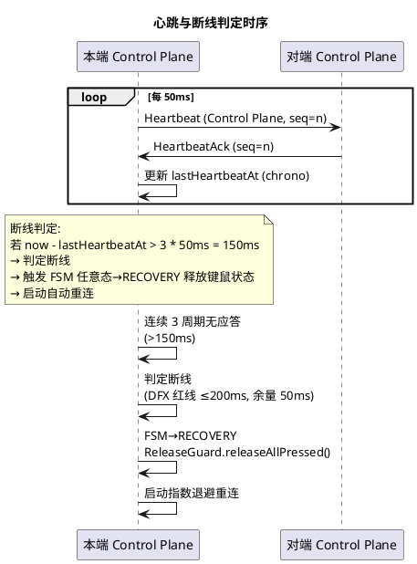

### 2.11.5 协议版本协商

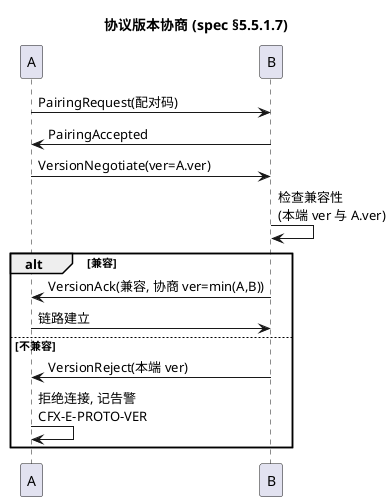

### 2.11.6 配对门控

- 链路建立前必须完成配对确认（spec §5.5.1.10 / §4.3.1）。
- 配对码由运维配置员预先分发，本地持久化已配对端点 NodeID 列表。
- 未配对端点的任何报文被 `PairingGate` 拒绝，不进入协议版本协商。
- 第一版采用明文 + 配对码基线（spec §4.3.3），强加密归属 CF8。

### 2.11.7 自动重连

- 断线后启动指数退避重连（初始 500ms，上限 30s）。
- 重连成功后重新协商协议版本、恢复拓扑视图（spec §4.2.4）。
- 被控端不自动恢复按下状态（spec §5.5.3.6），需用户重新操作，避免"幽灵按下"。

---

## 2.12 用户态实现策略

### 2.12.1 macOS 用户态输入捕获/注入方案选型

| 候选方案 | 是否用户态 | 性能 | 兼容性 | 选择 |
|---------|-----------|------|--------|------|
| CGEventTap + CGEventPost | 是（需 Accessibility 权限） | ≥1000 events/s（满足 DFX） | macOS 12+ 稳定 | ✅ 选定 |
| IOKit HID | 是但需 root | 高 | 复杂 | ❌ 第一版不选 |
| Kernel Extension (kext) | 否 | 极高 | macOS 12+ kext 弃用 | ❌ 违反 Driverless 约束 |
| Virtual HID (后续) | 否（需驱动） | 极高 | 后续路线 | ⏸️ CF0 不依赖，作为后续性能路线 |

**选定理由**：CGEventTap + CGEventPost 为 macOS 12+ 用户态标准方案，性能满足 DFX 红线 ≥1000 events/s，不引入 kext，符合 Driverless User-Mode Architecture。Accessibility 权限为用户授权范畴，非内核特权。Apple Clang ≥15 完整支持 C++20（spec §4.5.5）。

### 2.12.2 Windows 用户态输入捕获/注入方案选型

| 候选方案 | 是否用户态 | 性能 | 兼容性 | 选择 |
|---------|-----------|------|--------|------|
| WH_MOUSE_LL/WH_KEYBOARD_LL + SendInput | 是 | ≥1000 events/s（满足 DFX） | Windows 10+ 稳定 | ✅ 选定 |
| Raw Input (WM_INPUT) | 是 | 高 | 仅捕获，注入需另案 | ❌ 注入不闭环 |
| 跨进程 SendInput + 全局钩子 | 是 | 中 | Windows 10+ | ❌ 低级钩子已足够 |
| Kernel Driver / Virtual HID | 否 | 极高 | 后续路线 | ⏸️ CF0 不依赖 |

**选定理由**：低级钩子为 Windows 用户态最底层捕获，配合 SendInput 实现注入闭环，无需驱动安装，满足 DFX 红线。MSVC ≥19.3x 与 Clang ≥17 完整支持 C++20（spec §4.5.5）。

### 2.12.3 用户态约束遵守清单

| 规格条目 | 约束 | 实现应对 |
|---------|------|---------|
| §4.5.3 | 禁止内核扩展/驱动/特权提升 | 全部 API 用户态；macOS Accessibility 为用户授权 |
| §5.5.1.9 | 传输层禁内核态 | 纯 socket 实现 |
| §5.5.1.12 | 安装包不含内核扩展/驱动 | 构建产物仅用户态二进制 |
| §1.4.2 | 第一版不引入 kext/Virtual HID | Virtual HID 列为后续性能路线，CF0 不依赖 |

---

## 2.13 错误处理与异常恢复机制

### 2.13.1 错误码体系

采用结构化错误码前缀 `CFX-<level>-<module>-<reason>`，对齐用户偏好 HTK-E-* 风格。v2 新增防抖动、并发、非法转移等错误码。

| 模块缩写 | 错误码示例 | 含义 | 级别 |
|---------|-----------|------|------|
| CAP | CFX-E-CAP-PERM | 输入捕获权限缺失 | Error |
| CAP | CFX-E-CAP-API | 平台捕获 API 失败 | Error |
| INJ | CFX-E-INJ-PERM | 注入权限缺失 | Error |
| INJ | CFX-E-INJ-API | 注入 API 失败 | Error |
| NORM | CFX-W-NORM-UNKNOWN | 未知事件类型丢弃 | Warn |
| NORM | CFX-W-NORM-SEQBACK | 序号回跳丢弃 | Warn |
| TOPO | CFX-E-TOPO-NODEID-DUP | NodeID 冲突 | Error |
| TOPO | CFX-E-TOPO-NEIGHBOR-OVER | 邻居数量超限 | Error |
| TOPO | CFX-E-TOPO-NONLINEAR | 非线形拓扑 | Error |
| TOPO | CFX-E-TOPO-TWOPOINT-DEGEN | 两点退化（契约③） | Error |
| HANDOFF | CFX-E-HANDOFF-TIMEOUT | 握手超时回退 | Error |
| HANDOFF | CFX-I-HANDOFF-YIELD | 双向冲突败方让步 | Info |
| HANDOFF | CFX-I-HANDOFF-REJECT | 目标端拒绝 Handoff | Info |
| HANDOFF | CFX-E-HANDOFF-ILLEGAL-TRANS | 非法 FSM 转移（契约②） | Error |
| HANDOFF | CFX-E-HANDOFF-ILLEGAL-STATE | 非法 FSM 态调用（契约②） | Error |
| HANDOFF | CFX-W-HANDOFF-REENTRY | FSM 重入尝试丢弃（契约②） | Warn |
| HANDOFF | CFX-W-HANDOFF-JITTER | 抖动熔断告警（契约②） | Warn |
| HANDOFF | CFX-E-HANDOFF-JITTER-ESCALATE | 抖动连续熔断需人工介入（契约②） | Error |
| MAP | CFX-E-MAP-NOBOUNARY | 目标边界缺失 | Error |
| CP | CFX-E-CP-RETX-OVER | 控制平面重传超限 | Error |
| IP | CFX-W-IP-BACKLOG | 输入平面队列积压 | Warn |
| PROTO | CFX-E-PROTO-VER | 协议版本不兼容 | Error |
| LINK | CFX-E-LINK-DOWN | 链路断线 | Error |
| PAIR | CFX-E-PAIR-UNPAIRED | 未配对端点请求 | Error |
| THREAD | CFX-E-THREAD-OVER-LIMIT | 线程数超限（契约⑦） | Error |
| THREAD | CFX-E-THREAD-SHUTDOWN-TIMEOUT | 终止清理超时（契约⑦） | Error |

### 2.13.2 错误处理范式（C++20 std::expected）

**范式**：全部可失败操作返回 `std::expected<T, CfxError>`，禁止抛异常（spec §8.2.2 / §8.3.3）。热路径无 throw/try/catch。

**调用模式**：
```cpp
auto result = operation();
if (!result) {
    logger.error("operation failed", result.error());
    // 错误恢复策略
} else {
    use(*result);
}
```

**异常场景与恢复策略**（对齐 spec.md 各地基异常场景）：

| 异常场景 | 触发条件 | 系统行为 | 用户感知 | 规格条目 |
|---------|---------|---------|---------|---------|
| 未知事件类型 | 捕获上报未定义类型 | 丢弃 + 告警日志 | 无 | §5.1.3.1 |
| 序号回跳 | 接收 seq < 上帧 seq | 丢弃回跳帧 + 异常日志，不判断线 | 无 | §5.1.3.2 |
| 时间戳倒流 | 接收 ts < 上帧 ts | 按序号优先处理 + 告警 | 无 | §5.1.3.3 |
| 修饰键不一致 | Handoff 后状态不符 | 以源端快照为准强制对齐 | 无粘键 | §5.1.3.4 |
| NodeID 冲突 | 新端点 NodeID 已存在 | 拒绝加入 + 告警运维 | 新端点无法加入 | §5.2.3.1 |
| 拓扑视图不一致 | 合并后矛盾 | 以最新配置为准；无法裁决则安全停摆 | 切换不可用 | §5.2.3.2 |
| 邻居失联 | 心跳超时 | 标记失联，该方向暂停 Handoff | 失联方向切换不生效 | §5.2.3.3 |
| 平台类型缺失 | 未声明平台 | 拒绝加入 | 端点无法加入 | §5.2.3.4 |
| 握手超时 | 20ms 未应答 | PENDING→COOLDOWN→ARMED 回退 | 鼠标回退本端 | §5.3.3.1 |
| 双向同时触发 | 互向对方发起 | TraceId 小者胜，败方经 COOLDOWN 让步 | 单向完成 | §5.3.3.2 |
| 握手中链路断开 | 握手期间断线 | 双方回退（经 COOLDOWN/RECOVERY） | 鼠标回退本端 | §5.3.3.3 |
| 被控端链路断开 | 被控态断线 | ACTIVE→COOLDOWN→RECOVERY 100ms 内释放所有按下状态 | 无粘键 | §5.3.3.4 |
| 目标端拒绝 Handoff | 配置/策略/状态 | 源端保持 ARMED | 鼠标停留本端 | §5.3.3.5 |
| 冷却期内越界 | COOLDOWN 态越界 | 丢弃事件 + 钳制鼠标回边缘内侧 | 鼠标停留本端 | §5.3.1.11 |
| 停留未达标越界 | ACTIVE 态停留 <50ms 越界 | 忽略事件 | 鼠标停留本端 | §5.3.1.12 |
| 抖动熔断 | 1 秒内 >5 次 Handoff | 冷却期提升至 300ms + 告警 | 切换暂停 | §5.3.1.13 |
| 连续熔断 | 连续 3 次熔断 | 向运维告警要求人工介入 | 切换暂停 | §5.3.1.13 |
| FSM 非法转移 | 转移路径非法 | 拒绝 + 告警，FSM 保持原态 | 无 | 契约② |
| FSM 重入 | PENDING/ACK/COOLDOWN/RECOVERY 期间新事件 | 排队或丢弃 + 告警 | 无 | §5.3.1.18 |
| 分辨率变更 | 会话中变更 | 重新声明边界 + 全拓扑同步 | 短暂回退后正常 | §5.4.3.1 |
| 多显示器未声明 | 未声明合并 | 拒绝加入拓扑 | 配置界面提示 | §5.4.3.2 |
| 越界量超目标屏 | 高速滑动 | 入射坐标钳制 | 切换完成无失控 | §5.4.3.3 |
| 目标边界缺失 | 未声明边界 | 拒绝 Handoff | 鼠标停留本端 | §5.4.3.4 |
| 协议版本不匹配 | 版本不兼容 | 拒绝连接 + 告警 | 连接失败提示 | §5.5.3.1 |
| Control Plane 丢失 | 报文丢失 | 重传 + 去重；超限判断线 | 握手延迟或断线释放 | §5.5.3.2 |
| 心跳超时 | 3 周期无应答 | 判断线 + 释放 + 重连 | 被控端键鼠恢复空闲 | §5.5.3.3 |
| Input Plane 拥塞 | 队列积压超阈值 | 丢过期帧 + 优先最新 | 转微丢帧不卡死 | §5.5.3.4 |
| 未配对请求连接 | 未配对 | 拒连接 + 安全告警 | 提示需先配对 | §5.5.3.5 |
| 重连后状态恢复 | 重连成功 | 重新协商 + 恢复拓扑；不恢复按下状态 | 需重新按键 | §5.5.3.6 |
| 线程数超限 | 线程数 >8 | 告警 + 架构审查 | 无 | 契约⑦ |
| 终止清理超时 | 清理 >200ms | 告警 + 强制退出 | 无 | 契约⑦ |

### 2.13.3 安全停摆机制

当拓扑视图不一致且无法自动裁决时（spec §5.2.3.2），系统进入安全停摆：

- 拒绝发起与接受 Handoff（FSM 保持当前态，越界事件丢弃）。
- 持续告警运维配置员。
- 本机输入正常作用于本端（不阻塞用户使用本机）。
- 运维下发新配置后退出停摆。

### 2.13.4 释放清单与"无粘键"保证

被控端链路断开时，`ReleaseGuard` 执行（经 RECOVERY 态）：

1. FSM 转入 RECOVERY 态。
2. 读取本端 `ModifierTracker` 维护的按下键集合 + 按下鼠标按钮集合。
3. 对每个按下项生成对应"释放"规范事件（按键释放 / 鼠标按钮释放）。
4. 调用 `IInputInjector.injectBatch(std::span<release events>)` 批量注入。
5. FSM 经 RECOVERY → ARMED 或空闲。
6. 结构化日志记录释放清单（含 NodeId、TraceId、释放项数、耗时）。
7. 总耗时预算 100ms（DFX 红线 §4.2.1）；超时项记告警但不阻塞状态转移。

**重连后不恢复按下状态**（spec §5.5.3.6）：避免"幽灵按下"，需用户重新操作。

---

## 2.14 性能保障措施（DFX 红线达成路径）

### 2.14.1 DFX 红线达成分析

| DFX 红线 | 目标 | 设计措施 | 预算分配 |
|---------|------|---------|---------|
| Handoff 端到端延迟 | ≤30ms | 握手超时 20ms；TCP+coroutine 局域网 ≤5ms/单程；预转入主控 ≤1ms；首帧注入 ≤1ms；FSM 转移 ≤1ms | 1+5+1+1+5+1+5+1=20ms，余量 10ms |
| 单向转发延迟 | ≤10ms | UDP+coroutine 直发；零拷贝编解码；本端捕获→规范化→发送 ≤1ms；对端接收→注入 ≤1ms；网络 ≤5ms | 1+5+1=7ms，余量 3ms |
| 事件吞吐 | ≥1000 events/s | 用户态 API 满足；零分配热路径；批量注入（span） | macOS/Windows 用户态 API 实测可达 |
| 心跳周期 | ≤50ms | HeartbeatTimer 周期 50ms | 取上限减少控制流量 |
| 断线判定延迟 | ≤200ms | 3 周期阈值 = 150ms | 余量 50ms |
| 键鼠状态释放延迟 | ≤100ms | ReleaseGuard 批量注入释放事件（经 RECOVERY） | 100ms 预算 |
| 冷却期时长 | ≥80ms | CooldownTimer 80ms（熔断时 300ms） | 取下限最快恢复 |
| 最小停留时间 | ≥50ms | DwellTimeGuard 50ms | 取下限 |
| 抖动频率上限 | ≤5 次/秒 | JitterDetector 1 秒窗口 + JitterCircuitBreaker 熔断 | 超限熔断 |
| FSM 状态转移延迟 | ≤1ms | FSM 线程内串行；无锁；禁 I/O/异常 | ≤1ms |
| 线程数 | ≤8 | 8 线程模型 | 达上界 |
| 终止清理 | ≤200ms | std::jthread::request_stop + joinAll(200ms) | 200ms 预算 |

### 2.14.2 热路径优化策略

- **零分配热路径**：CanonicalInputEvent 使用对象池复用，避免高频 GC（RAII 管理）。
- **零拷贝编解码**：FrameCodec 直接在发送缓冲区写入（`std::span` 视图），避免中间拷贝。
- **批量注入**：`IInputInjector.injectBatch(std::span)` 支持批量，减少 API 调用开销。
- **独立线程/事件循环**：Input Plane 与 Control Plane 独立 `std::jthread` + coroutine，互不阻塞。
- **无锁优先**：ModifierTracker 等热路径状态用 `std::atomic`；通信用无锁 SPSC/MPMC 队列。
- **coroutine 异步 I/O**：传输层 socket 收发用 C++20 coroutine，禁阻塞。

### 2.14.3 背压与丢帧策略

- Input Plane 队列积压 > 75% 容量时丢过期帧，保证最新优先（spec §5.5.1.4）。
- 不累积延迟：队列长度始终 ≤ 容量上限。
- Control Plane 不丢帧，重传保证可靠。

### 2.14.4 可观测性指标（spec §4.4.3）

运行时暴露以下指标：

- 当前拓扑视图（端点列表 + 邻居关系 + 版本号 + isCircular + segmentCount）。
- 各端点状态（HandoffState 六态 + EndpointState 三态宏观映射）。
- 各链路状态（未配对/配对中/已建立/断线/重连中）+ lastHeartbeatAt。
- 最近一次 Handoff 耗时（含 TraceId + 转移路径）。
- Input Plane 队列积压量。
- 事件吞吐统计（events/s）。
- 释放清单计数。
- **v2 新增**：FSM 当前态、cooldown 剩余时间、dwell time 已停留时长、抖动熔断状态（Normal/Tripped/Escalated）、线程数、各线程运行状态。

---

## 2.15 与后续 CF1-CF11 阶段的接口契约定义

CF0 v2 冻结五个地基 + 7 个核心契约 + C++20 技术栈，为后续阶段提供稳定接口契约。后续阶段在 CF0 接口之上扩展，不破坏 CF0 契约。

| 后续阶段 | 扩展点 | CF0 提供的契约 | 后续阶段不破坏的约束 |
|---------|--------|--------------|-------------------|
| CF1 工程实现 | 全部 CF0 接口实现 | 接口签名 + 数据模型 + 协议帧布局 + C++20 设施使用 | 接口行为符合 CF0 规格；C++20 基线不降级 |
| CF2 配置与发现 | ITopologyManager.loadTopology | 拓扑配置文件 schema 版本化 | 不改变 NodeID 持久化格式；不破坏契约③ |
| CF3 macOS Agent 打包 | IInputCapture/IInputInjector macOS 实现 | 抽象接口 | 不引入 kext；不破坏契约① |
| CF4 Windows Agent 打包 | IInputCapture/IInputInjector Windows 实现 | 抽象接口 | 不引入驱动；不破坏契约① |
| CF5 Handoff 调优 | IHandoffOrchestrator/IHandoffFsm 配置项 | 握手超时/裁决策略/cooldown/dwell time 可配置 | 不破坏六态 FSM 不变量（契约②）；不破坏防抖动四重契约 |
| CF6 坐标映射增强 | ICoordMapper | 越界换算接口 | 不改变原点规则与比例映射（契约⑤） |
| CF7 传输层增强 | IControlPlaneChannel/IInputPlaneChannel | 双平面隔离契约 | 不破坏平面隔离（契约⑥）；不破坏线程隔离（契约⑦） |
| CF8 强加密 | FrameCodec 扩展点 | 协议帧 flags 保留位 + 版本号 | 旧版本可安全忽略新字段；双平面隔离不变 |
| CF9 拓扑扩展 | TopologyView | 线性排列契约（第一版） | 后续可扩展为树/网状，CF0 不依赖；不破坏契约③ |
| CF10 多显示器 | ScreenBoundary | 单一逻辑边界契约 | 后续可扩展多逻辑屏 |
| CF11 GUI 与打包 | 无（CF0 不含 GUI） | 协议与模型已冻结 | GUI 仅消费 CF0 指标；不破坏契约④ Input Plane 直通 |

**CF0 v2 冻结边界**：
- 冻结：规范输入事件模型、端点身份与拓扑模型（含循环回环）、Handoff 六态状态机（含防抖动四重契约）、坐标空间与屏幕映射、低延迟传输协议（含双平面隔离）、并发与线程安全模型（8 线程）、C++20 技术栈基线、7 个核心契约。
- 不冻结：GUI、打包、强加密、多显示器合并策略、树/网状拓扑、Virtual HID 性能路线。

---

## 2.16 方案决策汇总

| 决策点 | 候选方案 | 选定方案 | 选择理由 |
|-------|---------|---------|---------|
| 架构原则 | Driverless / Kernel Driver / Virtual HID | Driverless User-Mode | spec §1.4.2 第一版不碰驱动 |
| **技术栈基线** | C++17 / C++20 / C++23 | **C++20** | spec §4.5.4 / §8.1 项目经理裁决；为 span/expected/jthread/coroutine/concepts/chrono/variant/atomic 等大量依赖预留地基 |
| **编译器矩阵** | 单编译器 / 多编译器 | **Apple Clang≥15 + MSVC≥19.3x + Clang≥17** | spec §4.5.5 / §8.1.2 C++20 完整支持；CI 全组合覆盖 |
| **错误处理** | 异常 / 错误码+出参 / std::expected | **std::expected<T, CfxError>** | spec §8.2.2 热路径禁异常；类型安全；错误信息完整 |
| **长生命周期线程** | std::thread / std::jthread | **std::jthread** | spec §8.2.3 自动 join + 可中断；契约⑦ 显式线程模型 |
| **异步 I/O** | 阻塞 socket / coroutine / io_uring/IOCP | **C++20 coroutine + io_uring/IOCP** | spec §8.2.4 / §4.6.7 禁阻塞 socket；协程调度器独立 |
| **模板约束** | SFINAE / static_assert / concepts | **concepts** | spec §8.2.5 C++20 标准设施；接口契约清晰 |
| **时间表示** | 裸整数 / std::chrono | **std::chrono** | spec §8.2.6 强类型时长；避免单位错误 |
| **多态负载** | 虚函数继承 / 裸 union / std::variant | **std::variant + std::visit** | spec §8.2.7 性能与类型安全兼顾 |
| **跨线程状态** | mutex / std::atomic | **std::atomic (lock-free)** | spec §8.2.8 / §4.6.5 热路径无锁优先 |
| **枚举** | 裸 enum / enum class | **enum class** | spec §8.2.9 作用域枚举；禁隐式转换 |
| **Handoff FSM 状态** | 三态 / 四态 / 六态 | **六态 ARMED/PENDING/ACK/ACTIVE/COOLDOWN/RECOVERY** | spec §5.3.1.2 / 契约② 完整状态；防抖动核心 |
| **防抖动机制** | 单一冷却期 / 多重契约 | **四重契约（cooldown+dwell+jitter+不可重入）** | spec §4.2.6-8 / 契约② Mac↔Win 抖动抑制 |
| **冷却期时长** | 50ms / 80ms / 100ms | **80ms（熔断时 300ms）** | spec §4.1.6 下限；熔断 §4.2.8 提升至 300ms |
| **最小停留时间** | 30ms / 50ms / 100ms | **50ms** | spec §4.1.7 下限 |
| **抖动频率阈值** | 3/5/10 次/秒 | **5 次/秒** | spec §4.1.8 上限 |
| **FSM 所有权** | 多线程加锁 / 单线程所有权 | **单线程所有权 + 无锁 SPSC 队列** | spec §4.6.2 / 契约⑦ 跨线程无锁递交 |
| **线程数** | 无界 / ≤4 / ≤8 / ≤16 | **≤8** | spec §4.6.8 / 契约⑦ 架构红线 |
| **终止清理** | 无界 / ≤100ms / ≤200ms | **≤200ms** | spec §4.6.9 红线 |
| 传输协议 | TCP/UDP/QUIC/自定义 | TCP（Control）+ UDP（Input） | 双平面隔离；TCP 可靠有序；UDP 低延迟可丢帧；QUIC 引入复杂度，CF0 不需要 |
| 编码格式 | JSON/XML/二进制/Protobuf | 二进制自定义帧 | spec §5.5.1.1 强制二进制；自定义帧避免 Protobuf 运行时依赖 |
| NodeID 生成 | UUIDv4/自增/哈希 | UUIDv4 (u128) | 全局唯一、可比较（用于双向冲突裁决）、无需中心分配 |
| TraceId 生成 | UUIDv4/时间戳/自增 | UUIDv4 (u128) | 全局唯一、可比较、无时钟同步依赖 |
| 双向冲突裁决 | trace_id 小者胜 / 时间戳早者胜 / 优先级 | trace_id 小者胜 | 避免跨端时钟同步问题，无需 NTP |
| macOS 捕获 | CGEventTap / IOKit / kext | CGEventTap | 用户态、性能满足、macOS 12+ 稳定 |
| Windows 捕获 | 低级钩子 / Raw Input / 驱动 | WH_MOUSE_LL + WH_KEYBOARD_LL | 用户态最底层、注入闭环 |
| 心跳周期 | 10ms / 50ms / 100ms | 50ms | DFX 红线 ≤50ms，取上限减少控制流量 |
| 断线阈值 | 2/3/5 周期 | 3 周期（150ms） | DFX 红线 ≤200ms，留 50ms 余量 |
| 握手超时 | 10ms / 20ms / 50ms | 20ms | DFX 红线 30ms 端到端，预留 10ms 给注入与抖动 |
| Input Plane 队列 | 64/128/256/512 | 256 | 平衡内存与丢帧阈值；75% 触发丢帧 |
| 重传上限 | 3/5/10 次 | 5 次 | 平衡可靠性与断线判定速度 |
| 拓扑结构 | 线性/树/网状 | 线性序列（含回环） | spec §5.2.1.4 第一版限定线性，支持循环切换（契约③） |
| 多显示器 | 合并/拒绝/多逻辑屏 | 合并声明或拒绝 | spec §5.4.1.7 第一版按单一逻辑屏处理 |
| 强加密 | TLS/自研/明文+配对码 | 明文+配对码（第一版基线） | spec §4.3.3 强加密归属 CF8 |
| 配对机制 | 证书/预共享密钥/配对码 | 配对码 | spec §4.3.1 显式配对确认；证书体系归属 CF8 |
| 平台选择 | 运行时插件/编译期选择 | 编译期选择 | CF0 无需热插拔平台实现，简化部署 |

---

## 2.17 CF0 Architecture Safety Invariant（v3 新增：核心安全不变量）

> **本章节为 v3 修订新增，对应大G项目经理特别强调的核心不变量。**
> **此不变量同时提请 spec-requirement-agent 同步写入 spec.md（本次仅修订 design.md）。**

### 2.17.1 不变量陈述

```text
CF0 Architecture Safety Invariant

任何时刻，整个 CrossFlow-X 拓扑中只能存在一个合法 Control Owner；
任何 Handoff 失败、断线、超时或异常，都不能导致输入永久丢失或双重控制。

形式化表达:
  ∀ t ∈ Time:
    (1) |{ e ∈ Topology(t) : e.isControlOwner() }| ≤ 1   // 无双重控制
    (2) ∀ e ∈ Topology(t): ¬e.isInputPermanentlyLost()     // 无永久丢失
    (3) ∀ failure ∈ {HandoffFail, Disconnect, Timeout, Exception}:
          failure.recovery() ⟹ ∃ t' > t: Topology(t') satisfies (1) ∧ (2)  // 可恢复
```

### 2.17.2 不变量三大性质

| 性质 | 陈述 | 保障机制 |
|------|------|---------|
| **P1: 单一控制权（No Split-Brain）** | 任意时刻拓扑中 Control Owner 数量 ≤1 | ACK 事务语义 PREPARE→ACK→COMMIT→ACTIVE（§2.5.6）；COMMIT 前 Source 恒持 LOCAL ownership；双向冲突 TraceId 裁决（§2.1.3.4） |
| **P2: 无永久丢失（No Void-Owner）** | 任何失败后，本地键鼠不永久失效，可在有限时间内恢复控制 | 失败路径必经 RECOVERY 清理后回 ARMED（§2.5.2 v3 显式超时/失败路径）；void-owner 修复路径（§2.5.6.5） |
| **P3: 可恢复性（Recoverable）** | 任何失败后，系统在有限时间内回到满足 P1 ∧ P2 的状态 | RECOVERY 态清理 ≤100ms（§2.5.1）；COOLDOWN 恢复 ≤80ms（§2.6.1）；自动重连指数退避（§2.11.7） |

### 2.17.3 保障机制映射

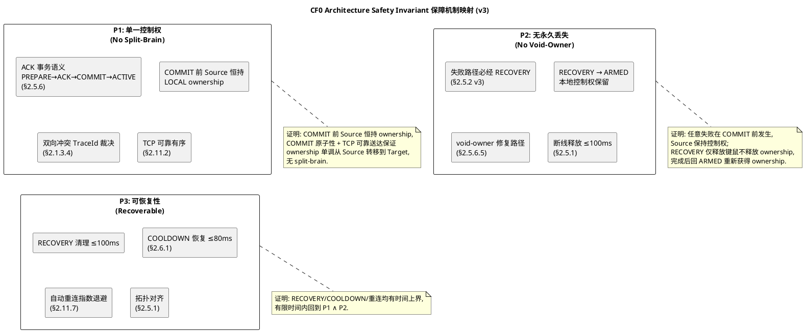

### 2.17.4 不变量可验证性（统一格式）

```text
Contract
  任何时刻，整个 CrossFlow-X 拓扑中只能存在一个合法 Control Owner；
  任何 Handoff 失败、断线、超时或异常，都不能导致输入永久丢失或双重控制。

Invariant
  P1 (No Split-Brain): |{e ∈ Topology : e.isControlOwner()}| ≤ 1
  P2 (No Void-Owner): ∀ e ∈ Topology: ¬e.isInputPermanentlyLost()
  P3 (Recoverable): 任意失败后有限时间内回到满足 P1 ∧ P2 的状态

Violation
  拓扑中出现两个端点同时认为自己持控制权（split-brain）；
  某端点键鼠永久失效，无法恢复（void-owner 永久）；
  失败后系统无法在有限时间内恢复（不可恢复）。

Observable Evidence
  CF0-ARCH-SAFETY-001: 任意时刻查询全拓扑，Control Owner 数量 ≤1
  CF0-ARCH-SAFETY-002: 模拟 Mac PENDING → Windows 无响应 → TIMEOUT → Mac 仍持控制权，Mac 键鼠不失效
  CF0-ARCH-SAFETY-003: 模拟任意失败（timeout/disconnect/exception），失败后 ≤300ms 系统回到满足 P1 ∧ P2
  CF0-ARCH-SAFETY-004: 模拟双向并发 Handoff，裁决后拓扑中 Control Owner 数量 = 1
  CF0-ARCH-SAFETY-005: 模拟 COMMIT 丢失（void-owner 场景），Source RECOVERY 后重新获得 ownership
  CF0-ARCH-SAFETY-006: 长时运行 24 小时，周期性注入故障，无 split-brain / 无永久丢失

Acceptance Test
  CF0-ARCH-SAFETY-001: 集成测试周期性查询全拓扑 Control Owner 数量，断言 ≤1
  CF0-ARCH-SAFETY-002: 集成测试模拟 PENDING 超时，断言 Mac 控制权保留 + 键鼠可用
  CF0-ARCH-SAFETY-003: 集成测试注入各类故障，断言 ≤300ms 恢复 P1 ∧ P2
  CF0-ARCH-SAFETY-004: 集成测试双向并发 Handoff，断言裁决后 Control Owner = 1
  CF0-ARCH-SAFETY-005: 集成测试模拟 COMMIT 丢失，断言 Source RECOVERY 后重新获得 ownership
  CF0-ARCH-SAFETY-006: 长时稳定性测试 24 小时 + 故障注入，断言无 split-brain / 无永久丢失
```

### 2.17.5 与其他契约的关系

| 契约 | 对 Safety Invariant 的贡献 |
|------|---------------------------|
| 契约② Handoff FSM 完整状态 | 提供 RECOVERY 态作为失败清理保障点（P2, P3） |
| 契约③ Topology 循环支持 | 保证拓扑无死路，避免端点被孤立导致控制权无去处（P2） |
| 契约⑥ Transport 双平面隔离 | Control Plane TCP 可靠有序保证 COMMIT 送达（P1） |
| 契约⑦ Concurrency/Threading | FSM 单线程所有权保证状态转移原子性（P1, P2） |
| §2.5.6 ACK 事务语义 | PREPARE→ACK→COMMIT→ACTIVE 事务模型直接保障 P1（无 split-brain） |
| §2.5.2 v3 超时/失败路径 | 显式化失败路径必经 RECOVERY，保障 P2, P3 |

### 2.17.6 验收地位

**本不变量为 CF0 架构冻结的最高优先级验收项**。任何违反 Safety Invariant 的实现均视为架构破坏，必须立即回退修正，优先级高于功能完整性、性能、兼容性等其他验收项。

**冻结裁决**：CF0 Architecture Freeze 的必要条件是 Safety Invariant 全部可验证通过（CF0-ARCH-SAFETY-001 ～ 006）。若任一验收项失败，CF0 不得冻结。

---

> **设计文档结束**
> 本实现方案设计文档基于 `.codeartsdoer/specs/cf0_arch_freeze/spec.md`（v2，892 行需求规格）生成，覆盖 CF0-S01～CF0-S05 五个架构地基的完整增量设计方案 + 7 个核心契约的设计保障措施 + C++20 技术栈使用方案 + CF0 Architecture Safety Invariant，严格遵循规格冻结的约束（不传画面、不装驱动、不做强加密、不依赖固定 IP、C++20 基线不降级、六态 FSM 完整、防抖动四重契约、并发模型 ≤8 线程）。
> **本次更新（v2）**：C++17 → C++20 升级（编译基线 + 编译器矩阵 + 9 项 C++20 设施使用方案 + 4 项禁止项保障）；Handoff FSM 三态 → 六态（ARMED/PENDING/ACK/ACTIVE/COOLDOWN/RECOVERY + 9 条转移路径 + 三态/六态映射）；防抖动四重契约设计（CooldownTimer + DwellTimeGuard + JitterDetector + JitterCircuitBreaker + FSM 不可重入守卫）；并发与线程安全模型设计（8 线程架构 + 无锁队列 + coroutine 异步传输 + 终止清理 ≤200ms）；7 个核心契约的设计保障措施；接口签名全面对齐 C++20 设施（std::expected/std::span/std::jthread/concepts/chrono/variant/atomic/enum class）。
> **v3 修订（本次）**：按大G项目经理 6 项架构级修改意见完成修订：
>   - **修改 1**：防抖参数从"参数契约"升级为"行为契约"（§2.6.0），明确 80/50ms 的行为时序性质与可观察证据（CF0-DEBOUNCE-001～005）；
>   - **修改 2**：六态 FSM 显式化超时/失败路径（PENDING→RECOVERY / ACK→RECOVERY / ACTIVE→RECOVERY），明确"任何 Handoff 失败不得丢失本地控制权"核心安全性质（§2.1.3.1 / §2.5.1 / §2.5.2）；
>   - **修改 3**：新增 ACK 事务语义设计（§2.5.6），PREPARE→ACK→COMMIT→ACTIVE 事务提交模型，证明 split-brain 抑制与 void-owner 修复；
>   - **修改 4**：Coordinate Space 区分绝对位置（AbsolutePosition）与相对运动（RelativeDelta），核心控制路径用相对运动，边缘 Handoff 用逻辑坐标（§2.10.0）；
>   - **修改 5**：C++20 特性分级 MUST/SHOULD/OPTIONAL/FORBIDDEN（§2.8.2.0/2.8.2.1），coroutine 限 Transport 层不渗透 FSM，enum class 不作重点验收，concepts 不过度使用；
>   - **修改 6**：7 个核心契约全部采用统一可验证格式（Contract/Invariant/Violation/Observable Evidence/Acceptance Test），分配架构测试 ID（CF0-ARCH-*-001～），验收要求可执行 evidence；
>   - **新增 §2.17 CF0 Architecture Safety Invariant**：核心安全不变量"任何时刻拓扑中只能存在一个合法 Control Owner；任何失败都不能导致输入永久丢失或双重控制"，作为 CF0 架构冻结最高优先级验收项。
> **保持不变**：不传屏幕画面、不做远程桌面、不依赖固定 IP、NodeID 与 IP 解耦、鼠标边缘触发 Handoff、键盘跟随控制权、Mac→Win→Win→Mac 循环、Input Plane 与 Control Plane 完全隔离、断线自动释放键鼠、先用户态 Virtual HID 后续路线、跨平台抽象层、坐标映射算法、传输层双平面、用户态实现策略。
> 待用户审查确认后，本文档状态由 DRAFT v3 转为 FROZEN，进行最终 CF0 Architecture Freeze 裁决，交付 spec-task-agent 进行任务分解。
