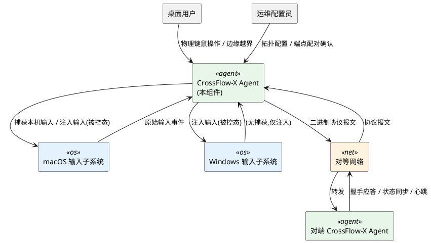
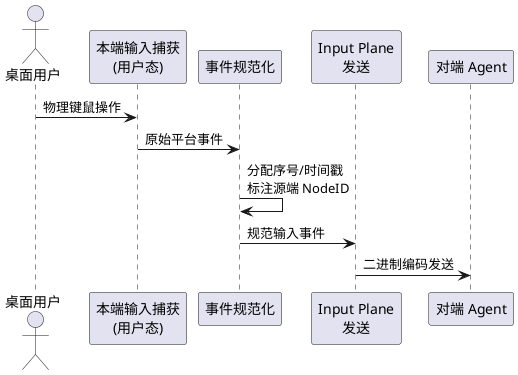
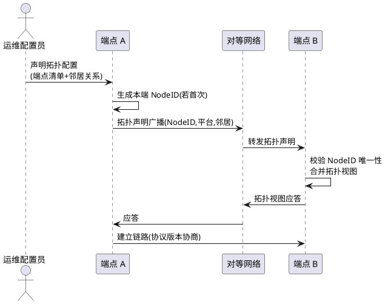
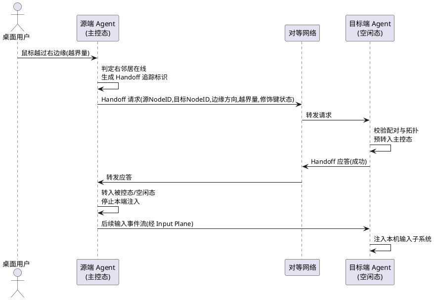
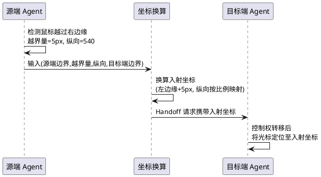
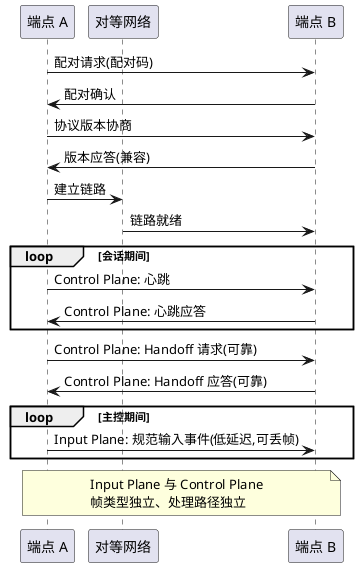

# CrossFlow-X · CF0 架构规格冻结需求规格说明书

> **阶段标记**：CF0 — Architecture Specification / Freeze
> **规格范围**：CF0-S01 ～ CF0-S05（五个架构地基）
> **架构原则**：Driverless User-Mode Architecture（第一版不碰驱动，Virtual HID 作为后续性能路线）
> **技术栈基线**：C++20（项目经理裁决，由 C++17 升级；为 std::span / std::expected / std::jthread / coroutine / concepts / chrono / variant / lock-free 等后续大量依赖预留地基）
> **架构审查**：CF0 Architecture Review（7 个核心契约审查，见第 7 章）
> **文档状态**：DRAFT v2 → 待用户审查冻结（v1 基线 f4706d9，本次为 C++20 升级 + FSM 完整化 + 防抖动 + 并发 + 7 契约补充）

---

# **1. 组件定位**

## **1.1 核心职责**

本组件负责在多台 macOS 与 Windows 主机之间，通过用户态输入捕获与注入实现键鼠输入的无缝切换与转发，实现单一键鼠集操控多屏多机的核心价值。

## **1.2 核心输入**

1. **本机物理键鼠操作**：来自桌面用户在当前主控端物理设备的移动、点击、按键、滚轮操作。
2. **鼠标边缘越界信号**：鼠标光标触及并越过本机屏幕逻辑边缘的触发事件，来源为本机输入捕获子系统。
3. **对端 Agent 协议报文**：来自对端 CrossFlow-X Agent 的二进制协议报文，包含切换握手应答、转发输入事件、拓扑同步、心跳。
4. **链路状态事件**：网络链路的建立、断开、重连事件，来源为传输层。
5. **拓扑配置指令**：运维配置员编排的端点清单与邻居关系，来源为配置加载或运行时配置接口。

## **1.3 核心输出**

1. **规范化输入事件流**：向对端 Agent 转发的平台无关输入事件流（Input Plane）。
2. **本机输入注入指令**：当本端处于被控态时，向本机输入子系统注入的输入事件。
3. **切换握手报文**：向对端发起的 Handoff 请求与状态广播（Control Plane）。
4. **链路心跳与拓扑发现报文**：周期性发送的心跳与拓扑声明报文。
5. **键鼠状态释放指令**：链路断开或控制权丢失时，向本机输入子系统发送的强制释放指令。

## **1.4 职责边界**

本组件 **不负责** 以下事项：

1. **不传输屏幕画面**：不采集、不编码、不传输任何屏幕像素数据，不提供远程桌面能力。
2. **不安装内核驱动**：第一版不引入 kext、Virtual HID 驱动、内核态注入；Virtual HID 仅作为后续性能路线，不作为 CF0 依赖。
3. **不依赖固定 IP 寻址**：不要求端点配置固定 IP，端点发现不绑定具体网络地址。
4. **不提供音视频转发**：不转发音频、视频流。
5. **不提供文件共享与剪贴板同步**：剪贴板同步可由后续阶段引入，CF0 不纳入。
6. **不负责跨平台 GUI 渲染**：GUI 与打包归属 CF11，CF0 仅冻结协议与模型。
7. **不负责端点配对的强加密**：CF0 仅冻结配对确认机制与协议版本字段，强加密与证书体系归属 CF8。

---

# **2. 领域术语**

**端点（Endpoint）**
: 参与键鼠无缝切换的一台主机，运行 CrossFlow-X Agent，具备独立 NodeID 与屏幕边界声明。

**节点标识（NodeID）**
: 端点的全局唯一逻辑标识，独立于网络地址，IP 变化不改变 NodeID。
: 备注：与 IP 解耦的核心载体。

**控制权（Control Authority）**
: 在一个拓扑中，持有物理键鼠集实际作用目标的端点状态；任意时刻整个拓扑最多一个端点持有控制权。

**输入平面（Input Plane）**
: 承载规范化输入事件流的逻辑通道，追求低延迟，允许丢帧，最新事件优先。

**控制平面（Control Plane）**
: 承载切换握手、拓扑同步、心跳、状态广播的逻辑通道，要求可靠有序传输。
: 备注：与 Input Plane 在协议层完全隔离。

**切换（Handoff）**
: 控制权从一个端点转移到另一个端点的过程，由鼠标边缘越界触发，经握手确认后完成。

**拓扑（Topology）**
: 全部端点及其邻居关系的整体视图；第一版限定为线性序列以支持循环切换。

**邻居（Neighbor）**
: 在拓扑中与某端点相邻的端点，对应其屏幕左边缘或右边缘；每个端点最多两个邻居（左、右）。

**主控态（Controlling State）**
: 端点当前持有控制权，本机物理键鼠操作作用于本端或被转发至对端。

**被控态（Controlled State）**
: 端点当前不持有控制权，接受对端转发的事件并向本机注入。

**空闲态（Idle State）**
: 端点既不持有控制权也不被对端控制，等待触发或被唤醒。

**边缘触发（Edge Trigger）**
: 鼠标光标越过本机屏幕逻辑边缘并存在对应邻居时，发起 Handoff 的触发条件。

**规范输入事件（Canonical Input Event）**
: 平台无关、统一编码的输入事件表示，是 Input Plane 上传输的唯一业务对象。

**坐标空间（Coordinate Space）**
: 以端点自身屏幕左上角为原点的逻辑像素坐标系，用于边缘越界量与入射坐标的换算。

**屏幕边界（Screen Boundary）**
: 端点屏幕的四条逻辑边缘及其宽高声明，用于邻居方向映射与越界判定。

**链路（Link）**
: 两个已配对端点之间建立的传输层连接，承载 Input Plane 与 Control Plane 报文。

**越界量（Overflow）**
: 鼠标光标越过屏幕边缘后超出边缘的像素距离，用于换算为目标端点的入射坐标。

**Driverless User-Mode Architecture**
: 第一版架构原则，所有输入捕获与注入均通过操作系统用户态 API 完成，不引入内核扩展或驱动。

**就绪态（ARMED）**
: Handoff FSM 状态之一，端点当前持有控制权且鼠标未越界，具备发起 Handoff 的能力；处于此态时边缘越界可触发状态转移至 PENDING。
: 备注：对应原"主控态"在 FSM 中的可发起 Handoff 子状态。

**待确认态（PENDING）**
: Handoff FSM 状态之一，源端已发出 Handoff 请求正在等待对端应答；此态下禁止重复发起 Handoff，禁止向本机注入对端输入。

**应答态（ACK）**
: Handoff FSM 状态之一，目标端已收到请求并预转入主控，正在回送应答；此态为控制权交接的临界点。

**激活态（ACTIVE）**
: Handoff FSM 状态之一，Handoff 完成后目标端正式持有控制权，接受并注入对端转发的事件流；对应"主控态"的稳态。

**冷却态（COOLDOWN）**
: Handoff FSM 状态之一，刚完成或回退一次 Handoff 后进入的强制静默期，期间禁止再次发起 Handoff，用于抑制 Mac↔Win 抖动。
: 备注：防抖动核心机制，见 §4.2 与 §5.3。

**恢复态（RECOVERY）**
: Handoff FSM 状态之一，断线、握手失败或异常后进入的清理与状态对齐态；完成键鼠释放与拓扑对齐后回到 ARMED 或空闲。

**抖动（Jitter）**
: 鼠标在两台端点边缘之间反复越界导致 Handoff 高频来回触发的病态现象；系统必须通过冷却期与最小停留时间抑制抖动。

**冷却期（Cooldown Window）**
: 一次 Handoff 结束（成功或回退）后强制禁止再次发起 Handoff 的时间窗口，是抑制抖动的核心契约。

**最小停留时间（Min Dwell Time）**
: 控制权转移到目标端后，鼠标必须在目标端屏幕内停留达到该时长才允许再次触发越界 Handoff，是抖动抑制的第二道防线。

**输入捕获线程（Capture Thread）**
: 专责从本机输入子系统采集原始事件的用户态线程，仅做轻量采集与异步派发，禁止在回调内执行重处理。

**输入注入线程（Injection Thread）**
: 专责向本机输入子系统注入规范事件的用户态线程，被控态下消费 Input Plane 事件流。

**传输线程（Transport Thread）**
: 专责双平面报文收发的线程，Input Plane 与 Control Plane 收发路径相互独立，禁止共享可变状态。

**控制平面线程（Control Plane Thread）**
: 专责 Handoff 握手、心跳、拓扑同步等控制报文处理的线程，与 Input Plane 处理路径隔离。

**FSM 单线程所有权（FSM Single-Owner）**
: Handoff 状态机的状态读写必须由单一专属线程串行执行，跨线程访问必须经无锁原子队列递交，禁止共享可变状态加锁。

---

# **3. 角色与边界**

## **3.1 核心角色**

- **桌面用户**：通过单一物理键鼠集操控多台主机的最终用户，其鼠标移动与键盘操作是系统行为的根本驱动。
- **运维配置员**：负责编排拓扑布局、声明端点清单、执行端点配对确认的人员。

## **3.2 外部系统**

- **macOS 输入子系统**：提供用户态输入捕获（事件监听）与输入注入能力的操作系统接口。
- **Windows 输入子系统**：提供用户态输入注入能力的操作系统接口。
- **对等网络**：承载 Agent 间二进制协议通信的局域网或对等网络环境。
- **对端 CrossFlow-X Agent**：接收转发事件、参与切换握手、同步拓扑与状态的对称对等组件。

## **3.3 交互上下文**

---

# **4. DFX约束**

## **4.1 性能**

1. **单次 Handoff 端到端延迟**：从边缘越界触发到目标端首帧注入完成，必须 ≤ 30ms（局域网内，第一版目标）。
2. **输入事件单向转发延迟**：Input Plane 单帧从源端发出到目标端注入，必须 ≤ 10ms（局域网内）。
3. **事件吞吐下限**：系统必须支持 ≥ 1000 events/s 的持续输入事件转发而不发生累积延迟。
4. **心跳周期**：链路心跳发送周期必须 ≤ 50ms。
5. **断线判定延迟**：从物理断线到系统判定断线并触发释放，必须 ≤ 200ms。
6. **冷却期时长下限**：一次 Handoff 结束（成功或回退）后，冷却期必须 ≥ 80ms，期间禁止再次发起 Handoff；该值与单次 Handoff 延迟（≤30ms）共同构成抖动抑制的第一道防线。
7. **最小停留时间下限**：控制权转移到目标端后，鼠标在目标端屏幕内停留必须 ≥ 50ms 才允许再次触发越界 Handoff；该值是抖动抑制的第二道防线。
8. **抖动频率上限**：任意 1 秒滑动窗口内，同一对相邻端点之间完成的 Handoff 次数必须 ≤ 5 次；超过即视为抖动，系统必须强制进入更长的冷却期（≥ 300ms）。
9. **FSM 状态转移延迟上限**：Handoff FSM 单次状态转移（ARMED→PENDING→ACK→ACTIVE 等任意相邻转移）的处理延迟必须 ≤ 1ms，禁止在状态转移路径中执行 I/O 或锁等待。

## **4.2 可靠性**

1. **键鼠状态释放延迟**：链路断开后，被控端释放所有按下键与按下鼠标按钮的延迟必须 ≤ 100ms。
2. **控制平面可靠传输**：Control Plane 消息必须可靠、有序送达；丢失时必须重传直至成功或判定断线。
3. **输入平面允许丢帧**：Input Plane 允许丢弃过期事件，但必须保证最新事件优先送达，禁止累积延迟。
4. **自动重连**：链路断开后必须自动尝试重连；重连成功后必须重新协商协议版本并恢复拓扑视图。
5. **单一会话可用性目标**：单次会话（一次配对到主动断开）可用性目标 ≥ 99.9%。
6. **防抖动契约（Cooldown 强制静默）**：一次 Handoff 完成（成功转入 ACTIVE）或回退（握手超时/拒绝/断线）后，发起端必须立即进入 COOLDOWN 态并在整个冷却期（≥ 80ms）内禁止再次发起 Handoff；冷却期未结束前，鼠标越界事件必须被丢弃或钳制回本端边缘内侧，禁止透传到对端。
7. **最小停留契约（Dwell Time 强制停留）**：控制权转移到目标端并进入 ACTIVE 后，目标端必须强制要求鼠标在自身屏幕内停留 ≥ 50ms 才允许再次越界触发 Handoff；停留未达标时的越界事件必须被忽略。
8. **抖动熔断契约**：当系统检测到同一对相邻端点在 1 秒内完成 Handoff 次数超过 5 次，必须触发抖动熔断，将该对端点之间的 Handoff 强制冷却期提升至 ≥ 300ms 并记录抖动告警；连续 3 次熔断后必须向运维配置员告警要求人工介入。
9. **FSM 状态唯一性契约**：每个端点的 Handoff FSM 在任意时刻必须处于且仅处于六态（ARMED/PENDING/ACK/ACTIVE/COOLDOWN/RECOVERY）之一；禁止出现中间态、重叠态或未定义态。
10. **FSM 不可重入契约**：FSM 处于 PENDING/ACK/COOLDOWN/RECOVERY 期间，新触发的越界事件必须排队或丢弃，禁止重入状态机打断进行中的转移。

## **4.3 安全性**

1. **配对确认机制**：端点首次建立链路前必须经过显式配对确认；禁止未配对端点注入输入。
2. **协议版本协商**：每次连接建立必须协商协议版本号；版本不匹配必须拒绝连接。
3. **传输加密（第一版基线）**：第一版可采用明文 + 配对码基线；强加密与证书体系归属 CF8，CF0 仅冻结协议字段位。
4. **控制权不可窃取**：未持有控制权的端点禁止向被控端注入输入；被控端只接受当前主控端的输入流。

## **4.4 可维护性**

1. **结构化日志**：日志必须包含 NodeID、事件序号、链路状态、Handoff 标识等结构化字段。
2. **链路追踪标识**：一次 Handoff 全过程必须携带唯一追踪标识，贯穿源端、对端、握手、注入各环节。
3. **运行时可观测**：必须暴露当前拓扑视图、各端点状态、链路状态、最近一次 Handoff 耗时等运行时指标。

## **4.5 兼容性**

1. **操作系统兼容**：macOS Agent 支持 macOS 12 及以上；Windows Agent 支持 Windows 10 及以上。
2. **协议版本向前兼容**：协议报文必须携带版本号字段；新增字段必须保证旧版本端点可安全忽略。
3. **用户态约束**：传输层与输入层实现禁止依赖内核扩展、驱动安装或特权提升；违反此约束即视为架构破坏。
4. **语言标准基线（C++20）**：全部 C++ 实现必须以 C++20 为编译基线（`-std=c++20` / `/std:c++20`）；禁止降级为 C++17 或更早标准。该约束由项目经理裁决，理由是后续阶段将大量依赖 C++20 标准库设施（std::span / std::expected / std::jthread / coroutine / concepts / chrono / variant / atomic），在 CF0 地基阶段统一基线成本最低。
5. **编译器兼容矩阵**：macOS 侧必须支持 Apple Clang ≥ 15（C++20 完整支持）；Windows 侧必须支持 MSVC ≥ 19.3x（VS 2022）与 Clang ≥ 17（C++20 完整支持）；CI 必须覆盖该矩阵全部组合。
6. **C++20 特性使用约束**：C++20 特性的使用必须对齐第 8 章"技术栈与语言特性约束"清单；禁止使用尚未进入标准的提案特性（如 reflection P2996），禁止依赖编译器扩展替代标准设施。

## **4.6 并发与线程安全**

1. **线程模型显式化**：系统必须采用显式线程模型，禁止隐式线程创建（禁止裸 `std::thread` 散布于业务代码）；长生命周期线程必须使用 `std::jthread` 并在文档中显式声明其职责与所有权。
2. **FSM 单线程所有权**：Handoff FSM 的状态读写必须由单一专属线程串行执行；其他线程向 FSM 递交事件必须经无锁原子队列（SPSC），禁止跨线程共享 FSM 可变状态加锁。
3. **Input Plane 与 Control Plane 线程隔离**：Input Plane 收发路径与 Control Plane 收发路径必须运行在相互独立的线程上，禁止共享可变状态；跨平面数据交换必须经无锁队列或消息传递。
4. **捕获回调轻量化**：输入捕获回调（CGEventTap 回调 / WH_MOUSE_LL 回调）必须仅做轻量采集并异步派发到独立处理线程，禁止在回调内执行锁等待、I/O、内存分配或跨平面调用；回调返回延迟必须 ≤ 1ms。
5. **共享状态无锁优先**：跨线程共享的热路径状态（如修饰键状态、链路状态、FSM 状态快照）必须优先使用 `std::atomic` 或无锁数据结构；仅在非热路径控制报文处理中允许互斥量，且持锁时间必须 ≤ 100us。
6. **禁止阻塞热路径**：Input Plane 事件转发与注入路径禁止执行阻塞操作（磁盘 I/O、网络等待、锁竞争、sleep）；日志写入必须异步派发到独立线程。
7. **协程/异步传输约束**：传输层异步 I/O 必须使用 C++20 coroutine 或平台原生异步 I/O（io_uring / IOCP），禁止在传输线程内执行阻塞式 socket 调用；协程调度器必须独立于 FSM 线程与捕获线程。
8. **线程数上界**：单个 Agent 进程的线程数必须 ≤ 8（含主线程、捕获、注入、Input Plane 收发、Control Plane 收发、FSM、日志、调度器）；超出即视为架构破坏，需人工审查。
9. **终止与清理契约**：进程收到终止信号时，所有线程必须能在 ≤ 200ms 内完成清理（释放钩子、关闭链路、flush 日志）并退出；禁止线程泄漏或悬挂。

---

# **5. 核心能力**

## **5.1 规范输入事件模型（CF0-S01）**

本模块定义平台无关的规范化输入事件模型，是 Input Plane 上传输的唯一业务对象，是整个系统跨平台能力的语义地基。

### **5.1.1 业务规则**

1. **事件规范化规则**：当本端输入捕获子系统产生任意原始输入事件时，系统必须将其转换为平台无关的规范输入事件，转换过程不得丢失事件语义。
   a. 验收条件：[macOS 产生一次鼠标移动] → [系统输出一个规范鼠标移动事件，含坐标增量与时间戳]
   b. 验收条件：[Windows 产生一次按键按下] → [系统输出一个规范按键事件，含键码与按下状态]

2. **事件序号单调规则**：每个端点产生的规范输入事件必须携带单调递增的本地序号，序号不得回跳。
   a. 验收条件：[连续产生 N 个事件] → [序号序列严格单调递增]

3. **时间戳规则**：每个规范输入事件必须携带产生端点的本地单调时间戳，时间戳不得倒流。
   a. 验收条件：[事件 A 先于事件 B 产生] → [事件 A 时间戳 ≤ 事件 B 时间戳]

4. **鼠标事件完备性规则**：规范模型必须覆盖鼠标移动、按钮按下、按钮释放、滚轮滚动四类事件，缺一不可。
   a. 验收条件：[用户执行移动/按下/释放/滚轮] → [系统均能产生对应规范事件类型]

5. **键盘事件完备性规则**：规范模型必须覆盖按键按下、按键释放两类事件，并独立维护修饰键状态。
   a. 验收条件：[用户按下任意普通键] → [系统产生按键按下规范事件]
   b. 验收条件：[用户释放任意普通键] → [系统产生按键释放规范事件]

6. **修饰键独立追踪规则**：修饰键（Shift/Ctrl/Alt/Cmd 等）的按下与释放状态必须作为独立状态字段维护，不得隐含于普通按键事件流中；跨端切换时修饰键状态必须显式同步。
   a. 验收条件：[用户按下 Shift 后触发 Handoff] → [目标端在获得控制权时收到 Shift 处于按下状态的显式同步]

7. **源端标识规则**：每个规范输入事件必须携带源端 NodeID，接收方据此校验发送方是否为当前主控端。
   a. 验收条件：[被控端收到事件且源端 NodeID ≠ 当前主控端] → [被控端拒绝注入并记录异常]

8. **禁止项：禁止携带画面数据**：规范输入事件禁止携带任何屏幕像素、截图、画面帧数据。
   a. 验收条件：[任意规范事件序列] → [序列中不存在任何像素或画面字段]

### **5.1.2 交互流程**

### **5.1.3 异常场景**

1. **未知事件类型**
   a. 触发条件：输入捕获子系统上报了规范模型未定义的事件类型。
   b. 系统行为：丢弃该事件，记录结构化告警日志，不影响后续事件处理。
   c. 用户感知：无直接感知；日志中出现未知事件类型告警。

2. **序号回跳**
   a. 触发条件：接收方发现事件序号小于上一帧序号。
   b. 系统行为：丢弃回跳帧，记录异常，不触发断线。
   c. 用户感知：无直接感知；极端情况下可能丢失一次输入，不产生键鼠卡死。

3. **时间戳倒流**
   a. 触发条件：接收方发现事件时间戳早于上一帧。
   b. 系统行为：按序号优先原则处理，记录告警，不中断链路。
   c. 用户感知：无直接感知。

4. **修饰键状态不一致**
   a. 触发条件：Handoff 完成后目标端注入的修饰键状态与源端实际状态不符。
   b. 系统行为：以源端显式同步状态为准，强制对齐本端修饰键状态。
   c. 用户感知：修饰键行为符合用户预期，不出现"粘键"。

---

## **5.2 端点身份与拓扑模型（CF0-S02）**

本模块定义端点的身份标识与拓扑视图，是 NodeID 与 IP 解耦、循环切换能力的身份地基。

### **5.2.1 业务规则**

1. **NodeID 唯一性规则**：每个端点必须拥有全局唯一的 NodeID；同一拓扑中禁止出现重复 NodeID。
   a. 验收条件：[两个端点声明相同 NodeID] → [系统拒绝其二加入拓扑并告警]

2. **NodeID 与 IP 解耦规则**：NodeID 必须独立于网络地址；端点 IP 发生变化时 NodeID 必须保持不变，已建立的拓扑关系不得因 IP 变化而失效。
   a. 验收条件：[端点 IP 变更后重连] → [NodeID 不变，邻居关系自动恢复]

3. **不依赖固定 IP 规则**：端点发现与连接建立禁止依赖固定 IP 配置；端点必须能在非固定 IP 环境下完成发现与配对。
   a. 验收条件：[端点通过 DHCP 获取新 IP] → [仍可被发现并加入拓扑]

4. **拓扑线性排列规则**：第一版拓扑必须为线性序列，以支持 Mac → Win → Win → Mac 的循环切换。
   a. 验收条件：[配置四个端点 A→B→C→D] → [A 右邻居为 B，B 左邻居为 A 右邻居为 C，以此类推，D 右邻居回环至 A]

5. **邻居数量上限规则**：每个端点最多两个邻居，分别对应屏幕左边缘与右边缘。
   a. 验收条件：[为端点配置第三个邻居] → [系统拒绝并报错]

6. **拓扑一致视图规则**：拓扑中所有端点必须对同一拓扑视图达成一致；任一端点的邻居变更必须同步至全拓扑。
   a. 验收条件：[运维调整邻居关系] → [所有端点在有限时间内持有相同拓扑视图]

7. **端点平台声明规则**：每个端点必须声明自身平台类型（macOS / Windows），用于能力协商与注入路径选择。
   a. 验收条件：[端点加入拓扑] → [其平台类型对所有对端可见]

8. **禁止项：禁止多路径拓扑**：第一版禁止树状、网状、多路径拓扑结构。
   a. 验收条件：[配置形成环路外的分叉] → [系统拒绝该配置]

### **5.2.2 交互流程**

### **5.2.3 异常场景**

1. **NodeID 冲突**
   a. 触发条件：新加入端点的 NodeID 与拓扑中已有端点相同。
   b. 系统行为：拒绝新端点加入，向运维配置员告警，要求重新生成 NodeID。
   c. 用户感知：新端点无法加入；配置界面提示 NodeID 冲突。

2. **拓扑视图不一致**
   a. 触发条件：两个端点持有的拓扑视图在合并后存在矛盾。
   b. 系统行为：以运维配置员最新下发的配置为准，强制对齐；无法自动裁决时进入安全停摆，拒绝 Handoff。
   c. 用户感知：切换不可用，提示拓扑配置异常。

3. **邻居失联**
   a. 触发条件：某端点的邻居在心跳超时阈值内无响应。
   b. 系统行为：将该邻居标记为失联，对应边缘方向暂停 Handoff 触发；其余邻居关系不受影响。
   c. 用户感知：失联方向的边缘切换不生效，鼠标停留在本端边缘；其余方向正常。

4. **平台类型缺失**
   a. 触发条件：端点加入拓扑时未声明平台类型。
   b. 系统行为：拒绝加入，要求补全声明。
   c. 用户感知：端点无法加入拓扑。

---

## **5.3 切换状态机（CF0-S03）**

本模块定义控制权转移的状态机，是边缘触发、键盘跟随、断线释放能力的行为地基。

### **5.3.1 业务规则**

1. **状态集合规则**：每个端点在任意时刻必须处于且仅处于"主控态 / 被控态 / 空闲态"三种宏观状态之一；其中"主控态"由 Handoff FSM 的 ARMED / PENDING / COOLDOWN 三态细化，"被控态"由 ACTIVE 态承载，"空闲态"由 RECOVERY 态承载过渡。
   a. 验收条件：[查询任一端点宏观状态] → [结果为三态之一，且唯一]
   b. 验收条件：[查询任一端点 FSM 状态] → [结果为六态之一，且唯一，且与宏观状态映射一致]

2. **Handoff FSM 完整状态定义规则**：Handoff 必须由六态有限状态机承载，状态集合为 {ARMED, PENDING, ACK, ACTIVE, COOLDOWN, RECOVERY}，合法转移路径必须且仅必须为：
   - ARMED → PENDING（边缘越界触发，发起 Handoff 请求）
   - PENDING → ACK（收到目标端预接受应答）
   - PENDING → COOLDOWN（握手超时/拒绝/链路断开，回退）
   - ACK → ACTIVE（控制权交接完成，目标端转主控）
   - ACK → COOLDOWN（交接临界期失败，回退）
   - ACTIVE → COOLDOWN（被控态链路断开或主动释放，进入冷却）
   - COOLDOWN → ARMED（冷却期结束，恢复就绪）
   - RECOVERY → ARMED（清理完成，恢复就绪）
   - 任意态 → RECOVERY（断线/异常/拓扑失配触发清理）
   a. 验收条件：[FSM 当前态为 ARMED + 边缘越界] → [转移至 PENDING]
   b. 验收条件：[FSM 当前态为 PENDING + 收到目标端接受] → [转移至 ACK]
   c. 验收条件：[FSM 当前态为 COOLDOWN + 冷却期未满] → [禁止转移至 ARMED，越界事件被丢弃]
   d. 验收条件：[FSM 当前态为 PENDING/ACK/COOLDOWN/RECOVERY + 新越界事件] → [事件排队或丢弃，禁止重入状态机]
   e. 验收条件：[任意态 + 链路断开] → [可转移至 RECOVERY]

3. **边缘触发规则**：当端点 FSM 处于 ARMED 态，且鼠标光标越过本机屏幕逻辑边缘，且该边缘方向存在在线邻居时，系统必须发起 Handoff 并转移至 PENDING。
   a. 验收条件：[ARMED 态 + 鼠标越过右边缘 + 右邻居在线] → [向右邻居发起 Handoff 请求，FSM 转入 PENDING]
   b. 验收条件：[ARMED 态 + 鼠标越过右边缘 + 右邻居失联] → [不发起 Handoff，鼠标停留本端，FSM 保持 ARMED]
   c. 验收条件：[COOLDOWN 态 + 鼠标越过右边缘] → [不发起 Handoff，越界事件丢弃，鼠标钳制回本端边缘内侧]

4. **控制权转移规则**：Handoff 握手成功后（ACK → ACTIVE），控制权必须从源端转移到目标端；源端进入被控态或空闲态，目标端进入主控态（ARMED）。
   a. 验收条件：[握手成功] → [源端失去控制权，目标端获得控制权并处于 ARMED]

5. **键盘跟随控制权规则**：键盘输入必须作用于当前持有控制权的端点；控制权转移后，键盘事件立即作用于新主控端。
   a. 验收条件：[Handoff 完成后用户按键] → [按键注入新主控端，不作用于旧主控端]

6. **单一控制权规则**：任意时刻整个拓扑中最多一个端点持有控制权。
   a. 验收条件：[拓扑中查询所有端点状态] → [主控态端点数量 ≤ 1]

7. **断线释放规则**：当被控端与主控端之间的链路断开时，被控端必须立即进入 RECOVERY 态，释放所有处于按下状态的键与鼠标按钮，完成后回到空闲态。
   a. 验收条件：[被控态端点链路断开 + 存在按下键] → [在 100ms 内释放所有按下键与按钮，FSM 经 RECOVERY 转为空闲态]

8. **主控端断线规则**：当主控端与所有对端链路均断开时，主控端保持主控态（ARMED），但其转发能力暂停；链路恢复后恢复。
   a. 验收条件：[主控态 + 全部链路断开] → [保持 ARMED，本机输入正常作用于本端，不发起 Handoff]

9. **握手超时回退规则**：Handoff 握手在超时阈值内未完成时，系统必须回退，FSM 经 PENDING → COOLDOWN → ARMED 回到就绪，目标端不获得控制权。
   a. 验收条件：[握手发起后超时阈值内未收到应答] → [回退，源端经 COOLDOWN 恢复 ARMED，鼠标回退至本端]

10. **循环切换规则**：拓扑为线性序列时，最左端点的左边缘与最右端点的右边缘必须支持回环至对端，以实现 Mac → Win → Win → Mac 循环；禁止将系统设计为 Mac ↔ 单一 Windows 的两点退化解。
    a. 验收条件：[最右端鼠标越过右边缘] → [控制权转移至最左端]
    b. 验收条件：[配置 Mac → Win-A → Win-B → Win-C → Mac 四段回环] → [每段边缘均可触发 Handoff，回环闭合]

11. **冷却期强制静默规则（防抖动第一道防线）**：一次 Handoff 结束（成功转入 ACTIVE 或回退进入 COOLDOWN）后，发起端必须在整个冷却期（≥ 80ms）内禁止再次发起 Handoff；冷却期内鼠标越界事件必须被丢弃或钳制回本端边缘内侧，禁止透传到对端。
    a. 验收条件：[刚完成 Handoff + 冷却期内鼠标再次越界] → [越界事件被丢弃，不发起 Handoff，鼠标钳制回边缘内侧]
    b. 验收条件：[冷却期结束 + 鼠标越界] → [FSM 从 COOLDOWN 转入 ARMED，可发起 Handoff]

12. **最小停留时间规则（防抖动第二道防线）**：控制权转移到目标端并进入 ACTIVE 后，目标端必须强制要求鼠标在自身屏幕内停留 ≥ 50ms 才允许再次越界触发 Handoff；停留未达标时的越界事件必须被忽略。
    a. 验收条件：[刚获得控制权 + 停留 < 50ms + 鼠标越界] → [越界事件被忽略，不发起 Handoff]

13. **抖动熔断规则**：当系统检测到同一对相邻端点在 1 秒滑动窗口内完成 Handoff 次数 > 5 次，必须触发抖动熔断：将该对端点之间的冷却期提升至 ≥ 300ms 并记录抖动告警；连续 3 次熔断后必须向运维配置员告警要求人工介入。
    a. 验收条件：[1 秒内同一对端点完成 6 次 Handoff] → [触发熔断，冷却期提升至 ≥ 300ms]
    b. 验收条件：[连续 3 次熔断] → [向运维配置员告警，要求人工介入]

14. **FSM 单线程所有权规则**：Handoff FSM 的状态读写必须由单一专属线程串行执行；其他线程向 FSM 递交事件必须经无锁原子队列（SPSC），禁止跨线程共享 FSM 可变状态加锁。
    a. 验收条件：[非 FSM 线程触发越界] → [事件经无锁队列递交，FSM 线程串行处理，无锁竞争]

15. **禁止项：握手过程中注入输入**：Handoff 握手进行期间（PENDING/ACK），目标端禁止向本机注入任何输入事件。
    a. 验收条件：[握手进行中 + 对端发来输入事件] → [目标端缓存或丢弃，不注入本机]

16. **禁止项：两点退化解**：系统禁止被设计为仅支持 Mac ↔ 单一 Windows 的两点拓扑；拓扑能力必须支持 ≥ 2 段的线性循环（Mac → Win-A → Win-B → ... → Mac）。
    a. 验收条件：[配置三点以上线性循环拓扑] → [系统正常支持，不退化为两点]

17. **禁止项：COOLDOWN 期间发起 Handoff**：FSM 处于 COOLDOWN 态时，禁止发起任何 Handoff 请求。
    a. 验收条件：[COOLDOWN 态 + 鼠标越界] → [不发起 Handoff]

18. **禁止项：FSM 重入**：FSM 处于 PENDING/ACK/COOLDOWN/RECOVERY 期间，禁止新事件重入状态机打断进行中的转移。
    a. 验收条件：[PENDING 态 + 新越界事件] → [事件排队或丢弃，不重入 FSM]

### **5.3.2 交互流程**

### **5.3.3 异常场景**

1. **握手超时**
   a. 触发条件：Handoff 请求发出后超时阈值内未收到应答。
   b. 系统行为：回退，源端保持主控态，记录握手失败与追踪标识。
   c. 用户感知：鼠标回退至本端边缘内侧，切换未发生。

2. **双方同时触发 Handoff**
   a. 触发条件：两个相邻端点在极短时间内互向对方发起 Handoff。
   b. 系统行为：以追踪标识较小者为胜，另一方取消并回退；或以时间戳较早者为胜。
   c. 用户感知：切换按裁决结果单向完成，不出现控制权丢失或双主控。

3. **握手中链路断开**
   a. 触发条件：Handoff 握手进行中源端与目标端链路断开。
   b. 系统行为：双方均回退，源端保持主控态，目标端保持原态并释放任何预注入状态。
   c. 用户感知：切换未发生，鼠标回退本端。

4. **被控端链路断开**
   a. 触发条件：被控态端点与主控端链路断开，且本端存在按下键/按钮。
   b. 系统行为：100ms 内释放所有按下状态，转入空闲态，记录释放清单。
   c. 用户感知：被控端键鼠恢复空闲，不出现"粘键"或"卡死"。

5. **目标端拒绝 Handoff**
   a. 触发条件：目标端因配置、安全策略或状态原因拒绝 Handoff 请求。
   b. 系统行为：源端收到拒绝应答，保持主控态，鼠标停留本端。
   c. 用户感知：切换未发生，鼠标停留在越界边缘内侧。

---

## **5.4 坐标空间与屏幕映射（CF0-S04）**

本模块定义端点屏幕的逻辑坐标空间与边缘映射，是越界量换算与无缝衔接能力的几何地基。

### **5.4.1 业务规则**

1. **屏幕边界声明规则**：每个端点必须声明其屏幕的逻辑宽高与原点方向，作为越界判定与坐标换算的依据。
   a. 验收条件：[端点加入拓扑] → [声明屏幕宽高，原点为左上角 (0,0)]

2. **边缘方向映射规则**：屏幕四条边缘必须映射到拓扑邻居方向；第一版仅启用左边缘与右边缘映射到左/右邻居，上/下边缘不触发 Handoff。
   a. 验收条件：[鼠标越过左边缘 + 左邻居在线] → [向左邻居发起 Handoff]
   b. 验收条件：[鼠标越过上边缘] → [不触发 Handoff，鼠标停留本端上边缘]

3. **越界量换算规则**：鼠标越过边缘的越界量（像素）必须换算为目标端点的入射坐标；入射点为目标端对应边缘的同侧入射点，入射深度等于越界量。
   a. 验收条件：[源端右边缘越界 5px] → [目标端从左边缘向内 5px 处入射，纵向坐标按比例映射]

4. **坐标原点规则**：每个端点坐标空间的原点必须为其自身屏幕左上角；跨端坐标换算必须基于各自原点独立进行。
   a. 验收条件：[查询任一端点坐标原点] → [均为其屏幕左上角 (0,0)]

5. **纵向坐标映射规则**：越界点的纵向坐标必须按源端与目标端屏幕高度比例映射至目标端纵向坐标，以保证鼠标纵向位置视觉连续。
   a. 验收条件：[源端高度 1080，目标端高度 2160，越界点纵向 540] → [目标端入射纵向 1080]

6. **分辨率变更规则**：端点屏幕分辨率发生变更时，必须重新声明屏幕边界，并将变更同步至全拓扑；进行中的 Handoff 必须以新边界为准。
   a. 验收条件：[端点分辨率变更] → [重新声明边界，全拓扑同步，后续 Handoff 使用新边界]

7. **多显示器声明规则（第一版）**：第一版每个端点按单一逻辑屏幕处理；若端点存在多显示器，必须将其合并声明为单一逻辑边界或明确声明不支持。
   a. 验收条件：[端点存在多显示器且未声明合并] → [系统提示该端点不支持，拒绝加入拓扑]

8. **禁止项：禁止传输画面用于坐标校准**：坐标换算禁止依赖任何屏幕画面数据；必须仅基于声明的逻辑边界与越界量进行解析换算。
   a. 验收条件：[坐标换算过程] → [不读取、不传输任何像素数据]

### **5.4.2 交互流程**

### **5.4.3 异常场景**

1. **分辨率变更**
   a. 触发条件：端点在会话进行中屏幕分辨率变更。
   b. 系统行为：重新声明边界并同步全拓扑；当前 Handoff 若受影响则按新边界重新换算或回退。
   c. 用户感知：切换可能在变更瞬间短暂回退，随后按新分辨率正常工作。

2. **多显示器未声明**
   a. 触发条件：端点存在多显示器但未声明合并策略。
   b. 系统行为：拒绝该端点加入拓扑，提示需声明合并或不支持。
   c. 用户感知：该端点无法参与切换，配置界面给出明确提示。

3. **越界量超出目标屏范围**
   a. 触发条件：单次越界量过大，换算后入射坐标超出目标端屏幕范围（例如高速滑动）。
   b. 系统行为：将入射坐标钳制到目标端屏幕有效范围内，不丢失控制权转移。
   c. 用户感知：光标出现在目标端边缘内侧，切换完成，无失控。

4. **目标端边界声明缺失**
   a. 触发条件：发起 Handoff 时目标端尚未声明屏幕边界。
   b. 系统行为：拒绝 Handoff，源端保持主控态，记录告警。
   c. 用户感知：切换未发生，鼠标停留本端。

---

## **5.5 低延迟传输协议（CF0-S05）**

本模块定义 Agent 间的二进制传输协议与双平面隔离机制，是低延迟、可靠控制、断线检测能力的协议地基。

### **5.5.1 业务规则**

1. **二进制编码规则**：传输层必须采用二进制编码承载所有报文，禁止使用文本编码（如 JSON、XML）作为在线传输格式。
   a. 验收条件：[抓包观察 Agent 间通信] → [均为二进制帧，无可读文本协议头部]

2. **双平面隔离规则**：Input Plane 与 Control Plane 必须在协议层完全隔离，表现为独立的帧类型标识与独立的处理路径；一个平面的异常不得影响另一个平面。
   a. 验收条件：[Input Plane 拥塞] → [Control Plane 握手与心跳仍能正常送达]
   b. 验收条件：[Control Plane 消息处理异常] → [Input Plane 事件转发不受影响]

3. **控制平面可靠有序规则**：Control Plane 消息必须可靠、有序送达；丢失时必须重传，直至成功或判定断线。
   a. 验收条件：[Control Plane 报文丢失] → [发送方重传，接收方按序处理]

4. **输入平面低延迟规则**：Input Plane 允许丢弃过期事件以保证低延迟；当队列积压时必须优先发送最新事件，禁止累积延迟。
   a. 验收条件：[Input Plane 队列积压超过阈值] → [丢弃过期帧，优先发送最新帧]

5. **心跳规则**：链路必须周期性发送心跳报文（经 Control Plane），心跳周期 ≤ 50ms。
   a. 验收条件：[链路正常] → [每 ≤ 50ms 出现一次心跳]

6. **断线判定规则**：连续丢失心跳超过阈值（默认 3 个周期）时，系统必须判定为断线并触发状态释放。
   a. 验收条件：[连续 3 个心跳周期无响应] → [判定断线，触发键鼠状态释放]

7. **协议版本协商规则**：每次连接建立必须首先协商协议版本号；版本不匹配必须拒绝连接并记录版本信息。
   a. 验收条件：[两端协议版本不一致且不兼容] → [拒绝建立链路，记录双方版本]

8. **协议向前兼容规则**：协议报文必须携带版本号字段；新增字段必须保证旧版本端点可安全忽略而不解析错误。
   a. 验收条件：[新版本端点向旧版本端点发送含新字段的报文] → [旧版本端点忽略新字段，正常处理已知字段]

9. **用户态约束规则**：传输层实现禁止依赖内核态组件、驱动或特权提升；必须完全在用户态完成连接、收发与编解码。
   a. 验收条件：[审查传输层实现] → [不引入任何 kext、sys 驱动、root 特权操作]

10. **配对校验规则**：链路建立前必须完成端点配对确认；未配对端点的任何报文必须被拒绝。
    a. 验收条件：[未配对端点发起连接] → [被拒绝，不进入协议版本协商]

11. **禁止项：Input Plane 禁止非输入数据**：Input Plane 禁止传输任何非规范输入事件的数据（如拓扑、心跳、握手）。
    a. 验收条件：[抓包观察 Input Plane] → [仅包含规范输入事件帧]

12. **禁止项：内核态实现**：传输层禁止以内核扩展或驱动形式实现。
    a. 验收条件：[安装包审查] → [不含内核扩展或驱动文件]

### **5.5.2 交互流程**

### **5.5.3 异常场景**

1. **协议版本不匹配**
   a. 触发条件：两端协议版本不一致且不在兼容范围内。
   b. 系统行为：拒绝建立链路，记录双方版本，向运维配置员告警。
   c. 用户感知：连接失败，提示协议版本不兼容。

2. **Control Plane 消息丢失**
   a. 触发条件：Control Plane 报文在网络中丢失。
   b. 系统行为：发送方重传，接收方去重并按序处理；超过重传上限判定断线。
   c. 用户感知：握手可能短暂延迟后成功，或判定断线后释放状态。

3. **心跳超时**
   a. 触发条件：连续心跳周期内无应答。
   b. 系统行为：判定断线，触发键鼠状态释放，启动自动重连。
   c. 用户感知：被控端键鼠立即恢复空闲；主控端切换能力暂停直至重连。

4. **Input Plane 拥塞**
   a. 触发条件：Input Plane 发送队列积压超过阈值。
   b. 系统行为：丢弃过期帧，优先发送最新帧，不影响 Control Plane。
   c. 用户感知：鼠标移动可能出现轻微丢帧，但不累积延迟，不卡死。

5. **未配对端点请求连接**
   a. 触发条件：未完成配对确认的端点发起连接。
   b. 系统行为：拒绝连接，不进入协议版本协商，记录安全告警。
   c. 用户感知：连接被拒，提示需先完成配对。

6. **链路重连后状态恢复**
   a. 触发条件：断线后自动重连成功。
   b. 系统行为：重新协商协议版本，恢复拓扑视图，被控端不自动恢复按下状态（需用户重新操作）。
   c. 用户感知：切换能力恢复；此前按下的键不会"幽灵按下"，需重新按下。

---

# **6. 数据约束**

## **6.1 规范输入事件（CanonicalInputEvent）**

1. **event_id**：端点本地单调递增序号，类型为无符号整数，不得回跳。
2. **source_node_id**：产生该事件的端点 NodeID，必须为已加入拓扑的合法端点。
3. **timestamp**：产生端点的本地单调时间戳，单位为微秒，不得倒流。
4. **event_type**：事件类型枚举，取值范围为 {鼠标移动, 鼠标按下, 鼠标释放, 滚轮, 按键按下, 按键释放}。
5. **payload**：事件负载，依据 event_type 不同承载具体字段；禁止包含任何屏幕像素数据。
6. **modifier_state**：修饰键状态快照（Shift/Ctrl/Alt/Cmd 等的按下/释放位图），独立于普通按键事件维护。

## **6.2 端点（Endpoint）**

1. **node_id**：全局唯一逻辑标识，独立于网络地址，长度固定，生成后不变。
2. **platform**：平台类型枚举，取值为 {macOS, Windows}。
3. **screen_width**：屏幕逻辑宽度（像素），正整数。
4. **screen_height**：屏幕逻辑高度（像素），正整数。
5. **left_neighbor**：左邻居 NodeID，可为空表示无左邻居。
6. **right_neighbor**：右邻居 NodeID，可为空表示无右邻居。
7. **state**：端点当前状态枚举，取值为 {主控态, 被控态, 空闲态}。

## **6.3 拓扑（Topology）**

1. **endpoints**：端点列表，至少包含一个端点；每个端点 NodeID 唯一。
2. **neighbor_relations**：邻居关系集合，必须构成线性序列；最左端左邻居与最右端右邻居支持回环。
3. **version**：拓扑视图版本号，单调递增；任一变更必须递增版本并同步全拓扑。

## **6.4 切换上下文（HandoffContext）**

1. **trace_id**：本次 Handoff 的唯一追踪标识，贯穿握手、转移、注入全过程。
2. **source_node_id**：发起 Handoff 的源端 NodeID，必须为当前主控端。
3. **target_node_id**：Handoff 目标端 NodeID，必须为源端的在线邻居。
4. **edge_direction**：触发边缘方向枚举，取值为 {左, 右}；第一版不含上、下。
5. **overflow**：越界量（像素），非负整数。
6. **entry_coord**：目标端入射坐标，由越界量与纵向比例换算得出，必须落在目标端屏幕有效范围内。
7. **modifier_state_snapshot**：Handoff 时源端修饰键状态快照，用于目标端显式同步。

## **6.5 链路（Link）**

1. **local_node_id**：本端 NodeID。
2. **remote_node_id**：对端 NodeID。
3. **protocol_version**：协商后的协议版本号，必须双方兼容。
4. **state**：链路状态枚举，取值为 {未配对, 配对中, 已建立, 断线, 重连中}。
5. **paired**：配对确认标志，布尔值；为假时禁止传输任何业务报文。
6. **last_heartbeat_at**：最近一次心跳应答时间戳，用于断线判定。

---

# **7. 架构审查核心契约（CF0 Architecture Review）**

> **审查背景**：项目经理裁决在继续堆代码之前必须完成一次 CF0 Architecture Review，冻结 7 个核心契约。任一契约被破坏即视为架构破坏，必须回退修正。本章为审查清单与可验收契约陈述，不引入设计细节。

## **7.1 契约①：CanonicalInputEvent 规范化隔离契约**

1. **契约陈述**：macOS 原始事件 / Windows 原始事件 / Linux 原始事件必须经统一规范化路径转换为平台无关的 CanonicalInputEvent；平台特殊逻辑（如 macOS CGEventFlags、Windows KBDLLHOOKSTRUCT 的 vkCode/scancode 差异）必须被隔离在平台适配层内部，禁止泄漏到 Core 业务层。
   a. 验收条件：[审查 Core 层代码] → [不出现任何平台头文件（CGEvent、windows.h）的直接引用]
   b. 验收条件：[macOS 产生鼠标移动 + Windows 产生鼠标移动] → [二者经规范化后产出语义等价的 CanonicalInputEvent]
   c. 验收条件：[新增 Linux 平台] → [仅新增平台适配层实现，Core 层零改动]
2. **禁止项：平台逻辑污染 Core**：Core 业务层禁止包含任何平台条件分支（`#ifdef __APPLE__` / `#ifdef _WIN32`）；平台差异必须在适配层消化。
   a. 验收条件：[grep Core 层] → [不存在平台条件编译宏]

## **7.2 契约②：Handoff FSM 完整状态契约**

1. **契约陈述**：Handoff 必须由完整六态 FSM 承载：ARMED → PENDING → ACK → ACTIVE → COOLDOWN → RECOVERY，合法转移路径见 §5.3.1 规则 2；禁止使用三态或更少态的简化模型，禁止省略 COOLDOWN/RECOVERY 态。
   a. 验收条件：[审查 FSM 实现] → [六态全部存在且转移路径与 §5.3.1 规则 2 完全一致]
   b. 验收条件：[握手失败] → [必经 COOLDOWN 回到 ARMED，不直接从 PENDING 跳回 ARMED]
2. **防抖动契约**：FSM 必须通过 COOLDOWN 态 + 冷却期（≥80ms）+ 最小停留时间（≥50ms）+ 抖动熔断（1 秒 5 次阈值）四重机制抑制 Mac↔Win 抖动；缺少任一机制即视为契约破坏。
   a. 验收条件：[模拟鼠标在边缘反复越界 10 次/秒] → [系统实际发起 Handoff ≤ 5 次/秒，超出的越界事件被丢弃]
3. **禁止项：状态缺失**：禁止省略 COOLDOWN 或 RECOVERY 态；禁止用"主控态/被控态/空闲态"三态直接承载 Handoff 过程。
   a. 验收条件：[FSM 状态枚举] → [包含全部六态，无简化]

## **7.3 契约③：Topology 循环支持契约**

1. **契约陈述**：拓扑必须支持 ≥ 2 段的线性循环（Mac → Win-A → Win-B → Win-C → Mac），最左端左边缘与最右端右边缘必须回环闭合；禁止将系统设计为 Mac ↔ 单一 Windows 的两点退化解。
   a. 验收条件：[配置 Mac → Win-A → Win-B → Win-C → Mac] → [四段边缘均可触发 Handoff，回环闭合，无端点被孤立]
   b. 验收条件：[最右端鼠标越过右边缘] → [控制权转移至最左端，无死路]
2. **禁止项：两点退化**：拓扑能力禁止被硬编码或设计为仅支持两点；两点拓扑仅作为 ≥2 段循环的退化特例存在，不得作为能力上界。
   a. 验收条件：[配置三点线性循环] → [系统正常支持，不报错不退化]

## **7.4 契约④：Input Plane 直通契约**

1. **契约陈述**：Input Plane 事件流必须沿固定路径流转：Mouse → Capture → Canonical Event → Transport → Injection；该路径禁止经过 GUI、禁止经过数据库、禁止经过日志同步、禁止等待 Control Plane。
   a. 验收条件：[审查 Input Plane 事件流转路径] → [路径节点仅含 {捕获, 规范化, 传输, 注入}，不含 GUI/DB/日志同步/Control Plane 等待]
   b. 验收条件：[Control Plane 阻塞] → [Input Plane 事件转发与注入不受影响，延迟仍 ≤ 10ms]
   c. 验收条件：[Input Plane 事件产生] → [日志异步派发，不阻塞事件转发]
2. **禁止项：Input Plane 旁路依赖**：Input Plane 禁止依赖 Control Plane 的同步状态；禁止在事件转发路径中查询数据库或等待 GUI 响应。
   a. 验收条件：[Input Plane 转发路径] → [无 Control Plane 同步调用、无 DB 查询、无 GUI 等待]

## **7.5 契约⑤：Coordinate Space 坐标空间契约**

1. **契约陈述**：每个端点坐标空间原点必须为其屏幕左上角 (0,0)；跨端坐标换算必须基于各自声明的逻辑边界与越界量解析进行，禁止依赖任何屏幕画面数据；纵向坐标必须按源端与目标端屏幕高度比例映射。
   a. 验收条件：[源端 1080p 右边缘越界 5px 纵向 540 + 目标端 2160p] → [目标端从左边缘向内 5px 入射，纵向 1080]
   b. 验收条件：[坐标换算过程] → [不读取、不传输任何像素数据]
2. **禁止项：画面依赖**：坐标换算禁止依赖屏幕画面、截图、像素比对；必须仅基于声明边界与越界量。
   a. 验收条件：[断开画面采集（本就不存在）] → [坐标换算仍正常工作]

## **7.6 契约⑥：Transport 双平面隔离契约**

1. **契约陈述**：传输层必须将 Input Plane 与 Control Plane 在帧类型、处理路径、线程三个维度完全隔离；一个平面的异常（拥塞、处理失败、背压）不得影响另一个平面；Control Plane 必须可靠有序，Input Plane 必须低延迟可丢帧。
   a. 验收条件：[Input Plane 拥塞] → [Control Plane 握手与心跳仍正常送达]
   b. 验收条件：[Control Plane 处理异常] → [Input Plane 事件转发不受影响]
   c. 验收条件：[审查传输层] → [Input Plane 与 Control Plane 帧类型独立、处理路径独立、线程独立]
2. **禁止项：平面耦合**：禁止 Input Plane 与 Control Plane 共享可变状态或共享处理线程；禁止 Control Plane 报文走 Input Plane 队列或反之。
   a. 验收条件：[审查传输层线程模型] → [双平面线程独立，无共享可变状态]

## **7.7 契约⑦：Concurrency/Threading 并发模型契约**

1. **契约陈述**：系统必须采用显式线程模型，线程职责与所有权必须在文档中显式声明；Handoff FSM 必须单线程所有权串行执行；Input Plane 与 Control Plane 线程隔离；捕获回调轻量化（≤1ms 返回）；热路径无锁优先（std::atomic / 无锁队列）；禁止阻塞热路径；单 Agent 线程数 ≤ 8。
   a. 验收条件：[审查线程模型文档] → [每个线程职责、所有权、生命周期显式声明]
   b. 验收条件：[非 FSM 线程触发越界] → [事件经无锁队列递交，FSM 线程串行处理，无锁竞争]
   c. 验收条件：[审查捕获回调] → [回调内无锁等待/IO/内存分配，返回 ≤ 1ms]
   d. 验收条件：[统计 Agent 线程数] → [≤ 8]
2. **禁止项：隐式线程与裸锁热路径**：禁止隐式线程创建（裸 std::thread 散布）；禁止在 Input Plane 转发/注入热路径使用互斥量；禁止在热路径执行阻塞 I/O。
   a. 验收条件：[审查代码] → [长生命周期线程均使用 std::jthread 并显式声明]
   b. 验收条件：[热路径代码] → [无 std::mutex::lock，无阻塞 I/O，无 sleep]

---

# **8. 技术栈与语言特性约束（C++20）**

> **约束性质**：本章为 C++20 技术栈的使用约束清单，属 DFX 兼容性约束的细化。所有约束可验证、可审查。本章不规定具体类设计或函数签名（属设计文档范畴），仅规定标准设施的使用边界与禁止项。

## **8.1 语言标准基线**

1. **C++20 编译基线**：全部 C++ 实现必须以 C++20 为编译基线（`-std=c++20` / `/std:c++20`）；禁止降级 C++17 或更早。
   a. 验收条件：[审查 CMakeLists] → [CXX_STANDARD 设为 20，无降级覆盖)
2. **编译器矩阵**：macOS Apple Clang ≥ 15；Windows MSVC ≥ 19.3x（VS 2022）与 Clang ≥ 17；CI 必须覆盖全部组合。
   a. 验收条件：[CI 矩阵] → [覆盖 Apple Clang 15+ / MSVC 19.3x+ / Clang 17+ 全部组合，均编译通过]

## **8.2 C++20 标准设施使用要求**

1. **std::span 用于只读序列视图**：跨模块传递的只读连续序列（如事件批次、字节缓冲视图）必须优先使用 `std::span` 而非裸指针+长度或 `std::vector` 拷贝。
   a. 验收条件：[审查接口签名] → [只读序列参数使用 std::span，无裸指针+长度对]
2. **std::expected 用于错误处理**：可能失败的操作必须返回 `std::expected<T, CfxError>` 而非抛异常或返回错误码+出参；热路径禁止异常。
   a. 验收条件：[审查可失败操作签名] → [返回 std::expected，无异常抛出]
3. **std::jthread 用于长生命周期线程**：长生命周期线程必须使用 `std::jthread`（自动 join + 可中断）；禁止裸 `std::thread` 散布。
   a. 验收条件：[审查线程创建] → [长生命周期线程均使用 std::jthread]
4. **coroutine 用于异步传输**：传输层异步 I/O 必须使用 C++20 coroutine 或平台原生异步 I/O（io_uring / IOCP）；禁止传输线程内阻塞式 socket。
   a. 验收条件：[审查传输层] → [异步 I/O 基于 coroutine 或 IOCP/io_uring，无阻塞 socket]
5. **concepts 用于接口约束**：模板参数约束必须使用 C++20 concepts 而非 SFINAE 或 `static_assert`；接口契约优先以 concept 表达。
   a. 验收条件：[审查模板代码] → [模板约束使用 concepts，无 SFINAE]
6. **chrono 用于时间**：所有时间戳、超时、周期必须使用 `std::chrono` 强类型时长，禁止裸整数毫秒/微秒传参。
   a. 验收条件：[审查时间相关接口] → [使用 std::chrono::duration 强类型，无裸整数时间]
7. **variant / visit 用于多态负载**：规范输入事件负载、控制报文、Handoff 结果等多态对象必须使用 `std::variant` + `std::visit` 而非裸 union 或虚函数继承体系（性能与类型安全兼顾）。
   a. 验收条件：[审查多态对象] → [使用 std::variant + std::visit，无裸 union]
8. **atomic / lock-free 用于状态模型**：跨线程共享的 FSM 状态快照、链路状态、修饰键状态必须使用 `std::atomic`（lock-free）；禁止对热路径状态使用互斥量。
   a. 验收条件：[审查跨线程状态] → [使用 std::atomic 且 is_lock_free() 为 true]
9. **强类型枚举（enum class）**：全部枚举必须为 `enum class`（作用域枚举），禁止裸 `enum`；禁止枚举隐式转换为整数。
   a. 验收条件：[审查枚举定义] → [均为 enum class，无裸 enum]

## **8.3 禁止项**

1. **禁止提案特性**：禁止使用尚未进入 C++20 标准的提案特性（如 reflection P2996、pattern matching P1371）；仅使用已进入 C++20 IS 的设施。
   a. 验收条件：[审查代码] → [无提案特性，无编译器扩展替代标准设施]
2. **禁止降级**：禁止以"编译器支持不全"为由降级 C++17；编译器不达标必须升级编译器而非降级标准。
   a. 验收条件：[审查 CMakeLists] → [CXX_STANDARD 严格为 20]
3. **禁止异常热路径**：Input Plane 转发/注入、FSM 状态转移等热路径禁止抛出 C++ 异常；错误必须经 `std::expected` 或错误码返回。
   a. 验收条件：[审查热路径代码] → [无 throw，无 try/catch]
4. **禁止裸 new/delete**：资源管理必须使用 RAII（智能指针、容器）；禁止裸 `new`/`delete`。
   a. 验收条件：[审查代码] → [无裸 new/delete，均使用 RAII]

---

> **文档结束**
> 本规格冻结 CF0-S01 ～ CF0-S05 五个架构地基，并完成 CF0 Architecture Review 7 个核心契约审查与 C++20 技术栈升级，为 CF1 ～ CF11 工程实现阶段奠定基础。
> **本次更新（v2）**：C++17 → C++20 升级；Handoff FSM 完整六态定义；防抖动四重契约（冷却期/最小停留/抖动熔断/FSM 不可重入）；并发与线程安全模型；7 个架构审查核心契约；C++20 特性使用要求。
> **保持不变**：不传屏幕画面、不做远程桌面、不依赖固定 IP、NodeID 与 IP 解耦、鼠标边缘触发 Handoff、键盘跟随控制权、Mac→Win→Win→Mac 循环、Input Plane 与 Control Plane 完全隔离、断线自动释放键鼠、先用户态 Virtual HID 后续路线。
> 待用户审查确认后，本文档状态由 DRAFT v2 转为 FROZEN。