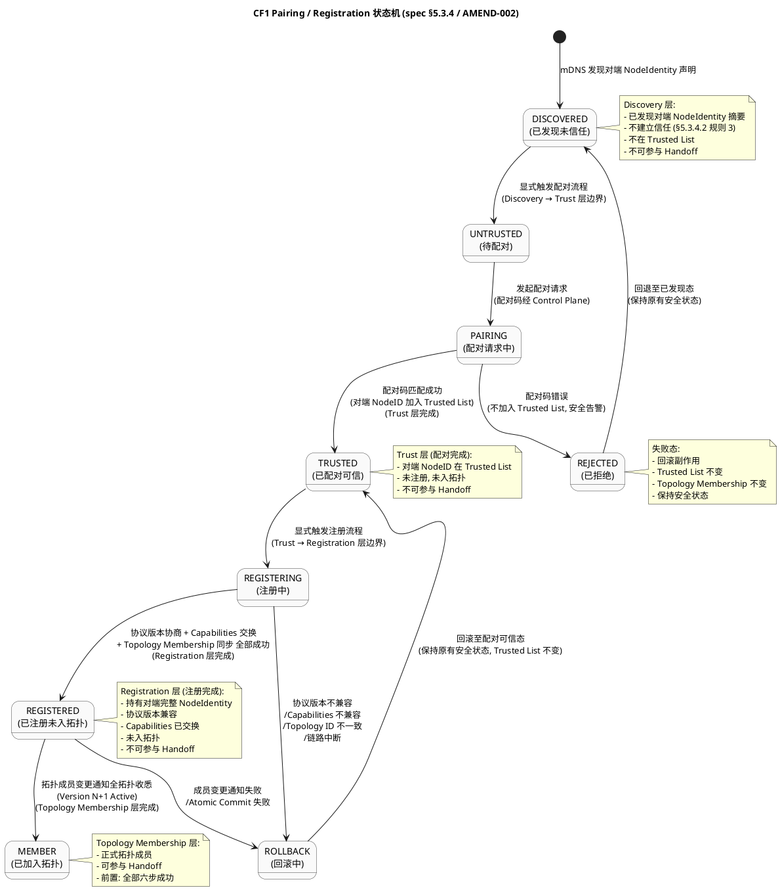
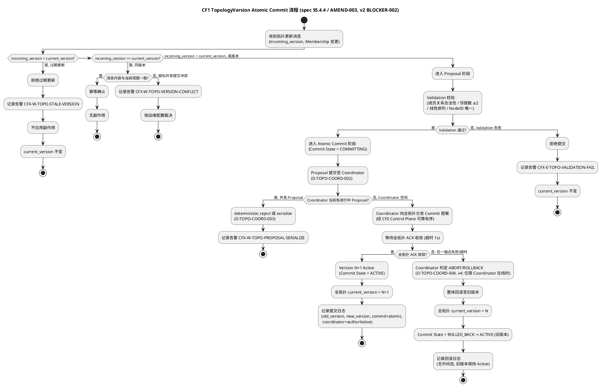
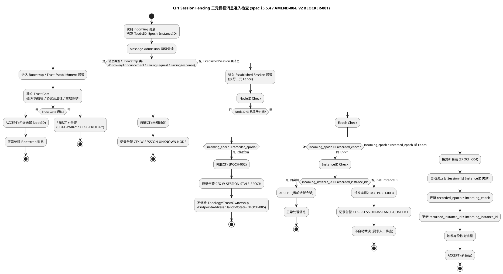
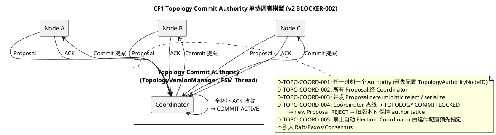

# CrossFlow-X · CF1 端点身份与发现实现方案设计文档

> **阶段标记**：CF1 — Endpoint Identity & Discovery
> **对应需求规格**：`.codeartsdoer/specs/cf1_endpoint_disc/spec.md`（v2，1432 行，五个身份与发现地基 CF1-S01～CF1-S05 + 4 个 Amendment + Verification Matrix，已 FROZEN）
> **CF0 冻结基线引用**：`.codeartsdoer/specs/cf0_arch_freeze/spec.md`（v2，892 行）+ `.codeartsdoer/specs/cf0_arch_freeze/design.md`（v3，3449 行），本设计严格遵循 CF0 冻结的全部架构基线（C++20 技术栈、Driverless User-Mode、Handoff 六态 FSM、7 核心契约、CF0 Architecture Safety Invariant P1/P2/P3、8 线程模型、双平面隔离）。
> **第一原则**：NodeID 是身份，IP 只是当前可达地址。
> **文档状态**：DRAFT v4 → 待 PM Gate Review（v1 经大G项目经理 Gate Review 裁决 **CONDITIONAL PASS / 暂不 FROZEN / 暂不授权 spec-task-agent**；v2 为轻量 Design Amendment，修复 BLOCKER-001 / BLOCKER-002 + 1 个非 Blocker 关系统一；v3 为轻量 Design Amendment，修复 BLOCKER-003（Topology Atomic Commit 严格语义）+ BLOCKER-004（Coordinator Identity Lifecycle），新增 D-TOPO-ATOMIC-005 / D-TOPO-COORD-005 两条 Design Contract；**v4 为轻量 Design Amendment，修复 BLOCKER-004 AMEND REQUIRED（v2 历史语义残留：NodeID 字典序最小者自动 Coordinator / Coordinator 故障后重新确定 Coordinator / implicit election / deterministic fallback election），D-TOPO-COORD-001～005 统一为"预先配置 Topology Authority NodeID"语义，保留 v3 主体结构不重写**）
> **设计范围**：仅覆盖 CF1-S01～CF1-S05 五个身份与发现地基的增量设计方案 + 4 个 Amendment 的 Design Contract + Verification Matrix 回映，不引入规格外能力，不修改 CF0 Frozen Architecture，不重新设计 Handoff FSM。
> **执行纪律遵循**：严格遵守大G项目经理 10 条执行纪律（不修改 CF0 Frozen / 不重新设计 Handoff FSM / 4 Amendment 转 Design Contract / 三元 Fence / TopologyVersion 原子提交 / Pairing 状态机实现边界 / Input/Control 双平面隔离 / Design Contract 回映 Verification Matrix / Gate Review 后再编码）。
> **Amendment Record（v2，轻量 Design Amendment，非架构返工）**：
> - **BLOCKER-001 修复**：Bootstrap / Session Fence 两级 Message Admission 边界——明确 Bootstrap 类消息（DiscoveryAnnouncement / PairingRequest / PairingResponse）允许未知 NodeID，走独立 Trust Gate；Established Session 类消息（Registration / MembershipChange / IdentityRecovery / Goodbye / Topology update）才执行 NodeID→Epoch→InstanceID 三元 Fence。禁止 SessionFence 将首次 Pairing 锁死。
> - **BLOCKER-002 修复**：Topology Atomic Commit Authority——补充轻量单协调者提交模型，定义 D-TOPO-COORD-001～004 四条契约（任一时刻单一 Authority / 所有 Proposal 经 Coordinator / 并发 Proposal deterministic reject 或 serialize / Coordinator 离线 → TOPOLOGY COMMIT LOCKED → 旧版本保持 authoritative baseline）。**不引入 Raft/Paxos/Consensus**。**v4 修订**：D-TOPO-COORD-001～004 统一为"预先配置 Topology Authority NodeID"语义，废止 v2 历史残留的"NodeID 字典序最小者自动 Coordinator / Coordinator 故障后重新确定 Coordinator / implicit election / deterministic fallback election"。
> - **非 Blocker 关系统一**：`TopologyView.version` 保持 u64（不污染 CF0 Frozen 的 `ITopologyManager.currentView()`）；`TopologyVersion`（含 value:u64 + topologyId + lastCommitAt + commitState）由 `ITopologyVersionManager` 单独管理。
> - **保持不变**：CF1 Design v1 主体结构（不重写 2360 行）、CF0 Frozen Architecture、Handoff 六态 FSM、现有 TopologyVersion API 总体方向。
> **Amendment Record（v3，轻量 Design Amendment，非架构返工）**：
> - **BLOCKER-003 修复**（§2.6.3 / §2.6.7 / §2.11.4 / §2.11.9）：**修正 Topology Atomic Commit 严格语义**——撤回 v2 §2.6.3 / §2.6.6 中"TCP 可靠有序 + 全拓扑 ACK + Rollback 即可证明分布式全局 Atomic Commit"的过强论断。TCP 仅保证单连接消息可靠有序，不保证所有节点同时完成状态切换，更不保证 Commit 后发生故障时所有节点一定能够 Rollback。新增 **D-TOPO-ATOMIC-005** 严格协议状态机：CURRENT N → PROPOSED N+1 → VALIDATED N+1 → PREPARED N+1 → ACTIVATION AUTHORIZED → LOCAL ATOMIC SNAPSHOT SWAP → ACTIVE N+1。明确 Proposal ≠ Active / Prepare ≠ Active / ACK ≠ Active / 仅唯一 Coordinator 发出 Activate/Commit Authorization 后节点才能将 N+1 设为 Active / Coordinator Failure 时其他节点禁止自主 Commit / Coordinator Failure 必须保持旧版本 N 为 authoritative baseline / 新会话或恢复后必须重新验证并重新提交 / stale version 必须被拒绝 / 不允许两个 Active TopologyVersion Authority / 与 CF0 Safety Invariant P1 No Split-Brain 一致。新增 DC-S04-008 + EV-BLOCKER-003-1～7 + AT-BLOCKER-003-1～7。
> - **BLOCKER-004 修复**（§2.6.6 / §2.6.8 / §2.11.4 / §2.11.9）：**补充 Topology Commit Coordinator Identity Lifecycle**——明确初始 Coordinator 由运维配置预先指定（Topology Authority NodeID），第一版**禁止自动 Coordinator Election**；Coordinator 身份经 NodeID 校验 + Topology Authority Membership 校验；Coordinator NodeID 必须属于 Topology Authority；Coordinator 离线期间 Topology Commit = LOCKED / NOT AUTHORIZED，禁止新的 Proposal；禁止多个节点同时声称 Coordinator；不引入 Raft/Paxos/Consensus；不修改 CF0 Frozen Architecture；不重新设计 Handoff FSM。新增 **D-TOPO-COORD-005** Coordinator Identity Lifecycle 状态机：NO COORDINATOR → TOPOLOGY COMMIT LOCKED → 禁止新的 Topology Commit → 旧 Active Version 保持 authoritative。新增 DC-S04-009 + EV-BLOCKER-004-1～6 + AT-BLOCKER-004-1～6。
> - **保持不变**：CF1 Design v2 主体结构（不重写 2567 行）、CF0 Frozen Architecture、Handoff 六态 FSM、Input Plane / Control Plane 隔离、CF0 Safety Invariant P1/P2/P3、现有 TopologyVersion API 总体方向、v2 BLOCKER-001 / BLOCKER-002 修复成果。
> **Amendment Record（v4，轻量 Design Amendment，非架构返工）**：
> - **BLOCKER-004 AMEND REQUIRED 修复**（§2.1.3.3 / §2.6.3 / §2.6.6 / §2.6.8 / §2.11.4 / §2.11.8.2 / §2.11.9.2）：**清除 v2 历史语义残留**——v3 Amendment Record / D-TOPO-COORD-005 已明确"第一版禁止自动 Coordinator Election"，但文档正文（原 D-TOPO-COORD-001～004）仍保留 v2 旧语义："配置缺失时按 NodeID 字典序最小者作为 Coordinator" / "Coordinator 故障后重新确定 Coordinator" / "implicit Coordinator" / "deterministic fallback election"。此与 D-TOPO-COORD-005 的 FORBIDDEN 约束直接矛盾，属于协议权威身份生命周期冲突。v4 彻底清除上述历史残留：
>   1. **废止**所有"NodeID 字典序最小者自动 Coordinator"语义；
>   2. **废止**所有"Coordinator 故障后自动重新确定 Coordinator"语义；
>   3. **D-TOPO-COORD-001～005 统一**为"预先配置 Topology Authority NodeID"——TopologyAuthorityNodeID 是拓扑治理配置参数，不是由运行时成员自动推导的角色；
>   4. **明确 Coordinator 身份验证**：NodeID Check + Topology Authority Membership Check + CF8 enabled 时 Signature Check；
>   5. **Coordinator Offline 状态机**：NO COORDINATOR → TOPOLOGY COMMIT LOCKED → new Proposal REJECT → no Commit Authorization → old Version N remains authoritative；
>   6. **Authority 恢复后**：不自动重新提交旧 N+1；必须重新进行合法 Proposal → Validation → Prepare → Activate；
>   7. **禁止多个节点同时声称 Coordinator**：检测到多节点同时声称 Coordinator 时，全部拒绝并告警 `CFX-E-TOPO-COORD-DUPLICATE-CLAIM`，要求运维显式修正配置（不按字典序自动保留一个）；
>   8. **保持 D-TOPO-ATOMIC-005 不变**；**保持 CF0 Frozen Architecture 不变**；**不修改 Handoff FSM**；**不引入 Raft/Paxos/Consensus**。
> - **保持不变**：CF1 Design v3 主体结构（不重写 2972 行）、D-TOPO-ATOMIC-005 严格协议状态机、D-TOPO-COORD-005 Coordinator Identity Lifecycle 状态机、CF0 Frozen Architecture、Handoff 六态 FSM、Input Plane / Control Plane 隔离、CF0 Safety Invariant P1/P2/P3、v2 BLOCKER-001 修复成果、v3 BLOCKER-003 修复成果。

---

# 一、需求与存量功能关系分析

## 1.1 需求功能与存量功能对比

### 1.1.1 已实现功能

CF0 冻结基线（spec.md v2 + design.md v3）已落地五个架构地基 CF0-S01～CF0-S05 + 7 核心契约 + Safety Invariant。下表对照 CF1 spec.md v2 需求与 CF0 冻结基线的匹配度。匹配度分四档：100%（完全匹配，直接复用）、75%（主体匹配，需小幅扩展）、50%（部分匹配，需改造）、25%（骨架存在，需大幅补全）、0%（完全未实现，需新增）。

| 需求功能（CF1 spec.md v2） | 存量功能（CF0 冻结基线） | 代码位置 | 匹配度 |
|---------|---------|---------|--------|
| Stable NodeID UUIDv4 生成与持久化（§5.1.1.1-2） | `NodeId`（u128 拆 high/low）+ `generate()` UUIDv4 + `EndpointIdentity.persist()` | `core/common/domain.hpp`、`core/s02_topology/i_topology_manager.hpp`（CF0 design §2.2.2.4 `loadIdentity()`） | 75% |
| NodeID 与 IP 解耦（§5.1.1.2/8） | CF0 §5.2.1.2 NodeID 与 IP 解耦规则 + `ITopologyManager` 接口 | `core/common/domain.hpp`、CF0 design §2.2.2.4 | 100% |
| Platform 声明（§5.1.1.6） | `enum class Platform` + `EndpointIdentity.platform` | `core/common/domain.hpp` | 100% |
| ScreenBoundary（§5.1.1.7 Capabilities.screen_boundary） | `ScreenBoundary`（width/height/originX/originY）+ `isValid()` | `core/common/domain.hpp` | 100% |
| TopologyView 线性排列 + 回环（§5.4.1.5） | `TopologyView`（isLinear/isCircular/segmentCount/neighborOf/hasDuplicateNodeIds）+ `NeighborRelation` | `core/common/domain.hpp`、CF0 design §2.2.2.4 | 75% |
| 邻居数量上限 ≤2（§5.4.1.6） | CF0 §5.2.1.5 + `NeighborRelation.neighborCount()` | `core/common/domain.hpp` | 100% |
| 拓扑版本号单调递增（§5.4.4.1） | `TopologyView.version`（u64 单调递增） | `core/common/domain.hpp` | 50% |
| Control Plane 可靠有序传输（§5.3.1.8） | `IControlPlaneChannel`（send/onMessage/onLinkState）+ TCP 可靠有序 + coroutine | `core/s05_transport/i_control_plane_channel.hpp`、CF0 design §2.2.2.8 | 100% |
| Input/Control 双平面隔离（§7.4 契约⑥） | CF0 契约⑥ Transport 双平面隔离 + `IInputPlaneChannel`/`IControlPlaneChannel` 独立线程 | CF0 design §2.9.6 | 100% |
| 配对确认机制基线（§5.3.1.2-3） | CF0 §4.3.1 配对确认 + `PairingGate` + `CFX-E-PAIR-UNPAIRED` | `core/s05_transport/`（CF0 design §2.1.2 PairingGate） | 50% |
| 协议版本协商（§5.3.1.5） | CF0 §5.5.1.7 协议版本协商 + `CFX-E-PROTO-VER` | `core/s05_transport/` | 75% |
| 自动重连指数退避（§5.5.1.10） | CF0 §4.2.4 自动重连 + `LinkSupervisor` | `core/s05_transport/`（CF0 design §2.1.2 LinkSupervisor） | 75% |
| 心跳超时断线判定（§5.4.1.3） | CF0 §5.5.1.6 断线判定 + `HeartbeatTimer`（≤50ms 周期，3 周期阈值） | `core/s05_transport/` | 100% |
| 结构化日志含 NodeID/Epoch（§4.4.1） | CF0 JSON Lines Logger + `LogEntry`（ts/level/nodeId/traceId/eventId/linkState/msg/code） | `core/common/logger.hpp` | 75% |
| 错误码体系 CFX-`<level>-<module>-<reason>`（§4.4） | CF0 18 个错误码 + `CfxError` + 解析函数 | `core/common/error_code.hpp` | 75% |
| 8 线程模型（§4.6 / 契约⑦） | CF0 §4.6 + `IThreadModel` + 8 线程（Main/Capture/Injection/InputPlane/ControlPlane/FSM/Logger/Scheduler） | CF0 design §2.7 | 100% |
| C++20 技术栈（§4.5.1） | CF0 §8 + std::expected/std::span/std::jthread/coroutine/concepts/chrono/variant/atomic/enum class | CF0 design §2.8 | 100% |
| CF0 Safety Invariant 延续（§7.5） | CF0 §2.17 P1 No Split-Brain / P2 No Void-Owner / P3 Recoverable | CF0 design §2.17 | 100% |
| Node Identity 七要素（§5.1.1.4） | `EndpointIdentity`（nodeId/platform/screenBoundary）仅三要素 | `core/common/domain.hpp` | 25% |
| PublicKey / Trust Identity 字段（§5.1.4） | **未实现**（CF0 仅冻结配对码基线，未预留 PublicKey 字段） | 无 | 0% |
| Capabilities 完整声明（§5.1.1.7） | **未实现**（CF0 仅有 ScreenBoundary，无 supported_input_types/supports_circular/protocol_version 聚合） | 无 | 0% |
| Endpoint Addresses 动态列表（§5.1.1.8） | **未实现**（CF0 NodeID 与 IP 解耦但未建模多地址列表） | 无 | 0% |
| Topology Membership 完整声明（§5.1.1.9） | `NeighborRelation`（leftNeighbor/rightNeighbor）但无 topology_id/segment_index | `core/common/domain.hpp` | 25% |
| Session Epoch（§5.5.1） | **未实现**（CF0 无会话纪元概念） | 无 | 0% |
| Session Instance ID（§5.5.4 / AMEND-004） | **未实现** | 无 | 0% |
| mDNS 发现机制（§5.2） | **未实现**（CF0 仅声明"不依赖固定 IP"，未实现发现协议） | 无 | 0% |
| 配对/注册完整状态机（§5.3.4 / AMEND-002） | **未实现**（CF0 仅有 PairingGate 二态门控，无 7 状态 FSM） | 无 | 0% |
| TopologyVersion Atomic Commit（§5.4.4 / AMEND-003） | **未实现**（CF0 仅有 version u64 单调，无 Proposal→Validation→Atomic Commit 流程） | 无 | 0% |
| Session Fencing 三元栅栏（§5.5.4 / AMEND-004） | **未实现** | 无 | 0% |
| Discovery Digest mDNS TXT 记录（§6.7） | **未实现** | 无 | 0% |
| Trusted Node List 持久化（§6.6） | **未实现**（CF0 仅配对码基线，无可信列表持久化） | 无 | 0% |
| CF1 新增 6 类 Control Message 子类型（§7.3） | `ControlMessage` variant（CF0 已有骨架，CF1 扩展子类型） | `core/common/messages.hpp` | 25% |

**结论**：CF0 冻结基线已为 CF1 提供了"NodeID 骨架 + 拓扑视图骨架 + Control Plane 通道 + 配对码门控 + 8 线程模型 + C++20 设施 + Safety Invariant"等基础设施。CF1 的增量集中在五个身份与发现地基的新建与四个 Amendment 的 Design Contract 落地：

1. **Node Identity 七要素扩展**（`EndpointIdentity` 三要素 → 七要素，新增 PublicKey/Capabilities/Endpoint Addresses/Topology Membership/Session Epoch）；
2. **Discovery Protocol 新建**（mDNS 发现 + LAN Broadcast fallback + Manual Config fallback + NodeID 索引发现表）；
3. **Pairing/Registration 状态机新建**（7 状态 + 失败路径 + 五层分层不可跃迁，AMEND-002）；
4. **TopologyVersion Atomic Commit 新建**（Proposal→Validation→Atomic Commit + 版本覆盖规则，AMEND-003）；
5. **Session Fencing 新建**（(NodeID, SessionEpoch, SessionInstanceID) 三元 Fence + EPOCH-001～006，AMEND-004）；
6. **PublicKey 生命周期解耦**（AMEND-001，字段位预留 + 生命周期独立契约）。

### 1.1.2 需要扩展的功能

下表列出 CF0 已部分实现、需在现有基础上改造对齐 CF1 的功能项。

| 需求功能 | 存量功能 | 差异说明 | 扩展方向 |
|---------|---------|---------|---------|
| Node Identity 七要素 | `EndpointIdentity`（nodeId/platform/screenBoundary）三要素 | 缺 PublicKey/Capabilities/Endpoint Addresses/Topology Membership/Session Epoch 四要素 | 扩展 `EndpointIdentity` 为 `NodeIdentity` 七要素结构；PublicKey 字段位预留（CF1 允许空，CF8 冻结算法）；Capabilities 聚合 supported_input_types/screen_boundary/supports_circular/protocol_version |
| TopologyView 含 topology_id/segment_index | `TopologyView`（endpoints/neighborRelations/version） | 缺 topology_id 字段；NeighborRelation 缺 segment_index | `TopologyView` 增 `topologyId` 字段；`NeighborRelation` 增 `segmentIndex` 字段；跨拓扑隔离校验入口 |
| 拓扑版本号 Atomic Commit | `TopologyView.version`（u64 单调递增） | 仅有版本号字段，无 Proposal→Validation→Atomic Commit 流程、无版本覆盖规则（incoming < current → reject / == → idempotent / > → validate → commit）、无全或无语义 | 新增 `TopologyVersionManager` 类承载 Atomic Commit 流程；版本覆盖规则实现；全或无语义经 CF0 Control Plane 可靠有序传输 + 全拓扑 ACK 收敛 |
| 配对确认机制 | `PairingGate`（CF0 二态门控：未配对/已配对） | 无 Trusted Node List 持久化、无配对码经 Control Plane 点对点传输显式契约、无配对状态机 | 扩展 `PairingGate` 为 `PairingManager`；新增 `TrustedNodeList` 持久化；配对码经 `IControlPlaneChannel.send()` 点对点传输，禁 mDNS 广播 |
| 协议版本协商 | CF0 §5.5.1.7 协议版本协商 | CF0 在链路建立时协商；CF1 在注册握手首步协商，需与 Capabilities 交换/Topology Membership 同步串联 | 注册握手流程复用 CF0 协议版本协商逻辑，置于 `RegistrationManager` 内 |
| 自动重连 | CF0 §4.2.4 + `LinkSupervisor` 指数退避 | CF0 重连后重新协商版本+恢复拓扑；CF1 重连后需身份恢复（NodeID + 新 Epoch + 新 InstanceID），不重新配对 | `LinkSupervisor` 重连成功后触发 `SessionFence.newSession()` + `IdentityRecoveryManager.recover()` |
| 结构化日志含 Session Epoch | CF0 `LogEntry`（含 nodeId/traceId/eventId/linkState） | 缺 sessionEpoch/sessionInstanceId 字段 | `LogEntry` 增 `sessionEpoch`/`sessionInstanceId` 字段；Logger 链式构建增对应入口 |
| 错误码体系扩展 | CF0 18 个错误码 | 缺 CF1 新增模块错误码（DISC/PAIR/REG/SESS/TOPO-STALE/SESSION-STALE 等） | `ErrorCode` 枚举追加 CF1 新增码；解析表登记；遵循 `CFX-<level>-<module>-<reason>` 格式 |
| ControlMessage variant 扩展 | CF0 `ControlMessage` variant（HandoffRequest/Response/Heartbeat/TopologyDeclaration 等） | 缺 CF1 新增 6 类子类型（DiscoveryAnnouncement/PairingRequest/Response/RegistrationRequest/Response/MembershipChangeNotification/IdentityRecoveryRequest/Response/GoodbyeAnnouncement） | `ControlMessage` variant 追加 6 类子类型；遵循 CF0 §5.5.1.8 协议向前兼容（旧版本安全忽略未知报文） |

### 1.1.3 需要新增的功能或接口

以下按业务模块分组，列出 CF1 需从零新增的全部功能点。每个功能点标注输入、输出、核心逻辑及依赖。

#### 模块 K：Node Identity Model（CF1-S01）—— 新建

| 编号 | 功能点 | 输入 | 输出 | 核心逻辑 | 依赖 |
|-----|--------|-----|-----|---------|------|
| K-01 | NodeIdentity 七要素聚合 | 首次启动/后续启动信号 | `NodeIdentity`（七要素） | 聚合 Stable NodeID + PublicKey + Platform + Capabilities + Endpoint Addresses + Topology Membership + Session Epoch；七要素缺一不可（§5.1.1.4） | CF0 NodeId/Platform/ScreenBoundary |
| K-02 | Stable NodeID 生成与持久化 | 首次启动 + 本地无 NodeID | `NodeId`（UUIDv4） | UUIDv4 生成（仅本地随机源，不依赖 PublicKey，AMEND-001 规则 3）；本地 JSON 持久化；后续启动加载已有 NodeID，禁止重复生成 | CF0 NodeId.generate() |
| K-03 | NodeID 不变性保障 | IP 变更/网卡切换/重启/断线重连事件 | NodeID 不变 | NodeID 写入路径仅含 {本地生成, 本地持久化加载}；网络报文不得覆盖本端 NodeID（§5.1.1.13） | K-02 |
| K-04 | PublicKey 字段位预留 | 无 | `PublicKey`（变长字节串，CF1 允许空） | 字段存在性冻结；生命周期与 NodeID 解耦（AMEND-001）；具体算法延迟至 CF8 | 无 |
| K-05 | Capabilities 声明 | 本机能力探测 | `Capabilities`（supported_input_types/screen_boundary/supports_circular/protocol_version） | 探测本机支持的输入事件类型子集、屏幕边界、循环切换支持、协议版本号 | CF0 ScreenBoundary |
| K-06 | Endpoint Addresses 动态管理 | 本机网卡/IP 变更事件 | `std::vector<EndpointAddress>` | 订阅本机网络子系统地址变更；地址列表可变，NodeID 不变；每条含 address_type/value/port/priority | 无 |
| K-07 | Topology Membership 声明 | 拓扑配置/成员变更 | `TopologyMembership`（topology_id/left_neighbor/right_neighbor/segment_index） | 含所属 Topology ID + 左/右邻居 NodeID + 段索引；CF1 动态维护 | CF0 NeighborRelation |
| K-08 | Session Epoch 生成与持久化 | 端点启动/重连事件 | `SessionEpoch`（u64 单调递增） | 每次启动/重连递增；从 1 开始；持久化；不得回跳（EPOCH-001） | 无 |
| K-09 | NodeID 持久化完整性恢复 | 持久化文件损坏 | 恢复策略执行 | NodeID 损坏→重新生成+告警；Trusted List 损坏→清空+告警；Topology Membership 损坏→置空等待重新发现；不崩溃 | K-02, 模块 N |
| K-10 | PublicKey 生命周期解耦契约保障（AMEND-001） | PublicKey 更换事件 | NodeID 不变 | PublicKey 更换不得改变 NodeID；NodeID 生成不消费 PublicKey；网络报文不得以 PublicKey 变更为由覆盖本端 NodeID | K-02, K-04 |

#### 模块 L：Discovery Protocol（CF1-S02）—— 新建

| 编号 | 功能点 | 输入 | 输出 | 核心逻辑 | 依赖 |
|-----|--------|-----|-----|---------|------|
| L-01 | mDNS 声明发布 | 本端 NodeIdentity | mDNS service 声明（TXT 记录含 Discovery Digest） | service name 固定 CrossFlow-X 标识；TXT 携带 NodeID/Platform/Capabilities 指纹/Session Epoch/协议版本/Topology ID；发布延迟 ≤500ms | K-01 |
| L-02 | mDNS 声明监听 | mDNS service 声明 | `DiscoveryRecord`（以 NodeID 为键） | 周期性监听局域网 mDNS；解析 TXT 记录；以 NodeID 为索引记录对端（不以 IP 为键，§5.2.1.4） | L-01 |
| L-03 | LAN Broadcast fallback | mDNS 不可用事件 | 广播发现报文 | mDNS 服务不可用时降级为局域网广播；记录告警 `CFX-W-DISC-MDNS-UNAVAILABLE` | L-01 |
| L-04 | Manual Config fallback | mDNS+广播均不可用 | 配置端点清单直接连接 | 依赖运维配置的端点清单直接连接；记录告警 | L-03 |
| L-05 | Discovery Digest 构建 | 本端 NodeIdentity | `DiscoveryDigest`（NodeID/Platform/Capabilities 指纹/Epoch/协议版本/Topology ID） | mDNS TXT 记录携带摘要；完整 NodeIdentity 在注册握手时交换 | K-01 |
| L-06 | 动态加入处理 | 新端点 mDNS 声明 | 纳入已发现端点列表 | 新启动端点发布声明后，已在线端点发现并记录（DISCOVERED 态）；Topology ID 一致才纳入候选 | L-02, 模块 M |
| L-07 | 动态离开处理 | goodbye 声明/心跳超时 | 移除发现记录与拓扑成员关系 | 正常离开发布 goodbye；异常离开由 CF0 心跳超时判定（复用 CF0 §5.5.1.6） | L-02, CF0 HeartbeatTimer |
| L-08 | 发现声明周期刷新 | 定时器（≥1 次/60s） | mDNS 声明刷新 | 周期性刷新防止声明过期；IP 变更/拓扑变更时立即触发额外声明；频率 ≤1 次/5s 避免风暴 | L-01 |
| L-09 | 重复发现幂等 | 同 NodeID 重复声明 | 幂等更新 | 同 NodeID 同 Epoch 仅更新 Endpoint Addresses；同 NodeID 更高 Epoch 标记新会话触发身份恢复 | L-02, 模块 P |
| L-10 | 跨拓扑隔离 | 对端声明 Topology ID | 忽略/纳入候选 | Topology ID 不一致的端点发现后忽略，不加入同一拓扑（§5.2.1.9） | L-02 |
| L-11 | NodeID 冲突检测 | 两个端点声明相同 NodeID | 冲突告警 + 拒绝注册 | 记录告警 `CFX-E-TOPO-NODEID-DUP`；拒绝二者注册；向运维告警 | L-02 |

#### 模块 M：Pairing / Registration State Machine（CF1-S03 / AMEND-002）—— 新建

| 编号 | 功能点 | 输入 | 输出 | 核心逻辑 | 依赖 |
|-----|--------|-----|-----|---------|------|
| M-01 | 配对/注册 7 状态 FSM 维护 | 状态转移事件 | 当前 `PairingState`（7 状态之一） | 状态集 {DISCOVERED, UNTRUSTED, PAIRING, TRUSTED, REGISTERING, REGISTERED, MEMBER} + 失败态 {REJECTED, ROLLBACK}；任意时刻唯一（§5.3.4.1） | 无 |
| M-02 | 7 状态合法转移路径执行 | (当前态, 事件) | 下一态 + 动作 | 成功路径：DISCOVERED→UNTRUSTED→PAIRING→TRUSTED→REGISTERING→REGISTERED→MEMBER；失败路径：任一阶段→REJECTED/ROLLBACK→保持原有安全状态 | M-01 |
| M-03 | 五层分层不可跃迁守卫 | 状态转移请求 | 允许/拒绝 | Discovery ≠ Trust ≠ Pairing ≠ Registration ≠ Topology Membership；禁止跃迁（如 DISCOVERED→MEMBER）；发现不建立信任（§5.3.4.2 规则 2-3） | M-01 |
| M-04 | 配对码确认 | 配对请求（NodeID + 配对码） | 配对成功/失败 | 配对码经 `IControlPlaneChannel.send()` 点对点传输（禁 mDNS 广播，§5.3.1.12）；匹配则对端 NodeID 加入 Trusted Node List 并持久化；不匹配则拒绝 + 安全告警 | CF0 IControlPlaneChannel, 模块 N |
| M-05 | Trusted Node List 管理 | 配对成功/重连事件 | Trusted List 增删/查询 | 持久化 Trusted NodeID 列表；仅可信端点可完成注册；未配对端点注册被拒绝（§5.3.1.2） | M-04 |
| M-06 | 注册前置发现校验 | 注册请求 | 允许/拒绝 | 端点必须先经发现记录对端 NodeIdentity 摘要后方可发起注册；禁止对未发现端点发起注册（§5.3.1.1） | L-02 |
| M-07 | 注册握手编排 | 注册请求 | 注册成功/失败 | 原子完成：配对校验→协议版本协商→Capabilities 交换→Topology Membership 同步；任一步失败整体回滚，不产生半注册状态（§5.3.1.9） | M-04, M-08, M-09, M-10 |
| M-08 | 协议版本协商（复用 CF0） | 双方协议版本号 | 兼容/拒绝 | 复用 CF0 §5.5.1.7 协议版本协商；版本不兼容拒绝注册并记录双方版本 | CF0 协议版本协商 |
| M-09 | Capabilities 交换与兼容性判定 | 双方 Capabilities | 兼容/拒绝/降级 | 关键能力（输入类型/屏幕边界）不兼容拒绝注册；非关键能力缺失安全忽略（§5.3.1.6） | K-05 |
| M-10 | Topology Membership 同步 | 双方 Topology Membership | 同步成功/拒绝 | Topology ID 不一致拒绝加入同一拓扑；邻居关系冲突由运维裁决或拒绝（§5.3.1.7） | K-07 |
| M-11 | 注册幂等 | 同 NodeID 重复注册请求 | 已注册应答/更新会话 | 同 NodeID 同 Epoch 返回已注册应答；同 NodeID 更高 Epoch 更新会话信息触发身份恢复（§5.3.1.10） | M-07, 模块 P |
| M-12 | 失败回滚保持安全状态 | 任一阶段失败事件 | REJECTED/ROLLBACK + 安全状态保持 | 回滚该次流程全部副作用；Trusted List 与 Topology Membership 集合不变（§5.3.4.2 规则 4） | M-01, M-05 |
| M-13 | MEMBER 态前置校验 | 进入 MEMBER 转移请求 | 允许/拒绝 | 进入 MEMBER 前必须完成 DISCOVERED→PAIRING→REGISTERING→REGISTERED 全部成功；禁止跳步（§5.3.4.2 规则 5） | M-01 |
| M-14 | 禁止未注册端点参与 Handoff | Handoff 触发 + 对端注册状态 | 允许/拒绝 | 未完成注册的端点禁止参与 CF0 Handoff；CF0 HandoffOrchestrator 校验对端注册状态（§5.3.1.11） | CF0 IHandoffOrchestrator |

#### 模块 N：Topology Membership Management（CF1-S04 / AMEND-003）—— 新建

| 编号 | 功能点 | 输入 | 输出 | 核心逻辑 | 依赖 |
|-----|--------|-----|-----|---------|------|
| N-01 | 拓扑成员加入 | 注册成功事件 | 成员变更通知 + TopologyView 更新 | 端点注册成功后正式加入拓扑；Topology Membership 同步至全拓扑；全拓扑 ≤1s 内一致（§5.4.1.1） | M-07 |
| N-02 | 拓扑成员正常离开 | goodbye 声明 | 成员变更通知 + TopologyView 更新 | 发布 goodbye + 通知全拓扑；其他端点移除该端点成员关系与发现记录（§5.4.1.2） | L-07 |
| N-03 | 拓扑成员异常断线离开 | 心跳超时事件 | 成员变更通知 + TopologyView 更新 | 判定离开 + 移除拓扑成员关系；该方向 Handoff 暂停（复用 CF0 §5.2.3.3）（§5.4.1.3） | CF0 HeartbeatTimer |
| N-04 | 成员变更通知广播 | 成员加入/离开事件 | MembershipChangeNotification 报文 | 经 CF0 Control Plane 可靠有序传输；全拓扑 ≤1s 内收悉（§5.4.1.4） | CF0 IControlPlaneChannel |
| N-05 | 循环拓扑回环维护 | 拓扑配置 | 回环邻居关系 | 支持 ≥2 段线性循环；最左端左邻居=最右端，最右端右邻居=最左端（复用 CF0 契约③）（§5.4.1.5） | CF0 ITopologyManager |
| N-06 | 邻居关系维护与校验 | 成员变更事件 | 邻居关系校验结果 | 每端点最多两个邻居（左/右）；成员变更时重新校验邻居数量上限与线性排列（§5.4.1.6） | CF0 NeighborRelation |
| N-07 | Node Count vs Segment Count 区分 | 运行态成员数/配置态段数 | DEGRADED 判定 + 告警 | Circular 有效运行态要求 Node Count ≥3；Node Count ∈ {1,2} 属 DEGRADED，循环 Handoff 禁用 + 告警；Segment Count ≥2 为配置态约束，成员离开 Node Count 下降但 Segment Count 不变（§5.4.1.8/§5.4.5） | CF0 契约③ |
| N-08 | TopologyVersion 原子提交流程（AMEND-003） | 拓扑变更提案 | Atomic Commit 成功/回滚 | Proposal→Validation→Atomic Commit→Version N+1 Active；全或无语义（§5.4.4.3 规则 4-5） | N-09, N-10 |
| N-09 | TopologyVersion 版本覆盖规则 | incoming_version vs current_version | reject/idempotent/validate→commit | incoming < current → reject + 告警 `CFX-W-TOPO-STALE-VERSION`；incoming == current → idempotent；incoming > current → validate → atomic commit（§5.4.4.2/3） | 无 |
| N-10 | Atomic Commit 全或无语义 | 提交至全拓扑 | 全拓扑应用新版本/整体回滚 | 要么全拓扑端点成功应用新版本并激活，要么任一端点失败则整体回滚至旧版本，无中间态（§5.4.4.3 规则 5） | CF0 IControlPlaneChannel |
| N-11 | 与 CF0 ITopologyManager 一致性 | CF1 维护的成员关系 | TopologyView 一致 | CF1 维护的拓扑成员关系必须与 CF0 `ITopologyManager.currentView()` 保持一致（§5.4.1.9） | CF0 ITopologyManager |
| N-12 | 禁止多路径拓扑 | 拓扑配置 | 接受/拒绝 | 第一版禁止树状/网状/多路径；成员关系必须保持线性序列（含回环）（§5.4.1.10） | CF0 契约③ |
| N-13 | 禁止未通知的成员变更 | 成员变更事件 | 全拓扑通知 | 任何成员加入/离开必须通知全拓扑；禁止静默变更（§5.4.1.11） | N-04 |

#### 模块 O：Session Epoch & Reconnection（CF1-S05）—— 新建

| 编号 | 功能点 | 输入 | 输出 | 核心逻辑 | 依赖 |
|-----|--------|-----|-----|---------|------|
| O-01 | Session Epoch 生成与持久化 | 端点启动/重连事件 | `SessionEpoch`（u64 单调递增） | 每次启动/重连递增；从 1 开始；持久化；不得回跳（EPOCH-001） | K-08 |
| O-02 | Session Instance ID 生成 | 进程启动事件 | `SessionInstanceId`（UUIDv4） | 进程启动时生成；进程生命周期内不变；在同一 Epoch 内区分多个并发进程实例（§5.5.4.1） | 无 |
| O-03 | 三元会话栅栏构建 | NodeID + SessionEpoch + SessionInstanceId | `SessionFence`（三元组） | (NodeID, SessionEpoch, SessionInstanceID) 三元 Fence；NodeID 永久稳定身份；SessionEpoch 单调会话纪元；SessionInstanceId 当前进程栅栏（§5.5.4.1） | K-02, O-01, O-02 |
| O-04 | 消息准入检查流程 | incoming (NodeID, Epoch, InstanceID) | ACCEPT/REJECT | NodeID Check → Epoch Check → InstanceID Check；old Epoch → REJECT（EPOCH-002）；same Epoch + old InstanceID → REJECT（EPOCH-003 并发实例冲突告警）；new Epoch → 接受新会话淘汰旧 Session（EPOCH-004） | O-03 |
| O-05 | 低 Epoch 消息拒绝（EPOCH-002） | incoming_epoch < recorded_epoch | REJECT + 告警 | 拒绝过期会话消息，不应用副作用；记录告警 `CFX-W-SESSION-STALE-EPOCH`；recorded_epoch 不因过期消息降低 | O-04 |
| O-06 | 同 Epoch 不同 InstanceID 冲突检测（EPOCH-003） | epoch == recorded_epoch ∧ instance_id ≠ recorded_instance_id | 冲突告警 + 不自动裁决 | 检测为并发实例冲突；记录告警 `CFX-E-SESSION-INSTANCE-CONFLICT`；要求人工排查，不自动裁决 | O-04 |
| O-07 | 新 Epoch 自动淘汰旧 Session（EPOCH-004） | incoming_epoch > recorded_epoch | 接受新会话 + 旧 Session 淘汰 | 更新 recorded_epoch 与 recorded_instance_id 为新值；旧 InstanceID 失效；触发身份恢复流程 | O-04, O-09 |
| O-08 | 旧 Session 不修改关键状态（EPOCH-005） | 旧 Session 消息 | 仅诊断日志 | 旧 Session 消息不得修改 Topology/Trust/Ownership/Endpoint Address/Handoff State；仅日志记录 | O-04 |
| O-09 | 断线重连身份恢复 | 链路重连成功事件 | 身份恢复通知 + 拓扑成员关系恢复 | 通过持久化 NodeID + 新 SessionEpoch + 新 SessionInstanceId 向对端发送身份恢复通知；对端校验 NodeID 在 Trusted List 后恢复拓扑成员关系，不要求重新配对（§5.5.1.3 / EPOCH-006） | K-02, O-03, M-05 |
| O-10 | IP 变更重新发现 | 本机 IP 变更事件 | mDNS 重新发布声明 | 通过 mDNS/广播重新发布声明（携带新 Endpoint Addresses + 不变 NodeID）；对端更新可达地址，信任关系与拓扑成员关系不变（§5.5.1.4） | L-01, K-06 |
| O-11 | NodeID 持久化恢复 | 端点重启 + 本地存储 | 加载身份 + Epoch 递增 + 重新加入拓扑 | 从本地存储加载 Stable NodeID/Trusted List/Topology Membership/Session Epoch；以同一 NodeID + 递增 Epoch 重新加入拓扑（§5.5.1.5） | K-09 |
| O-12 | 重连不破坏 Safety Invariant | 断线重连恢复期间 | P1 ∧ P2 ∧ P3 全程成立 | 恢复期间涉及端点的 Handoff 暂停；不产生虚假控制权；不丢失本地控制权；恢复 ≤3s（§5.5.1.6） | CF0 §2.17 Safety Invariant |
| O-13 | 重连期间 Handoff 暂停 | 断线至恢复完成期间 | 涉及该端点的 Handoff 暂停 | 复用 CF0 §5.2.3.3 邻居失联；恢复完成后自动恢复 Handoff（§5.5.1.7） | CF0 IHandoffOrchestrator |
| O-14 | 身份恢复幂等 | 同 NodeID 同 Epoch 多次身份恢复 | 幂等处理 | 不产生重复的拓扑成员关系（§5.5.1.8） | O-09 |
| O-15 | 对端 Session Epoch 追踪 | 对端声明/恢复通知 | recorded_epoch 更新/忽略 | 收到对端 Epoch > 已记录→更新+标记新会话；收到 Epoch < 已记录→忽略（过期会话）（§5.5.1.9） | O-04 |
| O-16 | 自动重连指数退避（复用 CF0） | 链路断开事件 | 自动重连尝试 | 复用 CF0 §4.2.4 指数退避；重连成功后执行身份恢复流程（§5.5.1.10） | CF0 LinkSupervisor |
| O-17 | 重连不恢复按下状态 | 重连恢复完成事件 | 不恢复断线前按下键/按钮状态 | 复用 CF0 §5.5.3.6；需用户重新操作（§5.5.1.12） | CF0 §5.5.3.6 |

#### 模块 P：CF1 新增 Control Message 子类型（§7.3）—— 新建

| 编号 | 功能点 | 输入 | 输出 | 核心逻辑 | 依赖 |
|-----|--------|-----|-----|---------|------|
| P-01 | DiscoveryAnnouncement 报文 | 本端 NodeIdentity | DiscoveryAnnouncement Control Message | 点对点补充交换完整 Node Identity（mDNS 仅传摘要）；经 Control Plane 传输 | CF0 ControlMessage variant |
| P-02 | PairingRequest/PairingResponse 报文 | 配对请求/应答 | PairingRequest/PairingResponse Control Message | 配对码经 Control Plane 点对点传输；禁 mDNS 广播 | CF0 IControlPlaneChannel |
| P-03 | RegistrationRequest/RegistrationResponse 报文 | 注册请求/应答 | RegistrationRequest/RegistrationResponse Control Message | 含完整 NodeIdentity/Capabilities/Topology Membership；经 Control Plane 可靠有序传输 | CF0 IControlPlaneChannel |
| P-04 | MembershipChangeNotification 报文 | 成员加入/离开事件 | MembershipChangeNotification Control Message | 拓扑成员变更通知（加入/离开）；经 Control Plane 广播至全拓扑 | CF0 IControlPlaneChannel |
| P-05 | IdentityRecoveryRequest/IdentityRecoveryResponse 报文 | 身份恢复请求/应答 | IdentityRecoveryRequest/Response Control Message | 断线重连后身份恢复；携带 NodeID + 新 SessionEpoch + 新 SessionInstanceId | CF0 IControlPlaneChannel |
| P-06 | GoodbyeAnnouncement 报文 | 正常离开事件 | GoodbyeAnnouncement Control Message | 正常离开声明；经 Control Plane 传输 | CF0 IControlPlaneChannel |

## 1.2 存量功能详细分析

本节对 1.1.1 中匹配度≥50% 的 CF0 冻结基线进行接口契约、业务规则、扩展点、约束四维度深入解读，并分析 CF1 增量设计的落地边界。

### 1.2.1 NodeId / EndpointIdentity（CF0 `core/common/domain.hpp`）存量分析

- **接口契约**：`NodeId`（u128 拆 high/low，`<`/`==`/`isNull`/`generate` UUIDv4）+ `EndpointIdentity`（nodeId/platform/screenBoundary + `persist()`）。
- **业务规则**：`NodeId.generate()` UUIDv4；`EndpointIdentity.persist()` 本地 JSON 持久化。
- **扩展点**：`EndpointIdentity` 可扩展新字段；`NodeId` 类型固定不动。
- **约束**：
  - **CF1 扩展边界**：`EndpointIdentity` 三要素 → `NodeIdentity` 七要素（新增 PublicKey/Capabilities/Endpoint Addresses/Topology Membership/Session Epoch）；`NodeId` 类型直接复用，不重新定义。
  - **AMEND-001 约束**：`NodeId.generate()` 生成路径不得消费 PublicKey；`NodeId` 持久化/加载/恢复不得依赖 PublicKey 校验。
  - **线程安全**：领域对象本身无共享状态，线程安全。
  - **测试覆盖**：`tests/common/test_domain.cpp` 已覆盖 NodeId/EndpointIdentity。

### 1.2.2 TopologyView / NeighborRelation（CF0 `core/common/domain.hpp`）存量分析

- **接口契约**：`TopologyView`（endpoints/neighborRelations/version + isLinear/isCircular/segmentCount/neighborOf/hasDuplicateNodeIds）+ `NeighborRelation`（nodeId/leftNeighbor/rightNeighbor/leftState/rightState + neighborCount）。
- **业务规则**：线性排列校验；回环闭合；邻居数量上限 ≤2；版本号单调递增。
- **扩展点**：`TopologyView` 可扩展 topology_id 字段；`NeighborRelation` 可扩展 segment_index 字段。
- **约束**：
  - **CF1 扩展边界**：`TopologyView` 增 `topologyId` 字段（跨拓扑隔离）；`NeighborRelation` 增 `segmentIndex` 字段；`version` **保持 u64**（v2 非 Blocker 修复，不污染 CF0 `ITopologyManager.currentView()`）；`TopologyVersion`（含 Atomic Commit 状态机，AMEND-003）由 `ITopologyVersionManager` 单独管理，不嵌入 `TopologyView`。
  - **契约③约束**：`segmentCount() >= 2` 必须保持；CF1 的 Node Count ≥3 循环有效运行态与 CF0 契约③"禁两点退化"绝对一致（§5.4.5）。
  - **线程安全**：领域对象本身无共享状态，线程安全；动态维护由 FSM Thread 串行执行（复用 CF0 契约⑦）。

### 1.2.3 ITopologyManager（CF0 `core/s02_topology/i_topology_manager.hpp`）存量分析

- **接口契约**：`loadIdentity()`/`loadTopology()`/`currentView()`/`mergeRemoteDeclaration()`/`neighbor()`/`setNeighborState()`/`updateScreenBoundary()`/`isCircular()`/`segmentCount()`。
- **业务规则**：NodeID 唯一性、IP 解耦、线性排列、邻居数量上限、一致视图、循环回环支持、禁两点退化。
- **扩展点**：接口为抽象基类，可多实现。
- **约束**：
  - **CF1 复用方式**：CF1 通过 `ITopologyManager` 提供动态维护的 TopologyView 供 CF0 Handoff FSM 查询邻居；CF1 维护的成员关系必须与 `currentView()` 保持一致（§5.4.1.9）。
  - **CF1 不修改接口**：CF1 不修改 CF0 `ITopologyManager` 接口签名（执行纪律 1：不得修改 CF0 Frozen Architecture）；CF1 通过新增 `IMembershipManager` 接口承载动态成员管理。
  - **线程归属**：`ITopologyManager` 归 FSM Thread（CF0 design §2.7）。

### 1.2.4 IControlPlaneChannel（CF0 `core/s05_transport/i_control_plane_channel.hpp`）存量分析

- **接口契约**：`send(ControlMessage)`/`onMessage(handler)`/`onLinkState(handler)`；可靠有序传输；coroutine 异步 I/O；独立线程、独立队列、无共享可变状态。
- **业务规则**：TCP + 序号/ACK/重传；丢失重传直至成功或判定断线。
- **扩展点**：`ControlMessage` variant 可扩展新子类型。
- **约束**：
  - **CF1 复用方式**：CF1 新增 6 类 Control Message 子类型（DiscoveryAnnouncement/PairingRequest/Response/RegistrationRequest/Response/MembershipChangeNotification/IdentityRecoveryRequest/Response/GoodbyeAnnouncement）经 `IControlPlaneChannel.send()` 传输；CF1 报文处理在 Control Plane Thread 内（不引入新线程，执行纪律 7）。
  - **双平面隔离约束**：CF1 报文全部归属 Control Plane，不侵入 Input Plane（执行纪律 7：保持 Input Plane / Control Plane 隔离）。
  - **协议向前兼容**：新增子类型必须遵循 CF0 §5.5.1.8——旧版本端点可安全忽略未知报文类型。
  - **线程归属**：`IControlPlaneChannel` 归 Control Plane Thread（CF0 design §2.7）。

### 1.2.5 ControlMessage variant（CF0 `core/common/messages.hpp`）存量分析

- **接口契约**：`ControlMessage` variant 联合 CF0 已有控制报文（HandoffRequest/HandoffResponse/Heartbeat/TopologyDeclaration 等）。
- **业务规则**：`std::variant` + `std::visit` 多态处理（CF0 §8.2.7）。
- **扩展点**：variant 可追加新子类型。
- **约束**：
  - **CF1 扩展边界**：`ControlMessage` variant 追加 6 类 CF1 子类型；每类子类型携带版本号字段（协议向前兼容）；二进制编解码复用 CF0 `FrameCodec`。
  - **类型安全**：全部子类型使用强类型结构体，禁止 `any`/字符串 Map。

### 1.2.6 PairingGate / LinkSupervisor / HeartbeatTimer（CF0 `core/s05_transport/`）存量分析

- **接口契约**：`PairingGate`（配对门控，未配对/已配对二态）+ `LinkSupervisor`（链路状态监视 + 自动重连指数退避）+ `HeartbeatTimer`（≤50ms 周期，3 周期阈值断线判定）。
- **业务规则**：未配对端点拒绝业务报文；链路断开自动重连；心跳超时判定断线。
- **扩展点**：`PairingGate` 可扩展为完整配对状态机；`LinkSupervisor` 重连成功后可触发自定义恢复流程。
- **约束**：
  - **CF1 扩展边界**：`PairingGate` 扩展为 `PairingManager`（承载 AMEND-002 配对/注册 7 状态 FSM）；`LinkSupervisor` 重连成功后触发 `SessionFence.newSession()` + `IdentityRecoveryManager.recover()`（不重新配对，EPOCH-006）。
  - **CF1 不修改 CF0 接口签名**：`LinkSupervisor`/`HeartbeatTimer` 接口不变，CF1 通过回调注入身份恢复流程。

### 1.2.7 CF0 8 线程模型（CF0 design §2.7）存量分析

- **接口契约**：8 线程（Main/Capture/Injection/InputPlane/ControlPlane/FSM/Logger/Scheduler）均用 `std::jthread`；FSM 单线程所有权；双平面线程隔离；无锁 SPSC 队列跨线程通信；线程数 ≤8。
- **业务规则**：显式线程模型；FSM 状态读写由 FSM 专属线程串行；跨线程经无锁原子队列；终止清理 ≤200ms。
- **扩展点**：无（CF0 冻结，不得扩展线程数）。
- **约束**：
  - **CF1 复用方式**：CF1 报文处理在 Control Plane Thread 内（注册/配对/成员变更/身份恢复报文）；CF1 状态机维护在 FSM Thread 内（Pairing/Registration FSM、TopologyVersion Atomic Commit、Session Fence）；CF1 持久化在 FSM Thread 内（NodeID/Trusted List/Epoch 持久化）；CF1 日志经无锁 MPMC 队列异步派发到 Logger Thread。
  - **执行纪律 7**：CF1 不引入新线程，复用 CF0 8 线程模型；CF1 不引入锁竞争，热路径无锁优先（`std::atomic`）。
  - **线程数核算**：CF1 不增加线程数，保持 ≤8。

### 1.2.8 CF0 Architecture Safety Invariant（CF0 design §2.17）存量分析

- **接口契约**：P1 No Split-Brain（任意时刻拓扑中 Control Owner 数量 ≤1）+ P2 No Void-Owner（任何失败后本地键鼠不永久失效）+ P3 Recoverable（任何失败后有限时间内回到满足 P1 ∧ P2 的状态）。
- **业务规则**：ACK 事务语义 PREPARE→ACK→COMMIT→ACTIVE；失败路径必经 RECOVERY；双向冲突 TraceId 裁决；TCP 可靠有序保证 COMMIT 送达。
- **扩展点**：无（CF0 冻结，不得修改）。
- **约束**：
  - **CF1 延续方式**：CF1 的身份恢复与成员变更不得产生虚假控制权（P1）；CF1 的发现失败/注册失败/配对失败不得导致本地键鼠永久失效（P2）；CF1 的断线重连/IP 变更/身份恢复必须在有限时间内完成（身份恢复 ≤3s，重新发现 ≤2s）（P3）。
  - **执行纪律 1**：CF1 不得破坏 CF0 Safety Invariant；CF1 新增机制不得引入新的 Safety Invariant 破坏路径。
  - **验收地位**：CF0-ARCH-SAFETY-001～006 在 CF1 阶段必须继续可验证通过。

### 1.2.9 存量约束对增量设计的影响汇总

| 存量约束 | 影响的 CF1 模块 | 设计应对 |
|---------|-----------|---------|
| CF0 NodeId UUIDv4 u128 | K-02, K-03 | 直接复用 `NodeId` 类型；扩展 `EndpointIdentity` 为 `NodeIdentity` 七要素 |
| CF0 ITopologyManager 接口冻结 | N-11 | CF1 不修改接口；通过新增 `IMembershipManager` 承载动态成员管理；维护与 `currentView()` 一致 |
| CF0 IControlPlaneChannel 接口冻结 | P-01～P-06, M-04, N-04, O-09 | CF1 复用 `send()`/`onMessage()` 传输新增 6 类 Control Message；不修改接口签名 |
| CF0 ControlMessage variant | P-01～P-06 | variant 追加 6 类子类型；遵循协议向前兼容 |
| CF0 8 线程模型冻结 | 全部 CF1 模块 | CF1 报文处理在 Control Plane Thread；状态机维护在 FSM Thread；不引入新线程 |
| CF0 双平面隔离契约⑥ | P-01～P-06 | CF1 报文全部归属 Control Plane；不侵入 Input Plane |
| CF0 Safety Invariant P1/P2/P3 | O-12, 全部 CF1 模块 | CF1 失败/恢复不得破坏 P1/P2/P3；恢复期间 Handoff 暂停 |
| CF0 Handoff 六态 FSM 冻结 | M-14, O-13 | CF1 不修改 FSM；通过 `IHandoffOrchestrator` 校验对端注册状态；重连期间暂停涉及端点的 Handoff |
| CF0 契约③ 禁两点退化 | N-07 | CF1 Node Count ≥3 循环有效运行态；Node Count ∈ {1,2} DEGRADED + 循环 Handoff 禁用；与 CF0 契约③绝对一致 |
| CF0 C++20 技术栈 | 全部 CF1 模块 | CF1 接口签名对齐 std::expected/std::span/std::jthread/concepts/chrono/variant/atomic/enum class |
| CF0 错误码体系 | 全部 CF1 模块 | CF1 新增错误码遵循 `CFX-<level>-<module>-<reason>` 格式；扩展 DISC/PAIR/REG/SESS 模块码 |

---

# 二、增量设计方案

## 2.1 实现模型

### 2.1.1 上下文视图

下图展示 CF1 模块与 CF0 冻结基线及外部参与方的交互关系，标注通信协议、调用频率与线程归属。CF1 全部报文经 CF0 Control Plane 传输（不侵入 Input Plane），CF1 状态机维护在 FSM Thread 内，CF1 持久化在 FSM Thread 内，严格复用 CF0 8 线程模型（不引入新线程）。

```plantuml
@startuml
skinparam rectangle {
    BackgroundColor<<cf1>> #E8F5E9
    BackgroundColor<<cf0>> #F3E5F5
    BackgroundColor<<os>> #E3F2FD
    BackgroundColor<<net>> #FFF3E0
    BackgroundColor<<store>> #ECEFF1
}
skinparam roundCorner 8

rectangle "桌面用户" as User
rectangle "运维配置员" as Ops

rectangle "CrossFlow-X Agent\n(CF1 身份与发现)" <<cf1>> {
    rectangle "NodeIdentityManager\n(FSM Thread 内)" as KMgr
    rectangle "DiscoveryService\n(Control Plane Thread 内)" as LSvc
    rectangle "PairingManager\n(FSM Thread 内)" as MMgr
    rectangle "RegistrationManager\n(FSM Thread 内)" as RegMgr
    rectangle "MembershipManager\n(FSM Thread 内)" as NMgr
    rectangle "SessionFence\n(FSM Thread 内)" as OFence
    rectangle "IdentityRecoveryManager\n(FSM Thread 内)" as ORec
    rectangle "TopologyVersionManager\n(FSM Thread 内)" as NVer
    rectangle "TrustedNodeList\n(FSM Thread 内)" as MTrust
}

rectangle "CF0 ITopologyManager\n(FSM Thread 内)" <<cf0>> as Cf0Topo
rectangle "CF0 IControlPlaneChannel\n(Control Plane Thread 内)" <<cf0>> as Cf0Cp
rectangle "CF0 IHandoffOrchestrator\n(FSM Thread 内)" <<cf0>> as Cf0Handoff
rectangle "CF0 LinkSupervisor\n(Control Plane Thread 内)" <<cf0>> as Cf0Link
rectangle "CF0 Logger Thread\n(无锁 MPMC 队列)" <<cf0>> as Cf0Log

rectangle "mDNS / 局域网广播" <<net>> as Mdns
rectangle "本机网络子系统" <<os>> as NetIf
rectangle "本地持久化存储" <<store>> as Store
rectangle "对端 CrossFlow-X Agent" <<cf1>> as Peer

User --> KMgr : 感知端点加入/离开/配对
Ops --> MMgr : 拓扑配置 / 配对确认 / 冲突处理
Ops --> NMgr : 拓扑布局编排

KMgr --> Store : 持久化 NodeID/PublicKey/Epoch\n(FSM Thread)
Store --> KMgr : 加载持久化身份

KMgr --> NetIf : 订阅网卡/IP 变更事件\n(Endpoint Addresses 动态管理)
NetIf --> KMgr : 地址变更通知

KMgr --> Mdns : 发布 mDNS 声明(DiscoveryDigest)
Mdns --> Peer : 转发声明
Peer --> Mdns : 发布声明
Mdns --> LSvc : 接收对端声明(NodeID 索引)

LSvc --> KMgr : 记录已发现端点(DISCOVERED 态)
LSvc --> Cf0Cp : DiscoveryAnnouncement 报文\n(点对点补充交换完整 NodeIdentity)

MMgr --> Cf0Cp : PairingRequest/Response 报文\n(配对码点对点, 禁广播)
Cf0Cp --> MMgr : 配对请求/应答
MMgr --> MTrust : 配对成功 → 加入 Trusted List
MTrust --> Store : 持久化 Trusted List

RegMgr --> Cf0Cp : RegistrationRequest/Response 报文
Cf0Cp --> RegMgr : 注册请求/应答
RegMgr --> MTrust : 校验 NodeID ∈ Trusted List
RegMgr --> KMgr : 交换完整 NodeIdentity
RegMgr --> NMgr : 注册成功 → 触发成员加入

NMgr --> Cf0Cp : MembershipChangeNotification 报文\n(全拓扑广播)
Cf0Cp --> NMgr : 成员变更通知
NMgr --> Cf0Topo : 提供动态 TopologyView\n(与 currentView() 一致)
NMgr --> NVer : 触发 TopologyVersion Atomic Commit
NVer --> Cf0Cp : 版本提交报文(全拓扑 ACK 收敛)

OFence --> KMgr : (NodeID, Epoch, InstanceID) 三元 Fence
OFence --> Cf0Cp : 消息准入检查(每条 incoming 消息)
Cf0Cp --> OFence : incoming (NodeID, Epoch, InstanceID)

ORec --> Cf0Cp : IdentityRecoveryRequest/Response 报文
Cf0Cp --> ORec : 身份恢复通知
ORec --> MTrust : 校验 NodeID ∈ Trusted List
ORec --> NMgr : 恢复拓扑成员关系
ORec --> Cf0Handoff : 恢复完成后恢复 Handoff

Cf0Link --> ORec : 链路重连成功事件\n(触发身份恢复, 不重新配对)
Cf0Handoff --> RegMgr : 校验对端注册状态(MEMBER 态前置)

KMgr --> Cf0Log : 结构化日志(含 NodeID/Epoch/InstanceID)
LSvc --> Cf0Log : 发现事件日志
MMgr --> Cf0Log : 配对事件日志
RegMgr --> Cf0Log : 注册事件日志
NMgr --> Cf0Log : 成员变更日志
OFence --> Cf0Log : 会话栅栏日志
@enduml
```



**通信协议与频率说明**：

| 交互链路 | 协议 | 频率/特性 | 平面归属 | 线程归属 |
|---------|------|----------|---------|---------|
| mDNS 声明发布/监听 | mDNS / 局域网广播 | ≥1 次/60s 刷新；≤1 次/5s 避免风暴；IP/拓扑变更立即触发 | 本地局域网 | Control Plane Thread |
| 配对码传输 | CF0 Control Plane TCP 可靠有序 | 配对时一次性，禁 mDNS 广播 | Control Plane | Control Plane Thread |
| 注册握手 | CF0 Control Plane TCP 可靠有序 | 注册时一次性，端到端 ≤2s | Control Plane | Control Plane Thread |
| 成员变更通知 | CF0 Control Plane TCP 可靠有序 | 成员加入/离开触发，全拓扑 ≤1s 收悉 | Control Plane | Control Plane Thread |
| 身份恢复 | CF0 Control Plane TCP 可靠有序 | 断线重连后一次性，≤3s 完成 | Control Plane | Control Plane Thread |
| TopologyVersion Atomic Commit | CF0 Control Plane TCP 可靠有序 | 拓扑变更触发，全拓扑 ACK 收敛 | Control Plane | Control Plane Thread |
| 消息准入检查 | 进程内（SessionFence） | 每条 incoming 消息，≤1ms | Control Plane | Control Plane Thread → FSM Thread |
| 持久化 | 本地文件 JSON | 启动 + 低频变更 | 本地 | FSM Thread |
| 日志 | 异步无锁 MPMC 队列 | 高频，不阻塞热路径 | 本地 | Logger Thread |

**部署形态**：复用 CF0 部署形态——每台端点运行一个 Agent 进程；Agent 间通过对等网络直连，无中心节点；第一版限定局域网部署。

**线程数核算**（执行纪律 7：不引入新线程）：CF1 全部模块复用 CF0 8 线程，不增加线程数。CF1 报文处理在 Control Plane Thread 内，CF1 状态机维护在 FSM Thread 内，CF1 持久化在 FSM Thread 内，CF1 日志经无锁 MPMC 队列异步派发到 Logger Thread。线程数保持 = 8（达 CF0 契约⑦ 上界）。

### 2.1.2 服务/组件总体架构

下图展示 CF1 模块内部的组件划分、核心类职责与依赖关系，以及与 CF0 冻结基线的集成关系。CF1 模块按六个职责域组织（CF1-S01～S05 + AMEND-001～004 Design Contract），全部融入 CF0 8 线程模型与双平面隔离架构。

```plantuml
@startuml
skinparam component {
    BackgroundColor<<s01>> #E8F5E9
    BackgroundColor<<s02>> #E3F2FD
    BackgroundColor<<s03>> #FFF3E0
    BackgroundColor<<s04>> #F3E5F5
    BackgroundColor<<s05>> #FFEBEE
    BackgroundColor<<cf0>> #F5F5F5
    BackgroundColor<<amend>> #FFFDE7
}

package "CF1-S01 Node Identity Model" <<s01>> {
    [NodeIdentityManager] as KMgr
    [NodeIdentity\n(七要素)] as KId
    [PublicKey\n(字段位预留, AMEND-001)] as KPk
    [Capabilities] as KCap
    [EndpointAddressRepo\n(动态地址管理)] as KAddr
    [SessionEpochGenerator] as KEpoch
}

package "CF1-S02 Discovery Protocol" <<s02>> {
    [DiscoveryService] as LSvc
    [MdnsAnnouncer\n(mDNS 声明发布)] as LMdns
    [MdnsListener\n(mDNS 声明监听)] as LListen
    [LanBroadcastFallback] as LBcast
    [ManualConfigFallback] as LManual
    [DiscoveryTable\n(NodeID 索引)] as LTable
}

package "CF1-S03 Pairing / Registration" <<s03>> {
    [PairingManager\n(7 状态 FSM, AMEND-002)] as MMgr
    [PairingFsm\n(状态机)] as MFsm
    [TrustedNodeList\n(持久化)] as MTrust
    [RegistrationManager] as RegMgr
    [HandshakeOrchestrator\n(版本+能力+拓扑同步)] as MHand
    [PairingCodeGate\n(经 Control Plane, 禁广播)] as MCode
}

package "CF1-S04 Topology Membership Mgmt" <<s04>> {
    [MembershipManager] as NMgr
    [TopologyVersionManager\n(Atomic Commit, AMEND-003)] as NVer
    [MemberChangeNotifier] as NNotif
    [NodeCountGuard\n(DEGRADED 判定)] as NCount
    [CircularTopologyMaintainer] as NCirc
}

package "CF1-S05 Session Epoch & Reconnection" <<s05>> {
    [SessionFence\n(三元栅栏, AMEND-004)] as OFence
    [IdentityRecoveryManager] as ORec
    [SessionInstanceIdGenerator] as OInst
    [EpochTracker\n(对端 Epoch 追踪)] as OTrack
    [ReconnectRecovery\n(不重新配对, EPOCH-006)] as ORecon
}

package "CF0 冻结基线 (复用, 不修改)" <<cf0>> {
    [ITopologyManager] as Cf0Topo
    [IControlPlaneChannel] as Cf0Cp
    [IHandoffOrchestrator] as Cf0Hand
    [LinkSupervisor] as Cf0Link
    [HeartbeatTimer] as Cf0Hb
    [Logger] as Cf0Log
    [ControlMessage variant] as Cf0Msg
    [NodeId / EndpointIdentity] as Cf0Id
}

' CF1-S01 依赖
KMgr --> KId : 七要素聚合
KId --> KPk : PublicKey 字段位
KId --> KCap : Capabilities
KId --> KAddr : Endpoint Addresses
KId --> KEpoch : Session Epoch
KMgr --> Cf0Id : 复用 NodeId/Platform/ScreenBoundary
KMgr --> Cf0Log : 结构化日志

' CF1-S02 依赖
LSvc --> LMdns : mDNS 发布
LSvc --> LListen : mDNS 监听
LSvc --> LBcast : LAN 广播 fallback
LSvc --> LManual : 手动配置 fallback
LListen --> LTable : 以 NodeID 为键记录
LSvc --> KMgr : 记录已发现端点
LSvc --> Cf0Cp : DiscoveryAnnouncement 报文
LSvc --> Cf0Log : 发现事件日志

' CF1-S03 依赖
MMgr --> MFsm : 7 状态 FSM 驱动
MMgr --> MCode : 配对码经 Control Plane
MCode --> Cf0Cp : 点对点传输(禁广播)
MMgr --> MTrust : 配对成功加入 Trusted List
MTrust --> Cf0Log : 持久化日志
RegMgr --> MHand : 握手编排
MHand --> Cf0Cp : Registration 报文
RegMgr --> MTrust : 校验 NodeID ∈ Trusted List
RegMgr --> KMgr : 交换完整 NodeIdentity
RegMgr --> NMgr : 注册成功触发成员加入
RegMgr --> Cf0Log : 注册事件日志

' CF1-S04 依赖
NMgr --> NNotif : 成员变更通知
NNotif --> Cf0Cp : MembershipChangeNotification 报文
NMgr --> NVer : 触发 Atomic Commit
NMgr --> NCount : Node Count 判定
NMgr --> NCirc : 循环拓扑维护
NMgr --> Cf0Topo : 提供动态 TopologyView
NCirc --> Cf0Topo : 回环邻居关系
NCount --> Cf0Log : DEGRADED 告警

' CF1-S05 依赖
OFence --> OInst : SessionInstanceId 生成
OFence --> OTrack : 对端 Epoch 追踪
OFence --> KMgr : (NodeID, Epoch, InstanceID)
ORec --> ORecon : 重连恢复(不重新配对)
ORec --> Cf0Cp : IdentityRecovery 报文
ORec --> MTrust : 校验 NodeID ∈ Trusted List
ORec --> NMgr : 恢复拓扑成员关系
ORec --> Cf0Hand : 恢复 Handoff
Cf0Link --> ORec : 链路重连成功触发身份恢复
Cf0Hand --> RegMgr : 校验对端注册状态

' AMEND 契约保障
KPk -[hidden]-> MFsm
MFsm -[hidden]-> NVer
NVer -[hidden]-> OFence
@enduml
```



**模块职责说明**：

| 模块 | 职责 | 关键类 | 配置项 | 线程归属 |
|-----|------|--------|--------|---------|
| CF1-S01 | NodeIdentity 七要素聚合、NodeID 生成持久化、PublicKey 字段位预留（AMEND-001）、Capabilities 声明、Endpoint Addresses 动态管理、Session Epoch 生成 | NodeIdentityManager, NodeIdentity, PublicKey, Capabilities, EndpointAddressRepo, SessionEpochGenerator | 持久化文件路径、mDNS service name | FSM Thread |
| CF1-S02 | mDNS 发现、LAN Broadcast fallback、Manual Config fallback、NodeID 索引发现表、动态加入/离开、跨拓扑隔离 | DiscoveryService, MdnsAnnouncer, MdnsListener, DiscoveryTable | mDNS 刷新周期（≥1/60s，≤1/5s）、发现超时 | Control Plane Thread |
| CF1-S03 | 配对/注册 7 状态 FSM（AMEND-002）、五层分层不可跃迁、配对码经 Control Plane、Trusted Node List 持久化、注册握手原子性 | PairingManager, PairingFsm, TrustedNodeList, RegistrationManager, HandshakeOrchestrator | 配对码长度、注册握手超时（≤2s） | FSM Thread + Control Plane Thread |
| CF1-S04 | 动态成员管理、TopologyVersion Atomic Commit（AMEND-003）、成员变更通知、Node Count vs Segment Count 区分、循环拓扑回环维护 | MembershipManager, TopologyVersionManager, MemberChangeNotifier, NodeCountGuard | Atomic Commit 超时、DEGRADED 告警阈值 | FSM Thread + Control Plane Thread |
| CF1-S05 | (NodeID, SessionEpoch, SessionInstanceID) 三元 Fence（AMEND-004）、消息准入检查、断线重连身份恢复、IP 变更重新发现、EPOCH-001～006 契约 | SessionFence, IdentityRecoveryManager, SessionInstanceIdGenerator, EpochTracker | 身份恢复超时（≤3s）、重新发现超时（≤2s） | FSM Thread + Control Plane Thread |

**配置项取值策略**：

- **mDNS 声明刷新周期**：≥1 次/60s（防止声明过期），≤1 次/5s（避免风暴）；IP/拓扑变更时立即触发一次额外声明（spec §4.1.7）。
- **mDNS service name**：固定为 CrossFlow-X 标识，不得随版本变更（spec §4.5.5）。
- **注册握手超时**：2s（DFX 红线 ≤2s，spec §4.1.3）。
- **身份恢复超时**：3s（DFX 红线 ≤3s，spec §4.1.4）。
- **IP 变更重新发现超时**：2s（DFX 红线 ≤2s，spec §4.1.5）。
- **成员变更通知延迟**：1s（DFX 红线 ≤1s 全拓扑收悉，spec §4.1.6）。
- **对端发现延迟**：1s（DFX 红线 ≤1s 局域网内，spec §4.1.2）。
- **mDNS 声明发布延迟**：500ms（DFX 红线 ≤500ms 启动到首次声明，spec §4.1.1）。
- **Atomic Commit 超时**：1s（全拓扑 ACK 收敛，与成员变更通知延迟对齐）。
- **DEGRADED 告警**：Node Count ∈ {1,2} 时立即告警 `CFX-W-TOPO-DEGRADED-NON-CIRCULAR`（Node Count=2）或 `CFX-W-TOPO-DEGRADED-SINGLE`（Node Count=1）。
- **Session Epoch 持久化**：每次启动/重连递增后立即持久化（防崩溃丢失）。
- **Trusted Node List 持久化**：配对成功后立即持久化（防崩溃丢失信任记录）。

### 2.1.3 实现设计文档

#### 2.1.3.1 CF1 模块与 CF0 集成关系

CF1 模块以"复用 CF0 基础设施 + 新增身份与发现逻辑"方式集成，不修改 CF0 冻结的任何接口签名、领域对象定义、FSM 状态机、线程模型、双平面隔离架构。集成关系遵循执行纪律 1（不得修改 CF0 Frozen Architecture）与执行纪律 7（保持 Input Plane / Control Plane 隔离）。

| CF1 模块 | 复用的 CF0 基础 | CF1 新增逻辑 | 集成方式 |
|---------|---------------|-------------|---------|
| NodeIdentityManager | CF0 NodeId/Platform/ScreenBoundary/EndpointIdentity | NodeIdentity 七要素聚合、PublicKey 字段位、Capabilities、Endpoint Addresses、Session Epoch | 扩展 `EndpointIdentity` 为 `NodeIdentity`（新增字段，不修改已有字段）；`NodeId` 类型直接复用 |
| DiscoveryService | CF0 IControlPlaneChannel、CF0 ControlMessage variant | mDNS 发布/监听、LAN Broadcast fallback、DiscoveryTable | 新增 `IDiscoveryService` 接口；mDNS 声明经本机网络子系统（不经 CF0 传输层）；点对点补充交换经 CF0 Control Plane |
| PairingManager | CF0 PairingGate、CF0 IControlPlaneChannel | 7 状态 FSM、TrustedNodeList、配对码经 Control Plane | 扩展 `PairingGate` 为 `PairingManager`（新增状态机，不修改 CF0 PairingGate 接口）；配对码经 `IControlPlaneChannel.send()` |
| RegistrationManager | CF0 协议版本协商、CF0 IControlPlaneChannel | 注册握手编排、原子性、幂等 | 新增 `IRegistrationManager` 接口；复用 CF0 协议版本协商逻辑 |
| MembershipManager | CF0 ITopologyManager、CF0 契约③ | 动态成员管理、TopologyVersion Atomic Commit、Node Count 判定 | 新增 `IMembershipManager` 接口；通过 `ITopologyManager.currentView()` 提供动态视图；不修改 `ITopologyManager` 接口 |
| SessionFence | CF0 LinkSupervisor、CF0 Safety Invariant | 三元栅栏、消息准入检查、身份恢复 | 新增 `ISessionFence` 接口；`LinkSupervisor` 重连成功后通过回调触发身份恢复（不修改 CF0 LinkSupervisor 接口） |

#### 2.1.3.2 Pairing / Registration 状态机设计（AMEND-002 Design Contract）

下图展示端点从被发现到成为拓扑成员的完整配对/注册状态机（spec §5.3.4 / AMEND-002）。状态机由 `PairingFsm` 维护，运行在 FSM Thread 内（单线程所有权，复用 CF0 契约⑦）。状态集为 7 成功态 + 2 失败态，任意时刻唯一。五层分层不可跃迁（Discovery ≠ Trust ≠ Pairing ≠ Registration ≠ Topology Membership）。



**五层分层不可跃迁守卫**（spec §5.3.4.2 规则 2，执行纪律 6）：

| 层级 | 完成态 | 允许的下一层 | 禁止跃迁 | 守卫机制 |
|------|--------|-------------|---------|---------|
| Discovery | DISCOVERED | UNTRUSTED（显式触发配对） | DISCOVERED → MEMBER / TRUSTED / REGISTERED | `PairingFsm` 转移表校验；Discovery 不写入 Trusted List |
| Trust | TRUSTED | REGISTERING（显式触发注册） | TRUSTED → MEMBER / REGISTERED | `PairingFsm` 转移表校验；TRUSTED 态不在拓扑成员关系 |
| Pairing | PAIRING | TRUSTED（配对成功） | PAIRING → MEMBER | `PairingFsm` 转移表校验 |
| Registration | REGISTERED | MEMBER（成员变更通知全拓扑收悉） | REGISTERED → MEMBER 跳过成员变更通知 | `MembershipManager` 校验全拓扑 ACK 收敛 |
| Topology Membership | MEMBER | （稳态） | 任何跳步进入 MEMBER | `PairingFsm` 校验前置状态序列全部成功 |

**失败回滚保持安全状态**（spec §5.3.4.2 规则 4）：

- 配对码错误 → REJECTED → Trusted List 不含该 NodeID，记录安全告警 `CFX-E-PAIR-CODE-MISMATCH`。
- 协议版本不兼容 → ROLLBACK → 记录双方版本 `CFX-E-PROTO-VER`，Trusted List 与 Membership 不变。
- Capabilities 不兼容 → ROLLBACK → 记录不兼容项 `CFX-E-REG-CAP-INCOMPAT`，Trusted List 与 Membership 不变。
- Topology ID 不一致 → ROLLBACK → 记录告警 `CFX-E-REG-TOPOID-MISMATCH`，不加入同一拓扑。
- 链路中断 → ROLLBACK → 不产生半注册状态，链路恢复后重新发起注册。
- 成员变更通知失败 / Atomic Commit 失败 → ROLLBACK → 整体回滚至旧版本，无半提交状态。

#### 2.1.3.3 TopologyVersion Atomic Commit 流程设计（AMEND-003 Design Contract）

下图展示拓扑版本原子提交流程（spec §5.4.4 / AMEND-003，v2 BLOCKER-002 修复，v4 语义统一）。流程由 `TopologyVersionManager` 驱动，运行在 FSM Thread 内。**Topology Commit Authority 单协调者模型**（v2 BLOCKER-002 修复，v4 修订）：Coordinator 由运维配置预先指定（TopologyAuthorityNodeID），第一版禁止自动 Election；所有 Proposal 必须进入 Coordinator；并发 Proposal deterministic reject 或 serialize；Coordinator 离线 → TOPOLOGY COMMIT LOCKED → new Proposal REJECT → 旧版本 N 保持 authoritative baseline。版本覆盖规则严格遵循：incoming < current → reject / incoming == current → idempotent / incoming > current → validate → atomic commit。**不引入 Raft/Paxos/Consensus**。



**Atomic Commit 全或无语义保障**（spec §5.4.4.3 规则 5）：

- 全拓扑端点要么全部成功应用新版本并激活（current_version = N+1），要么任一端点失败则整体回滚至旧版本（current_version = N），无中间态。
- 保障机制：CF0 Control Plane TCP 可靠有序传输保证 Commit 提案送达；全拓扑 ACK 收敛超时（1s）判定提交失败触发整体回滚；回滚通知经 Control Plane 可靠有序传输保证全拓扑回退一致。
- **Topology Commit Authority 单协调者模型**（v2 BLOCKER-002 修复，v4 语义统一）：任一时刻一个 Topology Commit Authority（D-TOPO-COORD-001）；所有 Proposal 必须进入 Coordinator（D-TOPO-COORD-002）；并发 Proposal deterministic reject 或 serialize（D-TOPO-COORD-003）；Coordinator 离线 → TOPOLOGY COMMIT LOCKED → new Proposal REJECT → 旧版本 N 保持 authoritative baseline（D-TOPO-COORD-004，v4 修订：废止"Coordinator 故障后重新确定 Coordinator"旧语义）。**Coordinator 由运维配置预先指定（TopologyAuthorityNodeID），第一版禁止自动 Election**（D-TOPO-COORD-005）。**不引入 Raft/Paxos/Consensus**——TCP 可靠有序 ≠ 分布式 Atomic Commit，但单协调者 + 全拓扑 ACK 收敛 + 超时回滚 + Coordinator 离线 LOCKED 语义足以保障 CF1 拓扑规模下的全或无语义。
- 与 CF0 Safety Invariant P1 No Split-Brain 兼容：Atomic Commit 无中间态防止版本分裂（split-brain）。

#### 2.1.3.4 Session Fencing 三元栅栏设计（AMEND-004 Design Contract）

下图展示 (NodeID, SessionEpoch, SessionInstanceID) 三元会话栅栏的消息准入检查流程（spec §5.5.4 / AMEND-004）。流程由 `SessionFence` 驱动。**前置 Message Admission 两级分流**（v2 BLOCKER-001 修复）：incoming 消息先经 Message Admission 分流——Bootstrap 类消息（DiscoveryAnnouncement / PairingRequest / PairingResponse）允许未知 NodeID，走独立 Trust Gate；Established Session 类消息（Registration / MembershipChange / IdentityRecovery / Goodbye / Topology update）才执行 NodeID→Epoch→InstanceID 三元 Fence。



**Message Admission 两级分类**（v2 BLOCKER-001 修复，spec §5.5.4 / AMEND-004）：

| 准入级别 | 消息类型 | NodeID 要求 | 检查机制 | 说明 |
|---------|---------|------------|---------|------|
| **Bootstrap / Trust Establishment** | DiscoveryAnnouncement / PairingRequest / PairingResponse | **允许未知 NodeID** | 独立 Trust Gate（配对码校验 / 协议合法性 / 重放保护 / Topology ID 一致性） | 首次配对时 NodeID 尚未注册，必须放行；配对成功后 NodeID 写入 Trusted List |
| **Established Session** | RegistrationRequest/Response / MembershipChangeNotification / IdentityRecoveryRequest/Response / GoodbyeAnnouncement / Topology update | **必须已注册** | NodeID→Epoch→InstanceID 三元 Fence（`SessionFence.checkIncoming()`） | 仅对已建立信任关系的对端执行三元栅栏，保障 EPOCH-001～006 |

**禁止 SessionFence 将首次 Pairing 锁死**（v2 BLOCKER-001 核心约束）：

- PairingRequest / PairingResponse 经 Bootstrap 通道处理，**不经过** `SessionFence.checkIncoming()` 的 NodeID Check（否则未知 NodeID → REJECT → 无法配对 → 系统无法启动）。
- Bootstrap 通道有自己的安全/合法性检查（Trust Gate）：配对码校验（`CFX-E-PAIR-CODE-MISMATCH`）、协议版本合法性、重放保护、Topology ID 一致性。
- 配对成功后对端 NodeID 写入 Trusted List，后续 Established Session 类消息才进入三元 Fence 通道。
- DiscoveryAnnouncement 同理：允许未知 NodeID 声明（发现阶段），但仅记录到 DiscoveryTable，不写入 Trusted List（五层分层不可跃迁，AMEND-002）。

**EPOCH-001～006 六条测试契约实现方案**：

| 契约 ID | 契约陈述 | 实现组件 | 实现方案 | 验收方式 |
|---------|---------|---------|---------|---------|
| EPOCH-001 | SessionEpoch 单调递增，不得回跳 | `SessionEpochGenerator` | 每次 `newSession()` 调用 `++epoch` 并立即持久化；持久化文件 epoch 值单调 | 启动日志记录 (old_epoch, new_epoch) 且 new_epoch = old_epoch + 1 |
| EPOCH-002 | 低 Epoch 消息拒绝，不应用副作用 | `SessionFence.checkEpoch()` | incoming_epoch < recorded_epoch → REJECT + 告警 `CFX-W-SESSION-STALE-EPOCH`；不修改五类关键状态 | 拒绝日志含 (node_id, incoming_epoch, recorded_epoch, rejected) |
| EPOCH-003 | 同 Epoch 不同 InstanceID 并发实例冲突检测，不自动裁决 | `SessionFence.checkInstanceId()` | epoch == recorded_epoch ∧ instance_id ≠ recorded_instance_id → 告警 `CFX-E-SESSION-INSTANCE-CONFLICT`；不自动选择任一实例 | 冲突告警日志含 (node_id, epoch, instance_id_1, instance_id_2) |
| EPOCH-004 | 新 Epoch 自动淘汰旧 Session | `SessionFence.acceptNewSession()` | incoming_epoch > recorded_epoch → 更新 (epoch, instance_id)；旧 InstanceID 后续消息被拒绝 | 更新日志含 (old_epoch, new_epoch, old_inst, new_inst) |
| EPOCH-005 | 旧 Session 消息不修改关键状态 | `SessionFence` + 状态守卫 | 旧 Session 消息仅记录诊断日志；Topology/Trust/Ownership/EndpointAddress/HandoffState 集合不变 | 旧 Session 消息处理后五类关键状态快照与处理前一致 |
| EPOCH-006 | Reconnect 不重新 Pairing | `IdentityRecoveryManager` | 已配对端点重连 → (NodeID, 新 Epoch, 新 InstanceID) 直接身份恢复；不经过配对码确认步骤 | 重连恢复日志含 (node_id, new_epoch, new_inst, recovery=without_pairing) |

## 2.2 接口设计

### 2.2.1 总体设计

CF1 接口按职责域分为六组，全部为进程内接口（CF1 不暴露跨进程 RPC）。接口命名遵循领域术语（CF1 spec.md 第 2 章），类型安全优先，禁止 `any`/字符串 Map 传参。**全部接口签名对齐 C++20 设施**（复用 CF0 §8.2 约束）：可失败操作返回 `std::expected<T, CfxError>`，序列参数用 `std::span`，时间用 `std::chrono::duration`，模板参数用 concepts 约束，多态对象用 `std::variant` + `std::visit`，枚举用 `enum class`。

| 接口组 | 接口数量 | 稳定性 | 说明 |
|-------|---------|--------|------|
| Node Identity 管理（INodeIdentityManager） | 1 | 稳定 | CF1-S01 核心，七要素身份模型 |
| Discovery 服务（IDiscoveryService） | 1 | 稳定 | CF1-S02 核心，mDNS 发现 |
| Pairing 管理（IPairingManager） | 1 | 稳定 | CF1-S03 核心，7 状态 FSM（AMEND-002） |
| Registration 管理（IRegistrationManager） | 1 | 稳定 | CF1-S03 核心，注册握手编排 |
| Membership 管理（IMembershipManager） | 1 | 稳定 | CF1-S04 核心，动态成员 + Atomic Commit（AMEND-003） |
| Session Fence（ISessionFence） | 1 | 稳定 | CF1-S05 核心，三元栅栏（AMEND-004） |
| Identity Recovery（IIdentityRecoveryManager） | 1 | 稳定 | CF1-S05 核心，断线重连身份恢复 |
| TopologyVersion 管理（ITopologyVersionManager） | 1 | 稳定 | CF1-S04 核心，Atomic Commit（AMEND-003） |
| Trusted Node List（ITrustedNodeList） | 1 | 稳定 | CF1-S03 核心，可信端点列表持久化 |

**接口变更策略**：CF1 阶段所有接口为新增，冻结后变更需递增版本号并保证向前兼容（复用 CF0 §4.5.2）。CF1 不修改 CF0 冻结的任何接口签名（执行纪律 1）。

**类型安全约束**（复用 CF0 §8.2）：

- 所有接口参数使用强类型结构体/接口，禁止 `any`、禁止字符串 Map。
- 枚举值显式定义为 `enum class`，禁止裸 enum、禁止隐式转换。
- 可空字段使用 `std::optional<T>` 显式标注。
- 二进制协议字段使用固定宽度整数（u8/u16/u32/u64），字节序固定为 Little-Endian。
- 可失败操作返回 `std::expected<T, CfxError>`，禁止抛异常。
- 只读序列参数使用 `std::span<const T>`，禁止裸指针+长度或 `std::vector` 拷贝。
- 时间参数使用 `std::chrono::duration` 强类型。
- 模板参数使用 C++20 concepts 约束。
- 多态对象使用 `std::variant` + `std::visit`。
- 跨线程共享状态使用 `std::atomic` 且 `is_lock_free()`。

### 2.2.2 接口清单

#### 2.2.2.1 Node Identity 管理接口（INodeIdentityManager）

```cpp
// CF1-S01 核心，spec §5.1 全部规则 + AMEND-001 PublicKey 生命周期解耦
class INodeIdentityManager {
public:
    virtual ~INodeIdentityManager() = default;

    // 初始化本端 NodeIdentity（首次启动生成，后续启动加载）
    // AMEND-001: NodeID 生成仅依赖本地随机源，不消费 PublicKey
    virtual std::expected<NodeIdentity, CfxError>
    initialize() = 0;

    // 查询本端完整 NodeIdentity（七要素）
    virtual NodeIdentity currentIdentity() const = 0;

    // 更新 Endpoint Addresses（本机网卡/IP 变更时调用）
    // NodeID 不变，仅地址列表更新（§5.1.1.8）
    virtual void updateEndpointAddresses(std::span<const EndpointAddress> addresses) = 0;

    // 更新 Capabilities（本机能力变更时调用）
    virtual void updateCapabilities(const Capabilities& caps) = 0;

    // 更新 Topology Membership（成员变更时调用）
    virtual void updateTopologyMembership(const TopologyMembership& membership) = 0;

    // 递增 Session Epoch（启动/重连时调用，EPOCH-001）
    virtual SessionEpoch incrementSessionEpoch() = 0;

    // 生成新 Session Instance ID（进程启动时调用，AMEND-004）
    virtual SessionInstanceId newSessionInstanceId() = 0;

    // AMEND-001: PublicKey 更换（CF1 阶段允许空，CF8 冻结算法）
    // Contract: PublicKey 更换不得改变 NodeID
    virtual void updatePublicKey(std::span<const u8> publicKey) = 0;

    // 持久化完整性恢复（§5.1.1.11）
    virtual std::expected<void, CfxError> recoverFromCorruption() = 0;
};
```

- **业务说明**：实现 spec §5.1 全部规则——Stable NodeID 生成与不变性、NodeIdentity 七要素完整、PublicKey 字段位预留（AMEND-001）、Capabilities 声明、Endpoint Addresses 动态管理、Topology Membership 声明、Session Epoch 单调递增、NodeID 持久化完整性恢复、禁止网络覆盖本端 NodeID。
- **前置条件**：Agent 进程启动时调用 `initialize()`。
- **后置条件**：`currentIdentity()` 返回七要素完整的 NodeIdentity；NodeID 跨 IP 变更/重启/断线重连不变。
- **异常映射**：UUIDv4 生成失败 → `CFX-E-SESS-UUID-GEN-FAIL`；持久化损坏 → `CFX-W-SESS-PERSIST-CORRUPT`；网络覆盖尝试 → `CFX-E-SESS-NODEID-FORGE`。
- **调用示例**：
```cpp
auto identity = nodeIdentityMgr->initialize();
if (!identity) {
    logger.error("identity init failed", identity.error());
    return;
}
logger.info("node identity ready", {
    {"nodeId", to_string(identity->nodeId)},
    {"epoch", identity->sessionEpoch.value}
});
```

#### 2.2.2.2 Discovery 服务接口（IDiscoveryService）

```cpp
// CF1-S02 核心，spec §5.2 全部规则
class IDiscoveryService {
public:
    virtual ~IDiscoveryService() = default;

    // 启动发现服务（发布 mDNS 声明 + 监听对端声明）
    virtual std::expected<void, CfxError>
    start(const NodeIdentity& selfIdentity) = 0;

    // 停止发现服务（发布 goodbye 声明）
    virtual void stop() = 0;

    // 重新发布声明（IP 变更/拓扑变更时调用，§5.5.1.4）
    virtual void republishAnnouncement() = 0;

    // 查询已发现端点列表（以 NodeID 为键，§5.2.1.4）
    virtual std::span<const DiscoveryRecord> discoveredPeers() const = 0;

    // 查询指定 NodeID 的发现记录
    virtual std::optional<DiscoveryRecord> findDiscovered(const NodeId& nodeId) const = 0;

    // 注册发现事件回调（Control Plane Thread 内调用）
    virtual void onDiscovered(
        std::invocable<const DiscoveryRecord&> auto&& handler) = 0;

    // 注册对端离开回调
    virtual void onPeerLeft(
        std::invocable<const NodeId&> auto&& handler) = 0;

    // 注册 NodeID 冲突回调（§5.2.3.3）
    virtual void onNodeidConflict(
        std::invocable<const NodeId&, std::span<const EndpointAddress>> auto&& handler) = 0;
};
```

- **业务说明**：实现 spec §5.2 全部规则——不依赖固定 IP、局域网 mDNS 发现、发现声明内容、NodeID 解耦发现、动态加入/离开、发现声明周期刷新、重复发现幂等、跨拓扑隔离、禁止 IP 段扫描、禁止发现未声明端点。
- **前置条件**：`INodeIdentityManager.initialize()` 已完成。
- **后置条件**：发现记录以 NodeID 为键；对端发现延迟 ≤1s；mDNS 声明发布延迟 ≤500ms。
- **异常映射**：mDNS 不可用 → `CFX-W-DISC-MDNS-UNAVAILABLE`（降级 LAN 广播）；NodeID 冲突 → `CFX-E-TOPO-NODEID-DUP`；跨子网不可见 → `CFX-W-DISC-CROSS-SUBNET`。

#### 2.2.2.3 Pairing 管理接口（IPairingManager）

```cpp
// CF1-S03 核心，spec §5.3.4 / AMEND-002 配对/注册 7 状态 FSM
class IPairingManager {
public:
    virtual ~IPairingManager() = default;

    // 查询对端当前配对/注册状态（7 状态 + 失败态之一）
    virtual PairingState peerState(const NodeId& peerNodeId) const = 0;

    // 发起配对请求（配对码经 Control Plane 点对点传输，禁 mDNS 广播，§5.3.1.12）
    virtual std::expected<void, CfxError>
    initiatePairing(const NodeId& peerNodeId, std::span<const u8> pairingCode) = 0;

    // 处理收到的配对请求（对端发起）
    virtual std::expected<void, CfxError>
    handlePairingRequest(const NodeId& peerNodeId, std::span<const u8> pairingCode) = 0;

    // 查询 Trusted Node List
    virtual std::span<const NodeId> trustedNodes() const = 0;

    // 校验 NodeID 是否在 Trusted List
    virtual bool isTrusted(const NodeId& nodeId) const = 0;

    // 注册状态转移回调（FSM Thread 内调用）
    virtual void onStateTransition(
        std::invocable<const NodeId&, PairingState, PairingState> auto&& handler) = 0;

    // 注册配对失败回调
    virtual void onPairingFailed(
        std::invocable<const NodeId&, PairingFailureReason> auto&& handler) = 0;
};
```

- **业务说明**：实现 spec §5.3.4 / AMEND-002 全部规则——7 状态 FSM、五层分层不可跃迁、配对码经 Control Plane、Trusted Node List 持久化、失败回滚保持安全状态、MEMBER 态前置校验、禁止发现即信任。
- **前置条件**：`IDiscoveryService.start()` 已完成；对端处于 DISCOVERED 态。
- **后置条件**：配对成功后对端 NodeID 加入 Trusted List 并持久化；状态转移合法；Trusted List 与 Topology Membership 集合在失败时不残留副作用。
- **异常映射**：配对码错误 → `CFX-E-PAIR-CODE-MISMATCH`；未配对端点请求注册 → `CFX-E-PAIR-UNPAIRED`；非法状态跃迁 → `CFX-E-PAIR-ILLEGAL-TRANS`；配对码明文广播尝试 → `CFX-E-PAIR-CODE-BROADCAST`。

#### 2.2.2.4 Registration 管理接口（IRegistrationManager）

```cpp
// CF1-S03 核心，spec §5.3.1 注册握手编排
class IRegistrationManager {
public:
    virtual ~IRegistrationManager() = default;

    // 发起注册请求（前置：对端在 Trusted List 且处于 TRUSTED 态）
    virtual std::expected<void, CfxError>
    initiateRegistration(const NodeId& peerNodeId) = 0;

    // 处理收到的注册请求（对端发起）
    virtual std::expected<void, CfxError>
    handleRegistrationRequest(const NodeId& peerNodeId,
                              const NodeIdentity& peerIdentity) = 0;

    // 查询对端注册状态
    virtual RegistrationState registrationState(const NodeId& peerNodeId) const = 0;

    // 校验对端是否已注册（CF0 HandoffOrchestrator 调用，§5.3.1.11）
    virtual bool isRegistered(const NodeId& nodeId) const = 0;

    // 校验对端是否为拓扑成员（MEMBER 态）
    virtual bool isMember(const NodeId& nodeId) const = 0;

    // 注册状态转移回调（FSM Thread 内调用）
    virtual void onStateTransition(
        std::invocable<const NodeId&, RegistrationState, RegistrationState> auto&& handler) = 0;
};
```

- **业务说明**：实现 spec §5.3.1 全部规则——注册前置发现、配对前置、注册握手内容（协议版本协商 + Capabilities 交换 + Topology Membership 同步）、注册报文可靠传输、注册原子性、注册幂等、禁止未注册端点参与 Handoff。
- **前置条件**：对端在 Trusted List 且处于 TRUSTED 态。
- **后置条件**：注册成功后双方持有对端完整 NodeIdentity；注册原子完成，无半注册状态；注册幂等。
- **异常映射**：未发现端点注册 → `CFX-E-REG-UNDISCOVERED`；协议版本不兼容 → `CFX-E-PROTO-VER`；Capabilities 不兼容 → `CFX-E-REG-CAP-INCOMPAT`；Topology ID 不一致 → `CFX-E-REG-TOPOID-MISMATCH`；注册中途链路断开 → `CFX-E-REG-LINK-BROKEN`。

#### 2.2.2.5 Membership 管理接口（IMembershipManager）

```cpp
// CF1-S04 核心，spec §5.4 全部规则 + AMEND-003 TopologyVersion Atomic Commit
class IMembershipManager {
public:
    virtual ~IMembershipManager() = default;

    // 成员加入拓扑（注册成功后触发）
    virtual std::expected<void, CfxError>
    addMember(const NodeId& nodeId, const TopologyMembership& membership) = 0;

    // 成员正常离开拓扑（goodbye 声明）
    virtual std::expected<void, CfxError>
    removeMember(const NodeId& nodeId) = 0;

    // 成员异常断线离开（心跳超时）
    virtual void onMemberDisconnect(const NodeId& nodeId) = 0;

    // 查询当前拓扑成员列表
    virtual std::span<const MembershipEntry> members() const = 0;

    // 查询当前 Node Count（运行态实际在线端点数）
    virtual std::size_t nodeCount() const = 0;

    // 查询当前 Segment Count（配置态逻辑段数）
    virtual std::size_t segmentCount() const = 0;

    // 查询循环 Handoff 是否启用（Node Count ≥3 时启用，§5.4.5）
    virtual bool isCircularHandoffEnabled() const = 0;

    // 查询是否处于 DEGRADED 态（Node Count ∈ {1,2}）
    virtual bool isDegraded() const = 0;

    // 成员变更回调（FSM Thread 内调用）
    virtual void onMembershipChange(
        std::invocable<const NodeId&, MembershipChangeType> auto&& handler) = 0;

    // DEGRADED 态告警回调
    virtual void onDegraded(
        std::invocable<DegradedReason> auto&& handler) = 0;
};
```

- **业务说明**：实现 spec §5.4 全部规则——加入拓扑、正常离开、异常断线离开、成员变更通知、循环拓扑支持、邻居关系维护、拓扑版本递增、Node Count vs Segment Count 区分、与 CF0 TopologyView 一致、禁止多路径拓扑、禁止未通知的成员变更。
- **前置条件**：对端已完成注册（REGISTERED 态）。
- **后置条件**：全拓扑 ≤1s 内收悉成员变更；TopologyVersion 单调递增；Node Count ≥3 时循环 Handoff 启用，Node Count ∈ {1,2} 时 DEGRADED + 循环 Handoff 禁用。
- **异常映射**：邻居数量超限 → `CFX-E-TOPO-NEIGHBOR-OVER`；非线形拓扑 → `CFX-E-TOPO-NONLINEAR`；多路径拓扑 → `CFX-E-TOPO-MULTIPATH`；两点退化 → `CFX-W-TOPO-DEGRADED-NON-CIRCULAR`；单点退化 → `CFX-W-TOPO-DEGRADED-SINGLE`。

#### 2.2.2.6 TopologyVersion 管理接口（ITopologyVersionManager）

```cpp
// CF1-S04 核心，spec §5.4.4 / AMEND-003 TopologyVersion Atomic Commit
class ITopologyVersionManager {
public:
    virtual ~ITopologyVersionManager() = default;

    // 查询当前拓扑版本号
    virtual TopologyVersion currentVersion() const = 0;

    // 提交拓扑变更提案（触发 Proposal → Validation → Atomic Commit 流程）
    virtual std::expected<void, CfxError>
    proposeChange(const TopologyChangeProposal& proposal) = 0;

    // 处理收到的拓扑更新消息（应用版本覆盖规则）
    // incoming < current → reject; incoming == current → idempotent; incoming > current → validate → commit
    virtual std::expected<void, CfxError>
    handleIncomingUpdate(const TopologyUpdateMessage& msg) = 0;

    // 查询当前提交状态
    virtual TopologyCommitState commitState() const = 0;

    // 注册版本提交回调（FSM Thread 内调用）
    virtual void onVersionCommitted(
        std::invocable<TopologyVersion, TopologyVersion> auto&& handler) = 0;

    // 注册过期更新拒绝回调
    virtual void onStaleUpdateRejected(
        std::invocable<TopologyVersion, TopologyVersion> auto&& handler) = 0;

    // 注册 Atomic Commit 回滚回调
    virtual void onCommitRolledBack(
        std::invocable<TopologyVersion, TopologyVersion> auto&& handler) = 0;
};
```

- **业务说明**：实现 spec §5.4.4 / AMEND-003 全部规则——版本单调递增、过期更新拒绝、同版本幂等、高版本校验后提交、原子提交全或无、禁止旧消息覆盖高版本。
- **前置条件**：`IMembershipManager` 已初始化。
- **后置条件**：TopologyVersion 单调递增不得回跳；Atomic Commit 全或无语义；current_version 不因过期消息而降低。
- **异常映射**：过期更新 → `CFX-W-TOPO-STALE-VERSION`；版本冲突 → `CFX-W-TOPO-VERSION-CONFLICT`；Validation 失败 → `CFX-E-TOPO-VALIDATION-FAIL`；Atomic Commit 失败 → `CFX-E-TOPO-COMMIT-FAIL`。

#### 2.2.2.7 Session Fence 接口（ISessionFence）

```cpp
// CF1-S05 核心，spec §5.5.4 / AMEND-004 三元会话栅栏
class ISessionFence {
public:
    virtual ~ISessionFence() = default;

    // 查询本端当前会话栅栏 (NodeID, Epoch, InstanceID)
    virtual SessionFence currentFence() const = 0;

    // 开启新会话（启动/重连时调用，Epoch 递增 + 新 InstanceID）
    virtual SessionFence newSession() = 0;

    // 消息准入检查（每条 incoming 消息调用）
    // NodeID Check → Epoch Check → InstanceID Check → ACCEPT/REJECT
    virtual std::expected<SessionFenceVerdict, CfxError>
    checkIncoming(const NodeId& nodeId,
                  SessionEpoch epoch,
                  SessionInstanceId instanceId) = 0;

    // 查询对端已记录的会话栅栏
    virtual std::optional<SessionFence> peerFence(const NodeId& nodeId) const = 0;

    // 更新对端已记录的会话栅栏（新 Epoch 接受时调用）
    virtual void updatePeerFence(const NodeId& nodeId, const SessionFence& fence) = 0;

    // 注册过期会话拒绝回调（EPOCH-002）
    virtual void onStaleEpochRejected(
        std::invocable<const NodeId&, SessionEpoch, SessionEpoch> auto&& handler) = 0;

    // 注册并发实例冲突回调（EPOCH-003）
    virtual void onInstanceConflict(
        std::invocable<const NodeId&, SessionEpoch,
                       SessionInstanceId, SessionInstanceId> auto&& handler) = 0;

    // 注册新会话接受回调（EPOCH-004）
    virtual void onNewSessionAccepted(
        std::invocable<const NodeId&, SessionEpoch, SessionInstanceId> auto&& handler) = 0;
};
```

- **业务说明**：实现 spec §5.5.4 / AMEND-004 全部规则——EPOCH-001 SessionEpoch 单调递增、EPOCH-002 低 Epoch 消息拒绝、EPOCH-003 同 Epoch 不同 InstanceID 冲突检测、EPOCH-004 新 Epoch 自动淘汰旧 Session、EPOCH-005 旧 Session 不修改关键状态、EPOCH-006 Reconnect 不重新 Pairing。
- **前置条件**：`INodeIdentityManager.initialize()` 已完成。
- **后置条件**：每条 incoming 消息经三元栅栏检查；过期会话消息不修改五类关键状态；新 Epoch 自动淘汰旧 Session。
- **异常映射**：过期会话 → `CFX-W-SESSION-STALE-EPOCH`；并发实例冲突 → `CFX-E-SESSION-INSTANCE-CONFLICT`；未知对端 → `CFX-W-SESSION-UNKNOWN-NODE`。

#### 2.2.2.8 Identity Recovery 接口（IIdentityRecoveryManager）

```cpp
// CF1-S05 核心，spec §5.5.1 断线重连身份恢复
class IIdentityRecoveryManager {
public:
    virtual ~IIdentityRecoveryManager() = default;

    // 发起身份恢复（断线重连成功后调用，EPOCH-006 不重新配对）
    virtual std::expected<void, CfxError>
    initiateRecovery(const NodeId& peerNodeId) = 0;

    // 处理收到的身份恢复请求（对端发起）
    virtual std::expected<void, CfxError>
    handleRecoveryRequest(const NodeId& peerNodeId,
                          SessionEpoch peerEpoch,
                          SessionInstanceId peerInstanceId) = 0;

    // 查询身份恢复状态
    virtual RecoveryState recoveryState(const NodeId& peerNodeId) const = 0;

    // 注册身份恢复完成回调
    virtual void onRecoveryCompleted(
        std::invocable<const NodeId&> auto&& handler) = 0;

    // 注册身份恢复失败回调
    virtual void onRecoveryFailed(
        std::invocable<const NodeId&, RecoveryFailureReason> auto&& handler) = 0;
};
```

- **业务说明**：实现 spec §5.5.1 全部规则——断线重连身份恢复、IP 变更重新发现、NodeID 持久化恢复、重连不破坏 Safety Invariant、重连期间 Handoff 暂停、身份恢复幂等、对端 Session Epoch 追踪、自动重连指数退避、禁止重连要求重新配对、禁止重连恢复按下状态。
- **前置条件**：对端在 Trusted List（已配对）；链路重连成功。
- **后置条件**：身份恢复 ≤3s 完成；拓扑成员关系恢复；不要求重新配对；不恢复断线前按下状态；Safety Invariant 全程成立。
- **异常映射**：NodeID 不在 Trusted List → `CFX-E-RECOVERY-UNTRUSTED`；对端不可达 → `CFX-E-RECOVERY-UNREACHABLE`；恢复超时 → `CFX-E-RECOVERY-TIMEOUT`。

#### 2.2.2.9 Trusted Node List 接口（ITrustedNodeList）

```cpp
// CF1-S03 核心，spec §6.6 Trusted Node List 持久化
class ITrustedNodeList {
public:
    virtual ~ITrustedNodeList() = default;

    // 添加可信端点（配对成功时调用）
    virtual std::expected<void, CfxError>
    add(const NodeId& nodeId) = 0;

    // 移除可信端点（运维显式移除时调用）
    virtual std::expected<void, CfxError>
    remove(const NodeId& nodeId) = 0;

    // 查询是否可信
    virtual bool contains(const NodeId& nodeId) const = 0;

    // 查询全部可信端点
    virtual std::span<const TrustedNodeEntry> entries() const = 0;

    // 更新对端最近观测到的 Session Epoch（§5.5.1.9）
    virtual void updateLastSeenEpoch(const NodeId& nodeId, SessionEpoch epoch) = 0;

    // 持久化到本地存储
    virtual std::expected<void, CfxError> persist() = 0;

    // 从本地存储加载
    virtual std::expected<void, CfxError> load() = 0;
};
```

- **业务说明**：实现 spec §6.6 Trusted Node List 持久化——配对成功的端点 NodeID 持久化；重启后恢复可信列表；损坏时丢失信任记录但不得影响本端 NodeID。
- **前置条件**：无。
- **后置条件**：Trusted List 持久化可靠；仅可信端点可完成注册。
- **异常映射**：持久化失败 → `CFX-E-PAIR-TRUST-PERSIST-FAIL`；加载损坏 → `CFX-W-PAIR-TRUST-CORRUPT`（清空 + 告警）。

---

## 2.3 数据模型

### 2.3.1 设计目标

CF1 数据模型需支持以下业务场景与质量目标：

| 维度 | 目标 |
|-----|------|
| 业务场景 | NodeIdentity 七要素身份模型、mDNS 发现记录、配对/注册状态机、Trusted Node List 持久化、动态拓扑成员管理、TopologyVersion Atomic Commit、(NodeID, Epoch, InstanceID) 三元会话栅栏、断线重连身份恢复 |
| 性能 | 领域对象结构对齐友好（固定宽度字段优先）；mDNS TXT 记录紧凑编码；SessionFence 检查 ≤1ms；atomic 读取热路径状态 |
| 容量 | 单拓扑端点数 ≤32（与 CF0 对齐）；Trusted Node List ≤32；DiscoveryTable ≤64；SessionEpoch u64 不溢出 |
| 扩展性 | PublicKey 字段位预留（CF8 冻结算法）；Capabilities 向前兼容（新增能力项旧版本安全忽略）；Control Message 子类型向前兼容 |
| 兼容策略 | NodeID 持久化文件跨版本可读（UUIDv4 固定 128 位）；Trusted List 持久化 schema 版本化；mDNS service name 固定不变 |

**领域对象与存储方式分离**：先定义平台无关领域对象（对齐 CF1 spec.md 第 2 章术语），再考虑持久化。CF1 阶段持久化涉及 NodeIdentity 本地文件、Trusted Node List 本地文件、Topology Membership 本地文件、Session Epoch 本地文件；不引入数据库（复用 CF0 策略）。

### 2.3.2 模型实现

下图展示 CF1 核心领域对象的类图与关系。类图只显示属性与方法签名，关系线标注多重性。禁止技术字段（如 create_time）出现在领域对象中（日志层另议）。CF1 领域对象复用 CF0 冻结的 `NodeId`/`Platform`/`ScreenBoundary`/`NeighborRelation`/`TopologyView`，新增 `NodeIdentity`/`PublicKey`/`Capabilities`/`EndpointAddress`/`TopologyMembership`/`SessionEpoch`/`SessionInstanceId`/`SessionFence`/`DiscoveryRecord`/`DiscoveryDigest`/`PairingState`/`TrustedNodeEntry`/`MembershipEntry`/`TopologyVersion`/`TopologyChangeProposal` 等。

```plantuml
@startuml
skinparam class {
    BackgroundColor #FAFAFA
    BorderColor #424242
    AttributeIconSize 0
}

title CrossFlow-X CF1 核心领域对象 (复用 CF0 + 新增)

' === 复用 CF0 冻结对象 ===
class NodeId <<cf0>> {
  + high : u64
  + low : u64
  --
  + {static} generate() : NodeId
  + isNull() : bool
}

class Platform <<cf0>> {
  {enum class: macOS, Windows}
}

class ScreenBoundary <<cf0>> {
  + width : u32
  + height : u32
  + originX : u32
  + originY : u32
}

class NeighborRelation <<cf0>> {
  + nodeId : NodeId
  + leftNeighbor : std::optional<NodeId>
  + rightNeighbor : std::optional<NodeId>
}

' === CF1 新增: NodeIdentity 七要素 ===
class NodeIdentity {
  + nodeId : NodeId
  + publicKey : PublicKey
  + platform : Platform
  + capabilities : Capabilities
  + endpointAddresses : std::vector<EndpointAddress>
  + topologyMembership : TopologyMembership
  + sessionEpoch : SessionEpoch
  --
  + validate() : std::expected<void, CfxError>
}

class PublicKey {
  + keyData : std::vector<u8>
  + isPresent : bool
  --
  + {static} empty() : PublicKey
  + algorithm() : std::string  ' CF8 冻结, CF1 仅占位
}

class Capabilities {
  + supportedInputTypes : std::vector<EventType>
  + screenBoundary : ScreenBoundary
  + supportsCircular : bool
  + protocolVersion : u32
}

class EndpointAddress {
  + addressType : AddressType
  + value : std::string
  + port : u16
  + priority : u32
}

class TopologyMembership {
  + topologyId : std::string
  + leftNeighbor : std::optional<NodeId>
  + rightNeighbor : std::optional<NodeId>
  + segmentIndex : u32
}

class SessionEpoch {
  + value : u64
  --
  + increment() : SessionEpoch
  + isMonotonicAfter(prev) : bool
}

class SessionInstanceId {
  + value : NodeId  ' UUIDv4
  + createdAt : std::chrono::steady_clock::time_point
  + isActive : bool
}

' === CF1 新增: SessionFence 三元栅栏 ===
class SessionFence {
  + nodeId : NodeId
  + epoch : SessionEpoch
  + instanceId : SessionInstanceId
  --
  + {static} newSession(nodeId, prevEpoch) : SessionFence
}

' === CF1 新增: Discovery ===
class DiscoveryRecord {
  + nodeId : NodeId
  + platform : Platform
  + capabilitiesFingerprint : std::array<u8, 32>
  + sessionEpoch : SessionEpoch
  + protocolVersion : u32
  + topologyId : std::string
  + endpointAddresses : std::vector<EndpointAddress>
  + lastSeenAt : std::chrono::steady_clock::time_point
}

class DiscoveryDigest {
  + nodeId : NodeId
  + platform : Platform
  + capabilitiesFingerprint : std::array<u8, 32>
  + sessionEpoch : SessionEpoch
  + protocolVersion : u32
  + topologyId : std::string
  --
  + toTxtRecord() : std::vector<std::pair<std::string, std::string>>
}

' === CF1 新增: Pairing / Registration ===
class PairingState {
  {enum class: DISCOVERED, UNTRUSTED, PAIRING,
   TRUSTED, REGISTERING, REGISTERED, MEMBER,
   REJECTED, ROLLBACK}
}

class TrustedNodeEntry {
  + nodeId : NodeId
  + pairedAt : std::chrono::steady_clock::time_point
  + lastSeenEpoch : SessionEpoch
}

class RegistrationRecord {
  + peerNodeId : NodeId
  + peerIdentity : NodeIdentity
  + currentState : PairingState
  + previousState : PairingState
  + enteredAt : std::chrono::steady_clock::time_point
  + failureReason : std::optional<PairingFailureReason>
}

' === CF1 新增: Membership ===
class MembershipEntry {
  + nodeId : NodeId
  + topologyMembership : TopologyMembership
  + joinedAt : std::chrono::steady_clock::time_point
  + isOnline : bool
}

class TopologyVersion {
  + value : u64
  + topologyId : std::string
  + lastCommitAt : std::chrono::steady_clock::time_point
  + commitState : TopologyCommitState
}

class TopologyChangeProposal {
  + proposedVersion : u64
  + membershipChange : MembershipChange
  + proposedBy : NodeId
  + proposedAt : std::chrono::steady_clock::time_point
}

' === 关系 ===
NodeIdentity --> NodeId : 1
NodeIdentity --> PublicKey : 1
NodeIdentity --> Platform : 1
NodeIdentity --> Capabilities : 1
NodeIdentity --> EndpointAddress : 0..*
NodeIdentity --> TopologyMembership : 1
NodeIdentity --> SessionEpoch : 1

Capabilities --> ScreenBoundary : 1
SessionFence --> NodeId : 1
SessionFence --> SessionEpoch : 1
SessionFence --> SessionInstanceId : 1

DiscoveryRecord --> NodeId : 1
DiscoveryRecord --> Platform : 1
DiscoveryRecord --> SessionEpoch : 1
DiscoveryDigest --> NodeId : 1

TrustedNodeEntry --> NodeId : 1
TrustedNodeEntry --> SessionEpoch : 1
RegistrationRecord --> NodeId : 1
RegistrationRecord --> NodeIdentity : 1
RegistrationRecord --> PairingState : 1

MembershipEntry --> NodeId : 1
MembershipEntry --> TopologyMembership : 1
TopologyMembership --> NodeId : 0..2
TopologyVersion --> TopologyCommitState : 1
TopologyChangeProposal --> NodeId : 1

note right of NodeIdentity
  CF1-S01 核心:
  七要素完整, 缺一不可
  NodeID 不变性 (跨 IP/重启/断线)
  AMEND-001: PublicKey 与 NodeID 生命周期解耦
end note

note right of SessionFence
  CF1-S05 / AMEND-004 核心:
  (NodeID, Epoch, InstanceID) 三元栅栏
  NodeID: 永久稳定身份
  Epoch: 单调会话纪元
  InstanceID: 当前进程栅栏
end note

note right of TopologyVersion
  CF1-S04 / AMEND-003 核心:
  单调递增, 不得回跳
  Atomic Commit 全或无
  版本覆盖规则
end note
@enduml
```



**对象创建与销毁策略**：

- `NodeIdentity`：进程启动时创建（首次生成或加载持久化），进程退出时销毁；生命周期内 NodeID 不变，Endpoint Addresses/Capabilities/Topology Membership/Session Epoch 可更新。
- `SessionFence`：每次启动/重连时创建新实例（Epoch 递增 + 新 InstanceID）；旧实例在新 Epoch 接受时失效。
- `DiscoveryRecord`：发现对端时创建，对端离开或心跳超时时销毁；以 NodeID 为键。
- `TrustedNodeEntry`：配对成功时创建并持久化，运维显式移除或持久化损坏时销毁。
- `RegistrationRecord`：发起注册时创建，注册完成（MEMBER）或失败（REJECTED/ROLLBACK）后保留用于状态查询。
- `MembershipEntry`：成员加入时创建，成员离开时销毁。
- `TopologyVersion`：拓扑初始化时创建（version=1），每次 Atomic Commit 递增。

**持久化策略**（不包含表结构，CF1 不引入数据库）：

| 领域对象 | 持久化方式 | 持久化时机 | 损坏恢复策略 |
|---------|-----------|-----------|-------------|
| NodeIdentity（NodeID/Platform/Capabilities） | 本地 JSON 文件 | 首次生成 + 变更时 | NodeID 损坏→重新生成+告警；Capabilities 损坏→重新探测 |
| TrustedNodeList | 本地 JSON 文件 | 配对成功 + 移除时 | 损坏→清空+告警（不影响本端 NodeID） |
| TopologyMembership | 本地 JSON 文件 | 成员变更时 | 损坏→置空等待重新发现恢复 |
| SessionEpoch | 本地 JSON 文件 | 每次递增时 | 损坏→重置为 1+告警（需重新配对） |
| DiscoveryRecord | 内存（不持久化） | - | 重启后重新发现 |
| RegistrationRecord | 内存（不持久化） | - | 重启后重新注册 |
| SessionFence | SessionEpoch 持久化 | 每次新会话时 | 同 SessionEpoch |

**与 CF0 领域模型的关系**：

| CF0 领域对象 | CF1 复用方式 | CF1 扩展 |
|-------------|-------------|---------|
| `NodeId` | 直接复用，不重新定义 | 无 |
| `Platform` | 直接复用 | 无 |
| `ScreenBoundary` | 直接复用，作为 `Capabilities.screenBoundary` | 无 |
| `NeighborRelation` | 直接复用 | `TopologyMembership` 增 `topologyId`/`segmentIndex` 字段 |
| `TopologyView` | 直接复用，**不修改**（执行纪律 1） | 增 `topologyId` 字段；`version` **保持 u64**（v2 非 Blocker 修复，不污染 CF0 `ITopologyManager.currentView()`）；`TopologyVersion`（含 value:u64 + topologyId + lastCommitAt + commitState）由 `ITopologyVersionManager` 单独管理，不嵌入 `TopologyView` |
| `EndpointIdentity` | 作为 `NodeIdentity` 的基础 | 扩展为七要素 `NodeIdentity` |
| `TraceId` | 直接复用 | 无 |

## 2.4 Discovery Protocol 详细设计

### 2.4.1 mDNS 发现机制实现方案

mDNS 发现机制由 `MdnsAnnouncer`（声明发布）与 `MdnsListener`（声明监听）协同实现，运行在 Control Plane Thread 内（不引入新线程）。

**mDNS service 声明规范**（spec §4.5.5 / §5.2.1.3）：

- **service name**：固定为 `_crossflow-x._tcp`（不得随版本变更）。
- **service type**：`_tcp`（经 CF0 Control Plane TCP 传输补充交换）。
- **TXT 记录**：携带 `DiscoveryDigest` 字段，含 NodeID/Platform/Capabilities 指纹/Session Epoch/协议版本/Topology ID。
- **port**：CF0 Control Plane TCP 端口。

**DiscoveryDigest 构建**（K-05）：

- `nodeId`：UUIDv4 128 位，编码为 32 字符十六进制字符串。
- `platform`：枚举值字符串（"macOS" / "Windows"）。
- `capabilitiesFingerprint`：Capabilities 的 SHA-256 摘要（32 字节），用于快速兼容性预判。
- `sessionEpoch`：u64 十进制字符串。
- `protocolVersion`：u32 十进制字符串。
- `topologyId`：字符串。

**mDNS 声明发布流程**（L-01）：

1. `MdnsAnnouncer.publish(digest)` 调用本机 mDNS 服务（macOS Bonjour / Windows mDNS）注册 service。
2. 发布延迟 ≤500ms（spec §4.1.1）。
3. 周期性刷新（≥1 次/60s）防止声明过期；IP/拓扑变更时立即触发额外声明（≤1 次/5s 避免风暴）。
4. mDNS 服务不可用时降级为 LAN Broadcast fallback（L-03）。

**mDNS 声明监听流程**（L-02）：

1. `MdnsListener.start()` 调用本机 mDNS 服务浏览 `_crossflow-x._tcp`。
2. 收到对端声明时解析 TXT 记录为 `DiscoveryDigest`。
3. 以 `digest.nodeId` 为键记录到 `DiscoveryTable`（不以 IP 为键，§5.2.1.4）。
4. 对端发现延迟 ≤1s（spec §4.1.2）。

### 2.4.2 LAN Broadcast fallback 实现方案

当 mDNS 服务不可用时（macOS Bonjour 未运行 / Windows mDNS 服务异常），降级为局域网广播发现（L-03）：

- **广播地址**：`255.255.255.255`（受限广播）或子网定向广播地址。
- **广播端口**：CF0 Control Plane UDP 端口（与 mDNS service port 不同，避免冲突）。
- **广播内容**：`DiscoveryDigest` 二进制编码（与 mDNS TXT 记录内容一致）。
- **广播频率**：与 mDNS 刷新周期一致（≥1 次/60s，≤1 次/5s）。
- **告警**：降级时记录告警 `CFX-W-DISC-MDNS-UNAVAILABLE`。

### 2.4.3 Manual Config fallback 实现方案

当 mDNS + LAN Broadcast 均不可用时（如跨子网部署第一版不支持），降级为手动配置直接连接（L-04）：

- **配置来源**：运维配置的端点清单（含 NodeID + Endpoint Addresses）。
- **连接方式**：直接经 CF0 Control Plane TCP 连接配置的 Endpoint Addresses。
- **告警**：降级时记录告警 `CFX-W-DISC-MANUAL-FALLBACK`。
- **限制**：第一版不支持跨子网自动发现（spec §5.2.3.4）；跨子网端点需依赖配置直接连接或后续阶段扩展。

### 2.4.4 NodeID 索引的发现表实现

`DiscoveryTable` 以 NodeID 为键存储发现记录（spec §5.2.1.4）：

- **数据结构**：`std::unordered_map<NodeId, DiscoveryRecord, NodeIdHash>`（NodeIdHash 复用 CF0 NodeId 哈希）。
- **容量**：≤64 个发现记录（局域网内端点数上界）。
- **线程归属**：Control Plane Thread（mDNS 监听线程内维护）。
- **查询接口**：`findDiscovered(nodeId)` / `discoveredPeers()` / `onDiscovered(handler)`。

**重复发现幂等处理**（L-09，spec §5.2.1.8）：

- 收到同 NodeID 同 Epoch 的重复声明：仅更新 `endpointAddresses` 与 `lastSeenAt`，不产生重复记录。
- 收到同 NodeID 更高 Epoch 的声明：标记对端为新会话，触发身份恢复流程（经 `ISessionFence.checkIncoming()` + `IIdentityRecoveryManager.initiateRecovery()`）。

**跨拓扑隔离**（L-10，spec §5.2.1.9）：

- 解析声明时校验 `digest.topologyId` 与本端 `topologyMembership.topologyId` 是否一致。
- 不一致的端点发现后忽略，不纳入候选，不产生成员关系。

**NodeID 冲突检测**（L-11，spec §5.2.3.3）：

- 发现两个不同端点声明相同 NodeID 时，记录告警 `CFX-E-TOPO-NODEID-DUP`，拒绝二者注册，向运维告警。

### 2.4.5 动态加入/离开处理

**动态加入**（L-06，spec §5.2.1.5）：

- 新启动端点发布 mDNS 声明后，已在线端点发现并记录为 DISCOVERED 态。
- Topology ID 一致才纳入注册候选；Topology ID 不一致忽略。
- 经 `IPairingManager` 触发配对流程（显式触发，不自动信任）。

**动态离开**（L-07，spec §5.2.1.6）：

- 正常离开：对端发布 goodbye 声明（`GoodbyeAnnouncement` Control Message），本端移除发现记录与拓扑成员关系。
- 异常离开：CF0 心跳超时判定（复用 CF0 §5.5.1.6，3 周期 = 150ms），本端移除拓扑成员关系，该方向 Handoff 暂停。

## 2.5 Pairing / Registration 状态机详细设计（AMEND-002）

### 2.5.1 状态集合与不变量

`PairingFsm` 状态集合（spec §5.3.4.1）：

```cpp
enum class PairingState : u8 {
    Discovered,      // 已发现未信任 (Discovery 层)
    Untrusted,       // 待配对 (Discovery → Trust 边界)
    Pairing,         // 配对请求中 (Pairing 层)
    Trusted,         // 已配对可信 (Trust 层完成)
    Registering,     // 注册中 (Registration 层)
    Registered,      // 已注册未入拓扑 (Registration 层完成)
    Member,          // 已加入拓扑 (Topology Membership 层完成)
    Rejected,        // 已拒绝 (失败态)
    Rollback,        // 回滚中 (失败态)
};
```

**不变量**（spec §5.3.4.2 规则 1）：

- 任意时刻对端状态唯一（`PairingState` 枚举之一）。
- 合法转移仅沿成功路径或失败路径，无跨层跳跃。
- 五层分层不可跃迁：Discovery ≠ Trust ≠ Pairing ≠ Registration ≠ Topology Membership。

### 2.5.2 状态转移表

**成功路径**（spec §5.3.4.1）：

| # | 转移 | 触发条件 | 处理策略 | 层级 |
|---|------|---------|---------|------|
| 1 | DISCOVERED → UNTRUSTED | 显式触发配对流程 | 运维或已配对端点发起配对确认请求 | Discovery → Trust 边界 |
| 2 | UNTRUSTED → PAIRING | 发起配对请求 | 配对码经 Control Plane 点对点传输 | Pairing 层 |
| 3 | PAIRING → TRUSTED | 配对码匹配成功 | 对端 NodeID 加入 Trusted List 并持久化 | Trust 层完成 |
| 4 | TRUSTED → REGISTERING | 显式触发注册流程 | 注册请求经 Control Plane | Trust → Registration 边界 |
| 5 | REGISTERING → REGISTERED | 协议版本协商 + Capabilities 交换 + Topology Membership 同步全部成功 | 原子完成，双方持有对端完整 NodeIdentity | Registration 层完成 |
| 6 | REGISTERED → MEMBER | 拓扑成员变更通知全拓扑收悉（Version N+1 Active） | Atomic Commit 成功 | Topology Membership 层完成 |

**失败路径**（spec §5.3.4.2 规则 4）：

| # | 转移 | 触发条件 | 处理策略 | 安全状态保持 |
|---|------|---------|---------|-------------|
| 7 | PAIRING → REJECTED | 配对码错误 | 不加入 Trusted List，记录安全告警 `CFX-E-PAIR-CODE-MISMATCH` | Trusted List 不变 |
| 8 | REGISTERING → ROLLBACK | 协议版本不兼容 / Capabilities 不兼容 / Topology ID 不一致 / 链路中断 | 整体回滚，不产生半注册状态 | Trusted List 与 Membership 不变 |
| 9 | REGISTERED → ROLLBACK | 成员变更通知失败 / Atomic Commit 失败 | 整体回滚至旧版本 | Trusted List 与 Membership 不变 |
| 10 | REJECTED → DISCOVERED | 回退至已发现态 | 保持原有安全状态 | 无副作用残留 |
| 11 | ROLLBACK → TRUSTED | 回滚至配对可信态 | 保持原有安全状态 | Trusted List 不变 |

**禁止转移**（五层分层不可跃迁，spec §5.3.4.2 规则 2-3）：

- DISCOVERED → MEMBER（跳过配对与注册）→ 拒绝 + 告警 `CFX-E-PAIR-ILLEGAL-TRANS`。
- DISCOVERED → TRUSTED（发现即信任）→ 拒绝 + 告警 `CFX-E-PAIR-ILLEGAL-TRANS`。
- PAIRED → MEMBER（跳过注册）→ 拒绝 + 告警 `CFX-E-PAIR-ILLEGAL-TRANS`。
- REGISTERED → MEMBER 跳过成员变更通知 → 拒绝 + 告警 `CFX-E-PAIR-ILLEGAL-TRANS`。
- 任何跳步进入 MEMBER → 拒绝 + 告警 `CFX-E-PAIR-ILLEGAL-TRANS`。

### 2.5.3 五层分层不可跃迁守卫实现

`PairingFsm` 在 `submit(event)` 入口校验转移合法性（M-03）：

- 维护以 `(current_state, event)` 为键的合法转移表（§2.5.2 表）。
- 非法转移拒绝并告警 `CFX-E-PAIR-ILLEGAL-TRANS`，FSM 保持原态。
- Discovery 不写入 Trusted List（`TrustedNodeList.add()` 唯一调用方为配对确认成功，即 PAIRING → TRUSTED 转移）。
- TRUSTED 态不写入拓扑成员关系（`MembershipManager.addMember()` 唯一调用方为 REGISTERED → MEMBER 转移）。
- REGISTERED 态不写入拓扑成员关系直至 MEMBER 转移完成。

### 2.5.4 配对码传输实现（经 Control Plane，禁止明文广播）

配对码传输严格经 CF0 Control Plane 点对点传输（M-04，spec §5.3.1.12）：

- **传输通道**：`IControlPlaneChannel.send(PairingRequest{peerNodeId, pairingCode})`。
- **禁止路径**：禁止经 mDNS 广播或 Input Plane 传输配对码。
- **守卫机制**：`PairingCodeGate` 校验传输通道，若检测到配对码经 mDNS/广播通道传输则拒绝并告警 `CFX-E-PAIR-CODE-BROADCAST`。
- **配对码匹配**：`PairingManager.handlePairingRequest()` 校验配对码与预期是否匹配；匹配则对端 NodeID 加入 Trusted List 并持久化；不匹配则拒绝 + 安全告警。

### 2.5.5 注册握手原子性实现

注册握手由 `HandshakeOrchestrator` 编排，原子完成（M-07，spec §5.3.1.9）：

**握手步骤**（顺序执行，任一失败整体回滚）：

1. **配对校验**：校验对端 NodeID ∈ Trusted List（`ITrustedNodeList.contains()`）。
2. **协议版本协商**：复用 CF0 §5.5.1.7 协议版本协商；不兼容拒绝 + 记录双方版本。
3. **Capabilities 交换**：双方交换 Capabilities；关键能力（输入类型/屏幕边界）不兼容拒绝；非关键能力缺失安全忽略。
4. **Topology Membership 同步**：双方同步 Topology Membership；Topology ID 不一致拒绝加入同一拓扑；邻居关系冲突由运维裁决或拒绝。

**原子性保障**：

- 任一步骤失败 → ROLLBACK 态 → 回滚该次流程全部副作用（Trusted List 与 Membership 集合不变）。
- 不产生半注册状态（如对端已部分加入 Trusted List 或拓扑成员关系）。
- 回滚日志记录回滚原因与回滚点。

### 2.5.6 注册幂等实现

注册幂等处理（M-11，spec §5.3.1.10）：

- 同 NodeID 同 Epoch 重复注册请求 → 返回已注册应答，不重复加入拓扑。
- 同 NodeID 更高 Epoch 注册请求 → 更新会话信息（经 `ISessionFence.checkIncoming()` 接受新会话），触发身份恢复流程。

### 2.5.7 MEMBER 态前置校验

进入 MEMBER 态前必须完成全部六步成功转移（M-13，spec §5.3.4.2 规则 5）：

- `PairingFsm` 维护状态历史记录（`previousState` 链）。
- 进入 MEMBER 转移时校验状态历史含 [DISCOVERED, UNTRUSTED, PAIRING, TRUSTED, REGISTERING, REGISTERED] 全部成功转移。
- 禁止任何跳步进入 MEMBER → 拒绝 + 告警 `CFX-E-PAIR-ILLEGAL-TRANS`。

### 2.5.8 禁止未注册端点参与 Handoff

`IHandoffOrchestrator` 在发起/接受 Handoff 前校验对端注册状态（M-14，spec §5.3.1.11）：

- 调用 `IRegistrationManager.isMember(peerNodeId)` 校验对端是否为 MEMBER 态。
- 未注册端点（非 MEMBER 态）触发 Handoff → 拒绝 + 告警 `CFX-W-HANDOFF-UNREGISTERED-PEER`。
- 此校验通过回调注入 CF0 `IHandoffOrchestrator`，不修改 CF0 接口签名（执行纪律 1）。

---

## 2.6 TopologyVersion Atomic Commit 详细设计（AMEND-003）

### 2.6.1 版本提交语义实现

`TopologyVersionManager` 承载 TopologyVersion 原子提交流程（spec §5.4.4 / AMEND-003），运行在 FSM Thread 内。提交状态机如下：

```cpp
enum class TopologyCommitState : u8 {
    Proposal,      // 提案阶段
    Validation,    // 校验阶段
    Committing,    // 提交中（全拓扑 ACK 收敛）
    Active,        // 稳态（新版本激活）
    RolledBack,    // 回滚（提交失败）
};
```

**提交状态转移**：

| # | 转移 | 触发条件 | 处理策略 |
|---|------|---------|---------|
| 1 | Active → Proposal | 收到合法拓扑变更提案（incoming_version > current_version） | 记录提案，进入 Validation |
| 2 | Proposal → Validation | 提案接收 | 校验成员关系合法性、邻居数 ≤2、线性排列、NodeID 唯一 |
| 3 | Validation → Committing | Validation 通过 | 向全拓扑发送 Commit 提案（经 CF0 Control Plane 可靠有序） |
| 4 | Committing → Active | 全拓扑 ACK 收敛 | Version N+1 Active；全拓扑 current_version = N+1 |
| 5 | Committing → RolledBack | 任一端点失败/超时（1s） | 整体回滚至旧版本；全拓扑 current_version = N |
| 6 | Validation → Active | Validation 失败 | 拒绝提交；current_version 不变；记录告警 |
| 7 | RolledBack → Active | 回滚完成 | 回到旧版本稳态 |

### 2.6.2 版本覆盖规则实现

`TopologyVersionManager.handleIncomingUpdate()` 严格遵循版本覆盖规则（N-09，spec §5.4.4.2/3）：

**规则 1：过期更新拒绝**（spec §5.4.4.3 规则 2）：

- 条件：`incoming_version < current_version`。
- 行为：拒绝过期更新，不应用副作用，记录告警 `CFX-W-TOPO-STALE-VERSION`。
- 不变量：`current_version` 不因过期消息而降低或回退。
- Observable Evidence：拒绝日志含 `(incoming_version, current_version, rejected)`；`current_version` 未变。

**规则 2：同版本幂等**（spec §5.4.4.3 规则 3）：

- 条件：`incoming_version == current_version`。
- 行为：若消息内容与当前视图一致则幂等确认无变更；若内容不一致则记录告警 `CFX-W-TOPO-VERSION-CONFLICT` 并按运维配置裁决（疑似并发提交冲突）。
- 不变量：同版本消息不产生重复的成员加入/离开副作用。
- Observable Evidence：同版本消息处理后 `TopologyVersion` 与 `Membership` 集合不变。

**规则 3：高版本校验后提交**（spec §5.4.4.3 规则 4）：

- 条件：`incoming_version > current_version`。
- 行为：执行 Validation（校验成员关系合法性、邻居数 ≤2、线性排列、NodeID 唯一）后执行 Atomic Commit。
- 不变量：Atomic Commit 语义——提交后全拓扑一致处于新版本，或回滚后全拓扑一致处于旧版本，无中间态。
- Observable Evidence：提交日志含 `(old_version, new_version, commit=atomic)`；全拓扑端点查询 `currentView()` 返回一致版本。

### 2.6.3 Atomic Commit 全或无语义实现

Atomic Commit 全或无语义保障（N-10，spec §5.4.4.3 规则 5）：

**提交流程**：

1. `TopologyVersionManager.proposeChange(proposal)` 发起提案。
2. Validation 校验成员关系合法性、邻居数 ≤2、线性排列、NodeID 唯一。
3. Validation 通过后向 **Coordinator** 提交 Proposal（v2 BLOCKER-002 修复，D-TOPO-COORD-002）。
4. Coordinator 校验并发 Proposal（若 Coordinator 当前有进行中 Proposal → deterministic reject 或 serialize，D-TOPO-COORD-003）。
5. Coordinator 向全拓扑发送 Commit 提案（经 `IControlPlaneChannel.send()` 可靠有序传输）。
6. 等待全拓扑 ACK 收敛（超时 1s）。
7. 全拓扑 ACK 收敛 → Version N+1 Active（全拓扑 `current_version = N+1`，Commit State = ACTIVE）。
8. 任一端点失败/超时 → Coordinator 判定 ABORT/ROLLBACK（D-TOPO-COORD-004，v4 修订：仅限 Coordinator 在线时端点失败）→ 整体回滚至旧版本（全拓扑 `current_version = N`，Commit State = ROLLED_BACK → ACTIVE 旧版本）。**Coordinator 离线时**由 D-TOPO-COORD-005 处理（TOPOLOGY COMMIT LOCKED → new Proposal REJECT → 旧版本 N 保持 authoritative baseline），不走 ABORT/ROLLBACK 路径，亦不自动重新确定 Coordinator。

**全或无保障机制**：

- CF0 Control Plane TCP 可靠有序传输保证 Commit 提案**在单连接上**送达（不丢不重不乱序）。
- 全拓扑 ACK 收敛超时（1s）判定提交失败触发整体回滚。
- 回滚通知经 Control Plane 可靠有序传输保证全拓扑回退一致。
- 提交过程中任意时刻全拓扑端点的 `TopologyVersion` 至多两个相邻值 `{N, N+1}`，且 N+1 端点集合在有限时间内收敛为全拓扑或空集。

> **v3 BLOCKER-003 修正（重要语义澄清）**：v2 本节及 §2.6.6 曾声称"TCP 可靠有序 + 全拓扑 ACK + Rollback 即可证明分布式全局 Atomic Commit"。**该论断过强，v3 予以撤回**。TCP 仅能保证单连接上的消息可靠有序，**不能**保证：
> (a) 所有节点同时完成状态切换；
> (b) Commit 后发生故障时所有节点一定能够 Rollback（节点可能在收到 Commit 后、收到 Rollback 前崩溃）；
> (c) 不存在两个 Active TopologyVersion Authority。
>
> 因此 v3 引入 **D-TOPO-ATOMIC-005**（§2.6.7）严格协议状态机与 **D-TOPO-COORD-005**（§2.6.8）Coordinator Identity Lifecycle，明确：
> - Proposal ≠ Active；Prepare ≠ Active；ACK ≠ Active；
> - 只有唯一 Coordinator 发出 Activate/Commit Authorization 后节点才能将 N+1 设为 Active；
> - Coordinator Failure 时其他节点禁止自主 Commit，必须保持旧版本 N 为 authoritative baseline；
> - 新会话/恢复后必须重新验证并重新提交；stale version 必须被拒绝；
> - 不允许出现两个 Active TopologyVersion Authority；
> - 与 CF0 Safety Invariant P1 No Split-Brain 严格一致。
>
> 本节描述的"全或无"语义仅在 D-TOPO-ATOMIC-005 严格协议状态机（§2.6.7）+ Coordinator Identity Lifecycle（§2.6.8）共同约束下成立。

**与 CF0 Safety Invariant P1 No Split-Brain 兼容**（spec §5.4.4.3 规则 6）：

- Atomic Commit 无中间态防止版本分裂（split-brain）。
- 旧消息（incoming_version < current_version）不覆盖当前高版本，防止拓扑回退或分裂。
- 此规则与 CF0 Safety Invariant P1 兼容——旧消息不得破坏当前一致的拓扑视图。
- **v3 补充**：P1 兼容性依赖 D-TOPO-ATOMIC-005 严格协议状态机（§2.6.7）保障"任一时刻至多一个 Active TopologyVersion Authority"，与 D-TOPO-COORD-001（单一 Coordinator）+ D-TOPO-COORD-005（Coordinator Identity Lifecycle）共同构成完整防脑裂证据链。

### 2.6.4 与 CF0 ITopologyManager 集成

`TopologyVersionManager` 与 CF0 `ITopologyManager` 集成（N-11，spec §5.4.1.9）：

- CF1 维护的拓扑成员关系必须与 CF0 `ITopologyManager.currentView()` 保持一致。
- Atomic Commit 成功后，`MembershipManager` 通过 CF0 `ITopologyManager` 接口提供动态维护的 TopologyView 供 CF0 Handoff FSM 查询邻居。
- CF1 不修改 CF0 `ITopologyManager` 接口签名（执行纪律 1）；通过新增 `IMembershipManager` 接口承载动态成员管理。
- **TopologyView.version 与 TopologyVersion 关系统一**（v2 非 Blocker 修复，不污染 CF0 Frozen）：
  - `TopologyView.version` **保持 u64**（CF0 `ITopologyManager.currentView()` 返回的 `TopologyView` 不变，version 字段仍为 u64 单调递增）。
  - `TopologyVersion`（含 `value:u64` + `topologyId` + `lastCommitAt` + `commitState: TopologyCommitState`）由 `ITopologyVersionManager` 单独管理，不嵌入 `TopologyView`。
  - 查询关系：`ITopologyManager.currentView().version == ITopologyVersionManager.currentVersion().value`（二者保持同步，但类型分离）。
  - `TopologyCommitState` 由 `ITopologyVersionManager.commitState()` 单独查询，不污染 `ITopologyManager.currentView()` 返回值。
  - 此设计保障 CF0 `ITopologyManager` 接口签名与返回类型完全不变（执行纪律 1），CF1 扩展的 Atomic Commit 状态经独立接口 `ITopologyVersionManager` 暴露。

### 2.6.5 Node Count vs Segment Count 区分实现

`NodeCountGuard` 区分 Node Count 与 Segment Count（N-07，spec §5.4.1.8/§5.4.5）：

**Node Count（运行态实际在线端点数）**：

- 由 `IMembershipManager.nodeCount()` 查询，反映当前在线成员数。
- 成员加入/离开时动态变化。

**Segment Count（配置态逻辑段数）**：

- 由 `IMembershipManager.segmentCount()` 查询，反映拓扑配置的逻辑段数。
- 成员离开导致 Node Count 下降但 Segment Count 不变（配置态不变）。

**循环 Handoff 启用规则**（spec §5.4.5 规则 1）：

- `isCircularHandoffEnabled()` 返回 `true` 当且仅当 `nodeCount() >= 3`。
- Node Count ≥3 为 Circular topology 有效运行态最小规模。
- Node Count = 3 为最小有效运行态（如 Mac → Win-A → Win-B → Mac 三段回环）。

**DEGRADED 态判定**（spec §5.4.5 规则 2）：

- Node Count ∈ {1, 2} → `isDegraded()` 返回 `true` → 循环 Handoff 禁用 + 告警。
- Node Count = 2 → 告警 `CFX-W-TOPO-DEGRADED-NON-CIRCULAR`（两点退化）。
- Node Count = 1 → 告警 `CFX-W-TOPO-DEGRADED-SINGLE`（单点退化，该端点保持主控态，拓扑暂停切换）。
- DEGRADED 态本地键鼠不失效（CF0 P2 No Void-Owner 保持）。
- Node Count 恢复至 ≥3 后自动恢复循环 Handoff。

**与 CF0 契约③绝对一致**（spec §5.4.5 规则 3）：

- CF1 两点澄清 ⊂ CF0 契约③"禁止两点退化"。
- CF0 禁止将系统设计为 Mac ↔ 单一 Windows 的两点退化解作为能力上界。
- CF1 允许 Node Count = 2 作为运行态退化特例存在，但禁止其作为循环拓扑的有效运行态，禁止启用循环 Handoff。
- 循环 Handoff 启用 → Node Count ≥3（与 CF0 契约③ segmentCount ≥2 且非两点退化对齐）。

### 2.6.6 Topology Commit Authority 单协调者模型（v2 BLOCKER-002 修复，v4 语义统一）

**问题背景**：CF1 Design v1 声称"全拓扑原子提交"，但未明确 Commit Coordinator / Authority 角色，未处理并发 Proposal、Coordinator 故障、Timeout/Rollback 等场景。TCP 可靠有序 ≠ 分布式 Atomic Commit。v2 补充轻量单协调者提交模型。**v4 修订**：v2 原始定义中保留了"配置缺失时按 NodeID 字典序最小者作为 Coordinator"与"Coordinator 故障后重新确定 Coordinator"等自动 Election 历史语义，此与 v3 D-TOPO-COORD-005"第一版禁止自动 Coordinator Election"直接矛盾，v4 彻底清除上述历史残留，D-TOPO-COORD-001～005 统一为"预先配置 Topology Authority NodeID"语义。

**设计决策**：采用**轻量单协调者（Single Coordinator）提交模型**，**Coordinator 由运维配置预先指定（TopologyAuthorityNodeID），第一版禁止自动 Election**，**不引入 Raft/Paxos/Consensus**。理由：

1. CF1 拓扑规模有限（单一局域网，Node Count 通常 ≤ 数十），单协调者足以承载。
2. 共识算法（Raft/Paxos）引入额外复杂度与节点数要求（Raft 需 ≥3 节点多数派），与 CF1 轻量发现阶段定位不符。
3. CF0 Control Plane TCP 可靠有序传输 + 全拓扑 ACK 收敛 + 超时回滚已提供全或无语义保障；单协调者补充并发 Proposal 串行化与故障回滚，补齐 v1 缺失的 Authority 角色。
4. Coordinator 角色由 `TopologyVersionManager` 承载（运行在 FSM Thread 内），不引入新模块、不引入新线程。
5. **v4 新增**：TopologyAuthorityNodeID 是拓扑治理配置参数，不是由运行时成员自动推导的角色；配置缺失时启动失败（记录 `CFX-E-TOPO-COORD-CONFIG-MISSING`），**禁止**按 NodeID 字典序最小者自动推导 Coordinator。

**Topology Commit Authority 上下文视图**：



**四条 Design Contract**：

| 契约 ID | 契约陈述 | 实现组件 | 实现方案 | Observable Evidence |
|---------|---------|---------|---------|---------------------|
| **D-TOPO-COORD-001** | 任一时刻一个 Topology Commit Authority | `TopologyVersionManager` 单例（FSM Thread 内） | `TopologyVersionManager` 为单例；同一 Topology ID 下至多一个 Coordinator 实例；**Coordinator 由运维配置预先指定（TopologyAuthorityNodeID），禁止自动 Election**（v4 修订：废止"启动时选举或配置指定"旧语义） | 启动日志记录 `(coordinator_node_id, topology_id, role=coordinator, election=AUTO_FORBIDDEN)`；任一时刻 `coordinator_count == 1` |
| **D-TOPO-COORD-002** | 所有 Proposal 必须进入 Coordinator | `TopologyVersionManager.proposeChange()` 入口校验 | 非 Coordinator 节点收到 Proposal → 转发至 Coordinator；Coordinator 节点直接处理；Proposal 经 `IControlPlaneChannel.send()` 可靠有序传输至 Coordinator | Proposal 日志含 `(proposer_node_id, coordinator_node_id, proposal_id, forwarded/direct)`；无 Proposal 绕过 Coordinator |
| **D-TOPO-COORD-003** | 并发 Proposal 必须 deterministic reject 或 serialize | Coordinator 维护 `in_flight_proposal` 单槽 | Coordinator 当前有进行中 Proposal（Commit State = COMMITTING）时，新 Proposal → deterministic reject（按 `(proposer_node_id, proposal_id)` 字典序拒绝后到者）或 serialize（排队等待前序完成）；记录告警 `CFX-W-TOPO-PROPOSAL-SERIALIZE` | 并发 Proposal 日志含 `(proposal_id_1, proposal_id_2, action=reject/serialize, winner)`；任一时刻 `in_flight_proposal_count <= 1` |
| **D-TOPO-COORD-004** | Coordinator 离线 → TOPOLOGY COMMIT LOCKED → new Proposal REJECT → 旧版本 N 保持 authoritative baseline | Coordinator 离线检测 + Topology Commit LOCKED | Coordinator 离线（进程崩溃/网络分区/FSM Thread 阻塞）→ `ITopologyVersionManager.commitState()` 返回 `LOCKED` → 新 Proposal 一律 REJECT（记录 `CFX-W-TOPO-COORD-OFFLINE`）→ 旧版本 N 保持 authoritative baseline，无半提交状态；**Coordinator 恢复后从旧版本 N 继续，不自动重提交前作废的 N+1 提案，不自动重新确定 Coordinator**（v4 修订：废止"Coordinator 故障 → COMMITTING → timeout → ABORT/ROLLBACK → 重新选举"旧语义） | 离线日志含 `(coordinator_node_id, state=OFFLINE, commit=LOCKED, new_proposal=REJECT, authoritative_baseline=N)`；恢复日志含 `(coordinator_node_id, state=RECOVERED, from_version=N, no_auto_recommit=true)`；离线期间全拓扑 `current_version == N`，无 N+1 半提交态 |

**Coordinator 指定策略**（v4 修订：统一为预先配置，禁止自动 Election，不引入共识）：

- **配置指定（唯一策略）**：运维配置在拓扑配置中显式指定 Coordinator NodeID（如 `coordinator_node_id: <NodeID>`，即 TopologyAuthorityNodeID）。所有端点启动时加载该配置。**TopologyAuthorityNodeID 是拓扑治理配置参数，不是由运行时成员自动推导的角色**。
- **配置缺失时行为**（v4 修订）：启动失败，记录 `CFX-E-TOPO-COORD-CONFIG-MISSING`。**禁止**按 NodeID 字典序最小者自动推导 Coordinator（废止 v2"确定性回退选举"历史语义）；**禁止** implicit Coordinator（废止 v2 历史语义）；**禁止** deterministic fallback election（废止 v2 历史语义）。
- **Coordinator 离线恢复**（v4 修订）：Coordinator 节点离线（进程崩溃/网络分区/FSM Thread 阻塞）→ 其他端点检测 Coordinator 离线 → TOPOLOGY COMMIT LOCKED → new Proposal REJECT → 旧版本 N 保持 authoritative baseline → **不自动重新确定 Coordinator**（废止 v2"按上述策略重新确定 Coordinator"历史语义）→ 等待原 Coordinator 恢复或运维显式切换配置 → Coordinator 恢复后从旧版本 N 继续，**不自动重提交前作废的 N+1 提案**，必须重新进行合法 Proposal → Validation → Prepare → Activate。

**不引入 Raft/Paxos/Consensus 的保障**：

- 单协调者模型不依赖多数派（Raft 需 ≥3 节点多数派），CF1 拓扑规模（含 DEGRADED Node Count=1/2）均可运行。
- Coordinator 离线不导致脑裂：离线期间所有 Proposal 一律 REJECT（D-TOPO-COORD-002 + D-TOPO-COORD-004），Topology Commit = LOCKED，旧版本 N 保持 authoritative baseline，无版本分裂，亦不自动重新确定 Coordinator（D-TOPO-COORD-005）。
- 与 CF0 Safety Invariant P1 No Split-Brain 兼容：任一时刻全拓扑 `current_version` 至多两个相邻值 `{N, N+1}`，且 N+1 集合在 Coordinator 离线时收敛为空集（旧版本保持 authoritative）。
- 与 CF0 Safety Invariant P3 Recoverable 兼容：Coordinator 恢复后从旧版本 N 继续，新 Proposal 可正常提交至 N+1（不自动重提交前作废的 N+1 提案）。

### 2.6.7 Topology Atomic Commit 严格协议状态机（v3 BLOCKER-003 修复，D-TOPO-ATOMIC-005）

**问题背景**：v2 §2.6.3 / §2.6.6 曾声称"TCP 可靠有序 + 全拓扑 ACK + Rollback 即可证明分布式全局 Atomic Commit"。该论断过强——TCP 仅保证单连接消息可靠有序，**不保证**所有节点同时完成状态切换，**更不保证** Commit 后发生故障时所有节点一定能够 Rollback（节点可能在收到 Commit 后、收到 Rollback 前崩溃，导致部分节点 Active N+1、部分节点 Active N 的脑裂）。v3 引入严格协议状态机明确区分 Proposal / Prepare / ACK / Activate / Active 各阶段语义，并明确 Coordinator 在 Activate 阶段的唯一授权地位。

**严格协议状态机**：

```text
CURRENT N (Active Version N 为 authoritative baseline)
   │
   ▼  [收到合法 Proposal: incoming_version = N+1]
PROPOSED N+1 (Proposal 已登记，未校验，未激活)
   │
   ▼  [Validation: 成员关系合法 / 邻居数 ≤2 / 线性排列 / NodeID 唯一]
VALIDATED N+1 (校验通过，未分发 Prepare，未激活)
   │
   ▼  [Coordinator 向全拓扑分发 Prepare(N+1)]
PREPARED N+1 (各节点本地 Prepare 完成，未激活)
   │
   │  [全拓扑 Prepare ACK 收敛至 Coordinator]
   ▼
ACTIVATION AUTHORIZED (Coordinator 唯一发出 Activate/Commit Authorization)
   │
   ▼  [各节点收到 Activate Authorization → 本地原子快照交换]
LOCAL ATOMIC SNAPSHOT SWAP (本地 current_version: N → N+1 原子切换)
   │
   ▼
ACTIVE N+1 (新版本成为 authoritative baseline)
```

**关键语义约束**（v3 显式化）：

| # | 约束 | 说明 |
|---|------|------|
| 1 | Proposal ≠ Active | PROPOSED N+1 态 `current_version` 仍为 N，N+1 仅登记在 `pending_proposal` 槽，不对外可见 |
| 2 | Prepare ≠ Active | PREPARED N+1 态 `current_version` 仍为 N，节点已就绪但未切换 |
| 3 | ACK ≠ Active | 全拓扑 Prepare ACK 收敛仅触发 Coordinator 进入 ACTIVATION AUTHORIZED，各节点 `current_version` 仍为 N |
| 4 | Activate Authorization 唯一源 | 仅唯一 Coordinator（D-TOPO-COORD-001 + D-TOPO-COORD-005）发出 Activate/Commit Authorization 后节点才能执行 LOCAL ATOMIC SNAPSHOT SWAP 将 N+1 设为 Active |
| 5 | Coordinator Failure 禁止自主 Commit | Coordinator 在 ACTIVATION AUTHORIZED 之前故障 → 各节点禁止自主 Commit，必须保持 N 为 authoritative baseline |
| 6 | Coordinator Failure 保持旧版本 | Coordinator 故障期间 N 为 authoritative baseline，N+1 提案作废，新会话/恢复后必须重新验证并重新提交 |
| 7 | stale version 拒绝 | 任何 `incoming_version < current_version` 的 Activate/Commit 消息必须拒绝，记录 `CFX-W-TOPO-STALE-VERSION` |
| 8 | 单一 Active Authority | 任一时刻全拓扑至多一个 Active TopologyVersion Authority，禁止两个 Active Authority 并存 |
| 9 | 与 CF0 P1 一致 | 本协议状态机与 CF0 Safety Invariant P1 No Split-Brain 严格一致——无两个 Active Authority 即无版本脑裂 |

**Design Contract D-TOPO-ATOMIC-005（五元组完整定义）**：

```text
Contract
  TopologyVersion N→N+1 的激活必须经严格协议状态机：
    CURRENT N → PROPOSED N+1 → VALIDATED N+1 → PREPARED N+1
    → ACTIVATION AUTHORIZED（唯一 Coordinator 发出 Activate Authorization）
    → LOCAL ATOMIC SNAPSHOT SWAP → ACTIVE N+1。
  Proposal / Prepare / ACK 阶段均不改变 Active Version；
  仅 ACTIVATION AUTHORIZED 后节点才能将 N+1 设为 Active；
  Coordinator Failure 时其他节点禁止自主 Commit，必须保持 N 为 authoritative baseline；
  新会话/恢复后必须重新验证并重新提交；stale version 必须拒绝；
  任一时刻全拓扑至多一个 Active TopologyVersion Authority。

Invariant
  (I1) Proposal / Prepare / ACK 阶段：∀ node ∈ Topology: node.current_version == N
  (I2) ACTIVATION AUTHORIZED 阶段：仅 Coordinator 持 Activate Authorization，∀ follower: follower.current_version == N
  (I3) ACTIVE N+1 阶段：∀ node ∈ Topology: node.current_version == N+1（原子切换完成）
  (I4) 任一时刻 |{ authority ∈ Topology : authority.isActiveAuthority() }| ≤ 1
  (I5) Coordinator Failure 期间：∀ node: node.current_version == N（N 为 authoritative baseline）
  (I6) ∀ incoming_version < current_version: reject（stale version 拒绝）
  (I7) 与 CF0 P1 No Split-Brain 一致：无两个 Active Authority ⟹ 无版本脑裂

Violation
  (V1) 节点在 Proposal / Prepare / ACK 阶段即将 current_version 设为 N+1（跃迁非法）
  (V2) 非 Coordinator 节点自主发出 Activate Authorization（违反唯一源）
  (V3) Coordinator Failure 后其他节点自主 Commit（违反禁止自主 Commit）
  (V4) Coordinator Failure 后 N+1 残留为半提交态（违反 N 为 authoritative baseline）
  (V5) 新会话/恢复后未重新验证即激活旧 N+1（违反重新提交要求）
  (V6) stale Activate/Commit 消息被接受（违反 stale version 拒绝）
  (V7) 全拓扑出现两个 Active Authority（违反单一 Active Authority，脑裂）

Observable Evidence
  EV-BLOCKER-003-1: PREPARE 阶段日志含 (phase=PREPARED, current_version=N, pending=N+1)，current_version 未变
  EV-BLOCKER-003-2: ACK 阶段日志含 (phase=ACK_COLLECTED, current_version=N, activation=NOT_AUTHORIZED)，current_version 未变
  EV-BLOCKER-003-3: Activate Authorization 日志含 (coordinator_node_id, phase=ACTIVATION_AUTHORIZED, authorization=UNIQUE_SOURCE)
  EV-BLOCKER-003-4: ACTIVE N+1 日志含 (phase=ACTIVE, current_version=N+1, swap=LOCAL_ATOMIC_SNAPSHOT)
  EV-BLOCKER-003-5: Coordinator Failure 日志含 (coordinator_node_id, phase=*, failure=true, action=KEEP_BASELINE_N, autonomous_commit=FORBIDDEN)
  EV-BLOCKER-003-6: stale Activate/Commit 拒绝日志含 (incoming_version, current_version, rejected=CFX-W-TOPO-STALE-VERSION)
  EV-BLOCKER-003-7: Active Authority 计数日志含 (active_authority_count, assert<=1)

Acceptance Test
  AT-BLOCKER-003-1: PREPARE 不改变 Active Version
    [3 节点拓扑, current_version=5, Coordinator 发起 N=6 提案] → [全拓扑进入 PREPARED, 各节点 current_version 仍为 5]
  AT-BLOCKER-003-2: 未获得 Coordinator Activate 不得 Active
    [3 节点拓扑, 全拓扑 PREPARE ACK 已收敛, Coordinator 未发出 Activate] → [各节点 current_version 仍为 5, 无节点自主切换至 6]
  AT-BLOCKER-003-3: Coordinator 崩溃后成员不得自主 Commit
    [3 节点拓扑, Coordinator 在 ACTIVATION AUTHORIZED 之前崩溃] → [B/C 节点禁止自主 Commit, current_version 保持 5, N=5 为 authoritative baseline]
  AT-BLOCKER-003-4: Commit 消息部分到达时不得产生新的合法 Coordinator
    [3 节点拓扑, Coordinator 发出 Activate 后崩溃, Activate 仅到达 B 未到达 C] → [B 不得因收到 Activate 即自称新 Coordinator; B/C 保持 current_version=5; 无新 Coordinator 产生]
  AT-BLOCKER-003-5: stale Commit 必须拒绝
    [current_version=10, 收到 incoming_version=8 的 stale Activate/Commit] → [拒绝, current_version=10 不变, 记录 CFX-W-TOPO-STALE-VERSION]
  AT-BLOCKER-003-6: Recovery 后必须重新完成合法 Commit
    [Coordinator 故障后恢复, 旧 N+1 提案作废] → [新会话必须重新发起 Proposal→Validation→Prepare→Activate→Active 流程, 不得直接激活旧 N+1]
  AT-BLOCKER-003-7: 全程不得出现两个 Active Authority
    [任意测试场景下周期性查询全拓扑 active_authority_count] → [active_authority_count ≤ 1 恒成立]
```

**实现组件映射**：

| 协议阶段 | 实现组件 | 关键方法 |
|---------|---------|---------|
| CURRENT N | `ITopologyVersionManager.currentVersion()` | 返回 `TopologyVersion{value=N, commitState=ACTIVE}` |
| PROPOSED N+1 | `TopologyVersionManager.proposeChange()` | 登记 `pending_proposal`，`commitState=PROPOSAL`，`current_version` 不变 |
| VALIDATED N+1 | `TopologyVersionManager.validate()` | 校验通过，`commitState=VALIDATION`，`current_version` 不变 |
| PREPARED N+1 | `TopologyVersionManager.distributePrepare()` | 经 `IControlPlaneChannel.send()` 分发 Prepare，各节点 `commitState=PREPARED`，`current_version` 不变 |
| ACTIVATION AUTHORIZED | `TopologyVersionManager.authorizeActivation()` | **仅 Coordinator 调用**，`commitState=ACTIVATION_AUTHORIZED`，`current_version` 不变 |
| LOCAL ATOMIC SNAPSHOT SWAP | `TopologyVersionManager.localAtomicSwap()` | 各节点原子 `current_version: N → N+1`，`commitState=ACTIVE` |
| ACTIVE N+1 | `ITopologyVersionManager.currentVersion()` | 返回 `TopologyVersion{value=N+1, commitState=ACTIVE}` |

**`TopologyCommitState` 枚举扩展**（v3 新增 `Prepared` / `ActivationAuthorized` 两态）：

```cpp
enum class TopologyCommitState : u8 {
    Proposal,              // 提案阶段（v2 已有）
    Validation,            // 校验阶段（v2 已有）
    Prepared,              // v3 新增：Prepare 已分发，ACK 收敛中，current_version 未变
    ActivationAuthorized,  // v3 新增：Coordinator 已发出 Activate Authorization，待本地原子切换
    Committing,            // 提交中（v2 已有，v3 保留为兼容别名，等价于 ActivationAuthorized + LocalAtomicSwap 进行中）
    Active,                // 稳态（新版本激活）
    RolledBack,            // 回滚（提交失败）
};
```

**与 CF0 Safety Invariant 严格对齐**：

- **P1 No Split-Brain**：D-TOPO-ATOMIC-005 (I4) 单一 Active Authority + D-TOPO-COORD-001 单一 Coordinator + D-TOPO-COORD-005 Coordinator Identity Lifecycle 共同保障无版本脑裂。
- **P2 No Void-Owner**：Coordinator Failure 期间 N 为 authoritative baseline，本地键鼠不失效（CF0 P2 保持）。
- **P3 Recoverable**：Coordinator 恢复后从 N 继续，新 Proposal 可正常提交至 N+1（AT-BLOCKER-003-6 保障重新提交流程）。

**不引入 Raft/Paxos/Consensus 的重申**：本协议状态机为**中心化协调者模型**（Coordinator 唯一发出 Activate Authorization），不依赖多数派投票、不依赖共识算法。Coordinator 由运维配置预先指定（D-TOPO-COORD-005），第一版禁止自动 Election。

### 2.6.8 Topology Commit Coordinator Identity Lifecycle（v3 BLOCKER-004 修复，D-TOPO-COORD-005）

**问题背景**：v2 §2.6.6 定义了 D-TOPO-COORD-001～004 四条契约，但未明确 Coordinator 的**身份生命周期**：谁是初始 Coordinator / Coordinator 身份如何被验证 / Coordinator NodeID 是否属于 Topology Authority / Coordinator 离线时是否允许新 Proposal / 第一版是否允许自动 Election / Coordinator 离线期间拓扑提交的状态 / 是否允许多个节点同时声称 Coordinator。v3 补充 D-TOPO-COORD-005 完整定义 Coordinator Identity Lifecycle。

**设计决策**：第一版优先采用**预先确定的 Topology Authority NodeID**（运维配置显式指定 Coordinator NodeID），**不采用动态 Election**。理由：

1. CF1 为身份与发现地基阶段，拓扑规模有限（单一局域网，Node Count 通常 ≤ 数十），运维配置预先指定 Coordinator 足以承载。
2. 动态 Election（如 Raft Leader Election）引入额外复杂度与节点数要求，与 CF1 軽量发现阶段定位不符。
3. 预先确定 Coordinator NodeID 与 D-TOPO-COORD-001（单一 Authority）天然兼容——配置唯一指定即唯一 Coordinator。
4. 不修改 CF0 Frozen Architecture（执行纪律 1），不重新设计 Handoff FSM（执行纪律 2），不引入 Raft/Paxos/Consensus。

**Coordinator Identity Lifecycle 状态机**：

```text
[启动] 运维配置加载 coordinator_node_id
   │
   ▼  [校验: coordinator_node_id ∈ Topology Authority Membership]
COORDINATOR IDENTIFIED (Coordinator NodeID 已确定, 身份已验证)
   │
   ▼  [Coordinator 节点在线 + FSM Thread 健康]
COORDINATOR ONLINE (Topology Commit AUTHORIZED, 接受新 Proposal)
   │
   │  [Coordinator 节点离线 / 进程崩溃 / 网络分区 / FSM Thread 阻塞]
   ▼
NO COORDINATOR (Coordinator 离线, 身份悬空)
   │
   ▼
TOPOLOGY COMMIT LOCKED (Topology Commit = LOCKED / NOT AUTHORIZED)
   │
   ▼  [禁止新的 Topology Commit, 旧 Active Version N 保持 authoritative]
COMMIT LOCKED (新 Proposal 一律 REJECT, 记录 CFX-W-TOPO-COORD-OFFLINE)
   │
   │  [Coordinator 节点恢复在线 + 身份重新验证]
   ▼
COORDINATOR RECOVERED (从旧 Active Version N 继续, 不自动重提交前作废的 N+1 提案)
   │
   ▼
COORDINATOR ONLINE (恢复接受新 Proposal)
```

**Coordinator 身份验证流程**：

| # | 验证项 | 验证方法 | 失败行为 |
|---|--------|---------|---------|
| 1 | Coordinator NodeID 存在性 | 运维配置含 `coordinator_node_id` 字段 | 启动失败，记录 `CFX-E-TOPO-COORD-CONFIG-MISSING` |
| 2 | Coordinator NodeID ∈ Topology Authority | `ITopologyAuthorityMembership.contains(coordinator_node_id)` | 启动失败，记录 `CFX-E-TOPO-COORD-NOT-IN-AUTHORITY` |
| 3 | Coordinator NodeID 唯一性 | 全拓扑仅一个节点加载 `role=coordinator` 配置 | 启动失败，记录 `CFX-E-TOPO-COORD-DUPLICATE-CLAIM`，**全部拒绝并告警，要求运维显式修正配置**（v4 修订：废止"按 NodeID 字典序最小者保留"旧语义，多 Coordinator 声称属协议违规，不自动裁决保留一个） |
| 4 | Coordinator 身份签名验证（CF8 强加密启用时） | `IIdentityVerifier.verify(coordinator_node_id, signature)` | 拒绝该节点自称 Coordinator，记录 `CFX-E-TOPO-COORD-IDENTITY-INVALID` |
| 5 | Coordinator 在线心跳 | `CoordinatorHealthMonitor`（≤1s 心跳周期，3 周期阈值） | 转入 NO COORDINATOR 态 |

**Coordinator 离线期间行为约束**：

| # | 约束 | 说明 |
|---|------|------|
| 1 | 禁止新的 Proposal | Coordinator 离线期间任何 Proposal 一律 REJECT，记录 `CFX-W-TOPO-COORD-OFFLINE` |
| 2 | Topology Commit = LOCKED / NOT AUTHORIZED | 离线期间 `ITopologyVersionManager.commitState()` 返回 `LOCKED`，不接受任何 Activate 请求 |
| 3 | 旧 Active Version N 保持 authoritative | 离线期间 `current_version` 保持 N，N 为 authoritative baseline |
| 4 | 禁止自主 Commit | 任何节点不得因 Coordinator 离线即自称新 Coordinator 或自主 Commit（D-TOPO-ATOMIC-005 (V3)） |
| 5 | 禁止自动 Election | 第一版禁止自动 Coordinator Election，必须等待原 Coordinator 恢复或运维显式切换配置 |
| 6 | 禁止多节点同时声称 Coordinator | 任一时刻至多一个节点 `role=coordinator`（D-TOPO-COORD-001 + 身份验证项 3） |

**Design Contract D-TOPO-COORD-005（五元组完整定义）**：

```text
Contract
  Topology Commit Coordinator 身份生命周期：
  (1) 初始 Coordinator 由运维配置预先指定（coordinator_node_id），第一版禁止自动 Election；
  (2) Coordinator 身份经 NodeID 校验 + Topology Authority Membership 校验 +（CF8 启用时）签名验证；
  (3) Coordinator NodeID 必须属于 Topology Authority Membership；
  (4) Coordinator 离线期间 Topology Commit = LOCKED / NOT AUTHORIZED，禁止新的 Proposal；
  (5) Coordinator 离线期间旧 Active Version N 保持 authoritative baseline；
  (6) 禁止多个节点同时声称 Coordinator；
  (7) 不引入 Raft/Paxos/Consensus；
  (8) 不修改 CF0 Frozen Architecture，不重新设计 Handoff FSM。

Invariant
  (I1) 启动期：coordinator_node_id ∈ TopologyAuthorityMembership（身份验证通过）
  (I2) 任一时刻 |{ node ∈ Topology : node.role == coordinator }| ≤ 1
  (I3) Coordinator 离线期间：ITopologyVersionManager.commitState() == LOCKED
  (I4) Coordinator 离线期间：∀ node: node.current_version == N（N 为 authoritative baseline）
  (I5) Coordinator 离线期间：∀ proposal: proposal.verdict == REJECT（禁止新 Proposal）
  (I6) 第一版无自动 Election：Coordinator 变更仅经运维配置显式切换
  (I7) 不引入 Raft/Paxos/Consensus：无多数派投票逻辑、无 Leader Election 算法
  (I8) CF0 Frozen Architecture 不变：CF0 接口签名 / 领域对象 / FSM / 线程模型 / 双平面隔离均不修改
  (I9) Handoff FSM 不重新设计：CF0 六态 FSM 冻结

Violation
  (V1) 启动时 coordinator_node_id ∉ TopologyAuthorityMembership（身份验证失败仍自称 Coordinator）
  (V2) 全拓扑出现两个节点 role=coordinator（多 Coordinator 并存）
  (V3) Coordinator 离线期间 Topology Commit 未 LOCKED，仍接受 Proposal
  (V4) Coordinator 离线期间某节点 current_version 切换至 N+1（违反 N 为 authoritative baseline）
  (V5) Coordinator 离线期间某节点自主发出 Activate Authorization（违反禁止自主 Commit）
  (V6) 第一版出现自动 Election 行为（违反禁止自动 Election）
  (V7) 引入 Raft/Paxos/Consensus 库依赖或多数派投票逻辑
  (V8) 修改 CF0 接口签名 / 领域对象 / FSM / 线程模型 / 双平面隔离
  (V9) 重新设计 Handoff FSM

Observable Evidence
  EV-BLOCKER-004-1: 启动日志含 (coordinator_node_id, topology_authority_membership=CONTAINS, role=coordinator, election=AUTO_FORBIDDEN)
  EV-BLOCKER-004-2: Coordinator 在线日志含 (coordinator_node_id, state=ONLINE, commit=AUTHORIZED, heartbeat=healthy)
  EV-BLOCKER-004-3: Coordinator 离线日志含 (coordinator_node_id, state=OFFLINE, commit=LOCKED, new_proposal=REJECT, reason=CFX-W-TOPO-COORD-OFFLINE)
  EV-BLOCKER-004-4: Coordinator 离线期间 current_version 日志含 (current_version=N, authoritative_baseline=N, no_autonomous_commit=true)
  EV-BLOCKER-004-5: Coordinator 恢复日志含 (coordinator_node_id, state=RECOVERED, from_version=N, no_auto_recommit=true)
  EV-BLOCKER-004-6: 多 Coordinator 检测日志含 (coordinator_claim_count, assert<=1, duplicate_claim=CFX-E-TOPO-COORD-DUPLICATE-CLAIM, action=REJECT_ALL, requires_ops_fix)

Acceptance Test
  AT-BLOCKER-004-1: 初始 Coordinator 由配置预先指定
    [运维配置 coordinator_node_id=A, 启动 3 节点拓扑] → [仅 A 节点 role=coordinator, B/C 节点 role=follower, 无自动 Election 日志]
  AT-BLOCKER-004-2: Coordinator 身份验证
    [运维配置 coordinator_node_id=X, 但 X ∉ TopologyAuthorityMembership] → [启动失败, 记录 CFX-E-TOPO-COORD-NOT-IN-AUTHORITY, 无节点自称 Coordinator]
  AT-BLOCKER-004-3: Coordinator 离线期间 Topology Commit LOCKED
    [3 节点拓扑, A 为 Coordinator, 终止 A 进程] → [B/C 检测 A 离线, ITopologyVersionManager.commitState()==LOCKED, 新 Proposal 一律 REJECT, 记录 CFX-W-TOPO-COORD-OFFLINE]
  AT-BLOCKER-004-4: Coordinator 离线期间旧版本保持 authoritative
    [AT-BLOCKER-004-3 之后] → [B/C current_version 保持 N, N 为 authoritative baseline, 无节点自主 Commit 至 N+1]
  AT-BLOCKER-004-5: Coordinator 恢复后从旧版本继续
    [AT-BLOCKER-004-4 之后, 重启 A 进程] → [A 恢复 role=coordinator, 从旧版本 N 继续, 不自动重提交前作废的 N+1 提案, 后续新 Proposal 可正常提交]
  AT-BLOCKER-004-6: 禁止多节点同时声称 Coordinator
    [3 节点拓扑, B/C 同时配置 role=coordinator] → [启动失败, 记录 CFX-E-TOPO-COORD-DUPLICATE-CLAIM, 全部拒绝并告警, 要求运维显式修正配置, 不按字典序自动保留一个, coordinator_count==0 直到配置修正]
```

**实现组件映射**：

| 生命周期阶段 | 实现组件 | 关键方法 |
|------------|---------|---------|
| COORDINATOR IDENTIFIED | `CoordinatorIdentityManager.loadFromConfig()` | 加载 `coordinator_node_id`，校验 ∈ Topology Authority |
| COORDINATOR ONLINE | `CoordinatorHealthMonitor` + `ITopologyVersionManager.authorizeActivation()` | 心跳健康，接受 Proposal，可发出 Activate Authorization |
| NO COORDINATOR | `CoordinatorHealthMonitor.detectOffline()` | 心跳超时（3 周期 × 1s = 3s），转入离线态 |
| TOPOLOGY COMMIT LOCKED | `ITopologyVersionManager.commitState()` 返回 `LOCKED` | 新 Proposal 一律 REJECT |
| COMMIT LOCKED | `TopologyVersionManager.rejectProposal()` | 记录 `CFX-W-TOPO-COORD-OFFLINE`，`current_version` 保持 N |
| COORDINATOR RECOVERED | `CoordinatorIdentityManager.verifyOnRecovery()` | 重新身份验证，从 N 继续，不自动重提交旧 N+1 提案 |

**`TopologyCommitState` 枚举再扩展**（v3 新增 `Locked` 态，表示 Coordinator 离线期间 Topology Commit 锁定）：

```cpp
// v3 在 §2.6.7 扩展基础上再新增 Locked 态
enum class TopologyCommitState : u8 {
    Proposal,              // 提案阶段
    Validation,            // 校验阶段
    Prepared,              // Prepare 已分发
    ActivationAuthorized,  // Coordinator 已发出 Activate Authorization
    Committing,            // v2 兼容别名
    Active,                // 稳态（新版本激活）
    RolledBack,            // 回滚（提交失败）
    Locked,                // v3 新增：Coordinator 离线，Topology Commit LOCKED
};
```

**与 D-TOPO-COORD-001～004 的关系**：

| 契约 | D-TOPO-COORD-005 补充点 |
|------|----------------------|
| D-TOPO-COORD-001（单一 Authority） | v4 统一：单一 Authority 由运维配置预先指定（TopologyAuthorityNodeID）+ 身份验证 + 禁止自动 Election + 配置缺失时启动失败（不按字典序自动推导） |
| D-TOPO-COORD-002（所有 Proposal 经 Coordinator） | 补充：Coordinator 离线期间 Proposal 一律 REJECT（无 Coordinator 可经） |
| D-TOPO-COORD-003（并发 Proposal 串行化） | 不变（Coordinator 离线期间无 Proposal 可处理） |
| D-TOPO-COORD-004（Coordinator 离线 → TOPOLOGY COMMIT LOCKED） | v4 统一：离线期间 Topology Commit = LOCKED，旧版本 N 为 authoritative baseline，恢复后不自动重提交前作废的 N+1 提案，**不自动重新确定 Coordinator**（废止 v2"重新选举"历史语义） |

**与 CF0 Safety Invariant 严格对齐**：

- **P1 No Split-Brain**：D-TOPO-COORD-005 (I2) 单一 Coordinator + (I5) 离线期间禁止新 Proposal + (V5) 禁止自主 Commit 共同保障无版本脑裂。
- **P2 No Void-Owner**：Coordinator 离线期间 N 为 authoritative baseline，本地键鼠不失效（CF0 P2 保持）。
- **P3 Recoverable**：Coordinator 恢复后从 N 继续，新 Proposal 可正常提交（AT-BLOCKER-004-5 保障）。

**不修改 CF0 Frozen Architecture 的保障**：

- D-TOPO-COORD-005 全部新增逻辑由 `CoordinatorIdentityManager` + `CoordinatorHealthMonitor` + `ITopologyVersionManager` 扩展承载，不修改 CF0 任何接口签名、领域对象、FSM、线程模型、双平面隔离。
- `TopologyCommitState` 枚举扩展（新增 `Prepared` / `ActivationAuthorized` / `Locked`）由 CF1 `ITopologyVersionManager` 单独管理，不嵌入 CF0 `ITopologyManager.currentView()` 返回值（与 v2 非 Blocker 关系统一一致）。
- Handoff 六态 FSM 不重新设计（执行纪律 2），CF1 仅通过 `IRegistrationManager.isMember()` 校验对端注册状态。

**不引入 Raft/Paxos/Consensus 的重申**：D-TOPO-COORD-005 为**中心化协调者身份生命周期模型**，无多数派投票、无 Leader Election 管法、无共识协议。Coordinator 由运维配置预先指定，离线期间 Topology Commit LOCKED，恢复后从旧版本继续。

## 2.7 Session Fencing 详细设计（AMEND-004）

### 2.7.1 三元会话栅栏模型实现

`SessionFence` 承载 (NodeID, SessionEpoch, SessionInstanceID) 三元会话栅栏（spec §5.5.4 / AMEND-004），运行在 FSM Thread 内。

**三元组语义**（spec §5.5.4.1）：

- **NodeID**：永久稳定身份，跨重启不变（§5.1.1）。复用 CF0 `NodeId`。
- **SessionEpoch**：单调会话纪元，每次启动/重连递增（§5.5.1）。由 `SessionEpochGenerator` 维护，持久化。
- **SessionInstanceId**：当前进程/运行时实例栅栏，在同一 Epoch 内区分多个并发进程实例。由 `SessionInstanceIdGenerator` 生成（UUIDv4），进程生命周期内不变。

**SessionFence 结构**：

```cpp
struct SessionFence {
    NodeId nodeId;                    // 永久稳定身份
    SessionEpoch epoch;               // 单调会话纪元
    SessionInstanceId instanceId;     // 当前进程栅栏

    // 开启新会话（启动/重连时调用）
    static SessionFence newSession(const NodeId& nodeId, SessionEpoch prevEpoch);
};
```

**新会话生成流程**（O-01, O-02, O-03）：

1. `SessionEpochGenerator.increment()` 递增 Epoch 并持久化（EPOCH-001）。
2. `SessionInstanceIdGenerator.generate()` 生成新 UUIDv4 InstanceID。
3. 构建 `SessionFence{nodeId, newEpoch, newInstanceId}`。

### 2.7.2 消息准入检查流程实现

**Message Admission 两级准入边界**（v2 BLOCKER-001 修复，spec §5.5.4 / AMEND-004）：

incoming Control Message 先经 Message Admission 两级分流，再进入对应检查通道。**禁止 SessionFence 将首次 Pairing 锁死**——Bootstrap 类消息允许未知 NodeID，走独立 Trust Gate；仅 Established Session 类消息执行 `SessionFence.checkIncoming()` 三元 Fence。

| 准入级别 | 消息类型 | NodeID 要求 | 检查通道 | 检查内容 |
|---------|---------|------------|---------|---------|
| Bootstrap / Trust Establishment | DiscoveryAnnouncement / PairingRequest / PairingResponse | 允许未知 NodeID | `BootstrapAdmission.check()`（独立 Trust Gate） | 配对码校验 / 协议合法性 / 重放保护 / Topology ID 一致性 |
| Established Session | RegistrationRequest/Response / MembershipChangeNotification / IdentityRecoveryRequest/Response / GoodbyeAnnouncement / Topology update | 必须已注册 | `SessionFence.checkIncoming()`（三元 Fence） | NodeID Check → Epoch Check → InstanceID Check |

**Bootstrap 通道（`BootstrapAdmission.check()`）**：

- 允许未知 NodeID（首次配对时对端 NodeID 尚未注册）。
- 独立 Trust Gate 检查：配对码校验（`CFX-E-PAIR-CODE-MISMATCH`）、协议版本合法性（`CFX-E-PROTO-VER`）、重放保护、Topology ID 一致性（`CFX-E-REG-TOPOID-MISMATCH`）。
- 配对成功后对端 NodeID 写入 Trusted List，后续 Established Session 类消息进入三元 Fence 通道。
- DiscoveryAnnouncement 仅记录到 DiscoveryTable，不写入 Trusted List（五层分层不可跃迁，AMEND-002）。

**Established Session 通道（`SessionFence.checkIncoming()`）**：

实现消息准入检查流程（O-04，spec §5.5.4.2），每条 incoming 消息经 NodeID Check → Epoch Check → InstanceID Check → ACCEPT/REJECT：

**Step 1: NodeID Check**：

- 校验 `incoming.nodeId` 是否为已注册对端（NodeID ∈ Trusted List ∧ 已完成 Registration）。
- 未知对端 → REJECT + 告警 `CFX-W-SESSION-UNKNOWN-NODE`。
- **注**：此检查仅对 Established Session 类消息生效；Bootstrap 类消息已在 Message Admission 分流阶段进入 Bootstrap 通道，不经过此检查（v2 BLOCKER-001 修复）。

**Step 2: Epoch Check**（EPOCH-002）：

- `incoming.epoch < recorded.epoch` → REJECT（过期会话）+ 告警 `CFX-W-SESSION-STALE-EPOCH`。
- 不修改五类关键状态（Topology/Trust/Ownership/EndpointAddress/HandoffState，EPOCH-005）。
- `recorded.epoch` 不因过期消息而降低。

**Step 3: InstanceID Check**（EPOCH-003）：

- `incoming.epoch == recorded.epoch`：
  - `incoming.instanceId == recorded.instanceId` → ACCEPT（当前活跃会话）。
  - `incoming.instanceId != recorded.instanceId` → 并发实例冲突 + 告警 `CFX-E-SESSION-INSTANCE-CONFLICT` + 不自动裁决（要求人工排查）。

**Step 4: New Epoch Accept**（EPOCH-004）：

- `incoming.epoch > recorded.epoch` → 接受新会话。
- 自动淘汰旧 Session（旧 InstanceID 失效）。
- 更新 `recorded.epoch = incoming.epoch`，`recorded.instanceId = incoming.instanceId`。
- 触发身份恢复流程（`IIdentityRecoveryManager.initiateRecovery()`）。

### 2.7.3 EPOCH-001～006 六条测试契约实现方案

**EPOCH-001：SessionEpoch 单调递增**（O-01）：

- 实现：`SessionEpochGenerator.increment()` 调用 `++epoch` 并立即持久化。
- 不变量：`∀ t1 < t2: SessionEpoch(t1) <= SessionEpoch(t2)`；`SessionEpoch >= 1`。
- Observable Evidence：启动日志记录 `(old_epoch, new_epoch)` 且 `new_epoch = old_epoch + 1`；持久化文件 epoch 值单调。
- Acceptance Test：端点连续启动 3 次 → SessionEpoch 序列为 1, 2, 3，无回跳。

**EPOCH-002：低 Epoch 消息拒绝**（O-05）：

- 实现：`SessionFence.checkEpoch()` 校验 `incoming_epoch < recorded_epoch` → REJECT。
- 不变量：`recorded_epoch` 不因过期消息而降低；过期消息不修改五类关键状态。
- Observable Evidence：拒绝日志含 `(node_id, incoming_epoch, recorded_epoch, rejected)`；当前状态无变更。
- Acceptance Test：`recorded_epoch=5` + 收到 `incoming_epoch=3` 的消息 → 拒绝，`recorded_epoch` 保持 5，无副作用，记录 `CFX-W-SESSION-STALE-EPOCH`。

**EPOCH-003：同 Epoch 不同 InstanceID 并发实例冲突检测**（O-06）：

- 实现：`SessionFence.checkInstanceId()` 校验 `epoch == recorded_epoch && instance_id != recorded_instance_id` → 冲突告警。
- 不变量：同 `(NodeID, Epoch)` 下至多一个 InstanceID 被接受为当前会话；冲突时不自动选择任一实例。
- Observable Evidence：冲突告警日志含 `(node_id, epoch, instance_id_1, instance_id_2)`；运维收到冲突告警。
- Acceptance Test：`recorded=(epoch=5, inst=A)` + 收到 `(epoch=5, inst=B)` → 记录 `CFX-E-SESSION-INSTANCE-CONFLICT`，不自动裁决，告警人工排查。

**EPOCH-004：新 Epoch 自动淘汰旧 Session**（O-07）：

- 实现：`SessionFence.acceptNewSession()` 更新 `recorded_epoch` 与 `recorded_instance_id` 为新值；旧 InstanceID 失效。
- 不变量：更新后 `recorded_epoch = incoming_epoch`，`recorded_instance_id = incoming_instance_id`；旧 InstanceID 后续消息被拒绝。
- Observable Evidence：更新日志含 `(old_epoch, new_epoch, old_inst, new_inst)`；旧 InstanceID 后续消息被拒绝。
- Acceptance Test：`recorded=(epoch=5, inst=A)` + 收到 `(epoch=6, inst=B)` → 接受，`recorded` 更新为 `(6, B)`，旧 `(5, A)` 消息后续被拒绝。

**EPOCH-005：旧 Session Control Message 不得修改关键状态**（O-08）：

- 实现：`SessionFence` + 状态守卫——旧 Session 消息仅记录诊断日志；Topology/Trust/Ownership/EndpointAddress/HandoffState 集合不变。
- 不变量：旧 Session 消息处理前后，五类关键状态集合不变。
- Observable Evidence：旧 Session 消息处理后五类关键状态快照与处理前一致；仅日志记录该消息。
- Acceptance Test：旧 Session `(epoch=3)` 发送成员变更通知 → Topology/Trust/Ownership/EndpointAddress/HandoffState 全部不变，仅记录诊断日志。

**EPOCH-006：Reconnect 不重新 Pairing**（O-09, O-17）：

- 实现：`IdentityRecoveryManager.initiateRecovery()` 已配对端点重连 → `(NodeID, 新 Epoch, 新 InstanceID)` 直接身份恢复；不经过配对码确认步骤。
- 不变量：重连恢复路径不经过配对码确认步骤；Trusted List 中 NodeID 保持不变。
- Observable Evidence：重连恢复日志含 `(node_id, new_epoch, new_inst, recovery=without_pairing)`；无配对码请求记录。
- Acceptance Test：已配对端点 A 断线重连 → 直接身份恢复，不要求配对码，Trusted List 中 NodeID_A 不变。

### 2.7.4 并发实例冲突检测实现

并发实例冲突检测（O-06，EPOCH-003）解决以下场景：

- **同一 NodeID 的多进程冲突**：同 Epoch 不同 InstanceID 并告警，不自动裁决。
- **崩溃后旧进程未退出 + 新进程启动**：新进程递增 Epoch（EPOCH-001），旧进程消息因低 Epoch 被拒绝（EPOCH-002），新 Epoch 自动淘汰旧 Session（EPOCH-004）。
- **同 Epoch 冲突检测**：EPOCH-003 显式检测并告警人工排查。

**冲突处理策略**：

- 检测到冲突时记录告警 `CFX-E-SESSION-INSTANCE-CONFLICT`，含 `(node_id, epoch, instance_id_1, instance_id_2)`。
- 不自动选择任一实例继续处理（避免选到僵尸旧进程）。
- 向运维配置员告警要求人工排查。
- 运维确认正确实例后，可显式触发新 Epoch（`SessionFence.newSession()`）淘汰错误实例。

### 2.7.5 旧 Session 淘汰机制

旧 Session 淘汰机制（O-07，EPOCH-004）：

- 新 Epoch 到来时，旧 InstanceID 的 `is_active` 置 false。
- 旧 InstanceID 后续消息经 `SessionFence.checkIncoming()` 校验：
  - 若 `incoming_epoch < recorded_epoch` → REJECT（EPOCH-002）。
  - 若 `incoming_epoch == recorded_epoch && incoming_instance_id != recorded_instance_id` → 冲突告警（EPOCH-003）。
- 旧 Session 消息不修改五类关键状态（EPOCH-005），仅记录诊断日志。

### 2.7.6 断线重连身份恢复实现

`IdentityRecoveryManager` 实现断线重连身份恢复（O-09，spec §5.5.1.3）：

**恢复流程**：

1. CF0 `LinkSupervisor` 检测链路重连成功（指数退避，复用 CF0 §4.2.4）。
2. `LinkSupervisor` 通过回调触发 `IdentityRecoveryManager.initiateRecovery(peerNodeId)`。
3. `IdentityRecoveryManager` 构建 `IdentityRecoveryRequest{nodeId, newEpoch, newInstanceId, membership}`。
4. 经 `IControlPlaneChannel.send()` 发送身份恢复通知。
5. 对端 `IdentityRecoveryManager.handleRecoveryRequest()` 校验 `nodeId` 在 Trusted List（`ITrustedNodeList.contains()`）。
6. 校验通过 → 恢复拓扑成员关系（`IMembershipManager.addMember()`）+ 更新对端 Session Epoch（`EpochTracker.update()`）。
7. 对端发送 `IdentityRecoveryResponse` 确认。
8. 恢复完成 → 恢复 Handoff（`IHandoffOrchestrator` 解除暂停）。

**不重新配对保障**（EPOCH-006）：

- 恢复流程不经过配对码确认步骤（`PairingManager.initiatePairing()` 不调用）。
- Trusted List 中 NodeID 保持不变（`ITrustedNodeList.contains()` 校验通过即可恢复）。
- 仅当 NodeID 不在 Trusted List 时（如 Trusted List 损坏清空）才拒绝恢复并要求重新配对（spec §5.5.3.2）。

**Safety Invariant 保障**（O-12，spec §5.5.1.6）：

- 恢复期间涉及端点的 Handoff 暂停（O-13，复用 CF0 §5.2.3.3 邻居失联）。
- 不产生虚假控制权（P1 No Split-Brain）。
- 不丢失本地控制权（P2 No Void-Owner）。
- 恢复 ≤3s 完成（P3 Recoverable）。
- 恢复完成后 P1 ∧ P2 ∧ P3 可验证通过。

### 2.7.7 IP 变更重新发现实现

IP 变更重新发现（O-10，spec §5.5.1.4）：

1. `NodeIdentityManager` 检测本机 IP 变更（订阅本机网络子系统地址变更事件）。
2. 更新 `EndpointAddressRepo`（地址列表可变，NodeID 不变）。
3. 递增 Session Epoch（`SessionEpochGenerator.increment()`）。
4. 生成新 Session Instance ID（`SessionInstanceIdGenerator.generate()`）。
5. `DiscoveryService.republishAnnouncement()` 重新发布 mDNS 声明（携带新 Endpoint Addresses + 不变 NodeID + 新 Epoch）。
6. 对端收到新声明后更新 A 的 Endpoint Addresses（NodeID 不变，信任关系保留，拓扑成员关系不变）。
7. 重新发现延迟 ≤2s（spec §4.1.5）。

### 2.7.8 身份恢复幂等实现

身份恢复幂等（O-14，spec §5.5.1.8）：

- 同 NodeID 同 Epoch 多次身份恢复通知 → 幂等处理，不产生重复的拓扑成员关系。
- `IdentityRecoveryManager` 维护恢复状态记录，同 `(nodeId, epoch)` 重复请求直接返回已恢复应答。
- 不重复加入拓扑，不重复更新 Trusted List。

### 2.7.9 对端 Session Epoch 追踪实现

对端 Session Epoch 追踪（O-15，spec §5.5.1.9）：

- `EpochTracker` 维护以 NodeID 为键的对端 Epoch 记录（`std::unordered_map<NodeId, SessionEpoch>`）。
- 收到对端声明或恢复通知时：
  - `incoming_epoch > recorded_epoch` → 更新 + 标记新会话。
  - `incoming_epoch < recorded_epoch` → 忽略（过期会话，EPOCH-002）。
  - `incoming_epoch == recorded_epoch` → 幂等处理（同 Epoch 同 InstanceID）或冲突检测（同 Epoch 不同 InstanceID，EPOCH-003）。

---

## 2.8 Control Message 扩展设计

### 2.8.1 CF1 新增 6 类 Control Message 子类型

CF1 在 CF0 `ControlMessage` variant 基础上新增以下 6 类子类型（spec §7.3），全部经 CF0 Control Plane 传输，不破坏 CF0 双平面隔离契约⑥。新增子类型遵循 CF0 §5.5.1.8 协议向前兼容规则——旧版本端点可安全忽略未知报文类型。

```cpp
// CF1 新增 Control Message 子类型（扩展 CF0 ControlMessage variant）
using Cf1ControlMessage = std::variant<
    // 1. 发现声明报文（点对点补充交换完整 Node Identity，mDNS 仅传摘要）
    DiscoveryAnnouncement,

    // 2. 配对请求与应答
    PairingRequest,
    PairingResponse,

    // 3. 注册请求与应答（含完整 Node Identity、Capabilities、Topology Membership）
    RegistrationRequest,
    RegistrationResponse,

    // 4. 拓扑成员变更通知（加入/离开）
    MembershipChangeNotification,

    // 5. 身份恢复请求与应答（断线重连后）
    IdentityRecoveryRequest,
    IdentityRecoveryResponse,

    // 6. 正常离开声明
    GoodbyeAnnouncement
>;
```

### 2.8.2 各子类型字段定义

| 子类型 | 字段 | 说明 |
|--------|------|------|
| DiscoveryAnnouncement | `senderFence: SessionFence` + `identity: NodeIdentity` + `protocolVersion: u32` | 点对点补充交换完整 NodeIdentity |
| PairingRequest | `senderNodeId: NodeId` + `pairingCode: std::vector<u8>` + `senderFence: SessionFence` | 配对码经 Control Plane 点对点传输（禁广播） |
| PairingResponse | `accepted: bool` + `failureReason: std::optional<PairingFailureReason>` + `responderFence: SessionFence` | 配对应答 |
| RegistrationRequest | `senderIdentity: NodeIdentity` + `senderFence: SessionFence` + `protocolVersion: u32` | 注册请求（含完整 NodeIdentity） |
| RegistrationResponse | `accepted: bool` + `failureReason: std::optional<RegistrationFailureReason>` + `responderIdentity: NodeIdentity` + `responderFence: SessionFence` | 注册应答 |
| MembershipChangeNotification | `changeType: MembershipChangeType` + `memberNodeId: NodeId` + `membership: TopologyMembership` + `newVersion: u64` + `senderFence: SessionFence` | 成员变更通知（加入/离开） |
| IdentityRecoveryRequest | `senderNodeId: NodeId` + `senderFence: SessionFence` + `membership: TopologyMembership` | 身份恢复请求（断线重连后） |
| IdentityRecoveryResponse | `accepted: bool` + `responderFence: SessionFence` + `membership: TopologyMembership` | 身份恢复应答 |
| GoodbyeAnnouncement | `senderNodeId: NodeId` + `senderFence: SessionFence` | 正常离开声明 |

**契约约束**：

- **Message Admission 两级分流**（v2 BLOCKER-001 修复）：
  - **Bootstrap 类子类型**（DiscoveryAnnouncement / PairingRequest / PairingResponse）：携带 `SessionFence` 用于身份声明与重放保护，但接收方经 `BootstrapAdmission.check()`（独立 Trust Gate）校验，**允许未知 NodeID**，不经过 `SessionFence.checkIncoming()` 的 NodeID Check。禁止 SessionFence 将首次 Pairing 锁死。
  - **Established Session 类子类型**（RegistrationRequest/Response / MembershipChangeNotification / IdentityRecoveryRequest/Response / GoodbyeAnnouncement）：携带 `SessionFence`，接收方经 `ISessionFence.checkIncoming()` 执行 NodeID→Epoch→InstanceID 三元 Fence，**必须已注册**。
- 全部子类型携带 `protocolVersion` 或隐含版本号，遵循协议向前兼容。
- 二进制编解码复用 CF0 `FrameCodec`（固定头 + 变长负载 + 版本号字段前置）。
- 全部子类型归属 Control Plane，不侵入 Input Plane（执行纪律 7）。

### 2.8.3 双平面隔离保障

CF1 Control Message 扩展不破坏 CF0 双平面隔离契约⑥（spec §7.4）：

- CF1 全部报文经 `IControlPlaneChannel.send()` / `onMessage()` 传输，归属 Control Plane。
- CF1 报文处理在 Control Plane Thread 内（不引入新线程）。
- CF1 报文不侵入 Input Plane（`IInputPlaneChannel` 不承载 CF1 报文）。
- 一个平面的异常不得影响另一个平面（复用 CF0 契约⑥）。

## 2.9 错误处理与异常恢复机制

### 2.9.1 CF1 新增错误码定义

CF1 在 CF0 错误码体系基础上新增以下错误码，遵循 `CFX-<level>-<module>-<reason>` 格式（spec §4.4）：

| 模块缩写 | 错误码 | 含义 | 级别 | 对应 spec 条目 |
|---------|--------|------|------|---------------|
| SESS | CFX-E-SESS-UUID-GEN-FAIL | UUIDv4 生成失败 | Error | §5.1.3.3 |
| SESS | CFX-W-SESS-PERSIST-CORRUPT | 身份持久化损坏 | Warn | §5.1.3.1 |
| SESS | CFX-E-SESS-NODEID-FORGE | 网络覆盖本端 NodeID 尝试 | Error | §5.1.1.13 |
| SESS | CFX-W-SESSION-STALE-EPOCH | 过期会话消息拒绝（EPOCH-002） | Warn | §5.5.4.2 规则 2 |
| SESS | CFX-E-SESSION-INSTANCE-CONFLICT | 并发实例冲突（EPOCH-003） | Error | §5.5.4.2 规则 3 |
| SESS | CFX-W-SESSION-UNKNOWN-NODE | 未知对端消息 | Warn | §5.5.4 |
| DISC | CFX-W-DISC-MDNS-UNAVAILABLE | mDNS 服务不可用降级 | Warn | §5.2.3.1 |
| DISC | CFX-W-DISC-CROSS-SUBNET | 跨子网端点不可见 | Warn | §5.2.3.4 |
| DISC | CFX-W-DISC-MANUAL-FALLBACK | 手动配置降级 | Warn | §5.2.3.1 |
| DISC | CFX-W-DISC-ANNOUNCE-LOST | 发现声明丢失 | Warn | §5.2.3.2 |
| PAIR | CFX-E-PAIR-CODE-MISMATCH | 配对码错误 | Error | §5.3.3.1 |
| PAIR | CFX-E-PAIR-UNPAIRED | 未配对端点请求注册 | Error | §5.3.1.2 |
| PAIR | CFX-E-PAIR-ILLEGAL-TRANS | 非法配对状态跃迁（AMEND-002） | Error | §5.3.4.2 规则 2 |
| PAIR | CFX-E-PAIR-CODE-BROADCAST | 配对码明文广播尝试 | Error | §5.3.1.12 |
| PAIR | CFX-E-PAIR-TRUST-PERSIST-FAIL | Trusted List 持久化失败 | Error | §4.2.2 |
| PAIR | CFX-W-PAIR-TRUST-CORRUPT | Trusted List 损坏清空 | Warn | §4.2.2 |
| REG | CFX-E-REG-UNDISCOVERED | 未发现端点注册 | Error | §5.3.1.1 |
| REG | CFX-E-REG-CAP-INCOMPAT | Capabilities 不兼容 | Error | §5.3.3.3 |
| REG | CFX-E-REG-TOPOID-MISMATCH | Topology ID 不一致 | Error | §5.3.3.4 |
| REG | CFX-E-REG-LINK-BROKEN | 注册中途链路断开 | Error | §5.3.3.5 |
| TOPO | CFX-W-TOPO-STALE-VERSION | 过期拓扑更新拒绝（AMEND-003） | Warn | §5.4.4.3 规则 2 |
| TOPO | CFX-W-TOPO-VERSION-CONFLICT | 同版本内容冲突 | Warn | §5.4.4.3 规则 3 |
| TOPO | CFX-E-TOPO-VALIDATION-FAIL | Validation 校验失败 | Error | §5.4.4.3 规则 4 |
| TOPO | CFX-E-TOPO-COMMIT-FAIL | Atomic Commit 失败 | Error | §5.4.4.3 规则 5 |
| TOPO | CFX-E-TOPO-MULTIPATH | 多路径拓扑 | Error | §5.4.1.10 |
| TOPO | CFX-W-TOPO-DEGRADED-NON-CIRCULAR | 两点退化（Node Count=2） | Warn | §5.4.5 规则 2 |
| TOPO | CFX-W-TOPO-DEGRADED-SINGLE | 单点退化（Node Count=1） | Warn | §5.4.5 规则 2 |
| RECOVERY | CFX-E-RECOVERY-UNTRUSTED | 身份恢复 NodeID 不在 Trusted List | Error | §5.5.3.2 |
| RECOVERY | CFX-E-RECOVERY-UNREACHABLE | 重连对端不可达 | Error | §5.5.3.1 |
| RECOVERY | CFX-E-RECOVERY-TIMEOUT | 身份恢复超时 | Error | §5.5.1.6 |
| HANDOFF | CFX-W-HANDOFF-UNREGISTERED-PEER | 未注册端点参与 Handoff | Warn | §5.3.1.11 |

### 2.9.2 错误处理范式

CF1 错误处理复用 CF0 范式（C++20 `std::expected`，禁止抛异常，热路径无 throw/try/catch）：

- 全部可失败操作返回 `std::expected<T, CfxError>`。
- 错误恢复策略：失败时端点保持当前状态，不产生虚假控制权，记录告警，按 spec 异常场景处理。
- CF1 失败不得破坏 CF0 Safety Invariant（P1/P2/P3）。

### 2.9.3 异常恢复策略

| 异常场景 | 触发条件 | 系统行为 | 用户感知 | spec 条目 |
|---------|---------|---------|---------|---------|
| 持久化文件损坏 | NodeID/Trusted List/Membership/Epoch 损坏 | NodeID 损坏→重新生成+告警；Trusted List 损坏→清空+告警；Membership 损坏→置空等待重新发现；不崩溃 | 日志告警；NodeID 重新生成需重新配对 | §5.1.3.1 |
| 本机无网络地址 | 网卡全部禁用 | NodeIdentity 仍初始化，Endpoint Addresses 为空，mDNS 声明暂缓；网络恢复后补全 | 端点启动但暂不可发现 | §5.1.3.2 |
| UUIDv4 生成失败 | 系统随机数源不可用 | 启动失败，记录致命错误 | Agent 无法启动 | §5.1.3.3 |
| mDNS 服务不可用 | Bonjour/mDNS 未运行 | 降级 LAN Broadcast 或 Manual Config；记录告警 | 发现延迟或失败 | §5.2.3.1 |
| 发现声明丢失 | mDNS 声明丢包 | 依赖周期性刷新最终收悉；超时不影响已建立连接 | 新端点发现可能延迟 | §5.2.3.2 |
| NodeID 冲突 | 两个端点声明相同 NodeID | 拒绝二者注册，向运维告警 | 冲突端点无法加入 | §5.2.3.3 |
| 跨子网端点不可见 | 端点位于不同子网 | 第一版不跨子网发现；依赖配置直接连接 | 跨子网需同一局域网部署 | §5.2.3.4 |
| 配对码错误 | 配对码不匹配 | 拒绝配对，记录安全告警，不加入 Trusted List | 需重新提供正确配对码 | §5.3.3.1 |
| 协议版本不兼容 | 版本不在兼容范围 | 拒绝注册，记录双方版本，整体回滚 | 提示版本不兼容需升级 | §5.3.3.2 |
| Capabilities 不兼容 | 关键能力不兼容 | 拒绝注册或降级，记录不兼容项，整体回滚 | 提示能力不兼容 | §5.3.3.3 |
| Topology ID 不一致 | 双方 Topology ID 不同 | 拒绝加入同一拓扑，记录告警 | 提示拓扑配置不匹配 | §5.3.3.4 |
| 注册中途链路断开 | 握手期间 Control Plane 断开 | 整体回滚，不产生半注册状态；链路恢复后重新发起 | 注册失败，自动重试 | §5.3.3.5 |
| 未配对端点请求注册 | NodeID 不在 Trusted List | 拒绝注册，记录安全告警 | 提示需先完成配对 | §5.3.3.6 |
| 成员变更通知丢失 | Control Plane 报文丢失 | CF0 自动重传；超限判定断线 | 变更短暂延迟后一致 | §5.4.3.1 |
| 邻居失联 | 心跳超时 | 标记失联，对应方向 Handoff 暂停 | 失联方向切换不生效 | §5.4.3.2 |
| 拓扑视图不一致 | 合并后矛盾 | 以运维最新配置为准；无法裁决安全停摆 | 切换不可用 | §5.4.3.3 |
| 成员离开导致段数不足 | Node Count <3 | 告警两点退化；Node Count=1 保持主控态 | 切换暂停 | §5.4.3.4 |
| 双向同时加入冲突 | 两端点同时注册 | 按到达顺序串行处理；NodeID 冲突拒绝二者 | 依次加入或冲突被拒 | §5.4.3.5 |
| 过期拓扑更新 | incoming_version < current_version | 拒绝，记录告警，current_version 不变 | 无 | §5.4.4.3 规则 2 |
| Atomic Commit 失败 | 全拓扑 ACK 未收敛 | 整体回滚至旧版本，无中间态 | 无 | §5.4.4.3 规则 5 |
| 重连对端不可达 | 断线后对端已离开 | 指数退避重试；超时判定对端离开 | 对端方向切换不可用 | §5.5.3.1 |
| 身份恢复被拒 | NodeID 不在 Trusted List | 拒绝恢复，要求重新配对 | 需重新配对 | §5.5.3.2 |
| Session Epoch 冲突 | 同 Epoch 不同 InstanceID | 记录告警，不自动裁决 | 日志冲突告警 | §5.5.3.3 |
| 持久化身份全部丢失 | 本地存储完全损坏 | 重新生成 NodeID，Trusted List 清空，Epoch 重置 | 以新身份启动，需重新配对 | §5.5.3.4 |
| 重连期间 Safety Invariant 风险 | 恢复期间并发 Handoff | 涉及端点 Handoff 暂停；恢复后按 CF0 FSM 安全路径处理 | 恢复期间切换暂停 | §5.5.3.5 |

## 2.10 并发与线程安全设计

### 2.10.1 CF1 线程模型（复用 CF0 8 线程，不引入新线程）

CF1 严格复用 CF0 8 线程模型（执行纪律 7），不引入新线程。CF1 各模块的线程归属如下：

| CF1 模块 | 线程归属 | 职责 | 通信方式 |
|---------|---------|------|---------|
| NodeIdentityManager | FSM Thread | NodeIdentity 七要素维护、NodeID 生成持久化、Session Epoch 递增、PublicKey 字段位管理 | 经无锁 SPSC 队列与其他线程通信；持久化在 FSM Thread 内 |
| DiscoveryService | Control Plane Thread | mDNS 声明发布/监听、LAN Broadcast fallback、DiscoveryTable 维护 | mDNS 套接字在 Control Plane Thread 内；发现事件经无锁 SPSC 队列递交 FSM Thread |
| PairingManager | FSM Thread | 7 状态 FSM 维护、Trusted Node List 管理 | 配对码经 `IControlPlaneChannel.send()`（Control Plane Thread 发送）；状态机维护在 FSM Thread |
| RegistrationManager | FSM Thread | 注册握手编排、原子性、幂等 | 注册报文经 `IControlPlaneChannel.send()`；握手编排在 FSM Thread |
| MembershipManager | FSM Thread | 动态成员管理、Node Count 判定、循环拓扑维护 | 成员变更通知经 `IControlPlaneChannel.send()`；维护在 FSM Thread |
| TopologyVersionManager | FSM Thread | Atomic Commit 流程、版本覆盖规则 | Commit 提案经 `IControlPlaneChannel.send()`；流程在 FSM Thread |
| SessionFence | FSM Thread | 三元栅栏维护、消息准入检查 | 消息准入检查在 FSM Thread 内（Control Plane Thread 收到报文后经无锁队列递交 FSM Thread 检查） |
| IdentityRecoveryManager | FSM Thread | 断线重连身份恢复、幂等 | 身份恢复报文经 `IControlPlaneChannel.send()`；恢复流程在 FSM Thread |
| TrustedNodeList | FSM Thread | Trusted List 持久化、查询 | 持久化在 FSM Thread 内 |

**线程数核算**（执行纪律 7：不引入新线程）：

- CF1 全部模块复用 CF0 8 线程（Main/Capture/Injection/InputPlane/ControlPlane/FSM/Logger/Scheduler）。
- CF1 不增加线程数，保持 ≤8（达 CF0 契约⑦ 上界）。
- CF1 报文处理在 Control Plane Thread 内，CF1 状态机维护在 FSM Thread 内，CF1 持久化在 FSM Thread 内，CF1 日志经无锁 MPMC 队列异步派发到 Logger Thread。

### 2.10.2 无锁策略

CF1 无锁策略复用 CF0（spec §4.6.5）：

| 通信链路 | 数据结构 | 同步原语 | 理由 |
|---------|---------|---------|------|
| Control Plane Thread → FSM Thread（CF1 报文） | SPSC 环形缓冲 | `std::atomic<size_t>` head/tail | 单生产者单消费者，无锁无竞争 |
| FSM Thread → Control Plane Thread（CF1 报文发送） | SPSC 环形缓冲 | `std::atomic<size_t>` | 同上 |
| FSM Thread → Logger Thread（CF1 日志） | MPMC 环形缓冲 | `std::atomic` + sharding | 多生产者单消费者，分片降低竞争 |
| SessionFence 状态快照 | `std::atomic<SessionEpoch>` | atomic | 跨线程读快照，FSM Thread 写 |
| DiscoveryTable | `std::mutex`（非热路径） | mutex（持锁 ≤100us） | Control Plane Thread 内维护，非热路径 |
| TrustedNodeList | `std::mutex`（非热路径） | mutex（持锁 ≤100us） | FSM Thread 内维护，非热路径 |

**热路径禁锁清单**（复用 CF0 §4.6.5/6）：

- CF1 消息准入检查（`SessionFence.checkIncoming()`）：在 FSM Thread 内执行，禁锁等待、禁 I/O、禁异常（≤1ms）。
- CF1 状态机转移（`PairingFsm.submit()`）：在 FSM Thread 内执行，禁锁等待、禁 I/O、禁异常。
- CF1 报文发送（`IControlPlaneChannel.send()`）：经无锁 SPSC 队列递交 Control Plane Thread，禁阻塞。
- 非热路径（DiscoveryTable/TrustedNodeList 维护）：允许互斥量，持锁 ≤100us。

### 2.10.3 与 CF0 并发模型的对齐

CF1 并发模型与 CF0 完全对齐（执行纪律 7）：

- **显式线程模型**：CF1 模块线程归属显式声明（§2.10.1），复用 CF0 8 线程。
- **FSM 单线程所有权**：CF1 状态机（PairingFsm/TopologyVersionManager/SessionFence）由 FSM Thread 串行执行，跨线程经无锁 SPSC 队列递交（复用 CF0 契约⑦）。
- **双平面线程隔离**：CF1 报文全部归属 Control Plane Thread，不侵入 Input Plane Thread（复用 CF0 契约⑥）。
- **捕获回调轻量化**：CF1 不触碰输入捕获回调，复用 CF0 §4.6.4。
- **共享状态无锁优先**：CF1 热路径状态（SessionFence/SessionEpoch）用 `std::atomic`，非热路径允许互斥量持锁 ≤100us（复用 CF0 §4.6.5）。
- **禁止阻塞热路径**：CF1 热路径禁锁/禁 I/O/禁 sleep，日志异步派发（复用 CF0 §4.6.6）。
- **线程数上界**：CF1 不增加线程数，保持 ≤8（复用 CF0 §4.6.8）。
- **终止清理**：CF1 模块在 CF0 终止清理流程内完成清理（持久化 flush、状态保存），≤200ms（复用 CF0 §4.6.9）。

## 2.11 Design Contract 回映 Verification Matrix

本章节将 CF1 关键 Design Contract 映射到 CF1 spec.md §9 Verification Matrix 的 Requirement ID，确保可追溯性（执行纪律 8）。

### 2.11.1 S01 Node Identity Model Design Contract 回映

| Design Contract | 实现组件 | spec §9 Requirement ID | spec 规则条目 | 保障的 CF0 Safety Invariant |
|----------------|---------|----------------------|-------------|---------------------------|
| DC-S01-001: Stable NodeID 不变性 | `NodeIdentityManager` + `NodeId` 持久化 | CF1-S01-REQ-001 | §5.1.1 规则 2 | P3 Recoverable |
| DC-S01-002: NodeID 不可伪造（禁止网络覆盖） | `NodeIdentityManager` 写入路径仅含本地生成/加载 | CF1-S01-REQ-002 | §5.1.1 规则 13 | P1 No Split-Brain |
| DC-S01-003: PublicKey 与 NodeID 生命周期解耦（AMEND-001） | `NodeIdentityManager.updatePublicKey()` 不改变 NodeID；`NodeId.generate()` 不消费 PublicKey | CF1-S01-REQ-003 | §5.1.4 规则 1, 2, 3 | P3 Recoverable |

### 2.11.2 S02 Discovery Protocol Design Contract 回映

| Design Contract | 实现组件 | spec §9 Requirement ID | spec 规则条目 | 保障的 CF0 Safety Invariant |
|----------------|---------|----------------------|-------------|---------------------------|
| DC-S02-001: 不依赖固定 IP 发现 | `DiscoveryService` mDNS + LAN Broadcast + Manual Config | CF1-S02-REQ-001 | §5.2.1 规则 1, 2 | - |
| DC-S02-002: 发现以 NodeID 为键（IP 解耦） | `DiscoveryTable` 以 NodeId 为键 | CF1-S02-REQ-002 | §5.2.1 规则 4 | - |
| DC-S02-003: 跨拓扑隔离 | `DiscoveryService` 校验 topologyId | CF1-S02-REQ-003 | §5.2.1 规则 9 | - |

### 2.11.3 S03 Registration & Handshake Design Contract 回映

| Design Contract | 实现组件 | spec §9 Requirement ID | spec 规则条目 | 保障的 CF0 Safety Invariant |
|----------------|---------|----------------------|-------------|---------------------------|
| DC-S03-001: 配对前置（未配对拒绝注册） | `RegistrationManager` 校验 `ITrustedNodeList.contains()` | CF1-S03-REQ-001 | §5.3.1 规则 2 | P1 No Split-Brain |
| DC-S03-002: 注册原子性（全或无） | `HandshakeOrchestrator` 原子完成 + 失败回滚 | CF1-S03-REQ-002 | §5.3.1 规则 9 | P1 No Split-Brain, P2 No Void-Owner |
| DC-S03-003: 五层分层不可跃迁（AMEND-002） | `PairingFsm` 转移表校验 + Discovery 不写入 Trusted List | CF1-S03-REQ-003 | §5.3.4 规则 2, 3, 6 | P1 No Split-Brain |

### 2.11.4 S04 Topology Membership Design Contract 回映

| Design Contract | 实现组件 | spec §9 Requirement ID | spec 规则条目 | 保障的 CF0 Safety Invariant |
|----------------|---------|----------------------|-------------|---------------------------|
| DC-S04-001: 循环拓扑有效运行态（Node Count ≥3） | `NodeCountGuard` + `isCircularHandoffEnabled()` | CF1-S04-REQ-001 | §5.4.1 规则 8, §5.4.5 规则 1, 2 | P2 No Void-Owner |
| DC-S04-002: 过期更新拒绝（版本覆盖规则，AMEND-003） | `TopologyVersionManager.handleIncomingUpdate()` 规则 1 | CF1-S04-REQ-002 | §5.4.4 规则 2, 6 | P1 No Split-Brain |
| DC-S04-003: 原子提交全或无（AMEND-003） | `TopologyVersionManager` Atomic Commit 全拓扑 ACK 收敛 | CF1-S04-REQ-003 | §5.4.4 规则 4, 5 | P1 No Split-Brain |
| DC-S04-004: 单一 Commit Authority（v2 BLOCKER-002，D-TOPO-COORD-001，v4 语义统一） | `TopologyVersionManager` 单例（FSM Thread 内）+ 运维配置预先指定 Coordinator NodeID + 禁止自动 Election | CF1-S04-REQ-003（隐含） | §5.4.4 规则 5 | P1 No Split-Brain |
| DC-S04-005: 所有 Proposal 经 Coordinator（v2 BLOCKER-002，D-TOPO-COORD-002） | `TopologyVersionManager.proposeChange()` 入口校验 + 转发 | CF1-S04-REQ-003（隐含） | §5.4.4 规则 5 | P1 No Split-Brain |
| DC-S04-006: 并发 Proposal deterministic reject/serialize（v2 BLOCKER-002，D-TOPO-COORD-003） | Coordinator `in_flight_proposal` 单槽 | CF1-S04-REQ-003（隐含） | §5.4.4 规则 5 | P1 No Split-Brain |
| DC-S04-007: Coordinator 离线 → TOPOLOGY COMMIT LOCKED → 旧版本 N 保持 authoritative baseline（v2 BLOCKER-002，D-TOPO-COORD-004，v4 语义统一） | Coordinator 离线检测 + Topology Commit LOCKED + 禁止自动重新确定 Coordinator | CF1-S04-REQ-003（隐含） | §5.4.4 规则 5, 6 | P1 No Split-Brain, P3 Recoverable |
| DC-S04-008: Topology Atomic Commit 严格协议状态机（v3 BLOCKER-003，D-TOPO-ATOMIC-005） | `TopologyVersionManager` 严格协议状态机（CURRENT N → PROPOSED → VALIDATED → PREPARED → ACTIVATION AUTHORIZED → LOCAL ATOMIC SNAPSHOT SWAP → ACTIVE N+1）+ `TopologyCommitState` 扩展 `Prepared`/`ActivationAuthorized` | CF1-S04-REQ-003（隐含） | §5.4.4 规则 4, 5, 6 | P1 No Split-Brain |
| DC-S04-009: Coordinator Identity Lifecycle（v3 BLOCKER-004，D-TOPO-COORD-005） | `CoordinatorIdentityManager` + `CoordinatorHealthMonitor` + `TopologyCommitState::Locked` + 运维配置预先指定 Coordinator NodeID + 禁止自动 Election | CF1-S04-REQ-003（隐含） | §5.4.4 规则 5, 6 | P1 No Split-Brain, P3 Recoverable |

### 2.11.5 S05 Session Epoch & Reconnection Design Contract 回映

| Design Contract | 实现组件 | spec §9 Requirement ID | spec 规则条目 | 保障的 CF0 Safety Invariant |
|----------------|---------|----------------------|-------------|---------------------------|
| DC-S05-001: 低 Epoch 消息拒绝（EPOCH-002） | `SessionFence.checkEpoch()` | CF1-S05-REQ-001 | §5.5.4 规则 2 | P1 No Split-Brain |
| DC-S05-002: 旧 Session 不修改关键状态（EPOCH-005） | `SessionFence` + 状态守卫 | CF1-S05-REQ-002 | §5.5.4 规则 5 | P1 No Split-Brain, P2 No Void-Owner |
| DC-S05-003: 重连不破坏 CF0 Safety Invariant | `IdentityRecoveryManager` + 恢复期间 Handoff 暂停 | CF1-S05-REQ-003 | §5.5.1 规则 6, §7.5 | P1 ∧ P2 ∧ P3 |
| DC-S05-004: Bootstrap / Established Session 两级 Message Admission（v2 BLOCKER-001） | `BootstrapAdmission.check()` + `SessionFence.checkIncoming()` 两级分流 | CF1-S05-REQ-001（隐含） | §5.5.4 规则 2（Established Session 通道） | P1 No Split-Brain |

### 2.11.6 EPOCH-001～006 六条测试契约回映

| 契约 ID | 实现组件 | spec §9 Requirement ID | spec 规则条目 |
|---------|---------|----------------------|-------------|
| EPOCH-001 | `SessionEpochGenerator.increment()` | CF1-S05-REQ-001（隐含） | §5.5.4 规则 1 |
| EPOCH-002 | `SessionFence.checkEpoch()` | CF1-S05-REQ-001 | §5.5.4 规则 2 |
| EPOCH-003 | `SessionFence.checkInstanceId()` | CF1-S05-REQ-002（隐含） | §5.5.4 规则 3 |
| EPOCH-004 | `SessionFence.acceptNewSession()` | CF1-S05-REQ-002（隐含） | §5.5.4 规则 4 |
| EPOCH-005 | `SessionFence` + 状态守卫 | CF1-S05-REQ-002 | §5.5.4 规则 5 |
| EPOCH-006 | `IdentityRecoveryManager.initiateRecovery()` | CF1-S05-REQ-003（隐含） | §5.5.4 规则 6 |

### 2.11.7 4 个 Amendment Design Contract 回映汇总

| Amendment | Design Contract 数量 | 回映的 spec §9 Requirement ID | 执行纪律 |
|-----------|---------------------|-----------------------------|---------|
| AMEND-001 PublicKey Lifecycle | 3（DC-S01-003 + PublicKey 字段位 + 生命周期解耦） | CF1-S01-REQ-003 | 执行纪律 3 |
| AMEND-002 Pairing/Registration State Machine | 3（DC-S03-003 + 7 状态 FSM + 五层分层） | CF1-S03-REQ-003 | 执行纪律 3, 6 |
| AMEND-003 TopologyVersion Atomic Commit | 8（DC-S04-002 + DC-S04-003 + DC-S04-004～007，v2 BLOCKER-002 Topology Commit Authority 4 条契约 + DC-S04-008 v3 BLOCKER-003 D-TOPO-ATOMIC-005 严格协议状态机 + DC-S04-009 v3 BLOCKER-004 D-TOPO-COORD-005 Coordinator Identity Lifecycle） | CF1-S04-REQ-002, CF1-S04-REQ-003 | 执行纪律 3, 5 |
| AMEND-004 Session Fencing | 4（DC-S05-001 + DC-S05-002 + DC-S05-004 + EPOCH-001～006，v2 BLOCKER-001 Bootstrap Admission） | CF1-S05-REQ-001, CF1-S05-REQ-002, CF1-S05-REQ-003 | 执行纪律 3, 4 |

**执行纪律 8 验证**：全部 4 个 Amendment 已转为 Design Contract 并回映到 CF1 spec.md §9 Verification Matrix 的 Requirement ID，确保可追溯性。v2 新增 5 条 Design Contract（DC-S04-004～007 Topology Commit Authority + DC-S05-004 Bootstrap Admission）回映至 CF1-S04-REQ-003 / CF1-S05-REQ-001（隐含），覆盖两个 Design Blocker 修复。**v3 新增 2 条 Design Contract（DC-S04-008 D-TOPO-ATOMIC-005 严格协议状态机 + DC-S04-009 D-TOPO-COORD-005 Coordinator Identity Lifecycle）回映至 CF1-S04-REQ-003（隐含），覆盖 BLOCKER-003 / BLOCKER-004 两个 Design Blocker 修复**。

### 2.11.8 v2 Blocker 修复 Observable Evidence & Acceptance Test

本小节为 v2 Design Amendment 的两个 Design Blocker 各提供 Observable Evidence（可观测证据）与 Acceptance Test（验收测试），确保修复可验证、可追溯。

#### 2.11.8.1 BLOCKER-001：Bootstrap / Session Fence 准入边界

**Observable Evidence**：

| 证据 ID | 证据陈述 | 观测点 | 观测方式 |
|---------|---------|--------|---------|
| EV-BLOCKER-001-1 | 首次 PairingRequest 在对端 NodeID 未注册时被 ACCEPT（非 REJECT） | 对端 `BootstrapAdmission.check()` 入口日志 | 日志含 `(msg_type=PairingRequest, sender_node_id=<未知>, admission=bootstrap, verdict=ACCEPT)`；无 `CFX-W-SESSION-UNKNOWN-NODE` 告警 |
| EV-BLOCKER-001-2 | Bootstrap 类消息不经过 `SessionFence.checkIncoming()` 的 NodeID Check | `SessionFence.checkIncoming()` 调用日志 | Bootstrap 类消息处理日志中无 `SessionFence.checkIncoming()` 调用记录；仅 Established Session 类消息有该调用 |
| EV-BLOCKER-001-3 | Established Session 类消息（如 MembershipChangeNotification）来自未知 NodeID 时被 REJECT | `SessionFence.checkIncoming()` NodeID Check 日志 | 日志含 `(msg_type=MembershipChangeNotification, sender_node_id=<未知>, admission=established_session, verdict=REJECT, reason=CFX-W-SESSION-UNKNOWN-NODE)` |
| EV-BLOCKER-001-4 | 配对成功后对端 NodeID 写入 Trusted List，后续 Established Session 类消息进入三元 Fence | Trusted List 写入日志 + `SessionFence.checkIncoming()` 调用日志 | 配对成功日志含 `(peer_node_id, trusted_list=added)`；后续 Established Session 消息日志含 `(admission=established_session, fence_check=invoked)` |

**Acceptance Test**：

| 测试 ID | 测试场景 | 前置条件 | 执行步骤 | 期望结果 |
|---------|---------|---------|---------|---------|
| AT-BLOCKER-001-1 | 首次配对不锁死 | 端点 A、B 均未配对，互不在 Trusted List | A 向 B 发送 PairingRequest（携带正确配对码） | B 经 Bootstrap 通道 ACCEPT，不触发 `CFX-W-SESSION-UNKNOWN-NODE`；配对成功后 B 的 Trusted List 含 A 的 NodeID |
| AT-BLOCKER-001-2 | Bootstrap 消息不经过三元 Fence NodeID Check | 端点 A、B 未配对 | A 向 B 发送 DiscoveryAnnouncement + PairingRequest；检查 B 的 `SessionFence.checkIncoming()` 调用日志 | DiscoveryAnnouncement / PairingRequest 处理日志中无 `SessionFence.checkIncoming()` 调用；消息经 `BootstrapAdmission.check()` 处理 |
| AT-BLOCKER-001-3 | Established Session 消息强制三元 Fence | 端点 A、B 已配对，A 已注册 | 未知端点 C（不在 B 的 Trusted List）向 B 发送 MembershipChangeNotification | B 经 Established Session 通道 REJECT，记录 `CFX-W-SESSION-UNKNOWN-NODE`；Topology/Trust/Ownership/EndpointAddress/HandoffState 不变 |
| AT-BLOCKER-001-4 | 配对成功后切换至 Established Session 通道 | 端点 A、B 已配对成功 | A 向 B 发送 RegistrationRequest（Established Session 类） | B 经 `SessionFence.checkIncoming()` 执行三元 Fence（NodeID 已注册 → ACCEPT）；日志含 `(admission=established_session, fence_check=invoked, verdict=ACCEPT)` |

#### 2.11.8.2 BLOCKER-002：Topology Atomic Commit Authority

**Observable Evidence**：

| 证据 ID | 证据陈述 | 观测点 | 观测方式 |
|---------|---------|--------|---------|
| EV-BLOCKER-002-1 | 任一时刻一个 Topology Commit Authority（D-TOPO-COORD-001，v4 语义统一） | 启动日志 + Coordinator 实例计数 | 启动日志含 `(coordinator_node_id, topology_id, role=coordinator, election=AUTO_FORBIDDEN)`；运行期 `coordinator_count == 1`；无自动 Election 日志 |
| EV-BLOCKER-002-2 | 所有 Proposal 经 Coordinator（D-TOPO-COORD-002） | `TopologyVersionManager.proposeChange()` 入口日志 | Proposal 日志含 `(proposer_node_id, coordinator_node_id, proposal_id, forwarded/direct)`；无 Proposal 绕过 Coordinator 的日志 |
| EV-BLOCKER-002-3 | 并发 Proposal deterministic reject 或 serialize（D-TOPO-COORD-003） | Coordinator `in_flight_proposal` 单槽日志 | 并发 Proposal 日志含 `(proposal_id_1, proposal_id_2, action=reject/serialize, winner)`；任一时刻 `in_flight_proposal_count <= 1` |
| EV-BLOCKER-002-4 | Coordinator 离线 → TOPOLOGY COMMIT LOCKED → 旧版本 N 保持 authoritative baseline（D-TOPO-COORD-004，v4 语义统一） | Coordinator 离线检测 + Topology Commit LOCKED 日志 | 离线日志含 `(coordinator_node_id, state=OFFLINE, commit=LOCKED, new_proposal=REJECT, authoritative_baseline=N)`；恢复日志含 `(coordinator_node_id, state=RECOVERED, from_version=N, no_auto_recommit=true)`；离线期间全拓扑 `current_version == N`，无 N+1 半提交态 |
| EV-BLOCKER-002-5 | 不引入 Raft/Paxos/Consensus | 代码依赖审计 | 代码库无 Raft/Paxos/Consensus 库依赖；`TopologyVersionManager` 实现无多数派投票逻辑 |

**Acceptance Test**：

| 测试 ID | 测试场景 | 前置条件 | 执行步骤 | 期望结果 |
|---------|---------|---------|---------|---------|
| AT-BLOCKER-002-1 | 单一 Coordinator（v4 语义统一） | 拓扑 3 节点（A/B/C），配置指定 A 为 Coordinator（TopologyAuthorityNodeID） | 启动全部节点；查询各节点 Coordinator 实例 | 仅 A 节点日志含 `role=coordinator`；B/C 日志含 `role=follower`；`coordinator_count == 1`；无自动 Election 日志（`election=AUTO_FORBIDDEN`） |
| AT-BLOCKER-002-2 | Proposal 经 Coordinator | 拓扑 3 节点，A 为 Coordinator | B 发起拓扑变更 Proposal | Proposal 转发至 A（日志含 `forwarded`）；A 作为 Coordinator 处理；B 不直接向全拓扑分发 Commit |
| AT-BLOCKER-002-3 | 并发 Proposal 串行化 | 拓扑 3 节点，A 为 Coordinator，当前有进行中 Proposal P1 | B 发起 Proposal P2（P1 未完成） | A 对 P2 deterministic reject 或 serialize（日志含 `action=reject/serialize`）；`in_flight_proposal_count == 1`；P1 完成后 P2 才处理 |
| AT-BLOCKER-002-4 | Coordinator 离线 LOCKED（v4 语义统一） | 拓扑 3 节点，A 为 Coordinator，`current_version=N` | 终止 A 进程（模拟 Coordinator 离线） | B/C 检测 A 离线；`ITopologyVersionManager.commitState()==LOCKED`；新 Proposal 一律 REJECT；`current_version == N`；N 为 authoritative baseline；无节点自主 Commit 至 N+1；不自动重新确定 Coordinator |
| AT-BLOCKER-002-5 | Coordinator 恢复后继续（v4 语义统一） | AT-BLOCKER-002-4 之后 | 重启 A 进程（原 Coordinator 恢复，不重新选举） | A 恢复 `role=coordinator`；从旧版本 N 继续；不自动重提交前作废的 N+1 提案；后续新 Proposal 可正常提交至 N+1；P3 Recoverable 保障 |
| AT-BLOCKER-002-6 | 不引入共识算法 | 代码库审计 | 静态依赖分析 | 无 Raft/Paxos/Consensus 库依赖；`TopologyVersionManager` 无多数派投票逻辑；DEGRADED Node Count=1/2 时 Coordinator 仍可运行（不依赖多数派） |

### 2.11.9 v3 Blocker 修复 Observable Evidence & Acceptance Test

本小节为 v3 Design Amendment 的两个 Design Blocker（BLOCKER-003 / BLOCKER-004）各提供 Observable Evidence（可观测证据）与 Acceptance Test（验收测试），确保修复可验证、可追溯。所有 Evidence / Test 与 §2.6.7 D-TOPO-ATOMIC-005 / §2.6.8 D-TOPO-COORD-005 五元组定义中的 Observable Evidence / Acceptance Test 一一对应。

#### 2.11.9.1 BLOCKER-003：Topology Atomic Commit 严格协议语义

**Observable Evidence**（对应 D-TOPO-ATOMIC-005 Observable Evidence）：

| 证据 ID | 证据陈述 | 观测点 | 观测方式 |
|---------|---------|--------|---------|
| EV-BLOCKER-003-1 | PREPARE 阶段不改变 Active Version | `TopologyVersionManager.distributePrepare()` 日志 | 日志含 `(phase=PREPARED, current_version=N, pending=N+1)`；`current_version` 未变 |
| EV-BLOCKER-003-2 | ACK 收敛不改变 Active Version | `TopologyVersionManager.collectAck()` 日志 | 日志含 `(phase=ACK_COLLECTED, current_version=N, activation=NOT_AUTHORIZED)`；`current_version` 未变 |
| EV-BLOCKER-003-3 | Activate Authorization 唯一源 | `TopologyVersionManager.authorizeActivation()` 日志 | 日志含 `(coordinator_node_id, phase=ACTIVATION_AUTHORIZED, authorization=UNIQUE_SOURCE)`；仅 Coordinator 节点产生此日志 |
| EV-BLOCKER-003-4 | LOCAL ATOMIC SNAPSHOT SWAP 原子切换 | `TopologyVersionManager.localAtomicSwap()` 日志 | 日志含 `(phase=ACTIVE, current_version=N+1, swap=LOCAL_ATOMIC_SNAPSHOT)`；切换原子完成 |
| EV-BLOCKER-003-5 | Coordinator Failure 保持旧版本 baseline | `CoordinatorHealthMonitor.detectOffline()` + 各节点回滚日志 | 日志含 `(coordinator_node_id, phase=*, failure=true, action=KEEP_BASELINE_N, autonomous_commit=FORBIDDEN)`；各节点 `current_version` 保持 N |
| EV-BLOCKER-003-6 | stale Activate/Commit 拒绝 | `TopologyVersionManager.handleIncomingUpdate()` 拒绝日志 | 日志含 `(incoming_version, current_version, rejected=CFX-W-TOPO-STALE-VERSION)`；`current_version` 未变 |
| EV-BLOCKER-003-7 | 单一 Active Authority | 全拓扑 `active_authority_count` 周期性查询日志 | 日志含 `(active_authority_count, assert<=1)`；任一时刻 `active_authority_count ≤ 1` |

**Acceptance Test**（对应 D-TOPO-ATOMIC-005 Acceptance Test）：

| 测试 ID | 测试场景 | 前置条件 | 执行步骤 | 期望结果 |
|---------|---------|---------|---------|---------|
| AT-BLOCKER-003-1 | PREPARE 不改变 Active Version | 3 节点拓扑（A/B/C），A 为 Coordinator，`current_version=5` | A 发起 N=6 提案，全拓扑进入 PREPARED 态 | 各节点日志含 `(phase=PREPARED, current_version=5)`；`current_version` 仍为 5 |
| AT-BLOCKER-003-2 | 未获得 Coordinator Activate 不得 Active | 3 节点拓扑，全拓扑 PREPARE ACK 已收敛至 A | A 不发出 Activate Authorization | B/C 节点 `current_version` 仍为 5；无节点自主切换至 6 |
| AT-BLOCKER-003-3 | Coordinator 崩溃后成员不得自主 Commit | 3 节点拓扑，A 为 Coordinator，A 在 ACTIVATION AUTHORIZED 之前崩溃 | 终止 A 进程 | B/C 节点禁止自主 Commit；`current_version` 保持 5；N=5 为 authoritative baseline；日志含 `autonomous_commit=FORBIDDEN` |
| AT-BLOCKER-003-4 | Commit 消息部分到达不得产生新合法 Coordinator | 3 节点拓扑，A 发出 Activate 后崩溃，Activate 仅到达 B 未到达 C | 检查 B/C 节点行为 | B 不得因收到 Activate 即自称新 Coordinator；B/C `current_version` 保持 5；无新 Coordinator 产生 |
| AT-BLOCKER-003-5 | stale Commit 必须拒绝 | `current_version=10` | 收到 `incoming_version=8` 的 stale Activate/Commit | 拒绝；`current_version=10` 不变；记录 `CFX-W-TOPO-STALE-VERSION` |
| AT-BLOCKER-003-6 | Recovery 后必须重新完成合法 Commit | AT-BLOCKER-003-3 之后，A 恢复在线 | 重启 A 进程，提交新 Proposal | 旧 N+1 提案作废；新会话必须重新发起 Proposal→Validation→Prepare→Activate→Active 流程；不得直接激活旧 N+1 |
| AT-BLOCKER-003-7 | 全程不得出现两个 Active Authority | 任意测试场景 | 周期性查询全拓扑 `active_authority_count` | `active_authority_count ≤ 1` 恒成立；无两个 Active Authority 并存 |

#### 2.11.9.2 BLOCKER-004：Topology Commit Coordinator Identity Lifecycle

**Observable Evidence**（对应 D-TOPO-COORD-005 Observable Evidence）：

| 证据 ID | 证据陈述 | 观测点 | 观测方式 |
|---------|---------|--------|---------|
| EV-BLOCKER-004-1 | 初始 Coordinator 由配置预先指定 | 启动日志 + `CoordinatorIdentityManager.loadFromConfig()` 日志 | 启动日志含 `(coordinator_node_id, topology_authority_membership=CONTAINS, role=coordinator, election=AUTO_FORBIDDEN)`；无自动 Election 日志 |
| EV-BLOCKER-004-2 | Coordinator 在线状态 | `CoordinatorHealthMonitor` 心跳日志 | 日志含 `(coordinator_node_id, state=ONLINE, commit=AUTHORIZED, heartbeat=healthy)` |
| EV-BLOCKER-004-3 | Coordinator 离线 Topology Commit LOCKED | `CoordinatorHealthMonitor.detectOffline()` + `TopologyVersionManager.rejectProposal()` 日志 | 日志含 `(coordinator_node_id, state=OFFLINE, commit=LOCKED, new_proposal=REJECT, reason=CFX-W-TOPO-COORD-OFFLINE)` |
| EV-BLOCKER-004-4 | Coordinator 离线期间旧版本保持 authoritative | 各节点 `current_version` 日志 | 日志含 `(current_version=N, authoritative_baseline=N, no_autonomous_commit=true)`；`current_version` 保持 N |
| EV-BLOCKER-004-5 | Coordinator 恢复从旧版本继续 | `CoordinatorIdentityManager.verifyOnRecovery()` 日志 | 日志含 `(coordinator_node_id, state=RECOVERED, from_version=N, no_auto_recommit=true)`；不自动重提交前作废的 N+1 提案 |
| EV-BLOCKER-004-6 | 禁止多节点同时声称 Coordinator（v4 语义统一） | 启动日志 + `CoordinatorIdentityManager` 唯一性校验日志 | 日志含 `(coordinator_claim_count, assert<=1, duplicate_claim=CFX-E-TOPO-COORD-DUPLICATE-CLAIM, action=REJECT_ALL, requires_ops_fix)`；多 Coordinator 声称时全部拒绝并告警，`coordinator_count == 0` 直到配置修正 |

**Acceptance Test**（对应 D-TOPO-COORD-005 Acceptance Test）：

| 测试 ID | 测试场景 | 前置条件 | 执行步骤 | 期望结果 |
|---------|---------|---------|---------|---------|
| AT-BLOCKER-004-1 | 初始 Coordinator 由配置预先指定 | 运维配置 `coordinator_node_id=A` | 启动 3 节点拓扑（A/B/C） | 仅 A 节点 `role=coordinator`；B/C 节点 `role=follower`；无自动 Election 日志 |
| AT-BLOCKER-004-2 | Coordinator 身份验证 | 运维配置 `coordinator_node_id=X`，但 X ∉ TopologyAuthorityMembership | 启动拓扑 | 启动失败；记录 `CFX-E-TOPO-COORD-NOT-IN-AUTHORITY`；无节点自称 Coordinator |
| AT-BLOCKER-004-3 | Coordinator 离线 Topology Commit LOCKED | 3 节点拓扑，A 为 Coordinator | 终止 A 进程 | B/C 检测 A 离线；`ITopologyVersionManager.commitState()==LOCKED`；新 Proposal 一律 REJECT；记录 `CFX-W-TOPO-COORD-OFFLINE` |
| AT-BLOCKER-004-4 | Coordinator 离线旧版本保持 authoritative | AT-BLOCKER-004-3 之后 | 检查 B/C 节点 `current_version` | B/C `current_version` 保持 N；N 为 authoritative baseline；无节点自主 Commit 至 N+1 |
| AT-BLOCKER-004-5 | Coordinator 恢复后从旧版本继续 | AT-BLOCKER-004-4 之后 | 重启 A 进程 | A 恢复 `role=coordinator`；从旧版本 N 继续；不自动重提交前作废的 N+1 提案；后续新 Proposal 可正常提交 |
| AT-BLOCKER-004-6 | 禁止多节点同时声称 Coordinator（v4 语义统一） | 3 节点拓扑，B/C 同时配置 `role=coordinator` | 启动拓扑 | 启动失败；记录 `CFX-E-TOPO-COORD-DUPLICATE-CLAIM`；全部拒绝并告警；要求运维显式修正配置；不按字典序自动保留一个；`coordinator_count==0` 直到配置修正 |

#### 2.11.9.3 v3 Blocker 修复与 CF0 Safety Invariant 对齐验证

| Blocker | 对应 Design Contract | P1 No Split-Brain | P2 No Void-Owner | P3 Recoverable |
|---------|---------------------|-------------------|------------------|----------------|
| BLOCKER-003 | D-TOPO-ATOMIC-005（DC-S04-008） | (I4) 单一 Active Authority + (V3) 禁止自主 Commit + (V7) 禁止两 Active Authority | Coordinator Failure 期间 N 为 authoritative baseline，本地键鼠不失效 | AT-BLOCKER-003-6 恢复后重新提交 |
| BLOCKER-004 | D-TOPO-COORD-005（DC-S04-009） | (I2) 单一 Coordinator + (I5) 离线禁止新 Proposal + (V5) 禁止自主 Commit | Coordinator 离线期间 N 为 authoritative baseline，本地键鼠不失效 | AT-BLOCKER-004-5 恢复后从 N 继续 |

**v3 修复不引入 Raft/Paxos/Consensus 的审计**：

- D-TOPO-ATOMIC-005：中心化协调者模型，Coordinator 唯一发出 Activate Authorization，无多数派投票、无共识协议。
- D-TOPO-COORD-005：Coordinator 由运维配置预先指定，第一版禁止自动 Election，无 Leader Election 管法。
- 代码库静态依赖审计：无 Raft/Paxos/Consensus 库依赖；`TopologyVersionManager` / `CoordinatorIdentityManager` / `CoordinatorHealthMonitor` 无多数派投票逻辑。

**v3 修复不修改 CF0 Frozen Architecture 的审计**：

- 全部新增逻辑由 `CoordinatorIdentityManager` + `CoordinatorHealthMonitor` + `ITopologyVersionManager` 扩展承载，不修改 CF0 任何接口签名、领域对象、FSM、线程模型、双平面隔离。
- `TopologyCommitState` 枚举扩展（新增 `Prepared` / `ActivationAuthorized` / `Locked`）由 CF1 `ITopologyVersionManager` 单独管理，不嵌入 CF0 `ITopologyManager.currentView()` 返回值。
- Handoff 六态 FSM 不重新设计（执行纪律 2）。

## 2.12 与后续阶段的接口契约

### 2.12.1 CF1 与 CF2～CF11 的边界

CF1 严格限定职责边界，不扩张到 CF2～CF8 职责（执行纪律 1：不得修改 CF0 Frozen Architecture；spec §1.4 职责边界）：

| 后续阶段 | 职责 | CF1 提供的接口 | CF1 不触碰的内容 |
|---------|------|---------------|-----------------|
| CF2 | Handoff 切换执行 | `IRegistrationManager.isMember()` 校验对端注册状态 | Handoff FSM 驱动、边缘越界检测、坐标换算（CF0 已冻结） |
| CF3 | 输入事件转发 | 无 | 输入捕获/规范化/注入（CF0 已冻结） |
| CF4 | 传输层实现 | `IControlPlaneChannel` 复用 CF0 | 二进制帧编解码、双平面通道、心跳（CF0 已冻结） |
| CF5 | 拓扑布局编排 | `IMembershipManager` 加载运维配置 | 拓扑"设计"（运维配置员职责） |
| CF6 | GUI 配对界面 | `IPairingManager` 冻结配对确认机制与协议字段 | 配对码展示与输入交互（CF11 职责） |
| CF7 | 跨局域网发现 | `IDiscoveryService` 冻结单一局域网发现机制 | 跨子网/跨 NAT/广域网发现（后续阶段） |
| CF8 | 强加密与证书体系 | `PublicKey` 字段位预留（AMEND-001） | 具体算法（Ed25519/X25519/RSA）、编码、签名、轮换协议 |
| CF9 | 性能优化 | 无 | Virtual HID 驱动、内核态注入（后续性能路线） |
| CF10 | 可维护性增强 | 结构化日志含 NodeID/Epoch/InstanceID | 监控指标、运维工具 |
| CF11 | GUI 渲染 | 无 | 跨平台 GUI 渲染、打包 |

### 2.12.2 CF1 不扩张到 CF2～CF8 职责的保障

**执行纪律 1 保障**：CF1 不修改 CF0 Frozen Architecture（不修改 CF0 接口签名、领域对象定义、FSM 状态机、线程模型、双平面隔离架构）。

**执行纪律 2 保障**：CF1 不重新设计 Handoff FSM（CF0 六态 FSM 冻结，CF1 仅通过 `IRegistrationManager.isMember()` 校验对端注册状态）。

**执行纪律 7 保障**：CF1 保持 Input Plane / Control Plane 隔离（CF1 报文全部归属 Control Plane，不侵入 Input Plane）。

**spec §1.4 职责边界保障**：

- CF1 不负责 Handoff 切换执行（CF0-S03/CF0-S04 职责）。
- CF1 不负责输入事件捕获与注入（CF0-S01 职责）。
- CF1 不负责传输层帧编解码（CF0-S05 职责）。
- CF1 不负责强加密与证书体系（CF8 职责，CF1 仅预留 PublicKey 字段位）。
- CF1 不负责跨局域网发现（后续阶段，CF1 限定单一局域网 mDNS 发现）。
- CF1 不负责 GUI 配对界面（CF11 职责，CF1 仅冻结配对确认机制与协议字段）。
- CF1 不负责拓扑布局编排（运维配置员职责，CF1 负责加载、校验、动态维护与同步）。

### 2.12.3 CF1 为后续阶段提供的基础

CF1 为 CF2～CF11 工程实现阶段提供以下身份与发现基础：

| 基础 | CF1 提供的接口/对象 | 后续阶段使用方式 |
|------|-------------------|----------------|
| NodeIdentity 七要素身份模型 | `INodeIdentityManager` + `NodeIdentity` | CF2 Handoff 校验对端身份；CF5 拓扑配置引用 NodeID；CF8 PublicKey 字段位填充 |
| mDNS 发现机制 | `IDiscoveryService` + `DiscoveryRecord` | CF7 跨局域网发现扩展基础 |
| 配对/注册状态机 | `IPairingManager` + `IRegistrationManager` + `PairingState` | CF2 Handoff 校验对端 MEMBER 态；CF6 GUI 配对界面调用 |
| Trusted Node List | `ITrustedNodeList` | CF8 强加密扩展信任记录 |
| 动态拓扑成员管理 | `IMembershipManager` + `MembershipEntry` | CF2 Handoff 查询邻居；CF5 拓扑布局加载 |
| TopologyVersion Atomic Commit | `ITopologyVersionManager` | CF2 Handoff 基于一致拓扑视图；CF5 拓扑配置变更 |
| Session Fencing 三元栅栏 | `ISessionFence` + `SessionFence` | CF2 Handoff 消息准入检查；CF4 传输层报文附带 SessionFence |
| 身份恢复 | `IIdentityRecoveryManager` | CF2 Handoff 重连恢复；CF4 传输层重连触发 |
| Control Message 6 类子类型 | `Cf1ControlMessage` variant | CF4 传输层编解码；CF2 Handoff 使用 MembershipChangeNotification |
| 错误码扩展 | CF1 新增 30 个错误码 | 全部后续阶段错误处理 |

---

> **设计文档结束**
> 本实现方案设计文档基于 `.codeartsdoer/specs/cf1_endpoint_disc/spec.md`（v2，1432 行需求规格，已 FROZEN）生成，覆盖 CF1-S01～CF1-S05 五个身份与发现地基的完整增量设计方案 + 4 个 Amendment 的 Design Contract + Verification Matrix 回映，严格遵循 CF0 冻结基线（C++20 技术栈、Driverless User-Mode、Handoff 六态 FSM、7 核心契约、CF0 Architecture Safety Invariant P1/P2/P3、8 线程模型、双平面隔离）与大G项目经理 10 条执行纪律。
> **本次生成（v1）**：
> - **CF1-S01 Node Identity Model**：NodeIdentity 七要素身份模型、NodeID 生成持久化、PublicKey 字段位预留（AMEND-001 生命周期解耦）、Capabilities 声明、Endpoint Addresses 动态管理、Session Epoch 生成；
> - **CF1-S02 Discovery Protocol**：mDNS 发现机制、LAN Broadcast fallback、Manual Config fallback、NodeID 索引发现表、动态加入/离开、跨拓扑隔离；
> - **CF1-S03 Pairing / Registration**：7 状态 FSM（AMEND-002）、五层分层不可跃迁、配对码经 Control Plane、Trusted Node List 持久化、注册握手原子性、注册幂等、MEMBER 态前置校验、禁止未注册端点参与 Handoff；
> - **CF1-S04 Topology Membership Mgmt**：动态成员管理、TopologyVersion Atomic Commit（AMEND-003）、版本覆盖规则、全或无语义、Node Count vs Segment Count 区分、循环拓扑回环维护、DEGRADED 态判定；
> - **CF1-S05 Session Epoch & Reconnection**：(NodeID, SessionEpoch, SessionInstanceID) 三元 Fence（AMEND-004）、消息准入检查流程、EPOCH-001～006 六条测试契约、断线重连身份恢复、IP 变更重新发现、重连不破坏 Safety Invariant；
> - **接口设计**：9 个 CF1 新增接口（INodeIdentityManager / IDiscoveryService / IPairingManager / IRegistrationManager / IMembershipManager / ITopologyVersionManager / ISessionFence / IIdentityRecoveryManager / ITrustedNodeList），全部 C++20 风格（std::expected / std::span / concepts / chrono / variant / atomic / enum class）；
> - **数据模型**：CF1 领域对象（NodeIdentity / PublicKey / Capabilities / EndpointAddress / TopologyMembership / SessionEpoch / SessionInstanceId / SessionFence / DiscoveryRecord / DiscoveryDigest / PairingState / TrustedNodeEntry / RegistrationRecord / MembershipEntry / TopologyVersion / TopologyChangeProposal）+ 持久化策略 + 与 CF0 领域模型关系；
> - **Control Message 扩展**：6 类新增子类型（DiscoveryAnnouncement / PairingRequest/Response / RegistrationRequest/Response / MembershipChangeNotification / IdentityRecoveryRequest/Response / GoodbyeAnnouncement），经 Control Plane 传输，不破坏双平面隔离；
> - **错误处理**：CF1 新增 30 个错误码（SESS / DISC / PAIR / REG / TOPO / RECOVERY 模块）+ 异常恢复策略；
> - **并发与线程安全**：CF1 复用 CF0 8 线程模型（不引入新线程）+ 无锁策略 + 与 CF0 并发模型对齐；
> - **Design Contract 回映 Verification Matrix**：全部 4 个 Amendment 已转为 Design Contract 并回映到 CF1 spec.md §9 Verification Matrix 的 Requirement ID（CF1-S01-REQ-001～003 / CF1-S02-REQ-001～003 / CF1-S03-REQ-001～003 / CF1-S04-REQ-001～003 / CF1-S05-REQ-001～003）；
> - **与后续阶段的接口契约**：CF1 与 CF2～CF11 边界明确，不扩张到 CF2～CF8 职责。
> **v2 Design Amendment（轻量修订，非架构返工，修复 2 个 Design Blocker + 1 个非 Blocker 关系统一）**：
> - **BLOCKER-001 修复**（§2.1.3.4 / §2.7.2 / §2.8.2）：Bootstrap / Session Fence 两级 Message Admission 边界——Bootstrap 类消息（DiscoveryAnnouncement / PairingRequest / PairingResponse）允许未知 NodeID，走独立 Trust Gate；Established Session 类消息才执行 NodeID→Epoch→InstanceID 三元 Fence。禁止 SessionFence 将首次 Pairing 锁死。新增 DC-S05-004 + EV-BLOCKER-001-1～4 + AT-BLOCKER-001-1～4。
> - **BLOCKER-002 修复**（§2.1.3.3 / §2.6.3 / §2.6.6）：Topology Atomic Commit Authority 单协调者模型——定义 D-TOPO-COORD-001～004 四条契约（单一 Authority / 所有 Proposal 经 Coordinator / 并发 Proposal deterministic reject 或 serialize / Coordinator 离线 → TOPOLOGY COMMIT LOCKED → 旧版本 N 保持 authoritative baseline）。**不引入 Raft/Paxos/Consensus**。新增 DC-S04-004～007 + EV-BLOCKER-002-1～5 + AT-BLOCKER-002-1～6。**v4 修订**：D-TOPO-COORD-001～004 统一为"预先配置 Topology Authority NodeID"语义，废止 v2 历史残留的"NodeID 字典序最小者自动 Coordinator / Coordinator 故障后重新确定 Coordinator / implicit election / deterministic fallback election"。
> - **非 Blocker 关系统一**（§1.2.2 / §2.3.2 / §2.6.4）：`TopologyView.version` 保持 u64（不污染 CF0 Frozen 的 `ITopologyManager.currentView()`）；`TopologyVersion`（含 value:u64 + topologyId + lastCommitAt + commitState）由 `ITopologyVersionManager` 单独管理。
> - **Verification Matrix 更新**（§2.11.4 / §2.11.5 / §2.11.7 / §2.11.8）：新增 5 条 Design Contract + 9 条 Observable Evidence + 10 条 Acceptance Test，覆盖两个 Blocker 修复。
> **v3 Design Amendment（轻量修订，非架构返工，修复 2 个 Design Blocker）**：
> - **BLOCKER-003 修复**（§2.6.3 / §2.6.7 / §2.11.4 / §2.11.9）：**修正 Topology Atomic Commit 严格语义**——撤回 v2 §2.6.3 / §2.6.6 中"TCP 可靠有序 + 全拓扑 ACK + Rollback 即可证明分布式全局 Atomic Commit"的过强论断。TCP 仅保证单连接消息可靠有序，不保证所有节点同时完成状态切换，更不保证 Commit 后发生故障时所有节点一定能够 Rollback。新增 **D-TOPO-ATOMIC-005**（DC-S04-008）严格协议状态机：CURRENT N → PROPOSED N+1 → VALIDATED N+1 → PREPARED N+1 → ACTIVATION AUTHORIZED → LOCAL ATOMIC SNAPSHOT SWAP → ACTIVE N+1。明确 Proposal ≠ Active / Prepare ≠ Active / ACK ≠ Active / 仅唯一 Coordinator 发出 Activate/Commit Authorization 后节点才能将 N+1 设为 Active / Coordinator Failure 时其他节点禁止自主 Commit / Coordinator Failure 必须保持旧版本 N 为 authoritative baseline / 新会话或恢复后必须重新验证并重新提交 / stale version 必须被拒绝 / 不允许两个 Active TopologyVersion Authority / 与 CF0 Safety Invariant P1 No Split-Brain 一致。`TopologyCommitState` 扩展 `Prepared` / `ActivationAuthorized` 两态。新增 EV-BLOCKER-003-1～7 + AT-BLOCKER-003-1～7。
> - **BLOCKER-004 修复**（§2.6.6 / §2.6.8 / §2.11.4 / §2.11.9）：**补充 Topology Commit Coordinator Identity Lifecycle**——明确初始 Coordinator 由运维配置预先指定（Topology Authority NodeID），第一版**禁止自动 Coordinator Election**；Coordinator 身份经 NodeID 校验 + Topology Authority Membership 校验 +（CF8 启用时）签名验证；Coordinator NodeID 必须属于 Topology Authority；Coordinator 离线期间 Topology Commit = LOCKED / NOT AUTHORIZED，禁止新的 Proposal；禁止多个节点同时声称 Coordinator；不引入 Raft/Paxos/Consensus；不修改 CF0 Frozen Architecture；不重新设计 Handoff FSM。新增 **D-TOPO-COORD-005**（DC-S04-009）Coordinator Identity Lifecycle 状态机：NO COORDINATOR → TOPOLOGY COMMIT LOCKED → 禁止新的 Topology Commit → 旧 Active Version 保持 authoritative。`TopologyCommitState` 扩展 `Locked` 态。新增 `CoordinatorIdentityManager` + `CoordinatorHealthMonitor` 实现组件。新增 EV-BLOCKER-004-1～6 + AT-BLOCKER-004-1～6。
> - **Verification Matrix 更新**（§2.11.4 / §2.11.7 / §2.11.9）：新增 2 条 Design Contract + 13 条 Observable Evidence + 13 条 Acceptance Test，覆盖两个 Blocker 修复。
> **v4 Design Amendment（轻量修订，非架构返工，修复 BLOCKER-004 AMEND REQUIRED：v2 历史语义残留）**：
> - **BLOCKER-004 AMEND REQUIRED 修复**（§2.1.3.3 / §2.6.3 / §2.6.6 / §2.6.8 / §2.11.4 / §2.11.8.2 / §2.11.9.2）：**清除 v2 历史语义残留**——v3 Amendment Record / D-TOPO-COORD-005 已明确"第一版禁止自动 Coordinator Election"，但文档正文（原 D-TOPO-COORD-001～004）仍保留 v2 旧语义："配置缺失时按 NodeID 字典序最小者作为 Coordinator" / "Coordinator 故障后重新确定 Coordinator" / "implicit Coordinator" / "deterministic fallback election"。此与 D-TOPO-COORD-005 的 FORBIDDEN 约束直接矛盾，属于协议权威身份生命周期冲突。v4 彻底清除上述历史残留：
>   1. **废止**所有"NodeID 字典序最小者自动 Coordinator"语义；
>   2. **废止**所有"Coordinator 故障后自动重新确定 Coordinator"语义；
>   3. **D-TOPO-COORD-001～005 统一**为"预先配置 Topology Authority NodeID"——TopologyAuthorityNodeID 是拓扑治理配置参数，不是由运行时成员自动推导的角色；
>   4. **明确 Coordinator 身份验证**：NodeID Check + Topology Authority Membership Check + CF8 enabled 时 Signature Check；
>   5. **Coordinator Offline 状态机**：NO COORDINATOR → TOPOLOGY COMMIT LOCKED → new Proposal REJECT → no Commit Authorization → old Version N remains authoritative；
>   6. **Authority 恢复后**：不自动重新提交旧 N+1；必须重新进行合法 Proposal → Validation → Prepare → Activate；
>   7. **禁止多个节点同时声称 Coordinator**：检测到多节点同时声称 Coordinator 时，全部拒绝并告警 `CFX-E-TOPO-COORD-DUPLICATE-CLAIM`，要求运维显式修正配置（不按字典序自动保留一个）；
>   8. **保持 D-TOPO-ATOMIC-005 不变**；**保持 CF0 Frozen Architecture 不变**；**不修改 Handoff FSM**；**不引入 Raft/Paxos/Consensus**。
> - **Verification Matrix 更新**（§2.11.4 / §2.11.8.2 / §2.11.9.2）：DC-S04-004 / DC-S04-007 / EV-BLOCKER-002-1 / EV-BLOCKER-002-4 / EV-BLOCKER-004-6 / AT-BLOCKER-002-1 / AT-BLOCKER-002-4 / AT-BLOCKER-002-5 / AT-BLOCKER-004-6 统一为 v4 语义，覆盖 BLOCKER-004 AMEND REQUIRED 修复。
> **保持不变**：CF1 Design v1 主体结构（不重写 2360 行）、CF1 Design v2 主体结构（不重写 2567 行）、CF1 Design v3 主体结构（不重写 2972 行）、CF0 Frozen Architecture（不修改 CF0 接口签名、领域对象定义、FSM 状态机、线程模型、双平面隔离架构）、Handoff 六态 FSM（不重新设计）、Input Plane / Control Plane 隔离（CF1 报文全部归属 Control Plane）、CF0 Safety Invariant P1/P2/P3（CF1 失败/恢复不得破坏）、现有 TopologyVersion API 总体方向、v2 BLOCKER-001 修复成果、v3 BLOCKER-003 修复成果、D-TOPO-ATOMIC-005 严格协议状态机、D-TOPO-COORD-005 Coordinator Identity Lifecycle 状态机。
> **执行纪律遵循**：严格遵守大G项目经理 10 条执行纪律（①不修改 CF0 Frozen / ②不重新设计 Handoff FSM / ③4 Amendment 转 Design Contract / ④三元 Fence / ⑤TopologyVersion 原子提交 / ⑥Pairing 状态机实现边界 / ⑦Input/Control 双平面隔离 / ⑧Design Contract 回映 Verification Matrix / ⑨Design 完成后 Gate Review / ⑩Design 通过后授权 spec-task-agent）。
> **v2 Amendment 约束遵循**：保留现有 CF1 Design 主体结构（不重写）/ 不修改 CF0 Frozen Architecture / 不重新设计 Handoff FSM / 更新对应 Design Contract / 更新 Verification Matrix 映射 / 为两个 Blocker 各增加 Observable Evidence / 为两个 Blocker 各增加 Acceptance Test / 更新文档版本与 Amendment Record / 不引入 Raft/Paxos/Consensus / 不进入 spec-task-agent / 完成后等待 PM Gate Review。
> **v3 Amendment 约束遵循**：保留现有 CF1 Design v2 主体结构（不重写 2567 行）/ 不修改 CF0 Frozen Architecture / 不重新设计 Handoff FSM / 撤回 v2 §2.6.3 / §2.6.6 过强论断 / 新增 D-TOPO-ATOMIC-005 严格协议状态机 / 新增 D-TOPO-COORD-005 Coordinator Identity Lifecycle / 更新对应 Design Contract / 更新 Verification Matrix 映射 / 为两个 Blocker 各增加 Observable Evidence / 为两个 Blocker 各增加 Acceptance Test / 更新文档版本与 Amendment Record / 不引入 Raft/Paxos/Consensus / 不进入 spec-task-agent / 完成后等待 PM Gate Review。
> **v4 Amendment 约束遵循**：保留现有 CF1 Design v3 主体结构（不重写 2972 行）/ 不修改 CF0 Frozen Architecture / 不重新设计 Handoff FSM / 保持 D-TOPO-ATOMIC-005 严格协议状态机不变 / 保持 D-TOPO-COORD-005 Coordinator Identity Lifecycle 状态机不变 / D-TOPO-COORD-001～005 统一为"预先配置 Topology Authority NodeID"语义 / 废止 v2 历史残留（NodeID 字典序最小者自动 Coordinator / Coordinator 故障后重新确定 Coordinator / implicit election / deterministic fallback election）/ 多 Coordinator 声称全部拒绝并告警（不按字典序自动保留一个）/ 更新对应 Design Contract / 更新 Verification Matrix 映射 / 更新对应 Observable Evidence / 更新对应 Acceptance Test / 更新文档版本与 Amendment Record / 不引入 Raft/Paxos/Consensus / 不进入 spec-task-agent / 完成后等待 PM Gate Review。
> 待 PM Gate Review 裁决通过后，本文档状态由 DRAFT v4 转为 FROZEN，授权 spec-task-agent 进行任务分解。