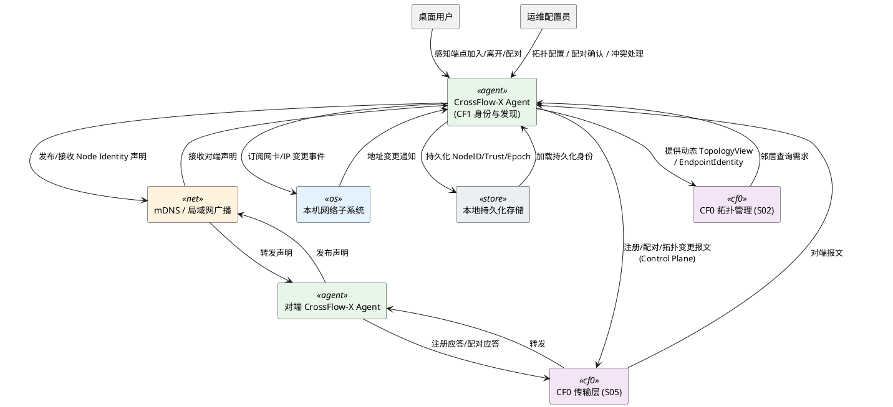
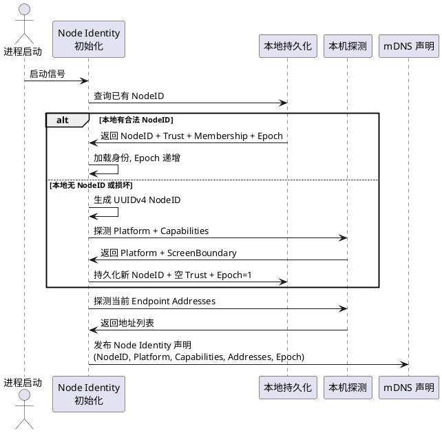
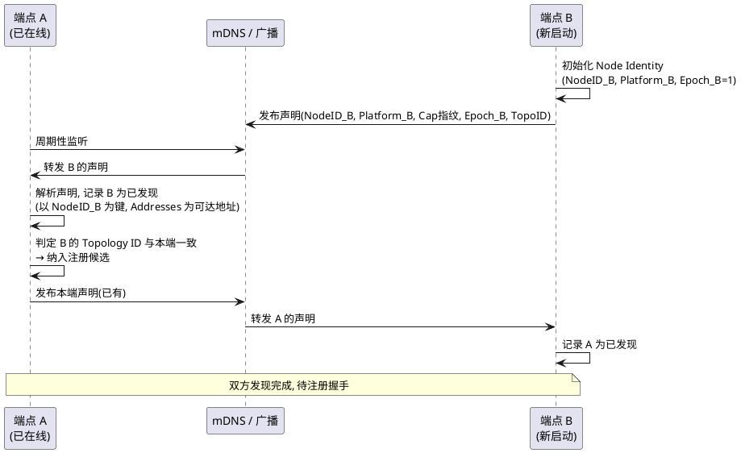
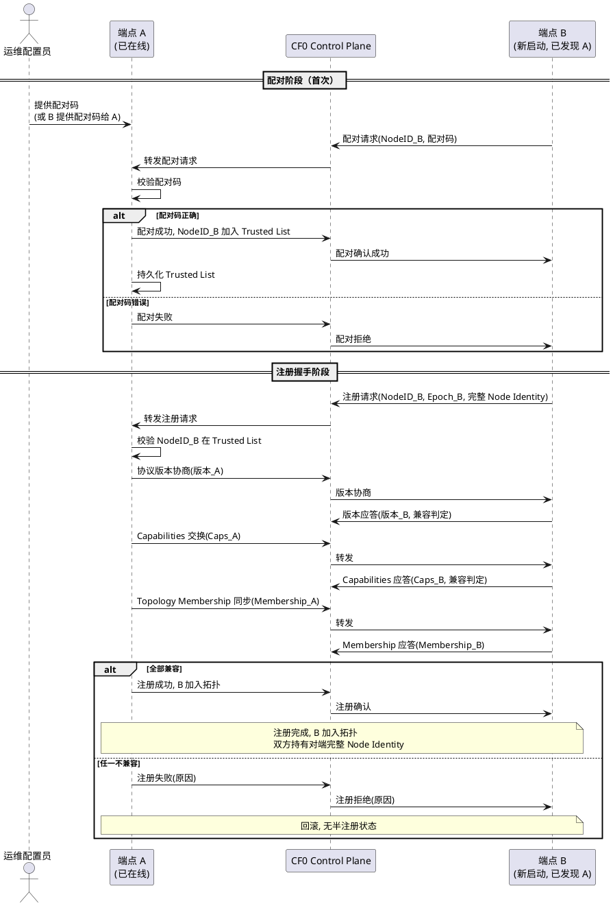
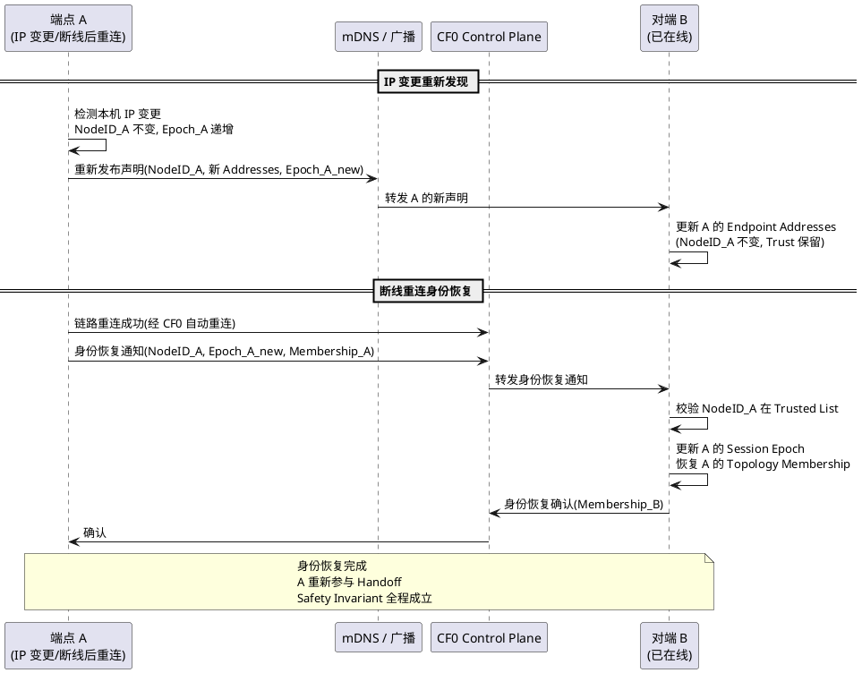

# CrossFlow-X · CF1 端点身份与发现需求规格说明书

> **阶段标记**：CF1 — Endpoint Identity & Discovery
> **规格范围**：CF1-S01 ～ CF1-S05（五个身份与发现地基）
> **第一原则**：NodeID 是身份，IP 只是当前可达地址。
> **CF0 冻结基线引用**：本阶段所有需求严格遵循 `.codeartsdoer/specs/cf0_arch_freeze/spec.md`（v2，892 行）冻结的全部架构基线，包括 Driverless User-Mode Architecture、C++20 技术栈、Canonical Input Event 规范化隔离、Handoff 六态 FSM（ARMED/PENDING/ACK/ACTIVE/COOLDOWN/RECOVERY）、12 条合法状态路径、防抖/冷却/驻留/熔断、PREPARE→ACK→COMMIT→ACTIVE 事务语义、Relative/Absolute Coordinate 双语义、Input/Control 双平面隔离、FSM 单线程所有权、7 个核心契约、CF0 Architecture Safety Invariant（P1 No Split-Brain / P2 No Void-Owner / P3 Recoverable）。
> **CF0 接口契约引用**：CF1 复用 CF0 冻结的 `ITopologyManager`、`EndpointIdentity`、`NodeId`、`TopologyView`、`ScreenBoundary`、`Platform` 等领域模型与接口（见第 7 章）。
> **文档状态**：DRAFT v1 → 待用户审查冻结

---

# **1. 组件定位**

## **1.1 核心职责**

本组件负责为 CrossFlow-X 建立以 NodeID 为核心的端点身份模型与无固定 IP 的发现机制，实现端点在 IP 变化、DHCP 续约、网卡切换、断线重连等网络环境动态变化下的稳定身份保持与拓扑自动恢复，为后续 Handoff 切换与循环拓扑提供身份地基。

## **1.2 核心输入**

1. **本端首次启动信号**：Agent 进程首次启动且本地无持久化 NodeID 时触发的身份初始化信号，来源为进程启动流程。
2. **本端后续启动信号**：Agent 进程后续启动且本地已有持久化 NodeID 时触发的身份加载信号，来源为进程启动流程。
3. **本机网络地址变更事件**：本机网卡启用/禁用、IP 地址分配/释放、DHCP 续约导致的可达地址列表变更事件，来源为操作系统网络子系统。
4. **局域网发现报文**：其他 CrossFlow-X Agent 在局域网内广播/mDNS 发布的端点发现声明报文，包含 NodeID、Platform、Capabilities、Endpoint Addresses、Topology Membership、Session Epoch。
5. **配对请求**：运维配置员或已配对端点发起的端点配对确认请求，包含配对码，来源为配置接口或对端 Agent。
6. **拓扑成员变更事件**：端点加入/离开拓扑、邻居关系调整触发的事件，来源为对端 Agent 的拓扑声明或运维配置。
7. **链路断开/重连事件**：与对端 Agent 链路的断开与重连事件，来源为 CF0 传输层（CF0-S05）。
8. **本机平台与能力探测结果**：本机操作系统类型、支持的输入类型、屏幕边界等能力探测结果，来源为本机系统探测。

## **1.3 核心输出**

1. **本端 Node Identity 声明**：向局域网广播/mDNS 发布的本端身份声明报文，包含 Stable NodeID、Platform、Capabilities、Endpoint Addresses、Topology Membership、Session Epoch。
2. **端点注册请求/应答**：向对端 Agent 发起的端点注册请求与返回的注册应答，经 CF0 Control Plane 传输。
3. **配对确认请求/应答**：向对端或运维配置员发起的配对确认请求与应答。
4. **拓扑成员变更通知**：向拓扑内所有端点广播的成员加入/离开通知，经 CF0 Control Plane 传输。
5. **身份恢复通知**：断线重连后向对端发送的身份恢复通知，携带 NodeID 与新 Session Epoch。
6. **结构化日志**：含 NodeID、Session Epoch、发现事件、注册事件、配对事件等结构化字段的日志，交由 CF0 Logger Thread 异步写入。

## **1.4 职责边界**

本组件 **不负责** 以下事项：

1. **不负责 Handoff 切换执行**：控制权转移的 FSM 驱动、边缘越界检测、坐标换算归属 CF0-S03/CF0-S04，CF1 仅提供身份与拓扑成员关系供其查询。
2. **不负责输入事件捕获与注入**：输入捕获/规范化/注入归属 CF0-S01，CF1 不触碰输入事件流。
3. **不负责传输层帧编解码**：二进制帧编解码、双平面通道、心跳、断线判定归属 CF0-S05，CF1 复用其 Control Plane 通道传输身份与拓扑报文。
4. **不负责强加密与证书体系**：CF1 仅预留 Public Key / Trust Identity 字段位与配对码基线确认机制；强加密、证书签发、密钥轮换归属 CF8 Security/Pairing。
5. **不负责跨局域网发现**：第一版发现机制限定为单一局域网内 mDNS/广播；跨子网、跨 NAT、广域网发现归属后续阶段。
6. **不负责 GUI 配对界面**：配对码的展示与输入交互归属 CF11 GUI，CF1 仅冻结配对确认机制与协议字段。
7. **不负责拓扑布局编排**：拓扑的端点清单与邻居关系的初始编排归属运维配置员，CF1 负责加载、校验、动态维护与同步，不负责"设计拓扑"。
8. **不破坏 CF0 Architecture Safety Invariant**：CF1 的任何身份变更、发现失败、注册失败、重连恢复，都不得导致 CF0 Safety Invariant（P1/P2/P3）被破坏。

---

# **2. 领域术语**

**节点身份（Node Identity）**
: 一个端点的完整身份描述，包含 Stable NodeID、Public Key、Platform、Capabilities、Endpoint Addresses、Topology Membership、Session Epoch 七要素；是"NodeID 是身份，IP 只是地址"原则的载体。
: 备注：CF1 的核心数据对象。

**稳定节点标识（Stable NodeID）**
: 端点的全局唯一逻辑标识，UUIDv4 生成，本地持久化，IP 变化、网卡变更、重启均不改变；与 CF0 冻结的 NodeId 领域对象同义。
: 备注：第一原则的核心载体，与 IP 解耦。

**公钥 / 信任身份（Public Key / Trust Identity）**
: 端点的密码学身份标识，用于未来 CF8 阶段的端点认证、报文签名、加密协商；CF1 阶段仅预留字段位与配对码基线，不实现强加密。
: 备注：为 CF8 Security/Pairing 预留。

**平台声明（Platform）**
: 端点运行的操作系统类型，取值为 {macOS, Windows}；与 CF0 冻结的 Platform 枚举同义，用于能力协商与注入路径选择。

**能力声明（Capabilities）**
: 端点声明自身支持的功能集合，包括支持的输入事件类型、屏幕边界、是否支持循环切换、协议版本等；用于注册时的能力交换与兼容性判定。

**端点地址（Endpoint Address）**
: 端点当前的一个可达网络地址，包含地址类型（IPv4/IPv6/hostname）、地址值、端口、优先级；端点可同时拥有多个 Endpoint Address，地址列表可变，NodeID 不变。
: 备注：IP 只是当前可达地址，可变。

**拓扑成员关系（Topology Membership）**
: 端点在拓扑中的位置声明，包含所属拓扑标识、左邻居 NodeID、右邻居 NodeID、段索引；与 CF0 冻结的邻居关系同义，CF1 负责其动态维护。

**会话纪元（Session Epoch）**
: 端点每次启动或重连后递增的单调计数器，用于区分同一 NodeID 的不同会话实例；重连时通过 Session Epoch 判定对端是否为新会话。
: 备注：重连识别的核心机制。

**发现（Discovery）**
: 端点在局域网内通过 mDNS/广播机制发布自身 Node Identity 声明并接收其他端点声明的过程；发现结果以 NodeID 为索引，不以 IP 为索引。

**mDNS 声明（mDNS Announcement）**
: 端点通过 mDNS 协议在局域网内发布的 service 声明，service name 标识 CrossFlow-X，TXT 记录携带 Node Identity 摘要；用于无固定 IP 的端点发现。

**配对（Pairing）**
: 两个端点首次建立信任关系的过程，通过配对码确认双方有意互通；配对成功后记录对端 NodeID 为可信端点，后续连接无需重复配对。
: 备注：复用 CF0 §4.3.1 配对确认机制，CF1 扩展为基于 NodeID 的信任记录。

**握手（Handshake）**
: 端点注册时的身份交换与协议协商过程，包含协议版本协商、Capabilities 交换、Topology Membership 同步；与 CF0 §5.5.1.7 协议版本协商衔接。

**身份恢复（Identity Recovery）**
: 断线重连后，端点通过持久化的 NodeID 与新 Session Epoch 向对端证明自身身份并恢复拓扑成员关系的过程。

**重新发现（Re-discovery）**
: 端点 IP 变更后，通过 mDNS/广播重新发布自身声明并重新发现对端的过程；NodeID 不变，Endpoint Addresses 更新。

**可信端点列表（Trusted Node List）**
: 本端持久化的已配对端点 NodeID 列表；仅可信端点可完成注册并加入拓扑，未配对端点被拒绝。

**发现声明摘要（Discovery Digest）**
: mDNS TXT 记录中携带的 Node Identity 摘要信息，包含 NodeID、Platform、Capabilities 指纹、Session Epoch；完整 Node Identity 在注册握手时交换。

**拓扑标识（Topology ID）**
: 标识一个拓扑实例的字符串或 UUID，同一拓扑内所有端点共享同一 Topology ID；用于区分不同拓扑并防止误加入。

---

# **3. 角色与边界**

## **3.1 核心角色**

- **桌面用户**：CrossFlow-X 的最终用户，其主机运行 Agent 并参与拓扑；用户不直接操作发现与身份机制，但感知端点加入/离开与配对确认。
- **运维配置员**：负责编排拓扑布局、声明端点清单与邻居关系、执行或监督端点配对确认、处理 NodeID 冲突告警的人员。

## **3.2 外部系统**

- **mDNS / 局域网广播**：承载端点发现声明的局域网服务发现协议（macOS Bonjour / Windows mDNS）；CF1 通过其发布与接收 Node Identity 声明。
- **本机网络子系统**：提供本机网卡状态、IP 地址分配/释放事件的操作系统接口。
- **本地持久化存储**：存储 Stable NodeID、Trusted Node List、Topology Membership、Session Epoch 的本地文件（JSON 或等价格式）。
- **CF0 传输层（CF0-S05）**：CF1 复用其 Control Plane 通道传输注册、配对、拓扑成员变更等可靠报文。
- **CF0 拓扑管理（CF0-S02）**：CF1 向其提供动态维护的 TopologyView 与 EndpointIdentity，供 Handoff FSM 查询邻居。
- **对端 CrossFlow-X Agent**：对称对等的身份与发现参与者，双方互为发现者与被发现者。

## **3.3 交互上下文**



---

# **4. DFX约束**

> **CF0 基线延续**：CF1 必须遵循 CF0 §4 全部 DFX 约束（C++20 基线、性能红线、并发模型 ≤8 线程、用户态约束等）。本章仅列出 CF1 增量 DFX 约束，不重复 CF0 已冻结内容。

## **4.1 性能**

1. **发现声明发布延迟**：端点启动到首次 mDNS 声明发布的延迟必须 ≤ 500ms。
2. **对端发现延迟**：从对端 mDNS 声明发布到本端发现并记录该对端 Node Identity 的延迟必须 ≤ 1s（局域网内）。
3. **端点注册握手延迟**：从注册请求发出到注册完成（含协议版本协商、Capabilities 交换、Topology Membership 同步）的端到端延迟必须 ≤ 2s（局域网内）。
4. **身份恢复延迟**：断线重连后从链路重建到身份恢复完成（Topology Membership 恢复）的延迟必须 ≤ 3s。
5. **IP 变更重新发现延迟**：本机 IP 变更后到重新发布声明并完成对端重新发现的延迟必须 ≤ 2s。
6. **拓扑成员变更通知延迟**：成员加入/离开事件到全拓扑收悉的延迟必须 ≤ 1s（局域网内）。
7. **发现声明发布频率**：mDNS 声明发布频率必须 ≥ 1 次/60s（goodbye/refresh），且 ≤ 1 次/5s（避免风暴）；IP 变更或拓扑变更时立即触发一次额外声明。

## **4.2 可靠性**

1. **NodeID 持久化可靠性**：Stable NodeID 写入本地持久化存储后，进程崩溃、断电、重启均不得丢失；加载时必须校验完整性，损坏时重新生成并告警。
2. **Trusted Node List 持久化可靠性**：配对成功的端点 NodeID 必须持久化，重启后恢复可信列表；损坏时丢失信任记录但不得影响本端 NodeID。
3. **发现声明最终一致**：局域网内所有运行中的 CrossFlow-X Agent 在有限时间（≤ 60s）内必须收悉彼此的 Node Identity 声明（假设无丢包）。
4. **身份恢复幂等性**：同一 NodeID 的多次身份恢复请求必须幂等，不产生重复的拓扑成员关系或重复的信任记录。
5. **拓扑成员关系最终一致**：拓扑中所有端点在有限时间内对成员关系达成一致（复用 CF0 §5.2.1.6 拓扑一致视图规则）。
6. **断线不丢失身份**：链路断开不得清除本端 Stable NodeID、Trusted Node List、Topology Membership；重连后必须能恢复。
7. **CF0 Safety Invariant 延续**：CF1 的发现失败、注册失败、配对失败、身份恢复失败，都不得导致 CF0 Safety Invariant（P1 No Split-Brain / P2 No Void-Owner / P3 Recoverable）被破坏；失败时端点保持当前状态，不产生虚假控制权。

## **4.3 安全性**

1. **配对码确认机制**：端点首次注册前必须经过配对码确认；未配对端点的注册请求必须被拒绝（复用 CF0 §4.3.1）。
2. **可信端点白名单**：仅 Trusted Node List 中的 NodeID 可完成注册并加入拓扑；未在列表中的 NodeID 的注册请求被拒绝并记录安全告警。
3. **NodeID 不可伪造**：Stable NodeID 由本端生成并持久化，禁止从网络接收并覆盖本端 NodeID；接收到的对端声明中的 NodeID 仅作为对端标识记录，不影响本端身份。
4. **发现声明不含敏感信息**：mDNS 声明与发现报文禁止携带明文配对码、私钥、用户输入数据；仅携带 NodeID、Platform、Capabilities 指纹、Endpoint Addresses、Session Epoch。
5. **配对码传输隔离**：配对码仅在配对确认报文中传输，经 CF0 Control Plane 可靠通道；禁止经 mDNS 广播或 Input Plane 传输。
6. **CF8 强加密预留**：CF1 预留 Public Key / Trust Identity 字段位；第一版采用配对码基线，强加密与证书体系归属 CF8。

## **4.4 可维护性**

1. **结构化日志**：CF1 全部日志必须包含 NodeID、Session Epoch、事件类型、对端 NodeID（若涉及）等结构化字段，交由 CF0 Logger Thread 异步写入。
2. **运行时可观测**：必须暴露当前 Node Identity、Trusted Node List、已发现端点列表、拓扑成员关系、各对端 Session Epoch 等运行时指标。
3. **NodeID 冲突告警**：检测到 NodeID 冲突时必须向运维配置员发出结构化告警，包含冲突 NodeID、双方 Endpoint Addresses、Platform。
4. **发现/注册/配对事件审计**：端点发现、注册成功/失败、配对成功/失败、身份恢复事件必须记录审计日志，含时间戳、双方 NodeID、Session Epoch、结果。

## **4.5 兼容性**

1. **CF0 基线兼容**：CF1 必须遵循 CF0 冻结的全部兼容性约束（C++20 基线、编译器矩阵、用户态约束、操作系统兼容 macOS 12+ / Windows 10+）。
2. **NodeID 格式向前兼容**：NodeID 采用 UUIDv4 固定 128 位格式，未来版本不得变更已生成 NodeID 的格式。
3. **发现协议版本向前兼容**：发现声明报文必须携带协议版本号；新增字段必须保证旧版本端点可安全忽略（复用 CF0 §4.5.2）。
4. **Capabilities 向前兼容**：Capabilities 声明新增能力项必须保证旧版本端点可安全忽略未知能力；能力缺失时按保守策略降级。
5. **mDNS 服务名稳定**：mDNS service name 必须固定为 CrossFlow-X 标识，不得随版本变更；版本差异通过 TXT 记录的协议版本字段区分。

---

# **5. 核心能力**

## **5.1 Node Identity Model（CF1-S01）**

本模块定义端点的完整身份模型，是"NodeID 是身份，IP 只是当前可达地址"第一原则的语义地基，是整个系统在动态网络环境下稳定运行的身份基础。

### **5.1.1 业务规则**

1. **Stable NodeID 生成规则**：当本端首次启动且本地无持久化 NodeID 时，系统必须生成一个 UUIDv4 格式的 Stable NodeID 并持久化到本地存储；后续启动必须加载已有 NodeID，禁止重复生成。
   a. 验收条件：[首次启动 + 本地无 NodeID] → [生成 UUIDv4 NodeID 并持久化]
   b. 验收条件：[后续启动 + 本地已有 NodeID] → [加载已有 NodeID，不生成新 NodeID]

2. **Stable NodeID 不变性规则**：Stable NodeID 生成后，IP 地址变化、网卡启用/禁用、DHCP 续约、进程重启、链路断开与重连均不得改变 NodeID。
   a. 验收条件：[端点 IP 从 192.168.1.10 变更为 192.168.1.20] → [NodeID 不变]
   b. 验收条件：[端点重启后启动] → [NodeID 与重启前一致]
   c. 验收条件：[端点断线后重连] → [NodeID 不变]

3. **Stable NodeID 唯一性规则**：每个端点的 Stable NodeID 必须全局唯一；同一拓扑中禁止出现重复 NodeID（复用 CF0 §5.2.1.1）。
   a. 验收条件：[两个端点声明相同 NodeID] → [系统拒绝其二加入拓扑并告警 CFX-E-TOPO-NODEID-DUP]

4. **Node Identity 七要素完整规则**：每个端点的 Node Identity 必须包含且仅包含七要素：Stable NodeID、Public Key、Platform、Capabilities、Endpoint Addresses、Topology Membership、Session Epoch；缺一不可。
   a. 验收条件：[查询任一端点 Node Identity] → [返回结果包含全部七要素]

5. **Public Key 预留规则**：Node Identity 必须包含 Public Key / Trust Identity 字段；CF1 阶段该字段可为空但必须存在，为 CF8 Security/Pairing 预留。
   a. 验收条件：[查询 Node Identity 的 Public Key 字段] → [字段存在，CF1 阶段允许为空]

6. **Platform 声明规则**：Node Identity 必须声明端点平台类型（macOS / Windows），用于能力协商与注入路径选择（复用 CF0 §5.2.1.7）。
   a. 验收条件：[端点启动] → [Node Identity 的 Platform 字段为 macOS 或 Windows 之一]

7. **Capabilities 声明规则**：Node Identity 必须声明端点能力集合，至少包含：支持的输入事件类型、屏幕边界（复用 CF0 ScreenBoundary）、是否支持循环切换、协议版本号。
   a. 验收条件：[查询 Node Identity 的 Capabilities] → [包含输入类型、屏幕边界、循环切换支持、协议版本]

8. **Endpoint Addresses 可变规则**：Node Identity 的 Endpoint Addresses 列表可变，反映端点当前可达的网络地址集合；地址变更不得改变 Stable NodeID。
   a. 验收条件：[本机新增网卡或 IP] → [Endpoint Addresses 列表新增对应地址，NodeID 不变]
   b. 验收条件：[本机网卡禁用] → [Endpoint Addresses 列表移除对应地址，NodeID 不变]

9. **Topology Membership 声明规则**：Node Identity 必须包含端点在拓扑中的成员关系声明，含所属 Topology ID、左邻居 NodeID、右邻居 NodeID、段索引。
   a. 验收条件：[端点加入拓扑] → [Node Identity 的 Topology Membership 填充所属拓扑与邻居关系]

10. **Session Epoch 单调递增规则**：端点每次启动或重连必须递增 Session Epoch；Session Epoch 不得回跳；对端通过 Session Epoch 区分同一 NodeID 的不同会话。
    a. 验收条件：[端点第 N 次启动] → [Session Epoch = N（或等价单调递增值）]
    b. 验收条件：[端点断线重连] → [Session Epoch 递增，对端识别为新会话]

11. **NodeID 持久化完整性规则**：Stable NodeID、Trusted Node List、Topology Membership、Session Epoch 必须持久化到本地存储；加载时必须校验完整性，损坏时按以下策略恢复：NodeID 损坏则重新生成并告警，Trusted List 损坏则清空并告警，Topology Membership 损坏则等待重新发现恢复。
    a. 验收条件：[持久化文件损坏后启动] → [按策略恢复，不崩溃，记录告警]

12. **禁止项：禁止用 IP 作为身份标识**：系统禁止将 IP 地址、MAC 地址或任何网络地址作为端点的稳定身份标识；所有身份引用、拓扑成员关系、信任记录必须以 Stable NodeID 为键。
    a. 验收条件：[审查身份引用/拓扑成员/信任记录] → [全部以 NodeID 为键，无以 IP 为键]

13. **禁止项：禁止从网络接收覆盖本端 NodeID**：系统禁止接受任何来自网络的报文覆盖本端 Stable NodeID；本端 NodeID 仅由本地生成与持久化决定。
    a. 验收条件：[收到声称本端 NodeID 应为 X 的网络报文] → [拒绝并忽略，本端 NodeID 不变]

### **5.1.2 交互流程**



### **5.1.3 异常场景**

1. **持久化文件损坏**
   a. 触发条件：本地存储的 NodeID 或相关身份文件损坏或不可读。
   b. 系统行为：NodeID 损坏则重新生成 UUIDv4 并告警；Trusted List 损坏则清空并告警；Topology Membership 损坏则置空等待重新发现恢复；不崩溃，继续启动。
   c. 用户感知：日志中出现身份损坏告警；若 NodeID 重新生成，此前配对关系失效，需重新配对。

2. **本机无网络地址**
   a. 触发条件：端点启动时本机无任何可用网络地址（网卡全部禁用）。
   b. 系统行为：Node Identity 仍初始化（NodeID 生成、Platform 探测），Endpoint Addresses 列表为空，mDNS 声明暂缓发布；网络地址可用后补全并发布。
   c. 用户感知：端点启动但暂不可发现；网络恢复后自动加入发现。

3. **UUIDv4 生成失败**
   a. 触发条件：系统随机数源不可用导致 UUIDv4 生成失败。
   b. 系统行为：启动失败，记录致命错误，提示用户检查系统环境。
   c. 用户感知：Agent 无法启动，日志提示身份初始化失败。

---

## **5.2 Discovery Protocol（CF1-S02）**

本模块定义无固定 IP 依赖的局域网端点发现机制，是端点动态加入与拓扑自动恢复的发现地基。

### **5.2.1 业务规则**

1. **不依赖固定 IP 规则**：发现机制禁止要求端点配置固定 IP；端点必须能在 DHCP、动态 IP、网卡切换等非固定 IP 环境下完成发现与被发现（复用 CF0 §5.2.1.3）。
   a. 验收条件：[端点通过 DHCP 获取新 IP] → [仍可被发现并发现其他端点]

2. **局域网 mDNS 发现规则**：端点必须通过 mDNS / 局域网广播在所属局域网内发布与接收 Node Identity 声明；发现以 NodeID 为索引，不以 IP 为索引。
   a. 验收条件：[局域网内两个端点启动] → [双方在 ≤1s 内发现彼此，发现记录以 NodeID 为键]

3. **发现声明内容规则**：mDNS 声明必须携带 Discovery Digest，包含 Stable NodeID、Platform、Capabilities 指纹、Session Epoch、协议版本号；完整 Endpoint Addresses 与 Topology Membership 在注册握手时交换。
   a. 验收条件：[解析 mDNS 声明] → [包含 NodeID、Platform、Capabilities 指纹、Epoch、协议版本]

4. **NodeID 解耦发现规则**：发现结果必须以 Stable NodeID 为身份键记录对端；对端的 Endpoint Addresses 仅作为"当前可达地址"记录，地址变更时更新地址但不更新 NodeID 与已有信任关系。
   a. 验收条件：[对端 IP 变更后重新发现] → [NodeID 不变，Endpoint Addresses 更新，信任关系保留]

5. **动态加入规则**：端点必须支持运行时动态加入拓扑；新启动的端点发布声明后，已在线端点必须发现并将其纳入已发现端点列表，待注册后加入拓扑。
   a. 验收条件：[拓扑已有 A、B 运行 + C 启动] → [A、B 发现 C，C 发现 A、B，C 经注册后加入拓扑]

6. **动态离开规则**：端点必须支持运行时动态离开拓扑；正常离开时发布 goodbye 声明，异常离开由心跳超时判定（复用 CF0 §5.5.1.6）。
   a. 验收条件：[端点 C 正常关闭] → [发布 goodbye，A、B 移除 C 的发现记录与拓扑成员关系]
   b. 验收条件：[端点 C 异常断线] → [A、B 心跳超时后判定 C 离开，移除拓扑成员关系]

7. **发现声明周期刷新规则**：端点必须周期性刷新 mDNS 声明（≥1 次/60s），防止声明过期；IP 变更或拓扑变更时必须立即触发一次额外声明。
   a. 验收条件：[端点持续运行 60s] → [至少刷新一次 mDNS 声明]
   b. 验收条件：[端点 IP 变更] → [立即触发一次声明刷新，携带新 Endpoint Addresses]

8. **重复发现幂等规则**：对同一 NodeID 的多次发现声明必须幂等处理；声明中的 Session Epoch 与已记录一致时仅更新 Endpoint Addresses，Session Epoch 递增时标记对端为新会话。
   a. 验收条件：[收到同 NodeID 同 Epoch 的重复声明] → [仅更新地址，不产生重复记录]
   b. 验收条件：[收到同 NodeID 更高 Epoch 的声明] → [标记对端新会话，触发身份恢复流程]

9. **跨拓扑隔离规则**：发现声明必须携带 Topology ID；仅 Topology ID 一致的端点互相发现并纳入候选；Topology ID 不一致的端点发现后忽略，不加入同一拓扑。
   a. 验收条件：[端点 A 属 Topology-1 + 端点 B 属 Topology-2] → [A、B 互相发现但忽略，不加入同一拓扑]

10. **禁止项：禁止仅靠 IP 扫描发现**：发现机制禁止以 IP 地址段扫描作为发现手段；必须基于 mDNS / 广播的主动声明与被动接收。
    a. 验收条件：[审查发现机制] → [无 IP 段扫描逻辑，基于 mDNS/广播]

11. **禁止项：禁止发现未声明端点**：系统禁止主动探测或连接未发布 mDNS 声明的端点；发现必须基于对端主动声明。
    a. 验收条件：[主机 X 未运行 CrossFlow-X Agent] → [不被发现，不被探测]

### **5.2.2 交互流程**



### **5.2.3 异常场景**

1. **mDNS 服务不可用**
   a. 触发条件：操作系统 mDNS / Bonjour 服务未运行或不可用。
   b. 系统行为：降级为局域网广播发现（若实现）或仅依赖配置的端点清单直接连接；记录告警。
   c. 用户感知：发现可能延迟或失败；日志提示 mDNS 不可用。

2. **发现声明丢失**
   a. 触发条件：mDNS 声明在局域网中丢失（网络拥塞或丢包）。
   b. 系统行为：依赖周期性刷新声明（≤60s）最终收悉；超时未发现则不影响已建立连接。
   c. 用户感知：新端点发现可能延迟，但最终一致。

3. **NodeID 冲突发现**
   a. 触发条件：发现两个不同端点声明相同 NodeID。
   b. 系统行为：记录冲突告警，拒绝二者注册，向运维配置员告警要求重新生成 NodeID。
   c. 用户感知：冲突端点无法加入拓扑；运维收到冲突告警。

4. **跨子网端点不可见**
   a. 触发条件：端点位于不同子网，mDNS 广播不跨子网。
   b. 系统行为：第一版不跨子网发现；端点间不可见，需依赖配置直接连接或后续阶段扩展。
   c. 用户感知：跨子网端点无法自动发现；需同一局域网部署。

---

## **5.3 Endpoint Registration & Handshake（CF1-S03）**

本模块定义端点经发现后的注册与握手流程，是身份验证、能力协商与拓扑成员同步的注册地基。

### **5.3.1 业务规则**

1. **注册前置发现规则**：端点必须先经发现（CF1-S02）记录对端 Node Identity 摘要后，方可发起注册；禁止对未发现端点发起注册。
   a. 验收条件：[端点 A 未发现端点 B + A 发起注册 B] → [注册被拒绝，记录告警]

2. **配对前置规则**：端点首次注册前必须完成配对确认；未配对端点的注册请求必须被拒绝（复用 CF0 §4.3.1）；配对成功后对端 NodeID 加入 Trusted Node List，后续注册无需重复配对。
   a. 验收条件：[A 未配对 B + A 发起注册] → [注册被拒绝，提示需先配对]
   b. 验收条件：[A 已配对 B（B 在 Trusted List）+ A 发起注册] → [注册进入握手流程]

3. **配对码确认规则**：配对确认必须通过配对码验证；配对码由运维配置员或待配对端点提供；配对码匹配则配对成功，不匹配则拒绝并记录安全告警。
   a. 验收条件：[配对码正确] → [配对成功，对端 NodeID 加入 Trusted List 并持久化]
   b. 验收条件：[配对码错误] → [配对失败，记录安全告警，不加入 Trusted List]

4. **注册握手内容规则**：注册握手必须交换完整 Node Identity 并完成以下协商：协议版本协商（复用 CF0 §5.5.1.7）、Capabilities 交换与兼容性判定、Topology Membership 同步。
   a. 验收条件：[注册握手完成] → [双方持有对端完整 Node Identity，协议版本兼容，Capabilities 已交换，Topology Membership 已同步]

5. **协议版本协商规则**：注册握手首步必须协商协议版本号；版本不兼容必须拒绝注册并记录双方版本（复用 CF0 §5.5.1.7）。
   a. 验收条件：[双方协议版本兼容] → [继续握手]
   b. 验收条件：[双方协议版本不兼容] → [拒绝注册，记录双方版本]

6. **Capabilities 兼容性判定规则**：Capabilities 交换后必须判定双方能力兼容性；关键能力（如输入事件类型、屏幕边界）不兼容必须拒绝注册或按保守策略降级；非关键能力缺失可安全忽略。
   a. 验收条件：[双方关键能力兼容] → [注册成功]
   b. 验收条件：[双方关键能力不兼容] → [拒绝注册，记录不兼容项]
   c. 验收条件：[一方新增未知能力项] → [另一方安全忽略，不影响注册]

7. **Topology Membership 同步规则**：注册握手必须同步双方的 Topology Membership（Topology ID、邻居关系、段索引）；Topology ID 不一致必须拒绝加入同一拓扑；邻居关系冲突必须由运维配置裁决或拒绝。
   a. 验收条件：[双方 Topology ID 一致 + 邻居关系兼容] → [同步成功，加入拓扑]
   b. 验收条件：[双方 Topology ID 不一致] → [拒绝加入同一拓扑]

8. **注册报文可靠传输规则**：注册、配对、握手报文必须经 CF0 Control Plane 可靠有序通道传输（复用 CF0 契约⑥）；禁止经 Input Plane 或 mDNS 广播传输注册报文。
   a. 验收条件：[审查注册报文传输路径] → [经 CF0 Control Plane，不经 Input Plane/mDNS]

9. **注册原子性规则**：注册流程必须原子完成——要么全部步骤（配对校验、版本协商、Capabilities 交换、Topology 同步）成功并加入拓扑，要么任一步失败则整体回滚，不产生半注册状态。
   a. 验收条件：[注册中途失败（如 Capabilities 不兼容）] → [整体回滚，对端不加入拓扑，无半注册状态]

10. **注册幂等规则**：对同一 NodeID 的重复注册请求必须幂等；若已注册且 Session Epoch 一致则返回已注册应答，若 Session Epoch 递增则更新会话信息。
    a. 验收条件：[同 NodeID 同 Epoch 重复注册] → [返回已注册应答，不重复加入拓扑]
    b. 验收条件：[同 NodeID 更高 Epoch 注册] → [更新会话，触发身份恢复]

11. **禁止项：禁止未注册端点参与 Handoff**：未完成注册的端点禁止参与 CF0 Handoff 流程；CF0 Handoff Orchestrator 必须校验对端注册状态。
    a. 验收条件：[未注册端点 + 触发 Handoff] → [Handoff 被拒绝]

12. **禁止项：禁止配对码明文广播**：配对码禁止经 mDNS 广播或任何明文广播通道传输；必须经 CF0 Control Plane 点对点传输。
    a. 验收条件：[审查配对码传输] → [不经 mDNS/广播，经 Control Plane 点对点]

### **5.3.2 交互流程**



### **5.3.3 异常场景**

1. **配对码错误**
   a. 触发条件：配对请求携带的配对码与预期不匹配。
   b. 系统行为：拒绝配对，记录安全告警，对端 NodeID 不加入 Trusted List。
   c. 用户感知：配对失败，需重新提供正确配对码。

2. **协议版本不兼容**
   a. 触发条件：注册握手时双方协议版本不在兼容范围。
   b. 系统行为：拒绝注册，记录双方版本，整体回滚。
   c. 用户感知：端点无法加入拓扑，提示版本不兼容需升级。

3. **Capabilities 不兼容**
   a. 触发条件：双方关键能力（如输入类型、屏幕边界）不兼容。
   b. 系统行为：拒绝注册或按保守策略降级，记录不兼容项，整体回滚。
   c. 用户感知：端点无法加入或以降级模式加入，提示能力不兼容。

4. **Topology ID 不一致**
   a. 触发条件：注册时双方 Topology ID 不一致。
   b. 系统行为：拒绝加入同一拓扑，记录告警。
   c. 用户感知：端点无法加入，提示拓扑配置不匹配。

5. **注册中途链路断开**
   a. 触发条件：注册握手过程中 Control Plane 链路断开。
   b. 系统行为：整体回滚，不产生半注册状态；链路恢复后重新发起注册。
   c. 用户感知：注册失败，链路恢复后自动重试。

6. **未配对端点请求注册**
   a. 触发条件：未在 Trusted Node List 中的端点发起注册。
   b. 系统行为：拒绝注册，记录安全告警，不进入握手。
   c. 用户感知：注册被拒，提示需先完成配对。

---

## **5.4 Topology Membership Management（CF1-S04）**

本模块定义端点加入、离开拓扑与成员变更通知的动态管理机制，是循环拓扑与动态成员关系的维护地基。

### **5.4.1 业务规则**

1. **加入拓扑规则**：端点经注册成功后必须正式加入拓扑；其 Topology Membership 必须同步至拓扑内所有已在线端点；全拓扑在有限时间内达成一致（复用 CF0 §5.2.1.6）。
   a. 验收条件：[端点 B 注册成功] → [B 加入拓扑，全拓扑端点在 ≤1s 内收悉 B 的成员关系]

2. **正常离开规则**：端点正常关闭时必须发布 goodbye 声明并通知拓扑内所有端点；其他端点收到后必须移除该端点的拓扑成员关系与发现记录。
   a. 验收条件：[端点 B 正常关闭] → [发布 goodbye，A、C 移除 B 的成员关系与发现记录]

3. **异常断线离开规则**：端点异常断线（心跳超时，复用 CF0 §5.5.1.6）时，其他端点必须判定其离开并移除拓扑成员关系；移除后该方向的 Handoff 触发暂停（复用 CF0 §5.2.3.3 邻居失联）。
   a. 验收条件：[端点 B 异常断线 + A、C 心跳超时] → [A、C 移除 B 成员关系，B 方向 Handoff 暂停]

4. **成员变更通知规则**：端点加入或离开拓扑时必须向拓扑内所有已在线端点广播成员变更通知；通知经 CF0 Control Plane 可靠有序传输；全拓扑在有限时间内一致。
   a. 验收条件：[B 加入/离开拓扑] → [全拓扑端点在 ≤1s 内收悉变更通知并更新成员关系]

5. **循环拓扑支持规则**：拓扑必须支持 ≥2 段的线性循环（Mac → Win-A → Win-B → Win-C → Mac），最左端左边缘与最右端右边缘回环闭合（复用 CF0 契约③）；CF1 的成员管理必须维护回环邻居关系。
   a. 验收条件：[配置 Mac → Win-A → Win-B → Win-C → Mac] → [成员关系维护回环，最右端右邻居=最左端，最左端左邻居=最右端]
   b. 验收条件：[最右端鼠标越过右边缘] → [控制权转移至最左端，无死路]

6. **邻居关系维护规则**：每个端点最多两个邻居（左、右），分别对应屏幕左边缘与右边缘（复用 CF0 §5.2.1.5）；成员变更时必须重新校验邻居数量上限与线性排列。
   a. 验收条件：[成员变更后校验] → [每端点邻居数 ≤2，拓扑保持线性]

7. **拓扑版本递增规则**：拓扑成员关系变更必须递增拓扑视图版本号（复用 CF0 §6.3 version）；版本号单调递增，全拓扑同步。
   a. 验收条件：[成员加入/离开] → [拓扑版本号递增并同步全拓扑]

8. **段数下限规则**：拓扑段数必须 ≥2，禁止两点退化（复用 CF0 契约③ / §5.3.1.16）；成员变更后若段数 <2 必须告警。
   a. 验收条件：[成员离开导致仅剩 2 端点] → [段数=1，告警两点退化，但不崩溃]
   b. 验收条件：[成员离开导致仅剩 1 端点] → [该端点保持主控态，拓扑暂停切换]

9. **成员关系与 CF0 TopologyView 一致规则**：CF1 维护的拓扑成员关系必须与 CF0 `ITopologyManager` 的 TopologyView 保持一致；CF1 通过 CF0 接口提供动态维护的 TopologyView 供 Handoff FSM 查询。
   a. 验收条件：[查询 CF0 ITopologyManager.currentView()] → [与 CF1 维护的成员关系一致]

10. **禁止项：禁止多路径拓扑**：第一版禁止树状、网状、多路径拓扑结构（复用 CF0 §5.2.1.8）；成员关系必须保持线性序列（含回环）。
    a. 验收条件：[配置形成分叉] → [系统拒绝]

11. **禁止项：禁止未通知的成员变更**：任何成员加入/离开必须通知全拓扑；禁止静默变更成员关系。
    a. 验收条件：[成员变更] → [全拓扑收悉通知，无静默变更]

### **5.4.2 交互流程**

```plantuml
@startuml
participant "端点 A" as A
participant "CF0 Control Plane" as CP
participant "端点 B\n(新加入)" as B
participant "端点 C" as C

== B 加入拓扑 ==
B -> CP : 注册成功(经 CF1-S03)
CP -> A : 成员变更通知(NodeID_B 加入, Membership_B)
CP -> C : 成员变更通知(NodeID_B 加入, Membership_B)
A -> A : 更新 TopologyView\n(新增 B, 版本号递增)
C -> C : 更新 TopologyView\n(新增 B, 版本号递增)
A -> CP : 成员变更确认
C -> CP : 成员变更确认

note over A,B,C: 全拓扑一致, B 正式参与 Handoff

== B 正常离开 ==
B -> CP : goodbye 声明 + 成员离开通知
CP -> A : 成员变更通知(NodeID_B 离开)
CP -> C : 成员变更通知(NodeID_B 离开)
A -> A : 移除 B 的成员关系与发现记录\n(版本号递增, B 方向 Handoff 暂停)
C -> C : 同上
@enduml
```

### **5.4.3 异常场景**

1. **成员变更通知丢失**
   a. 触发条件：成员变更通知经 Control Plane 传输时丢失。
   b. 系统行为：CF0 Control Plane 自动重传（复用 CF0 §5.5.1.3）；超限判定断线。
   c. 用户感知：变更可能短暂延迟后一致，或断线后触发离开处理。

2. **邻居失联**
   a. 触发条件：某端点的邻居心跳超时（复用 CF0 §5.2.3.3）。
   b. 系统行为：标记邻居失联，对应方向 Handoff 暂停；其余邻居关系不受影响；邻居恢复后自动恢复 Handoff。
   c. 用户感知：失联方向切换不生效，其余方向正常。

3. **拓扑视图不一致**
   a. 触发条件：两个端点持有的拓扑成员关系在合并后存在矛盾。
   b. 系统行为：以运维配置员最新下发的配置为准强制对齐；无法裁决时进入安全停摆，拒绝 Handoff（复用 CF0 §5.2.3.2）。
   c. 用户感知：切换不可用，提示拓扑配置异常。

4. **成员离开导致段数不足**
   a. 触发条件：成员离开后拓扑段数 <2。
   b. 系统行为：告警两点退化；若仅剩 1 端点则该端点保持主控态，拓扑暂停切换。
   c. 用户感知：切换暂停，提示拓扑成员不足。

5. **双向同时加入冲突**
   a. 触发条件：两个端点同时向拓扑发起注册加入。
   b. 系统行为：按注册到达顺序串行处理；NodeID 冲突则拒绝二者（复用规则 5.1.1.3）。
   c. 用户感知：端点依次加入或冲突端点被拒。

---

## **5.5 Session Epoch & Reconnection（CF1-S05）**

本模块定义会话纪元管理与断线重连后的身份恢复机制，是 IP 变更、断线重连、NodeID 持久化恢复的会话地基。

### **5.5.1 业务规则**

1. **Session Epoch 生成规则**：端点每次启动必须递增 Session Epoch 并持久化；Session Epoch 从 1 开始，单调递增，不得回跳。
   a. 验收条件：[端点第 N 次启动] → [Session Epoch ≥ N，单调递增]

2. **Session Epoch 持久化规则**：Session Epoch 必须持久化到本地存储；重启后加载并继续递增，不得重置。
   a. 验收条件：[端点重启] → [Session Epoch 在原值基础上递增，不重置为 1]

3. **断线重连身份恢复规则**：链路断开后重连成功时，端点必须通过持久化的 Stable NodeID 与新 Session Epoch 向对端发送身份恢复通知；对端校验 NodeID 在 Trusted List 后恢复拓扑成员关系，不要求重新配对。
   a. 验收条件：[A 断线后重连 + A 发送身份恢复(NodeID_A, Epoch_A_new)] → [对端校验 NodeID_A 可信，恢复 A 的拓扑成员关系，不要求重新配对]

4. **IP 变更重新发现规则**：本机 IP 变更后，端点必须通过 mDNS/广播重新发布声明（携带新 Endpoint Addresses 与不变 NodeID）；对端收到后更新 A 的可达地址，信任关系与拓扑成员关系不变。
   a. 验收条件：[A 的 IP 变更 + A 重新发布声明] → [对端更新 A 的 Endpoint Addresses，NodeID/Trust/Membership 不变]

5. **NodeID 持久化恢复规则**：端点重启后必须从本地存储加载 Stable NodeID、Trusted Node List、Topology Membership、Session Epoch；加载后以同一 NodeID 与递增 Epoch 重新加入拓扑，对端识别为同一端点的新会话。
   a. 验收条件：[A 重启 + 加载 NodeID_A + Epoch 递增] → [对端识别为 NodeID_A 的新会话，恢复拓扑成员关系]

6. **重连不破坏 Safety Invariant 规则**：断线重连与身份恢复过程中，CF0 Architecture Safety Invariant（P1 No Split-Brain / P2 No Void-Owner / P3 Recoverable）必须始终成立；恢复期间不产生虚假控制权，不丢失本地控制权。
   a. 验收条件：[A 断线重连恢复期间] → [拓扑中 Control Owner 数量 ≤1，A 本地键鼠不永久失效，恢复后满足 P1 ∧ P2]

7. **重连期间 Handoff 暂停规则**：端点断线至身份恢复完成期间，涉及该端点的 Handoff 必须暂停（复用 CF0 §5.2.3.3 邻居失联）；恢复完成后自动恢复 Handoff 能力。
   a. 验收条件：[A 断线至恢复完成期间 + 触发涉及 A 的 Handoff] → [Handoff 暂停，A 方向边缘切换不生效]
   b. 验收条件：[A 恢复完成] → [A 方向 Handoff 自动恢复]

8. **身份恢复幂等规则**：同一 NodeID 与 Session Epoch 的多次身份恢复通知必须幂等处理，不产生重复的拓扑成员关系。
   a. 验收条件：[同 NodeID 同 Epoch 多次身份恢复] → [幂等处理，不重复加入拓扑]

9. **对端 Session Epoch 追踪规则**：端点必须追踪每个已注册对端的 Session Epoch；收到对端声明或恢复通知时，若 Epoch 高于已记录则更新并标记新会话，若低于已记录则忽略（过期会话）。
   a. 验收条件：[收到对端 Epoch > 已记录] → [更新，标记新会话]
   b. 验收条件：[收到对端 Epoch < 已记录] → [忽略，判定为过期会话]

10. **自动重连指数退避规则**：链路断开后必须自动尝试重连，采用指数退避策略（复用 CF0 §4.2.4）；重连成功后执行身份恢复流程。
    a. 验收条件：[链路断开] → [自动重连，指数退避，成功后身份恢复]

11. **禁止项：禁止重连要求重新配对**：已配对端点（在 Trusted Node List 中）断线重连后禁止要求重新配对；必须通过 NodeID 与 Session Epoch 直接恢复身份。
    a. 验收条件：[已配对端点断线重连] → [不要求重新配对，直接身份恢复]

12. **禁止项：禁止重连恢复按下状态**：重连恢复后禁止自动恢复断线前的按下键/按钮状态（复用 CF0 §5.5.3.6）；需用户重新操作。
    a. 验收条件：[重连恢复] → [不出现幽灵按下，此前按下状态不恢复]

### **5.5.2 交互流程**



### **5.5.3 异常场景**

1. **重连对端不可达**
   a. 触发条件：断线后重连尝试时对端已离开或不可达。
   b. 系统行为：指数退避重试；超时后判定对端离开，移除拓扑成员关系（复用 CF0 §5.2.3.3）。
   c. 用户感知：对端方向切换不可用，其余方向正常。

2. **身份恢复被拒（NodeID 不在 Trusted List）**
   a. 触发条件：身份恢复通知的 NodeID 不在对端 Trusted Node List 中（如 Trusted List 损坏清空）。
   b. 系统行为：拒绝恢复，要求重新配对；记录安全告警。
   c. 用户感知：需重新配对后加入拓扑。

3. **Session Epoch 冲突**
   a. 触发条件：收到对端声明的 Session Epoch 与已记录一致但 Endpoint Addresses 不同（疑似多实例）。
   b. 系统行为：记录告警，以最新声明为准更新地址；若疑似同一 NodeID 两实例运行则告警要求人工排查。
   c. 用户感知：日志出现 Epoch 冲突告警。

4. **持久化身份全部丢失**
   a. 触发条件：本地存储完全损坏，NodeID、Trusted List、Membership、Epoch 全部丢失。
   b. 系统行为：重新生成 NodeID（新身份），Trusted List 清空，Epoch 重置为 1，需重新配对加入拓扑；记录致命告警。
   c. 用户感知：端点以新身份启动，此前所有配对关系失效，需重新配对。

5. **重连期间 Safety Invariant 风险**
   a. 触发条件：重连恢复过程中出现并发 Handoff 或控制权竞争。
   b. 系统行为：重连期间涉及该端点的 Handoff 暂停（规则 5.5.1.7）；恢复完成后由 CF0 FSM 按既有安全路径处理。
   c. 用户感知：恢复期间切换暂停，恢复后正常；无 split-brain 或控制权丢失。

---

# **6. 数据约束**

## **6.1 Node Identity**

1. **node_id**：Stable NodeID，UUIDv4 格式（128 位），全局唯一，生成后不变，独立于网络地址。
2. **public_key**：Public Key / Trust Identity，变长字节串，CF1 阶段允许为空，为 CF8 预留。
3. **platform**：平台类型枚举，取值为 {macOS, Windows}（复用 CF0 Platform）。
4. **capabilities**：能力声明集合，至少包含 supported_input_types（支持的输入事件类型子集）、screen_boundary（CF0 ScreenBoundary）、supports_circular（布尔，是否支持循环切换）、protocol_version（协议版本号）。
5. **endpoint_addresses**：Endpoint Address 列表，可为空（无网络时）或多元素；每条含 address_type（IPv4/IPv6/hostname）、value（地址值）、port（端口）、priority（优先级）；列表可变。
6. **topology_membership**：Topology Membership，含 topology_id（Topology ID）、left_neighbor（左邻居 NodeID，可空）、right_neighbor（右邻居 NodeID，可空）、segment_index（段索引）。
7. **session_epoch**：Session Epoch，无符号整数，从 1 开始单调递增，不得回跳。

## **6.2 Endpoint Address**

1. **address_type**：地址类型枚举，取值为 {IPv4, IPv6, hostname}。
6. **value**：地址值字符串，格式随 address_type 而定（如 "192.168.1.10" / "fe80::1" / "host.local"）。
2. **port**：端口号，无符号 16 位整数，取值范围 1 ～ 65535。
3. **priority**：优先级，无符号整数，数值越小优先级越高；多地址时按优先级选择连接目标。

## **6.3 Capabilities**

1. **supported_input_types**：支持的输入事件类型子集，取值范围为 CF0 CanonicalInputEvent 的 EventType 枚举子集 {MouseMove, MouseButton, MouseWheel, KeyDown, KeyUp}。
2. **screen_boundary**：屏幕边界声明（复用 CF0 ScreenBoundary），含 width、height（正整数，原点左上角 (0,0)）。
3. **supports_circular**：布尔值，是否支持循环切换拓扑。
4. **protocol_version**：协议版本号，无符号整数，与 CF0 §5.5.1.7 协议版本协商衔接。

## **6.4 Session Epoch**

1. **value**：当前会话纪元值，无符号整数，从 1 开始单调递增。
2. **node_id**：所属端点的 Stable NodeID。
3. **last_updated_at**：最近一次递增时间戳（复用 CF0 单调时间戳语义）。

## **6.5 Topology Membership**

1. **topology_id**：Topology ID，字符串或 UUID，同一拓扑内所有端点共享。
2. **left_neighbor**：左邻居 NodeID，可为空表示无左邻居（非回环端点）。
3. **right_neighbor**：右邻居 NodeID，可为空表示无右邻居（非回环端点）。
4. **segment_index**：段索引，无符号整数，标识端点在线性序列中的位置。
5. **topology_version**：拓扑视图版本号，单调递增，任一成员变更必须递增（复用 CF0 §6.3 version）。

## **6.6 Trusted Node List**

1. **trusted_node_ids**：已配对端点 NodeID 列表，每条为 UUIDv4 格式；仅列表中的 NodeID 可完成注册。
2. **paired_at**：配对完成时间戳，记录该信任关系建立时间。
3. **last_seen_epoch**：该可信端点最近一次观测到的 Session Epoch，用于过期会话判定。

## **6.7 Discovery Digest（mDNS 声明摘要）**

1. **node_id**：声明端点的 Stable NodeID。
2. **platform**：声明端点的 Platform。
3. **capabilities_fingerprint**：Capabilities 的摘要指纹（如哈希），用于快速兼容性预判。
4. **session_epoch**：声明端点的当前 Session Epoch。
5. **protocol_version**：声明端点的协议版本号。
6. **topology_id**：声明端点的 Topology ID，用于跨拓扑隔离。

---

# **7. 与 CF0 的接口契约**

> **契约性质**：本章定义 CF1 如何复用与扩展 CF0 冻结的领域模型、接口与架构基线。CF1 不得破坏 CF0 冻结的任何契约与 Safety Invariant。

## **7.1 复用的 CF0 领域模型**

| CF0 领域对象 | CF1 复用方式 | CF1 扩展 |
|-------------|-------------|---------|
| `NodeId`（UUIDv4 u128） | 作为 Stable NodeID 的类型基础，不重新定义 | 无扩展，直接复用 |
| `EndpointIdentity` | 作为 Node Identity 的身份载体 | 扩展为含 Public Key、Capabilities、Endpoint Addresses、Session Epoch 的完整七要素 |
| `TopologyView` | CF1 动态维护并经 CF0 `ITopologyManager` 提供给 Handoff FSM | CF1 负责动态成员变更，CF0 接口负责查询 |
| `ScreenBoundary` | 作为 Capabilities 的 screen_boundary 字段 | 无扩展，直接复用 |
| `Platform` 枚举 | 作为 Node Identity 的 platform 字段 | 无扩展，直接复用 |
| `NeighborRelation` | 作为 Topology Membership 的邻居关系 | CF1 动态维护含回环映射 |

## **7.2 复用的 CF0 接口**

| CF0 接口 | CF1 复用方式 | CF1 调用约束 |
|---------|-------------|-------------|
| `ITopologyManager.loadIdentity()` | CF1 在启动时加载持久化的 Stable NodeID | CF1 负责持久化与加载，CF0 接口返回 EndpointIdentity |
| `ITopologyManager.loadTopology()` | CF1 加载并动态维护拓扑配置 | CF1 负责成员变更后更新 TopologyView |
| `ITopologyManager.currentView()` | CF0 Handoff FSM 经此查询邻居 | CF1 维护的视图必须与 CF0 接口返回一致 |
| `ITopologyManager.neighbor()` | CF0 Handoff FSM 经此查询左/右邻居（含回环） | CF1 维护回环邻居关系（契约③） |
| `ITopologyManager.setNeighborState()` | CF1 在邻居失联/恢复时调用 | CF1 触发，CF0 接口执行 |
| `ITopologyManager.isCircular()` / `segmentCount()` | CF1 维护循环拓扑支持（契约③） | segmentCount 必须 ≥2，禁两点退化 |
| `IControlPlaneChannel.send()` | CF1 经此传输注册/配对/成员变更/身份恢复报文 | CF1 报文为 Control Message 的新增子类型，经 Control Plane 可靠有序传输 |
| `IControlPlaneChannel.onMessage()` | CF1 经此接收对端的注册/配对/成员变更报文 | CF1 在 Control Plane Thread 内处理 |

## **7.3 CF1 新增的 Control Message 子类型**

CF1 在 CF0 `ControlMessage` variant 基础上新增以下子类型（经 Control Plane 传输，不破坏 CF0 双平面隔离契约⑥）：

1. **DiscoveryAnnouncement**：发现声明报文（点对点补充交换完整 Node Identity，mDNS 仅传摘要）。
2. **PairingRequest / PairingResponse**：配对请求与应答。
3. **RegistrationRequest / RegistrationResponse**：注册请求与应答（含完整 Node Identity、Capabilities、Topology Membership）。
4. **MembershipChangeNotification**：拓扑成员变更通知（加入/离开）。
5. **IdentityRecoveryRequest / IdentityRecoveryResponse**：身份恢复请求与应答（断线重连后）。
6. **GoodbyeAnnouncement**：正常离开声明。

**契约约束**：新增子类型必须遵循 CF0 §5.5.1.8 协议向前兼容规则——旧版本端点可安全忽略未知报文类型；新增字段必须保证旧版本可安全忽略。

## **7.4 CF1 不破坏的 CF0 契约**

| CF0 契约 | CF1 遵守方式 |
|---------|-------------|
| 契约① 规范化隔离 | CF1 不触碰输入事件流，不引入平台逻辑到 Core 层 |
| 契约② Handoff FSM 完整状态 | CF1 不修改 FSM 六态与转移路径；CF1 仅通过 TopologyManager 提供邻居查询 |
| 契约③ Topology 循环支持 | CF1 维护回环邻居关系与 segmentCount ≥2，不退化 |
| 契约④ Input Plane 直通 | CF1 报文全部经 Control Plane，不侵入 Input Plane |
| 契约⑤ Coordinate Space | CF1 不触碰坐标换算 |
| 契约⑥ Transport 双平面隔离 | CF1 新增报文类型归属 Control Plane，不破坏双平面隔离 |
| 契约⑦ Concurrency/Threading | CF1 复用 CF0 线程模型，不新增线程；CF1 报文处理在 Control Plane Thread 内，不引入锁竞争 |

## **7.5 CF0 Architecture Safety Invariant 延续**

CF1 的全部机制必须不破坏 CF0 Architecture Safety Invariant：

1. **P1 No Split-Brain**：CF1 的身份恢复与成员变更不得产生虚假控制权；恢复期间涉及端点的 Handoff 暂停，不产生双主控。
2. **P2 No Void-Owner**：CF1 的发现失败、注册失败、配对失败不得导致本地键鼠永久失效；失败时端点保持当前状态，经 CF0 RECOVERY/COOLDOWN 路径恢复。
3. **P3 Recoverable**：CF1 的断线重连、IP 变更、身份恢复必须在有限时间内完成（身份恢复 ≤3s，重新发现 ≤2s），回到满足 P1 ∧ P2 的状态。

**验收地位**：CF0-ARCH-SAFETY-001 ～ 006 在 CF1 阶段必须继续可验证通过；CF1 新增机制不得引入新的 Safety Invariant 破坏路径。

---

# **8. CF1 需求与 CF0 基线对齐总结**

> **对齐性质**：本章总结 CF1 需求与 CF0 冻结基线的对齐关系，确保 CF1 不偏离、不破坏、不重复 CF0 已冻结内容。

## **8.1 CF1 增量范围**

CF1 在 CF0 冻结的五个架构地基之上，新增五个身份与发现地基：

| CF1 模块 | 增量内容 | 依赖的 CF0 基线 |
|---------|---------|----------------|
| CF1-S01 Node Identity Model | Stable NodeID 七要素身份模型 | CF0 NodeId、EndpointIdentity、Platform、ScreenBoundary |
| CF1-S02 Discovery Protocol | mDNS 无固定 IP 发现 | CF0 §5.2.1.3 不依赖固定 IP、CF0 Control Plane |
| CF1-S03 Registration & Handshake | 注册配对握手 | CF0 §4.3.1 配对确认、§5.5.1.7 协议版本协商、Control Plane |
| CF1-S04 Topology Membership Mgmt | 动态成员管理 | CF0 契约③ 循环支持、§5.2 拓扑模型、ITopologyManager |
| CF1-S05 Session Epoch & Reconnection | 会话纪元与身份恢复 | CF0 §4.2.4 自动重连、§5.5.3.6 重连不恢复按下状态、Safety Invariant |

## **8.2 CF1 不引入的内容**

1. **不引入新线程**：CF11 复用 CF0 8 线程模型，CF1 报文处理在 Control Plane Thread 与 FSM Thread 内，不新增线程（遵守 CF0 契约⑦ ≤8 线程）。
2. **不引入新平面**：CF1 报文全部归属 CF0 Control Plane，不引入第三平面（遵守 CF0 契约⑥）。
3. **不引入强加密**：CF1 仅预留 Public Key 字段位与配对码基线，强加密归属 CF8。
4. **不引入跨局域网发现**：第一版限定单一局域网 mDNS 发现。
5. **不引入 GUI**：配对界面归属 CF11。
6. **不修改 CF0 FSM**：CF1 不修改 Handoff 六态 FSM 与转移路径，仅通过 TopologyManager 提供邻居查询。

## **8.3 CF1 第一原则落地路径**

> **NodeID 是身份，IP 只是当前可达地址。**

| 落地点 | 实现机制 | 对应需求 |
|--------|---------|---------|
| NodeID 生成后不变 | Stable NodeID UUIDv4 持久化 | §5.1.1.1, §5.1.1.2 |
| IP 变更不影响身份 | Endpoint Addresses 可变，NodeID 不变 | §5.1.1.8, §5.5.1.4 |
| 发现以 NodeID 为键 | mDNS 声明携带 NodeID，发现记录以 NodeID 索引 | §5.2.1.2, §5.2.1.4 |
| 信任以 NodeID 为键 | Trusted Node List 存 NodeID，不以 IP | §5.3.1.2, §5.3.1.3 |
| 重连以 NodeID 恢复 | 身份恢复通知携带 NodeID + Epoch | §5.5.1.3, §5.5.1.5 |
| 拓扑成员以 NodeID 标识 | Topology Membership 邻居为 NodeID | §5.4.1.5, §5.4.1.6 |

---

> **文档结束**
> 本规格定义 CF1-S01 ～ CF1-S05 五个身份与发现地基，严格遵循 CF0 冻结的全部架构基线（C++20、Driverless User-Mode、Handoff 六态 FSM、7 契约、Safety Invariant），落地"NodeID 是身份，IP 只是当前可达地址"第一原则，为后续 CF2 ～ CF11 工程实现阶段奠定身份与发现基础。
> **本次生成（v1）**：Node Identity 七要素模型；mDNS 无固定 IP 发现；注册配对握手；动态拓扑成员管理（含循环支持）；Session Epoch 身份恢复；与 CF0 接口契约对齐；CF0 Safety Invariant 延续。
> 待用户审查确认后，本文档状态由 DRAFT v1 转为 FROZEN。