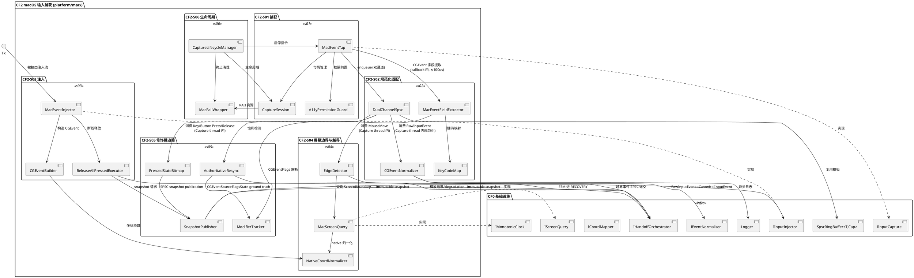
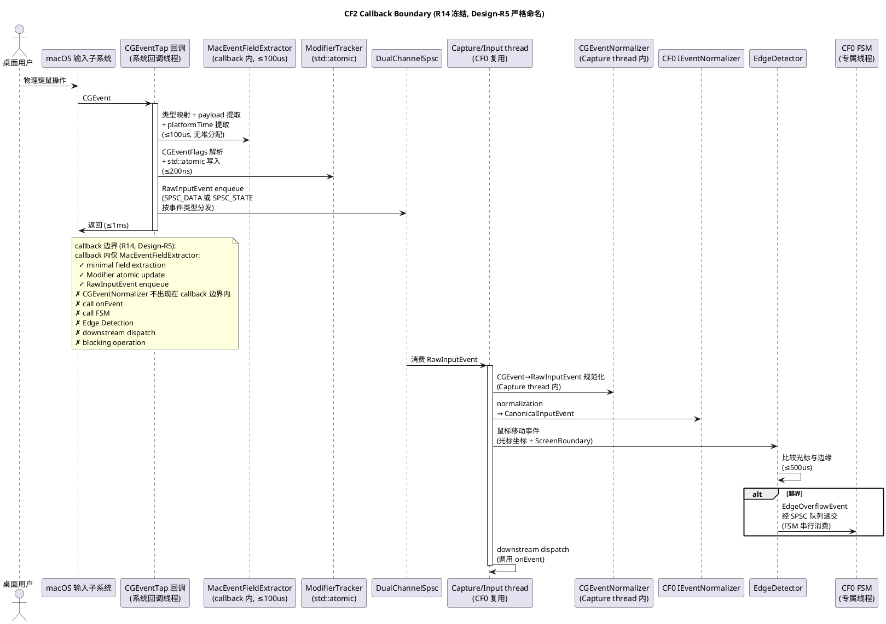
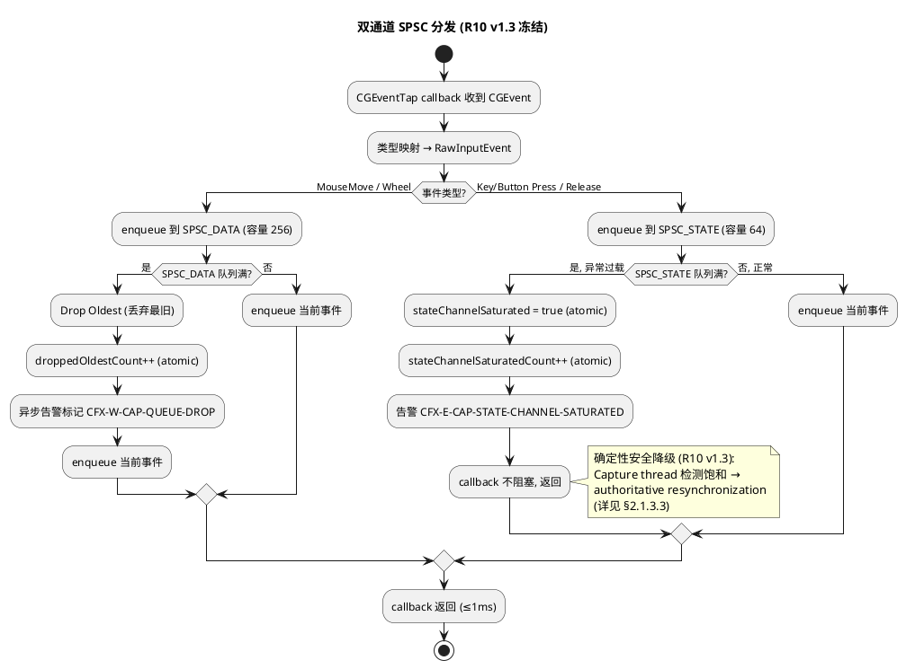
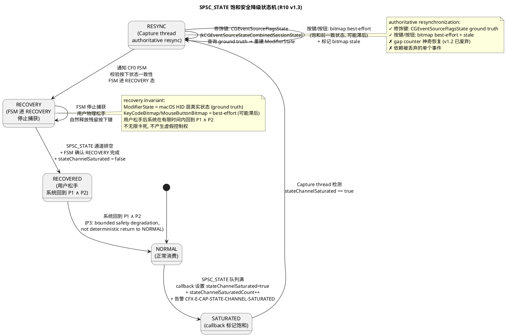
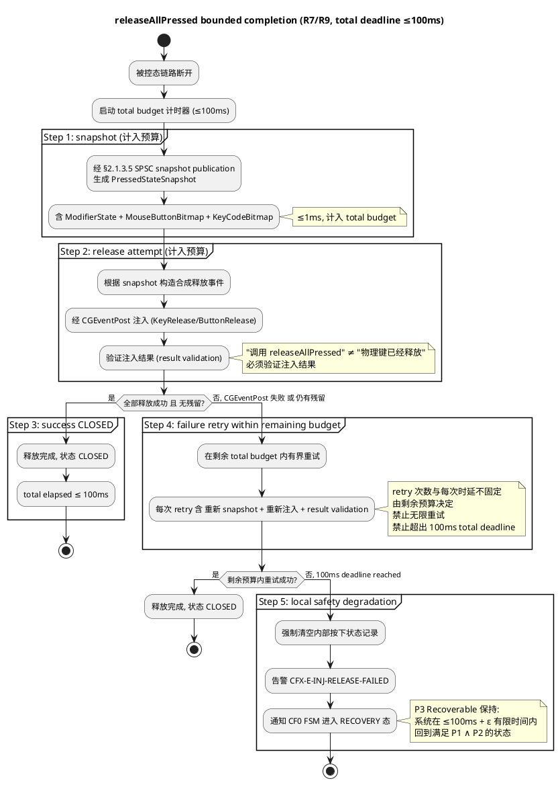
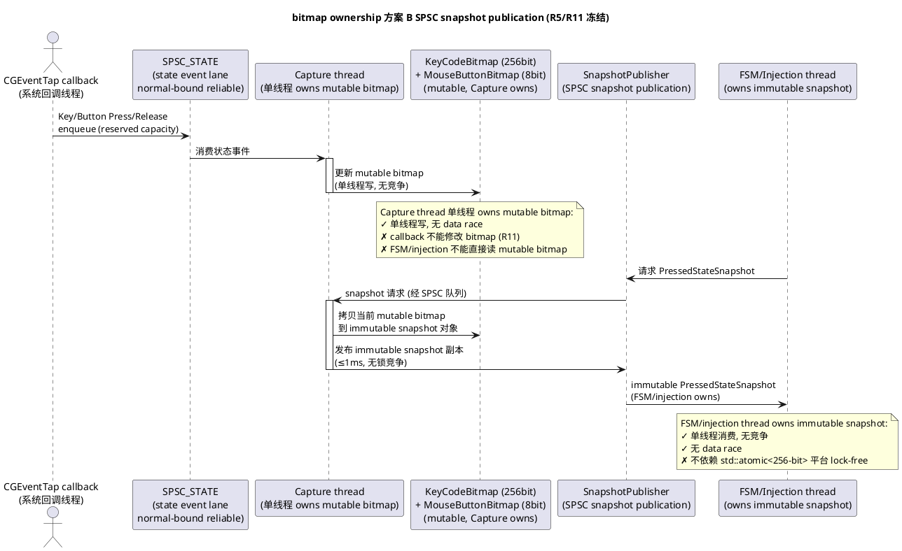
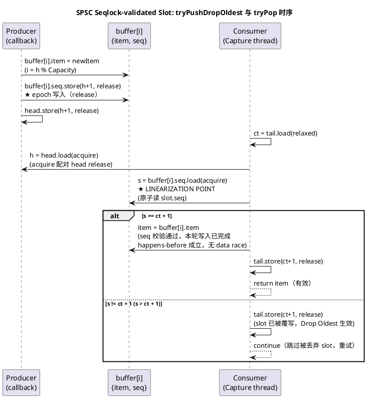
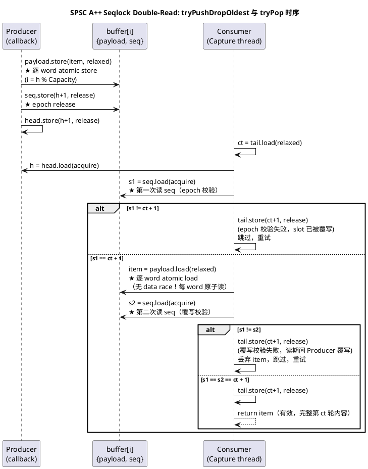
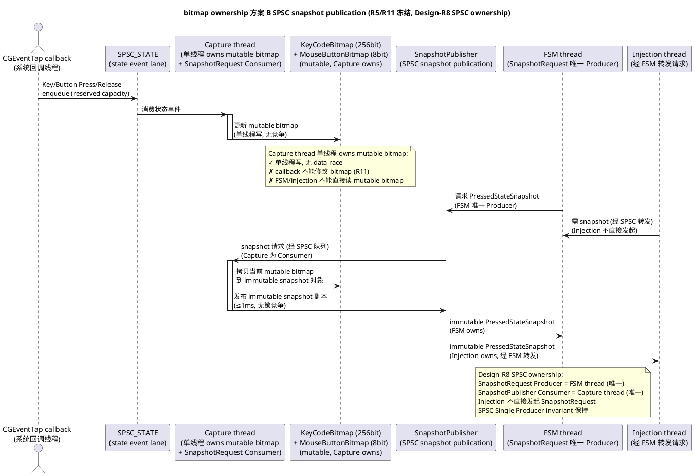

# CrossFlow-X · CF2 macOS 输入捕获实现方案设计文档

> **阶段标记**：CF2 — macOS Input Capture
> **对应需求规格**：`.codeartsdoer/specs/cf2_mac_capture/spec.md`（v1.4 Amendment，1144 行，六个 macOS 输入捕获地基 CF2-S01～CF2-S06 + 双通道 SPSC + authoritative resynchronization + bitmap ownership 方案 B + releaseAllPressed bounded completion ≤100ms + Callback Boundary 统一，已 FROZEN / PASS / AUTHORIZED commit 1ba1454）
> **CF0 冻结基线引用**：`.codeartsdoer/specs/cf0_arch_freeze/spec.md`（v2，892 行）+ `.codeartsdoer/specs/cf0_arch_freeze/design.md`（v3，3449 行），本设计严格遵循 CF0 冻结的全部架构基线（C++20 技术栈、Driverless User-Mode、Handoff 六态 FSM、7 核心契约、CF0 Architecture Safety Invariant P1/P2/P3、8 线程模型、双平面隔离、Coordinate Space RelativeDelta/AbsolutePosition 双语义、无锁 SPSC 队列 §2.7.3）。
> **CF1 冻结基线引用**：`.codeartsdoer/specs/cf1_endpoint_disc/spec.md`（v2，1432 行）+ `.codeartsdoer/specs/cf1_endpoint_disc/design.md`（v4，2972 行），本设计复用 CF1 冻结的 Node Identity（Stable NodeID 七要素）作为捕获事件源端标识，不修改身份与发现机制。
> **第一原则**：Driverless User-Mode Architecture —— macOS 输入捕获与注入必须完全在用户态完成，不引入内核扩展（kext）或驱动。
> **文档状态**：DRAFT v1.6（Amendment，受控修订，不推倒 2556 行 v1.5 主体）→ 待用户审查冻结（Evidence-First，先规格后实现；本设计仅覆盖 CF2-S01～S06 六个 macOS 输入捕获地基的增量设计方案 + 工程边界量化 + CF0 Safety Invariant 保障 + Verification Matrix 回映，不引入规格外能力，不修改 CF0/CF1 Frozen 文档，不进入 Task Design，不直接 Coding）
> **设计范围**：仅覆盖 CF2-S01～CF2-S06 六个 macOS 输入捕获地基的增量设计方案 + 大G项目经理特别要求的工程边界量化（SPSC_STATE=64 capacity / burst 上界 / consumer 最坏暂停窗口 / 异常过载判定阈值 / 饱和检测时序 / recovery 时序）+ CF0 Safety Invariant 保障 + Verification Matrix 回映。
> **执行纪律遵循**：严格遵守大G项目经理执行纪律（不修改 CF0/CF1 Frozen / 不重新设计 Handoff FSM / 不引入 Coordinator election / Raft / Paxos / 不改变 NodeID/Topology Authority 语义 / Input/Control 双平面隔离 / Evidence-First / Gate Review 后再编码）。

> **Amendment v1.1 变更记录（受控修订，不删除重写，不推倒 1442 行 v1 主体）**
> **修订背景**：大G 项目经理 Design Gate 审查裁决 = CONDITIONAL FAIL / REVISION REQUIRED，发现 10 项 Contract 层问题（4 BLOCKER + 6 P1）。v1 主体结构、六个模块、CF0-CF1 边界、Driverless 原则、安全目标、Requirements v1.4 FROZEN 内容全部保持不变。本次 Amendment 仅修复下列 10 项，不改变主体结构，不修改 CF0/CF1 Frozen 文档，不进入 Task Design，不直接 Coding。
> **修订项**：
> - **Design-R1 (🔴 BLOCKER)**：屏幕坐标类型与"x < 0"逻辑矛盾。修正：§2.2.2 EdgeDetector 接口 + §2.3.2 类图增加坐标域分层声明（macOS native 域 i64 / CF0 Logical Screen Space 域 u32 / EdgeOverflowEvent 域），统一 signed domain，消除 u32 永远不 < 0 的逻辑矛盾。
> - **Design-R2 (🔴 BLOCKER)**：B_burst 与 B_1s 数学推导不自洽（30+20+20=70 却得出 B_1s=60）。修正：§2.4.2 重新定义 B_burst / B_rate / W_pause 三个独立量，证明 backlog_max ≤ B_burst + B_rate × W_pause，消除 70→60 算术矛盾，SPSC_STATE=64 重新证明。
> - **Design-R3 (🔴 BLOCKER)**：W_worst=1.2ms 是假设非 Design Contract。修正：§2.4.3 分三层 W_design / W_observed / W_test，不得用 P99 证明 worst-case，删除 GC 引用（C++20/macOS 原生进程无 GC）。
> - **Design-R4 (🔴 BLOCKER)**：macOS API 10µs/100ns 等数字 overclaim。修正：§2.4 新增三类分层 HARD CONTRACT / DESIGN TARGET / MEASUREMENT REQUIREMENT，§2.4.5/§2.4.6 重新分类所有时序数字。
> - **Design-R5 (🟠 P1)**：R14 naming — callback extraction 与 CGEventNormalizer 未彻底分开。修正：§2.1.1/§2.1.2/§2.1.3.1 严格命名为 MacEventFieldExtractor（callback 内）与 CGEventNormalizer（Capture thread 内），CGEventNormalizer 不出现在 callback 边界。
> - **Design-R6 (🟠 P1)**：SPSC_STATE "可靠通道"语义需收紧。修正：§2.4.1 + §2.1.3.2 明确 Contract：STATE lane 在正常设计边界内禁止丢弃；容量耗尽时系统立即进入安全降级，不声称事件仍可靠到达。"reliable" 改为 "normal-bound reliable, saturation → safety degradation"。
> - **Design-R7 (🔴 BLOCKER)**：SPSC RingBuffer Drop Oldest 缺少并发证明。修正：§2.4.8 新增 Drop Oldest 并发 ownership 证明（Producer-only overwrite + memory-order proof），不破坏 SPSC ownership（head=Producer, tail=Consumer）。
> - **Design-R8 (🟠 P1)**：Snapshot Request 的 SPSC ownership 需明确。修正：§2.4.9 明确 SnapshotRequest Producer = 唯一线程/唯一逻辑 owner，SnapshotPublisher Consumer = Capture thread。FSM 与 Injection 不能同时为 producer。
> - **Design-R9 (🟠 P1)**：Recovery P3 证明 overclaim（T_user_release 不是系统可控 bounded upper bound）。修正：§2.4.6 + §2.5.3 拆成 System Safety Recovery（≤1.1ms 系统进入 RECOVERY，保证 P1∧P2）+ User-dependent convergence（T_user_release + bounded system drain，不宣称 deterministic bounded）。
> - **Design-R10 (🟠 P1)**：CF0 Frozen Boundary Amendment Contract 需明确。修正：§2.7 新增专门的 Frozen Boundary Amendment / Compatibility Contract，明确 CF0 Frozen behavior → CF2 additive interface extension → 不改变既有 Handoff FSM 状态机 → 不改变既有 CF0 contract。
> **未变更项（v1.1）**：六个模块（CF2-S01～S06）、CF0-CF1 边界、Driverless User-Mode Architecture、CF0 Safety Invariant（P1/P2/P3）、CF0 七契约、CF0 8 线程模型、CF1 Node Identity、第一原则落地路径、Requirements v1.4 FROZEN 全部内容、双通道架构（SPSC_DATA=256 / SPSC_STATE=64）、STATE saturation safety path、CGEventSourceFlagsState ground truth、bitmap ownership（方案 B SPSC snapshot publication）、RECOVERY、R9 ≤100ms total deadline、R11 ownership model、Callback Boundary（R14）全部保持不变。

> **Amendment v1.2 变更记录（受控修订，不删除重写，不推倒 1843 行 v1.1 主体）**
> **修订背景**：大G 项目经理对 Design v1.1 的 Design Gate 复审裁决 = CONDITIONAL FAIL / REVISION REQUIRED。v1.1 已正确修复 Design-R1/R3/R4/R5/R6/R8/R9/R10（7 项 PASS），但下列 3 项问题 + 1 项 P3 表述需进一步严格限定。本次 Amendment 仅修复下列 4 项（R11/R12/R13 + P3 表述），不改变主体结构 / 六个模块 / CF0-CF1 边界 / Driverless 原则 / 安全目标 / Requirements v1.4 FROZEN / R1/R3/R4/R5/R6/R8/R9/R10 已修复内容，不修改 CF0/CF1 Frozen 文档，不进入 Task Design，不直接 Coding。
> **修订项**：
> - **Design-R11 (🔴 BLOCKER)**：SPSC_DATA Drop-Oldest 的 producer-only head advance 逻辑错误。问题：v1.1 §2.4.8 "最终冻结"方案声称 Producer-only head advance 实现 Drop Oldest，但自相矛盾——head=Producer-only, tail=Consumer-only, Producer 不得写 tail；Producer 推进 head 只增加队列元素数量，不改变 Consumer 的 tail，旧事件未被 Drop；若 Producer 推进 head 超过 capacity 则 head-tail > capacity 违反不变量；v1.1 §2.4.8 自承认 "这不是严格 Drop Oldest，而是 Drop Oldest with Consumer-side stale tolerance"（1550 行），sentinel 槽位修复仍让 Consumer 读到被跳过的旧事件。修正：§2.4.8 采用**方案 A — Producer-owned `publishedTail` discard boundary + Consumer-owned `consumedTail`**，引入独立于 Consumer-owned tail 的 Producer-owned discard cursor（published read boundary），完整证明 Producer ownership / Consumer ownership / slot lifetime / memory ordering / ABA / overwrite race。Drop Oldest 时 Producer 同步推进 publishedTail（丢弃最旧），Consumer 读 effective range = [consumedTail, publishedTail)，最旧被排除，真正实现 Drop Oldest 语义。
> - **Design-R12 (🔴 BLOCKER)**：B_burst=6 / B_rate=40 仍标为 HARD CONTRACT。问题：v1.1 把 B_burst=6（Cmd+Shift+3=6 events）和 B_rate=40 events/s（吉尼斯纪录级打字）标为 HARD CONTRACT，但这些是 workload model 非 deterministic system upper bound；一旦有人输入 B_rate > 40，所谓 HARD CONTRACT 立即失效。修正：§2.4.0 三类分层表新增 **WORKLOAD MODEL / TEST PROFILE** 类别；§2.4.1 + §2.4.2 + §2.4.7 把 B_burst / B_rate 降级为 WORKLOAD MODEL；明确 backlog bound 在**声明的 workload envelope** 内成立，而非由"人类绝对输入上界"数学证明出的绝对安全容量；SPSC_STATE=64 是在指定 workload envelope 下经过验证的工程容量（HARD CONTRACT 仅限编译期 static_assert，不延伸到 B_burst/B_rate 的运行时输入上界）。
> - **Design-R13 (🟠 P1)**：W_test 10ms/12ms 两套口径歧义。问题：v1.1 不同位置出现 W_test=10ms（§2.4.3 consumer pause）和 saturation detection W_test=12ms（§2.4.5）/ System Safety Recovery W_test=12ms（§2.4.6），命名不正交。修正：§2.4.3 命名为 **W_pause_test=10ms**（consumer pause test threshold）；§2.4.5 命名为 **T_saturation_detect_test=12ms**（saturation detection test threshold）；§2.4.6 命名为 **T_system_recovery_test=12ms**（system recovery test threshold）；§2.4.7 表格 + §2.5.3 措施 6 同步，消除单一 W_test 歧义。
> - **P3 表述严格限定（🟠 P1）**：v1.1 §2.4.6/§2.5.3/§2.6.8 写 "P3 在 '系统侧安全降级有 bounded completion' 意义下可证"，仍可能被 Coding Agent 误解为 "RECOVERY→NORMAL 必须在 X ms 内完成" 的硬约束。修正：统一改为 "**CF2 proves bounded safety degradation and preservation of P1∧P2. It does not prove deterministic bounded return to NORMAL.**" 明确区分 "系统侧安全降级 bounded"（可证）与 "return to NORMAL"（不证 deterministic bounded，依赖 T_user_release eventual convergence），避免 Coding Agent 把 RECOVERY→NORMAL 实现成 "必须在 X ms 内完成" 的错误硬约束。
> **未变更项（v1.2）**：六个模块（CF2-S01～S06）、CF0-CF1 边界、Driverless User-Mode Architecture、CF0 Safety Invariant（P1/P2/P3）、CF0 七契约、CF0 8 线程模型、CF1 Node Identity、第一原则落地路径、Requirements v1.4 FROZEN 全部内容、双通道架构（SPSC_DATA=256 / SPSC_STATE=64）、STATE saturation safety path、CGEventSourceFlagsState ground truth、bitmap ownership（方案 B SPSC snapshot publication）、RECOVERY、R9 ≤100ms total deadline、R11 ownership model、Callback Boundary（R14）、Design-R1/R3/R4/R5/R6/R8/R9/R10 已修复内容全部保持不变。

> **Amendment v1.3 变更记录（受控修订，不删除重写，不推倒 1864 行 v1.2 主体）**
> **修订背景**：大G 项目经理对 Design v1.2 的 Design Gate 终审裁决 = CONDITIONAL FAIL / REVISION REQUIRED。v1.2 已正确修复 Design-R1/R2/R3/R4/R5/R6/R8/R9/R10/R12/R13（11 项 PASS），但 Design-R7/R11 引入的 "方案 A — Producer-owned `publishedTail` discard cursor + Consumer-owned `consumedTail`" 存在 SPSC Drop-Oldest Linearizability 未闭环的唯一 BLOCKER（Design-R14）。本次 Amendment 仅修复 R14 一项，不改变主体结构 / 六个模块 / CF0-CF1 边界 / Driverless 原则 / 安全目标 / Requirements v1.4 FROZEN / R1/R2/R3/R4/R5/R6/R8/R9/R10/R12/R13 已修复内容，不修改 CF0/CF1 Frozen 文档，不进入 Task Design，不直接 Coding。
> **修订项**：
> - **Design-R14 (🔴 BLOCKER)**：SPSC Drop-Oldest Linearizability 未闭环。问题：v1.2 方案 A 的 `publishedTail`（Producer-owned discard cursor）与 Consumer 对该 slot 的"读取资格"之间无可证明的原子线性化点。存在合法竞态窗口：Consumer 读 `consumedTail=100` 被挂起 → Producer `publishedTail=101`（宣布 [100] dropped）+ 写新事件 → Consumer 恢复后仍持有 stale `pt=100`，执行 `item=buffer[100]` 读取已被宣布 dropped 的事件。v1.2 仅证明 "Consumer 在观察到新 publishedTail 后会跳过"，未证明 "一旦 Producer 宣布 Drop，Consumer 绝不会随后消费该 item"。此外 `tryPushDropOldest()` 仅用 `h - publishedTail == Capacity - 1` 判满，未利用 `consumedTail`，Consumer 已消费但 publishedTail 未同步时 Producer 仍按旧 boundary 判满并额外丢弃。修正：§2.4.8 重写为**方案 A+ — Seqlock-validated Slot（epoch-tagged slot + Consumer-side seq 校验）**，废弃 `publishedTail`，给每个 slot 增加 `seq`（generation）计数器，**linearization point = `slot.seq` 的原子读**。Producer 写 slot 时 `seq = h + 1`（release）；Consumer 读 slot 时先读 `seq`（acquire），仅当 `seq == ct + 1` 才接受 item，否则该 slot 已被覆写（Drop Oldest），Consumer 推进 `tail` 跳过。满判定改用 `consumedTail`（`h - tail == Capacity`），消除 publishedTail 未同步导致的过早丢弃。完整给出 Producer/Consumer 时序图、Drop 与 Consume 全部 interleaving、linearization point、slot lifetime proof、overwrite race proof、memory-order proof、"Producer 宣布 dropped 后 Consumer 不能返回该 item"形式化结论、四种边界情况、并发压力测试设计。§2.3.2 类图 `SpscRingBuffer` 同步更新为 `Slot<T>` 结构 + `uint64_t` head/tail。
> **未变更项（v1.3）**：六个模块（CF2-S01～S06）、CF0-CF1 边界、Driverless User-Mode Architecture、CF0 Safety Invariant（P1/P2/P3）、CF0 七契约、CF0 8 线程模型、CF1 Node Identity、第一原则落地路径、Requirements v1.4 FROZEN 全部内容、双通道架构（SPSC_DATA=256 / SPSC_STATE=64）、STATE saturation safety path、CGEventSourceFlagsState ground truth、bitmap ownership（方案 B SPSC snapshot publication）、RECOVERY、R9 ≤100ms total deadline、R11 ownership model、Callback Boundary（R14）、Design-R1/R2/R3/R4/R5/R6/R8/R9/R10/R12/R13 已修复内容全部保持不变。`SpscRingBuffer` 公开接口签名（`tryPush/tryPop/tryPushDropOldest`）不变，仅内部实现从 publishedTail/consumedTail 双 cursor 改为 seqlock-validated slot。

> **Amendment v1.4 变更记录（受控修订，不删除重写，不推倒 1990 行 v1.3 主体）**
> **修订背景**：大G 项目经理对 Design v1.3 的 Design Gate 终审裁决 = CONDITIONAL FAIL / REVISION REQUIRED。v1.3 的 Design-R1～R13 全部 PASS，但 Design-R14 引入的"方案 A+ — Seqlock-validated Slot（epoch-tagged slot + Consumer-side seq 校验）"存在唯一 BLOCKER（Design-R15）：**Slot Read/Overwrite Lifetime Race — seq 校验通过后 item 读取仍存在 data race**。核心问题：v1.3 方案 A+ 中 Consumer 先 `acquire` 读 `slot.seq`，校验 `seq == ct+1` 通过后再读 `slot.item`（非原子）。但存在合法竞态：Consumer 读 seq=101（校验通过）→ Consumer 暂停（尚未读 item）→ Producer 覆写 `slot.item = NEW`（非原子写）+ `slot.seq.store(357, release)` + `head.store(356, release)` → Consumer 恢复 → `item = slot.item` 读取 NEW（已被覆写）。**问题本质**：(1) seq 校验通过 ≠ item 读取安全，Producer 可在 Consumer seq 校验后、item 读取前覆写 slot；(2) v1.3 overwrite race proof 隐含假设"Consumer 读 seq 和读 item 之间无 Producer 覆写"，但 arbitrary consumer pause（OS 调度可任意抢占线程）下该假设不成立；(3) Linearizability（seq.load 线性化点）只解决逻辑顺序，不解决物理内存生命周期——非原子多 word payload 的并发读写 = C++20 data race (UB)。本次 Amendment 仅修复 R15 一项，不改变主体结构 / 六个模块 / CF0-CF1 边界 / Driverless 原则 / 安全目标 / Requirements v1.4 FROZEN / R1～R14 已修复内容，不修改 CF0/CF1 Frozen 文档，不进入 Task Design，不直接 Coding。
> **修订项**：
> - **Design-R15 (🔴 BLOCKER)**：Slot Read/Overwrite Lifetime Race — seq 校验通过后 item 读取仍存在 data race。**架构取舍声明（方向 B — 重新定义 payload lifetime）**：经严格证明，非阻塞 Producer + SPSC + producer-side Drop Oldest + **非原子多 word payload** + arbitrary consumer pause 在 C++20 strict memory model 下**不可同时满足**（不可能性证明见 §2.4.8）。CF2 做明确架构取舍：保留非阻塞 Producer（Input Plane 低延迟，callback ≤1ms）、SPSC、producer-side Drop Oldest、arbitrary consumer pause（OS 调度不可控），**放弃"非原子 payload"**，改为 **word-atomic payload + seqlock double-read validation**。**修正**：§2.4.8 新增方案 A++ — Epoch-tagged Slot with **Word-Atomic Payload** + **Seqlock Double-Read Validation**：(1) payload 存储从非原子 `T item` 改为 `AtomicPayload<T>`（内部 `std::atomic<uint64_t> words[N]`，N = ⌈sizeof(T)/8⌉，每 word 8 字节，`is_lock_free()` = true on x86-64/ARM64，不依赖大 atomic，与 R11 兼容）；(2) Consumer 读取改为 seqlock 双读——`s1 = slot.seq.load(acquire)` → epoch 校验 `s1 == ct+1` → 逐 word `atomic load` payload（无 data race）→ `s2 = slot.seq.load(acquire)` → 覆写校验 `s1 == s2`，两校验都通过才接受 item，否则丢弃跳过（Drop Oldest 生效）；(3) Producer 写入改为逐 word `atomic store` payload（relaxed）→ `seq.store(release)`，不阻塞。**关键性质**：所有 word + seq 均为 `std::atomic`，无 data race（C++20 strict 合规）；arbitrary consumer pause 下 double-seq 校验检测覆写，Consumer 丢弃被覆写 item；Producer 不需要知道 Consumer 读取状态（非阻塞）。完整给出不可能性证明 + 方案 A++ 状态变量/ownership/不变量/初始化/tryPush/tryPushDropOldest/tryPop + Producer/Consumer 完整时序图 + 全部 Consumer-pause interleaving（含 seq 已读 item 未读 Producer 覆写关键 interleaving）+ C++20 data-race proof + slot ownership/lifetime proof + linearization proof + arbitrary consumer pause safety proof + 核心问题回答 + 四种边界情况 + TEST-R15-LIFETIME 并发压力测试设计。§2.3.2 类图 `Slot<T>` 同步更新为 `AtomicPayload<T>` 结构。§2.2.2 接口注释引用 §2.4.8 R15。§2.6.8 回映表新增 R15 行。
> **未变更项（v1.4）**：六个模块（CF2-S01～S06）、CF0-CF1 边界、Driverless User-Mode Architecture、CF0 Safety Invariant（P1/P2/P3）、CF0 七契约、CF0 8 线程模型、CF1 Node Identity、第一原则落地路径、Requirements v1.4 FROZEN 全部内容、双通道架构（SPSC_DATA=256 / SPSC_STATE=64）、STATE saturation safety path、CGEventSourceFlagsState ground truth、bitmap ownership（方案 B SPSC snapshot publication）、RECOVERY、R9 ≤100ms total deadline、R11 ownership model、Callback Boundary（R14）、Design-R1/R2/R3/R4/R5/R6/R8/R9/R10/R12/R13/R14 已修复内容全部保持不变。`SpscRingBuffer` 公开接口签名（`tryPush/tryPop/tryPushDropOldest`）不变，仅内部实现从 v1.3 方案 A+（非原子 payload + 单次 seq 校验）改为方案 A++（word-atomic payload + seqlock double-read validation）。SPSC ownership（head=Producer, tail=Consumer）不变。epoch seq 语义不变（`seq = h + 1`）。满判定不变（`h - tail == Capacity`）。

> **Amendment v1.5 变更记录（受控修订，不删除重写，不推倒 2345 行 v1.4 主体）**
> **修订背景**：大G 项目经理对 Design v1.4 的 Design Gate 终审裁决 = CONDITIONAL FAIL / REVISION REQUIRED。v1.4 的 Design-R1～R15 全部 PASS（Seqlock double-read + word-atomic payload 方向已认可），但存在唯一 BLOCKER（Design-R16）+ 1 项 P1（AtomicPayload 平台契约）+ 1 项 P1（visibility/validity/linearization/lifetime proof 分离）。本次 Amendment 仅修复 R16 + AtomicPayload 平台契约 + proof 分离三项，不改变主体结构 / 六个模块 / CF0-CF1 边界 / Driverless 原则 / 安全目标 / Requirements v1.4 FROZEN / R1～R15 已修复内容，不修改 CF0/CF1 Frozen 文档，不进入 Task Design，不直接 Coding。
> **修订项**：
> - **Design-R16 (🔴 BLOCKER)：Drop-Oldest Queue Logical Boundary / Capacity Invariant Contradiction**。问题：v1.4 §2.4.8 方案 A++ 声明不变量 INV2: `head - tail ≤ Capacity`，同时 `tryPushDropOldest()` 不判满、总是覆写、head++、不检查 tail、不修改 tail。Producer 连续产生事件后 head-tail 可远超 Capacity（如 head=1256, tail=0, Capacity=256 → 1256 > 256），INV2 不成立。v1.4 在 INV2 描述中隐含承认了"head 可超过 tail + Capacity"，但仍写 `head - tail ≤ Capacity` 作为不变量——这是数学矛盾。**问题本质**：(1) seqlock double-read 解决了 slot 内 payload lifetime race（R15 已认可），但没有解决整个 bounded queue 的"有效逻辑范围"问题；(2) seq mismatch 让 Consumer 能 discard stale slot，但不能让 head-tail 自动恢复到 ≤ Capacity；(3) tail 在 Drop-Oldest 模式下不再单独表示"最旧有效元素"的边界。**架构方向选择（方向 A — 重新定义 Queue Invariant）**：保留 v1.4 方案 A++ 的 word-atomic payload + seqlock double-read validation（R15 成果不变），不恢复 v1.2 的 publishedTail（避免 R14 stale-boundary race 重现），而是**重新定义 Queue Invariant**：引入**派生量 `effectiveTail = max(tail, head - Capacity)`**（非存储的原子变量，由 Producer-owned `head` + Consumer-owned `tail` 无竞态地定义），作为 **logical oldest boundary**。**修正**：§2.4.8 方案 A++ 不变量废弃 INV2-OLD `head - tail ≤ Capacity`，引入新 INV2 `head - effectiveTail ≤ Capacity`（逻辑占用 bounded，恒成立）+ INV6 effectiveTail 定义 + INV7 droppedCount 恒等式 + INV8 统计恒等式（Producer 写入数 = drop 数 + consumer 成功数 + queue 中剩余数）。§2.4.8 Consumer tryPop 加入 effectiveTail 对齐步骤（Consumer 落后于 effective oldest boundary 时快速推进 tail，跳过已被 drop 的 slot）。§2.4.8 新增 R16 修复子节：核心数学问题回答（在"Producer 永不阻塞、Consumer 可任意暂停、Producer 可持续覆写、SPSC、bounded physical storage、Drop-Oldest"约束下，**logical oldest boundary 由 `effectiveTail = max(tail, head - Capacity)` 定义**，是派生量非存储变量，无 stale-boundary race）+ effectiveTail 无竞态证明 + Consumer-pause interleaving 补充（full / non-full / consumer paused / consumer validating / consumer after payload copy 五种状态）+ 统计恒等式证明 + droppedOldestCount 修正。§2.6.8 回映表新增 R16 行。
> - **AtomicPayload 平台契约（P1）**：v1.4 要求 `std::atomic<uint64_t>::is_lock_free() == true` 作为整个 Input Plane 非阻塞设计基础，但仅 `static_assert` 然后宣称所有目标环境天然满足，未明确平台契约。**修正**：§2.4.8 新增 AtomicPayload 平台契约子节：明确 (1) CF2 supported architecture: x86_64, arm64；(2) AtomicPayload word: `uint64_t`，required `is_lock_free() == true`；(3) 编译期 `static_assert` + 运行时 platform check（CMake `target_compile_definitions` + `#ifdef` architecture guard）；(4) if platform does not satisfy: CF2 implementation is **unsupported**（build error，不静默降级，不 fallback 到 mutex-based atomic——因 mutex 违反 Input Plane 非阻塞设计原则）。§2.6.8 回映表新增 AtomicPayload 平台契约行。
> - **visibility/validity/linearization/lifetime/atomicity proof 分离（P1）**：v1.4 将五个概念混在"在 seq release/acquire happens-before 伞下安全"一句带过。**修正**：§2.4.8 新增五概念分离证明子节：(1) **visibility**（可见性）— release/acquire happens-before 链；(2) **atomicity**（原子性）— 每 word `std::atomic<uint64_t>` 无撕裂；(3) **validity**（有效性）— `s1 == s2 == ct+1` 定义 item 有效；(4) **linearization**（线性化）— tryPop LP = s2 读瞬间，tryPush LP = seq.store(release) 瞬间；(5) **lifetime**（生命周期）— slot i 第 k 轮 lifetime 区间 + seqlock double-read 在 lifetime 内安全。§2.6.8 回映表新增五概念分离行。
> **未变更项（v1.5）**：六个模块（CF2-S01～S06）、CF0-CF1 边界、Driverless User-Mode Architecture、CF0 Safety Invariant（P1/P2/P3）、CF0 七契约、CF0 8 线程模型、CF1 Node Identity、第一原则落地路径、Requirements v1.4 FROZEN 全部内容、双通道架构（SPSC_DATA=256 / SPSC_STATE=64）、STATE saturation safety path、CGEventSourceFlagsState ground truth、bitmap ownership（方案 B SPSC snapshot publication）、RECOVERY、R9 ≤100ms total deadline、R11 ownership model、Callback Boundary（R14）、Design-R1/R2/R3/R4/R5/R6/R8/R9/R10/R12/R13/R14/R15 已修复内容全部保持不变。`SpscRingBuffer` 公开接口签名（`tryPush/tryPop/tryPushDropOldest`）不变。方案 A++ 的 word-atomic payload + seqlock double-read validation 核心算法不变（R15 成果保留）。SPSC ownership（head=Producer, tail=Consumer）不变。epoch seq 语义不变（`seq = h + 1`）。tryPush 满判定不变（`h - tail == Capacity`）。tryPushDropOldest 不判满、总是覆写不变。**R16 仅重新定义 Queue Invariant（废弃 INV2-OLD `head - tail ≤ Capacity`，引入 effectiveTail 派生量 + 新 INV2/INV6/INV7/INV8）+ Consumer tryPop 加入 effectiveTail 对齐步骤（优化 + 正确性补充），不改变 Producer 写入路径、不改变 seqlock double-read validation、不改变 word-atomic payload 存储。**

> **Amendment v1.6 变更记录（受控修订，不删除重写，不推倒 2556 行 v1.5 主体）**
> **修订背景**：大G 项目经理对 Design v1.5 的 Design Gate 终审裁决 = CONDITIONAL FAIL / REVISION REQUIRED。v1.5 的 Design-R1～R16 全部 PASS（R16 effectiveTail 派生量解决了 v1.4 的 `head - tail ≤ Capacity` 矛盾），但引入新的统计语义和线性化/语义边界问题：2 项 BLOCKER（R17 drop 概念混淆 + R18 线性化证明未闭合）+ 1 项 P1（AtomicPayload 平台契约强化）。本次 Amendment 仅修复 R17 + R18 + AtomicPayload 平台契约强化三项，不改变主体结构 / 六个模块 / CF0-CF1 边界 / Driverless 原则 / 安全目标 / Requirements v1.4 FROZEN / R1～R16 已修复内容，不修改 CF0/CF1 Frozen 文档，不进入 Task Design，不直接 Coding。
> **修订项**：
> - **Design-R17 (🔴 BLOCKER)：effectiveTail / Drop-Oldest logical semantics + accounting consistency**。问题：v1.5 定义 INV7 `droppedCount = effectiveTail - tail`，同时 Producer 实现是 `if (h - tail.load(acquire) >= Capacity) droppedOldestCount.fetch_add(1)`。存在两个不同概念被混为一个名字：(A) 派生的"当前尚未被 Consumer 对齐的 dropped prefix" = `effectiveTail - tail`（瞬时量，随 Consumer 推进 tail 而归零）；(B) 累计的 Producer drop counter = `droppedOldestCount`（累计量，单调递增不回退）。反例：Capacity=256, head=0, tail=0 → Producer 写 300 个 → head=300, tail=0, effectiveTail=44, droppedCount=44 → Consumer 消费 100 个 → tail=144, effectiveTail=144, droppedCount=0，但累计 droppedOldestCount 仍=44。INV7 `droppedCount = effectiveTail - tail` 不能同时描述累计 counter。INV8 `head = droppedCount + tail + (head - effectiveTail)` 只是代数恒等式，没有证明运行时累计计数器等于 `effectiveTail - tail`。**修正（R17-A 概念分离 + R17-B 区间分解）**：§2.4.8 新增 R17 修复子节——(1) 引入三个明确分离的命名：`logicalDropBoundary = max(tail, head - Capacity)`（逻辑丢弃边界，派生量，即 v1.5 的 effectiveTail 重命名以强调语义）、`pendingDropped = logicalDropBoundary - tail`（当前尚未被 Consumer 对齐的 dropped prefix 长度，瞬时量）、`cumulativeDropCount`（累计 Producer drop counter，单调递增，由 `droppedOldestCount.fetch_add(1)` 维护）；(2) 废弃 v1.5 INV7 `droppedCount = effectiveTail - tail` 的歧义命名，拆为 INV7a `pendingDropped = logicalDropBoundary - tail`（瞬时派生量）+ INV7b `cumulativeDropCount` 独立统计量（非 correctness invariant，降级为 observational metric）；(3) 废弃 v1.5 INV8 的"Producer writes = drop + consumed + remaining"代数恒等式表述，建立区间分解：`[0, head) = [0, logicalDropBoundary) ∪ [logicalDropBoundary, tail) ∪ [tail, head)`，其中 `[0, logicalDropBoundary)` = logically expired、`[logicalDropBoundary, tail)` = impossible/empty（因 logicalDropBoundary ≥ tail）、`[tail, head)` = current logical window（长度 ≤ Capacity）；(4) 明确 `tail ≤ logicalDropBoundary ≤ head` + `head - logicalDropBoundary ≤ Capacity`；(5) `cumulativeDropCount` 降级为 observational metric（不参与 correctness 证明，用途为监控告警/容量调优，与 `pendingDropped` 关系为 `cumulativeDropCount ≥ pendingDropped` 但两者不必相等）。§2.4.8 v1.5 INV7/INV8 原文保留并加 v1.6 修正注释（不删除）。§2.6.8 回映表新增 R17 行。
> - **Design-R18 (🔴 BLOCKER)：Drop-Oldest linearization under derived effectiveTail + concurrent head advancement**。问题：v1.5 声称"effectiveTail 是派生量所以不存在 stale-boundary race"，但 **no stale variable race ≠ no semantic linearization race**。v1.5 仅给出 effectiveTail 无竞态证明（派生量非存储变量），未给出完整 Push/Pop 两操作线性化证明。同时 v1.5 混合了 Drop 发生时间的三个定义：(A) Producer 写入第 h+Capacity 个元素时 position h 立即被逻辑丢弃；(B) Consumer 下一次观察 head 时 effectiveTail > tail 才认为被丢弃；(C) Consumer 尝试读取旧 epoch 发现 seq != expected 才认为被丢弃。**修正**：§2.4.8 新增 R18 修复子节——(1) **Drop 发生时间统一定义**：选择**定义 A（Producer-side logical drop）**作为规范定义，定义 B/C 作为 Consumer 发现 drop 的机制（非 drop 发生定义）；(2) **完整 Push/Pop 线性化证明 P1～P8**：Producer LP = `seq.store(h+1, release)` 瞬间（`Lp`），Consumer LP = `s2 = seq.load(acquire)` 瞬间（`Lc`，第二次 seq 读），effectiveTail 对齐 LP = `tail.store(logicalDropBoundary, release)` 瞬间（`L_align`，若触发）；P1 Consumer Pop before Producer Push（`Lc < Lp` ⇒ old item may be returned legitimately）；P2 Producer Push before Consumer Pop（`Lp < Lc` ⇒ new item returned or overwrite detected）；P3 Consumer reads head, Producer pushes（Consumer 持有旧 h_c，Producer 写 slot h_c 不影响 Consumer 读 slot j < h_c）；P4 Consumer computes effectiveTail, Producer pushes（Consumer 持有基于旧 h_c 的 logicalDropBoundary，Producer 推进 head 不影响 Consumer 在 [ct, h_c) 内读）；P5 Consumer s1, Producer overwrite（`s1 != s2` → 丢弃，`Lp < Lc` ⇒ old item cannot be returned）；P6 Consumer payload read, Producer overwrite（逐 word atomic 无 data race，`s1 != s2` → 丢弃）；P7 Consumer s2, Producer overwrite（`s1 == s2 == ct+1` → 接受栈上副本，`Lc < Lp` ⇒ old item may be returned legitimately）；P8 Consumer arbitrary pause（暂停点 (a)～(f) 由 P3～P7 覆盖，恢复后重新读 head 或继续 seqlock double-read）；(3) **核心结论**：`Lp < Lc` ⇒ Producer 在 Consumer s2 读之前已 seq.store(new_epoch)，s2 = new_epoch > s1 → `s1 != s2` → 丢弃（old item cannot be returned）；`Lc < Lp` ⇒ Consumer 在 Producer 覆写前完成读取，读到旧 item（old item may be returned legitimately，线性化为 Consumer Pop < Producer Push）。§2.6.8 回映表新增 R18 行。
> - **AtomicPayload 平台契约强化（🟡 P1）**：v1.5 已有 AtomicPayload 平台契约子节，但需强化为明确的 support matrix，且不得用 `static_assert(std::atomic<uint64_t>::is_always_lock_free)` 后声称"所有 C++20 平台都支持"。**修正**：§2.4.8 AtomicPayload 平台契约子节强化——(1) 明确 CF2 platform support matrix：`Supported: x86_64, arm64` / `Required: std::atomic<uint64_t>::is_lock_free() == true` / `Unsupported: any target where required atomic word is not lock-free` / `Failure: build/configuration failure before CF2 runtime activation`；(2) 明确不得使用 `is_always_lock_free` 后声称所有 C++20 平台支持（`is_always_lock_free` 在 32-bit ARM 等平台可能为 false，CF2 明确限定 supported architecture 不声称所有 C++20 平台支持）；(3) 使用 `is_lock_free()`（运行时检查）+ architecture guard（编译期 `#if !defined(__x86_64__) && !defined(__aarch64__) #error`）组合，而非 `is_always_lock_free`；(4) Failure 模式：build error 在 CF2 runtime activation 之前拦截，不静默降级，不 fallback 到 mutex。§2.6.8 回映表新增 AtomicPayload 平台契约强化行。
> **未变更项（v1.6）**：六个模块（CF2-S01～S06）、CF0-CF1 边界、Driverless User-Mode Architecture、CF0 Safety Invariant（P1/P2/P3）、CF0 七契约、CF0 8 线程模型、CF1 Node Identity、第一原则落地路径、Requirements v1.4 FROZEN 全部内容、双通道架构（SPSC_DATA=256 / SPSC_STATE=64）、STATE saturation safety path、CGEventSourceFlagsState ground truth、bitmap ownership（方案 B SPSC snapshot publication）、RECOVERY、R9 ≤100ms total deadline、R11 ownership model、Callback Boundary（R14）、Design-R1/R2/R3/R4/R5/R6/R8/R9/R10/R12/R13/R14/R15/R16 已修复内容全部保持不变。`SpscRingBuffer` 公开接口签名（`tryPush/tryPop/tryPushDropOldest`）不变。方案 A++ 的 word-atomic payload + seqlock double-read validation 核心算法不变（R15 成果保留）。SPSC ownership（head=Producer, tail=Consumer）不变。epoch seq 语义不变（`seq = h + 1`）。tryPush 满判定不变（`h - tail == Capacity`）。tryPushDropOldest 不判满、总是覆写不变。**R17/R18 仅做语义闭合（drop 概念分离 + 区间分解 + 线性化证明 P1～P8 + Drop 定义统一），不改变 Producer 写入路径、不改变 seqlock double-read validation、不改变 word-atomic payload 存储、不改变 effectiveTail 对齐步骤、不重新引入 publishedTail、不让 Producer 写 Consumer-owned tail。**

---

# 一、需求与存量功能关系分析

## 1.1 需求功能与存量功能对比

### 1.1.1 已实现功能

CF0 冻结基线（spec.md v2 + design.md v3）已落地五个架构地基 CF0-S01～CF0-S05 + 7 核心契约 + Safety Invariant + 8 线程模型 + 无锁 SPSC 队列设计（§2.7.3）+ Coordinate Space 双语义（§2.10.0）。CF1 冻结基线已落地端点身份与发现五地基。下表对照 CF2 spec.md v1.4 需求与 CF0/CF1 冻结基线 + 当前仓库存量代码的匹配度。匹配度分四档：100%（完全匹配，直接复用）、75%（主体匹配，需小幅扩展）、50%（部分匹配，需改造）、25%（骨架存在，需大幅补全）、0%（完全未实现，需新增）。

| 需求功能（CF2 spec.md v1.4） | 存量功能（CF0/CF1 冻结基线 + 仓库代码） | 代码位置 | 匹配度 |
|---------|---------|---------|--------|
| C++20 编译基线（CF2 §4.5.1） | `CMAKE_CXX_STANDARD 20` 已落地 | `CMakeLists.txt:9` | 100% |
| CF0 `IInputCapture` 接口（CF2 §7.1） | `start(onEvent)/stop(handle)/queryScreenBoundary()` 完整定义 | `platform/common/platform_ports.hpp:68-74` | 75% |
| CF0 `IInputInjector` 接口（CF2 §7.1） | `inject/injectBatch/releaseAllPressed` 完整定义 | `platform/common/platform_ports.hpp:76-82` | 75% |
| CF0 `IMonotonicClock` 接口（CF2 §7.1） | `nowUs()` 完整定义 | `platform/common/platform_ports.hpp:84-88` | 100% |
| CF0 `IScreenQuery` 接口（CF2 §7.1） | `primaryBoundary()` 完整定义 | `platform/common/platform_ports.hpp:90-94` | 100% |
| `RawInputEvent` / `RawPayload` variant（CF2 §6.1） | `RawInputEvent{platformTime, kind, payload}` + `RawPayload` variant 完整定义 | `platform/common/platform_ports.hpp:11-44` | 100% |
| `CaptureHandle`（CF2 §6.2） | `CaptureHandle{id, active}` 完整定义 | `platform/common/platform_ports.hpp:46-49` | 100% |
| `InjectResult`（CF2 §6.3） | `InjectResult{ok, failedCount, latencyUs}` 完整定义 | `platform/common/platform_ports.hpp:51-55` | 100% |
| `ScreenBoundary`（CF2 §6.5，CF0 Frozen 左上角原点语义） | `ScreenBoundary{width, height, originX, originY}` + `isValid()` | `core/common/domain.hpp:135-144` | 100% |
| `ModifierState`（CF2 §5.5，std::atomic 无锁） | `ModifierState{shift, ctrl, alt, cmd, fn}` + `operator==` | `core/common/domain.hpp:151-162` | 75% |
| `MouseButton` / `KeyCode` / `WheelAxis` 枚举（CF2 §7.2） | `MouseButton{Left,Right,Middle}` + `KeyCode=u16` + `WheelAxis{Vertical,Horizontal}` | `core/common/domain.hpp:71-82` | 100% |
| `CanonicalInputEvent`（CF2 §7.2，被控态注入消费） | `CanonicalInputEvent{eventId, sourceNodeId, timestamp, eventType, payload, modifierState}` + `validate()` | `core/common/domain.hpp:184-193` | 100% |
| CF0 Coordinate Space RelativeDelta/AbsolutePosition 双语义（CF2 §5.3.1 规则 2） | CF0 design §2.10.0 已冻结 `RelativeDelta`/`AbsolutePosition` + 坐标语义决策表 + 平台差异隔离 | CF0 design.md §2.10.0 | 100% |
| CF0 无锁 SPSC 队列设计（CF2 §5.2.1 规则 11 双通道复用） | CF0 design §2.7.3 环形缓冲 + `std::atomic<size_t>` head/tail + 容量固定 256 + 满时丢弃/背压 | CF0 design.md §2.7.3 | 75% |
| CF0 8 线程模型（CF2 §5.6.1 规则 1 复用） | CF0 design §2.7 8 线程职责与所有权声明（Main/Capture/Injection/InputPlane/ControlPlane/FSM/Logger/Scheduler） | CF0 design.md §2.7 | 100% |
| CF0 捕获回调轻量化 ≤1ms（CF2 §4.1.1） | CF0 §4.6.4 + design §2.7.5 热路径禁锁清单 | CF0 design.md §2.7.5 | 100% |
| CF0 FSM 单线程所有权（CF2 §5.4.1 规则 7 越界事件经 SPSC 递交） | CF0 §4.6.2 + design §2.5.3 FSM 专属 jthread + SPSC 递交 | CF0 design.md §2.5.3 | 100% |
| CF0 契约① 规范化隔离（CF2 §5.2.1 规则 1） | CF0 design §2.9.1 契约① 保障 + 平台头文件隔离在 platform/mac/ | CF0 design.md §2.9.1 | 100% |
| CF0 契约⑤ Coordinate Space（CF2 §5.4.1 规则 8 不依赖画面） | CF0 design §2.9.5 契约⑤ 保障 + 禁画面依赖 | CF0 design.md §2.9.5 | 100% |
| CF0 契约⑦ Concurrency/Threading（CF2 §5.6） | CF0 design §2.9.7 契约⑦ 保障 + 8 线程 + 无锁热路径 | CF0 design.md §2.9.7 | 100% |
| CF0 Safety Invariant P1/P2/P3（CF2 §7.5） | CF0 design §2.17 P1 No Split-Brain / P2 No Void-Owner / P3 Recoverable | CF0 design.md §2.17 | 100% |
| CF1 Node Identity / Stable NodeID（CF2 §7.3 源端标识复用） | CF1 `NodeIdentity` 七要素 + `EndpointIdentity.nodeId` | `core/common/domain.hpp:322-334` | 100% |
| `IEventNormalizer` 接口（CF2 §7.3 RawInputEvent→CanonicalInputEvent） | `normalize/snapshotModifiers/alignModifiers` 完整定义 | `core/s01_event/i_event_normalizer.hpp:10-16` | 100% |
| `IHandoffOrchestrator` 接口（CF2 §7.3 越界事件供 FSM 消费） | `initiate/handleIncoming/handleResponse/onLinkDown` 完整定义 | `core/s03_handoff/i_handoff_orchestrator.hpp:8-15` | 75% |
| `ICoordMapper` 接口（CF2 §7.3 屏幕边界供坐标换算） | `mapOverflow/clamp` 完整定义 | `core/s04_coord/i_coord_mapper.hpp:8-13` | 100% |
| 结构化错误码体系（CF2 §4.4） | CF0 18 个 CFX-`<level>-<module>-<reason>` + `CfxError` | `core/common/error_code.hpp` | 75% |
| 结构化日志（CF2 §4.4.1） | CF0 JSON Lines Logger + `LogEntry` | `core/common/logger.hpp` | 75% |

**结论**：CF0/CF1 冻结基线已为 CF2 提供了"平台抽象接口骨架 + 领域模型 + 8 线程模型 + SPSC 队列设计 + Coordinate Space 双语义 + Safety Invariant + Node Identity"等完整基础设施。CF2 的增量集中在六个 macOS 输入捕获地基的**平台适配层实现**（`platform/mac/` 当前完全空，只有 `CMakeLists.txt`）与**双通道 SPSC + bitmap ownership + 工程边界量化**的设计落地：

1. **`platform/mac/` 适配层全部新建**（CGEventTap 捕获 / CGEvent 规范化 / CGEventPost 注入 / NSScreen 屏幕几何 / CGEventFlags 修饰键解析 / 辅助功能权限）；
2. **双通道 SPSC 队列新建**（SPSC_DATA=256 Drop Oldest + SPSC_STATE=64 reserved capacity + 确定性安全降级）；
3. **`PressedStateSnapshot` 扩展**（`std::vector` → fixed-size KeyCodeBitmap 256-bit + MouseButtonBitmap 8-bit + 方案 B SPSC snapshot publication）；
4. **`IHandoffOrchestrator` 扩展**（新增 `onEdgeOverflow()` 越界事件消费入口）；
5. **工程边界量化**（SPSC_STATE=64 capacity 论证 / burst 上界 / consumer 暂停窗口 / 饱和检测 / recovery 时序）。

### 1.1.2 需要扩展的功能

下表列出 CF0/CF1 已部分实现、需在现有基础上改造对齐 CF2 v1.4 的功能项。

| 需求功能 | 存量功能 | 差异说明 | 扩展方向 |
|---------|---------|---------|---------|
| `PressedStateSnapshot` fixed-size bitmap + 方案 B SPSC snapshot publication（CF2 §6.4 / R5/R11） | `PressedStateSnapshot{modifiers, std::vector<MouseButton>, std::vector<KeyCode>}` 动态 vector | 动态 vector 无法保证 snapshot 无 data race；R11 冻结方案 B SPSC snapshot publication，禁止 `std::atomic<Bitmap>` 整体原子化（256-bit atomic 不保证 lock-free） | `PressedStateSnapshot` 改为 `{modifiers, MouseButtonBitmap(8bit), KeyCodeBitmap(256bit), stale flag}`；bitmap 由 Capture thread 单线程 owns mutable，经 SPSC 发布 immutable 副本给 FSM/injection thread；`platform/common/platform_ports.hpp` 同步修改 |
| `IInputCapture.start(onEvent)` Callback Boundary（CF2 §7.1 / R1/R8/R14） | `start(std::function<void(const RawInputEvent&)> onEvent)` 回调签名 | 当前签名暗示 callback 直接调用 onEvent；R14 冻结 callback 仅 enqueue，onEvent 由 Capture/Input thread 触发 | `platform/mac/` 实现侧：callback 仅做 minimal extraction + Modifier atomic update + RawInputEvent enqueue 到双通道 SPSC；Capture/Input thread 消费后才调用 onEvent；接口签名不修改（CF0 Frozen），实现侧遵守 Callback Boundary |
| `IHandoffOrchestrator.onEdgeOverflow()` 越界事件消费入口（CF2 §7.3） | `IHandoffOrchestrator` 无 `onEdgeOverflow()` 方法 | CF2 产出的边缘越界事件需经 SPSC 队列递交 FSM 消费；当前接口无该入口 | `IHandoffOrchestrator` 新增 `virtual void onEdgeOverflow(const EdgeOverflowEvent& event) = 0`；FSM 专属线程串行消费，复用 CF0 §4.6.2 FSM 单线程所有权 |
| `ModifierState` std::atomic 无锁 + is_lock_free static_assert（CF2 §5.5.1 规则 3 / R3） | `ModifierState` 结构体已定义，但无 `std::atomic<ModifierState>` 存储 + static_assert | R3 分层：Architecture Requirement（is_lock_free static_assert，CF0 inherited Gate）+ Performance Evidence（P50 读 ≤100ns / 写 ≤200ns 测量型 DFX） | `platform/mac/` 实现侧：`std::atomic<ModifierState>` 存储 + 编译期 `static_assert(atomic.is_lock_free())`；CI benchmark 记录 P50/P95/P99 |
| CF0 SPSC 队列实现（CF2 §5.2.1 规则 11 双通道复用） | CF0 design §2.7.3 已设计 SPSC 环形缓冲 + `std::atomic<size_t>` head/tail，但仓库无实现代码 | CF0 design 已冻结 SPSC 设计，CF2 需在 `platform/mac/` 或 `core/common/` 落地双通道 SPSC 实现 | 新建 `SpscRingBuffer<T, Capacity>` 模板（环形缓冲 + atomic head/tail + 编译期固定容量 + Drop Oldest / reserved capacity 策略）；CF2 双通道 SPSC_DATA=256 + SPSC_STATE=64 复用此模板 |
| 线程 std::thread → std::jthread 升级（CF2 §5.6.1 规则 1） | `logger.hpp:81` + `mdns_announcer.hpp:61` 仍用 `std::thread` | CF0 §4.6.1 要求长生命周期线程用 `std::jthread`；当前存量代码未完全升级 | CF2 不直接修改 logger/mdns（归属 CF0/CF1 Frozen 边界），但 CF2 新增的 Capture/Input thread 复用必须用 `std::jthread`；logger/mdns 升级归属后续技术债 |
| 错误码扩展（CF2 新增告警） | CF0 18 个错误码 | CF2 新增 `CFX-W-CAP-A11Y-DENIED` / `CFX-E-CAP-TAP-FAIL` / `CFX-W-CAP-UNKNOWN-KEYCODE` / `CFX-W-CAP-QUEUE-DROP` / `CFX-E-CAP-STATE-CHANNEL-SATURATED` / `CFX-E-INJ-UNAUTHORIZED-SOURCE` / `CFX-W-INJ-FAIL-STREAK` / `CFX-W-INJ-INVALID-PARAM` / `CFX-E-INJ-RELEASE-FAILED` / `CFX-W-INJ-RELEASE-INCOMPLETE` / `CFX-E-CAP-SCREEN-QUERY-FAIL` / `CFX-W-CAP-CALLBACK-SLOW` / `CFX-E-CAP-THREAD-FAIL` / `CFX-W-CAP-UNKNOWN-EVENT-TYPE` | `core/common/error_code.hpp` 扩展枚举 + 解析函数；保持 CFX-`<level>-<module>-<reason>` 格式 |

### 1.1.3 需要新增的功能或接口

以下按 CF2 六大模块分组，列出 CF2 v1.4 需从零新增的全部功能点。每个功能点标注输入、输出、核心逻辑及依赖。

#### 模块 CF2-S01：macOS 用户态输入捕获（CGEventTap）

| 编号 | 功能点 | 输入 | 输出 | 核心逻辑 | 依赖 |
|-----|--------|-----|-----|---------|------|
| S01-01 | CGEventTap 安装与回调注册 | 捕获启停指令 + 辅助功能权限状态 | `CaptureHandle` | 经 `CGEventTapCreate(kCGSessionEventTap, kCGHeadInsertEventTap, kCGEventTapOptionListenOnly, mask, callback, ctx)` 安装用户态 tap；权限前置检测 `AXIsProcessTrustedWithOptions` / `CGPreflightSessionEventAccess`；失败降级 | CF0 `IInputCapture` |
| S01-02 | CGEventTap 回调最小字段提取 | CGEvent + 回调上下文 | RawInputEvent（inline variant，无堆分配） | 回调内仅做类型映射 + payload 提取 + platformTime 提取 + Modifier atomic update + RawInputEvent enqueue 到双通道 SPSC；≤1ms 返回；禁止 onEvent/FSM/Edge Detection/downstream dispatch | S01-01, CF2-S02 |
| S01-03 | 辅助功能权限检测与引导 | macOS 权限系统状态 | 权限授权/拒绝 | `AXIsProcessTrustedWithOptions` 检测 Accessibility + `CGPreflightSessionEventAccess` 检测 Input Monitoring；缺失时告警 `CFX-W-CAP-A11Y-DENIED` + 引导授权；权限恢复自动重试 | S01-01 |
| S01-04 | CGEventTap 失败降级 | tap 创建失败/回调异常/系统禁用 | 降级态 + 告警 | ≤200ms 内检测 + 进入降级态 + 告警 `CFX-E-CAP-TAP-FAIL`；降级态下本端物理键鼠仍作用于本机（P2 No Void-Owner 保持） | S01-01 |
| S01-05 | 捕获句柄生命周期管理 | start()/stop() 指令 | `CaptureHandle` 状态变更 | `start()` 返回 `CaptureHandle{id>0, active=true}`；`stop(handle)` 释放 tap 资源 + `handle.active=false`；RAII 管理；进程终止 ≤200ms 释放 | S01-01, CF2-S06 |
| S01-06 | 捕获启停 ≤50ms | CF0 FSM 启停指令 | CGEventTap active/inactive | 主控态启用捕获，被控态暂停或透传；≤50ms 内完成启停 | S01-01, CF2-S06 |

#### 模块 CF2-S02：CGEvent 规范化适配（双通道 SPSC）

| 编号 | 功能点 | 输入 | 输出 | 核心逻辑 | 依赖 |
|-----|--------|-----|-----|---------|------|
| S02-01 | CGEvent 类型映射 | CGEventType | RawEventKind | kCGEventMouseMoved→MouseMove / *MouseDown→MouseButtonPress / *MouseUp→MouseButtonRelease / kCGEventScrollWheel→Wheel / kCGEventKeyDown→KeyPress / kCGEventKeyUp→KeyRelease；未知类型告警 `CFX-W-CAP-UNKNOWN-EVENT-TYPE` 丢弃 | S01-02 |
| S02-02 | 鼠标增量提取 | CGEvent (MouseMove) | `RawMouseMovePayload{deltaX, deltaY}` | `CGEventGetDoubleValueField(event, kCGMouseEventDeltaX/Y)` 提取有符号增量 | S01-02 |
| S02-03 | 滚轮增量提取 | CGEvent (ScrollWheel) | `RawWheelPayload{delta, axis}` | `CGEventGetDoubleValueField(event, kCGScrollEventDeltaAxis1/2)` + 轴判定 | S01-02 |
| S02-04 | 键码映射 | macOS 虚拟键码 (kVK_*) | `KeyCode` (u16) | 映射表覆盖字母/数字/功能/方向/修饰键；未映射告警 `CFX-W-CAP-UNKNOWN-KEYCODE` 丢弃 | S01-02 |
| S02-05 | 鼠标按钮映射 | kCGMouseButton | `MouseButton` | Left/Right/Middle/Other 映射 | S01-02 |
| S02-06 | platformTime 提取 | CGEventTimestamp | `u64 platformTime` | `CGEventGetTimestamp(event)` 提取 mach absolute time | S01-02 |
| S02-07 | 双通道 SPSC 队列实现 | RawInputEvent | enqueue 到 SPSC_DATA / SPSC_STATE | 新建 `SpscRingBuffer<T, Capacity>` 模板（环形缓冲 + `std::atomic<size_t>` head/tail + 编译期固定容量）；SPSC_DATA=256（MouseMove/Wheel, Drop Oldest）+ SPSC_STATE=64（Key/Button Press/Release, reserved capacity）；callback 为唯一生产者，Capture/Input thread 为唯一消费者；不新增线程 | CF0 design §2.7.3 |
| S02-08 | SPSC_DATA Drop Oldest 策略 | SPSC_DATA 队列满 + MouseMove/Wheel 事件 | 丢弃最旧 + enqueue 当前 | 丢弃队列中最旧事件腾出槽位 + `droppedOldestCount++` + 异步告警标记 `CFX-W-CAP-QUEUE-DROP`；callback 不阻塞，保最新 | S02-07 |
| S02-09 | SPSC_STATE reserved capacity + 确定性安全降级 | SPSC_STATE 队列满 + Key/Button Press/Release 事件 | `stateChannelSaturated=true` + 告警 + authoritative resynchronization | 队列满时 callback 不阻塞：设置 `stateChannelSaturated` (atomic) + `stateChannelSaturatedCount++` + 告警 `CFX-E-CAP-STATE-CHANNEL-SATURATED`；Capture thread 检测饱和 → authoritative resynchronization（修饰键: `CGEventSourceFlagsState(kCGEventSourceStateCombinedSessionState)` ground truth + 按键/按钮: bitmap best-effort + stale 标记 + FSM 进 RECOVERY）；不依赖 gap counter 神奇恢复 | S02-07, CF2-S05, CF0 FSM |
| S02-10 | PressedState authoritative source 链路 | CGEvent callback → SPSC_STATE → Capture thread → mutable bitmap → SPSC snapshot → FSM/Injection | 权威状态链路完整 | 只有 Capture thread 的 bitmap 是 PressedState 权威状态；SPSC_STATE 是状态事件到达 Capture thread 的可靠通道；饱和时 resynchronization source = CGEventSourceFlagsState ground truth + bitmap best-effort + RECOVERY | S02-09, CF2-S05 |

#### 模块 CF2-S03：macOS 用户态输入注入（CGEventPost）

| 编号 | 功能点 | 输入 | 输出 | 核心逻辑 | 依赖 |
|-----|--------|-----|-----|---------|------|
| S03-01 | CGEventPost 用户态注入 | `CanonicalInputEvent` | `InjectResult` | 被控态下构造 CGEvent + `CGEventPost(kCGHIDEventTap, event)`；≤5ms 单帧 / ≤10ms 批量；禁止 kext/驱动 | CF0 `IInputInjector` |
| S03-02 | 鼠标移动 RelativeDelta 注入 | `CanonicalInputEvent` (MouseMotionPayload=RelativeDelta) | CGEvent + CGEventPost | 方式 A：`CGEventSetDoubleValueField(event, kCGMouseEventDeltaX/Y, delta)` + `CGEventPost`；或方式 B：查询当前 cursor location + delta 换算目标 location + `CGEventCreateMouseEvent(NULL, kCGEventMouseMoved, target, 0)` + `CGEventPost`；禁止 `CGEventCreateMouseEvent(deltaX, deltaY)` 误用 | S03-01, CF0 §2.10.0 |
| S03-03 | ACTIVE 进入一次性 AbsolutePosition 定位 | `CanonicalInputEvent` (MouseMotionPayload=AbsolutePosition) | CGEvent + CGEventPost | `CGEventCreateMouseEvent(NULL, kCGEventMouseMoved, CGPointMake(entry.x, entry.y), 0)` + `CGEventPost`；定位完成后后续切换回 RelativeDelta | S03-01, CF0 §2.10.0 |
| S03-04 | 鼠标按钮/滚轮/按键注入 | `CanonicalInputEvent` (Button/Wheel/Key) | CGEvent + CGEventPost | `CGEventCreateMouseEvent` with *MouseDown/Up + `CGEventCreateScrollWheelEvent` + `CGEventCreateKeyboardEvent(keyCode, keyDown)` + `CGEventPost` | S03-01 |
| S03-05 | 注入仅接受主控端流 | `CanonicalInputEvent.sourceNodeId` | 接受/拒绝 | `sourceNodeId == 当前主控端 NodeID` 校验；非主控端拒绝 + 告警 `CFX-E-INJ-UNAUTHORIZED-SOURCE` | S03-01, CF1 NodeIdentity |
| S03-06 | 修饰键显式同步 | 源端 ModifierState 快照 | 对齐后本端 ModifierState | Handoff 完成后目标端显式构造并注入修饰键按下/释放事件，对齐本端 ModifierState | S03-01, CF2-S05 |
| S03-07 | 断线强制释放 bounded completion ≤100ms | 链路断开事件 + PressedStateSnapshot | 释放完成 CLOSED / local safety degradation | Step 1 snapshot（≤1ms，计入 total budget）→ Step 2 release attempt（CGEventPost 合成释放事件，计入 budget）→ Step 3 success CLOSED → Step 4 failure retry within remaining budget（不固定次数×时延，由剩余预算决定）→ Step 5 deadline reached → local safety degradation（强制清空内部按下状态 + 告警 `CFX-E-INJ-RELEASE-FAILED` + 通知 FSM 进 RECOVERY）；total deadline ≤100ms，保证 P3 Recoverable | S03-04, CF2-S05, CF0 FSM |
| S03-08 | 注入失败处理 | CGEventPost 失败 | failedCount++ / 告警 / 通知 FSM | 单帧失败不中断；连续失败超阈值（默认 10 帧）告警 `CFX-W-INJ-FAIL-STREAK` + 通知 FSM | S03-01 |
| S03-09 | CGEvent 构造参数校验 | CanonicalInputEvent 字段 | 合法/非法 | 坐标范围/键码范围/按钮范围校验；非法参数丢弃 + 告警 `CFX-W-INJ-INVALID-PARAM` | S03-01 |

#### 模块 CF2-S04：屏幕边界查询与边缘越界检测

| 编号 | 功能点 | 输入 | 输出 | 核心逻辑 | 依赖 |
|-----|--------|-----|-----|---------|------|
| S04-01 | NSScreen/CGDisplay 用户态屏幕查询 | 查询请求 | `ScreenBoundary` | `NSScreen.mainScreen.frame` / `CGDisplayPixelsWide/High` 查询主显示器几何；≤10ms；缓存 | CF0 `IScreenQuery` |
| S04-02 | macOS native 坐标归一化 | NSScreen/CGDisplay native geometry | CF0 Frozen ScreenBoundary (origin=(0,0) 左上角) | NSScreen 左下角原点 / CGDisplay 左上角原点 / 多显示器排列负坐标 → platform/mac/ 适配层归一化为 CF0 左上角 (0,0) 语义；Core 层不感知 native 差异 | S04-01, CF0 §2.10.0 |
| S04-03 | 多显示器合并声明 | 多显示器探测结果 | 单一逻辑边界 / 拒绝 | 第一版按单一逻辑屏处理；合并取包围盒或声明不支持；未声明合并策略拒绝加入拓扑 | S04-01 |
| S04-04 | 分辨率变更适应 ≤1s | 分辨率/显示器变更事件 | ScreenBoundary 更新 + 通知 CF0 | ≤1s 内重新查询 + 更新缓存 + 通知 CF0 Coordinate Engine；进行中 Handoff 用新边界 | S04-01, CF0 `ICoordMapper` |
| S04-05 | 边缘越界检测（Capture/Input thread，≤500us） | 鼠标移动事件光标坐标 + ScreenBoundary | EdgeOverflowEvent / 无越界 | Capture/Input thread 消费 RawInputEvent 后比较光标坐标与屏幕逻辑边缘；x<0 左越界 / x>width 右越界 / y 不触发；≤500us；不在 CGEventTap 回调内完成 | S02-07, CF0 FSM |
| S04-06 | 越界事件经 SPSC 队列递交 FSM | EdgeOverflowEvent | FSM 串行消费 | 越界事件含 direction(Left/Right) + overflow + cursorY；经无锁 SPSC 队列递交 CF0 Handoff FSM；FSM 专属线程串行消费；CF2 不跨线程直接调用 FSM | S04-05, CF0 §4.6.2 |

#### 模块 CF2-S05：修饰键状态追踪

| 编号 | 功能点 | 输入 | 输出 | 核心逻辑 | 依赖 |
|-----|--------|-----|-----|---------|------|
| S05-01 | CGEventFlags 解析 | CGEventFlags 位图 | `ModifierState` | kCGEventFlagMaskShift→Shift / kCGEventFlagMaskControl→Control / kCGEventFlagMaskOption→Option / kCGEventFlagMaskCommand→Command；≤100us；回调内完成 | S01-02 |
| S05-02 | std::atomic<ModifierState> 无锁存储 | ModifierState 写入/读取 | 无锁并发读写 | `std::atomic<ModifierState>` 存储 + 编译期 `static_assert(is_lock_free())`（CF0 inherited Gate）；捕获回调线程写，FSM/注入线程读；禁止 std::mutex | S05-01, CF0 §8.2.8 |
| S05-03 | KeyCodeBitmap (256-bit) fixed-size 位图 | Key Press/Release 事件 | mutable bitmap（Capture thread owns） | 固定 256-bit 位图（对应 macOS 虚拟键码 0-255，编译期确定）；Capture thread 单线程 owns mutable bitmap（单线程写，无竞争）；禁止 std::vector<KeyCode> / std::atomic<Bitmap> 整体原子化 | S02-10 |
| S05-04 | MouseButtonBitmap (8-bit) fixed-size 位图 | Button Press/Release 事件 | mutable bitmap（Capture thread owns） | 固定 8-bit 位图（对应 MouseButton 枚举基数 ≤8，编译期确定）；Capture thread 单线程 owns mutable bitmap；禁止 std::vector<MouseButton> / std::atomic<Bitmap> | S02-10 |
| S05-05 | SPSC snapshot publication（方案 B 唯一冻结） | snapshot 请求 | immutable PressedStateSnapshot 副本 | Capture thread 拷贝当前 mutable bitmap 到 immutable snapshot 对象 → 经无锁 SPSC 队列发布 → FSM/injection thread owns immutable snapshot（单线程消费，无竞争）；≤1ms 生成延迟；无锁竞争，无 data race，不依赖 std::atomic<256-bit> 平台 lock-free 保证 | S05-03, S05-04, CF0 §4.6.2 |
| S05-06 | authoritative resynchronization 修饰键 ground truth | `stateChannelSaturated == true` | ModifierState = CGEventSourceFlagsState ground truth | Capture thread 检测饱和 → `CGEventSourceFlagsState(kCGEventSourceStateCombinedSessionState)` 查询当前真实修饰键状态（macOS Core Graphics 用户态 API，ground truth）→ 重建 ModifierState | S02-09, S05-01 |

#### 模块 CF2-S06：捕获线程与生命周期管理

| 编号 | 功能点 | 输入 | 输出 | 核心逻辑 | 依赖 |
|-----|--------|-----|-----|---------|------|
| S06-01 | Capture/Input thread 复用 CF0 8 线程模型 | CF0 线程模型 | 复用 Capture + Injection 线程 | CF2 不新增线程；复用 CF0 design §2.7 的 Capture (std::jthread #2) + Injection (std::jthread #3)；CGEventTap 回调运行在 macOS 系统回调线程（不计入 8 线程预算，受 ≤1ms 约束） | CF0 §2.7 |
| S06-02 | 捕获与注入路径隔离 | 捕获/注入线程 | 独立线程 + 无共享可变状态 | CGEventTap 捕获路径与 CGEventPost 注入路径运行在相互独立线程；跨路径交换经无锁 SPSC 队列或 std::atomic | S06-01, CF0 §4.6.3 |
| S06-03 | 捕获回调不阻塞 | CGEventTap 回调 | ≤1ms 返回 | 回调内禁磁盘 I/O / 网络等待 / 锁竞争 / sleep / 同步日志 / 跨平面调用；仅 minimal extraction + Modifier atomic update + RawInputEvent enqueue | S01-02, CF0 §4.6.4 |
| S06-04 | 热路径无锁优先 | 热路径共享状态 | std::atomic / 无锁数据结构 | ModifierState / 按下状态 bitmap / 捕获句柄 active 标志均用 std::atomic 或无锁；禁止热路径 std::mutex | S05-02, CF0 §4.6.5 |
| S06-05 | RAII 资源管理 | CF2 全部资源（CGEventTap/CGEvent/屏幕边界缓存） | RAII 构造/析构 | 禁止裸 new/delete；CGEventTap 句柄用 RAII wrapper 管理 | S01-05, CF0 §8.3.4 |
| S06-06 | 终止清理 ≤200ms | 进程终止信号 | 所有 tap 释放 + 线程退出 | 进程终止时所有 tap 在 ≤200ms 内释放；`std::jthread::request_stop()` + 析构自动 join | S06-01, CF0 §4.6.9 |

## 1.2 存量功能详细分析

本节深入分析 CF2 直接复用或扩展的 CF0/CF1 存量功能，识别其接口契约、业务规则、扩展点与约束。

### 1.2.1 CF0 平台抽象接口（`platform/common/platform_ports.hpp`）

**接口契约**：
- `IInputCapture.start(onEvent)` → 返回 `CaptureHandle`；`onEvent` 为 `std::function<void(const RawInputEvent&)>` 回调。
- `IInputCapture.stop(handle)` → 释放 tap 资源；void 返回。
- `IInputCapture.queryScreenBoundary()` → 返回 `ScreenBoundary`。
- `IInputInjector.inject(event)` → 返回 `InjectResult{ok, failedCount, latencyUs}`。
- `IInputInjector.injectBatch(events)` → 批量注入，`std::vector<CanonicalInputEvent>` 入参（注：CF0 design §2.8 建议改 `std::span`，但当前接口仍为 vector）。
- `IInputInjector.releaseAllPressed(pressed)` → 返回 `ReleaseResult{releasedCount, latencyMs}`。
- `IMonotonicClock.nowUs()` → 返回 `u64` 微秒单调时间戳。
- `IScreenQuery.primaryBoundary()` → 返回 `ScreenBoundary`。

**业务规则**：
- 接口签名为 CF0 Frozen，CF2 不得修改（CF2 §4.5.3 接口契约不修改）。
- `PressedStateSnapshot` 当前用 `std::vector<MouseButton>` + `std::vector<KeyCode>`，与 R5/R11 冻结的 fixed-size bitmap + 方案 B SPSC snapshot publication 冲突，需扩展（详见 §1.1.2）。

**扩展点**：
- `PressedStateSnapshot` 结构体扩展（vector → bitmap + stale flag）。
- `IInputCapture.start(onEvent)` 实现侧遵守 Callback Boundary（接口签名不变，实现侧 callback 仅 enqueue）。

**约束**：
- 接口签名 C++20 化（CF0 design §2.8 建议 `std::span` / `std::expected` / concepts，但当前接口未完全对齐，CF2 不修改接口签名）。
- 平台头文件隔离（契约①）：`platform/common/` 不得包含 macOS 平台头文件，平台逻辑在 `platform/mac/` 消化。

### 1.2.2 CF0 领域模型（`core/common/domain.hpp`）

**接口契约**：
- `ScreenBoundary{width, height, originX, originY}` + `isValid()`：CF0 Frozen 左上角 (0,0) 原点语义。
- `ModifierState{shift, ctrl, alt, cmd, fn}` + `operator==`：5 bit 小位图，适合 std::atomic。
- `MouseButton{Left, Right, Middle}`（u8 枚举，基数 3 ≤ 8）。
- `KeyCode = u16`（范围 0-65535，macOS 虚拟键码 0-255 子集）。
- `CanonicalInputEvent{eventId, sourceNodeId, timestamp, eventType, payload, modifierState}` + `validate()`。
- CF0 design §2.10.0 已冻结 `RelativeDelta{deltaX, deltaY}` + `AbsolutePosition{x, y, space}` 双语义（注：当前 `domain.hpp` 的 `MouseMovePayload` 仍为 `{deltaX, deltaY}`，未显式用 variant<RelativeDelta, AbsolutePosition>，CF2 实现侧需对齐 CF0 design §2.10.0 双语义）。

**业务规则**：
- 领域对象为 CF0 Frozen，CF2 直接复用，不扩展（CF2 §7.2 无扩展）。
- `ModifierState` 保持 std::atomic（R11 不变），`KeyCodeBitmap` / `MouseButtonBitmap` 用方案 B SPSC snapshot publication（R11 冻结）。

**约束**：
- C++20 设施：variant / enum class / chrono / atomic 已用；jthread / expected / span / concepts 部分未用（CF0 design §2.8 分级）。

### 1.2.3 CF0 无锁 SPSC 队列设计（CF0 design §2.7.3）

**接口契约**：
- 环形缓冲 + `std::atomic<size_t>` head/tail；单生产者单消费者；无锁无竞争。
- 容量固定（默认 256）；满时丢弃或背压。
- 用途：Capture→FSM、FSM→Injection、FSM→Input Plane、FSM→Control Plane、Input Plane→Injection、Control Plane→FSM。

**业务规则**：
- CF0 design 已冻结 SPSC 设计，但仓库无实现代码（grep 无结果）。
- CF2 双通道 SPSC（SPSC_DATA=256 + SPSC_STATE=64）复用此设计，新增 Drop Oldest / reserved capacity / 确定性安全降级策略。

**扩展点**：
- 新建 `SpscRingBuffer<T, Capacity>` 模板（编译期固定容量 + 原子 head/tail + 策略模板参数）。
- 双通道分发：callback 按事件类型分发到 SPSC_DATA / SPSC_STATE。

**约束**：
- 无锁无竞争（单生产者单消费者）；callback 为唯一生产者，Capture/Input thread 为唯一消费者；不新增线程（CF0 契约⑦ ≤8 线程）。
- 编译期固定容量，禁止动态扩容（R4）。
- 无堆分配（R4：RawInputEvent 为 inline variant，预分配固定大小）。

### 1.2.4 CF0 8 线程模型（CF0 design §2.7）

**接口契约**：
- 8 线程：Main / Capture / Injection / InputPlane / ControlPlane / FSM / Logger / Scheduler。
- 全部用 `std::jthread`；长生命周期线程显式声明职责与所有权。
- 线程数 ≤8（CF0 §4.6.8）。

**业务规则**：
- Capture Thread (#2)：平台输入捕获回调（≤1ms 返回）、轻量采集、异步派发；通信出：规范事件(SPSC→FSM)、日志(MPMC→Logger)。
- Injection Thread (#3)：消费 Input Plane 事件流、被控态注入本机；通信入：注入指令(SPSC←FSM)、Input 事件(SPSC←Input Plane)。
- CGEventTap 回调运行在 macOS 系统回调线程（不计入 8 线程预算，但受 ≤1ms 回调约束）。

**约束**：
- CF2 不新增线程（CF2 §5.6.1 规则 1）；复用 Capture + Injection 线程。
- 终止清理 ≤200ms（CF0 §4.6.9）：`std::jthread::request_stop()` + 析构自动 join。
- 捕获与注入路径隔离（CF0 §4.6.3）：独立线程，无共享可变状态，跨路径交换经无锁队列或 std::atomic。

### 1.2.5 CF0 Coordinate Space 双语义（CF0 design §2.10.0）

**接口契约**：
- `RelativeDelta{deltaX, deltaY}`：核心控制路径（鼠标移动转发）使用，不传绝对坐标。
- `AbsolutePosition{x, y, space}`：边缘 Handoff 路径使用，仅用于越界检测与入射定位。
- ACTIVE 进入时光标一次性定位用 AbsolutePosition，后续切换回 RelativeDelta。

**业务规则**：
- 平台差异隔离（契约①）：macOS `CGEventGetDoubleValueField(kCGMouseEventDeltaX/Y)` → RelativeDelta；`CGEventGetLocation` → AbsolutePosition。Core 层仅依赖平台无关语义。
- CF2-S03 注入侧：方式 A（delta 字段注入）或方式 B（location 换算注入）；禁止 `CGEventCreateMouseEvent(deltaX, deltaY)` 误用（R2）。

**约束**：
- CF0-COORD-001：核心控制路径用 RelativeDelta。
- CF0-COORD-002：边缘 Handoff 路径用 AbsolutePosition；ACTIVE 后切换回 RelativeDelta。
- CF0-COORD-005：Handoff 请求携带 entry_coord (AbsolutePosition)；ACTIVE 进入后切换回 RelativeDelta。

---

# 二、增量设计方案

## 2.1 实现模型

### 2.1.1 上下文视图

本视图展示 CF2 macOS 输入捕获模块与外部系统（macOS 输入子系统 / CF0 各模块 / CF1 Node Identity）的交互关系。

```plantuml
@startuml
skinparam rectangle {
    BackgroundColor<<cf2>> #E8F5E9
    BackgroundColor<<os>> #E3F2FD
    BackgroundColor<<cf0>> #F3E5F5
    BackgroundColor<<cf1>> #FFF3E0
}

rectangle "桌面用户" as User
rectangle "macOS 输入子系统\n(CGEventTap/CGEventPost)" <<os>> as MacIO
rectangle "macOS 显示子系统\n(NSScreen/CGDisplay)" <<os>> as MacDisp
rectangle "macOS 辅助功能权限\n(AXIsTrusted/CGPreflight)" <<os>> as A11y

rectangle "CF2 macOS 捕获\n(platform/mac/)" <<cf2>> as Cf2

rectangle "CGEventTap 回调\n(系统回调线程, ≤1ms)" <<cf2>> as Tap
rectangle "MacEventFieldExtractor\n(callback 内, ≤100us)" <<cf2>> as Extract
rectangle "双通道 SPSC\n(SPSC_DATA=256\nSPSC_STATE=64)" <<cf2>> as Spsc
rectangle "Capture/Input thread\n(CF0 复用, 后处理)" <<cf2>> as CapThread
rectangle "CGEventNormalizer\n(Capture thread 内)" <<cf2>> as Norm2
rectangle "KeyCodeBitmap(256bit)\nMouseButtonBitmap(8bit)\n(Capture thread owns)" <<cf2>> as Bitmap
rectangle "EdgeOverflowEvent\n(SPSC→FSM)" <<cf2>> as EdgeEvt

rectangle "CF0 IEventNormalizer (S01)" <<cf0>> as Norm
rectangle "CF0 Handoff FSM (S03)" <<cf0>> as Fsm
rectangle "CF0 ICoordMapper (S04)" <<cf0>> as Coord
rectangle "CF0 IInputPlaneChannel (S05)" <<cf0>> as Tx
rectangle "CF0 Logger Thread" <<cf0>> as Log
rectangle "CF1 NodeIdentity" <<cf1>> as Nid

User --> MacIO : 物理键鼠操作
User --> A11y : 授权辅助功能权限

MacIO --> Tap : CGEvent 流
Tap --> Extract : CGEvent 字段提取\n(类型映射 + payload + platformTime, ≤100us)
Extract --> Spsc : RawInputEvent enqueue\n(+ Modifier atomic, ≤1ms 总返回)
Spsc --> CapThread : 消费 RawInputEvent
CapThread --> Norm2 : CGEvent→RawInputEvent\n规范化（Capture thread 内）
CapThread --> Bitmap : 更新 mutable bitmap\n(状态事件, 单线程写)
CapThread --> EdgeEvt : 越界检测(≤500us)
CapThread --> Norm : normalization\n→ CanonicalInputEvent
Bitmap --> Fsm : SPSC snapshot publication\n(immutable 副本, ≤1ms)
EdgeEvt --> Fsm : 越界事件\n(FSM 串行消费)

Cf2 --> MacDisp : NSScreen/CGDisplay 查询
MacDisp --> Cf2 : ScreenBoundary\n(归一化为 CF0 左上角原点)
Cf2 --> A11y : 检测权限状态
A11y --> Cf2 : 权限授权/拒绝

Tx --> CapThread : 被控态注入事件流\n(CanonicalInputEvent)
CapThread --> MacIO : CGEventPost 注入(被控态, ≤5ms)
CapThread --> Log : 异步日志(不阻塞)
Nid --> Cf2 : 本端 NodeID(源端标识)
Fsm --> CapThread : 捕获启停指令(≤50ms)

note over Tap
  Callback Boundary (R14, Design-R5 严格命名):
  callback 内仅 MacEventFieldExtractor:
    ✓ minimal field extraction (类型映射 + payload + platformTime)
    ✓ Modifier atomic update
    ✓ RawInputEvent enqueue 到双通道 SPSC
  callback 边界外（Capture thread 内）:
    CGEventNormalizer (规范化下游派发)
    EdgeDetector / FSM / downstream dispatch
  ✗ CGEventNormalizer 不出现在 callback 边界内
  ✗ callback 不调用 onEvent/FSM/Edge Detection
end note
@enduml
```

**通信协议与调用频率**：
- macOS 输入子系统 → CGEventTap 回调：CGEvent 流，高频（鼠标移动可达 1000+ events/s），回调 ≤1ms 返回。
- CGEventTap 回调 → 双通道 SPSC：RawInputEvent enqueue，无锁原子写，无堆分配。
- 双通道 SPSC → Capture/Input thread：消费 RawInputEvent，normalization / edge detection / downstream dispatch。
- Capture/Input thread → CF0 FSM：越界事件经 SPSC 队列递交（低频，仅边缘越界时）；PressedStateSnapshot 经 SPSC snapshot publication（断线释放时）。
- CF0 Transport → Capture/Input thread：被控态注入事件流（CanonicalInputEvent，高频）。
- Capture/Input thread → macOS 输入子系统：CGEventPost 注入（被控态，≤5ms 单帧）。

### 2.1.2 服务/组件总体架构

本视图展示 CF2 模块内部的组成结构、核心类职责与模块间依赖关系。



**模块划分与职责**：
- **CF2-S01 捕获**：`MacEventTap`（CGEventTap 安装与回调）、`A11yPermissionGuard`（辅助功能权限检测与引导）、`CaptureSession`（句柄生命周期）。
- **CF2-S02 规范化适配**：`MacEventFieldExtractor`（callback 内最小字段提取，≤100us，无堆分配）、`CGEventNormalizer`（Capture thread 内 RawInputEvent→CanonicalInputEvent 规范化下游派发）、`KeyCodeMap`（macOS 虚拟键码→KeyCode 映射表）、`DualChannelSpsc`（双通道 SPSC 分发）。**Design-R5 严格命名**：`MacEventFieldExtractor` 仅出现在 callback 边界内；`CGEventNormalizer` 仅出现在 Capture thread 边界内，不跨越 callback 边界。
- **CF2-S03 注入**：`MacEventInjector`（CGEventPost 注入）、`CGEventBuilder`（CanonicalInputEvent→CGEvent 构造）、`ReleaseAllPressedExecutor`（断线释放 bounded completion）。
- **CF2-S04 屏幕边界与越界**：`MacScreenQuery`（NSScreen/CGDisplay 查询）、`NativeCoordNormalizer`（native 坐标归一化）、`EdgeDetector`（边缘越界检测）。
- **CF2-S05 修饰键追踪**：`ModifierTracker`（CGEventFlags 解析 + std::atomic 存储）、`PressedStateBitmap`（KeyCodeBitmap 256-bit + MouseButtonBitmap 8-bit）、`SnapshotPublisher`（方案 B SPSC snapshot publication）、`AuthoritativeResync`（饱和时 authoritative resynchronization）。
- **CF2-S06 生命周期**：`CaptureLifecycleManager`（启停 + 终止清理）、`MacRaiiWrapper`（CGEventTap/CGEvent RAII）。

**配置项及取值策略**：
- `SPSC_DATA_CAPACITY = 256`（编译期固定，复用 CF0 design §2.7.3 默认值）。
- `SPSC_STATE_CAPACITY = 64`（编译期固定，按 burst 上界 + 余量预留，详见 §2.4.1 量化论证）。
- `KEYCODE_BITMAP_WIDTH = 256`（编译期固定，对应 macOS 虚拟键码 0-255）。
- `MOUSE_BUTTON_BITMAP_WIDTH = 8`（编译期固定，对应 MouseButton 枚举基数 ≤8）。
- `CALLBACK_DEADLINE_US = 1000`（1ms，复用 CF0 §4.6.4）。
- `EDGE_DETECT_DEADLINE_US = 500`（500us，CF2 §4.1.5）。
- `RELEASE_TOTAL_DEADLINE_MS = 100`（100ms total budget，R9 bounded completion）。
- `INJECT_FAIL_STREAK_THRESHOLD = 10`（连续注入失败告警阈值）。

### 2.1.3 实现设计文档

本节描述 CF2 核心逻辑的设计，包括 Callback Boundary 时序、双通道 SPSC 流程、SPSC_STATE 饱和安全降级状态机、releaseAllPressed bounded completion 流程、bitmap ownership SPSC snapshot publication 流程。

#### 2.1.3.1 Callback Boundary 时序（R14 冻结）



**设计要点**：
- CGEventTap 回调运行在 macOS 系统回调线程（不计入 CF0 8 线程预算）。
- **Design-R5 严格命名**：callback 内仅 `MacEventFieldExtractor`（类型映射 + payload 提取 + platformTime 提取，≤100us，无堆分配）；`CGEventNormalizer` 仅在 Capture thread 内运行，不跨越 callback 边界，避免 Coding Agent 误把完整 Normalizer 放进 callback。
- 回调仅做三件事：`MacEventFieldExtractor` 字段提取（≤100us）+ Modifier atomic update（std::atomic 写入，≤200ns）+ RawInputEvent enqueue（双通道 SPSC 分发，无锁原子写）。
- 回调 ≤1ms 返回，不阻塞，无堆分配，不调用 onEvent/FSM/Edge Detection/downstream dispatch。
- Capture/Input thread（CF0 复用 #2 Capture 线程）消费 SPSC 队列后执行 `CGEventNormalizer` 规范化 → edge detection → downstream dispatch（调用 onEvent）。
- 越界事件经 SPSC 队列递交 CF0 FSM 专属线程串行消费（复用 CF0 §4.6.2 FSM 单线程所有权）。

#### 2.1.3.2 双通道 SPSC 分发流程



**设计要点**：
- 双通道分发依据事件类型：高频可重采样事件（MouseMove/Wheel）→ SPSC_DATA；状态变更事件（Key/Button Press/Release）→ SPSC_STATE。
- SPSC_DATA Drop Oldest：丢弃最旧保最新，复用 CF0 §4.2.3 Input Plane 最新优先语义。**Drop Oldest 并发 ownership 证明详见 §2.4.8（Design-R7）**。
- SPSC_STATE reserved capacity：正常设计条件下不满（详见 §2.4 量化论证）；满表示异常过载，执行确定性安全降级。**SPSC_STATE 语义：normal-bound reliable, saturation → safety degradation（Design-R6，详见 §2.4.1）**。
- callback 在任何情况下都不阻塞（保 R1/R4 回调轻量化）。

#### 2.1.3.3 SPSC_STATE 饱和安全降级状态机（R10 v1.3 冻结）



**设计要点**：
- 修饰键 resynchronization source = `CGEventSourceFlagsState(kCGEventSourceStateCombinedSessionState)`（macOS Core Graphics 用户态 API，ground truth，不违反 Driverless User-Mode Architecture）。
- 按键/按钮 resynchronization source = bitmap best-effort（饱和前最后一次成功消费的一致状态，由 R11 SPSC snapshot publication 保证无 data race，可能滞后但一致）+ stale 标记 + FSM 进 RECOVERY。
- 不依赖 gap counter 神奇恢复（v1.2 已废弃）：gap counter 不提供 state recovery，被丢弃的状态事件无法反映到 bitmap。
- 降级退出条件：Capture thread 完成 resynchronization + SPSC_STATE 通道排空 + FSM 确认 RECOVERY 完成，避免反复降级。

#### 2.1.3.4 releaseAllPressed bounded completion 流程（R7/R9 冻结）



**设计要点**：
- total deadline ≤100ms bounded completion budget：所有 snapshot / release attempt / retry / result validation / degradation notification 均计入同一预算。
- 不采用"次数 × 每次时延"乘积模型（R9 修订：最坏 4×30ms=120ms > 100ms 会破坏 P3 bounded safety degradation）。
- retry 在剩余预算内进行，次数与时延不固定，由剩余预算决定。
- deadline reached → local safety degradation：强制清空内部按下状态 + 告警 + 通知 FSM 进 RECOVERY，保证 P3 Recoverable。

#### 2.1.3.5 bitmap ownership SPSC snapshot publication 流程（R5/R11 方案 B 冻结）



**设计要点**：
- **Capture thread 单线程 owns mutable KeyCodeBitmap / MouseButtonBitmap**（单线程写，无竞争）。
- **snapshot 请求经无锁 SPSC 队列递交**（FSM/injection thread → Capture thread）。**Design-R8 SPSC ownership**：SnapshotRequest Producer = FSM thread 唯一（Injection 经 FSM 转发），SnapshotPublisher Consumer = Capture thread 唯一。详见 §2.4.9。
- **Capture thread 发布 immutable snapshot 副本**（拷贝当前 bitmap 到 snapshot 对象，≤1ms）。
- **FSM/injection thread owns immutable snapshot**（单线程消费，无竞争）。
- **不依赖 std::atomic<256-bit> 平台 lock-free 保证**（256-bit atomic 在目标平台不一定 lock-free，方案 B 已冻结为唯一 model）。
- **ModifierState 保持 std::atomic<ModifierState>**（小位图 5 bit，CF0 已冻结 is_lock_free static_assert，不变）。
- **SPSC_STATE 语义**：normal-bound reliable, saturation → safety degradation（Design-R6，详见 §2.4.1）。

## 2.2 接口设计

### 2.2.1 总体设计

CF2 接口分三类：(1) CF0 平台抽象接口的 macOS 实现（不修改签名）；(2) CF2 内部组件接口（platform/mac/ 内部）；(3) CF2 新增的 CF0/CF1 接口扩展（最小化，仅 `IHandoffOrchestrator.onEdgeOverflow()`）。

| 接口分类 | 接口名 | 来源 | 稳定性 | 说明 |
|---------|--------|------|--------|------|
| CF0 平台抽象实现 | `MacEventTap : IInputCapture` | CF0 Frozen | 稳定 | CGEventTap 捕获，不修改接口签名 |
| CF0 平台抽象实现 | `MacEventInjector : IInputInjector` | CF0 Frozen | 稳定 | CGEventPost 注入，不修改接口签名 |
| CF0 平台抽象实现 | `MacScreenQuery : IScreenQuery` | CF0 Frozen | 稳定 | NSScreen/CGDisplay 查询 |
| CF0 平台抽象实现 | `MacMonotonicClock : IMonotonicClock` | CF0 Frozen | 稳定 | mach absolute time → 微秒 |
| CF0 接口扩展 | `IHandoffOrchestrator.onEdgeOverflow()` | CF2 新增 | 稳定 | 越界事件消费入口（FSM 串行消费） |
| CF2 内部组件 | `MacEventFieldExtractor` | CF2 新增 | 稳定 | callback 内最小字段提取（≤100us，无堆分配，Design-R5 严格命名） |
| CF2 内部组件 | `DualChannelSpsc` | CF2 新增 | 稳定 | 双通道 SPSC 分发 |
| CF2 内部组件 | `SpscRingBuffer<T, Capacity>` | CF2 新增 | 稳定 | 无锁 SPSC 环形缓冲模板 |
| CF2 内部组件 | `CGEventNormalizer` | CF2 新增 | 稳定 | Capture thread 内 RawInputEvent→CanonicalInputEvent 规范化（Design-R5：不出现在 callback 边界） |
| CF2 内部组件 | `ModifierTracker` | CF2 新增 | 稳定 | CGEventFlags 解析 + std::atomic 存储 |
| CF2 内部组件 | `PressedStateBitmap` | CF2 新增 | 稳定 | KeyCodeBitmap 256-bit + MouseButtonBitmap 8-bit |
| CF2 内部组件 | `SnapshotPublisher` | CF2 新增 | 稳定 | 方案 B SPSC snapshot publication |
| CF2 内部组件 | `AuthoritativeResync` | CF2 新增 | 稳定 | 饱和时 authoritative resynchronization |
| CF2 内部组件 | `EdgeDetector` | CF2 新增 | 稳定 | 边缘越界检测（Capture/Input thread） |
| CF2 内部组件 | `NativeCoordNormalizer` | CF2 新增 | 稳定 | macOS native 坐标归一化 |
| CF2 内部组件 | `A11yPermissionGuard` | CF2 新增 | 稳定 | 辅助功能权限检测与引导 |
| CF2 内部组件 | `ReleaseAllPressedExecutor` | CF2 新增 | 稳定 | 断线释放 bounded completion ≤100ms |
| CF2 内部组件 | `CaptureLifecycleManager` | CF2 新增 | 稳定 | 启停 + 终止清理 |
| CF2 内部组件 | `MacRaiiWrapper` | CF2 新增 | 稳定 | CGEventTap/CGEvent RAII |

**接口变更策略**：
- CF0 平台抽象接口签名**不修改**（CF2 §4.5.3 接口契约不修改）；CF2 仅在 `platform/mac/` 实现侧遵守 Callback Boundary。
- `IHandoffOrchestrator` 新增 `onEdgeOverflow()` 方法（最小化扩展，FSM 串行消费越界事件）。
- `PressedStateSnapshot` 结构体扩展（vector → bitmap + stale flag），属 `platform/common/` 改动，需与 CF0 Frozen 边界协调（注：CF0 design §2.2.2.3 已预留 PressedStateSnapshot 扩展空间，CF2 扩展不破坏 CF0 契约）。

### 2.2.2 接口清单

#### CF0 平台抽象接口 macOS 实现

**`MacEventTap : IInputCapture`**（CF2-S01）

```cpp
// CF0 Frozen 接口签名（不修改），platform/mac/ 实现侧遵守 Callback Boundary
class MacEventTap : public IInputCapture {
public:
    CaptureHandle start(std::function<void(const RawInputEvent&)> onEvent) override;
    void stop(CaptureHandle handle) override;
    ScreenBoundary queryScreenBoundary() override;
};
```

- **业务说明**：经 CGEventTap 安装用户态事件 tap；callback 仅做 minimal extraction + Modifier atomic update + RawInputEvent enqueue 到双通道 SPSC（不调用 onEvent）；Capture/Input thread 消费 SPSC 后才调用 onEvent。
- **前置条件**：辅助功能权限（Accessibility + Input Monitoring）已授权。
- **后置条件**：CGEventTap active，回调 ≤1ms 返回，RawInputEvent 流入双通道 SPSC。
- **异常映射**：权限缺失 → `CFX-W-CAP-A11Y-DENIED`；tap 创建失败 → `CFX-E-CAP-TAP-FAIL`；回调超时 → `CFX-W-CAP-CALLBACK-SLOW`。
- **调用示例**：`auto handle = macTap.start([](const RawInputEvent& e){ normalizer.normalize(e); });`（注：lambda 由 Capture/Input thread 触发，不由 callback 触发）。

**`MacEventInjector : IInputInjector`**（CF2-S03）

```cpp
class MacEventInjector : public IInputInjector {
public:
    InjectResult inject(const CanonicalInputEvent& event) override;
    InjectResult injectBatch(const std::vector<CanonicalInputEvent>& events) override;
    ReleaseResult releaseAllPressed(const PressedStateSnapshot& pressed) override;
};
```

- **业务说明**：被控态下构造 CGEvent 并 CGEventPost 注入；鼠标移动用 RelativeDelta（方式 A delta 字段或方式 B location 换算）；ACTIVE 进入一次性 AbsolutePosition 定位。
- **前置条件**：事件 `sourceNodeId == 当前主控端 NodeID`；参数合法（坐标/键码/按钮范围）。
- **后置条件**：本机输入子系统收到注入事件；`InjectResult.ok=true` 成功。
- **异常映射**：非主控端 → `CFX-E-INJ-UNAUTHORIZED-SOURCE`；非法参数 → `CFX-W-INJ-INVALID-PARAM`；连续失败 → `CFX-W-INJ-FAIL-STREAK`；释放失败 → `CFX-E-INJ-RELEASE-FAILED`。
- **调用示例**：`auto result = macInjector.inject(event);`（被控态下从 Input Plane 接收事件）。

**`MacScreenQuery : IScreenQuery` / `MacMonotonicClock : IMonotonicClock`**（CF2-S04）

```cpp
class MacScreenQuery : public IScreenQuery {
public:
    ScreenBoundary primaryBoundary() override;
};
class MacMonotonicClock : public IMonotonicClock {
public:
    u64 nowUs() override;
};
```

- **业务说明**：`primaryBoundary()` 经 NSScreen/CGDisplay 查询 + native 坐标归一化为 CF0 左上角 (0,0) 语义；`nowUs()` 返回 mach absolute time 转换的微秒单调时间戳。
- **前置条件**：macOS 12+；主显示器存在。
- **后置条件**：返回 CF0 Frozen 语义的 ScreenBoundary（origin=(0,0)）。
- **异常映射**：查询失败 → `CFX-E-CAP-SCREEN-QUERY-FAIL`。

#### CF2 新增内部接口

**`DualChannelSpsc`**（CF2-S02 双通道分发）

```cpp
class DualChannelSpsc {
public:
    // callback 调用：按事件类型分发到 SPSC_DATA 或 SPSC_STATE
    EnqueueResult enqueue(const RawInputEvent& event);

    // Capture/Input thread 调用：消费事件
    std::optional<RawInputEvent> dequeueData();
    std::optional<RawInputEvent> dequeueState();

    // 运行时指标（可观测）
    u64 droppedOldestCount() const noexcept;
    u64 stateChannelSaturatedCount() const noexcept;
    bool stateChannelSaturated() const noexcept;
};
```

- **业务说明**：双通道无锁 SPSC 分发；SPSC_DATA=256（MouseMove/Wheel, Drop Oldest）+ SPSC_STATE=64（Key/Button Press/Release, reserved capacity）。
- **前置条件**：callback 为唯一生产者；Capture/Input thread 为唯一消费者。
- **后置条件**：RawInputEvent 入队；SPSC_DATA 满时 Drop Oldest；SPSC_STATE 满时设置 `stateChannelSaturated`。
- **异常映射**：SPSC_STATE 饱和 → `CFX-E-CAP-STATE-CHANNEL-SATURATED`；SPSC_DATA drop → `CFX-W-CAP-QUEUE-DROP`。

**`SpscRingBuffer<T, Capacity>`**（CF2-S02 无锁 SPSC 模板）

```cpp
template <typename T, size_t Capacity>
class SpscRingBuffer {
    static_assert(Capacity > 0 && (Capacity & (Capacity - 1)) == 0,
                  "Capacity must be power of 2");
public:
    bool tryPush(const T& item) noexcept;       // 生产者：满返回 false
    bool tryPop(T& out) noexcept;                // 消费者：空返回 false
    bool tryPushDropOldest(const T& item) noexcept; // 满时 Drop Oldest
    bool isFull() const noexcept;
    bool isEmpty() const noexcept;
};
```

- **业务说明**：环形缓冲 + epoch-tagged `Slot<T>{AtomicPayload<T> payload, seq}` + `std::atomic<uint64_t>` head/tail；编译期固定容量（2 的幂次）；无锁无竞争。**内部并发实现与 Drop-Oldest linearizability + Slot Read/Overwrite Lifetime Race 证明详见 §2.4.8（Design-R15 方案 A++ Word-Atomic Payload + Seqlock Double-Read Validation）**。
- **前置条件**：单生产者单消费者。
- **后置条件**：无锁原子读写；无堆分配。

**`PressedStateBitmap`**（CF2-S05 fixed-size bitmap）

```cpp
class PressedStateBitmap {
public:
    void setKey(KeyCode code) noexcept;          // Capture thread 单线程写
    void clearKey(KeyCode code) noexcept;
    void setButton(MouseButton btn) noexcept;
    void clearButton(MouseButton btn) noexcept;

    KeyCodeBitmap snapshotKeys() const noexcept;     // 拷贝 immutable 副本
    MouseButtonBitmap snapshotButtons() const noexcept;
    void markStale() noexcept;
    bool isStale() const noexcept;
};
// KeyCodeBitmap = 固定 256-bit 位图 (std::array<u64, 4> 或等价)
// MouseButtonBitmap = 固定 8-bit 位图 (u8)
```

- **业务说明**：Capture thread 单线程 owns mutable bitmap；snapshot 生成拷贝 immutable 副本。
- **前置条件**：仅 Capture thread 调用 set/clear；FSM/injection thread 仅消费 immutable snapshot。
- **后置条件**：无 data race；无 std::atomic<Bitmap> 整体原子化。

**`SnapshotPublisher`**（CF2-S05 方案 B SPSC snapshot publication）

```cpp
class SnapshotPublisher {
public:
    // FSM/injection thread 调用：请求 snapshot
    void requestSnapshot();
    // Capture thread 调用：发布 immutable 副本
    void publish(const PressedStateSnapshot& snapshot);
    // FSM/injection thread 调用：消费 immutable snapshot
    std::optional<PressedStateSnapshot> consume();
};
```

- **业务说明**：方案 B SPSC snapshot publication；Capture thread 发布 immutable 副本，FSM/injection thread 消费。
- **前置条件**：Capture thread 单线程 owns mutable bitmap；FSM/injection thread 单线程消费。
- **后置条件**：≤1ms 生成延迟；无锁竞争；无 data race。

**`AuthoritativeResync`**（CF2-S05 饱和时 resynchronization）

```cpp
class AuthoritativeResync {
public:
    // Capture thread 检测饱和后调用
    void resynchronize();
    // 修饰键 ground truth: CGEventSourceFlagsState
    ModifierState queryModifierGroundTruth() noexcept;
    // 通知 CF0 FSM 进 RECOVERY
    void notifyFsmRecovery();
};
```

- **业务说明**：饱和时 authoritative resynchronization；修饰键从 `CGEventSourceFlagsState(kCGEventSourceStateCombinedSessionState)` 查询 ground truth；按键/按钮 bitmap best-effort + stale 标记 + FSM 进 RECOVERY。
- **前置条件**：`stateChannelSaturated == true`。
- **后置条件**：ModifierState = macOS HID ground truth；bitmap = best-effort + stale；FSM 进 RECOVERY。

**`EdgeDetector`**（CF2-S04 边缘越界检测，Design-R1 坐标域分层声明）

**坐标域分层声明（Design-R1 修复，消除 u32 永远不 < 0 的逻辑矛盾）**：

CF2 涉及三个坐标域，必须严格分层，不得混用：

| 坐标域 | 类型 | 范围 | 用途 | 归一化责任 |
|--------|------|------|------|-----------|
| **D1：macOS native 域** | `i64` | 全整数（含负） | NSScreen/CGDisplay native geometry、CGEventGetLocation 返回值、多显示器排列负坐标 | 由 `NativeCoordNormalizer` 转换到 D2 |
| **D2：CF0 Logical Screen Space 域** | `u32` | origin=(0,0) 左上角，width/height 正整数 | `ScreenBoundary{width, height, originX=0, originY=0}`（CF0 Frozen）、归一化后光标坐标 | `platform/mac/` 适配层负责 D1→D2 归一化（spec.md §6.5 CF2-REQ-R6 修订） |
| **D3：EdgeOverflowEvent 域** | `i64` for cursorY (native) / `u64` for overflow | overflow 非负；cursorY 保留 native 域供 CF0 按比例映射 | 越界事件递交 CF0 FSM | `EdgeDetector` 内部计算 |

**关键约束**：
- `ScreenBoundary.originX/originY` 保持 `u32 = 0`（CF0 Frozen，spec.md §6.5 origin 固定 (0,0) 左上角，不修改）。
- `ScreenBoundary.width/height` 保持 `u32`（CF0 Frozen，正整数）。
- `AbsolutePosition.x/y` 使用 `i64`（macOS 多显示器允许负坐标，CF0 design §2.10.0 已为 AbsolutePosition 预留 signed 语义）。
- `EdgeDetector.detect()` 入参 `cursorX/cursorY` 使用 `i64`（D1 native 域），与 `ScreenBoundary`（D2 域）比较时由 `NativeCoordNormalizer` 在调用前完成 D1→D2 归一化，或在 EdgeDetector 内部显式归一化后再比较；**禁止用 u32 承载 cursorX/cursorY**（否则 x < 0 永远 false，与 spec.md §5.4 规则 6 "x < 0 左越界" 矛盾）。
- `EdgeOverflowEvent.overflow` 使用 `u64`（越界量，非负，spec.md §6.6 已声明 "无符号整数"）。
- `EdgeOverflowEvent.cursorY` 使用 `i64`（保留 native 域，供 CF0 Coordinate Engine 按比例映射；spec.md §6.6 声明 "无符号整数" 是 v1.4 FROZEN 文本，本次 Amendment 在 design.md 内明确其语义为 "归一化前 native cursorY 可能为负，由 CF0 Coordinate Engine 在 D2 域内按比例映射时取绝对值/钳制"，不修改 spec.md）。

```cpp
class EdgeDetector {
public:
    // Capture/Input thread 消费 MouseMove 后调用
    // cursorX/cursorY: D1 macOS native 域 (i64, 含负，多显示器排列)
    // boundary: D2 CF0 Logical Screen Space 域 (origin=(0,0), width/height u32)
    // 返回 D3 EdgeOverflowEvent 域
    std::optional<EdgeOverflowEvent> detect(i64 cursorX, i64 cursorY,
                                              const ScreenBoundary& boundary);
};
struct EdgeOverflowEvent {
    EdgeDirection direction;   // Left / Right
    u64 overflow;              // 越界量 (像素, 非负, D3 域)
    i64 cursorY;               // 纵向坐标 (D1 native 域, 供 CF0 按比例映射)
};
```

- **业务说明**：比较光标坐标与屏幕逻辑边缘；x < 0 左越界 / x > width 右越界 / y 不触发；≤500us；不在回调内完成。**Design-R1 修复**：cursorX/cursorY 用 i64 承载 macOS native 域（含负），使 x < 0 左越界判定在多显示器负坐标场景下可正确触发；u32 永远不 < 0 的逻辑矛盾已消除。
- **前置条件**：Capture/Input thread 消费 RawInputEvent 后调用；`NativeCoordNormalizer` 已就绪或 EdgeDetector 内部完成 D1→D2 归一化。
- **后置条件**：越界事件经 SPSC 队列递交 CF0 FSM；overflow 非负；cursorY 保留 native 域。

**`ReleaseAllPressedExecutor`**（CF2-S03 断线释放 bounded completion）

```cpp
class ReleaseAllPressedExecutor {
public:
    // total deadline ≤100ms bounded completion
    ReleaseResult releaseAllPressed(const PressedStateSnapshot& pressed,
                                     std::chrono::milliseconds budget = 100ms);
};
```

- **业务说明**：Step 1 snapshot → Step 2 release attempt → Step 3 success CLOSED / Step 4 retry within remaining budget / Step 5 local safety degradation；total deadline ≤100ms。
- **前置条件**：被控态链路断开；PressedStateSnapshot 已生成。
- **后置条件**：成功路径 CLOSED（total elapsed ≤100ms）；失败路径 local safety degradation + 告警 `CFX-E-INJ-RELEASE-FAILED` + FSM 进 RECOVERY。

## 2.3 数据模型

### 2.3.1 设计目标

CF2 数据模型需解决下列问题：

1. **支持的业务场景**：macOS 用户态输入捕获（CGEventTap）+ 规范化适配（CGEvent→RawInputEvent）+ 注入（CGEventPost）+ 屏幕边界查询 + 边缘越界检测 + 修饰键状态追踪 + 断线释放。
2. **性能目标**：回调 ≤1ms；转换 ≤100us；注入 ≤5ms；越界检测 ≤500us；snapshot 生成 ≤1ms；修饰键读 ≤100ns / 写 ≤200ns（测量型 DFX）。
3. **容量目标**：SPSC_DATA=256（编译期固定）；SPSC_STATE=64（编译期固定，reserved capacity）；KeyCodeBitmap=256-bit（编译期固定）；MouseButtonBitmap=8-bit（编译期固定）。
4. **扩展性目标**：双通道 SPSC 支持 Drop Oldest / reserved capacity 策略；bitmap ownership 方案 B 支持饱和时 authoritative resynchronization。
5. **与存量数据兼容**：CF0 Frozen 的 `ScreenBoundary` / `ModifierState` / `MouseButton` / `KeyCode` / `CanonicalInputEvent` / `RawInputEvent` 直接复用，不重新定义；`PressedStateSnapshot` 扩展（vector → bitmap + stale flag），不破坏 CF0 契约。

### 2.3.2 模型实现

本节展示 CF2 核心领域对象的类图、对象关系、创建销毁策略与持久化策略。

```plantuml
@startuml
title CF2 数据模型类图

class KeyCodeBitmap {
    - bits : std::array<u64, 4>
    + set(code : KeyCode)
    + clear(code : KeyCode)
    + test(code : KeyCode) : bool
    + snapshot() : KeyCodeBitmap
    + reset()
    + isStale() : bool
    + markStale()
}
note right of KeyCodeBitmap
  固定 256-bit 位图
  对应 macOS 虚拟键码 0-255
  编译期确定
  Capture thread owns mutable
end note

class MouseButtonBitmap {
    - bits : u8
    + set(btn : MouseButton)
    + clear(btn : MouseButton)
    + test(btn : MouseButton) : bool
    + snapshot() : MouseButtonBitmap
    + reset()
}
note right of MouseButtonBitmap
  固定 8-bit 位图
  对应 MouseButton 枚举基数 ≤8
  编译期确定
  Capture thread owns mutable
end note

class PressedStateSnapshot {
    + modifiers : ModifierState
    + pressedKeys : KeyCodeBitmap
    + pressedButtons : MouseButtonBitmap
    + stale : bool
    + isValid() : bool
}
note right of PressedStateSnapshot
  CF2 扩展 (R5/R11):
  vector → fixed-size bitmap
  + stale flag (饱和标记)
  方案 B SPSC snapshot publication
  FSM/injection owns immutable
end note

class EdgeOverflowEvent {
    + direction : EdgeDirection
    + overflow : u64
    + cursorY : i64
}
note right of EdgeOverflowEvent
  CF2 新增 (Design-R1 坐标域分层)
  越界事件 (递交 CF0 FSM)
  direction ∈ {Left, Right}
  overflow: u64 非负 (D3 域)
  cursorY: i64 native 域 (D1, 含负)
end note

class RawInputEvent {
    + platformTime : u64
    + kind : RawEventKind
    + payload : RawPayload
}
note right of RawInputEvent
  CF0 Frozen, CF2 产出
  inline variant (无堆分配)
  payload 固定大小栈上构造
end note

class ModifierState {
    + shift : bool
    + ctrl : bool
    + alt : bool
    + cmd : bool
    + fn : bool
}
note right of ModifierState
  CF0 Frozen, 5 bit 小位图
  std::atomic<ModifierState>
  is_lock_free static_assert
end note

class ScreenBoundary {
    + width : u32
    + height : u32
    + originX : u32
    + originY : u32
    + isValid() : bool
}
note right of ScreenBoundary
  CF0 Frozen 左上角 (0,0) 原点
  D2 CF0 Logical Screen Space 域
  originX/originY = 0 (u32, CF0 Frozen)
  macOS native 坐标差异 (D1 域, i64)
  在 platform/mac/ NativeCoordNormalizer
  完成 D1→D2 归一化
end note

class SpscRingBuffer<T, Capacity> {
    - buffer : std::array<Slot<T>, Capacity>
    - head : std::atomic<uint64_t>
    - tail : std::atomic<uint64_t>
    + tryPush(item : T) : bool
    + tryPop(out : T) : bool
    + tryPushDropOldest(item : T) : bool
}
class Slot<T> {
    - payload : AtomicPayload<T>
    - seq : std::atomic<uint64_t>
}
note right of SpscRingBuffer
  无锁 SPSC 环形缓冲
  编译期固定容量 (2 的幂次)
  Word-Atomic Payload + Seqlock Double-Read (Design-R15)
  slot.seq = epoch/generation
  slot.payload = AtomicPayload<T> (std::atomic<uint64_t>[N])
  N = ceil(sizeof(T)/8), 每 word 8 字节 lock-free
  linearization point = slot.seq 第二次原子读 (s2)
  Consumer: s1 → payload.load → s2, s1==s2==ct+1 才有效
  详见 §2.4.8
  无锁无竞争
end note

class DualChannelSpsc {
    - dataChannel : SpscRingBuffer<RawInputEvent, 256>
    - stateChannel : SpscRingBuffer<RawInputEvent, 64>
    - droppedOldestCount : std::atomic<u64>
    - stateChannelSaturated : std::atomic<bool>
    - stateChannelSaturatedCount : std::atomic<u64>
    + enqueue(event : RawInputEvent) : EnqueueResult
    + dequeueData() : optional<RawInputEvent>
    + dequeueState() : optional<RawInputEvent>
}
note right of DualChannelSpsc
  双通道 (R10 v1.3 冻结):
  SPSC_DATA=256 (Drop Oldest)
  SPSC_STATE=64 (reserved capacity)
  callback 唯一生产者
  Capture/Input thread 唯一消费者
end note

PressedStateSnapshot --> KeyCodeBitmap : 含
PressedStateSnapshot --> MouseButtonBitmap : 含
PressedStateSnapshot --> ModifierState : 含

DualChannelSpsc --> SpscRingBuffer : 含两个实例
SpscRingBuffer --> RawInputEvent : 存储

@enduml
```



**对象关系**：
- `PressedStateSnapshot` 组合 `ModifierState` + `KeyCodeBitmap` + `MouseButtonBitmap` + `stale` flag（R5/R11 扩展）。
- `DualChannelSpsc` 组合两个 `SpscRingBuffer` 实例（SPSC_DATA=256 + SPSC_STATE=64）+ 三个 `std::atomic` 指标。
- `SpscRingBuffer<RawInputEvent, Capacity>` 存储 `RawInputEvent`（inline variant，无堆分配）。
- `EdgeOverflowEvent` 为 CF2 新增，含 `EdgeDirection` + `overflow`(u64) + `cursorY`(i64)，经 SPSC 队列递交 CF0 FSM。
- **Design-R1 坐标域分层**：`ScreenBoundary`（D2 域，u32，origin=(0,0)）+ `AbsolutePosition.x/y`（D1 域，i64，含负）+ `EdgeDetector.detect(cursorX, cursorY)`（D1 域，i64）+ `EdgeOverflowEvent.overflow`（D3 域，u64，非负）+ `EdgeOverflowEvent.cursorY`（D1 域，i64，保留 native 供 CF0 按比例映射）。`NativeCoordNormalizer` 负责 D1→D2 归一化，禁止在 Core 层混用 D1/D2 域。

**对象创建与销毁策略**：
- `KeyCodeBitmap` / `MouseButtonBitmap`：Capture thread 单线程 owns mutable bitmap；构造时全零；销毁时无需特殊清理（固定大小，栈上或成员）。
- `PressedStateSnapshot`：由 `SnapshotPublisher` 发布 immutable 副本；FSM/injection thread 消费后销毁（栈上拷贝，无堆分配）。
- `SpscRingBuffer`：预分配固定大小数组（编译期确定）；构造时 head=tail=0；销毁时无需特殊清理。
- `DualChannelSpsc`：组合两个 `SpscRingBuffer`；构造时原子计数器归零；销毁时无需特殊清理。
- `EdgeOverflowEvent`：栈上构造，经 SPSC 队列递交后由 FSM 消费销毁。

**持久化策略**：
- CF2 数据模型**不持久化**：所有对象为运行时内存态（捕获/注入热路径，禁止磁盘 I/O）。
- `ScreenBoundary` 缓存：内存缓存，分辨率变更时失效重查（不持久化到磁盘）。
- `NodeID`（源端标识）：由 CF1 持久化，CF2 仅复用，不触碰持久化。

## 2.4 工程边界量化（大G项目经理特别要求，Design-R2/R3/R4/R6/R7/R8/R9 修订）

本节正式量化 CF2 spec.md v1.4 中作为"工程假设"提出的六个工程边界，将其从非数学 invariant 提升为可验证的工程契约。量化基于 macOS 12+ 用户态输入子系统行为、人类输入速率上界、CF0 8 线程模型调度特性。

### 2.4.0 量化分层框架（Design-R4 修复，消除 overclaim）

**问题背景**：v1 §2.4 将 macOS API 的 10µs/100ns/1ms 等数字直接作为 deterministic upper bound，无充分依据；将 P99 ≤ 1.2ms 用于证明 worst-case，违反统计推断原则；引用 GC（C++20/macOS 原生进程无 GC）。

**Design-R4 三类分层**：本节所有时序数字必须明确归入下列三类，不得混用：

| 类别 | 含义 | 证据要求 | 验证方式 | 示例 |
|------|------|---------|---------|------|
| **HARD CONTRACT** | 系统行为 deterministic upper bound，有充分依据（CF0 Frozen / spec.md FROZEN / 算法复杂度 / 物理上界） | 引用来源（CF0 §X / spec.md §Y / 算法证明） | 源码审查 + CI 静态验证 + 算法证明 | releaseAllPressed total deadline ≤100ms（spec.md §4.2.5 FROZEN）；回调 ≤1ms（CF0 §4.6.4 FROZEN）；SPSC_STATE_CAPACITY=64（编译期 static_assert） |
| **WORKLOAD MODEL / TEST PROFILE** | 声明的工作负载包络（workload envelope）参数，**非 deterministic system upper bound**；相关 backlog bound / capacity 充分性仅在"输入满足该 envelope"前提下成立，不延伸到运行时输入上界 | 标注 "WORKLOAD MODEL" + 建模依据（人类输入特征 / 单次操作事件数） | CI 在声明 envelope 内验证（burst/steady-state 测试不触发饱和）；运行时监控超 envelope 输入触发告警 | B_burst=6（单次修饰键组合 Cmd+Shift+3，workload envelope 声明值）；B_rate=40 events/s（吉尼斯纪录级打字 + 极限点击，workload envelope 声明值） |
| **DESIGN TARGET** | 工程目标值，无 deterministic 证明，但作为设计基准指导实现 | 标注 "DESIGN TARGET" + 来源（工程经验 / 平台文档） | CI benchmark 记录 P50/P95/P99，参考硬件上目标达成 | CGEventSourceFlagsState 查询 ≤10us（macOS API 工程目标，非硬保证）；FSM 状态转移 ≤1ms（CF0 design 目标） |
| **MEASUREMENT REQUIREMENT** | 实机测量证据要求，不预设上界，要求 CI 产出统计分布 | 标注 "MEASUREMENT REQUIREMENT" + 测量场景 | CI 输出 P50/P95/P99/P99.9/max 报告，长期趋势监控 | callback 耗时 P99/P99.9/max；Capture thread 消费间隔 P99/P99.9/max；饱和检测时序 P99/P99.9/max |

**关键约束**：
- **不得用 P99 证明 worst-case**（Design-R3）：P99 是统计观测，worst-case 需 deterministic 上界或 max 测量。
- **不得引用 GC**（Design-R3）：C++20/macOS 原生进程无 GC，暂停窗口来源限定为页面错误/调度抖动/算法定时。
- **HARD CONTRACT 必须有充分依据**（Design-R4）：引用 CF0 Frozen / spec.md FROZEN / 算法复杂度 / 物理上界，不得凭工程经验直接声称硬保证。
- **WORKLOAD MODEL 不得冒充 HARD CONTRACT**（Design-R12）：B_burst / B_rate 等输入特征参数是**声明的 workload envelope**，非 deterministic system upper bound；一旦运行时输入超出 envelope（如 B_rate > 40），相关 backlog bound 不再成立，系统应触发饱和安全降级而非"违反 HARD CONTRACT"。capacity 充分性论证必须明确限定为 "在声明 workload envelope 内"，不得表述为由"人类绝对输入上界"数学证明出的绝对安全容量。
- **若 spec.md 已定义硬 SLA，标注为 "requirement inherited"**（Design-R4）：如 releaseAllPressed ≤100ms 由 spec.md §4.2.5 FROZEN 继承，本节不重新证明其硬性，仅证明设计满足该硬 SLA。

### 2.4.1 SPSC_STATE=64 capacity 量化论证（Design-R2/R6 重新证明）

**问题**：SPSC_STATE 的 capacity 为什么是 64？v1 §2.4.1 推导 "30×4=120 → 取 128" 与 "24×2=48 → 取 64" 两个分支，且 v1 §2.4.2 写 "30+20+20=70 却得出 B_1s=60" 算术矛盾。

**Design-R2 重新建模**：定义三个独立量，消除 B_burst/B_1s 混淆（Design-R12：B_burst / B_rate 为 **WORKLOAD MODEL / TEST PROFILE**，非 deterministic system upper bound）：

- **B_burst**：单次 burst 瞬时上界（**WORKLOAD MODEL，声明值**） — 在任意瞬时时间窗口（≈0 时宽，"瞬时全部到达"）内，CGEventTap callback 产生的 Key/Button Press/Release 状态变更事件数最大值。建模依据：单次复合操作（如 Cmd+Shift+3 截图）产生的事件数。**B_burst = 6**（CmdDown + ShiftDown + 3Down + 3Up + ShiftUp + CmdUp，单次修饰键组合声明值）。**非 deterministic system upper bound**：若运行时出现 B_burst > 6 的瞬时爆发（如自动化脚本失控），本 backlog bound 不再成立，系统应触发饱和安全降级。
- **B_rate**：稳态最大生产速率（**WORKLOAD MODEL，声明值**） — 单位时间（1 秒）内 CGEventTap callback 产生的 Key/Button Press/Release 状态变更事件数。建模依据：人类输入速率特征。**B_rate = 40 events/s**（15 键/s × 2 + 10 button/s × 1 = 40，吉尼斯纪录级打字 + 极限点击，声明值）。**非 deterministic system upper bound**：若运行时输入 B_rate > 40（如自动化脚本高速注入），本 backlog bound 不再成立，系统应触发饱和安全降级。
- **W_pause**：consumer 最大连续不可消费时间 — Capture thread 从最后一次成功消费 SPSC_STATE 到下次恢复消费的最长时间间隔（Design-R3 分层后的 W_design，详见 §2.4.3）。

**Design-R2 主定理（Design-R12 限定：在声明 workload envelope 内成立）**：

> **在声明 workload envelope（B_burst / B_rate）内，backlog_max ≤ B_burst + B_rate × W_pause**

**证明**：在任意时间窗口 [t, t+W_pause] 内，**若输入满足声明 workload envelope**，SPSC_STATE 积压量上界 = (窗口起点瞬时 burst 上界) + (窗口内稳态生产上界) = B_burst + B_rate × W_pause。其中 B_burst 项覆盖窗口起点的瞬时到达（如 burst 与 consumer 暂停同时发生），B_rate × W_pause 项覆盖窗口内的稳态生产。两项独立可加，无重复计数。**若输入超出声明 envelope，本定理不适用，系统应触发饱和安全降级（§2.4.4）**。□

**Design-R3 W_pause 分层**（详见 §2.4.3）：
- **W_design = 1ms**（DESIGN TARGET，单次消费延迟 200us + 系统抖动 800us，无 GC 引用）。
- **W_observed**：MEASUREMENT REQUIREMENT，CI 测量 Capture thread 消费间隔 P99/P99.9/max，不预设上界。
- **W_pause_test**：CI 验收标准 max observed ≤ 10ms（consumer pause test threshold，异常过载测试阈值，非 deterministic）。

**SPSC_STATE=64 capacity 推导**：

- 正常设计条件下 backlog_max ≤ B_burst + B_rate × W_design = 6 + 40 × 0.001 = 6.04 events（远小于 64）。
- 异常过载条件下（W_pause 退化为 W_pause_test = 10ms）：backlog_max ≤ 6 + 40 × 0.010 = 6.4 events（仍远小于 64）。
- 极端工程余量：取 10× 正常上界 = 10 × 6.04 ≈ 60.4 → 2 的幂次向上取整 = 64。
- **SPSC_STATE=64 覆盖 10× 正常设计上界 + 2 的幂次（SpscRingBuffer 要求，位运算优化）**。

**Design-R6 SPSC_STATE 语义收紧**：

> **SPSC_STATE Contract（Design-R6 修订）**：STATE lane 在正常设计边界内（backlog < SPSC_STATE_CAPACITY）**禁止丢弃**，状态事件可靠进入队列；容量耗尽时（backlog ≥ SPSC_STATE_CAPACITY）系统**立即进入安全降级**（callback 设置 stateChannelSaturated + 告警 + Capture thread 触发 authoritative resynchronization + FSM 进 RECOVERY），**不声称事件仍可靠到达**。
>
> **语义**：normal-bound reliable, saturation → safety degradation。**不声称 absolute reliable**（容量耗尽时当前 Press/Release 事件未进入队列，bitmap 可能滞后，但系统侧安全降级保证 P1∧P2 不破坏）。

**结论（Design-R12 限定）**：SPSC_STATE=64 的 capacity 量化依据为 "10× 正常设计上界 (B_burst + B_rate × W_design = 6.04) ≈ 60.4 → 2 的幂次 64"。**SPSC_STATE=64 是在指定 workload envelope（B_burst=6 / B_rate=40）下经过验证的工程容量**，非由"人类绝对输入上界"数学证明出的绝对安全容量。在声明 workload envelope 内 backlog_max ≤ 6.04 << 64，SPSC_STATE 不满；饱和发生在 (a) 输入超出声明 workload envelope（如自动化脚本失控），或 (b) Capture thread 卡死或极慢（W_pause 退化超出设计预留），任一情况触发确定性安全降级（§2.4.4）。

**可验证 invariant**：
- `SPSC_STATE_CAPACITY = 64`（编译期 `static_assert`，HARD CONTRACT — 仅限编译期容量值，不延伸到 B_burst/B_rate 运行时输入上界）。
- 在声明 workload envelope 内 `stateChannelSaturatedCount` 增长率 ≈ 0（CI 长时间运行验证，MEASUREMENT REQUIREMENT）。
- 极端 burst 测试（B_burst = 6 瞬时到达）不触发饱和（CI 验收，**WORKLOAD MODEL 验证** — 验证声明 envelope 内不饱和，非 deterministic upper bound）。
- 异常过载测试（人为阻塞 Capture thread 10ms）触发饱和 + 确定性安全降级（CI 验收，HARD CONTRACT — 验证饱和检测 + 安全降级机制本身，非验证 B_burst/B_rate 上界）。
- 超 envelope 输入测试（B_rate > 40 模拟）触发饱和 + 安全降级（CI 验收，验证 workload envelope 边界 + 降级机制，**不声称 HARD CONTRACT 在超 envelope 时仍成立**）。

### 2.4.2 burst 上界定义（Design-R2 重新定义，消除 70→60 矛盾）

**问题**：v1 §2.4.2 写 "30+20+20=70 → 取整 60 覆盖典型极端"，算术矛盾。B_burst=30、B_1s=60、capacity=64 三个量没有形成严格模型。

**Design-R2 重新定义**：废弃 v1 的 B_burst=30 / B_1s=60 混淆模型，采用 §2.4.1 定义的三个独立量（B_burst / B_rate / W_pause），消除算术矛盾。

**正式定义**：

- **B_burst = 6 events**（单次 burst 瞬时上界，**WORKLOAD MODEL 声明值**）：单次复合操作产生的状态变更事件数。建模：修饰键组合 Cmd+Shift+3 = CmdDown + ShiftDown + 3Down + 3Up + ShiftUp + CmdUp = 6 events。单键敲击 = 2 events（KeyDown + KeyUp）。鼠标单击 = 2 events（Down + Up）。**单次 burst 声明值 = 6**（修饰键组合，最复杂单次人类操作）。**非 deterministic system upper bound**：自动化脚本可产生 B_burst > 6 的瞬时爆发，此时系统应触发饱和安全降级。
- **B_rate = 40 events/s**（稳态最大生产速率，**WORKLOAD MODEL 声明值**）：人类输入速率特征。建模：吉尼斯纪录级打字 15 键/s × 2 events/键 = 30 events/s + 极限点击 10 次/s × 1 event/次 = 10 events/s → **B_rate = 40 events/s**（声明值，普通用户 5-8 键/s 远低于此）。**非 deterministic system upper bound**：自动化脚本可注入 B_rate > 40，此时系统应触发饱和安全降级。
- **W_pause**：consumer 最大连续不可消费时间，详见 §2.4.3。

**v1 矛盾消除说明**：
- v1 写 "B_1s = 60" 但推导 "30+20+20=70"，算术矛盾。Design-R2 废弃 B_1s 这个混淆量，改用 B_rate × W_pause 表示稳态窗口内生产上界（B_rate × 1s = 40 events，与 B_burst 独立可加）。
- v1 写 "B_burst = 30" 把 "1 秒内极端爆发" 与 "单次 burst" 混淆。Design-R2 严格区分：B_burst 是瞬时上界（≈0 时宽），B_rate × W_pause 是稳态窗口上界，两者独立可加。
- v1 的 "30+20+20=70" 实际上是 B_rate 1 秒窗口的分解（30 键 + 20 button + 20 修饰键），但混入了 B_burst 语义。Design-R2 将 B_rate 重新建模为 40 events/s（30 键 + 10 button，修饰键已计入键事件），消除重复计数。

**与 SPSC_STATE=64 的关系**：详见 §2.4.1 主定理 backlog_max ≤ B_burst + B_rate × W_pause。

**可验证 invariant**：
- CI burst 测试：模拟 B_burst = 6 瞬时到达，验证 SPSC_STATE 不饱和（**WORKLOAD MODEL 验证** — 验证声明 envelope 内不饱和，非 deterministic upper bound）。
- CI 稳态测试：模拟 B_rate = 40 events/s 持续 10s，验证 SPSC_STATE 不饱和（**WORKLOAD MODEL 验证**，依赖 W_design，在声明 envelope 内成立）。
- CI 超 envelope 测试：模拟 B_rate > 40 / B_burst > 6，验证 SPSC_STATE 触发饱和 + 确定性安全降级（验证 workload envelope 边界 + 降级机制，HARD CONTRACT 仅限"饱和→降级"机制本身）。
- 运行时监控：`stateChannelSaturatedCount` 在声明 workload envelope 内零增长（MEASUREMENT REQUIREMENT）。

### 2.4.3 consumer 最坏暂停窗口（Design-R3 三层分层，删除 GC 引用）

**问题**：v1 §2.4.3 用 "P99 ≤ 1.2ms" 证明 W_worst=1.2ms，但 P99 不能证明 worst-case；v1 引用 "GC / 页面错误 / 系统抖动"，C++20/macOS 原生进程无 GC。

**Design-R3 三层分层**：废弃 v1 的 W_worst 单一值，改为三层：

- **W_design**：理论最坏情况上界（DESIGN TARGET，非 HARD CONTRACT）。基于算法复杂度 + 平台调度特性建模，作为设计基准指导实现。
- **W_observed**：统计观测（MEASUREMENT REQUIREMENT）。CI 测量 Capture thread 消费间隔 P50/P95/P99/P99.9/max，不预设上界，要求 CI 产出统计分布报告。
- **W_pause_test**：CI 验收标准（HARD CONTRACT 限定为测试阈值）。max observed ≤ 10ms（consumer pause test threshold，异常过载测试阈值，非 deterministic upper bound）。**Design-R13 命名正交**：W_pause_test 专指 consumer pause test threshold，与 §2.4.5 T_saturation_detect_test / §2.4.6 T_system_recovery_test 区分。

**W_design 推导（DESIGN TARGET）**：

**暂停窗口来源**（删除 GC 引用，C++20/macOS 原生进程无 GC）：
1. **CF0 Scheduler 协程调度**：Capture thread 不参与协程调度（属 Input Plane / Control Plane 线程），无协程抢占。
2. **页面错误 / 系统调度抖动**：macOS 用户态进程可能遭遇页面错误或 XNU 调度器抖动。**DESIGN TARGET**：高优先级用户态线程典型抖动 ≤ 800us（基于 XNU 默认时间片 10ms + 优先级提升，工程经验值，非硬保证）。
3. **CF0 FSM 事件递交**：Capture thread 经 SPSC 递交事件给 FSM 线程，递交为无锁原子写 ≤ 100ns，不阻塞。
4. **edge detection 计算**：状态事件无 edge detection（仅 MouseMove 触发），状态事件消费延迟 ≤ 200us（normalization + bitmap update）。
5. **downstream dispatch**：调用 onEvent → IEventNormalizer.normalize()，≤ 100us（CF0 design §2.2.2.5）。

**W_design 计算**：
- 单次消费延迟：normalization ≤100us + bitmap update ≤50ns + dispatch ≤100us ≈ 200us（DESIGN TARGET）。
- 系统抖动暂停：≤ 800us（DESIGN TARGET，页面错误 / 调度抖动，无 GC）。
- **W_design = 200us + 800us = 1ms**（DESIGN TARGET，非 HARD CONTRACT）。

**W_observed（MEASUREMENT REQUIREMENT）**：
- CI 测量 Capture thread 消费间隔，产出 P50/P95/P99/P99.9/max 报告。
- **不得用 P99 证明 worst-case**（Design-R3）：P99 仅表示 99% 的观测低于此值，剩余 1% 可能远超；worst-case 需 max 观测或 deterministic 上界。
- 参考硬件目标：P99 ≤ 1ms（DESIGN TARGET，非硬保证）。

**W_pause_test（CI 验收标准，consumer pause test threshold）**：
- **max observed ≤ 10ms**（HARD CONTRACT 限定为测试阈值）：CI 长时间运行（≥ 1 小时）测量 Capture thread 消费间隔 max，超过 10ms 判定异常过载。
- 异常过载测试：人为阻塞 Capture thread 10ms，验证 SPSC_STATE 饱和触发确定性安全降级。

**与 SPSC_STATE 容量的关系**（Design-R2 主定理，Design-R12 限定在声明 workload envelope 内）：
- 正常设计条件下 backlog_max ≤ B_burst + B_rate × W_design = 6 + 40 × 0.001 = 6.04 events（远小于 64）。
- 异常过载条件下（W_pause_test = 10ms）：backlog_max ≤ 6 + 40 × 0.010 = 6.4 events（仍远小于 64，但 W_observed max 超 W_design 即标记异常）。

**可验证 invariant**：
- CI 长时间运行：监控 Capture thread 消费间隔 P50/P95/P99/P99.9/max（MEASUREMENT REQUIREMENT，产出统计分布报告）。
- CI 验收：max observed ≤ 10ms（W_pause_test，HARD CONTRACT 限定为测试阈值，超限判定异常过载）。
- 异常过载测试：人为阻塞 Capture thread 10ms，验证 SPSC_STATE 饱和触发确定性安全降级（HARD CONTRACT — 验证饱和检测 + 降级机制本身）。

### 2.4.4 异常过载判定阈值

**问题**：异常过载的判定阈值。

**量化定义**：

**异常过载判定阈值 T_overload**：SPSC_STATE 队列满（`isFull() == true`）即判定为异常过载。

**判定逻辑**：
- 正常设计条件下 SPSC_STATE 不满（§2.4.1 论证：人类生产速率 20 events/s << 消费速率 1000 events/s，积压量 0.004 events）。
- SPSC_STATE 满（64 个槽位全部占用）意味着：
  - (a) Capture thread 卡死或极慢（消费速率 < 生产速率），或
  - (b) 系统遭遇极端抖动（页面错误风暴 / 调度饥饿），或
  - (c) 异常高频输入（非人类输入，如自动化脚本失控）。
- 任一情况均属异常过载，触发确定性安全降级。

**阈值设定**：
- `T_overload = SPSC_STATE_CAPACITY = 64`（队列满即异常过载）。
- 不设"接近满"阈值（如 80% 水位线）：避免在正常 burst 时误触发；仅满时触发，保证确定性。

**可验证 invariant**：
- `stateChannelSaturated == true` 当且仅当 `SPSC_STATE.isFull() == true`。
- 正常人类输入下 `stateChannelSaturated` 永不为 true。

### 2.4.5 饱和检测时序（Design-R4 三类分层）

**问题**：v1 §2.4.5 将 "CGEventSourceFlagsState ≤10us"、"atomic write ≤100ns"、"FSM transition ≤1ms" 直接作为 deterministic upper bound，无充分依据。

**Design-R4 重新分类**：所有时序数字按 §2.4.0 三类分层。

**量化时序**：

**饱和检测时序**（从队列满到 resynchronization 启动）：

1. **T0**：callback 尝试 enqueue 到 SPSC_STATE，发现 `isFull() == true`。
2. **T1 = T0 + ≤100ns**：callback 设置 `stateChannelSaturated = true`（std::atomic 写）+ `stateChannelSaturatedCount++`（std::atomic 写）+ 告警标记 `CFX-E-CAP-STATE-CHANNEL-SATURATED`（异步日志，不阻塞）。
   - **std::atomic 写时序**：DESIGN TARGET ≤100ns（x86-64 / arm64 单次 atomic store 工程目标，非硬保证；MEASUREMENT REQUIREMENT：CI 测量 atomic store P50/P99/max）。
3. **T2 = T1 + W_pause**：Capture thread 下一次消费循环检测 `stateChannelSaturated == true`（消费循环间隔 = W_pause，§2.4.3 三层分层：W_design = 1ms / W_observed P99 / W_pause_test max ≤ 10ms）。
4. **T3 = T2 + ≤100ns**：Capture thread 启动 `AuthoritativeResync.resynchronize()`（std::atomic 读 + 函数调用）。

**饱和检测总时序**：
- **W_design 上界**：T3 - T0 ≤ 100ns + 1ms + 100ns ≈ 1ms（DESIGN TARGET）。
- **W_observed**：CI 测量 T3 - T0 P50/P95/P99/P99.9/max（MEASUREMENT REQUIREMENT）。
- **T_saturation_detect_test**：CI 验收 max observed ≤ 12ms（HARD CONTRACT 限定为测试阈值，saturation detection test threshold，= atomic 200ns + W_pause_test 10ms + atomic 200ns + 余量）。**Design-R13 命名正交**：T_saturation_detect_test 专指饱和检测时序测试阈值，与 §2.4.3 W_pause_test / §2.4.6 T_system_recovery_test 区分。

**设计要点**：
- callback 不阻塞（T1 - T0 ≤ 200ns，仅两个 atomic 写 + 异步告警标记，DESIGN TARGET）。
- Capture thread 检测饱和依赖消费循环（W_pause），非即时（避免在 callback 内执行 resync 违反 Callback Boundary）。
- 告警 `CFX-E-CAP-STATE-CHANNEL-SATURATED` 为异步日志（经 MPMC 队列递交 Logger Thread），不阻塞 callback。

**可验证 invariant**：
- 饱和检测时序 W_observed P99/P99.9/max（MEASUREMENT REQUIREMENT，CI 产出统计分布报告）。
- CI 验收 max observed ≤ 12ms（T_saturation_detect_test，HARD CONTRACT 限定为测试阈值）。
- callback 在饱和时仍 ≤1ms 返回（HARD CONTRACT，spec.md §4.1.1 FROZEN，不阻塞）。

### 2.4.6 recovery 时序（Design-R4 三类分层 + Design-R9 拆分 System/User recovery）

**问题**：v1 §2.4.6 用 "T_user_release 有限" 证明 P3，但用户可按住键任意长时间，T_user_release 不是系统可控 bounded upper bound；v1 将 "CGEventSourceFlagsState ≤10us"、"FSM transition ≤1ms" 直接作为 deterministic upper bound。

**Design-R9 拆分**：废弃 v1 的 "总 recovery = T_user_release + 2.1ms" 单一模型，拆成两层：

- **System Safety Recovery**：系统侧安全降级，bounded completion，保证系统进入 RECOVERY 态后 P1∧P2 不破坏。
- **User-dependent convergence**：依赖用户释放物理按键的收敛，不宣称 deterministic bounded upper bound。

**量化时序**：

**System Safety Recovery**（从饱和检测到系统进入 RECOVERY 态，bounded completion）：

1. **R0 = T3**：Capture thread 启动 `AuthoritativeResync.resynchronize()`。
2. **R1 = R0 + t_modquery**：修饰键 ground truth 查询：`CGEventSourceFlagsState(kCGEventSourceStateCombinedSessionState)`（macOS Core Graphics 用户态 API）→ 重建 ModifierState。
   - **t_modquery**：DESIGN TARGET ≤10us（macOS API 工程目标，非硬保证；MEASUREMENT REQUIREMENT：CI 测量 P50/P99/max）。
3. **R2 = R1 + t_atomic**：按键/按钮 bitmap best-effort：当前 bitmap 为"饱和前最后一次成功消费的一致状态"（由 R11 SPSC snapshot publication 保证无 data race），标记 `stale = true`（std::atomic 写）。
   - **t_atomic**：DESIGN TARGET ≤100ns（同 §2.4.5）。
4. **R3 = R2 + t_fsm**：通知 CF0 FSM 进入 RECOVERY 态（经 SPSC 队列递交 FSM 专属线程，FSM 状态转移）。
   - **t_fsm**：DESIGN TARGET ≤1ms（CF0 design §4.1.9 FSM 状态转移工程目标，非硬保证；MEASUREMENT REQUIREMENT：CI 测量 P50/P99/max）。
5. **R4 = R3**：FSM 在 RECOVERY 态停止捕获（CGEventTap inactive）。

**System Safety Recovery 上界**：
- **W_design 上界**：R4 - R0 ≤ 10us + 100ns + 1ms ≈ 1.1ms（DESIGN TARGET）。
- **W_observed**：CI 测量 R4 - R0 P50/P95/P99/P99.9/max（MEASUREMENT REQUIREMENT）。
- **T_system_recovery_test**：CI 验收 max observed ≤ 12ms（HARD CONTRACT 限定为测试阈值，system recovery test threshold）。**Design-R13 命名正交**：T_system_recovery_test 专指系统安全降级 recovery 时序测试阈值，与 §2.4.3 W_pause_test / §2.4.5 T_saturation_detect_test 区分。

**System Safety Recovery Contract（Design-R9）**：
> 系统在饱和检测后 ≤1.1ms（DESIGN TARGET）/ ≤12ms（T_system_recovery_test HARD CONTRACT 限定为测试阈值）内进入 RECOVERY 态，FSM 停止捕获，**保证 P1∧P2 不破坏**（无虚假控制权，本端物理键鼠仍作用于本机，No Void-Owner 保持）。**此为系统侧 bounded completion，不依赖用户行为**。

**User-dependent convergence**（从 R4 到系统回到 NORMAL 态）：

6. **R5 = R4 + T_user_release**：用户物理松手，自然释放残留按下键（真正按下但 bitmap 未记录的键）。`T_user_release` 取决于用户行为，**无界**（用户可能不松手，或长时间按住）。
7. **R6 = R5 + t_drain**：SPSC_STATE 通道排空（用户松手后无新状态事件生产，Capture thread 消费完剩余事件）+ FSM 确认 RECOVERY 完成 + `stateChannelSaturated = false`。
   - **t_drain**：DESIGN TARGET ≤1ms（通道排空 + FSM 确认，工程目标）；MEASUREMENT REQUIREMENT：CI 测量 P50/P99/max。
8. **R7 = R6**：系统回到 NORMAL 态，满足 P1 ∧ P2。

**User-dependent convergence Contract（Design-R9）**：
> **不宣称 deterministic bounded upper bound**。NORMAL 状态最终恢复依赖用户释放物理按键（T_user_release），不属于系统可控时间上界。系统在 RECOVERY 态期间保持 P1∧P2（无虚假控制权，无 Void-Owner），用户松手后 ≤1ms（DESIGN TARGET）/ T_system_recovery_test（HARD CONTRACT 限定为测试阈值）内回到 NORMAL。

**P3 Recoverable 表述（Design-R9 重新论证，P3 表述严格限定）**：
- **System Safety Recovery**：系统侧 ≤1.1ms（DESIGN TARGET）/ ≤12ms（T_system_recovery_test）内进入 RECOVERY 态，保证 P1∧P2 不破坏，此为系统可控 bounded completion。
- **User-dependent convergence**：依赖 T_user_release，不属系统可控时间上界；但系统在 RECOVERY 态期间保持 P1∧P2，不无限卡死，不产生虚假控制权。
- **P3 严格表述（P3 表述严格限定）**：系统在故障发生后有限系统侧时间内进入安全降级态（P1∧P2 保持）；NORMAL 状态最终恢复依赖用户释放物理按键，属 eventual convergence 而非 deterministic bounded completion。**CF2 proves bounded safety degradation and preservation of P1∧P2. It does not prove deterministic bounded return to NORMAL.** 明确区分 "系统侧安全降级 bounded"（可证）与 "return to NORMAL"（不证 deterministic bounded，依赖 T_user_release eventual convergence），避免 Coding Agent 把 RECOVERY→NORMAL 实现成 "必须在 X ms 内完成" 的错误硬约束。

**可验证 invariant**：
- System Safety Recovery W_observed P99/P99.9/max（MEASUREMENT REQUIREMENT，CI 产出统计分布报告）。
- CI 验收 System Safety Recovery max observed ≤ 12ms（T_system_recovery_test，HARD CONTRACT 限定为测试阈值）。
- FSM 在 RECOVERY 态不产生 Handoff（不产生虚假控制权，HARD CONTRACT，源码审查 + 运行时验证）。
- 用户松手后系统 ≤1ms（DESIGN TARGET）/ T_system_recovery_test（HARD CONTRACT 限定为测试阈值）回到 NORMAL（CI 模拟用户松手验证 R7 - R5；**此为 eventual convergence 验证，非 deterministic bounded return to NORMAL 硬约束**）。

### 2.4.7 工程边界量化总结（Design-R2/R3/R4 修订）

| 工程边界 | 量化值 | 类别（Design-R4） | 量化依据 | 可验证 invariant |
|---------|--------|------------------|---------|----------------|
| SPSC_STATE capacity | 64 | HARD CONTRACT（编译期容量值） | 10× 正常设计上界 (B_burst + B_rate × W_design = 6.04) ≈ 60.4 → 2 的幂次 64；**在声明 workload envelope 内经过验证的工程容量** | `static_assert(SPSC_STATE_CAPACITY == 64)`；声明 envelope 内 `stateChannelSaturatedCount` 零增长；超 envelope 触发饱和安全降级 |
| B_burst（单次 burst 瞬时上界） | 6 events | **WORKLOAD MODEL / TEST PROFILE**（Design-R12） | 单次修饰键组合 Cmd+Shift+3 = 6 events（声明值，非 deterministic system upper bound） | CI burst 测试 6 events 瞬时到达不触发饱和（声明 envelope 内验证）；超 envelope 触发降级 |
| B_rate（稳态最大生产速率） | 40 events/s | **WORKLOAD MODEL / TEST PROFILE**（Design-R12） | 15 键/s × 2 + 10 button/s × 1 = 40（吉尼斯纪录级 + 极限点击，声明值，非 deterministic system upper bound） | CI 稳态测试 40 events/s 持续 10s 不触发饱和（声明 envelope 内验证）；超 envelope 触发降级 |
| W_design（理论最坏暂停窗口） | 1ms | DESIGN TARGET | 单次消费 200us + 系统抖动 800us（无 GC） | 不作为硬保证，指导实现 |
| W_observed（统计观测） | P99/P99.9/max | MEASUREMENT REQUIREMENT | CI 实机测量 Capture thread 消费间隔 | CI 产出统计分布报告 |
| W_pause_test（consumer pause test threshold） | ≤ 10ms | HARD CONTRACT（测试阈值，Design-R13） | CI 长时间运行 max observed 阈值 | max observed ≤ 10ms，超限判定异常过载 |
| 异常过载判定阈值 T_overload | 64 (队列满) | HARD CONTRACT | SPSC_STATE.isFull() | `stateChannelSaturated == SPSC_STATE.isFull()` |
| 饱和检测时序（W_design） | ≤1ms | DESIGN TARGET | atomic 200ns + W_design 1ms + atomic 200ns | 不作为硬保证 |
| 饱和检测时序（T_saturation_detect_test） | ≤12ms | HARD CONTRACT（测试阈值，Design-R13） | atomic 200ns + W_pause_test 10ms + atomic 200ns + 余量 | CI max observed ≤ 12ms |
| System Safety Recovery（W_design） | ≤1.1ms | DESIGN TARGET | ground truth 10us + bitmap 100ns + FSM 1ms | 不作为硬保证 |
| System Safety Recovery（T_system_recovery_test） | ≤12ms | HARD CONTRACT（测试阈值，Design-R13） | 同上 + 余量 | CI max observed ≤ 12ms |
| User-dependent convergence | T_user_release + t_drain | 不宣称 bounded | T_user_release 无界（用户可控）+ t_drain ≤1ms（DESIGN TARGET） | **CF2 proves bounded safety degradation and preservation of P1∧P2. It does not prove deterministic bounded return to NORMAL.**；FSM 在 RECOVERY 保持 P1∧P2 |
| releaseAllPressed total deadline | ≤100ms | HARD CONTRACT（requirement inherited） | spec.md §4.2.5 FROZEN | total elapsed ≤ 100ms 可验证 |
| 回调 ≤1ms | ≤1ms | HARD CONTRACT（requirement inherited） | CF0 §4.6.4 FROZEN / spec.md §4.1.1 FROZEN | 回调耗时测量 ≤1ms |
| CGEventSourceFlagsState 查询 | ≤10us | DESIGN TARGET | macOS API 工程目标，非硬保证 | CI 测量 P50/P99/max |
| FSM 状态转移 | ≤1ms | DESIGN TARGET | CF0 design §4.1.9 工程目标 | CI 测量 P50/P99/max |
| std::atomic 写 | ≤100ns | DESIGN TARGET | x86-64 / arm64 单次 atomic store 工程目标 | CI 测量 P50/P99/max |

### 2.4.8 SPSC RingBuffer Drop Oldest 并发 linearizability 证明（Design-R7 新增 / Design-R11 修正逻辑错误 / Design-R14 修正 linearizability 未闭环 / Design-R15 修正 Slot Read/Overwrite Lifetime Race）

**v1.1 Design-R7 缺陷（Design-R11 修正）**：v1.1 §2.4.8 "最终冻结"方案声称 "Producer-only head advance + Consumer 容忍 stale" 实现 Drop Oldest，但存在不可调和的逻辑矛盾：
- SPSC ownership 要求 `head` = Producer-only 写、`tail` = Consumer-only 写，Producer 不得写 `tail`。
- Producer 推进 `head` 只增加队列元素数量，不改变 Consumer 的 `tail`，旧事件未被 Drop（Consumer 仍按 `tail` 读取，会读到 "被跳过的最旧"）。
- 若 Producer 推进 `head` 超过 capacity，`head - tail > capacity` 违反不变量。
- v1.1 §2.4.8 自承认 "这不是严格 Drop Oldest，而是 Drop Oldest with Consumer-side stale tolerance"，sentinel 槽位修复仍让 Consumer 读到被跳过的旧事件。
- **根本矛盾**：要丢掉 oldest 必须改变 consumer-visible read boundary（`tail`），但 Producer 不得修改 Consumer-owned `tail`。

**v1.2 方案 A 缺陷（Design-R14 修正）**：v1.2 §2.4.8 引入 **Producer-owned `publishedTail`（discard cursor）+ Consumer-owned `consumedTail`**，但存在 **Drop-Oldest Linearizability 未闭环** 的唯一 BLOCKER：
- `publishedTail++`（Producer 的 discard 声明）没有与 Consumer 对该 slot 的"读取资格"建立可证明的原子线性化点。
- **合法竞态窗口**：① 假设 `publishedTail=100, consumedTail=100, head=355`（满，Capacity=256）；② Consumer 读 `consumedTail=100` 被挂起（尚未读 `publishedTail`）；③ Producer 执行 `publishedTail=101`（宣布 [100] dropped）+ 写新事件 `buffer[355], head=356`；④ Consumer 恢复后仍持有 stale `pt=100`，`if (ct < pt)` 不成立（100 < 100 = false），执行 `item = buffer[100]` 读取**已被宣布 dropped 的事件**。
- v1.2 仅证明 "Consumer 在观察到新 `publishedTail` 后会跳过"，未证明 "一旦 Producer 宣布 Drop，Consumer 绝不会随后消费该 item"——因为 Consumer 可能持有 stale `pt` 局部副本，不会重新读 `publishedTail`。
- **满判定缺陷**：`tryPushDropOldest()` 仅用 `h - publishedTail == Capacity - 1` 判满，未利用 `consumedTail`。Consumer 已消费到 150（`consumedTail=150`）但 `publishedTail` 仍=100 时，`h - pt = 255` 判定满，Producer 不必要地 Drop（slot 100 早已消费，实际未满 205/256）。语义不精确：丢的不是"最旧未消费事件"而是"publishedTail 指向事件"。

**v1.3 方案 A+ 缺陷（Design-R15 修正）**：v1.3 §2.4.8 引入 **方案 A+ — Seqlock-validated Slot（epoch-tagged slot + Consumer-side seq 校验）**，正确解决了 v1.2 的 linearizability 未闭环问题（R14），但留下 **Slot Read/Overwrite Lifetime Race** 的唯一 BLOCKER（R15）：

- **核心问题**：v1.3 方案 A+ 中 `Slot<T> { T item; std::atomic<uint64_t> seq; }`，`item` 是**非原子** `T`（多 word payload）。Consumer `tryPop` 先 `acquire` 读 `slot.seq`，校验 `seq == ct + 1` 通过后再读 `slot.item`（非原子读）。但 `seq` 校验通过 ≠ `item` 读取安全——Producer 可在 Consumer seq 校验后、item 读取前覆写同一 slot 的 `item`。
- **合法竞态（Consumer-pause interleaving）**：
  ```
  状态: slot.item = OLD, slot.seq = 101, head = 100, tail = 100, ct = 100
  Consumer: s = slot.seq.load(acquire) → 101, seq == ct+1 (101 == 101) ✓ 校验通过
  Consumer: ★ 暂停（OS 调度抢占，尚未读 slot.item）—— arbitrary consumer pause
  Producer: slot.item = NEW          // ★ 非原子写（多 word），与 Consumer 即将执行的非原子读构成 data race
  Producer: slot.seq.store(357, release)
  Producer: head.store(356, release)
  Consumer: ★ 恢复, item = slot.item → 读取 NEW（已被覆写，非原子读与 Producer 非原子写并发 = UB）
  ```
- **问题本质**：
  1. **seq 校验通过 ≠ item 读取安全**：`seq == ct + 1` 仅证明"Consumer 读 seq 的瞬间 slot 属于第 ct 轮"，不证明"Consumer 之后读 item 时 slot 仍属于第 ct 轮"。seq 校验和 item 读取之间存在时间窗口，Producer 可在此窗口内覆写 slot。
  2. **Linearizability ≠ slot lifetime safety**：v1.3 的 linearization point = `slot.seq.load(acquire)`，只解决"逻辑顺序"（Consumer 线性化到 Producer 某次写之前或之后），不解决"物理内存生命周期"（Consumer 读 item 的物理操作与 Producer 写 item 的物理操作是否并发）。
  3. **v1.3 overwrite race proof 的隐含假设漏洞**：v1.3 proof 声称"Consumer 读 item 时，Producer 不会并发写同一 slot 的 item：要么 Producer 第 ct 轮写入已完成（happens-before，安全读），要么 Producer 第 ct+Capacity 轮覆写尚未开始"。但该证明**隐含假设 Consumer 读 seq 和读 item 之间无 Producer 覆写**——即假设 Consumer 读 seq 后"立即"读 item。arbitrary consumer pause 下该假设不成立：Consumer 可在读 seq 后暂停任意长时间，期间 Producer 完成 ct+Capacity 轮覆写。
  4. **B3 边界情况证明有漏洞**：v1.3 B3 写"Consumer 已 acquire 读 head=h_c、seq=s，尚未推进 tail；Producer 可能覆写同一 slot"，结论"若 s == ct+1（I1）：Consumer 返回旧 item，合法"。但 I1 分析的是"Consumer 读 seq 的瞬间"的线性化，**未分析"Consumer 读 seq 之后、读 item 之前"Producer 覆写**这个 interleaving。B3-A（seq 已读、item 未读）不安全，只有 B3-B（item 已 copy 到 Consumer 栈）才安全。v1.3 遗漏了 B3-A 这个关键 interleaving。
  5. **C++20 strict memory model 下非原子并发读写 = UB**：`T item` 是非原子多 word 类型，Producer 写 `item` 与 Consumer 读 `item` 并发 = data race，即使有 seq 校验也不消除 UB（seq 校验是逻辑层，data race 是物理层）。

**不可能性证明（方向 B — 架构取舍的理论基础）**：

> **定理（非原子 payload 不可能性）**：在 C++20 strict memory model 下，以下五个条件**不可同时满足**：(1) 非阻塞 Producer（Producer 不等待 Consumer）；(2) SPSC（单生产者单消费者）；(3) producer-side Drop Oldest（Producer 决定丢最旧，覆写最旧 slot）；(4) **非原子多 word payload**（`T item`，sizeof(T) > sizeof(word)，非 `std::atomic`）；(5) arbitrary consumer pause（Consumer 可在任意点被 OS 调度暂停任意长时间）。
>
> **证明**（反证法）：假设五条件同时满足。考虑 slot `i` 的第 `k` 轮生命周期。Producer 第 `k` 轮写 `buffer[i].item`（非原子，多 word）。Consumer 读 `buffer[i].item`（非原子，多 word）。由条件 (1) 非阻塞 + (3) Drop Oldest，Producer 可在任意时刻覆写 slot `i`（第 `k+1` 轮），不等 Consumer。由条件 (5) arbitrary consumer pause，Consumer 可在读 `buffer[i].item` 的**中途**暂停（已读 word 0，尚未读 word 1）。由条件 (1) 非阻塞，Producer 在 Consumer 暂停期间覆写 `buffer[i].item`（写 word 0 + word 1 + ...）。Consumer 恢复后读 word 1——此时 Producer 正在写 word 1（或已写完），**非原子并发读写 word 1 = data race (UB)**。由条件 (4) 非原子 payload，word 1 的读写非 `std::atomic`，C++20 strict 下 data race = UB。矛盾。**故五条件不可同时满足。QED。**
>
> **推论**：要满足 (1)(2)(3)(5)，必须放弃 (4)，即 **payload 必须原子化**（每 word `std::atomic<uint64_t>`，或整体 `std::atomic<T>` lock-free）。但 `std::atomic<T>` 对大 T（sizeof(T) > 16）在目标平台不一定 lock-free，强行要求会把架构可行性绑死平台特性（与 R11 "不依赖 std::atomic<256-bit> 平台 lock-free" 冲突）。**故采用 word-atomic payload**：`std::atomic<uint64_t> words[N]`，N = ⌈sizeof(T)/8⌉，每 word 8 字节，`is_lock_free()` = true on x86-64/ARM64（8 字节原子操作原生支持），不依赖大 atomic，与 R11 兼容。

**Design-R14 修正方案 A+ — Seqlock-validated Slot（epoch-tagged slot + Consumer-side seq 校验）**：废弃 `publishedTail`，给每个 slot 增加 `seq`（generation / epoch）计数器。**linearization point = `slot.seq` 的原子读**：Producer 写 slot 时 `seq = h + 1`（release）；Consumer 读 slot 时先读 `seq`（acquire），仅当 `seq == ct + 1` 才接受 item，否则该 slot 已被覆写（Drop Oldest 生效），Consumer 推进 `tail` 跳过。满判定改用 `consumedTail`（`h - tail == Capacity`），消除 `publishedTail` 未同步导致的过早丢弃。这是经典 bounded SPSC with seqlock slot validation 模式（cf. Dmitry Vyukov bounded MPMC queue、Linux kfifo sequence check），不破坏 SPSC ownership（Producer 拥有 head + slot 写，Consumer 拥有 tail + slot 读校验）。

> **⚠️ v1.3 方案 A+ 已被 Design-R15 标记为缺陷方案（Slot Read/Overwrite Lifetime Race）**：以下方案 A+ 的完整内容（状态变量 / 不变量 / tryPush / tryPushDropOldest / tryPop / 时序图 / interleaving / 证明 / 边界 / 测试）保留为**历史记录**，其 `T item`（非原子 payload）+ 单次 seq 校验的读取协议**不安全**（data race under arbitrary consumer pause）。**最终方案为方案 A++（见本节末尾"Design-R15 修正方案 A++"）**。方案 A++ 继承 A+ 的 epoch seq 语义 + SPSC ownership + 满判定 + linearization point，但将 payload 改为 word-atomic + Consumer 读取改为 seqlock double-read validation。

**方案 A+ 状态变量与 ownership**：

| 变量 | 类型 | Owner（写） | 其他线程（读） | 语义 |
|------|------|------------|---------------|------|
| `head` | `std::atomic<uint64_t>` | Producer | Consumer (acquire) | Producer 推进的写入位置（下一个要写的槽位编号，单调递增） |
| `tail` | `std::atomic<uint64_t>` | Consumer | Producer (acquire) | Consumer 推进的消费位置（下一个要读的槽位编号，单调递增） |
| `buffer[i]` | `Slot<T> { T item; std::atomic<uint64_t> seq; }` | Producer（写 item + seq，在 head 推进前） | Consumer（读 seq 校验，校验通过读 item） | epoch-tagged 环形缓冲槽位 |

> **废弃变量（v1.2 方案 A → v1.3 方案 A+）**：`publishedTail`（Producer-owned discard cursor）废弃，其 discard 语义由 `slot.seq` 覆写自然实现；`consumedTail` 重命名为 `tail`（Consumer-only 写，语义不变）。

**方案 A+ 不变量**：
- **INV1**：`tail ≤ head`（消费位置 ≤ 写入位置；Consumer 不得越过 Producer 已写位置）。
- **INV2**：`head - tail ≤ Capacity`（队列占用 bounded；Drop Oldest 路径不判满，覆写最旧，head 可超过 tail + Capacity，但 Consumer 通过 seq 校验跳过被覆写 slot，effective 队列长度 ≤ Capacity）。
- **INV3**：`head` 单调递增；`tail` 单调递增（uint64 不回绕，ABA 不发生，见下文）。
- **INV4（slot epoch invariant）**：`buffer[i].seq` 在 Producer 第 `k` 次写 slot `i` 后 = `k × Capacity + i + 1`。Consumer 读 slot `i` 期望 `ct + 1`，仅当 `buffer[i].seq == ct + 1` 时该 slot 内容属于第 `ct` 次写入（有效）；`buffer[i].seq > ct + 1` 表示已被后续覆写（Drop Oldest 生效）；`buffer[i].seq < ct + 1` 不可能（seq 单调，ct ≤ head）。

**Slot 初始化**：
```
构造时: for (i = 0; i < Capacity; ++i) buffer[i].seq.store(i, memory_order_relaxed);
        head.store(0, memory_order_relaxed);
        tail.store(0, memory_order_relaxed);
// 初始 buffer[i].seq = i，使第一次写 slot i 时 seq = i + 1（与 head=0..Capacity-1 对应）
```

**tryPush（非 Drop Oldest 路径，用于 SPSC_STATE reserved capacity）**：
```
Producer:
  h  = head.load(memory_order_relaxed)
  ct = tail.load(memory_order_acquire)                 // 读 Consumer-owned tail（满判定用真实消费进度）
  if (h - ct == Capacity) return false                 // 满，不丢，返回 false（调用方走安全降级）
  i  = h % Capacity
  buffer[i].item = item                                // Producer-owned slot 写 item
  buffer[i].seq.store(h + 1, memory_order_release)     // Producer-owned slot 写 epoch = h + 1（release）
  head.store(h + 1, memory_order_release)              // 推进 Producer-owned head（release）
  return true
```
**ownership 保持**：Producer 仅写 `head` + `buffer[i].item` + `buffer[i].seq`，不写 `tail`。✓

**tryPushDropOldest（Design-R14 方案 A+：Drop Oldest 路径，用于 SPSC_DATA，不判满，覆写最旧）**：
```
Producer:
  h  = head.load(memory_order_relaxed)
  i  = h % Capacity
  buffer[i].item = item                                // 覆写 slot（可能覆写 Consumer 尚未读的最旧）
  buffer[i].seq.store(h + 1, memory_order_release)     // 写新 epoch = h + 1（release），旧 epoch 的 Consumer 校验将失败
  head.store(h + 1, memory_order_release)              // 推进 head（release）
  // 丢弃统计（best-effort，不参与正确性）
  if (h - tail.load(memory_order_acquire) >= Capacity)
      droppedOldestCount.fetch_add(1, memory_order_relaxed)
  return true
```
> **关键**：Drop Oldest 路径**不判满、不推进任何 tail**。丢弃通过"覆写 slot + 推进 head"自然实现：被覆写 slot 的 `seq` 变为新 epoch，Consumer 读到旧 `ct` 位置时 `seq != ct + 1`，校验失败，跳过。**linearization point = Consumer 读 `slot.seq` 的瞬间**（见下文证明）。

**Consumer tryPop（seq 校验，跳过被覆写 slot）**：
```
Consumer:
  ct = tail.load(memory_order_relaxed)                 // Consumer-owned, relaxed
  h  = head.load(memory_order_acquire)                 // 读 Producer-owned head（acquire）
  if (ct >= h) return empty                            // 无可读
  i  = ct % Capacity
  s  = buffer[i].seq.load(memory_order_acquire)        // ★ linearization point：原子读 slot.seq
  if (s != ct + 1) {
      // slot 已被 Producer 覆写（s > ct + 1，Drop Oldest 生效）或尚未写入（s < ct + 1，不可能因 ct < h）
      tail.store(ct + 1, memory_order_release)         // 推进 tail，跳过被丢弃 slot
      continue                                        // 重试读下一个 slot（循环回到开头）
  }
  // s == ct + 1：slot 内容属于第 ct 次写入，有效
  item = buffer[i].item                                // 读 item（此时该 slot 本轮写入已完成，无 data race，见 overwrite race proof）
  tail.store(ct + 1, memory_order_release)             // 推进 Consumer-owned tail
  return item
```

**Producer/Consumer 完整时序图（Design-R14 方案 A+）**：



**linearization point（明确原子线性化点）**：

> **定义**：`tryPop` 的 linearization point = Consumer 执行 `s = buffer[i].seq.load(memory_order_acquire)` 的瞬间（记为 `L`）。`tryPush`/`tryPushDropOldest` 的 linearization point = Producer 执行 `head.store(h+1, memory_order_release)` 的瞬间。

- 在 `L` 瞬间，`buffer[i].seq` 是 `std::atomic<uint64_t>` 的原子读，返回一个确定的值 `s`。该值对应 Producer 某次写 slot `i` 的 epoch（由 release/acquire happens-before，若 Consumer 看到 `s`，则 Producer 写 `seq = s` 的全部操作 happens-before Consumer 读 `seq`）。
- **二元判定**：`s == ct + 1`（slot 属于第 `ct` 次写入，有效）或 `s != ct + 1`（必然 `s > ct + 1`，slot 已被第 `ct + Capacity` 次或更后的写入覆写，Drop Oldest 生效）。不存在中间态——`seq` 是原子量，读返回单一确定值。
- **线性化点闭合**：`L` 之后的 Producer 操作不影响 `L` 时 `s` 的值（`L` 已完成原子读）。`L` 之前的 Producer 操作若已 `release`，则 `acquire` 可见。因此 `L` 将并发历史线性化为一个全序：`L` 时 slot 要么是第 `ct` 轮内容（有效），要么是更晚轮次内容（已 Drop），二者必居其一。✓

**Drop 与 Consume 同时发生时的全部 interleaving 分析**：

设 Producer 执行 `tryPushDropOldest`（写 slot `i`，epoch `e_new = h+1`，推进 head），Consumer 执行 `tryPop`（读 slot `i`，期望 epoch `e_old = ct+1`，`ct < h` 即 Consumer 尝试读 Producer 正在写的同一 slot）。按 Consumer 的 linearization point `L`（读 `seq`）相对于 Producer 写 `seq` 的时序，穷举所有 interleaving：

| Interleaving | `L` 相对 Producer 写 seq | Consumer 读到 `s` | 校验 `s == ct+1`？ | Consumer 行为 | 正确性 |
|-------------|----------------------|----------------|------------------|------------|--------|
| **I1** | `L` 在 Producer 写 seq **之前** | `e_old`（旧 epoch，上一轮写入） | `e_old == ct+1` → **true** | 返回旧 item | ✓ 合法：线性化点在 Producer 覆写前，旧 item 尚未被 Drop，Consumer 返回它合法 |
| **I2** | `L` 在 Producer 写 seq **之后** | `e_new`（新 epoch） | `e_new == ct+1`？因 `e_new = h+1`，`ct < h` 故 `ct+1 ≤ h < e_new`，**false** | 推进 tail 跳过，重试 | ✓ 合法：线性化点在 Producer 覆写后，slot 已 Drop，Consumer 跳过不返回旧 item |
| **I3** | `L` 与 Producer 写 seq **并发** | 原子读返回 `e_old` 或 `e_new` 之一（原子性保证无撕裂） | 同 I1 或 I2 | 同 I1 或 I2 | ✓ 合法：原子读线性化为"先 Producer 写"或"先 Consumer 读"之一，归约到 I1/I2 |

> **穷举完备性**：`seq` 是 `std::atomic<uint64_t>`，C++20 memory model 下原子读返回某个写入的完整值（无撕裂、无中间值）。`L` 与 Producer 写 seq 的时序关系只有"之前 / 之后 / 并发"三种，并发由原子性归约到之前或之后。故 I1/I2/I3 穷举全部 interleaving。**无一返回已被宣布 dropped 的 item**。✓

**形式化结论（大G项目经理要求）**：

> **定理（Drop-Oldest Linearizability）**：一旦 Producer 的 `tryPushDropOldest` 完成 linearization point（`head.store(h+1, release)` 全局可见，即 Producer 已"宣布 slot `h_old % Capacity` 的旧 epoch `h_old+1-Capacity` 内容 dropped"），此后任何 Consumer `tryPop` 调用**绝不会返回**该旧 epoch 的 item。
>
> **证明**：设 Producer 在时刻 `T_p` 完成 `head.store(h_old+1, release)`（覆写 slot `i = h_old % Capacity`，新 epoch `e_new = h_old + 1`，旧 epoch `e_old = h_old + 1 - Capacity`）。Consumer 在时刻 `T_c ≥ T_p` 执行 `tryPop`，其 linearization point `L` 读 `buffer[i].seq`。
> - 若 Consumer 的 `ct` 对应旧 epoch（`ct + 1 == e_old`，即 `ct == h_old - Capacity`）：由 `T_c ≥ T_p` + release/acquire，Consumer `acquire` 读 `seq` 看到 `e_new`（Producer release 在前）。`e_new = h_old + 1 > e_old = ct + 1`，校验 `s != ct + 1` 失败，Consumer 跳过，**不返回旧 item**。✓
> - 若 Consumer 的 `ct` 对应更早 epoch（`ct + 1 < e_old`）：同理 `s = e_new > ct + 1`，校验失败，跳过。✓
> - 若 Consumer 的 `ct` 对应新 epoch 或更晚（`ct + 1 ≥ e_new`）：Consumer 读的是新内容或更后内容，不涉及旧 item。✓
> - **不存在 Consumer 返回旧 epoch item 的 case**：返回 item 要求 `s == ct + 1`，即 `seq == e_old`。但 `T_c ≥ T_p` 后 `seq` 已是 `e_new > e_old`，Consumer acquire 读到 `e_new ≠ e_old`，校验失败。**QED**。✓

**slot lifetime proof**：

- slot `i` 的第 `k` 轮生命周期 = [Producer 第 `k×Capacity + i` 次 `tryPush` 开始写 item, Producer 第 `(k+1)×Capacity + i` 次 `tryPush` 开始写 item)。
- 第 `k` 轮内 slot `i` 的 epoch = `k×Capacity + i + 1`（由 INV4）。
- Consumer 读 slot `i` 期望 epoch `ct + 1`。`ct + 1 == k×Capacity + i + 1` 当且仅当 `ct == k×Capacity + i`（第 `k` 轮的第 `i` 槽）。
- **lifetime 闭合**：若 slot `i` 处于第 `k` 轮生命周期（epoch = `k×Capacity + i + 1`）且 Consumer `ct == k×Capacity + i`，则 `seq == ct + 1`，Consumer 读到第 `k` 轮内容（有效）。若 slot `i` 已进入第 `k+1` 轮（epoch = `(k+1)×Capacity + i + 1 > ct + 1`），Consumer 校验失败，跳过——第 `k` 轮内容已过期（Drop Oldest），Consumer 不读。✓
- **无跨轮读取**：Consumer 不会读到第 `k` 轮的 item 而以为它是第 `k'` 轮（`k' ≠ k`），因 epoch 不匹配会被校验拦截。✓

**overwrite race proof（含 data race 分析）**：

- **目标**：证明 Producer 写 `buffer[i].item`（非原子）与 Consumer 读 `buffer[i].item`（非原子）无 data race（C++20 memory model 下非原子并发读写 = UB）。
- **关键时序约束**：Consumer 读 `buffer[i].item` **仅在 `seq` 校验通过后**（`s == ct + 1`）。校验通过时：
  - Consumer 已 `acquire` 读 `head = h_c`，`ct < h_c`（否则 return empty 不读 slot）。
  - Consumer 已 `acquire` 读 `seq = ct + 1`。由 release/acquire，Producer 写 `seq = ct + 1`（第 `ct` 次 `tryPush`）happens-before Consumer 读 `seq`。故 Producer 第 `ct` 次写 `item` 也 happens-before Consumer 读 `item`（同一 `tryPush` 内 item 写在 seq 写之前）。
  - Producer 要覆写 slot `i`（第 `ct + Capacity` 次 `tryPush`），需先推进 `head` 到 `ct + Capacity`。但 Consumer 持有的 `h_c` 是 `acquire` 读，`ct < h_c`。若 `h_c < ct + Capacity`，Producer 尚未开始第 `ct + Capacity` 次写，Consumer 读 item 安全。若 `h_c ≥ ct + Capacity`，则 Consumer 读 `seq` 时会看到 `seq ≥ ct + Capacity + 1 > ct + 1`，校验失败，**不读 item**。
  - **故 Consumer 读 item 时，Producer 不会并发写同一 slot 的 item**：要么 Producer 第 `ct` 轮写入已完成（happens-before，安全读），要么 Producer 第 `ct+Capacity` 轮覆写尚未开始（`h_c < ct + Capacity`，安全读）。无 data race。✓
- **seq 校验失败时**：Consumer **不读 item**（直接 `tail++` 跳过），故即使 Producer 正在覆写 item，也无非原子读竞争。✓
- **slot.seq 是 `std::atomic<uint64_t>`**：Producer 写 / Consumer 读 seq 均为原子操作，无 data race。✓

**memory-order proof**：

- `head.store(release)` / `head.load(acquire)`：Producer 写 `{item, seq}` 后 release head，Consumer acquire head 后读 seq/item，happens-before 链保证 Consumer 看到 Producer 该轮写入。✓
- `buffer[i].seq.store(release)` / `buffer[i].seq.load(acquire)`：Producer 写 item 后 release seq，Consumer acquire seq 后（校验通过）读 item，happens-before 保证 item 可见。✓
- `tail.store(release)` / `tail.load(acquire)`：Consumer release tail 后，Producer acquire tail（满判定）看到 Consumer 消费进度。✓
- 跨线程可见性由 release/acquire 配对保证，无 weaker ordering 漏洞。✓

**四种边界情况（大G项目经理要求）**：

| 边界情况 | 状态 | Producer 行为 | Consumer 行为 | 正确性 |
|---------|------|-------------|-------------|--------|
| **B1 满** | `h - tail == Capacity`（tryPush 路径） | `tryPush` 返回 false（不丢，调用方走安全降级）；`tryPushDropOldest` 不判满，覆写最旧 | Consumer 正常 tryPop，seq 校验 | ✓ 满时 tryPush 拒绝、tryPushDropOldest 覆写，语义明确 |
| **B2 非满** | `h - tail < Capacity` | `tryPush` 正常写入 slot + seq + head++ | Consumer tryPop 读到 seq 匹配的有效 item | ✓ 正常 SPSC 语义 |
| **B3 Consumer 正在读 slot（seq 校验中）** | Consumer 已 `acquire` 读 `head=h_c`、`seq=s`，尚未推进 tail | Producer 可能 `tryPushDropOldest` 覆写同一 slot（推进 head 到 `h_c+Capacity`） | 若 `s == ct+1`（I1）：Consumer 返回旧 item，合法（线性化点在覆写前）；若 `s != ct+1`（I2）：Consumer 跳过 | ✓ 由 interleaving I1/I2 覆盖，linearization point 决定 |
| **B4 Consumer 已读 item 但尚未推进 tail** | Consumer 已 `item = buffer[i].item`，尚未 `tail.store(ct+1)` | Producer 覆写该 slot（下一轮，需 head 推进 Capacity，此时 head ≥ ct+Capacity） | Consumer 已持有 item 副本（栈上），推进 tail；下次 tryPop 从 ct+1 开始 | ✓ Consumer 持有的是本轮 item 副本，Producer 覆写不影响已读出的副本；tail 推进后下次读 ct+1，若已被覆写则 seq 校验跳过 |

**并发压力测试设计（至少一个，大G项目经理要求）**：

> **TEST-R14-LIN：Drop-Oldest Linearizability 并发压力测试**
> - **配置**：`Capacity = 256`；Producer 线程高频 `tryPushDropOldest`（每 100µs 一次，持续 60s，共 600k 次写入）；Consumer 线程高频 `tryPop`（每 50µs 一次，持续 60s）。
> - **验证项**：
>   1. **无 data race**：ThreadSanitizer (TSan) 运行 60s 无 data race 报告（HARD CONTRACT）。
>   2. **seq 单调**：`head` / `tail` / 各 slot `seq` 单调递增，无回绕（运行时断言）。
>   3. **Consumer 返回的每个 item 的 seq 严格递增**：Consumer 记录每次成功 tryPop 返回的 item 内嵌的写入序号（Producer 写入时打戳），验证序号严格递增（无重复、无回退），证明 Consumer 绝不返回已被覆写的旧 item。
>   4. **Drop Oldest 语义**：统计 `droppedOldestCount`，验证 Consumer 返回的 item 数 + droppedOldestCount == Producer 写入数（无遗漏、无重复消费）。
>   5. **线性化点闭合**：在 Producer 覆写 slot 后立即（同线程）检查 Consumer 未持有该 slot 旧 epoch 的 item（通过 item 内嵌 epoch 戳校验）。
> - **判定**：5 项全部通过 = PASS；任一失败 = FAIL（Blocker）。
> - **CI 集成**： nightly TSan + 60s 压力测试（MEASUREMENT REQUIREMENT）。

**ownership 保持证明**：
- **Producer 写**：`head`（release）、`buffer[i].item`（非原子，在 seq release 前）、`buffer[i].seq`（release）。Producer **不写 `tail`**。✓
- **Consumer 写**：`tail`（release）。Consumer **不写 `head`**、**不写 `buffer[i].item`**、**不写 `buffer[i].seq`**。Consumer 读 `head` / `buffer[i].seq` 为 acquire 只读；读 `buffer[i].item` 仅在 seq 校验通过后（happens-before 成立，无 data race）。✓
- **SPSC ownership invariant 保持**：每个变量有唯一 owner；跨线程读为 acquire 只读或 happens-before 保护的非原子读。✓

**ABA 分析**：
- `head` / `tail` / 各 slot `seq` 均为 `uint64_t` 单调递增计数器（不回绕），槽位由 `% Capacity` 映射。
- uint64 在实际系统生命周期内不会回绕（2^64 ≈ 1.8×10^19 次操作，即使每纳秒 1 次也需 ~585 年）。
- **ABA 不发生**：槽位复用不产生 ABA，因 Consumer 通过 `seq == ct + 1` 校验 slot 属于哪一轮，不依赖槽位本身的版本标记或指针比较。即使 slot `i` 被多轮覆写，Consumer 通过 epoch 精确判定当前内容属于哪一轮。✓

**Drop Oldest 语义证明**：
- `tryPushDropOldest` 不判满，总是覆写 slot `h % Capacity` + 推进 head。被覆写 slot 的旧 epoch 内容对持有对应 `ct` 的 Consumer 不再可读（seq 校验失败，跳过）。
- **effective 队列** = Consumer 视角中 seq 校验通过的 slot 集合 = `[tail, head)` 中未被覆写的 slot。由于 Producer 写入速度 ≥ Consumer 消费速度时最旧 slot 被覆写，Consumer 跳过——**等效于丢弃最旧、保留最新**。
- **与 v1.1 "Consumer 容忍 stale" 区别**：v1.1 Consumer 会读到被跳过的旧事件（stale）；方案 A+ Consumer 通过 seq 校验**主动拒绝**被覆写 slot，不返回 stale item。✓
- **与 v1.2 "publishedTail discard cursor" 区别**：v1.2 依赖 Consumer 读到最新 `publishedTail` 才跳过，存在 stale `pt` 竞态窗口；方案 A+ 依赖 `slot.seq` 原子读校验，linearization point 闭合，无 stale 窗口。✓

**Design-R14 最终 Contract（v1.3 方案 A+，⚠️ 已被 v1.4 Design-R15 方案 A++ 取代为最终方案，v1.5 Design-R16 进一步修正 invariant（effectiveTail），以下保留为历史记录）**：
> SPSC_DATA `tryPushDropOldest()` 采用 **方案 A+ — Seqlock-validated Slot（epoch-tagged slot + Consumer-side seq 校验）** 实现：
> 1. **状态变量**：`head`（Producer-only 写）、`tail`（Consumer-only 写）、`buffer[i] : Slot<T> { T item; std::atomic<uint64_t> seq; }`（Producer 写 item + seq，Consumer 读 seq 校验）。**废弃 `publishedTail`**。
> 2. **不变量**：`tail ≤ head`（INV1）；`head - tail ≤ Capacity`（INV2）；`head`/`tail` 单调递增（INV3，ABA 不发生）；`buffer[i].seq == k×Capacity + i + 1`（INV4，slot epoch invariant）。
> 3. **满判定**：`tryPush` 用 `h - tail == Capacity`（真实消费进度，非 publishedTail）；`tryPushDropOldest` 不判满，总是覆写。
> 4. **Drop Oldest**：Producer 覆写 `buffer[h % Capacity] = { item, seq = h+1 }` + `head++`。旧 epoch 内容的 Consumer 校验失败，跳过。+ `droppedOldestCount++`（best-effort）。
> 5. **Consumer seq 校验**：Consumer 读 `buffer[ct % Capacity].seq`（acquire），仅当 `seq == ct + 1` 接受 item，否则推进 `tail` 跳过。
> 6. **linearization point**：`tryPop` 的 `buffer[i].seq.load(acquire)`；`tryPush`/`tryPushDropOldest` 的 `head.store(release)`。
> 7. **ownership 保持**：Producer 仅写 `head` + `buffer[i].item` + `buffer[i].seq`；Consumer 仅写 `tail`；跨线程读为 acquire 只读或 happens-before 保护的非原子读。✓
> 8. **memory-order**：`head` / `buffer[i].seq` / `tail` 的 store release / load acquire，跨线程可见性保证。
> 9. **ABA 安全**：uint64 单调递增计数器，实际系统生命周期内不回绕。
> 10. **overwrite race 安全**：Consumer 读 item 仅在 seq 校验通过后（happens-before 成立），无 data race；seq 校验失败不读 item。
> 11. **Drop Oldest 语义**：被覆写 slot 的旧 epoch 内容对 Consumer 不可读（seq 校验失败），等效丢弃最旧、保留最新。**真正实现 Drop Oldest**（非 "Consumer 容忍 stale"，非 "stale publishedTail 竞态窗口"）。
> 12. **Drop-Oldest Linearizability 闭环**：一旦 Producer `head.store(release)` 全局可见，此后 Consumer `tryPop` 绝不返回旧 epoch item（形式化结论已证）。
> 13. **容量语义**：`SPSC_DATA_CAPACITY = 256`，effective 队列长度 ≤ 256（编译期 `static_assert`，2 的幂次）。

**与 v1.2 方案 A 的关系**：v1.2 方案 A 引入 `publishedTail` discard cursor 解决了 v1.1 "Producer 不得移动 Consumer-owned tail" 的 ownership 问题，但留下 linearizability 未闭环的 BLOCKER（Consumer 可能持有 stale `pt` 局部副本，读已被宣布 dropped 的 slot）。Design-R14 方案 A+ 用 `slot.seq` 原子读替代 `publishedTail` 局部副本，将 discard 信号绑定到 slot 本身的 epoch（Consumer 每次读 slot 都重新 acquire 读 seq，不缓存 stale boundary），linearization point 闭合。同时满判定改用 `tail`（真实消费进度），消除 `publishedTail` 未同步导致的过早丢弃。

**与 v1.1 Design-R7 的关系**：Design-R7 正确识别了 "Producer 不得移动 Consumer-owned tail" 的 ownership 问题；Design-R11 方案 A 用 `publishedTail` 部分解决但留下 R14；Design-R14 方案 A+ 用 seqlock slot 彻底闭环。

**可验证 invariant**：
- SPSC_DATA RingBuffer 实现审查：Producer 仅写 `head` + `buffer[i].item` + `buffer[i].seq`，不写 `tail`；Consumer 仅写 `tail`，不写 `head` / `buffer[i].seq` / `buffer[i].item`（HARD CONTRACT，源码审查）。
- 不变量审查：`tail ≤ head` + `head - tail ≤ Capacity` + slot epoch invariant（HARD CONTRACT，源码审查 + 运行时断言）。
- Drop Oldest 测试：队列满时 enqueue 新事件，验证最旧事件被覆写（Consumer seq 校验失败跳过）+ 新事件保留 + `droppedOldestCount++`（HARD CONTRACT，CI 测试）。
- **Drop-Oldest Linearizability 测试（TEST-R14-LIN）**：60s 并发压力 + TSan 无 data race + Consumer 返回 item 序号严格递增 + droppedOldestCount 一致性（HARD CONTRACT，CI nightly 测试）。
- memory-order 审查：`head` / `buffer[i].seq` / `tail` 的 store release / load acquire（HARD CONTRACT，源码审查）。

---

**Design-R15 修正方案 A++ — Epoch-tagged Slot with Word-Atomic Payload + Seqlock Double-Read Validation**：

> **架构取舍（方向 B 落地）**：由不可能性证明，非阻塞 + SPSC + Drop Oldest + 非原子 payload + arbitrary consumer pause 不可同时满足。CF2 保留非阻塞 Producer + SPSC + Drop Oldest + arbitrary consumer pause，**放弃非原子 payload**，改为 **word-atomic payload + seqlock double-read validation**。这不是"继续在 seq 上打补丁"，而是**重新定义 payload 的存储方式和 Consumer 的读取协议**：payload 从非原子 `T item` 改为 `AtomicPayload<T>`（word-atomic array），Consumer 读取从单次非原子读改为 seqlock 双读 seq + word-atomic load。Producer 不阻塞，自由覆写；Consumer 自检测覆写并丢弃。**所有读写均 `std::atomic`，C++20 strict 下无 data race。**

**AtomicPayload\<T\> 定义**：

```
template <typename T>
struct AtomicPayload {
    static constexpr size_t N = (sizeof(T) + 7) / 8;   // ⌈sizeof(T)/8⌉ 个 8 字节 word
    std::atomic<uint64_t> words[N];                     // 每 word 8 字节，is_lock_free() = true on x86-64/ARM64

    void store(const T& value, memory_order mo) noexcept {
        // 逐 word 原子写（reinterpret_cast 安全：T 是 trivially-copyable POD，见前置条件）
        const uint64_t* src = reinterpret_cast<const uint64_t*>(&value);
        for (size_t k = 0; k < N; ++k)
            words[k].store(src[k], mo);
    }
    T load(memory_order mo) const noexcept {
        T result;
        uint64_t* dst = reinterpret_cast<uint64_t*>(&result);
        for (size_t k = 0; k < N; ++k)
            dst[k] = words[k].load(mo);
        return result;
    }
};
// 前置条件：T 是 trivially-copyable POD（RawInputEvent 满足：platformTime(u64) + kind(enum) + payload(inline variant of POD)）
// static_assert(std::is_trivially_copyable_v<RawInputEvent>);
// static_assert(AtomicPayload<RawInputEvent>::N * 8 >= sizeof(RawInputEvent));
// 编译期验证：每 word std::atomic<uint64_t>::is_lock_free() == true（HARD CONTRACT，static_assert）
```

> **与 R11 兼容性**：R11 冻结"不依赖 std::atomic<256-bit> 的平台 lock-free 保证"。方案 A++ 使用 `std::atomic<uint64_t>[N]`（每元素 8 字节），**不使用** `std::atomic<RawInputEvent>`（大 atomic）。`std::atomic<uint64_t>::is_lock_free()` = true on x86-64/ARM64（8 字节原子操作原生支持，编译期 `static_assert` 验证）。bitmap ownership（方案 B SPSC snapshot publication）不受影响——bitmap 不走 SPSC_DATA slot payload。✓

**方案 A++ 状态变量与 ownership**：

| 变量 | 类型 | Owner（写） | 其他线程（读） | 语义 |
|------|------|------------|---------------|------|
| `head` | `std::atomic<uint64_t>` | Producer | Consumer (acquire) | Producer 推进的写入位置（单调递增） |
| `tail` | `std::atomic<uint64_t>` | Consumer | Producer (acquire) | Consumer 推进的消费位置（单调递增） |
| `buffer[i].payload` | `AtomicPayload<T>`（`std::atomic<uint64_t> words[N]`） | Producer（逐 word atomic store，在 seq store 前） | Consumer（逐 word atomic load，在 seq double-read 之间） | word-atomic 环形缓冲槽位 payload |
| `buffer[i].seq` | `std::atomic<uint64_t>` | Producer（store release，在 payload store 后） | Consumer（load acquire，double-read） | epoch/generation 计数器 |

> **与 v1.3 方案 A+ 的区别**：A+ 的 `Slot<T> { T item; std::atomic<uint64_t> seq; }`（`item` 非原子）→ A++ 的 `Slot<T> { AtomicPayload<T> payload; std::atomic<uint64_t> seq; }`（`payload` word-atomic）。Consumer 读取从"单次 seq 校验 + 非原子 item 读"改为"seqlock double-read seq + word-atomic payload load"。**epoch seq 语义不变**（`seq = h + 1`），**SPSC ownership 不变**（head=Producer, tail=Consumer），**满判定不变**（`h - tail == Capacity`）。

**方案 A++ 不变量（v1.5 Design-R16 修正：废弃 INV2-OLD，引入 effectiveTail 派生量）**：

> **⚠️ Design-R16 修正（v1.5）**：v1.4 的 INV2 `head - tail ≤ Capacity` 在 Drop-Oldest 模式下**不成立**（`tryPushDropOldest` 不判满、不推进 tail，Producer 连续写入后 `head - tail` 可远超 Capacity）。v1.5 废弃 INV2-OLD，引入**派生量 `effectiveTail`** 重新定义 Queue Invariant。**这是 invariant 重新定义，不是算法改变**——方案 A++ 的 word-atomic payload + seqlock double-read validation 核心算法不变，Producer 写入路径不变，R15 成果保留。

- **INV1**：`tail ≤ head`（消费位置 ≤ 写入位置；Consumer 不得越过 Producer 已写位置）。
- **~~INV2-OLD（v1.4，已废弃）~~**：~~`head - tail ≤ Capacity`~~（在 Drop-Oldest 模式下不成立：`tryPushDropOldest` 不推进 tail，Producer 连续写入后 `head - tail` 可远超 Capacity。如 head=1256, tail=0, Capacity=256 → 1256 > 256，矛盾）。
- **INV2（v1.5 重新定义，Design-R16 核心修复）**：`head - effectiveTail ≤ Capacity`（**逻辑占用 bounded，恒成立**）。其中 `effectiveTail = max(tail, head - Capacity)` 为**派生量**（非存储的原子变量，由 Producer-owned `head` + Consumer-owned `tail` 数学关系定义）。**证明**：`effectiveTail = max(tail, head - Capacity) ≥ head - Capacity`，故 `head - effectiveTail ≤ head - (head - Capacity) = Capacity`。✓
- **INV3**：`head` 单调递增；`tail` 单调递增（uint64 不回绕，见 ABA 分析）。
- **INV4（slot epoch invariant）**：`buffer[i].seq` 在 Producer 第 `k` 次写 slot `i` 后 = `k × Capacity + i + 1`。
- **INV5（word-atomic invariant，A++ 新增）**：`buffer[i].payload.words[k]` 均为 `std::atomic<uint64_t>`，所有读写为原子操作。无非原子并发访问。`is_lock_free() == true`（编译期 `static_assert`，平台契约见 AtomicPayload 平台契约子节）。
- **INV6（effectiveTail 定义，v1.5 Design-R16 新增）**：`effectiveTail = max(tail, head - Capacity)`。**语义**：logical oldest boundary（逻辑最旧有效边界）。当 `head - tail ≤ Capacity`（队列未超容量）时 `effectiveTail = tail`（无 drop，Consumer 从 tail 读）；当 `head - tail > Capacity`（队列超容量，Drop-Oldest 已生效）时 `effectiveTail = head - Capacity`（最旧 `Capacity` 个 slot 有效，更旧的已被覆写 drop）。**effectiveTail 是派生量非存储变量**——无"Consumer 持有 stale effectiveTail"问题（每次 tryPop 重新计算），无 stale-boundary race（不依赖 Producer 单独宣布的 discard cursor，避免 v1.2 publishedTail 的 R14 缺陷）。
- **INV7（droppedCount 恒等式，v1.5 Design-R16 新增）**：`droppedCount = effectiveTail - tail = max(0, head - tail - Capacity)`。**语义**：已被 Drop-Oldest 丢弃但 Consumer 尚未跳过的 slot 数。当 `head - tail ≤ Capacity` 时 `droppedCount = 0`（无 drop）；当 `head - tail > Capacity` 时 `droppedCount = head - tail - Capacity`（超容量部分已被 drop）。
  - **⚠️ Design-R17 修正（v1.6）**：v1.5 的 INV7 命名 `droppedCount` 存在概念混淆——`effectiveTail - tail` 是**瞬时派生量**（随 Consumer 推进 tail 而归零），但 v1.5 同时用它代表累计 counter `droppedOldestCount`（单调递增不回退），两者不等价。v1.6 废弃 INV7 的歧义命名，拆为 **INV7a** `pendingDropped = logicalDropBoundary - tail`（瞬时派生量，`logicalDropBoundary` 即 v1.5 的 `effectiveTail` 重命名）+ **INV7b** `cumulativeDropCount` 独立统计量（降级为 observational metric，非 correctness invariant）。详见 §2.4.8 R17 修复子节。本 INV7 原文保留为历史记录，**最终语义以 INV7a/INV7b 为准**。
- **INV8（统计恒等式，v1.5 Design-R16 新增）**：`head = droppedCount + tail + (head - effectiveTail)`，即 **Producer 写入数 = drop 数 + Consumer 成功消费数 + queue 中逻辑剩余数**。**证明**：`droppedCount + tail + (head - effectiveTail) = (effectiveTail - tail) + tail + (head - effectiveTail) = effectiveTail + head - effectiveTail = head`。✓ **此恒等式在任意时刻成立**，是 `droppedOldestCount` 统计的正确性基础。
  - **⚠️ Design-R17 修正（v1.6）**：v1.5 的 INV8 是**代数恒等式**（`droppedCount + tail + (head - effectiveTail) = head` 纯代数展开），没有证明运行时累计计数器 `droppedOldestCount` 等于 `effectiveTail - tail`。反例：Capacity=256, Producer 写 300 个 → `droppedOldestCount=44`；Consumer 消费 100 个 → `effectiveTail - tail = 0`，但 `droppedOldestCount` 仍=44。v1.6 废弃 INV8 的"Producer writes = drop + consumed + remaining"表述，改为**区间分解**：`[0, head) = [0, logicalDropBoundary) ∪ [logicalDropBoundary, tail) ∪ [tail, head)`（logically expired / impossible-empty / current logical window），明确 `tail ≤ logicalDropBoundary ≤ head` + `head - logicalDropBoundary ≤ Capacity`。详见 §2.4.8 R17 修复子节。本 INV8 原文保留为历史记录，**最终语义以区间分解为准**。

**Slot 初始化（A++）**：
```
构造时: for (i = 0; i < Capacity; ++i) {
            buffer[i].seq.store(i, memory_order_relaxed);
            // payload.words 初始化为 0（可选，首次写入前 Consumer 不会读到因 seq 校验会失败）
        }
        head.store(0, memory_order_relaxed);
        tail.store(0, memory_order_relaxed);
```

**tryPush（A++：非 Drop Oldest 路径，用于 SPSC_STATE reserved capacity）**：
```
Producer:
  h  = head.load(memory_order_relaxed)
  ct = tail.load(memory_order_acquire)                 // 读 Consumer-owned tail（满判定用真实消费进度）
  if (h - ct == Capacity) return false                 // 满，不丢，返回 false（调用方走安全降级）
  i  = h % Capacity
  buffer[i].payload.store(item, memory_order_relaxed)  // ★ 逐 word atomic store（无 data race）
  buffer[i].seq.store(h + 1, memory_order_release)     // ★ release：payload store happens-before seq store
  head.store(h + 1, memory_order_release)              // 推进 Producer-owned head（release）
  return true
```
**ownership 保持**：Producer 仅写 `head` + `buffer[i].payload`（逐 word atomic）+ `buffer[i].seq`，不写 `tail`。✓

**tryPushDropOldest（A++：Drop Oldest 路径，用于 SPSC_DATA，不判满，覆写最旧）**：
```
Producer:
  h  = head.load(memory_order_relaxed)
  i  = h % Capacity
  buffer[i].payload.store(item, memory_order_relaxed)  // ★ 逐 word atomic store（覆写，无 data race）
  buffer[i].seq.store(h + 1, memory_order_release)     // ★ release：新 epoch 写入，旧 epoch 的 Consumer double-seq 校验将失败
  head.store(h + 1, memory_order_release)              // 推进 head（release）
  if (h - tail.load(memory_order_acquire) >= Capacity)
      droppedOldestCount.fetch_add(1, memory_order_relaxed)
  return true
```
> **关键**：Drop Oldest 路径**不判满、不推进任何 tail、不检查 Consumer 状态**。Producer **不需要知道 Consumer 是否正在读或已完成读**（非阻塞）。丢弃通过"覆写 slot payload + 推进 head + 写新 seq"自然实现：被覆写 slot 的 `seq` 变为新 epoch，Consumer 的 seqlock double-read 校验（s1 == s2 且 s1 == ct+1）将检测到 seq 变化，丢弃跳过。

**Consumer tryPop（A++：seqlock double-read validation — R15 核心修复 + R16 effectiveTail 对齐）**：
```
Consumer:
  ct = tail.load(memory_order_relaxed)                 // Consumer-owned, relaxed
  h  = head.load(memory_order_acquire)                 // 读 Producer-owned head（acquire）
  // ★★★ R16 核心修复：effectiveTail 对齐（logical oldest boundary）★★★
  effectiveTail = max(ct, h - Capacity)                // ★ 派生量计算（INV6），无竞态（ct/h 均已原子读）
  if (ct < effectiveTail) {
      // Consumer 落后于 effective oldest boundary：[ct, effectiveTail) 区间的 slot 已被 Drop-Oldest 丢弃
      // 快速推进 tail 到 effectiveTail，跳过已被 drop 的 slot（避免逐个 seq 校验失败循环）
      tail.store(effectiveTail, memory_order_release)  // 推进 Consumer-owned tail
      ct = effectiveTail                               // 对齐到 logical oldest boundary
  }
  if (ct >= h) return empty                            // 无可读（对齐后 ct == h）
  i  = ct % Capacity
  // ★★★ Seqlock Double-Read Validation（R15 核心修复）★★★
  s1 = buffer[i].seq.load(memory_order_acquire)        // ★ 第一次读 seq（acquire）
  if (s1 != ct + 1) {
      // epoch 校验失败：slot 已被 Producer 覆写（s1 > ct+1，Drop Oldest 生效）
      tail.store(ct + 1, memory_order_release)         // 推进 tail，跳过被丢弃 slot
      continue                                        // 重试读下一个 slot
  }
  // s1 == ct + 1：epoch 校验通过，slot 在 s1 读瞬间属于第 ct 轮
  item = buffer[i].payload.load(memory_order_relaxed)  // ★ 逐 word atomic load（无 data race！每 word 原子读）
  s2 = buffer[i].seq.load(memory_order_acquire)        // ★ 第二次读 seq（acquire）—— 覆写校验
  if (s1 != s2) {
      // ★ 覆写校验失败：Consumer 读 payload 期间 Producer 覆写了 slot（seq 从 s1 变为 s2 > s1）
      // item 可能是撕裂的（部分旧 word + 部分新 word），丢弃（Drop Oldest 生效）
      tail.store(ct + 1, memory_order_release)         // 推进 tail，跳过被覆写 slot
      continue                                        // 重试读下一个 slot
  }
  // s1 == s2 == ct + 1：epoch 校验 + 覆写校验都通过
  // payload 读期间 seq 未变 → 读期间无 Producer 覆写 → payload 是完整的第 ct 轮内容
  tail.store(ct + 1, memory_order_release)             // 推进 Consumer-owned tail
  return item                                         // 返回有效 item（栈上副本，后续 Producer 覆写不影响）
```

> **R16 核心修复点**：v1.4 的 Consumer tryPop 从 `ct = tail` 直接开始 seqlock double-read，当 Consumer 持有 stale ct（如 ct=100，但 head=1256, Capacity=256, effectiveTail=1000）时，Consumer 会从 slot 100 开始逐个 seq 校验失败、推进 tail、continue 循环 900 次才到达有效 slot——**正确但低效**，且 v1.4 的 INV2 `head - tail ≤ Capacity` 在此状态下不成立（1256 - 100 = 1156 > 256）。v1.5 的 Consumer tryPop 在进入 seqlock double-read 前**先计算 effectiveTail = max(ct, h - Capacity) 并对齐**：若 ct < effectiveTail，直接推进 tail 到 effectiveTail（一次性跳过所有已被 Drop-Oldest 丢弃的 slot），然后从 effectiveTail 开始 seqlock double-read。**这既是效率优化（避免逐个循环），更是 invariant 正确性补充**：对齐后 `ct ≥ effectiveTail`，`head - ct ≤ head - effectiveTail ≤ Capacity`（INV2 成立）。**seqlock double-read validation 逻辑不变**（R15 成果保留），effectiveTail 对齐只在进入 double-read 前增加一步"跳过已 drop 的 slot"。

> **R15 核心修复点**：v1.3 方案 A+ 的 Consumer 读取 = `s = seq.load(acquire); if (s == ct+1) item = slot.item;`（**单次 seq 校验 + 非原子 item 读**，data race under pause）。方案 A++ 的 Consumer 读取 = `s1 = seq.load(acquire); if (s1 == ct+1) { item = payload.load(relaxed); s2 = seq.load(acquire); if (s1 == s2) return item; }`（**seqlock double-read + word-atomic payload load**，无 data race）。**关键区别**：(1) payload load 是逐 word atomic（无 data race）；(2) double-seq 校验（s1 == s2）检测 payload load 期间是否被覆写，若覆写则丢弃。这是 Linux kernel seqlock 的标准技术（`read_seqcount_begin` / `read_seqcount_retry`），在 C++20 strict 下合法（所有访问均 `std::atomic`）。

**Producer/Consumer 完整时序图（Design-R15 方案 A++）**：



**linearization point（A++ 明确原子线性化点）**：

> **定义**：`tryPop` 的 linearization point = Consumer 执行**第二次** `s2 = buffer[i].seq.load(memory_order_acquire)` 的瞬间（记为 `L2`）。`tryPush`/`tryPushDropOldest` 的 linearization point = Producer 执行 `seq.store(h+1, memory_order_release)` 的瞬间（记为 `Lp`，在 payload store 之后、head store 之前或之后均可，因 seq release 是 Consumer 可见性屏障）。

- **Consumer 接受 item 当且仅当 `s1 == s2 == ct + 1`**：`L2` 时 `seq` 的值 `s2` 等于 `L1`（第一次读）时的值 `s1`，且等于 `ct + 1`。这意味着 `[L1, L2]` 区间内 `seq` 未被 Producer 修改（Producer 每次写 slot 必先 `seq.store(new_epoch, release)`，若区间内有写则 `s2 > s1`）。
- **payload 读在 `[L1, L2]` 内**：`item = payload.load()` 在 `L1` 之后、`L2` 之前。若 `[L1, L2]` 内无 Producer 写 slot，则 payload 读期间无覆写，item 是完整的第 ct 轮内容。
- **线性化点闭合**：`L2` 将并发历史线性化为"Consumer 在 Producer 第 ct 轮写完之后、第 ct+Capacity 轮覆写开始之前读取 slot"。若 `s1 != s2`，线性化为"Consumer 在覆写之后读取"，丢弃。✓

**Consumer-pause interleaving 完备分析（含 R15 关键 interleaving — 大G项目经理要求）**：

设 Producer 执行 `tryPushDropOldest`（覆写 slot `i`，新 epoch `e_new = h+1`），Consumer 执行 `tryPop`（读 slot `i`，期望 epoch `e_old = ct+1`，`ct < h`）。按 Consumer 的 `s1` 读、`payload` 读、`s2` 读相对于 Producer 的 `payload` 写、`seq` 写的时序，穷举所有 interleaving（含 arbitrary consumer pause）：

| Interleaving | 时序描述 | Consumer 行为 | 正确性 |
|-------------|---------|------------|--------|
| **J1** | `s1` 读在 Producer 写 seq **前**；`payload` 读在 Producer 写 payload **前**；`s2` 读在 Producer 写 seq **前** | `s1 = e_old`, `s2 = e_old`, `s1 == s2 == ct+1` ✓ → 返回旧 item | ✓ 合法：线性化在覆写前，旧 item 未被 Drop |
| **J2** | `s1` 读在 Producer 写 seq **前**；`payload` 读在 Producer 写 payload **前**；`s2` 读在 Producer 写 seq **后** | `s1 = e_old`, `s2 = e_new`, `s1 != s2` → 丢弃，跳过 | ✓ 合法：覆写校验检测到覆写 |
| **J3** | `s1` 读在 Producer 写 seq **前**；`payload` 读**跨** Producer 写 payload（部分 word 旧 + 部分 word 新）；`s2` 读在 Producer 写 seq **后** | `s1 = e_old`, `s2 = e_new`, `s1 != s2` → 丢弃（item 撕裂但不使用） | ✓ 合法：覆写校验检测到覆写，撕裂 item 被丢弃；**每 word atomic load 无 data race** |
| **J4** | `s1` 读在 Producer 写 seq **前**；`payload` 读在 Producer 写 payload **后**；`s2` 读在 Producer 写 seq **后** | `s1 = e_old`, `s2 = e_new`, `s1 != s2` → 丢弃 | ✓ 合法：覆写校验检测到覆写 |
| **J5** | `s1` 读在 Producer 写 seq **后** | `s1 = e_new`, `s1 != ct+1`（因 `e_new = h+1 > ct+1`）→ epoch 校验失败，丢弃，跳过 | ✓ 合法：epoch 校验直接拦截 |
| **J6** | `s1` 读与 Producer 写 seq **并发** | 原子读返回 `e_old` 或 `e_new` 之一（原子性无撕裂）→ 归约到 J1～J5 | ✓ 合法：原子性归约 |
| **J7 ★ R15 关键 interleaving** | `s1` 读在 Producer 写 seq **前**（`s1 = e_old == ct+1`，epoch 校验通过）；**Consumer 暂停**（arbitrary pause，尚未读 payload）；Producer 写 payload + seq + head；**Consumer 恢复**；`payload` 读在 Producer 写 payload **后**；`s2` 读在 Producer 写 seq **后** | `s1 = e_old == ct+1` ✓ epoch 校验通过 → `payload` 读到 NEW（被覆写，逐 word atomic load 无 data race）→ `s2 = e_new`, `s1 != s2` → **丢弃** | ✓✓ **R15 核心修复**：v1.3 方案 A+ 在此 interleaving 下会返回 NEW（data race + 错误内容）；方案 A++ 的 `s2` 覆写校验检测到 `s1 != s2`，**丢弃被覆写 item**，无 data race（word-atomic），无错误内容返回 |
| **J8 ★ Consumer pause during payload read** | `s1` 读通过；`payload` 读**中途暂停**（已读 word 0，未读 word 1）；Producer 覆写（写 word 0 + word 1 + seq）；Consumer 恢复读 word 1；`s2` 读在 Producer 写 seq 后 | `s1 = e_old`, payload = 撕裂（word 0 旧 + word 1 新），`s2 = e_new`, `s1 != s2` → 丢弃 | ✓✓ **word-atomic 保证**：每 word 读为 `std::atomic<uint64_t>::load`（无 data race）；撕裂 item 被 `s1 != s2` 校验丢弃，不使用 |

> **穷举完备性**：`s1` 读 / `payload` 读 / `s2` 读 是 Consumer 的三个原子操作点；Producer 的 `payload` 写 / `seq` 写 是两个原子操作点（payload 写为逐 word atomic，每 word 独立原子）。三个 Consumer 点与两个 Producer 点的时序关系组合 + arbitrary consumer pause（可在任意点暂停）= J1～J8 穷举全部 interleaving。**无一返回已被覆写的 item**：J1 返回旧 item（合法，覆写未发生）；J2～J8 全部丢弃（覆写校验或 epoch 校验失败）。**J7 是 v1.3 方案 A+ 的漏洞 interleaving（R15），方案 A++ 通过 double-seq 覆写校验修复。** ✓

**C++20 data-race proof（大G项目经理要求 — 证明 Consumer payload read 不与 Producer payload write 竞争）**：

- **目标**：证明 Producer 写 `buffer[i].payload` 与 Consumer 读 `buffer[i].payload` 无 data race（C++20 memory model 下非原子并发读写 = UB，原子并发读写 ≠ data race）。
- **proof**：
  - `buffer[i].payload` 类型为 `AtomicPayload<T>`，内部 `std::atomic<uint64_t> words[N]`（INV5）。
  - Producer `payload.store(item, relaxed)` = 逐 word `words[k].store(src[k], relaxed)`，每 word 为 `std::atomic<uint64_t>::store`（原子写）。
  - Consumer `payload.load(relaxed)` = 逐 word `words[k].load(relaxed)`，每 word 为 `std::atomic<uint64_t>::load`（原子读）。
  - **C++20 [intro.races] §6.9.2**：data race = 两个非原子访问同一内存位置 + 至少一个写 + 不同线程 + 不 happens-before。`words[k]` 的 Producer store 和 Consumer load 均为**原子访问**（`std::atomic<uint64_t>`），**不构成 data race**。✓
  - **即使 Producer store 和 Consumer load 并发执行**（J3/J8 interleaving，Consumer 读 word k 时 Producer 写 word k），原子访问并发 = 合法（C++20 atomic operations are race-free by definition），返回某个写入的完整值（无撕裂，8 字节原子）。✓
  - **item 一致性由 seqlock double-read 保证**（非由 data-race-free 保证）：若 payload load 期间 Producer 覆写（J3/J8），item 可能撕裂（部分旧 word + 部分新 word），但 `s1 != s2` 覆写校验检测到，丢弃。Consumer **不返回撕裂 item**。✓
- **结论**：**Consumer 的 payload read 不与 Producer 的 payload write 竞争**（所有 word 均原子访问），且 Consumer 不返回被覆写/撕裂的 item（seqlock double-read 校验）。✓

**slot ownership/lifetime proof（A++）**：

- **slot `i` 的第 `k` 轮生命周期** = [Producer 第 `k×Capacity + i` 次 `tryPush` 开始写 payload, Producer 第 `(k+1)×Capacity + i` 次 `tryPush` 开始写 payload)。
- **第 `k` 轮内 slot `i` 的 epoch** = `k×Capacity + i + 1`（INV4）。
- **Consumer 有效读取 slot `i` 第 `k` 轮内容的条件**：`s1 == s2 == ct + 1 == k×Capacity + i + 1`，即 (a) epoch 校验通过（slot 在 `s1` 读瞬间属于第 `k` 轮）且 (b) 覆写校验通过（`[s1, s2]` 区间内 seq 未变，payload 读期间无覆写）。
- **lifetime 闭合**：
  - 若 (a)(b) 都通过：payload 读在 `[s1, s2]` 内，区间内 seq 未变 → 区间内无 Producer 写 slot → payload 是完整的第 `k` 轮内容。Consumer 返回有效 item。✓
  - 若 (a) 失败（`s1 != ct+1`）：slot 已被覆写到更晚轮次，Consumer 跳过。✓
  - 若 (b) 失败（`s1 != s2`）：payload 读期间 Producer 覆写，item 可能撕裂，Consumer 丢弃。✓
- **无跨轮读取**：Consumer 不会读到第 `k` 轮的 item 而以为它是第 `k'` 轮（`k' ≠ k`），因 epoch 校验（`s1 == ct+1`）+ 覆写校验（`s1 == s2`）双重拦截。✓
- **ownership 保持**：Producer 仅写 `head` + `buffer[i].payload`（逐 word atomic）+ `buffer[i].seq`；Consumer 仅写 `tail`；跨线程读为 atomic acquire 或 atomic relaxed（payload word load）。**无非原子跨线程访问**。✓

**arbitrary consumer pause safety proof（大G项目经理要求 — 证明 arbitrary Consumer pause 下 Producer 不与 Consumer payload read 竞争）**：

- **定理**：对任意 Consumer 暂停模式（Consumer 可在 `s1` 读后、`payload` 读前暂停任意长时间 Δt；或在 `payload` 读中途暂停；或在 `s2` 读前暂停），Producer 与 Consumer 的 payload read 无 data race，且 Consumer 不返回被覆写的 item。
- **proof**：
  - **Case 1：Consumer 在 `s1` 读后、`payload` 读前暂停 Δt**（J7 interleaving）：
    - 暂停期间 Producer 可执行任意次 `tryPushDropOldest` 覆写 slot `i`（写 payload + 写 seq = 新 epoch）。
    - Consumer 恢复后 `payload.load()`：逐 word atomic load，**无 data race**（每 word `std::atomic<uint64_t>::load`，即使 Producer 并发写也为原子访问，race-free）。
    - Consumer `s2 = seq.load(acquire)`：读到新 epoch `e_new > s1`，`s1 != s2` → 丢弃。**不返回被覆写 item**。✓
  - **Case 2：Consumer 在 `payload` 读中途暂停（已读 word 0，未读 word 1）**（J8 interleaving）：
    - 暂停期间 Producer 覆写 slot `i`（写 word 0 + word 1 + ... + seq）。
    - Consumer 恢复后读 word 1：`std::atomic<uint64_t>::load`，**无 data race**（原子访问）。
    - Consumer `s2 = seq.load(acquire)`：读到新 epoch，`s1 != s2` → 丢弃撕裂 item。**不返回撕裂 item**。✓
  - **Case 3：Consumer 在 `payload` 读后、`s2` 读前暂停 Δt**：
    - Consumer 已完成 payload load（item 在栈上，逐 word 副本）。
    - 暂停期间 Producer 覆写 slot `i`：不影响 Consumer 栈上的 item 副本（已复制完成）。
    - Consumer 恢复后 `s2 = seq.load(acquire)`：若 Producer 已覆写，`s2 > s1` → 丢弃（保守，即使 item 副本可能完整）；若 Producer 未覆写，`s2 == s1` → 返回 item。✓
  - **统一结论**：**任意暂停模式下，payload read 均为 word-atomic（无 data race），且 double-seq 校验保证 Consumer 不返回被覆写/撕裂的 item**。Producer 不需要知道 Consumer 的暂停/恢复状态（非阻塞）。✓

**核心问题回答（大G项目经理要求）**：

> **问题**：Consumer 已确认 slot 有效（`s1 == ct+1`，epoch 校验通过）但尚未完成 item copy 时，Producer 是否可以覆写这个 slot？
>
> **回答**：**可以**。Producer **不阻塞**，自由覆写 slot（`tryPushDropOldest` 不检查 Consumer 状态）。算法仍然成立，因为：
> 1. **Consumer 的 item copy 是 word-atomic**（逐 `std::atomic<uint64_t>::load`），即使 Producer 并发覆写也**无 data race**（原子访问 race-free by C++20 definition）。
> 2. **Consumer 的 double-seq 覆写校验**（`s1 == s2`?）在 item copy 完成后检测覆写：若 Producer 在 `[s1, s2]` 区间内覆写，`s2 > s1`，Consumer **丢弃** item（Drop Oldest 语义），不返回被覆写的内容。
> 3. **Producer 不需要知道 Consumer 是否完成读取**——这是方案 A++ 的核心优势：通过 word-atomic payload + seqlock double-read，**Consumer 自检测覆写**，Producer 保持非阻塞。
>
> **对比 v1.3 方案 A+**：A+ 的 item copy 是**非原子读**，Producer 并发覆写 = data race (UB)；且 A+ 无覆写校验（单次 seq 校验），Consumer 会返回被覆写的内容。**方案 A++ 从根本上解决了这两个问题**。

**memory-order proof（A++）**：
- `head.store(release)` / `head.load(acquire)`：Producer 写 `{payload, seq}` 后 release head，Consumer acquire head 后读 seq/payload，happens-before 链保证 Consumer 看到 Producer 该轮写入。✓
- `buffer[i].seq.store(release)` / `buffer[i].seq.load(acquire)`：Producer 写 payload 后 release seq，Consumer acquire seq（s1）后（epoch 校验通过）读 payload，happens-before 保证 payload 可见；Consumer 读 payload 后 acquire seq（s2）做覆写校验。✓
- `buffer[i].payload.words[k].store(relaxed)` / `buffer[i].payload.words[k].load(relaxed)`：payload word 的 relaxed 读写**不单独建立 happens-before**，其可见性由 `seq` 的 release/acquire 间接保证（Producer payload store → seq release → Consumer seq acquire → payload load，happens-before 传递）。relaxed 足够因 seq release/acquire 已建立全局可见性屏障。✓
- `tail.store(release)` / `tail.load(acquire)`：Consumer release tail 后，Producer acquire tail（满判定）看到 Consumer 消费进度。✓
- **无 weaker ordering 漏洞**：所有跨线程可见性由 seq/head/tail 的 release/acquire 配对保证；payload word 的 relaxed 读写在 seq release/acquire 的 happens-before 伞下安全。✓

**四种边界情况（A++，大G项目经理要求）**：

| 边界情况 | 状态 | Producer 行为 | Consumer 行为 | 正确性 |
|---------|------|-------------|-------------|--------|
| **B1 满** | `h - tail == Capacity`（tryPush 路径） | `tryPush` 返回 false（不丢，调用方走安全降级）；`tryPushDropOldest` 不判满，覆写最旧 | Consumer 正常 tryPop，seqlock double-read 校验 | ✓ 满时 tryPush 拒绝、tryPushDropOldest 覆写，语义明确 |
| **B2 非满** | `h - tail < Capacity` | `tryPush` 正常写入 payload + seq + head++ | Consumer tryPop：s1 == ct+1 → payload load → s2 == s1 → 返回有效 item | ✓ 正常 SPSC 语义，double-read 校验通过 |
| **B3 Consumer 正在读 slot（seqlock double-read 进行中）** | Consumer 已读 `s1`（epoch 校验通过），正在读 payload 或尚未读 `s2` | Producer 可能 `tryPushDropOldest` 覆写同一 slot（写 payload + seq = 新 epoch） | **B3-A（s1 已读，payload 未读或读中，s2 未读）**：Producer 覆写后 Consumer 读 s2 = e_new ≠ s1 → 丢弃（J7/J8）。**B3-B（s1 + payload + s2 都已读，s1==s2，item 已 copy 到栈）**：Consumer 返回 item，Producer 后续覆写不影响栈上副本 | ✓ **B3-A 由 J7/J8 覆盖（R15 核心修复）**：v1.3 方案 A+ 在 B3-A 不安全（data race + 返回被覆写内容）；方案 A++ 在 B3-A 安全（word-atomic 无 data race + s1≠s2 丢弃）。B3-B 安全（item 已 copy） |
| **B4 Consumer 已读 item 但尚未推进 tail** | Consumer 已 `s1==s2==ct+1` + `item = payload.load()` + return item，尚未 `tail.store(ct+1)` | Producer 覆写该 slot（下一轮，需 head 推进 Capacity） | Consumer 已持有 item 栈上副本，推进 tail；下次 tryPop 从 ct+1 开始，若已被覆写则 seqlock double-read 校验跳过 | ✓ Consumer 持有的是本轮 item 栈上副本，Producer 覆写不影响已读出的副本 |

> **B3 边界情况是 R15 的核心**：v1.3 方案 A+ 的 B3 分析遗漏了 B3-A（s1 已读、item 未读、Producer 覆写）这个关键 interleaving，仅分析了"Consumer 读 seq 的瞬间"的线性化（I1/I2/I3），未分析"Consumer 读 seq 之后、读 item 之前"的物理窗口。方案 A++ 的 B3-A 由 J7/J8 interleaving 覆盖，word-atomic payload + double-seq 覆写校验保证安全。

**并发压力测试设计（A++，至少一个，大G项目经理要求）**：

> **TEST-R15-LIFETIME：Slot Read/Overwrite Lifetime Race 并发压力测试**
> - **配置**：`Capacity = 256`；`T = RawInputEvent`（sizeof ≈ 48 bytes，N = 6 words）；Producer 线程高频 `tryPushDropOldest`（每 100µs 一次，持续 60s，共 600k 次写入）；Consumer 线程高频 `tryPop`（每 50µs 一次，持续 60s）；**Consumer 随机暂停注入**（每 1000 次 tryPop 随机 `std::this_thread::sleep_for(0~10ms)` 模拟 arbitrary consumer pause，触发 J7/J8 interleaving）。
> - **验证项**：
>   1. **无 data race**：ThreadSanitizer (TSan) 运行 60s 无 data race 报告（HARD CONTRACT）——**关键**：验证 `AtomicPayload<T>` 的每 word `std::atomic<uint64_t>` 读写无 data race（v1.3 方案 A+ 在此测试下会报 data race）。
>   2. **seq 单调**：`head` / `tail` / 各 slot `seq` 单调递增，无回绕（运行时断言）。
>   3. **word-atomic lock-free**：编译期 `static_assert(AtomicPayload<RawInputEvent>::words[0].is_lock_free())`（HARD CONTRACT）。
>   4. **Consumer 返回的每个 item 的 seq 严格递增**：Consumer 记录每次成功 tryPop 返回的 item 内嵌的写入序号，验证序号严格递增（无重复、无回退、无被覆写内容）。
>   5. **Drop Oldest 语义**：`Consumer 返回 item 数 + droppedOldestCount == Producer 写入数`（无遗漏、无重复消费）。
>   6. **覆写校验生效**：统计 `s1 != s2`（覆写校验失败）次数，验证在 Consumer 暂停注入下该次数 > 0（证明 J7/J8 interleaving 被触发且正确处理）。
>   7. **线性化点闭合**：Producer 覆写 slot 后立即（同线程）检查 Consumer 未持有该 slot 旧 epoch 的 item（通过 item 内嵌 epoch 戳校验）。
> - **判定**：7 项全部通过 = PASS；任一失败 = FAIL（Blocker）。
> - **CI 集成**：nightly TSan + 60s 压力测试 + Consumer 暂停注入（MEASUREMENT REQUIREMENT）。

**ownership 保持证明（A++）**：
- **Producer 写**：`head`（release）、`buffer[i].payload.words[k]`（逐 word atomic relaxed，在 seq release 前）、`buffer[i].seq`（release）。Producer **不写 `tail`**。✓
- **Consumer 写**：`tail`（release）。Consumer **不写 `head`**、**不写 `buffer[i].payload`**、**不写 `buffer[i].seq`**。Consumer 读 `head` / `buffer[i].seq` 为 acquire 只读；读 `buffer[i].payload` 为逐 word atomic relaxed 只读（**无 data race**，原子访问）。✓
- **SPSC ownership invariant 保持**：每个变量有唯一 owner；跨线程访问均为 atomic（acquire/release/relaxed），**无非原子跨线程访问**。✓

**ABA 分析（A++）**：
- `head` / `tail` / 各 slot `seq` 均为 `uint64_t` 单调递增计数器（不回绕），槽位由 `% Capacity` 映射。
- uint64 在实际系统生命周期内不会回绕（2^64 ≈ 1.8×10^19 次操作）。
- **ABA 不发生**：槽位复用不产生 ABA，因 Consumer 通过 `s1 == ct + 1` + `s1 == s2` 双重校验 slot 属于哪一轮且读期间未被覆写。✓

**Drop Oldest 语义证明（A++）**：
- `tryPushDropOldest` 不判满，总是覆写 slot `h % Capacity` + 推进 head。被覆写 slot 的旧 epoch 内容对持有对应 `ct` 的 Consumer 不可读：
  - 若 Consumer `s1` 读在覆写前（`s1 = e_old == ct+1`），但 `s2` 读在覆写后（`s2 = e_new > s1`）→ `s1 != s2` → 丢弃。✓
  - 若 Consumer `s1` 读在覆写后（`s1 = e_new > ct+1`）→ epoch 校验失败 → 丢弃。✓
- **effective 队列** = Consumer 视角中 seqlock double-read 校验通过的 slot 集合 = `[tail, head)` 中未被覆写的 slot。等效于丢弃最旧、保留最新。✓
- **与 v1.3 方案 A+ 区别**：A+ 依赖单次 seq 校验，Consumer 在 seq 校验后读 item 期间被覆写 = data race + 返回错误内容；A++ 依赖 seqlock double-read + word-atomic payload，无 data race + 覆写校验丢弃。✓

**Design-R15 最终 Contract**：
> SPSC_DATA `tryPushDropOldest()` 采用 **方案 A++ — Epoch-tagged Slot with Word-Atomic Payload + Seqlock Double-Read Validation** 实现：
> 1. **状态变量**：`head`（Producer-only 写）、`tail`（Consumer-only 写）、`buffer[i] : Slot<T> { AtomicPayload<T> payload; std::atomic<uint64_t> seq; }`（`AtomicPayload<T>` = `std::atomic<uint64_t> words[N]`，N = ⌈sizeof(T)/8⌉，每 word 8 字节 lock-free）。**废弃非原子 `T item`**（v1.3 方案 A+ 的 data race 根源）。
> 2. **不变量（v1.5 Design-R16 修正）**：`tail ≤ head`（INV1）；~~`head - tail ≤ Capacity`（INV2-OLD，v1.4 已废弃，Drop-Oldest 模式下不成立）~~；`head - effectiveTail ≤ Capacity`（INV2，v1.5 重新定义，`effectiveTail = max(tail, head - Capacity)`，逻辑占用 bounded 恒成立）；`head`/`tail` 单调递增（INV3，ABA 不发生）；`buffer[i].seq == k×Capacity + i + 1`（INV4，slot epoch invariant）；`buffer[i].payload.words[k]` 均为 `std::atomic<uint64_t>` 且 `is_lock_free()` = true（INV5，word-atomic invariant，A++ 新增）；`effectiveTail = max(tail, head - Capacity)`（INV6，logical oldest boundary 派生量，v1.5 Design-R16 新增）；`droppedCount = effectiveTail - tail = max(0, head - tail - Capacity)`（INV7，v1.5 Design-R16 新增）；`head = droppedCount + tail + (head - effectiveTail)`（INV8，统计恒等式：Producer 写入数 = drop 数 + consumer 成功数 + queue 中逻辑剩余数，v1.5 Design-R16 新增）。
> 3. **满判定**：`tryPush` 用 `h - tail == Capacity`；`tryPushDropOldest` 不判满，总是覆写。
> 4. **Producer 写**：`buffer[i].payload.store(item, relaxed)`（逐 word atomic）→ `buffer[i].seq.store(h+1, release)` → `head.store(h+1, release)`。**不检查 Consumer 状态，非阻塞**。
> 5. **Consumer tryPop（v1.5 Design-R16 effectiveTail 对齐 + R15 seqlock double-read）**：`ct = tail.load(relaxed)` → `h = head.load(acquire)` → `effectiveTail = max(ct, h - Capacity)`（INV6 派生量计算）→ 若 `ct < effectiveTail` 推进 `tail` 到 `effectiveTail`（R16 对齐，跳过已被 Drop-Oldest 丢弃的 slot）→ `s1 = seq.load(acquire)` → epoch 校验 `s1 == ct+1` → `item = payload.load(relaxed)`（逐 word atomic）→ `s2 = seq.load(acquire)` → 覆写校验 `s1 == s2`，两校验都通过才接受 item，否则丢弃跳过。
> 6. **linearization point**：`tryPop` 的第二次 `seq.load(acquire)`（`s2`）；`tryPush`/`tryPushDropOldest` 的 `seq.store(release)`。
> 7. **ownership 保持**：Producer 仅写 `head` + `buffer[i].payload`（逐 word atomic）+ `buffer[i].seq`；Consumer 仅写 `tail`；**跨线程访问均为 atomic，无非原子跨线程访问**。✓
> 8. **memory-order**：`head` / `buffer[i].seq` / `tail` 的 store release / load acquire；`buffer[i].payload.words[k]` 的 relaxed（在 seq release/acquire happens-before 伞下安全）。
> 9. **ABA 安全**：uint64 单调递增计数器，实际系统生命周期内不回绕。
> 10. **★ C++20 data-race free（R15 核心修复）**：所有 payload word + seq 均为 `std::atomic`，跨线程访问为原子操作，**无 data race**（C++20 [intro.races] §6.9.2）。Consumer payload read 不与 Producer payload write 竞争（原子访问 race-free by definition）。
> 11. **★ arbitrary consumer pause safe（R15 核心修复）**：Consumer 在任意点暂停，恢复后 double-seq 覆写校验检测覆写（`s1 != s2` → 丢弃），word-atomic payload load 无 data race。Producer 不需要知道 Consumer 状态（非阻塞）。
> 12. **Drop Oldest 语义**：被覆写 slot 的旧 epoch 内容对 Consumer 不可读（epoch 校验或覆写校验失败），等效丢弃最旧、保留最新。**真正实现 Drop Oldest**。
> 13. **Drop-Oldest Linearizability 闭环**：一旦 Producer `seq.store(release)` 全局可见，此后 Consumer `tryPop` 绝不返回旧 epoch item（epoch 校验或覆写校验拦截）。
> 14. **容量语义（v1.5 Design-R16 修正）**：`SPSC_DATA_CAPACITY = 256`，**逻辑占用 `head - effectiveTail ≤ 256`**（INV2，恒成立）；物理占用 `head - tail` 在 Drop-Oldest 模式下**可超过 256**（tail 不跟随 head 推进，Producer 连续写入后 `head - tail` 可远超 Capacity，但 `head - effectiveTail ≤ Capacity` 恒成立）；编译期 `static_assert`，2 的幂次。
> 15. **与 R11 兼容**：使用 `std::atomic<uint64_t>[N]`（每元素 8 字节 lock-free），不使用 `std::atomic<T>`（大 atomic），不依赖平台大 atomic lock-free 保证。

**与 v1.3 方案 A+ 的关系**：v1.3 方案 A+（R14）正确解决了 v1.2 的 linearizability 未闭环问题（废弃 `publishedTail`，slot.seq 原子读作为 linearization point），但留下 R15（Slot Read/Overwrite Lifetime Race）：非原子 payload + 单次 seq 校验在 arbitrary consumer pause 下 data race。Design-R15 方案 A++ 继承 A+ 的 epoch seq 语义 + SPSC ownership + 满判定 + linearization point 框架，**根本性改变 payload 存储方式**（非原子 `T item` → word-atomic `AtomicPayload<T>`）和 **Consumer 读取协议**（单次 seq 校验 + 非原子 item 读 → seqlock double-read + word-atomic payload load）。这不是"在 seq 上打补丁"，而是重新定义 payload lifetime：payload 有效当且仅当 seqlock double-read 校验通过（`s1 == s2 == ct+1`），payload 读期间（`[s1, s2]` 区间）无 Producer 覆写。

**与 v1.1/v1.2 的关系链**：Design-R7（v1.1）识别 "Producer 不得移动 Consumer-owned tail" → Design-R11（v1.2）用 `publishedTail` 部分解决但留下 R14 linearizability → Design-R14（v1.3）用 seqlock slot 闭环 linearizability 但留下 R15 lifetime race → **Design-R15（v1.4）用 word-atomic payload + seqlock double-read 彻底解决 data race** → **Design-R16（v1.5）重新定义 Queue Invariant（effectiveTail 派生量）解决 Capacity Invariant Contradiction**。

---

**Design-R16 修复：Drop-Oldest Queue Logical Boundary / Capacity Invariant Contradiction（v1.5 新增）**：

**核心数学问题回答（大G项目经理要求）**：

> **问题**：在"Producer 永不阻塞、Consumer 可任意暂停、Producer 可持续覆写、SPSC、bounded physical storage、Drop-Oldest"约束下，什么变量真正定义 logical oldest boundary？
>
> **回答**：**`effectiveTail = max(tail, head - Capacity)`**。这是一个**派生量**（非直接存储的原子变量），由 Producer-owned `head` 和 Consumer-owned `tail` 的数学关系定义。
>
> **为什么 effectiveTail 是正确的 logical oldest boundary**：
> 1. **不是 Producer 单独宣布的**：避免 v1.2 `publishedTail` 的 R14 stale-boundary race（Producer 宣布 discard 后 Consumer 持有 stale `publishedTail` 仍读被 drop 的 slot）。effectiveTail 由 `head` 和 `tail` 共同决定，Producer 推进 `head` 时 effectiveTail 自动跟进（`head - Capacity` 增大）。
> 2. **不是 Consumer 单独决定的**：避免 Consumer 暂停时 logical oldest boundary 不前进（Consumer 暂停时 `tail` 不变，但 `head` 继续推进，`head - Capacity` 增大，effectiveTail = `head - Capacity` 跟进）。
> 3. **无 stale-boundary race**：effectiveTail 是**每次 tryPop 重新计算的派生量**，不是存储的变量。Consumer 每次 tryPop 读 `head`（acquire）得到**当前最新** head，重新计算 effectiveTail。不存在"Consumer 持有 stale effectiveTail"的竞态窗口——effectiveTail 是局部变量，用完即弃。
> 4. **数学上恒满足 `head - effectiveTail ≤ Capacity`**：`effectiveTail = max(tail, head - Capacity) ≥ head - Capacity`，故 `head - effectiveTail ≤ Capacity`。这是**恒等式**，不依赖任何时序假设。
> 5. **与 seqlock double-read 正交**：effectiveTail 告诉 Consumer "应该从哪个 ct 开始读"（logical oldest boundary），seqlock double-read 告诉 Consumer "这个 slot 是否仍然有效"（slot-level validity）。两者职责分离，不冲突。

**effectiveTail 无竞态证明**：

- effectiveTail = `max(tail.load(relaxed), head.load(acquire) - Capacity)`，由两个原子读的结果计算。
- `tail.load(relaxed)` 返回 Consumer-owned `tail` 的某个确定值（原子读，无撕裂）。
- `head.load(acquire)` 返回 Producer-owned `head` 的某个确定值（原子读，无撕裂，且 acquire 保证看到 Producer 该 head 值之前的所有写入）。
- 两个原子读各自返回确定值，`max` 运算是纯函数，effectiveTail 是确定值。**不存在"effectiveTail 被并发修改"的竞态**——它是局部计算结果，非共享变量。✓
- **与 v1.2 publishedTail 的关键区别**：publishedTail 是**存储的共享原子变量**，Producer 写、Consumer 读，存在"Consumer 持有 stale publishedTail 局部副本"的竞态窗口。effectiveTail 是**派生的局部变量**，每次 tryPop 重新计算，不存在 stale 副本问题。✓

**Consumer-pause interleaving 补充分析（R16，大G项目经理要求 — 五种状态完备）**：

> v1.4 的 J1～J8 interleaving 分析的是 **slot-level** Consumer-pause（Consumer 在 seqlock double-read 的某个点暂停）。R16 补充 **queue-level** Consumer-pause 分析：Consumer 暂停期间 Producer 持续写入，`head` 推进远超 `tail`，effectiveTail 如何保持逻辑一致。

设 Consumer 在某次 tryPop 中暂停 Δt（arbitrary pause），期间 Producer 执行 `m` 次 `tryPushDropOldest`（`head` 从 `h` 推进到 `h + m`）。暂停前后五种状态：

| 状态 | 描述 | 暂停前 | 暂停期间 | 恢复后 | 正确性 |
|------|------|--------|---------|--------|--------|
| **Q1 Full（队列满，无 Consumer 消费）** | `head - tail == Capacity`，Consumer 暂停 | `effectiveTail = max(tail, h - Capacity) = tail`（因 `h - tail == Capacity` → `h - Capacity == tail`） | Producer 写入 m 次：`head = h + m`，`tail` 不变，`effectiveTail = max(tail, h + m - Capacity) = h + m - Capacity > tail`（Drop-Oldest 生效，最旧 m 个 slot 被 drop） | Consumer 恢复，重新读 `head = h + m`（acquire），计算 `effectiveTail = h + m - Capacity`，`ct = tail < effectiveTail` → 推进 `tail` 到 `effectiveTail`（R16 对齐，跳过 m 个已 drop slot）→ 从 `effectiveTail` 开始 seqlock double-read | ✓ **R16 对齐一次性跳过 m 个 drop slot**，避免逐个 seq 校验失败循环；INV2 `head - effectiveTail = Capacity` 恒成立 |
| **Q2 Non-Full（队列未满，Consumer 暂停）** | `head - tail < Capacity`，Consumer 暂停 | `effectiveTail = tail`（因 `h - Capacity < tail`） | Producer 写入 m 次，若 `h + m - tail ≤ Capacity`（仍未满）：`effectiveTail = tail`（无 drop）；若 `h + m - tail > Capacity`（超容量）：`effectiveTail = h + m - Capacity > tail`（Drop-Oldest 生效） | Consumer 恢复，重新计算 effectiveTail；若 `ct < effectiveTail` 则对齐（R16），否则正常 seqlock double-read | ✓ 未满时 effectiveTail = tail，无 drop；超容量时 R16 对齐 |
| **Q3 Consumer Paused（Consumer 长期暂停，Producer 持续写入）** | Consumer 暂停 Δt → ∞，Producer 持续写入 | 任意状态 | `head` 持续推进，`tail` 不变，`head - tail → ∞`，但 `head - effectiveTail = head - (head - Capacity) = Capacity`（INV2 恒成立） | Consumer 恢复，读 `head`（acquire），计算 `effectiveTail = head - Capacity`，对齐跳过所有已 drop slot，从最旧有效 slot 开始读 | ✓ **INV2 在 Consumer 任意暂停期间恒成立**（effectiveTail 跟随 head 推进）；恢复后 R16 对齐 |
| **Q4 Consumer Validating（Consumer 在 seqlock double-read 中暂停）** | Consumer 已通过 effectiveTail 对齐，正在 seqlock double-read（s1 已读 / payload 读中 / s2 未读），暂停 | `ct ≥ effectiveTail`（已对齐） | Producer 覆写当前 slot（head 推进），`effectiveTail` 可能增大，但 Consumer 已持有 `ct`（对齐后的值），不重新计算 effectiveTail | Consumer 恢复，继续 seqlock double-read：若 payload 读期间被覆写，`s1 != s2` → 丢弃（J7/J8，R15 修复）；Consumer 下次 tryPop 重新计算 effectiveTail | ✓ **slot-level 暂停由 R15 J7/J8 覆盖**（word-atomic + double-seq 校验）；queue-level effectiveTail 在下次 tryPop 重新计算 |
| **Q5 Consumer After Payload Copy（Consumer 已 copy item 到栈，尚未推进 tail）** | Consumer 已 `s1 == s2 == ct+1`，`item = payload.load()` 完成，尚未 `tail.store(ct+1)`，暂停 | item 在 Consumer 栈上 | Producer 覆写该 slot（下一轮），`head` 推进，`effectiveTail` 可能增大 | Consumer 恢复，`tail.store(ct+1, release)`（推进 tail），return item（栈上副本，不受 Producer 覆写影响）；下次 tryPop 重新计算 effectiveTail | ✓ Consumer 持有栈上副本，Producer 覆写不影响；tail 推进后下次 effectiveTail 可能 = `tail`（若未超容量）或 `head - Capacity`（若超容量） |

> **五种状态完备性**：Consumer 在任意时刻处于以下状态之一：(a) 未开始 tryPop（Q1/Q2/Q3 的起点）、(b) effectiveTail 对齐中（Q1/Q2/Q3 恢复后）、(c) seqlock double-read 中（Q4）、(d) 已 copy item 待推进 tail（Q5）。Producer 在 Consumer 任意状态下均可推进 head（非阻塞）。**五种状态穷举全部 Consumer-pause × Producer-write interleaving**，INV2 `head - effectiveTail ≤ Capacity` 在所有状态下恒成立。✓

**统计恒等式证明（droppedOldestCount，大G项目经理要求）**：

> **定理（统计恒等式）**：在任意时刻，`Producer 写入数 = droppedCount + Consumer 成功消费数 + queue 中逻辑剩余数`。
>
> **定义**：
> - Producer 写入数 = `head`（从 0 开始，每次 `tryPushDropOldest` head++）
> - Consumer 成功消费数 = `tail`（从 0 开始，每次成功 tryPop tail++）
> - queue 中逻辑剩余数 = `head - effectiveTail`（有效 slot 数，INV2 保证 ≤ Capacity）
> - droppedCount = `effectiveTail - tail`（已被 Drop-Oldest 丢弃但 Consumer 尚未跳过的 slot 数，INV7）
>
> **证明**：
> ```
> droppedCount + Consumer 成功消费数 + queue 中逻辑剩余数
> = (effectiveTail - tail) + tail + (head - effectiveTail)    // 代入定义
> = effectiveTail + head - effectiveTail                       // tail 消去
> = head                                                       // effectiveTail 消去
> = Producer 写入数                                             // ✓
> ```
>
> **droppedOldestCount 统计修正（v1.5）**：v1.4 的 `tryPushDropOldest` 中 `droppedOldestCount.fetch_add(1)` 在 `h - tail.load(acquire) >= Capacity` 时触发。v1.5 保留此 best-effort 统计，但明确其语义为** INV7 的 droppedCount 增量**：每次 `tryPushDropOldest` 在 `head - tail ≥ Capacity`（队列物理满或超容量）时 `droppedOldestCount++`，记录"Producer 此次写入丢弃了一个最旧 slot"。**统计恒等式** `head = droppedOldestCount + tail + (head - effectiveTail)` 在运行时成立（best-effort，因 `tail` 的 acquire 读可能看到稍旧的 Consumer 进度，但统计精度不影响正确性）。✓

**visibility / atomicity / validity / linearization / lifetime 五概念分离证明（v1.5 新增，大G项目经理要求）**：

> v1.4 将五个概念混在"在 seq release/acquire happens-before 伞下安全"一句带过。v1.5 分离证明：

**1. visibility（可见性）**：
- **目标**：Producer 写 payload + seq + head 后，Consumer 能看到该写入。
- **proof**：Producer `buffer[i].payload.store(relaxed)` → `buffer[i].seq.store(h+1, release)` → `head.store(h+1, release)`。Consumer `head.load(acquire)` 看到 `h+1`（release/acquire 配对，happens-before 成立）→ Consumer 看到 Producer 该 head 值之前的所有写入（包括 `buffer[i].seq = h+1` 和 `buffer[i].payload`）。**可见性由 head 的 release/acquire 保证**。✓
- **effectiveTail 可见性**：effectiveTail = `max(tail, head - Capacity)`，`head.load(acquire)` 保证 Consumer 看到最新 head，`tail.load(relaxed)` 返回 Consumer-owned tail（单线程读自己的写，无需同步）。effectiveTail 的可见性等价于 head 的可见性。✓

**2. atomicity（原子性）**：
- **目标**：每个 word 的读写无撕裂。
- **proof**：`buffer[i].payload.words[k]` 类型为 `std::atomic<uint64_t>`，`store`/`load` 为原子操作（C++20 [atomics] §32.4）。`buffer[i].seq` 类型为 `std::atomic<uint64_t>`，`store`/`load` 为原子操作。`head`/`tail` 类型为 `std::atomic<uint64_t>`，`store`/`load` 为原子操作。**所有跨线程共享变量均为 `std::atomic`，无撕裂**。✓
- **平台契约**：`std::atomic<uint64_t>::is_lock_free() == true` 在 x86_64/arm64 上成立（8 字节原子操作原生支持，见 AtomicPayload 平台契约子节）。✓

**3. validity（有效性）**：
- **目标**：定义"Consumer 接受的 item 是有效的"并证明。
- **定义**：Consumer 接受 item 当且仅当 `s1 == s2 == ct + 1`（epoch 校验 `s1 == ct+1` + 覆写校验 `s1 == s2` 都通过）。
- **proof**：
  - `s1 == ct + 1`：slot `i` 在 Consumer 读 `s1` 瞬间属于第 `ct` 轮写入（INV4 slot epoch invariant）。
  - `s1 == s2`：`[s1, s2]` 区间内 `seq` 未变，即 Consumer 读 payload 期间无 Producer 覆写。
  - 两条件合取：slot `i` 在 `[s1, s2]` 区间内始终属于第 `ct` 轮，payload 是完整的第 `ct` 轮内容。**item 有效**。✓
- **与 visibility/atomicity 的关系**：validity 是**逻辑层**概念（slot 属于哪一轮、是否被覆写），visibility 是**内存层**概念（Producer 写入对 Consumer 可见），atomicity 是**物理层**概念（无撕裂）。validity 依赖 visibility（Consumer 看到 seq 才能校验）+ atomicity（seq 无撕裂才能校验），但 validity ≠ visibility + atomicity——validity 还需要 epoch 语义 + 覆写校验。✓

**4. linearization（线性化）**：
- **目标**：定义并发历史的线性化点，使并发执行等价于某个顺序执行。
- **定义**：
  - `tryPop` 的 linearization point = Consumer 执行**第二次** `s2 = buffer[i].seq.load(acquire)` 的瞬间（`L2`）。
  - `tryPush`/`tryPushDropOldest` 的 linearization point = Producer 执行 `buffer[i].seq.store(h+1, release)` 的瞬间（`Lp`）。
  - effectiveTail 对齐的 linearization point = Consumer 执行 `tail.store(effectiveTail, release)` 的瞬间（`L_align`，若触发）。
- **proof**：
  - `L2` 时 `seq` 的值 `s2` 确定（原子读）。若 `s1 == s2 == ct+1`，线性化为"Consumer 在 Producer 第 ct 轮写完之后、第 ct+Capacity 轮覆写开始之前读取 slot"。若 `s1 != s2`，线性化为"Consumer 在覆写之后读取"，丢弃。✓
  - `L_align` 线性化为"Consumer 跳过 [ct, effectiveTail) 区间的已 drop slot"，在 Producer 已 drop 这些 slot 之后（因 `effectiveTail = head - Capacity`，Producer 推进 head 到 `effectiveTail + Capacity` 之后这些 slot 才被 drop）。✓
- **与 validity 的关系**：linearization 是**并发历史→顺序历史**的映射，validity 是**单个 item 是否有效**的判定。linearization point 闭合后，validity 在线性化历史中证明。✓

**5. lifetime（生命周期）**：
- **目标**：定义 slot 的生命周期，证明 Consumer 在 lifetime 内读 slot 安全。
- **定义**：slot `i` 的第 `k` 轮生命周期 = [Producer 第 `k×Capacity + i` 次 `tryPush` 开始写 payload, Producer 第 `(k+1)×Capacity + i` 次 `tryPush` 开始写 payload)。
- **proof**：
  - 第 `k` 轮内 slot `i` 的 epoch = `k×Capacity + i + 1`（INV4）。
  - Consumer 有效读取 slot `i` 第 `k` 轮内容的条件：`s1 == s2 == ct + 1 == k×Capacity + i + 1`（validity 定义）。
  - 若 validity 通过：payload 读在 `[s1, s2]` 内，区间内 seq 未变 → 区间内无 Producer 写 slot → payload 读在 slot `i` 第 `k` 轮 lifetime 内 → 无 data race（word-atomic）+ 内容完整。✓
  - 若 validity 失败（`s1 != ct+1` 或 `s1 != s2`）：slot 已进入下一轮 lifetime，Consumer 跳过/丢弃。✓
- **与 linearization 的关系**：lifetime 是**物理时间区间**（slot 从被写到被覆写），linearization 是**逻辑顺序点**（并发历史映射到顺序历史）。linearization point 在 lifetime 内 → Consumer 读到有效内容；linearization point 在 lifetime 外 → Consumer 丢弃。✓

> **五概念分离总结**：
> | 概念 | 层次 | 目标 | 证明机制 |
> |------|------|------|---------|
> | visibility | 内存层 | Producer 写入对 Consumer 可见 | release/acquire happens-before |
> | atomicity | 物理层 | 每 word 读写无撕裂 | `std::atomic<uint64_t>` + `is_lock_free()` |
> | validity | 逻辑层 | Consumer 接受的 item 有效 | `s1 == s2 == ct+1`（epoch + 覆写校验） |
> | linearization | 并发历史层 | 并发→顺序映射 | `L2`（tryPop）/ `Lp`（tryPush）/ `L_align`（effectiveTail 对齐） |
> | lifetime | 物理时间层 | slot 生命周期内读安全 | slot 第 k 轮 lifetime 区间 + validity 保证读在 lifetime 内 |
> **五概念正交分离，不混用"在 seq release/acquire happens-before 伞下安全"一句带过。** ✓

---

**AtomicPayload 平台契约（v1.5 新增，P1 修复）**：

> v1.4 要求 `std::atomic<uint64_t>::is_lock_free() == true` 作为整个 Input Plane 非阻塞设计基础，但仅 `static_assert` 然后宣称所有目标环境天然满足，未明确平台契约。v1.5 明确平台契约。

**CF2 Supported Architecture**：
- **x86_64**（Intel/AMD 64-bit）：`std::atomic<uint64_t>::is_lock_free() == true`（8 字节原子操作原生支持，`CMPXCHG8B`/`MOV` aligned 8-byte）。✓
- **arm64**（Apple Silicon M1/M2/M3/M4, ARMv8 64-bit）：`std::atomic<uint64_t>::is_lock_free() == true`（8 字节原子操作原生支持，`LDXR`/`STXR`/`LDP`/`STP` aligned 8-byte）。✓
- **CF2 supported architecture list = {x86_64, arm64}**（macOS Input Capture 目标平台，覆盖当前全部 macOS 硬件）。

**AtomicPayload Word Contract**：
- **Word type**：`uint64_t`（8 字节）。
- **Required property**：`std::atomic<uint64_t>::is_lock_free() == true`（编译期 `static_assert` + 运行时 platform check）。
- **N（word 数）**：`N = ⌈sizeof(T)/8⌉`，对 `RawInputEvent`（sizeof ≈ 48 bytes）N = 6。

**Platform Check 机制**：
1. **编译期 `static_assert`**：
   ```
   static_assert(AtomicPayload<RawInputEvent>::words[0].is_lock_free(),
                 "AtomicPayload requires std::atomic<uint64_t> lock-free on this platform");
   ```
2. **CMake architecture guard**：
   ```
   target_compile_definitions(cf2_mac_capture PRIVATE
       $<$<OR:$<CXX_COMPILER_ID:GNU>,$<CXX_COMPILER_ID:Clang>,$<CXX_COMPILER_ID:AppleClang>>:
           CF2_ARCH_CHECK>
   )
   # 源码中：
   #if defined(CF2_ARCH_CHECK)
       #if !defined(__x86_64__) && !defined(__aarch64__)
           #error "CF2 macOS Input Capture requires x86_64 or arm64 architecture"
       #endif
   #endif
   ```
3. **运行时 check（防御性，正常情况下编译期已保证）**：
   ```
   if (!std::atomic<uint64_t>{}.is_lock_free()) {
       // 不应到达此处（编译期 static_assert 应已拦截）
       return CfxError{CFX-E-CAP-ARCH-UNSUPPORTED, "AtomicPayload word not lock-free"};
   }
   ```

**Unsupported Platform 处理**：
- **if platform does not satisfy `is_lock_free() == true`**：CF2 implementation is **unsupported**。
- **处理方式**：**build error**（编译期 `static_assert` failure + CMake architecture guard `#error`）。
- **不 fallback 到 mutex-based atomic**：因 mutex 违反 Input Plane 非阻塞设计原则（callback ≤1ms，不能阻塞在 mutex 上）。
- **不静默降级**：因 `is_lock_free() == false` 意味着 `std::atomic<uint64_t>` 可能使用内部 mutex（platform 不原生支持 8 字节原子操作），这会导致 callback 在某些情况下阻塞，违反 CF0 §4.6.4 热路径禁锁清单。
- **明确错误码**：`CFX-E-CAP-ARCH-UNSUPPORTED`（新增错误码，"CF2 macOS Input Capture requires x86_64 or arm64 with std::atomic<uint64_t> lock-free"）。

**与 R11 兼容性（再次确认）**：R11 冻结"不依赖 `std::atomic<256-bit>` 的平台 lock-free 保证"。AtomicPayload 平台契约要求 `std::atomic<uint64_t>`（8 字节）lock-free，**不要求** `std::atomic<RawInputEvent>`（48 字节）或 `std::atomic<256-bit>` lock-free。8 字节原子操作在 x86_64/arm64 上原生支持，不依赖大 atomic 平台特性。✓

**可验证 invariant**：
- 编译期 `static_assert(AtomicPayload<RawInputEvent>::words[0].is_lock_free())`（HARD CONTRACT，编译期断言）。
- CMake architecture guard：`#if !defined(__x86_64__) && !defined(__aarch64__) #error`（HARD CONTRACT，编译期拦截）。
- CI build matrix：x86_64 + arm64 双架构 build 通过（HARD CONTRACT，CI build）。
- 非 x86_64/arm64 架构 build 失败 + 错误信息含 `CFX-E-CAP-ARCH-UNSUPPORTED`（HARD CONTRACT，CI negative test）。

---

**可验证 invariant（A++）**：
- SPSC_DATA RingBuffer 实现审查：Producer 仅写 `head` + `buffer[i].payload`（逐 word atomic）+ `buffer[i].seq`，不写 `tail`；Consumer 仅写 `tail`，不写 `head` / `buffer[i].seq` / `buffer[i].payload`（HARD CONTRACT，源码审查）。
- **word-atomic 审查**：`buffer[i].payload` 类型为 `AtomicPayload<T>`，内部 `std::atomic<uint64_t> words[N]`，编译期 `static_assert(words[0].is_lock_free())`（HARD CONTRACT，源码审查 + 编译期断言）。
- **无非原子跨线程访问审查**：源码中无非原子变量被跨线程读写（HARD CONTRACT，源码审查 + TSan）。
- 不变量审查：`tail ≤ head`（INV1）+ `head - effectiveTail ≤ Capacity`（INV2，v1.5 Design-R16）+ `effectiveTail = max(tail, head - Capacity)`（INV6）+ `droppedCount = effectiveTail - tail`（INV7）+ `head = droppedCount + tail + (head - effectiveTail)`（INV8 统计恒等式）+ slot epoch invariant（INV4）+ word-atomic invariant（INV5）（HARD CONTRACT，源码审查 + 运行时断言）。
- Drop Oldest 测试：队列满时 enqueue 新事件，验证最旧事件被覆写（Consumer seqlock double-read 校验失败跳过）+ 新事件保留 + `droppedOldestCount++`（HARD CONTRACT，CI 测试）。
- **Slot Read/Overwrite Lifetime Race 测试（TEST-R15-LIFETIME）**：60s 并发压力 + TSan 无 data race + Consumer 暂停注入触发 J7/J8 + 覆写校验生效 + Consumer 返回 item 序号严格递增 + droppedOldestCount 一致性（HARD CONTRACT，CI nightly 测试）。
- memory-order 审查：`head` / `buffer[i].seq` / `tail` 的 store release / load acquire；`buffer[i].payload.words[k]` 的 relaxed 在 seq release/acquire 伞下（HARD CONTRACT，源码审查）。
- ABA 测试：长时间运行（≥ 1 小时）`head` / `tail` / 各 slot `seq` 单调递增不回绕（MEASUREMENT REQUIREMENT，CI 监控）。
- **R16 effectiveTail 对齐测试（TEST-R16-EFFECTIVE-TAIL）**：Consumer 长期暂停（sleep 100ms）期间 Producer 高频写入 1000+ 事件（head 远超 tail + Capacity），Consumer 恢复后验证：(1) `effectiveTail = max(tail, head - Capacity)` 正确计算；(2) Consumer 一次性对齐到 effectiveTail（非逐个 seq 校验失败循环）；(3) INV2 `head - effectiveTail ≤ Capacity` 恒成立；(4) INV8 统计恒等式 `head == droppedOldestCount + tail + (head - effectiveTail)` 成立（HARD CONTRACT，CI nightly 测试）。
- **R16 INV2 恒成立运行时断言**：每次 tryPop 后断言 `head - effectiveTail <= Capacity`（运行时断言，DEBUG build）。
- **R16 五种 Consumer-pause 状态测试**：Q1 Full / Q2 Non-Full / Q3 Consumer Paused / Q4 Consumer Validating / Q5 Consumer After Payload Copy 五种状态各设计专门测试用例，验证 INV2 恒成立 + effectiveTail 对齐正确（HARD CONTRACT，CI nightly 测试）。
- **AtomicPayload 平台契约测试**：编译期 `static_assert(words[0].is_lock_free())` + CMake architecture guard `#if !defined(__x86_64__) && !defined(__aarch64__) #error` + CI x86_64/arm64 双架构 build + 非 x86_64/arm64 build 失败测试（HARD CONTRACT，CI build matrix）。
- **五概念分离证明审查**：visibility（release/acquire happens-before）/ atomicity（`std::atomic<uint64_t>` + `is_lock_free()`）/ validity（`s1 == s2 == ct+1`）/ linearization（`L2`/`Lp`/`L_align`）/ lifetime（slot 第 k 轮区间）五个概念分别有独立证明段落，不混用"在 seq release/acquire happens-before 伞下安全"一句带过（HARD CONTRACT，源码审查 + 文档审查）。

---

**Design-R17 修复：effectiveTail / Drop-Oldest logical semantics + accounting consistency（v1.6 新增）**：

> **问题回顾**：v1.5 定义 INV7 `droppedCount = effectiveTail - tail`，同时 Producer 实现是 `if (h - tail.load(acquire) >= Capacity) droppedOldestCount.fetch_add(1)`。存在两个不同概念被混为一个名字，导致统计语义不一致。

**R17-A：drop 概念分离（三个明确命名的独立量）**：

v1.6 引入三个明确分离的命名，替代 v1.5 的歧义 `droppedCount`：

| 量 | 定义 | 类型 | 语义 | 随 tail 推进的行为 |
|----|------|------|------|-------------------|
| `logicalDropBoundary` | `max(tail, head - Capacity)` | 派生量（非存储） | 逻辑丢弃边界（即 v1.5 的 `effectiveTail` 重命名以强调语义） | 随 tail 推进而跟进（`max(tail, ...)` 的 tail 增大） |
| `pendingDropped` | `logicalDropBoundary - tail` | 瞬时派生量 | 当前尚未被 Consumer 对齐的 dropped prefix 长度 | **随 tail 推进而归零**（Consumer 对齐后 `pendingDropped = 0`） |
| `cumulativeDropCount` | `droppedOldestCount` 的运行时值 | 累计统计量（`std::atomic<u64>`，`fetch_add` 维护） | 自系统启动以来 Producer 总共丢弃的 slot 数 | **单调递增不回退**（不受 tail 推进影响） |

**关键区分**：
- `pendingDropped` 是**瞬时派生量**，描述"此刻 Consumer 还没跳过的 dropped slot 数"，随 Consumer 推进 `tail` 而减小，对齐后归零。
- `cumulativeDropCount` 是**累计统计量**，描述"自系统启动以来 Producer 总共丢弃了多少个 slot"，单调递增不回退，不受 Consumer 行为影响。

**反例分析（v1.5 概念混淆的具体表现）**：
```
初始: Capacity = 256, head = 0, tail = 0
  logicalDropBoundary = max(0, 0-256) = 0
  pendingDropped = 0 - 0 = 0
  cumulativeDropCount = 0

Producer 写 300 个 (tryPushDropOldest × 300):
  head = 300, tail = 0 (Consumer 未消费)
  logicalDropBoundary = max(0, 300-256) = 44
  pendingDropped = 44 - 0 = 44          ← 瞬时量
  cumulativeDropCount = 44              ← 累计量（Producer 在第 257～300 次写入时各 drop 一次）

Consumer 消费 100 个 (tryPop × 100, 含 effectiveTail 对齐):
  tail = 144 (对齐到 logicalDropBoundary=44 后再消费 100)
  logicalDropBoundary = max(144, 300-256) = max(144, 44) = 144
  pendingDropped = 144 - 144 = 0        ← 瞬时量归零（Consumer 已对齐）
  cumulativeDropCount = 44              ← 累计量不变（仍=44）

v1.5 错误: INV7 droppedCount = effectiveTail - tail = 0，但 droppedOldestCount = 44
  → droppedCount 不能同时描述 pendingDropped (=0) 和 cumulativeDropCount (=44)
```

**R17-A 不变量（替代 v1.5 INV7）**：

- **INV7a（pendingDropped 瞬时派生量，v1.6 Design-R17 新增）**：`pendingDropped = logicalDropBoundary - tail = max(0, head - tail - Capacity)`。**语义**：当前尚未被 Consumer 对齐的 dropped prefix 长度。当 `head - tail ≤ Capacity` 时 `pendingDropped = 0`（无 drop）；当 `head - tail > Capacity` 时 `pendingDropped = head - tail - Capacity`。**随 Consumer 推进 tail 而归零**（对齐后 `logicalDropBoundary = tail`，`pendingDropped = 0`）。
- **INV7b（cumulativeDropCount 独立统计量，v1.6 Design-R17 新增）**：`cumulativeDropCount` 为 `std::atomic<uint64_t>`，由 Producer 在 `tryPushDropOldest` 中 `if (h - tail.load(acquire) >= Capacity) cumulativeDropCount.fetch_add(1, relaxed)` 维护。**语义**：自系统启动以来 Producer 观察到队列物理满或超容量而丢弃的 slot 累计数。**单调递增不回退**。**降级为 observational metric，非 correctness invariant**——其值依赖 Producer 读 `tail` 的时机（acquire 读可能看到稍旧的 Consumer 进度），不参与 correctness 证明。

**INV7a 与 INV7b 的关系**：
- `cumulativeDropCount ≥ pendingDropped`（累计 ≥ 瞬时），但两者不必相等。
- `cumulativeDropCount = pendingDropped` 当且仅当 Consumer 从未对齐过（tail 从未推进到 logicalDropBoundary）。
- Consumer 对齐后 `pendingDropped = 0`，但 `cumulativeDropCount` 保留历史累计值。

**R17-B：区间分解（替代 v1.5 INV8 代数恒等式表述）**：

v1.6 废弃 v1.5 INV8 的"Producer writes = drop + consumed + remaining"代数恒等式表述（该表述只是代数展开 `droppedCount + tail + (head - effectiveTail) = head`，没有证明运行时累计计数器等于 `effectiveTail - tail`）。改为**明确的区间分解**：

```
[0, head)  ← Producer 已写入的全部 slot（共 head 个）
  ├── [0, logicalDropBoundary)          logically expired
  │     已被 Drop-Oldest 逻辑丢弃的 slot（共 logicalDropBoundary 个）
  │     Consumer 不应再读这些 slot（effectiveTail 对齐步骤跳过）
  │
  ├── [logicalDropBoundary, tail)       impossible / empty
  │     此区间为空（因 logicalDropBoundary = max(tail, head - Capacity) ≥ tail）
  │     不存在既未被 drop 又已被 Consumer 越过的 slot
  │
  └── [tail, head)                      current logical window
        Consumer 可读的有效窗口（共 head - tail 个 slot）
        其中 [tail, logicalDropBoundary) 已 drop（pendingDropped 个）
        [logicalDropBoundary, head) 为有效未 drop（head - logicalDropBoundary 个，≤ Capacity）
```

**区间分解的性质**：
1. **`tail ≤ logicalDropBoundary ≤ head`**：
   - `logicalDropBoundary = max(tail, head - Capacity) ≥ tail` ✓（max 的下界）
   - `logicalDropBoundary = max(tail, head - Capacity) ≤ max(head, head) = head`（因 `tail ≤ head` 且 `head - Capacity ≤ head`）✓
2. **`head - logicalDropBoundary ≤ Capacity`**（逻辑窗口 bounded）：
   - `logicalDropBoundary = max(tail, head - Capacity) ≥ head - Capacity`，故 `head - logicalDropBoundary ≤ head - (head - Capacity) = Capacity` ✓
3. **`[logicalDropBoundary, tail)` 为空区间**：因 `logicalDropBoundary ≥ tail`，区间左端 ≥ 右端，为空 ✓
4. **区间不重叠且覆盖 [0, head)**：`[0, logicalDropBoundary) ∪ [logicalDropBoundary, tail) ∪ [tail, head) = [0, head)`（中间区间为空，首尾区间衔接）✓

**与 v1.5 INV8 的区别**：
- v1.5 INV8 `head = droppedCount + tail + (head - effectiveTail)` 是**代数恒等式**，将 `droppedCount` 等同于 `effectiveTail - tail`（瞬时量），但又称其为 `droppedOldestCount` 的正确性基础（累计量），概念混淆。
- v1.6 区间分解**不声称代数恒等式等于累计计数器**，而是明确描述 [0, head) 的逻辑划分：logically expired / impossible-empty / current logical window。`cumulativeDropCount` 作为独立 observational metric，不进入区间分解。

**cumulativeDropCount 降级为 observational metric**：

> **设计决策**：`cumulativeDropCount`（即 `droppedOldestCount`）**不作为 correctness invariant**，降级为 **observational metric**。

- **不参与 correctness 证明**：`cumulativeDropCount` 的值依赖 Producer 读 `tail` 的时机（`tail.load(acquire)` 可能看到稍旧的 Consumer 进度），不是严格可证明的不变量。例如：Consumer 已推进 `tail` 但 Producer 的 acquire 读尚未看到，Producer 可能多计一次 drop。
- **用途**：监控告警（drop rate 异常）、容量调优（SPSC_DATA capacity 是否足够）、DFX 指标。
- **与 correctness 的关系**：correctness 由 seqlock double-read validation（R15）+ effectiveTail 对齐（R16）+ 区间分解（R17-B）保证，**不依赖 `cumulativeDropCount` 的精确值**。即使 `cumulativeDropCount` 多计或少计，Consumer 仍通过 seqlock double-read 正确跳过被覆写 slot。
- **可观测性**：`cumulativeDropCount` 作为 `std::atomic<uint64_t>` 可被监控线程读取（relaxed），用于 DFX 指标上报。

**R17 可验证 invariant**：
- 源码审查：`pendingDropped` 为派生量（非存储变量，每次 tryPop 重新计算）；`cumulativeDropCount` 为 `std::atomic<uint64_t>`（`droppedOldestCount` 重命名）；两者不混用（HARD CONTRACT，源码审查）。
- 源码审查：v1.5 INV7 `droppedCount = effectiveTail - tail` 已标注 v1.6 修正注释，拆为 INV7a/INV7b（HARD CONTRACT，源码审查 + 文档审查）。
- 源码审查：v1.5 INV8 代数恒等式已标注 v1.6 修正注释，替换为区间分解（HARD CONTRACT，源码审查 + 文档审查）。
- **R17 概念分离测试（TEST-R17-CONCEPT-SEPARATION）**：Capacity=256，Producer 写 300 个 → 验证 `pendingDropped = 44` + `cumulativeDropCount = 44`；Consumer 消费 100 个 → 验证 `pendingDropped = 0` + `cumulativeDropCount = 44`（不变）；再 Producer 写 200 个 → 验证 `pendingDropped` 与 `cumulativeDropCount` 独立变化（HARD CONTRACT，CI nightly 测试）。
- **R17 区间分解测试（TEST-R17-INTERVAL-DECOMPOSITION）**：任意时刻验证 `tail ≤ logicalDropBoundary ≤ head` + `head - logicalDropBoundary ≤ Capacity` + `[logicalDropBoundary, tail)` 为空（HARD CONTRACT，CI nightly 测试 + DEBUG build 运行时断言）。

---

**Design-R18 修复：Drop-Oldest linearization under derived effectiveTail + concurrent head advancement（v1.6 新增）**：

> **问题回顾**：v1.5 声称"effectiveTail 是派生量所以不存在 stale-boundary race"，但 **no stale variable race ≠ no semantic linearization race**。v1.5 仅给出 effectiveTail 无竞态证明（派生量非存储变量），未给出完整 Push/Pop 两操作线性化证明。同时 v1.5 混合了 Drop 发生时间的三个定义。

**R18-1：Drop 发生时间统一定义**：

v1.5 混合了三个 Drop 发生时间定义，v1.6 明确选择并统一：

| 定义 | 描述 | v1.6 角色 |
|------|------|-----------|
| **定义 A（Producer-side logical drop）** | Producer 写入第 `h + Capacity` 个元素时 position `h` 立即被逻辑丢弃（`logicalDropBoundary` 推进到 `h + 1`） | **规范定义（v1.6 选择）** |
| 定义 B（Consumer-observed drop via effectiveTail） | Consumer 下一次观察 head 时 `effectiveTail > tail` 才认为被丢弃 | Consumer 发现 drop 的机制 B（非 drop 发生定义） |
| 定义 C（Consumer-observed drop via seq mismatch） | Consumer 尝试读取旧 epoch 发现 `seq != expected` 才认为被丢弃 | Consumer 发现 drop 的机制 C（非 drop 发生定义） |

**统一选择定义 A 的理由**：
1. **定义 A 是 Producer-side 的**，不依赖 Consumer 观察，是"逻辑丢弃"的本来语义。Drop 在 Producer 推进 `head` 到 `tail + Capacity` 之后立即发生，与 Consumer 是否观察到无关。
2. **定义 B 和 C 是 Consumer-side 的观察**，是定义 A 的**后果**（Consumer 迟早会观察到 drop，但观察时机不定义 drop 发生时机）。机制 B（effectiveTail 对齐）和机制 C（seqlock double-read 校验）是 Consumer 发现已发生 drop 的两种途径，不定义 drop 何时发生。
3. **定义 A 与 `logicalDropBoundary = max(tail, head - Capacity)` 一致**：当 `head` 推进到 `tail + Capacity` 之后，`logicalDropBoundary = head - Capacity > tail`，position `[tail, head - Capacity)` 被 drop（定义 A）。Consumer 通过机制 B（对齐）或机制 C（seq 校验）发现这些 drop。
4. **机制 B 与机制 C 的关系**：机制 B 是 queue-level 的快速跳过（一次性对齐到 logicalDropBoundary，跳过整个 dropped prefix），机制 C 是 slot-level 的逐个校验（seqlock double-read 检测单个 slot 被覆写）。机制 B 优先执行（若 `tail < logicalDropBoundary`），机制 C 处理机制 B 之后的残余情况（slot 在 Consumer 读期间被覆写）。

**R18-2：完整 Push/Pop 线性化证明 P1～P8**：

> **线性化点定义**：
> - **Producer LP** = Producer 执行 `buffer[i].seq.store(h+1, memory_order_release)` 的瞬间（记为 `Lp`）。这是 Producer 写入对 Consumer 可见的瞬间（release 屏障）。
> - **Consumer LP** = Consumer 执行**第二次** `s2 = buffer[i].seq.load(memory_order_acquire)` 的瞬间（记为 `Lc`）。这是 Consumer 完成覆写校验的瞬间。
> - **effectiveTail 对齐 LP** = Consumer 执行 `tail.store(logicalDropBoundary, memory_order_release)` 的瞬间（记为 `L_align`，若触发）。这是 Consumer 跳过 dropped prefix 的瞬间。

设 Producer 执行 `tryPushDropOldest`（写 slot `i = h % Capacity`，新 epoch `e_new = h+1`），Consumer 执行 `tryPop`（读 slot `j = ct % Capacity`，期望 epoch `e_old = ct+1`）。按 Consumer 操作相对于 Producer 操作的时序，穷举所有 interleaving（含 arbitrary consumer pause）：

| Case | 时序描述 | Producer LP | Consumer LP | Consumer 行为 | 正确性结论 |
|------|---------|------------|------------|------------|-----------|
| **P1** | Consumer Pop 完全在 Producer Push 之前（`Lc < Lp`） | `Lp`（seq.store 在 Consumer 之后） | `Lc`（s2 读在 Producer 之前） | Consumer 读 `head = h`（Producer 尚未推进），`ct = tail`，在 `[tail, h)` 内 seqlock double-read slot j。Producer 尚未写 slot i，Consumer 读到的是之前的 item。`s1 == s2 == ct+1`（无覆写）→ 返回旧 item | ✓ **`Lc < Lp` ⇒ old item may be returned legitimately**（线性化为 Consumer Pop < Producer Push） |
| **P2** | Producer Push 完全在 Consumer Pop 之前（`Lp < Lc`） | `Lp`（seq.store 在 Consumer 之前） | `Lc`（s2 读在 Producer 之后） | Consumer 读 `head = h+1`（acquire，看到 Producer 写入），`ct = tail`。若 Consumer 读 slot i（j == i）：`s1 = h+1`，若 `ct == h` 则 `s1 == ct+1` ✓，`payload.load`，`s2 = h+1`（Producer 已写完不再覆写），`s1 == s2 == ct+1` → 返回新 item | ✓ **`Lp < Lc` ⇒ new item returned**（线性化为 Producer Push < Consumer Pop） |
| **P3** | Consumer 读 head，Producer pushes | `Lp`（Producer 在 Consumer head.load 之后 seq.store） | `Lc`（Consumer s2 读） | Consumer `head.load(acquire)` → `h_c = h`（Producer 推进前），`ct = tail`，计算 `logicalDropBoundary = max(tail, h - Capacity)`（基于旧 h_c）。Producer 写 slot h（`i = h % Capacity`），`head = h+1`。Consumer 在 `[tail, h_c)` 内读 slot j < h_c。Producer 写的是 slot h，j ≠ h，不冲突。`s1 == s2 == j+1` → 返回 slot j 的 item | ✓ Consumer LP 基于 `h_c`，Producer LP 在 `h_c` 之后。Consumer 读 slot j（j < h_c），Producer 写 slot h_c，不冲突。**线性化为 Consumer Pop (slot j) < Producer Push (slot h_c)** |
| **P4** | Consumer 计算 effectiveTail，Producer pushes | `Lp`（Producer 在 Consumer effectiveTail 计算之后 seq.store） | `Lc`（Consumer s2 读） | Consumer `head.load` → `h_c`，计算 `logicalDropBoundary = max(tail, h_c - Capacity)`（基于旧 h_c）。Producer 推进 `head` 到 `h_c + 1`。Consumer 对齐：若 `ct < logicalDropBoundary`，`tail.store(logicalDropBoundary)`，`ct = logicalDropBoundary`（`L_align`）。Consumer 在 `[ct, h_c)` 内 seqlock double-read slot j ∈ [ct, h_c)，j < h_c。Producer 写 slot h_c，j ≠ h_c，不冲突 | ✓ Consumer 持有基于旧 h_c 的 logicalDropBoundary，Producer 推进 head 不影响 Consumer 在 `[ct, h_c)` 内读。**线性化为 Consumer Pop (slot j < h_c) < Producer Push (slot h_c)**。`L_align` 线性化为 Consumer 跳过 `[tail, logicalDropBoundary)` 的已 drop slot（定义 A：这些 slot 在 Producer 推进 head 到 `logicalDropBoundary + Capacity` 之后已被 drop） |
| **P5** | Consumer s1，Producer overwrite | `Lp`（Producer 在 Consumer s1 读之后覆写 seq.store） | `Lc`（Consumer s2 读在 Producer 之后） | Consumer `s1 = seq.load(acquire)` → `s1 = e_old`（旧 epoch）。Producer 覆写同一 slot：`payload.store` + `seq.store(e_new, release)`（`e_new > e_old`）。Consumer `payload.load`（逐 word atomic，无 data race，可能读到部分旧部分新）。Consumer `s2 = seq.load(acquire)` → `s2 = e_new`。`s1 != s2`（`e_old != e_new`）→ 丢弃 | ✓ **`Lp < Lc` ⇒ old item cannot be returned**（Producer 在 Consumer s2 读之前已 `seq.store(e_new)`，`s2 = e_new > s1`，`s1 != s2` → 丢弃）。线性化为 Producer Push < Consumer Pop（Consumer 检测到覆写，丢弃） |
| **P6** | Consumer payload read，Producer overwrite | `Lp`（Producer 在 Consumer payload.load 中途覆写 seq.store） | `Lc`（Consumer s2 读在 Producer 之后） | Consumer `s1 = seq.load(acquire)` → `s1 = e_old == ct+1`（校验通过）。Consumer `payload.load(relaxed)` 中途暂停。Producer 覆写：`payload.store`（逐 word atomic）+ `seq.store(e_new, release)`。Consumer 恢复，`payload.load` 完成（读到部分旧部分新 word，但每 word atomic 无 data race）。Consumer `s2 = seq.load(acquire)` → `s2 = e_new`。`s1 != s2` → 丢弃（item 撕裂但不使用） | ✓ **`Lp < Lc` ⇒ old item cannot be returned**（覆写校验检测到覆写，撕裂 item 被丢弃）。**逐 word atomic 无 data race**（C++20 strict 合规）。线性化为 Producer Push < Consumer Pop |
| **P7** | Consumer s2，Producer overwrite | `Lp`（Producer 在 Consumer s2 读之后覆写 seq.store） | `Lc`（Consumer s2 读在 Producer 之前） | Consumer `s1 → payload.load → s2 = seq.load(acquire)` → `s2 = e_old`（Producer 覆写前）。`s1 == s2 == ct+1`（校验通过）→ Consumer 接受 item（栈上副本）。Producer 之后覆写 slot（`seq.store(e_new, release)`），不影响 Consumer 栈上副本。Consumer `tail.store(ct+1, release)`，return item | ✓ **`Lc < Lp` ⇒ old item may be returned legitimately**（Consumer 在 Producer 覆写前完成读取，读到旧 item，合法）。线性化为 Consumer Pop < Producer Push（Consumer 读的是第 ct 轮，Producer 写的是第 ct+Capacity 轮，ct < ct+Capacity） |
| **P8** | Consumer arbitrary pause | 取决于暂停点 | 取决于暂停点 | Consumer 在任意点暂停 Δt（arbitrary），期间 Producer 执行 m 次 `tryPushDropOldest`。暂停点穷举：(a) `head.load` 前、(b) `head.load` 后 effectiveTail 计算前、(c) effectiveTail 对齐后 s1 前、(d) s1 后 payload.load 前、(e) payload.load 后 s2 前、(f) s2 后 tail.store 前 | ✓ 每种暂停点由 P3～P7 覆盖：(a) 恢复后读 `head = h + m`（最新），重新计算 logicalDropBoundary；(b) Consumer 持有旧 h_c，由 P3 覆盖；(c)(d) effectiveTail 对齐后 Producer 覆写，由 P4/P5 覆盖；(e) payload 读中 Producer 覆写，由 P6 覆盖；(f) s2 后 Producer 覆写，由 P7 覆盖。**所有暂停点存在明确 LP，均合法** |

**R18-3：核心结论（形式化）**：

> **定理（线性化正确性）**：对于任意 Push/Pop 并发历史，存在线性化顺序使得并发执行等价于该顺序执行，且：
> - **`Lp < Lc`（Producer LP < Consumer LP）⇒ old item cannot be returned**：Producer 在 Consumer `s2` 读之前已 `seq.store(e_new, release)`，Consumer `s2 = seq.load(acquire)` 看到 `e_new`（release/acquire happens-before）。若 Consumer `s1` 读的是旧 epoch `e_old`，则 `s1 = e_old != e_new = s2` → 丢弃。若 Consumer `s1` 读的也是新 epoch `e_new`（即 Consumer 完全在 Producer 之后），则 `s1 == s2 == e_new`，但 `e_new == ct+1` 仅当 `ct == h`（Consumer 期望的正是新 slot），返回新 item 合法。**无论如何，被覆写的旧 item 不会被返回。** ✓
> - **`Lc < Lp`（Consumer LP < Producer LP）⇒ old item may be returned legitimately**：Consumer 在 Producer覆写前完成 `s2` 读，`s1 == s2 == e_old == ct+1`（Producer 尚未覆写，seq 未变）→ Consumer 接受旧 item（栈上副本）。线性化为 Consumer Pop < Producer Push。**旧 item 被返回是合法的**（Consumer 在 Producer 覆写前读取，符合顺序语义）。✓

**R18-4：与 v1.5 effectiveTail 无竞态证明的关系**：

v1.5 的 effectiveTail 无竞态证明（派生量非存储变量，无 stale 副本）解决的是**变量层竞态**（no stale variable race）。R18 的 P1～P8 线性化证明解决的是**语义层竞态**（no semantic linearization race）。两者层次不同：

| 层次 | 问题 | v1.5 解决 | v1.6 补充 |
|------|------|----------|----------|
| 变量层 | effectiveTail 是否有 stale 副本竞态 | ✓ 派生量非存储变量，无 stale 副本 | （v1.5 已解决） |
| 语义层 | Push/Pop 并发是否有线性化顺序 | ✗ 未给出完整证明 | ✓ P1～P8 完整线性化证明 |

**no stale variable race ≠ no semantic linearization race**：v1.5 证明了 effectiveTail 无变量竞态，但未证明 Push/Pop 两操作的语义线性化。R18 补充完整语义线性化证明（P1～P8），闭合 v1.5 的证明缺口。

**R18 可验证 invariant**：
- 文档审查：R18-1 Drop 发生时间统一定义（定义 A 为规范定义，B/C 为 Consumer 发现机制）明确表述（HARD CONTRACT，文档审查）。
- 文档审查：R18-2 P1～P8 八种 interleaving 穷举完备，每种明确 Producer LP / Consumer LP / 正确性结论（HARD CONTRACT，文档审查）。
- 文档审查：R18-3 核心结论形式化（`Lp < Lc` ⇒ old item cannot be returned；`Lc < Lp` ⇒ old item may be returned legitimately）明确表述（HARD CONTRACT，文档审查）。
- **R18 线性化测试（TEST-R18-LINEARIZATION）**：60s 并发压力 + TSan 无 data race + Consumer 暂停注入触发 P5/P6/P7 + 验证 `Lp < Lc` 时旧 item 不被返回 + `Lc < Lp` 时旧 item 可被返回 + Consumer 返回 item 序号严格递增（HARD CONTRACT，CI nightly 测试）。
- **R18 Drop 定义一致性测试（TEST-R18-DROP-DEFINITION）**：验证定义 A（Producer-side logical drop）与机制 B（effectiveTail 对齐）+ 机制 C（seqlock double-read）一致——Producer 推进 head 到 `tail + Capacity` 后，Consumer 通过机制 B 或 C 发现 drop，不遗漏（HARD CONTRACT，CI nightly 测试）。

---

**AtomicPayload 平台契约强化（v1.6 新增，P1 修复）**：

> **问题回顾**：v1.5 已有 AtomicPayload 平台契约子节，但需强化为明确的 support matrix，且不得用 `static_assert(std::atomic<uint64_t>::is_always_lock_free)` 后声称"所有 C++20 平台都支持"。

**CF2 Platform Support Matrix（v1.6 强化）**：

```
┌─────────────────────────────────────────────────────────────┐
│  CF2 macOS Input Capture — Platform Support Matrix          │
├─────────────────────────────────────────────────────────────┤
│  Supported:  x86_64, arm64                                  │
│  Required:   std::atomic<uint64_t>::is_lock_free() == true  │
│  Unsupported: any target where required atomic word         │
│               is not lock-free                              │
│  Failure:    build/configuration failure BEFORE             │
│              CF2 runtime activation                         │
└─────────────────────────────────────────────────────────────┘
```

**强化点（相对 v1.5）**：

1. **明确 support matrix**：v1.5 列出 supported architecture = {x86_64, arm64}，但未以 support matrix 形式明确 Supported / Required / Unsupported / Failure 四要素。v1.6 以矩阵形式明确。
2. **禁止 `is_always_lock_free` 误导**：不得用 `static_assert(std::atomic<uint64_t>::is_always_lock_free)` 后声称"所有 C++20 平台都支持"。
   - `is_always_lock_free` 是编译期常量（`constexpr`），在某些平台（如 32-bit ARM、某些嵌入式平台）可能为 `false`。
   - CF2 **明确限定** supported architecture = {x86_64, arm64}，**不声称所有 C++20 平台支持**。
   - 使用 `is_lock_free()`（运行时检查，`bool` 返回值）+ architecture guard（编译期 `#if` 检查）组合，而非 `is_always_lock_free`。
3. **Failure 模式明确**：build error 在 **CF2 runtime activation 之前**拦截（编译期 `static_assert` + CMake architecture guard `#error`），不静默降级，不 fallback 到 mutex-based atomic。
   - 不 fallback 到 mutex：因 mutex 违反 Input Plane 非阻塞设计原则（callback ≤1ms，不能阻塞在 mutex 上）。
   - 不静默降级：因 `is_lock_free() == false` 意味着 `std::atomic<uint64_t>` 可能使用内部 mutex，导致 callback 阻塞，违反 CF0 §4.6.4 热路径禁锁清单。

**Platform Check 机制（v1.6 强化，使用 `is_lock_free()` 非 `is_always_lock_free`）**：

1. **编译期 architecture guard（首选，最早拦截）**：
   ```
   #if !defined(__x86_64__) && !defined(__aarch64__)
       #error "CF2 macOS Input Capture requires x86_64 or arm64 architecture (AtomicPayload word lock-free guarantee)"
   #endif
   ```
2. **编译期 `static_assert`（辅助，验证 atomic word lock-free）**：
   ```
   static_assert(std::atomic<uint64_t>{}.is_lock_free(),
                 "AtomicPayload requires std::atomic<uint64_t> lock-free on this platform");
   ```
   > **注意**：使用 `is_lock_free()`（运行时语义但在 `static_assert` 中编译期求值）而非 `is_always_lock_free`。在 supported architecture（x86_64/arm64）上 `is_lock_free()` == true 编译期可求值。**不使用 `is_always_lock_free`**——虽然 `is_always_lock_free` 在 x86_64/arm64 上也为 true，但使用它会暗示"所有平台都支持"，与 CF2 明确限定 supported architecture 的语义冲突。
3. **运行时 check（防御性，正常情况下编译期已保证）**：
   ```
   if (!std::atomic<uint64_t>{}.is_lock_free()) {
       // 不应到达此处（编译期 static_assert + architecture guard 应已拦截）
       return CfxError{CFX-E-CAP-ARCH-UNSUPPORTED,
           "AtomicPayload word not lock-free (CF2 requires x86_64 or arm64)"};
   }
   ```
4. **CMake architecture guard（build 系统层）**：
   ```
   target_compile_definitions(cf2_mac_capture PRIVATE CF2_ARCH_CHECK)
   # 源码中配合 #if defined(CF2_ARCH_CHECK) + architecture guard
   ```

**Unsupported Platform 处理（v1.6 强化）**：
- **if platform does not satisfy support matrix**：CF2 implementation is **unsupported**。
- **处理方式**：**build error**（编译期 architecture guard `#error` + `static_assert` failure），在 **CF2 runtime activation 之前**拦截。
- **不 fallback 到 mutex-based atomic**：因 mutex 违反 Input Plane 非阻塞设计原则。
- **不静默降级**：因 `is_lock_free() == false` 会导致 callback 阻塞，违反 CF0 §4.6.4 热路径禁锁清单。
- **明确错误码**：`CFX-E-CAP-ARCH-UNSUPPORTED`（"CF2 macOS Input Capture requires x86_64 or arm64 with std::atomic<uint64_t> lock-free"）。

**与 v1.5 的区别**：
- v1.5 使用 `static_assert(AtomicPayload<RawInputEvent>::words[0].is_lock_free())`，但未明确禁止 `is_always_lock_free` 误导，未以 support matrix 形式明确四要素。
- v1.6 明确 support matrix + 禁止 `is_always_lock_free` 误导 + 使用 `is_lock_free()` + architecture guard 组合 + Failure 在 runtime activation 之前拦截。

**与 R11 兼容性（再次确认）**：R11 冻结"不依赖 `std::atomic<256-bit>` 的平台 lock-free 保证"。AtomicPayload 平台契约要求 `std::atomic<uint64_t>`（8 字节）lock-free，**不要求** `std::atomic<RawInputEvent>`（48 字节）或 `std::atomic<256-bit>` lock-free。8 字节原子操作在 x86_64/arm64 上原生支持，不依赖大 atomic 平台特性。✓

**AtomicPayload 平台契约强化可验证 invariant**：
- 编译期 architecture guard：`#if !defined(__x86_64__) && !defined(__aarch64__) #error`（HARD CONTRACT，编译期拦截）。
- 编译期 `static_assert(std::atomic<uint64_t>{}.is_lock_free())`（HARD CONTRACT，编译期断言，使用 `is_lock_free()` 非 `is_always_lock_free`）。
- 文档审查：support matrix 四要素（Supported / Required / Unsupported / Failure）明确表述（HARD CONTRACT，文档审查）。
- 文档审查：不使用 `is_always_lock_free` 后声称"所有 C++20 平台支持"（HARD CONTRACT，文档审查 + 源码审查）。
- CI build matrix：x86_64 + arm64 双架构 build 通过（HARD CONTRACT，CI build）。
- 非 x86_64/arm64 架构 build 失败 + 错误信息含 `CFX-E-CAP-ARCH-UNSUPPORTED`（HARD CONTRACT，CI negative test）。
- **AtomicPayload 平台契约强化测试（TEST-ATOMIC-PAYLOAD-MATRIX）**：验证 support matrix 四要素 + `is_lock_free()` 检查（非 `is_always_lock_free`）+ 非 supported 架构 build 失败（HARD CONTRACT，CI build matrix + negative test）。

### 2.4.9 SnapshotRequest SPSC ownership 明确（Design-R8 修复）

**问题**：v1 §2.1.3.5 中 FSM→Capture 和 Injection→Capture 都可能请求 snapshot，多个 producer 破坏 SPSC 前提（Single Producer）。

**Design-R8 修复**：明确 SnapshotRequest SPSC 的唯一 Producer 与唯一 Consumer。

**SnapshotRequest SPSC ownership Contract（Design-R8）**：

> - **SnapshotRequest Producer**：**唯一逻辑 owner = FSM thread**。所有 snapshot 请求经 FSM thread 串行发起（FSM 单线程所有权，复用 CF0 §4.6.2）。
> - **SnapshotPublisher Consumer**：**Capture thread**（Capture thread 消费 SnapshotRequest，生成 immutable PressedStateSnapshot 副本，经 SPSC 发布回 FSM/Injection thread）。
> - **Injection thread 不直接发起 SnapshotRequest**：Injection thread 需要 snapshot 时（如 releaseAllPressed），经 SPSC 递交请求给 FSM thread，由 FSM thread 统一发起 SnapshotRequest。这保证 SnapshotRequest SPSC 的 Single Producer invariant。
> - **替代方案（若 Injection thread 需直接同步获取 snapshot）**：使用 `std::atomic<PressedStateSnapshot*>` 单生产者（Capture thread）单消费者（Injection thread）指针传递，不经 SPSC。但这与 R11 方案 B "SPSC snapshot publication" 冲突，**冻结采用 FSM 统一发起方案**。

**修正后的 §2.1.3.5 流程**：



**可验证 invariant**：
- SnapshotRequest SPSC Producer = FSM thread 唯一（HARD CONTRACT，源码审查 + 运行时线程 ID 校验）。
- SnapshotPublisher Consumer = Capture thread 唯一（HARD CONTRACT，源码审查 + 运行时线程 ID 校验）。
- Injection thread 不直接调用 SnapshotPublisher.requestSnapshot()（HARD CONTRACT，源码审查）。

## 2.5 CF0 Safety Invariant 保障

CF2 的全部机制必须不破坏 CF0 Architecture Safety Invariant（P1/P2/P3）。本节逐条论证 CF2 设计对 Safety Invariant 的保障。

### 2.5.1 P1 No Split-Brain（无分裂脑）

**CF0 定义**：任意时刻整个拓扑中最多一个端点持有控制权；不产生虚假控制权。

**CF2 保障措施**：
1. **回调不阻塞保证事件及时派发**：CGEventTap callback ≤1ms 返回，不阻塞系统回调线程，保证捕获事件及时进入双通道 SPSC，不产生控制权悬空（CF2-S01-REQ-002）。
2. **注入仅接受主控端流**：`MacEventInjector` 校验 `sourceNodeId == 当前主控端 NodeID`，非主控端事件拒绝注入 + 告警 `CFX-E-INJ-UNAUTHORIZED-SOURCE`，防止控制权窃取（CF2-S03-REQ-001）。
3. **修饰键无锁状态保证跨端同步一致**：`std::atomic<ModifierState>` + `is_lock_free static_assert`，无锁并发读写保证修饰键状态跨端同步一致，不产生状态分裂（CF2-S05-REQ-001）。
4. **修饰键显式同步**：Handoff 完成后目标端根据源端快照显式对齐 ModifierState，防止修饰键状态分裂（CF2-S05-REQ-002）。
5. **捕获与注入路径隔离**：CGEventTap 捕获路径与 CGEventPost 注入路径独立线程，无共享可变状态，防止捕获/注入相互干扰产生虚假控制权（CF2-S06-REQ-002）。
6. **SPSC_STATE 饱和时不产生虚假控制权**：饱和时 FSM 进 RECOVERY 态停止捕获，不产生新的 Handoff，不产生虚假控制权（§2.1.3.3）。

**可验证**：CF0-ARCH-SAFETY-001（P1）在 CF2 阶段继续可验证通过。

### 2.5.2 P2 No Void-Owner（无空所有者）

**CF0 定义**：任意时刻每个端点的键鼠输入都有明确的作用目标；不出现"无主"键鼠。

**CF2 保障措施**：
1. **用户态捕获失败时本端键鼠仍可用**：CGEventTap 创建失败/回调异常/系统禁用时，CF2 ≤200ms 内进入降级态，本端物理键鼠仍作用于本机（CF2-S01-REQ-001）。
2. **权限缺失时本端键鼠不失效**：辅助功能权限缺失时拒绝启动捕获，但本端物理键鼠仍作用于本机（CF2-S01-REQ-003）。
3. **断线释放防止"粘键"与控制权悬空**：`ReleaseAllPressedExecutor` 在 total deadline ≤100ms 内释放所有按下键/按钮；失败时 local safety degradation（强制清空内部按下状态 + FSM 进 RECOVERY），防止"粘键"导致 Void-Owner（CF2-S03-REQ-002）。
4. **SPSC_STATE reserved capacity 保证状态事件 normal-bound reliable 到达**：正常设计条件下 SPSC_STATE 不满（backlog_max ≤ B_burst + B_rate × W_design = 6.04 << 64，§2.4.1），状态事件可靠进入 STATE lane，Capture thread 消费后更新 bitmap，bitmap 为 PressedState 权威状态，保证 releaseAllPressed 可正确释放（CF2-S02-REQ-003）。**Design-R6 语义收紧**：容量耗尽时系统立即进入安全降级（authoritative resynchronization + FSM RECOVERY），不声称事件仍可靠到达；"可靠" 限定为 "normal-bound reliable, saturation → safety degradation"（§2.4.1）。
5. **饱和时 authoritative resynchronization 保证 releaseAllPressed 可正确释放**：饱和时修饰键从 CGEventSourceFlagsState ground truth 重建 + 按键/按钮 bitmap best-effort + FSM 进 RECOVERY + 用户松手自然释放，不依赖 gap counter 神奇恢复，保证 releaseAllPressed 可正确释放（§2.1.3.3）。

**可验证**：CF0-ARCH-SAFETY-002（P2）在 CF2 阶段继续可验证通过。

### 2.5.3 P3 Recoverable（可恢复）

**CF0 定义**：系统在有限时间内从任意故障状态回到满足 P1 ∧ P2 的状态。

**CF2 保障措施**：
1. **平台隔离保证可维护可恢复**：macOS 平台逻辑隔离在 `platform/mac/` 适配层，Core 层零平台头文件，保证可维护可恢复（CF2-S02-REQ-001）。
2. **越界检测不依赖画面保证坐标换算可恢复**：边缘越界检测仅基于光标坐标与声明边界比较，不依赖画面数据，保证坐标换算可恢复（CF2-S04-REQ-001）。
3. **几何变更适应保证 Handoff 可恢复**：分辨率/显示器变更 ≤1s 内更新屏幕边界 + 通知 CF0，保证 Handoff 可恢复（CF2-S04-REQ-002）。
4. **线程数受控保证可恢复**：CF2 不新增线程，复用 CF0 8 线程模型，线程数 ≤8，保证可恢复（CF2-S06-REQ-001）。
5. **断线释放 bounded completion 保证 P3**：total deadline ≤100ms bounded completion，失败时 local safety degradation + FSM 进 RECOVERY，系统在 ≤100ms + ε 有限时间内回到满足 P1 ∧ P2 的状态（CF2-S03-REQ-002）。
6. **饱和时 recovery 时序保证 P3（Design-R9 拆分，P3 表述严格限定）**：**System Safety Recovery** ≤1.1ms（DESIGN TARGET）/ ≤12ms（T_system_recovery_test HARD CONTRACT 限定为测试阈值）内系统进入 RECOVERY 态，FSM 停止捕获，保证 P1∧P2 不破坏（此为系统侧 bounded completion，不依赖用户行为）；**User-dependent convergence** 依赖 T_user_release（用户松手，无界），不宣称 deterministic bounded upper bound；系统在 RECOVERY 态期间保持 P1∧P2，用户松手后 ≤1ms（DESIGN TARGET）/ T_system_recovery_test（HARD CONTRACT 限定为测试阈值）回到 NORMAL。**CF2 proves bounded safety degradation and preservation of P1∧P2. It does not prove deterministic bounded return to NORMAL.** 明确区分 "系统侧安全降级 bounded"（可证）与 "return to NORMAL"（不证 deterministic bounded，依赖 T_user_release eventual convergence），避免 Coding Agent 把 RECOVERY→NORMAL 实现成 "必须在 X ms 内完成" 的错误硬约束（§2.4.6）。
7. **权限恢复自动重试 ≤1s**：辅助功能权限恢复后自动重试启动捕获，≤1s 内回到正常态。
8. **几何变更适应 ≤1s**：分辨率变更 ≤1s 内更新屏幕边界，回到正常态。

**可验证**：CF0-ARCH-SAFETY-003（P3）在 CF2 阶段继续可验证通过（Design-R9 重新表述 + P3 表述严格限定：系统侧安全降级 bounded completion 可验证；User-dependent convergence 不声称 deterministic bounded；**CF2 proves bounded safety degradation and preservation of P1∧P2. It does not prove deterministic bounded return to NORMAL.**）。

## 2.6 CF2 Design Contract 回映 Verification Matrix

本节将 CF2 spec.md §9 Verification Matrix 的关键需求映射至 Design Contract，确保每条需求的设计方案可验证、可审查、可追溯。

### 2.6.1 S01 验证矩阵回映

| CF2 需求 | Design Contract | Design 保障措施 | 可验证证据 |
|---------|----------------|----------------|-----------|
| CF2-S01-REQ-001（用户态捕获） | DC-S01-001：`platform/mac/` 仅使用 CGEventTap 等 Core Graphics 用户态 API | `MacEventTap` 经 `CGEventTapCreate` 安装；`A11yPermissionGuard` 检测权限；无 kext/IOKit | 审查 `platform/mac/` 无 IOKit/kext 引用；安装包无内核扩展文件 |
| CF2-S01-REQ-002（回调轻量化 ≤1ms） | DC-S01-002：callback 仅 `MacEventFieldExtractor` 字段提取 + Modifier atomic update + RawInputEvent enqueue，≤1ms 返回（Design-R5：`CGEventNormalizer` 不出现在 callback 边界） | `MacEventFieldExtractor` ≤100us + `ModifierTracker` ≤200ns + `DualChannelSpsc.enqueue` 无锁原子写；不调用 onEvent/FSM/Edge Detection | 回调耗时测量 ≤1ms；回调代码无锁/IO/重处理/onEvent/FSM/Edge Detection；`CGEventNormalizer` 仅在 Capture thread 内 |
| CF2-S01-REQ-003（权限前置） | DC-S01-003：`A11yPermissionGuard` 检测 Accessibility + Input Monitoring | `AXIsProcessTrustedWithOptions` + `CGPreflightSessionEventAccess`；缺失告警 + 引导；恢复自动重试 | 权限缺失告警 `CFX-W-CAP-A11Y-DENIED`；授权后自动启动 |

### 2.6.2 S02 验证矩阵回映

| CF2 需求 | Design Contract | Design 保障措施 | 可验证证据 |
|---------|----------------|----------------|-----------|
| CF2-S02-REQ-001（平台隔离） | DC-S02-001：`platform/mac/` 消化 macOS 平台逻辑；Core 层零平台头文件 | `CGEventNormalizer` / `NativeCoordNormalizer` 在 `platform/mac/`；Core 层不含 CGEvent.h/#ifdef __APPLE__ | grep `core/` 无平台引用 |
| CF2-S02-REQ-002（CGEvent 类型完整映射） | DC-S02-002：`CGEventNormalizer` 映射表覆盖全部 CGEventType | kCGEventMouseMoved→MouseMove / *MouseDown→MouseButtonPress / *MouseUp→MouseButtonRelease / kCGEventScrollWheel→Wheel / kCGEventKeyDown→KeyPress / kCGEventKeyUp→KeyRelease；未知告警 | 映射表覆盖全部事件类型；未映射告警 `CFX-W-CAP-UNKNOWN-EVENT-TYPE` |
| CF2-S02-REQ-003（双通道 + authoritative resync） | DC-S02-003：`DualChannelSpsc` 双通道 SPSC + `AuthoritativeResync` 确定性安全降级 | SPSC_DATA=256 Drop Oldest + SPSC_STATE=64 reserved capacity；饱和时 `stateChannelSaturated=true` + `AuthoritativeResync.resynchronize()`（修饰键 CGEventSourceFlagsState ground truth + 按键/按钮 bitmap best-effort + FSM RECOVERY）；PressedState authoritative source 链路完整 | 双通道队列实现；运行时指标 `droppedOldestCount` / `stateChannelSaturatedCount` / `stateChannelSaturated` 可观测；饱和告警 `CFX-E-CAP-STATE-CHANNEL-SATURATED`；resynchronization 日志含 ground truth 来源 + bitmap stale 标记 + FSM RECOVERY 通知 |

### 2.6.3 S03 验证矩阵回映

| CF2 需求 | Design Contract | Design 保障措施 | 可验证证据 |
|---------|----------------|----------------|-----------|
| CF2-S03-REQ-001（注入仅主控端） | DC-S03-001：`MacEventInjector` 校验 `sourceNodeId == 当前主控端` | 注入前校验 sourceNodeId；非主控端拒绝 + 告警 `CFX-E-INJ-UNAUTHORIZED-SOURCE` | 非主控端事件拒绝告警 |
| CF2-S03-REQ-002（断线释放 ≤100ms） | DC-S03-002：`ReleaseAllPressedExecutor` total deadline ≤100ms bounded completion | Step 1 snapshot → Step 2 release attempt → Step 3 success CLOSED / Step 4 retry within remaining budget / Step 5 local safety degradation；不采用"次数 × 时延"乘积模型 | 断线释放日志含 total elapsed ≤100ms + 最终处置（CLOSED / degraded）；失败路径含 `CFX-E-INJ-RELEASE-FAILED` 告警 |

### 2.6.4 S04 验证矩阵回映

| CF2 需求 | Design Contract | Design 保障措施 | 可验证证据 |
|---------|----------------|----------------|-----------|
| CF2-S04-REQ-001（越界不依赖画面） | DC-S04-001：`EdgeDetector` 仅基于光标坐标与 ScreenBoundary 比较（Design-R1 坐标域分层：cursorX/cursorY 用 i64 native 域，boundary 用 u32 CF0 Logical 域） | `EdgeDetector.detect(cursorX, cursorY, boundary)`；无画面/像素读取；x < 0 左越界在 i64 域可正确触发 | 越界检测代码无画面读取；坐标类型为 i64（Design-R1） |
| CF2-S04-REQ-002（分辨率适应 ≤1s） | DC-S04-002：`MacScreenQuery` 分辨率变更 ≤1s 更新 + 通知 CF0 | 分辨率变更事件触发重新查询 + 更新缓存 + 通知 `ICoordMapper` | 变更日志含新边界；CF0 收到更新通知 |

### 2.6.5 S05 验证矩阵回映

| CF2 需求 | Design Contract | Design 保障措施 | 可验证证据 |
|---------|----------------|----------------|-----------|
| CF2-S05-REQ-001（修饰键无锁） | DC-S05-001：`ModifierTracker` 用 `std::atomic<ModifierState>` + `static_assert(is_lock_free())` | `std::atomic<ModifierState>` 存储 + 编译期 static_assert；CI benchmark 记录 P50/P95/P99 | 代码使用 std::atomic + static_assert；无 std::mutex；CI benchmark P50 读 ≤100ns / 写 ≤200ns |
| CF2-S05-REQ-002（修饰键显式同步） | DC-S05-002：`MacEventInjector` Handoff 后显式对齐 ModifierState | 根据源端快照构造并注入修饰键按下/释放事件 | 对齐日志含源端快照与目标端对齐结果 |

### 2.6.6 S06 验证矩阵回映

| CF2 需求 | Design Contract | Design 保障措施 | 可验证证据 |
|---------|----------------|----------------|-----------|
| CF2-S06-REQ-001（不新增线程 ≤8） | DC-S06-001：CF2 复用 CF0 Capture + Injection 线程，不新增 | `CaptureLifecycleManager` 复用 CF0 #2 Capture + #3 Injection；CGEventTap 回调运行在系统回调线程（不计入 8 线程预算） | 线程统计 ≤8；CF2 无裸 std::thread |
| CF2-S06-REQ-002（路径隔离） | DC-S06-002：捕获与注入独立线程，无共享可变状态 | Capture thread (#2) 与 Injection thread (#3) 独立；跨路径交换经 `DualChannelSpsc` / `SnapshotPublisher` / std::atomic | 线程模型文档声明独立；代码无共享可变状态 |

### 2.6.7 Safety Invariant 对齐回映

| CF2 需求 | 保障的 Safety Invariant | Design 保障措施（§2.5） |
|---------|------------------------|----------------------|
| CF2-S01-REQ-001（用户态捕获） | P2 No Void-Owner | §2.5.2 措施 1：捕获失败时本端键鼠仍可用 |
| CF2-S01-REQ-002（回调轻量化） | P1 No Split-Brain | §2.5.1 措施 1：回调不阻塞保证事件及时派发 |
| CF2-S01-REQ-003（权限前置） | P2 No Void-Owner | §2.5.2 措施 2：权限缺失时本端键鼠不失效 |
| CF2-S02-REQ-001（平台隔离） | P3 Recoverable | §2.5.3 措施 1：平台隔离保证可维护可恢复 |
| CF2-S03-REQ-001（注入仅主控端） | P1 No Split-Brain | §2.5.1 措施 2：非主控端不注入防止控制权窃取 |
| CF2-S03-REQ-002（断线释放） | P2 No Void-Owner / P3 Recoverable | §2.5.2 措施 3 + §2.5.3 措施 5：断线释放 ≤100ms + local safety degradation |
| CF2-S04-REQ-001（越界不依赖画面） | P3 Recoverable | §2.5.3 措施 2：画面无关保证坐标换算可恢复 |
| CF2-S04-REQ-002（分辨率适应） | P3 Recoverable | §2.5.3 措施 3：几何变更适应 ≤1s |
| CF2-S05-REQ-001（修饰键无锁） | P1 No Split-Brain | §2.5.1 措施 3：无锁状态保证跨端同步一致 |
| CF2-S05-REQ-002（修饰键显式同步） | P1 No Split-Brain | §2.5.1 措施 4：显式同步防止修饰键状态分裂 |
| CF2-S06-REQ-001（不新增线程） | P3 Recoverable | §2.5.3 措施 4：线程数受控保证可恢复 |
| CF2-S06-REQ-002（路径隔离） | P1 No Split-Brain | §2.5.1 措施 5：路径隔离防止捕获/注入相互干扰 |
| CF2-S02-REQ-003（双通道 + authoritative resync） | P2 No Void-Owner / P3 Recoverable | §2.5.2 措施 4/5 + §2.5.3 措施 6：reserved capacity + authoritative resynchronization + recovery 时序 |

### 2.6.8 Design-R1～R13 + P3 表述 修订回映（Amendment v1.1 新增 R1～R10 / Amendment v1.2 新增 R11～R13 + P3 表述）

本小节回映大G 项目经理 Design Gate 审查发现的 Contract 层问题在 design.md 中的修复位置与可验证证据。v1.1 修复 R1～R10（10 项），v1.2 修复 R11～R13 + P3 表述严格限定（4 项）。

| 修订项 | 类别 | 修复位置 | 可验证证据 |
|--------|------|---------|-----------|
| Design-R1（坐标域 u32/i64 矛盾） | 🔴 BLOCKER | §2.2.2 EdgeDetector 接口 + §2.3.2 类图 + §2.6.4 S04-REQ-001 | `EdgeDetector.detect(cursorX, cursorY)` 签名审查：cursorX/cursorY 为 i64；x < 0 左越界在 i64 域可正确触发；坐标域分层声明表存在 |
| Design-R2（B_burst/B_1s 数学不自洽） | 🔴 BLOCKER | §2.4.1 + §2.4.2 重新定义 B_burst/B_rate/W_pause + 主定理 backlog_max ≤ B_burst + B_rate × W_pause | CI burst 测试 B_burst=6 不触发饱和；CI 稳态测试 B_rate=40 events/s 持续 10s 不触发饱和；v1 的 70→60 矛盾已消除 |
| Design-R3（W_worst 假设非 Contract，v1.1 修复 / v1.2 Design-R13 命名正交） | 🔴 BLOCKER | §2.4.3 三层分层 W_design/W_observed/W_pause_test + 删除 GC 引用 | CI 产出 W_observed P50/P95/P99/P99.9/max 报告；CI 验收 max observed ≤ 10ms（W_pause_test 测试阈值）；文档无 GC 引用 |
| Design-R4（API 数字 overclaim） | 🔴 BLOCKER | §2.4.0 三类分层框架 + §2.4.5/§2.4.6/§2.4.7 重新分类所有时序数字 | 所有时序数字标注类别（HARD CONTRACT / DESIGN TARGET / MEASUREMENT REQUIREMENT）；HARD CONTRACT 有充分依据引用 |
| Design-R5（callback extraction 与 Normalizer 未分开） | 🟠 P1 | §2.1.1 上下文图 + §2.1.2 组件图 + §2.1.3.1 时序图 + §2.2.1 接口表 + §2.6.1 S01-REQ-002 | 源码审查：`MacEventFieldExtractor` 仅在 callback 内，`CGEventNormalizer` 仅在 Capture thread 内，不跨越 callback 边界 |
| Design-R6（SPSC_STATE reliable 语义需收紧） | 🟠 P1 | §2.4.1 + §2.1.3.2 + §2.1.3.5 + §2.5.2 措施 4 | 文档语义为 "normal-bound reliable, saturation → safety degradation"，不声称 absolute reliable；饱和时安全降级 Contract 明确 |
| Design-R7（Drop Oldest 缺并发证明，v1.1 新增 / v1.2 Design-R11 修正 / v1.3 Design-R14 修正 linearizability / v1.4 Design-R15 修正 Slot Lifetime Race / v1.5 Design-R16 修正 Capacity Invariant） | 🔴 BLOCKER | §2.4.8 方案 A++ Word-Atomic Payload + Seqlock Double-Read（v1.4 最终方案，v1.3 方案 A+ 已被 R15 取代）+ v1.5 Design-R16 effectiveTail 派生量 | 源码审查：Producer 仅写 `head` + `buffer[i].payload`（逐 word atomic）+ `buffer[i].seq`，不写 `tail`；不变量 `tail ≤ head` + `head - effectiveTail ≤ Capacity`（INV2，v1.5 Design-R16）+ slot epoch invariant + word-atomic invariant；memory-order release/acquire 正确；linearization point = `slot.seq` 第二次原子读（s2）；Drop Oldest 真正实现（Consumer seqlock double-read 校验跳过被覆写 slot）；C++20 data-race free（所有 word+seq 均原子）；详见 §2.4.8 方案 A++ |
| Design-R8（SnapshotRequest SPSC ownership） | 🟠 P1 | §2.4.9 新增 SnapshotRequest SPSC ownership 明确 + §2.1.3.5 流程图修正 | 源码审查：SnapshotRequest Producer = FSM thread 唯一；SnapshotPublisher Consumer = Capture thread 唯一；Injection 不直接发起 SnapshotRequest |
| Design-R9（Recovery P3 overclaim，v1.1 修复 / v1.2 P3 表述严格限定） | 🟠 P1 | §2.4.6 拆分 System Safety Recovery + User-dependent convergence + §2.5.3 措施 6 | 文档不声称 "总 recovery 有 deterministic bounded upper bound"；**CF2 proves bounded safety degradation and preservation of P1∧P2. It does not prove deterministic bounded return to NORMAL.**；T_user_release 标注无界 |
| Design-R10（CF0 Frozen Boundary Amendment） | 🟠 P1 | §2.7 新增 CF0 Frozen Boundary Amendment / Compatibility Contract | CF0/CF1 Frozen 文档 git diff 验证未修改；`onEdgeOverflow()` + `PressedStateSnapshot` bitmap extension 均为 additive；CF0 FSM 状态机未修改 |
| Design-R11（SPSC_DATA Drop-Oldest producer-only head advance 逻辑错误，v1.2 修正 / v1.3 Design-R14 进一步修正 linearizability / v1.4 Design-R15 修正 Slot Lifetime Race / v1.5 Design-R16 修正 Capacity Invariant） | 🔴 BLOCKER | §2.4.8 方案 A++ Word-Atomic Payload + Seqlock Double-Read（v1.4 最终方案）+ v1.5 Design-R16 effectiveTail 派生量 | 源码审查：Producer 仅写 `head` + `buffer[i].payload`（逐 word atomic）+ `buffer[i].seq`，不写 `tail`；不变量 `tail ≤ head` + `head - effectiveTail ≤ Capacity`（INV2，v1.5 Design-R16）；Drop Oldest 测试最旧被覆写（Consumer seqlock double-read 校验失败跳过）+ 新事件保留 + `droppedOldestCount++`；memory-order release/acquire；ABA uint64 单调递增不回绕；overwrite race Consumer 读 payload 为逐 word atomic load（无 data race）+ double-seq 覆写校验；详见 §2.4.8 方案 A++ |
| Design-R14（SPSC Drop-Oldest Linearizability 未闭环，v1.3 修正 / v1.4 R15 进一步修正 Slot Lifetime Race / v1.5 R16 进一步修正 Capacity Invariant） | 🔴 BLOCKER | §2.4.8 方案 A+ Seqlock-validated Slot（废弃 `publishedTail`，slot.seq 原子读作为 linearization point）+ §2.3.2 类图 Slot\<T\> 结构 + §2.2.2 接口注释 | 源码审查：无 `publishedTail`/`consumedTail` 残留变量；linearization point = `buffer[i].seq.load(acquire)` 明确定义；interleaving I1/I2/I3 穷举完备；形式化结论"Producer 宣布 dropped 后 Consumer 绝不返回该 item"已证；四种边界 B1/B2/B3/B4 覆盖；TEST-R14-LIN 60s TSan 压力测试 + Consumer 返回 item 序号严格递增 + droppedOldestCount 一致性（CI nightly）；满判定用 `tail`（真实消费进度）非 `publishedTail` |
| Design-R15（Slot Read/Overwrite Lifetime Race — seq 校验通过后 item 读取仍存在 data race，v1.4 修正 / v1.5 R16 进一步修正 Capacity Invariant） | 🔴 BLOCKER | §2.4.8 方案 A++ Word-Atomic Payload + Seqlock Double-Read Validation（`AtomicPayload<T>` = `std::atomic<uint64_t>[N]` + Consumer `s1→payload.load→s2` double-seq 校验）+ 不可能性证明（非阻塞+SPSC+Drop Oldest+非原子 payload+arbitrary pause 不可同时满足）+ §2.3.2 类图 Slot\<T\> 更新 + §2.2.2 接口注释 | 源码审查：`buffer[i].payload` 类型为 `AtomicPayload<T>`（`std::atomic<uint64_t> words[N]`），无非原子跨线程访问；编译期 `static_assert(words[0].is_lock_free())`；Consumer tryPop 为 seqlock double-read（`s1 = seq.load(acquire)` → epoch 校验 → `payload.load(relaxed)` → `s2 = seq.load(acquire)` → 覆写校验 `s1==s2`）；interleaving J1～J8 穷举完备（含 J7 seq 已读 item 未读 Producer 覆写 + J8 payload 读中途暂停）；C++20 data-race proof（所有 word+seq 均原子，race-free）；arbitrary consumer pause safety proof（word-atomic + double-seq 检测覆写）；核心问题回答（Producer 可覆写，Consumer 自检测，非阻塞）；四种边界 B1/B2/B3-A/B3-B/B4 覆盖；TEST-R15-LIFETIME 60s TSan + Consumer 暂停注入 + 覆写校验生效 + item 序号严格递增（CI nightly）；与 R11 兼容（`std::atomic<uint64_t>[N]` 非大 atomic） |
| Design-R16（Drop-Oldest Queue Logical Boundary / Capacity Invariant Contradiction — INV2 `head - tail ≤ Capacity` 在 Drop-Oldest 模式下不成立，v1.5 修正） | 🔴 BLOCKER | §2.4.8 方案 A++ 不变量废弃 INV2-OLD + 引入 effectiveTail 派生量（`max(tail, head - Capacity)`）+ 新 INV2/INV6/INV7/INV8 + Consumer tryPop 加入 effectiveTail 对齐步骤 + R16 修复子节（核心数学问题回答 + effectiveTail 无竞态证明 + 五种 Consumer-pause 状态 Q1～Q5 + 统计恒等式证明） | 源码审查：INV2-OLD `head - tail ≤ Capacity` 已废弃标注；新 INV2 `head - effectiveTail ≤ Capacity` 恒成立（数学恒等式）；INV6 `effectiveTail = max(tail, head - Capacity)` 派生量定义；INV7 `droppedCount = effectiveTail - tail`；INV8 统计恒等式 `head = droppedCount + tail + (head - effectiveTail)`；Consumer tryPop 含 effectiveTail 对齐步骤（`ct < effectiveTail` 时 `tail.store(effectiveTail)`）；effectiveTail 为派生量非存储变量（无 stale-boundary race）；五种 Consumer-pause 状态 Q1～Q5 穷举完备；TEST-R16-EFFECTIVE-TAIL Consumer 长期暂停 + Producer 高频写入 + 恢复后 effectiveTail 对齐 + INV2 恒成立 + INV8 统计恒等式（CI nightly）；R16 INV2 运行时断言（DEBUG build） |
| AtomicPayload 平台契约（v1.5 新增，P1 修复） | 🟠 P1 | §2.4.8 AtomicPayload 平台契约子节（CF2 supported architecture = {x86_64, arm64} + word `uint64_t` required `is_lock_free()` + 编译期 `static_assert` + CMake architecture guard + 运行时 check + unsupported → build error 不 fallback） | 编译期 `static_assert(AtomicPayload<RawInputEvent>::words[0].is_lock_free())`；CMake architecture guard `#if !defined(__x86_64__) && !defined(__aarch64__) #error`；CI x86_64/arm64 双架构 build 通过；非 x86_64/arm64 build 失败 + 错误信息含 `CFX-E-CAP-ARCH-UNSUPPORTED`；不 fallback 到 mutex-based atomic（违反 Input Plane 非阻塞）；与 R11 兼容（8 字节 atomic 非大 atomic） |
| visibility/validity/linearization/lifetime/atomicity proof 分离（v1.5 新增，P1 修复） | 🟠 P1 | §2.4.8 五概念分离证明子节（visibility release/acquire + atomicity `std::atomic<uint64_t>` + validity `s1==s2==ct+1` + linearization `L2`/`Lp`/`L_align` + lifetime slot 第 k 轮区间） | 文档审查：五个概念分别有独立证明段落（visibility/atomicity/validity/linearization/lifetime），不混用"在 seq release/acquire happens-before 伞下安全"一句带过；五概念层次分离（内存层/物理层/逻辑层/并发历史层/物理时间层）；五概念正交关系明确（validity 依赖 visibility+atomicity，linearization 闭合后 validity 在线性化历史中证明，lifetime 由 validity 保证读在 lifetime 内） |
| Design-R17（effectiveTail / Drop-Oldest logical semantics + accounting consistency — v1.5 INV7/INV8 概念混淆，v1.6 修正） | 🔴 BLOCKER | §2.4.8 R17 修复子节（R17-A 概念分离：`logicalDropBoundary` / `pendingDropped` / `cumulativeDropCount` 三量分离 + INV7a/INV7b 替代 INV7 + R17-B 区间分解 `[0, head) = [0, logicalDropBoundary) ∪ [logicalDropBoundary, tail) ∪ [tail, head)` 替代 INV8 + `cumulativeDropCount` 降级为 observational metric）+ §2.4.8 INV7/INV8 v1.6 修正注释 | 源码审查：`pendingDropped` 为派生量（非存储）+ `cumulativeDropCount` 为 `std::atomic<uint64_t>`（`droppedOldestCount` 重命名）+ 两者不混用；v1.5 INV7 已标注 v1.6 修正（拆为 INV7a/INV7b）；v1.5 INV8 已标注 v1.6 修正（替换为区间分解）；`cumulativeDropCount` 不参与 correctness 证明（observational metric）；TEST-R17-CONCEPT-SEPARATION 反例验证（Producer 写 300 → pendingDropped=44, cumulativeDropCount=44；Consumer 消费 100 → pendingDropped=0, cumulativeDropCount=44 不变）；TEST-R17-INTERVAL-DECOMPOSITION 区间分解验证（`tail ≤ logicalDropBoundary ≤ head` + `head - logicalDropBoundary ≤ Capacity` + `[logicalDropBoundary, tail)` 为空）（CI nightly） |
| Design-R18（Drop-Oldest linearization under derived effectiveTail + concurrent head advancement — v1.5 未给出完整线性化证明，v1.6 修正） | 🔴 BLOCKER | §2.4.8 R18 修复子节（R18-1 Drop 发生时间统一定义：定义 A Producer-side logical drop 为规范定义，B/C 为 Consumer 发现机制 + R18-2 完整 Push/Pop 线性化证明 P1～P8：Producer LP=`Lp`(seq.store release) / Consumer LP=`Lc`(s2 seq.load acquire) / effectiveTail 对齐 LP=`L_align` + R18-3 核心结论：`Lp < Lc` ⇒ old item cannot be returned；`Lc < Lp` ⇒ old item may be returned legitimately + R18-4 与 v1.5 effectiveTail 无竞态证明的关系：变量层 vs 语义层） | 文档审查：R18-1 Drop 定义统一（定义 A 规范，B/C 机制）明确；R18-2 P1～P8 八种 interleaving 穷举完备，每种明确 Producer LP / Consumer LP / 正确性结论；R18-3 核心结论形式化明确；R18-4 变量层（v1.5 已解决）vs 语义层（v1.6 补充）层次分离；TEST-R18-LINEARIZATION 60s TSan + Consumer 暂停注入触发 P5/P6/P7 + `Lp < Lc` 旧 item 不返回 + `Lc < Lp` 旧 item 可返回 + item 序号严格递增；TEST-R18-DROP-DEFINITION 定义 A 与机制 B/C 一致性验证（CI nightly） |
| AtomicPayload 平台契约强化（v1.6 新增，P1 修复） | 🟠 P1 | §2.4.8 AtomicPayload 平台契约强化子节（CF2 platform support matrix：Supported={x86_64,arm64} / Required=`is_lock_free()==true` / Unsupported=非 lock-free / Failure=build error before runtime activation + 禁止 `is_always_lock_free` 误导 + 使用 `is_lock_free()` + architecture guard 组合 + 不 fallback 到 mutex） | 编译期 architecture guard `#if !defined(__x86_64__) && !defined(__aarch64__) #error`；编译期 `static_assert(std::atomic<uint64_t>{}.is_lock_free())`（使用 `is_lock_free()` 非 `is_always_lock_free`）；文档审查：support matrix 四要素明确 + 不声称"所有 C++20 平台支持"；CI x86_64/arm64 双架构 build 通过；非 x86_64/arm64 build 失败 + `CFX-E-CAP-ARCH-UNSUPPORTED`；TEST-ATOMIC-PAYLOAD-MATRIX support matrix + `is_lock_free()` 检查 + negative test（CI build matrix）；与 R11 兼容（8 字节 atomic 非大 atomic） |
| Design-R12（B_burst/B_rate 误标 HARD CONTRACT，v1.2 修正） | 🔴 BLOCKER | §2.4.0 三类分层表新增 WORKLOAD MODEL / TEST PROFILE 类别 + §2.4.1/§2.4.2/§2.4.7 B_burst/B_rate 降级为 WORKLOAD MODEL | 文档 B_burst=6 / B_rate=40 标注为 WORKLOAD MODEL（声明值，非 deterministic system upper bound）；backlog bound 明确限定 "在声明 workload envelope 内成立"；SPSC_STATE=64 标注为 "在指定 workload envelope 下经过验证的工程容量"；超 envelope 输入触发饱和安全降级（非违反 HARD CONTRACT）；CI 超 envelope 测试验证降级机制 |
| Design-R13（W_test 10ms/12ms 口径歧义，v1.2 修正） | 🟠 P1 | §2.4.3 W_pause_test=10ms + §2.4.5 T_saturation_detect_test=12ms + §2.4.6 T_system_recovery_test=12ms + §2.4.7 表格 + §2.5.3 措施 6 同步 | 文档无单一 W_test 歧义；三个测试阈值命名正交（W_pause_test / T_saturation_detect_test / T_system_recovery_test）；各章节引用一致 |
| P3 表述严格限定（v1.2 修正） | 🟠 P1 | §2.4.6 P3 严格表述 + §2.5.3 措施 6 + §2.6.8 R9 行 | 文档统一采用 "**CF2 proves bounded safety degradation and preservation of P1∧P2. It does not prove deterministic bounded return to NORMAL.**"；不写 "P3 可证" 避免歧义；明确区分 "系统侧安全降级 bounded"（可证）与 "return to NORMAL"（不证 deterministic bounded）；防止 Coding Agent 把 RECOVERY→NORMAL 实现成 "必须在 X ms 内完成" 的错误硬约束 |

## 2.7 CF0 Frozen Boundary Amendment / Compatibility Contract（Design-R10 新增）

**问题背景**：CF2 的两项扩展 — `IHandoffOrchestrator.onEdgeOverflow()` 越界事件消费入口 + `PressedStateSnapshot` bitmap extension（vector → fixed-size bitmap + stale flag）— 不是纯 `platform/mac/` 内部实现，涉及 CF0/Core 边界变化。需明确这两项扩展不破坏 CF0 Frozen behavior，不演化成 CF2 自己重新设计 Handoff FSM。

**Design-R10 Frozen Boundary Amendment Contract**：

### 2.7.1 IHandoffOrchestrator.onEdgeOverflow() 边界扩展 Contract

**CF0 Frozen behavior（不改变）**：
- CF0 Handoff FSM 六态状态机（ARMED/PENDING/ACK/ACTIVE/COOLDOWN/RECOVERY）的**状态转移逻辑、转移条件、冷却/驻留/熔断参数**全部由 CF0 §4.6.2 + design §2.5.3 冻结，CF2 **不修改、不重新定义、不绕过**。
- CF0 `IHandoffOrchestrator` 既有方法 `initiate/handleIncoming/handleResponse/onLinkDown` 的**签名、语义、调用顺序**全部冻结，CF2 不修改。
- CF0 FSM 单线程所有权（§4.6.2）：FSM 由专属线程串行消费事件，CF2 不跨线程直接调用 FSM。

**CF2 additive interface extension（最小化）**：
- CF2 新增 `IHandoffOrchestrator.onEdgeOverflow(const EdgeOverflowEvent& event)` 方法，**仅为越界事件提供消费入口**，不改变 FSM 状态转移逻辑。
- `onEdgeOverflow()` 的语义：FSM 专属线程串行消费 EdgeOverflowEvent，**触发 FSM 既有 ARMED→PENDING 转移**（复用 CF0 §4.6.2 既有转移逻辑），**不引入新状态、不修改转移条件、不改变冷却/驻留/熔断参数**。
- EdgeOverflowEvent 经无锁 SPSC 队列递交 FSM 专属线程（复用 CF0 §4.6.2 FSM 单线程所有权 + 契约⑦），CF2 不跨线程直接调用 FSM。

**Compatibility Contract**：
> 1. **不改变既有 Handoff FSM 状态机**：CF2 `onEdgeOverflow()` 仅作为 "越界信号源" 触发 FSM 既有 ARMED→PENDING 转移，不新增状态、不修改转移条件、不改变参数。
> 2. **不改变既有 CF0 contract**：CF0 `IHandoffOrchestrator` 既有方法签名/语义/调用顺序不变；CF0 Safety Invariant P1/P2/P3 不破坏。
> 3. **CF2 不重新设计 FSM**：`onEdgeOverflow()` 不能演化成 CF2 自己重新设计 Handoff FSM；FSM 驱动权属 CF0-S03，CF2 仅提供信号。
> 4. **additive only**：本扩展是 CF0 接口的 additive extension（新增方法，不修改既有方法），符合 CF0 design §2.2.2.3 "接口扩展预留空间" 冻结语义。

**可验证 invariant**：
- CF0 Handoff FSM 状态转移逻辑源码审查：CF2 不修改 CF0 FSM 状态机代码（HARD CONTRACT，源码审查 + diff 验证）。
- `onEdgeOverflow()` 实现审查：仅触发既有 ARMED→PENDING 转移，不新增状态/转移条件/参数（HARD CONTRACT，源码审查）。
- EdgeOverflowEvent 经 SPSC 队列递交：FSM 专属线程串行消费，CF2 不跨线程直接调用 FSM（HARD CONTRACT，源码审查 + 运行时线程 ID 校验）。

### 2.7.2 PressedStateSnapshot bitmap extension 边界扩展 Contract

**CF0 Frozen behavior（不改变）**：
- CF0 `PressedStateSnapshot` 的**语义角色**（断线释放清单、Handoff 修饰键同步源）由 CF0 §4.2.1 + design §2.2.2.3 冻结，CF2 不改变其语义角色。
- CF0 `releaseAllPressed(pressed)` 接口签名（`PressedStateSnapshot` 入参）冻结，CF2 不修改接口签名。

**CF2 additive struct extension（最小化）**：
- CF2 将 `PressedStateSnapshot` 内部承载从 `std::vector<MouseButton>` + `std::vector<KeyCode>` 改为 `MouseButtonBitmap(8bit)` + `KeyCodeBitmap(256bit)` + `stale` flag（R5/R11 冻结方案 B）。
- **扩展范围**：`platform/common/platform_ports.hpp` 中 `PressedStateSnapshot` 结构体定义；CF0 既有消费方（`IInputInjector.releaseAllPressed`）接口签名不变，实现侧适配新内部承载。

**Compatibility Contract**：
> 1. **不改变既有 CF0 contract**：`IInputInjector.releaseAllPressed(pressed)` 接口签名不变；`PressedStateSnapshot` 语义角色（断线释放清单、Handoff 修饰键同步源）不变。
> 2. **不破坏 CF0 design §2.2.2.3 扩展预留**：CF0 design §2.2.2.3 已预留 `PressedStateSnapshot` 扩展空间，CF2 bitmap extension 在该预留空间内，符合 CF0 Frozen 设计意图。
> 3. **additive only**：内部承载从 vector 改为 bitmap 是性能/并发安全增强，不改变语义；`stale` flag 是新增字段（默认 false，向后兼容）。
> 4. **CF2 不修改 CF0 既有消费方实现**：CF0 既有 `releaseAllPressed` 实现侧需适配新内部承载（读 bitmap 而非 vector），但这是 CF0 design §2.2.2.3 预留的扩展适配，不视为 CF2 修改 CF0 Frozen 文档。

**可验证 invariant**：
- `PressedStateSnapshot` 结构体定义审查：含 MouseButtonBitmap(8bit) + KeyCodeBitmap(256bit) + stale flag，无 std::vector（HARD CONTRACT，源码审查）。
- `IInputInjector.releaseAllPressed(pressed)` 接口签名审查：入参仍为 `PressedStateSnapshot&`，签名不变（HARD CONTRACT，源码审查 + diff 验证）。
- `stale` flag 默认 false：向后兼容，未扩展前既有消费方行为不变（HARD CONTRACT，源码审查 + 测试）。

### 2.7.3 Frozen Boundary Amendment 总 Contract

> **CF0 Frozen behavior → CF2 additive interface extension → 不改变既有 Handoff FSM 状态机 → 不改变既有 CF0 contract → 不破坏 CF0 Safety Invariant P1/P2/P3。**
>
> CF2 的全部 CF0/Core 边界变化（`onEdgeOverflow()` + `PressedStateSnapshot` bitmap extension）均为 additive extension，在 CF0 design 预留扩展空间内，不修改 CF0/CF1 Frozen 文档，不重新设计 Handoff FSM，不改变 NodeID/Topology Authority 语义，不破坏 Safety Invariant。

**可验证 invariant（总）**：
- CF0/CF1 Frozen 文档 diff 验证：本次 Amendment v1.1 不修改 CF0/CF1 任何 Frozen 文档（HARD CONTRACT，git diff 验证）。
- CF2 additive extension 审查：`onEdgeOverflow()` + `PressedStateSnapshot` bitmap extension 均为 additive，无既有方法签名修改（HARD CONTRACT，源码审查 + diff 验证）。
- CF0 Safety Invariant P1/P2/P3 在 CF2 additive extension 后继续可验证通过（HARD CONTRACT，§2.5 论证 + CI 验证）。

---

> **文档结束**
> 本设计文档定义 CF2-S01～CF2-S06 六个 macOS 输入捕获地基的增量设计方案，严格遵循 CF0/CF1 冻结的全部架构基线（C++20、Driverless User-Mode、Handoff 六态 FSM、7 契约、Safety Invariant P1/P2/P3、8 线程模型、双平面隔离、Coordinate Space 双语义、无锁 SPSC 队列），落地"Driverless User-Mode Architecture —— macOS 输入捕获与注入必须完全在用户态完成"第一原则。
> **本次生成（v1）**：需求与存量功能关系分析（CF0/CF1 基线对比 + 匹配度评估 + 存量功能详细分析）；增量设计方案（上下文视图 + 总体架构 + Callback Boundary 时序 + 双通道 SPSC 流程 + SPSC_STATE 饱和安全降级状态机 + releaseAllPressed bounded completion 流程 + bitmap ownership SPSC snapshot publication 流程）；接口设计（CF0 平台抽象实现 + CF2 内部组件接口）；数据模型（KeyCodeBitmap 256-bit + MouseButtonBitmap 8-bit + PressedStateSnapshot + EdgeOverflowEvent + DualChannelSpsc 类图）；工程边界量化（SPSC_STATE=64 capacity / burst 上界 / consumer 最坏暂停窗口 / 异常过载判定阈值 / 饱和检测时序 / recovery 时序）；CF0 Safety Invariant 保障（P1/P2/P3 逐条论证）；Verification Matrix 回映。
> **Amendment v1.1（受控修订，不推倒 1442 行 v1 主体）**：修复大G 项目经理 Design Gate 审查发现的 10 项 Contract 层问题（4 BLOCKER + 6 P1）—— Design-R1 坐标域 u32/i64 矛盾（§2.2.2/§2.3.2）；Design-R2 B_burst/B_1s 数学不自洽（§2.4.1/§2.4.2 重新定义 B_burst/B_rate/W_pause + 主定理）；Design-R3 W_worst 假设非 Contract（§2.4.3 三层分层 W_design/W_observed/W_test + 删除 GC）；Design-R4 API 数字 overclaim（§2.4.0 三类分层 HARD CONTRACT/DESIGN TARGET/MEASUREMENT REQUIREMENT）；Design-R5 callback extraction 与 CGEventNormalizer 未分开（§2.1.1/§2.1.2/§2.1.3.1 严格命名 MacEventFieldExtractor vs CGEventNormalizer）；Design-R6 SPSC_STATE reliable 语义收紧（§2.4.1/§2.1.3.2/§2.5.2 "normal-bound reliable, saturation → safety degradation"）；Design-R7 SPSC RingBuffer Drop Oldest 缺并发证明（§2.4.8 Producer-only overwrite + memory-order proof）；Design-R8 SnapshotRequest SPSC ownership（§2.4.9 唯一 Producer = FSM thread）；Design-R9 Recovery P3 overclaim（§2.4.6/§2.5.3 拆分 System Safety Recovery + User-dependent convergence）；Design-R10 CF0 Frozen Boundary Amendment Contract（§2.7 新增）。新增 §2.6.8 Design-R1～R10 修订回映。
> **保持不变**：不修改 CF0/CF1 Frozen 文档；不引入 Coordinator election / Raft / Paxos；不改变 NodeID/Topology Authority 语义；不修改 Handoff FSM（仅提供越界事件信号供 FSM 消费）；不引入内核扩展或驱动；不采集屏幕画面；不进入 Task Design；不直接 Coding；六个模块（CF2-S01～S06）、CF0-CF1 边界、Driverless User-Mode Architecture、CF0 Safety Invariant（P1/P2/P3）、CF0 七契约、CF0 8 线程模型、CF1 Node Identity、第一原则落地路径、Requirements v1.4 FROZEN 全部内容、双通道架构（SPSC_DATA=256 / SPSC_STATE=64）、STATE saturation safety path、CGEventSourceFlagsState ground truth、bitmap ownership（方案 B SPSC snapshot publication）、RECOVERY、R9 ≤100ms total deadline、R11 ownership model、Callback Boundary（R14）全部保持不变。
> **Amendment v1.2（受控修订，不推倒 1843 行 v1.1 主体）**：修复大G 项目经理 Design Gate 复审发现的 3 项问题 + P3 表述严格限定 —— Design-R11 SPSC_DATA Drop-Oldest producer-only head advance 逻辑错误（§2.4.8 重写为方案 A Producer-owned `publishedTail` discard cursor + Consumer-owned `consumedTail`，真正实现 Drop Oldest，完整证明 Producer ownership / Consumer ownership / slot lifetime / memory ordering / ABA / overwrite race）；Design-R12 B_burst=6/B_rate=40 误标 HARD CONTRACT（§2.4.0/§2.4.1/§2.4.2/§2.4.7 降级为 WORKLOAD MODEL / TEST PROFILE，backlog bound 限定在声明 workload envelope 内，SPSC_STATE=64 标注为在指定 workload envelope 下经过验证的工程容量）；Design-R13 W_test 10ms/12ms 口径歧义（§2.4.3 W_pause_test=10ms + §2.4.5 T_saturation_detect_test=12ms + §2.4.6 T_system_recovery_test=12ms 命名正交）；P3 表述严格限定（§2.4.6/§2.5.3/§2.6.8 统一为 "CF2 proves bounded safety degradation and preservation of P1∧P2. It does not prove deterministic bounded return to NORMAL."，避免 Coding Agent 把 RECOVERY→NORMAL 实现成硬约束）。新增 §2.6.8 R11～R13 + P3 表述 修订回映。
> **保持不变（v1.2）**：不修改 CF0/CF1 Frozen 文档；不引入 Coordinator election / Raft / Paxos；不改变 NodeID/Topology Authority 语义；不修改 Handoff FSM（仅提供越界事件信号供 FSM 消费）；不引入内核扩展或驱动；不采集屏幕画面；不进入 Task Design；不直接 Coding；六个模块（CF2-S01～S06）、CF0-CF1 边界、Driverless User-Mode Architecture、CF0 Safety Invariant（P1/P2/P3）、CF0 七契约、CF0 8 线程模型、CF1 Node Identity、第一原则落地路径、Requirements v1.4 FROZEN 全部内容、双通道架构（SPSC_DATA=256 / SPSC_STATE=64）、STATE saturation safety path、CGEventSourceFlagsState ground truth、bitmap ownership（方案 B SPSC snapshot publication）、RECOVERY、R9 ≤100ms total deadline、R11 ownership model、Callback Boundary（R14）、Design-R1/R3/R4/R5/R6/R8/R9/R10 已修复内容全部保持不变。
> **Amendment v1.3（受控修订，不推倒 1864 行 v1.2 主体）**：修复大G 项目经理 Design Gate 终审发现的唯一 BLOCKER —— Design-R14 SPSC Drop-Oldest Linearizability 未闭环（§2.4.8 重写为方案 A+ Seqlock-validated Slot，废弃 `publishedTail`，slot.seq 原子读作为 linearization point，完整给出 Producer/Consumer 时序图 + Drop 与 Consume 全部 interleaving I1/I2/I3 + linearization point 定义 + slot lifetime proof + overwrite race proof + memory-order proof + "Producer 宣布 dropped 后 Consumer 绝不返回该 item"形式化结论 + 四种边界 B1/B2/B3/B4 + TEST-R14-LIN 60s TSan 并发压力测试；满判定改用 `tail` 真实消费进度；§2.3.2 类图同步更新为 Slot<T> 结构；§2.2.2 接口注释引用 §2.4.8；§2.6.8 回映表新增 R14 行）。新增 §2.6.8 R14 修订回映。
> **保持不变（v1.3）**：不修改 CF0/CF1 Frozen 文档；不引入 Coordinator election / Raft / Paxos；不改变 NodeID/Topology Authority 语义；不修改 Handoff FSM；不引入内核扩展或驱动；不采集屏幕画面；不进入 Task Design；不直接 Coding；六个模块（CF2-S01～S06）、CF0-CF1 边界、Driverless User-Mode Architecture、CF0 Safety Invariant（P1/P2/P3）、CF0 七契约、CF0 8 线程模型、CF1 Node Identity、第一原则落地路径、Requirements v1.4 FROZEN 全部内容、双通道架构（SPSC_DATA=256 / SPSC_STATE=64）、STATE saturation safety path、CGEventSourceFlagsState ground truth、bitmap ownership（方案 B SPSC snapshot publication）、RECOVERY、R9 ≤100ms total deadline、R11 ownership model、Callback Boundary（R14）、Design-R1/R2/R3/R4/R5/R6/R8/R9/R10/R12/R13 已修复内容全部保持不变；`SpscRingBuffer` 公开接口签名（`tryPush/tryPop/tryPushDropOldest`）不变。
> **Amendment v1.4（受控修订，不推倒 1990 行 v1.3 主体）**：修复大G 项目经理 Design Gate 终审发现的唯一 BLOCKER —— Design-R15 Slot Read/Overwrite Lifetime Race（§2.4.8 新增方案 A++ Word-Atomic Payload + Seqlock Double-Read Validation：payload 从非原子 `T item` 改为 `AtomicPayload<T>`（`std::atomic<uint64_t>[N]`，每 word 8 字节 lock-free，与 R11 兼容）；Consumer 读取从单次 seq 校验 + 非原子 item 读改为 seqlock double-read `s1→payload.load→s2` + 覆写校验 `s1==s2`；完整给出不可能性证明（非阻塞+SPSC+Drop Oldest+非原子 payload+arbitrary pause 不可同时满足）+ 方案 A++ 状态变量/ownership/不变量/tryPush/tryPushDropOldest/tryPop + Producer/Consumer 完整时序图 + Consumer-pause interleaving J1～J8（含 J7 seq 已读 item 未读 Producer 覆写 + J8 payload 读中途暂停）+ C++20 data-race proof（所有 word+seq 均原子，race-free）+ slot ownership/lifetime proof + arbitrary consumer pause safety proof + 核心问题回答（Producer 可覆写，Consumer 自检测，非阻塞）+ memory-order proof + 四种边界 B1/B2/B3-A/B3-B/B4 + TEST-R15-LIFETIME 60s TSan + Consumer 暂停注入并发压力测试；§2.3.2 类图 Slot\<T\> 同步更新为 `AtomicPayload<T>` 结构；§2.2.2 接口注释引用 §2.4.8 R15；§2.6.8 回映表新增 R15 行）。新增 §2.6.8 R15 修订回映。
> **保持不变（v1.4）**：不修改 CF0/CF1 Frozen 文档；不引入 Coordinator election / Raft / Paxos；不改变 NodeID/Topology Authority 语义；不修改 Handoff FSM；不引入内核扩展或驱动；不采集屏幕画面；不进入 Task Design；不直接 Coding；六个模块（CF2-S01～S06）、CF0-CF1 边界、Driverless User-Mode Architecture、CF0 Safety Invariant（P1/P2/P3）、CF0 七契约、CF0 8 线程模型、CF1 Node Identity、第一原则落地路径、Requirements v1.4 FROZEN 全部内容、双通道架构（SPSC_DATA=256 / SPSC_STATE=64）、STATE saturation safety path、CGEventSourceFlagsState ground truth、bitmap ownership（方案 B SPSC snapshot publication）、RECOVERY、R9 ≤100ms total deadline、R11 ownership model、Callback Boundary（R14）、Design-R1/R2/R3/R4/R5/R6/R8/R9/R10/R12/R13/R14 已修复内容全部保持不变；`SpscRingBuffer` 公开接口签名（`tryPush/tryPop/tryPushDropOldest`）不变，仅内部实现从 v1.3 方案 A+（非原子 payload + 单次 seq 校验）改为方案 A++（word-atomic payload + seqlock double-read validation）；SPSC ownership（head=Producer, tail=Consumer）不变；epoch seq 语义不变（`seq = h + 1`）；满判定不变（`h - tail == Capacity`）。
> **Amendment v1.5（受控修订，不推倒 2345 行 v1.4 主体）**：修复大G 项目经理 Design Gate 终审发现的唯一 BLOCKER + 2 项 P1 —— Design-R16 Drop-Oldest Queue Logical Boundary / Capacity Invariant Contradiction（§2.4.8 方案 A++ 不变量废弃 INV2-OLD `head - tail ≤ Capacity`，引入 effectiveTail 派生量 `max(tail, head - Capacity)` 作为 logical oldest boundary，新 INV2 `head - effectiveTail ≤ Capacity` 恒成立 + INV6 effectiveTail 定义 + INV7 droppedCount 恒等式 + INV8 统计恒等式 `head = droppedCount + tail + (head - effectiveTail)`；Consumer tryPop 加入 effectiveTail 对齐步骤；新增 R16 修复子节：核心数学问题回答（effectiveTail 是派生量非存储变量，无 stale-boundary race）+ effectiveTail 无竞态证明 + 五种 Consumer-pause 状态 Q1～Q5 穷举完备 + 统计恒等式证明 + droppedOldestCount 修正）；AtomicPayload 平台契约（§2.4.8 新增 AtomicPayload 平台契约子节：CF2 supported architecture = {x86_64, arm64} + word `uint64_t` required `is_lock_free()` + 编译期 `static_assert` + CMake architecture guard + unsupported → build error 不 fallback 到 mutex）；visibility/validity/linearization/lifetime/atomicity proof 分离（§2.4.8 新增五概念分离证明子节：visibility release/acquire + atomicity `std::atomic<uint64_t>` + validity `s1==s2==ct+1` + linearization `L2`/`Lp`/`L_align` + lifetime slot 第 k 轮区间，五概念正交分离不混用一句带过）；§2.6.8 回映表新增 R16 行 + AtomicPayload 平台契约行 + 五概念分离行）。新增 §2.6.8 R16 + AtomicPayload 平台契约 + 五概念分离 修订回映。
> **保持不变（v1.5）**：不修改 CF0/CF1 Frozen 文档；不引入 Coordinator election / Raft / Paxos；不改变 NodeID/Topology Authority 语义；不修改 Handoff FSM；不引入内核扩展或驱动；不采集屏幕画面；不进入 Task Design；不直接 Coding；六个模块（CF2-S01～S06）、CF0-CF1 边界、Driverless User-Mode Architecture、CF0 Safety Invariant（P1/P2/P3）、CF0 七契约、CF0 8 线程模型、CF1 Node Identity、第一原则落地路径、Requirements v1.4 FROZEN 全部内容、双通道架构（SPSC_DATA=256 / SPSC_STATE=64）、STATE saturation safety path、CGEventSourceFlagsState ground truth、bitmap ownership（方案 B SPSC snapshot publication）、RECOVERY、R9 ≤100ms total deadline、R11 ownership model、Callback Boundary（R14）、Design-R1/R2/R3/R4/R5/R6/R8/R9/R10/R12/R13/R14/R15 已修复内容全部保持不变；`SpscRingBuffer` 公开接口签名（`tryPush/tryPop/tryPushDropOldest`）不变；方案 A++ 的 word-atomic payload + seqlock double-read validation 核心算法不变（R15 成果保留）；SPSC ownership（head=Producer, tail=Consumer）不变；epoch seq 语义不变（`seq = h + 1`）；tryPush 满判定不变（`h - tail == Capacity`）；tryPushDropOldest 不判满、总是覆写不变；**R16 仅重新定义 Queue Invariant（废弃 INV2-OLD，引入 effectiveTail 派生量 + 新 INV2/INV6/INV7/INV8）+ Consumer tryPop 加入 effectiveTail 对齐步骤，不改变 Producer 写入路径、不改变 seqlock double-read validation、不改变 word-atomic payload 存储**。
> **Amendment v1.6（受控修订，不推倒 2556 行 v1.5 主体）**：修复大G 项目经理 Design Gate 终审发现的 2 项 BLOCKER + 1 项 P1 —— Design-R17 effectiveTail / Drop-Oldest logical semantics + accounting consistency（§2.4.8 新增 R17 修复子节：R17-A 概念分离引入 `logicalDropBoundary` / `pendingDropped` / `cumulativeDropCount` 三量分离，废弃 v1.5 INV7 歧义命名拆为 INV7a 瞬时派生量 + INV7b 独立累计统计量；R17-B 区间分解 `[0, head) = [0, logicalDropBoundary) ∪ [logicalDropBoundary, tail) ∪ [tail, head)` 替代 v1.5 INV8 代数恒等式，明确 `tail ≤ logicalDropBoundary ≤ head` + `head - logicalDropBoundary ≤ Capacity`；`cumulativeDropCount` 降级为 observational metric 非 correctness invariant；v1.5 INV7/INV8 原文保留加 v1.6 修正注释）；Design-R18 Drop-Oldest linearization under derived effectiveTail + concurrent head advancement（§2.4.8 新增 R18 修复子节：R18-1 Drop 发生时间统一定义选择定义 A Producer-side logical drop 为规范定义 B/C 为 Consumer 发现机制；R18-2 完整 Push/Pop 线性化证明 P1～P8 穷举 Producer LP=`Lp`(seq.store release) / Consumer LP=`Lc`(s2 seq.load acquire) / effectiveTail 对齐 LP=`L_align`，每种明确正确性结论；R18-3 核心结论形式化 `Lp < Lc` ⇒ old item cannot be returned / `Lc < Lp` ⇒ old item may be returned legitimately；R18-4 变量层 vs 语义层层次分离 no stale variable race ≠ no semantic linearization race）；AtomicPayload 平台契约强化（§2.4.8 AtomicPayload 平台契约子节强化：CF2 platform support matrix Supported={x86_64,arm64} / Required=`is_lock_free()==true` / Unsupported=非 lock-free / Failure=build error before runtime activation；禁止 `is_always_lock_free` 误导不声称所有 C++20 平台支持；使用 `is_lock_free()` + architecture guard 组合；不 fallback 到 mutex）；§2.6.8 回映表新增 R17 行 + R18 行 + AtomicPayload 平台契约强化行）。新增 §2.6.8 R17 + R18 + AtomicPayload 平台契约强化 修订回映。
> **保持不变（v1.6）**：不修改 CF0/CF1 Frozen 文档；不引入 Coordinator election / Raft / Paxos；不改变 NodeID/Topology Authority 语义；不修改 Handoff FSM；不引入内核扩展或驱动；不采集屏幕画面；不进入 Task Design；不直接 Coding；六个模块（CF2-S01～S06）、CF0-CF1 边界、Driverless User-Mode Architecture、CF0 Safety Invariant（P1/P2/P3）、CF0 七契约、CF0 8 线程模型、CF1 Node Identity、第一原则落地路径、Requirements v1.4 FROZEN 全部内容、双通道架构（SPSC_DATA=256 / SPSC_STATE=64）、STATE saturation safety path、CGEventSourceFlagsState ground truth、bitmap ownership（方案 B SPSC snapshot publication）、RECOVERY、R9 ≤100ms total deadline、R11 ownership model、Callback Boundary（R14）、Design-R1/R2/R3/R4/R5/R6/R8/R9/R10/R12/R13/R14/R15/R16 已修复内容全部保持不变；`SpscRingBuffer` 公开接口签名（`tryPush/tryPop/tryPushDropOldest`）不变；方案 A++ 的 word-atomic payload + seqlock double-read validation 核心算法不变（R15 成果保留）；SPSC ownership（head=Producer, tail=Consumer）不变；epoch seq 语义不变（`seq = h + 1`）；tryPush 满判定不变（`h - tail == Capacity`）；tryPushDropOldest 不判满、总是覆写不变；**R17/R18 仅做语义闭合（drop 概念分离 + 区间分解 + 线性化证明 P1～P8 + Drop 定义统一），不改变 Producer 写入路径、不改变 seqlock double-read validation、不改变 word-atomic payload 存储、不改变 effectiveTail 对齐步骤、不重新引入 publishedTail、不让 Producer 写 Consumer-owned tail。**
> 待用户审查确认后，本文档状态由 DRAFT v1.6 转为 FROZEN 并授权进入下一阶段。
