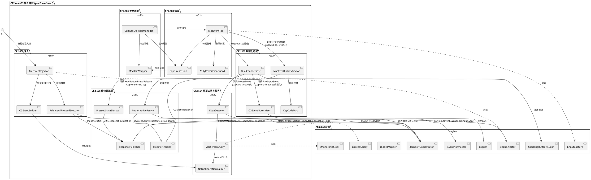
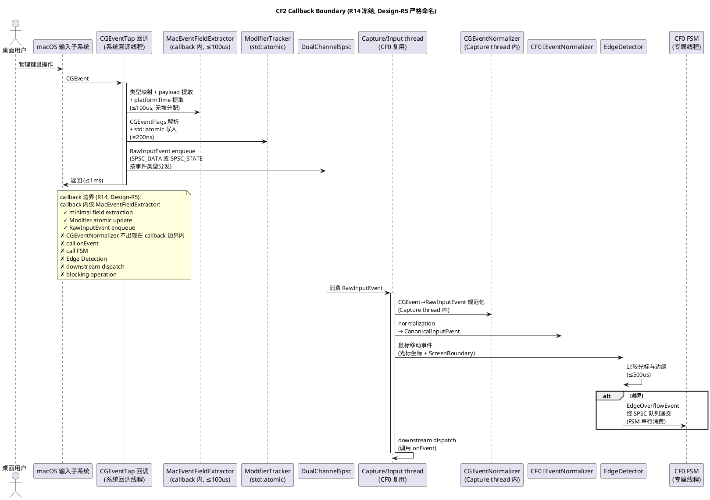
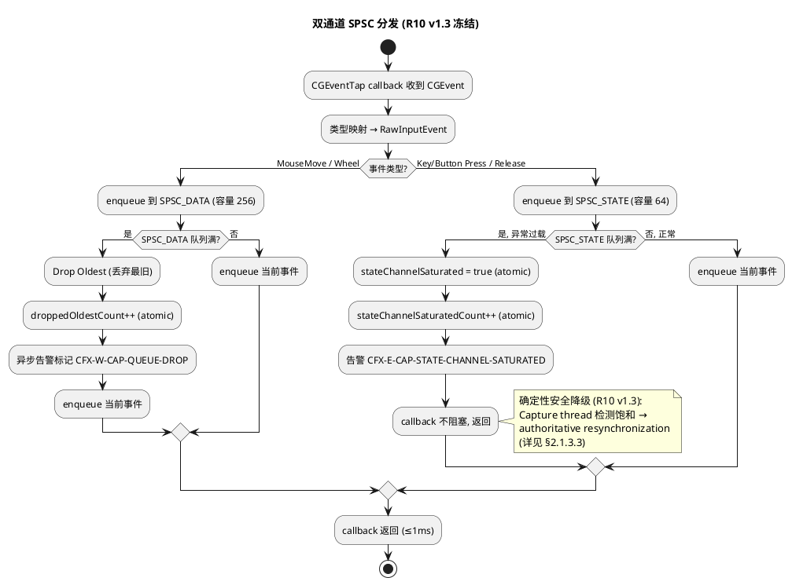
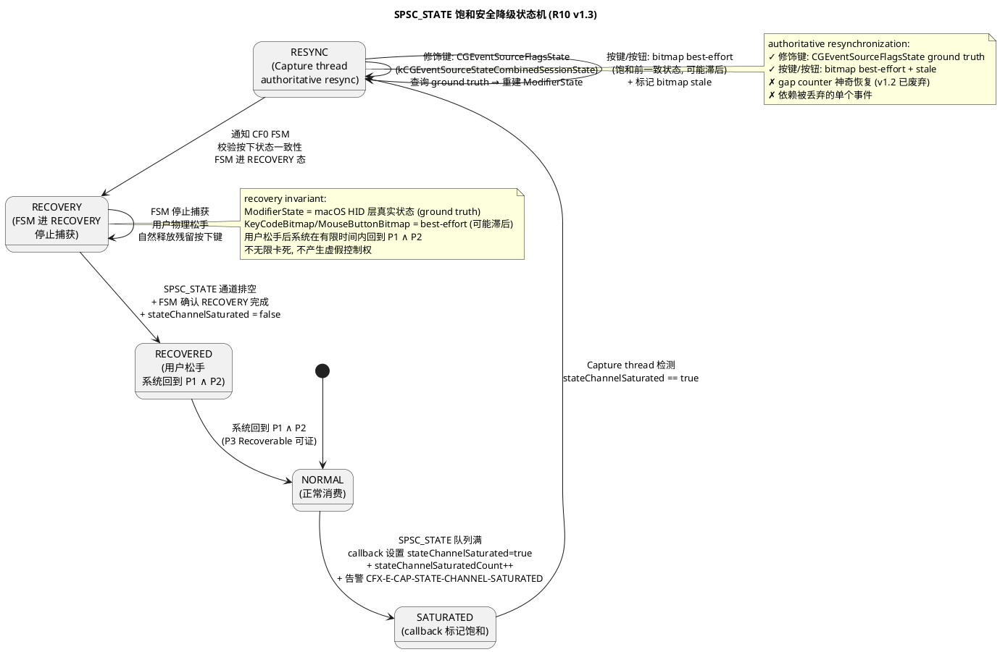
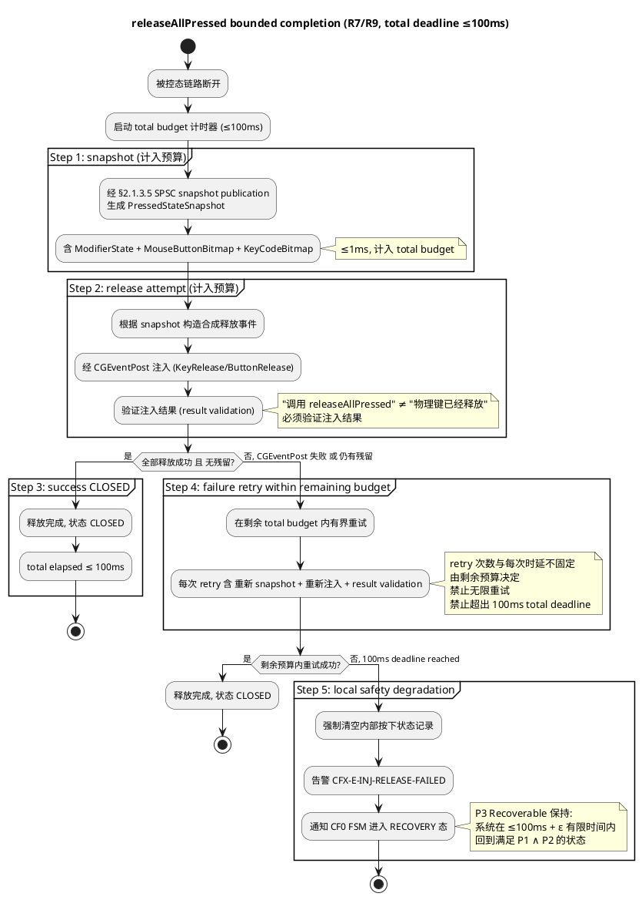
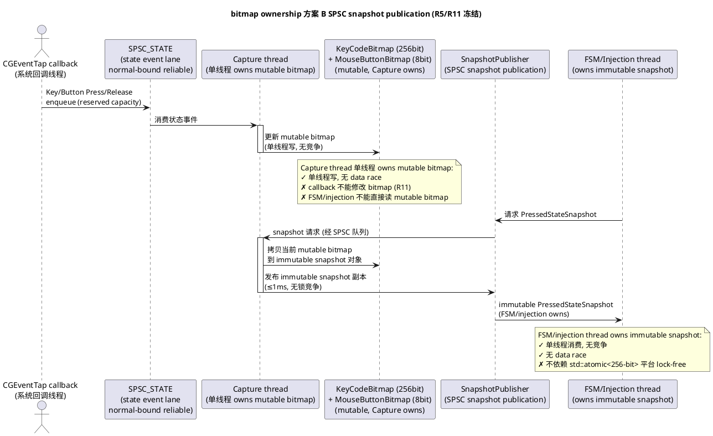
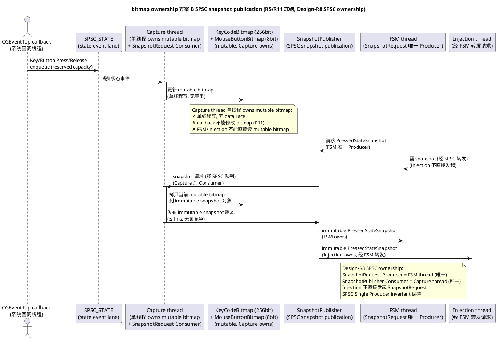

# CrossFlow-X · CF2 macOS 输入捕获实现方案设计文档

> **阶段标记**：CF2 — macOS Input Capture
> **对应需求规格**：`.codeartsdoer/specs/cf2_mac_capture/spec.md`（v1.4 Amendment，1144 行，六个 macOS 输入捕获地基 CF2-S01～CF2-S06 + 双通道 SPSC + authoritative resynchronization + bitmap ownership 方案 B + releaseAllPressed bounded completion ≤100ms + Callback Boundary 统一，已 FROZEN / PASS / AUTHORIZED commit 1ba1454）
> **CF0 冻结基线引用**：`.codeartsdoer/specs/cf0_arch_freeze/spec.md`（v2，892 行）+ `.codeartsdoer/specs/cf0_arch_freeze/design.md`（v3，3449 行），本设计严格遵循 CF0 冻结的全部架构基线（C++20 技术栈、Driverless User-Mode、Handoff 六态 FSM、7 核心契约、CF0 Architecture Safety Invariant P1/P2/P3、8 线程模型、双平面隔离、Coordinate Space RelativeDelta/AbsolutePosition 双语义、无锁 SPSC 队列 §2.7.3）。
> **CF1 冻结基线引用**：`.codeartsdoer/specs/cf1_endpoint_disc/spec.md`（v2，1432 行）+ `.codeartsdoer/specs/cf1_endpoint_disc/design.md`（v4，2972 行），本设计复用 CF1 冻结的 Node Identity（Stable NodeID 七要素）作为捕获事件源端标识，不修改身份与发现机制。
> **第一原则**：Driverless User-Mode Architecture —— macOS 输入捕获与注入必须完全在用户态完成，不引入内核扩展（kext）或驱动。
> **文档状态**：DRAFT v1.1（Amendment，受控修订）→ 待用户审查冻结（Evidence-First，先规格后实现；本设计仅覆盖 CF2-S01～S06 六个 macOS 输入捕获地基的增量设计方案 + 工程边界量化 + CF0 Safety Invariant 保障 + Verification Matrix 回映，不引入规格外能力，不修改 CF0/CF1 Frozen 文档，不进入 Task Design，不直接 Coding）
> **设计范围**：仅覆盖 CF2-S01～CF2-S06 六个 macOS 输入捕获地基的增量设计方案 + 大G项目经理特别要求的工程边界量化（SPSC_STATE=64 capacity / burst 上界 / consumer 最坏暂停窗口 / 异常过载判定阈值 / 饱和检测时序 / recovery 时序）+ CF0 Safety Invariant 保障 + Verification Matrix 回映。
> **执行纪律遵循**：严格遵守大G项目经理执行纪律（不修改 CF0/CF1 Frozen / 不重新设计 Handoff FSM / 不引入 Coordinator election / Raft / Paxos / 不改变 NodeID/Topology Authority 语义 / Input/Control 双平面隔离 / Evidence-First / Gate Review 后再编码）。

> **Amendment v1.1 变更记录（受控修订，不删除重写，不推倒 1442 行 v1 主体）**
> **修订背景**：大G 项目经理 Design Gate 审查裁决 = CONDITIONAL FAIL / REVISION REQUIRED，发现 10 项 Contract 层问题（4 BLOCKER + 6 P1）。v1 主体结构、六个模块、CF0-CF1 边界、Driverless 原则、安全目标、Requirements v1.4 FROZEN 内容全部保持不变。本次 Amendment 仅修复下列 10 项，不改变主体结构，不修改 CF0/CF1 Frozen 文档，不进入 Task Design，不直接 Coding。
> **修订项**：
> - **Design-R1 (🔴 BLOCKER)**：屏幕坐标类型与"x < 0"逻辑矛盾。修正：§2.2.2 EdgeDetector 接口 + §2.3.2 类图增加坐标域分层声明（macOS native 域 i64 / CF0 Logical Screen Space 域 u32 / EdgeOverflowEvent 域），统一 signed domain，消除 u32 永远不 < 0 的逻辑矛盾。
> - **Design-R2 (🔴 BLOCKER)**：B_burst 与 B_1s 数学推导不自洽（30+20+20=70 却得出 B_1s=60）。修正：§2.4.2 重新定义 B_burst / B_rate / W_pause 三个独立量，证明 backlog_max ≤ B_burst + B_rate × W_pause，消除 70→60 算术矛盾，SPSC_STATE=64 重新证明。
> - **Design-R3 (🔴 BLOCKER)**：W_worst=1.2ms 是假设非 Design Contract。修正：§2.4.3 分三层 W_design / W_observed / W_test，不得用 P99 证明 worst-case，删除 GC 引用（C++20/macOS 原生进程无 GC）。
> - **Design-R4 (🔴 BLOCKER)**：macOS API 10µs/100ns 等数字 overclaim。修正：§2.4 新增三类分层 HARD CONTRACT / DESIGN TARGET / MEASUREMENT REQUIREMENT，§2.4.5/§2.4.6 重新分类所有时序数字。
> - **Design-R5 (🟠 P1)**：R14 naming — callback extraction 与 CGEventNormalizer 未彻底分开。修正：§2.1.1/§2.1.2/§2.1.3.1 严格命名为 MacEventFieldExtractor（callback 内）与 CGEventNormalizer（Capture thread 内），CGEventNormalizer 不出现在 callback 边界。
> - **Design-R6 (🟠 P1)**：SPSC_STATE "可靠通道"语义需收紧。修正：§2.4.1 + §2.1.3.2 明确 Contract：STATE lane 在正常设计边界内禁止丢弃；容量耗尽时系统立即进入安全降级，不声称事件仍可靠到达。"reliable" 改为 "normal-bound reliable, saturation → safety degradation"。
> - **Design-R7 (🔴 BLOCKER)**：SPSC RingBuffer Drop Oldest 缺少并发证明。修正：§2.4.8 新增 Drop Oldest 并发 ownership 证明（Producer-only overwrite + memory-order proof），不破坏 SPSC ownership（head=Producer, tail=Consumer）。
> - **Design-R8 (🟠 P1)**：Snapshot Request 的 SPSC ownership 需明确。修正：§2.4.9 明确 SnapshotRequest Producer = 唯一线程/唯一逻辑 owner，SnapshotPublisher Consumer = Capture thread。FSM 与 Injection 不能同时为 producer。
> - **Design-R9 (🟠 P1)**：Recovery P3 证明 overclaim（T_user_release 不是系统可控 bounded upper bound）。修正：§2.4.6 + §2.5.3 拆成 System Safety Recovery（≤1.1ms 系统进入 RECOVERY，保证 P1∧P2）+ User-dependent convergence（T_user_release + bounded system drain，不宣称 deterministic bounded）。
> - **Design-R10 (🟠 P1)**：CF0 Frozen Boundary Amendment Contract 需明确。修正：§2.7 新增专门的 Frozen Boundary Amendment / Compatibility Contract，明确 CF0 Frozen behavior → CF2 additive interface extension → 不改变既有 Handoff FSM 状态机 → 不改变既有 CF0 contract。
> **未变更项（v1.1）**：六个模块（CF2-S01～S06）、CF0-CF1 边界、Driverless User-Mode Architecture、CF0 Safety Invariant（P1/P2/P3）、CF0 七契约、CF0 8 线程模型、CF1 Node Identity、第一原则落地路径、Requirements v1.4 FROZEN 全部内容、双通道架构（SPSC_DATA=256 / SPSC_STATE=64）、STATE saturation safety path、CGEventSourceFlagsState ground truth、bitmap ownership（方案 B SPSC snapshot publication）、RECOVERY、R9 ≤100ms total deadline、R11 ownership model、Callback Boundary（R14）全部保持不变。

---

# 一、需求与存量功能关系分析

## 1.1 需求功能与存量功能对比

### 1.1.1 已实现功能

CF0 冻结基线（spec.md v2 + design.md v3）已落地五个架构地基 CF0-S01～CF0-S05 + 7 核心契约 + Safety Invariant + 8 线程模型 + 无锁 SPSC 队列设计（§2.7.3）+ Coordinate Space 双语义（§2.10.0）。CF1 冻结基线已落地端点身份与发现五地基。下表对照 CF2 spec.md v1.4 需求与 CF0/CF1 冻结基线 + 当前仓库存量代码的匹配度。匹配度分四档：100%（完全匹配，直接复用）、75%（主体匹配，需小幅扩展）、50%（部分匹配，需改造）、25%（骨架存在，需大幅补全）、0%（完全未实现，需新增）。

| 需求功能（CF2 spec.md v1.4） | 存量功能（CF0/CF1 冻结基线 + 仓库代码） | 代码位置 | 匹配度 |
|---------|---------|---------|--------|
| C++20 编译基线（CF2 §4.5.1） | `CMAKE_CXX_STANDARD 20` 已落地 | `CMakeLists.txt:9` | 100% |
| CF0 `IInputCapture` 接口（CF2 §7.1） | `start(onEvent)/stop(handle)/queryScreenBoundary()` 完整定义 | `platform/common/platform_ports.hpp:68-74` | 75% |
| CF0 `IInputInjector` 接口（CF2 §7.1） | `inject/injectBatch/releaseAllPressed` 完整定义 | `platform/common/platform_ports.hpp:76-82` | 75% |
| CF0 `IMonotonicClock` 接口（CF2 §7.1） | `nowUs()` 完整定义 | `platform/common/platform_ports.hpp:84-88` | 100% |
| CF0 `IScreenQuery` 接口（CF2 §7.1） | `primaryBoundary()` 完整定义 | `platform/common/platform_ports.hpp:90-94` | 100% |
| `RawInputEvent` / `RawPayload` variant（CF2 §6.1） | `RawInputEvent{platformTime, kind, payload}` + `RawPayload` variant 完整定义 | `platform/common/platform_ports.hpp:11-44` | 100% |
| `CaptureHandle`（CF2 §6.2） | `CaptureHandle{id, active}` 完整定义 | `platform/common/platform_ports.hpp:46-49` | 100% |
| `InjectResult`（CF2 §6.3） | `InjectResult{ok, failedCount, latencyUs}` 完整定义 | `platform/common/platform_ports.hpp:51-55` | 100% |
| `ScreenBoundary`（CF2 §6.5，CF0 Frozen 左上角原点语义） | `ScreenBoundary{width, height, originX, originY}` + `isValid()` | `core/common/domain.hpp:135-144` | 100% |
| `ModifierState`（CF2 §5.5，std::atomic 无锁） | `ModifierState{shift, ctrl, alt, cmd, fn}` + `operator==` | `core/common/domain.hpp:151-162` | 75% |
| `MouseButton` / `KeyCode` / `WheelAxis` 枚举（CF2 §7.2） | `MouseButton{Left,Right,Middle}` + `KeyCode=u16` + `WheelAxis{Vertical,Horizontal}` | `core/common/domain.hpp:71-82` | 100% |
| `CanonicalInputEvent`（CF2 §7.2，被控态注入消费） | `CanonicalInputEvent{eventId, sourceNodeId, timestamp, eventType, payload, modifierState}` + `validate()` | `core/common/domain.hpp:184-193` | 100% |
| CF0 Coordinate Space RelativeDelta/AbsolutePosition 双语义（CF2 §5.3.1 规则 2） | CF0 design §2.10.0 已冻结 `RelativeDelta`/`AbsolutePosition` + 坐标语义决策表 + 平台差异隔离 | CF0 design.md §2.10.0 | 100% |
| CF0 无锁 SPSC 队列设计（CF2 §5.2.1 规则 11 双通道复用） | CF0 design §2.7.3 环形缓冲 + `std::atomic<size_t>` head/tail + 容量固定 256 + 满时丢弃/背压 | CF0 design.md §2.7.3 | 75% |
| CF0 8 线程模型（CF2 §5.6.1 规则 1 复用） | CF0 design §2.7 8 线程职责与所有权声明（Main/Capture/Injection/InputPlane/ControlPlane/FSM/Logger/Scheduler） | CF0 design.md §2.7 | 100% |
| CF0 捕获回调轻量化 ≤1ms（CF2 §4.1.1） | CF0 §4.6.4 + design §2.7.5 热路径禁锁清单 | CF0 design.md §2.7.5 | 100% |
| CF0 FSM 单线程所有权（CF2 §5.4.1 规则 7 越界事件经 SPSC 递交） | CF0 §4.6.2 + design §2.5.3 FSM 专属 jthread + SPSC 递交 | CF0 design.md §2.5.3 | 100% |
| CF0 契约① 规范化隔离（CF2 §5.2.1 规则 1） | CF0 design §2.9.1 契约① 保障 + 平台头文件隔离在 platform/mac/ | CF0 design.md §2.9.1 | 100% |
| CF0 契约⑤ Coordinate Space（CF2 §5.4.1 规则 8 不依赖画面） | CF0 design §2.9.5 契约⑤ 保障 + 禁画面依赖 | CF0 design.md §2.9.5 | 100% |
| CF0 契约⑦ Concurrency/Threading（CF2 §5.6） | CF0 design §2.9.7 契约⑦ 保障 + 8 线程 + 无锁热路径 | CF0 design.md §2.9.7 | 100% |
| CF0 Safety Invariant P1/P2/P3（CF2 §7.5） | CF0 design §2.17 P1 No Split-Brain / P2 No Void-Owner / P3 Recoverable | CF0 design.md §2.17 | 100% |
| CF1 Node Identity / Stable NodeID（CF2 §7.3 源端标识复用） | CF1 `NodeIdentity` 七要素 + `EndpointIdentity.nodeId` | `core/common/domain.hpp:322-334` | 100% |
| `IEventNormalizer` 接口（CF2 §7.3 RawInputEvent→CanonicalInputEvent） | `normalize/snapshotModifiers/alignModifiers` 完整定义 | `core/s01_event/i_event_normalizer.hpp:10-16` | 100% |
| `IHandoffOrchestrator` 接口（CF2 §7.3 越界事件供 FSM 消费） | `initiate/handleIncoming/handleResponse/onLinkDown` 完整定义 | `core/s03_handoff/i_handoff_orchestrator.hpp:8-15` | 75% |
| `ICoordMapper` 接口（CF2 §7.3 屏幕边界供坐标换算） | `mapOverflow/clamp` 完整定义 | `core/s04_coord/i_coord_mapper.hpp:8-13` | 100% |
| 结构化错误码体系（CF2 §4.4） | CF0 18 个 CFX-`<level>-<module>-<reason>` + `CfxError` | `core/common/error_code.hpp` | 75% |
| 结构化日志（CF2 §4.4.1） | CF0 JSON Lines Logger + `LogEntry` | `core/common/logger.hpp` | 75% |

**结论**：CF0/CF1 冻结基线已为 CF2 提供了"平台抽象接口骨架 + 领域模型 + 8 线程模型 + SPSC 队列设计 + Coordinate Space 双语义 + Safety Invariant + Node Identity"等完整基础设施。CF2 的增量集中在六个 macOS 输入捕获地基的**平台适配层实现**（`platform/mac/` 当前完全空，只有 `CMakeLists.txt`）与**双通道 SPSC + bitmap ownership + 工程边界量化**的设计落地：

1. **`platform/mac/` 适配层全部新建**（CGEventTap 捕获 / CGEvent 规范化 / CGEventPost 注入 / NSScreen 屏幕几何 / CGEventFlags 修饰键解析 / 辅助功能权限）；
2. **双通道 SPSC 队列新建**（SPSC_DATA=256 Drop Oldest + SPSC_STATE=64 reserved capacity + 确定性安全降级）；
3. **`PressedStateSnapshot` 扩展**（`std::vector` → fixed-size KeyCodeBitmap 256-bit + MouseButtonBitmap 8-bit + 方案 B SPSC snapshot publication）；
4. **`IHandoffOrchestrator` 扩展**（新增 `onEdgeOverflow()` 越界事件消费入口）；
5. **工程边界量化**（SPSC_STATE=64 capacity 论证 / burst 上界 / consumer 暂停窗口 / 饱和检测 / recovery 时序）。

### 1.1.2 需要扩展的功能

下表列出 CF0/CF1 已部分实现、需在现有基础上改造对齐 CF2 v1.4 的功能项。

| 需求功能 | 存量功能 | 差异说明 | 扩展方向 |
|---------|---------|---------|---------|
| `PressedStateSnapshot` fixed-size bitmap + 方案 B SPSC snapshot publication（CF2 §6.4 / R5/R11） | `PressedStateSnapshot{modifiers, std::vector<MouseButton>, std::vector<KeyCode>}` 动态 vector | 动态 vector 无法保证 snapshot 无 data race；R11 冻结方案 B SPSC snapshot publication，禁止 `std::atomic<Bitmap>` 整体原子化（256-bit atomic 不保证 lock-free） | `PressedStateSnapshot` 改为 `{modifiers, MouseButtonBitmap(8bit), KeyCodeBitmap(256bit), stale flag}`；bitmap 由 Capture thread 单线程 owns mutable，经 SPSC 发布 immutable 副本给 FSM/injection thread；`platform/common/platform_ports.hpp` 同步修改 |
| `IInputCapture.start(onEvent)` Callback Boundary（CF2 §7.1 / R1/R8/R14） | `start(std::function<void(const RawInputEvent&)> onEvent)` 回调签名 | 当前签名暗示 callback 直接调用 onEvent；R14 冻结 callback 仅 enqueue，onEvent 由 Capture/Input thread 触发 | `platform/mac/` 实现侧：callback 仅做 minimal extraction + Modifier atomic update + RawInputEvent enqueue 到双通道 SPSC；Capture/Input thread 消费后才调用 onEvent；接口签名不修改（CF0 Frozen），实现侧遵守 Callback Boundary |
| `IHandoffOrchestrator.onEdgeOverflow()` 越界事件消费入口（CF2 §7.3） | `IHandoffOrchestrator` 无 `onEdgeOverflow()` 方法 | CF2 产出的边缘越界事件需经 SPSC 队列递交 FSM 消费；当前接口无该入口 | `IHandoffOrchestrator` 新增 `virtual void onEdgeOverflow(const EdgeOverflowEvent& event) = 0`；FSM 专属线程串行消费，复用 CF0 §4.6.2 FSM 单线程所有权 |
| `ModifierState` std::atomic 无锁 + is_lock_free static_assert（CF2 §5.5.1 规则 3 / R3） | `ModifierState` 结构体已定义，但无 `std::atomic<ModifierState>` 存储 + static_assert | R3 分层：Architecture Requirement（is_lock_free static_assert，CF0 inherited Gate）+ Performance Evidence（P50 读 ≤100ns / 写 ≤200ns 测量型 DFX） | `platform/mac/` 实现侧：`std::atomic<ModifierState>` 存储 + 编译期 `static_assert(atomic.is_lock_free())`；CI benchmark 记录 P50/P95/P99 |
| CF0 SPSC 队列实现（CF2 §5.2.1 规则 11 双通道复用） | CF0 design §2.7.3 已设计 SPSC 环形缓冲 + `std::atomic<size_t>` head/tail，但仓库无实现代码 | CF0 design 已冻结 SPSC 设计，CF2 需在 `platform/mac/` 或 `core/common/` 落地双通道 SPSC 实现 | 新建 `SpscRingBuffer<T, Capacity>` 模板（环形缓冲 + atomic head/tail + 编译期固定容量 + Drop Oldest / reserved capacity 策略）；CF2 双通道 SPSC_DATA=256 + SPSC_STATE=64 复用此模板 |
| 线程 std::thread → std::jthread 升级（CF2 §5.6.1 规则 1） | `logger.hpp:81` + `mdns_announcer.hpp:61` 仍用 `std::thread` | CF0 §4.6.1 要求长生命周期线程用 `std::jthread`；当前存量代码未完全升级 | CF2 不直接修改 logger/mdns（归属 CF0/CF1 Frozen 边界），但 CF2 新增的 Capture/Input thread 复用必须用 `std::jthread`；logger/mdns 升级归属后续技术债 |
| 错误码扩展（CF2 新增告警） | CF0 18 个错误码 | CF2 新增 `CFX-W-CAP-A11Y-DENIED` / `CFX-E-CAP-TAP-FAIL` / `CFX-W-CAP-UNKNOWN-KEYCODE` / `CFX-W-CAP-QUEUE-DROP` / `CFX-E-CAP-STATE-CHANNEL-SATURATED` / `CFX-E-INJ-UNAUTHORIZED-SOURCE` / `CFX-W-INJ-FAIL-STREAK` / `CFX-W-INJ-INVALID-PARAM` / `CFX-E-INJ-RELEASE-FAILED` / `CFX-W-INJ-RELEASE-INCOMPLETE` / `CFX-E-CAP-SCREEN-QUERY-FAIL` / `CFX-W-CAP-CALLBACK-SLOW` / `CFX-E-CAP-THREAD-FAIL` / `CFX-W-CAP-UNKNOWN-EVENT-TYPE` | `core/common/error_code.hpp` 扩展枚举 + 解析函数；保持 CFX-`<level>-<module>-<reason>` 格式 |

### 1.1.3 需要新增的功能或接口

以下按 CF2 六大模块分组，列出 CF2 v1.4 需从零新增的全部功能点。每个功能点标注输入、输出、核心逻辑及依赖。

#### 模块 CF2-S01：macOS 用户态输入捕获（CGEventTap）

| 编号 | 功能点 | 输入 | 输出 | 核心逻辑 | 依赖 |
|-----|--------|-----|-----|---------|------|
| S01-01 | CGEventTap 安装与回调注册 | 捕获启停指令 + 辅助功能权限状态 | `CaptureHandle` | 经 `CGEventTapCreate(kCGSessionEventTap, kCGHeadInsertEventTap, kCGEventTapOptionListenOnly, mask, callback, ctx)` 安装用户态 tap；权限前置检测 `AXIsProcessTrustedWithOptions` / `CGPreflightSessionEventAccess`；失败降级 | CF0 `IInputCapture` |
| S01-02 | CGEventTap 回调最小字段提取 | CGEvent + 回调上下文 | RawInputEvent（inline variant，无堆分配） | 回调内仅做类型映射 + payload 提取 + platformTime 提取 + Modifier atomic update + RawInputEvent enqueue 到双通道 SPSC；≤1ms 返回；禁止 onEvent/FSM/Edge Detection/downstream dispatch | S01-01, CF2-S02 |
| S01-03 | 辅助功能权限检测与引导 | macOS 权限系统状态 | 权限授权/拒绝 | `AXIsProcessTrustedWithOptions` 检测 Accessibility + `CGPreflightSessionEventAccess` 检测 Input Monitoring；缺失时告警 `CFX-W-CAP-A11Y-DENIED` + 引导授权；权限恢复自动重试 | S01-01 |
| S01-04 | CGEventTap 失败降级 | tap 创建失败/回调异常/系统禁用 | 降级态 + 告警 | ≤200ms 内检测 + 进入降级态 + 告警 `CFX-E-CAP-TAP-FAIL`；降级态下本端物理键鼠仍作用于本机（P2 No Void-Owner 保持） | S01-01 |
| S01-05 | 捕获句柄生命周期管理 | start()/stop() 指令 | `CaptureHandle` 状态变更 | `start()` 返回 `CaptureHandle{id>0, active=true}`；`stop(handle)` 释放 tap 资源 + `handle.active=false`；RAII 管理；进程终止 ≤200ms 释放 | S01-01, CF2-S06 |
| S01-06 | 捕获启停 ≤50ms | CF0 FSM 启停指令 | CGEventTap active/inactive | 主控态启用捕获，被控态暂停或透传；≤50ms 内完成启停 | S01-01, CF2-S06 |

#### 模块 CF2-S02：CGEvent 规范化适配（双通道 SPSC）

| 编号 | 功能点 | 输入 | 输出 | 核心逻辑 | 依赖 |
|-----|--------|-----|-----|---------|------|
| S02-01 | CGEvent 类型映射 | CGEventType | RawEventKind | kCGEventMouseMoved→MouseMove / *MouseDown→MouseButtonPress / *MouseUp→MouseButtonRelease / kCGEventScrollWheel→Wheel / kCGEventKeyDown→KeyPress / kCGEventKeyUp→KeyRelease；未知类型告警 `CFX-W-CAP-UNKNOWN-EVENT-TYPE` 丢弃 | S01-02 |
| S02-02 | 鼠标增量提取 | CGEvent (MouseMove) | `RawMouseMovePayload{deltaX, deltaY}` | `CGEventGetDoubleValueField(event, kCGMouseEventDeltaX/Y)` 提取有符号增量 | S01-02 |
| S02-03 | 滚轮增量提取 | CGEvent (ScrollWheel) | `RawWheelPayload{delta, axis}` | `CGEventGetDoubleValueField(event, kCGScrollEventDeltaAxis1/2)` + 轴判定 | S01-02 |
| S02-04 | 键码映射 | macOS 虚拟键码 (kVK_*) | `KeyCode` (u16) | 映射表覆盖字母/数字/功能/方向/修饰键；未映射告警 `CFX-W-CAP-UNKNOWN-KEYCODE` 丢弃 | S01-02 |
| S02-05 | 鼠标按钮映射 | kCGMouseButton | `MouseButton` | Left/Right/Middle/Other 映射 | S01-02 |
| S02-06 | platformTime 提取 | CGEventTimestamp | `u64 platformTime` | `CGEventGetTimestamp(event)` 提取 mach absolute time | S01-02 |
| S02-07 | 双通道 SPSC 队列实现 | RawInputEvent | enqueue 到 SPSC_DATA / SPSC_STATE | 新建 `SpscRingBuffer<T, Capacity>` 模板（环形缓冲 + `std::atomic<size_t>` head/tail + 编译期固定容量）；SPSC_DATA=256（MouseMove/Wheel, Drop Oldest）+ SPSC_STATE=64（Key/Button Press/Release, reserved capacity）；callback 为唯一生产者，Capture/Input thread 为唯一消费者；不新增线程 | CF0 design §2.7.3 |
| S02-08 | SPSC_DATA Drop Oldest 策略 | SPSC_DATA 队列满 + MouseMove/Wheel 事件 | 丢弃最旧 + enqueue 当前 | 丢弃队列中最旧事件腾出槽位 + `droppedOldestCount++` + 异步告警标记 `CFX-W-CAP-QUEUE-DROP`；callback 不阻塞，保最新 | S02-07 |
| S02-09 | SPSC_STATE reserved capacity + 确定性安全降级 | SPSC_STATE 队列满 + Key/Button Press/Release 事件 | `stateChannelSaturated=true` + 告警 + authoritative resynchronization | 队列满时 callback 不阻塞：设置 `stateChannelSaturated` (atomic) + `stateChannelSaturatedCount++` + 告警 `CFX-E-CAP-STATE-CHANNEL-SATURATED`；Capture thread 检测饱和 → authoritative resynchronization（修饰键: `CGEventSourceFlagsState(kCGEventSourceStateCombinedSessionState)` ground truth + 按键/按钮: bitmap best-effort + stale 标记 + FSM 进 RECOVERY）；不依赖 gap counter 神奇恢复 | S02-07, CF2-S05, CF0 FSM |
| S02-10 | PressedState authoritative source 链路 | CGEvent callback → SPSC_STATE → Capture thread → mutable bitmap → SPSC snapshot → FSM/Injection | 权威状态链路完整 | 只有 Capture thread 的 bitmap 是 PressedState 权威状态；SPSC_STATE 是状态事件到达 Capture thread 的可靠通道；饱和时 resynchronization source = CGEventSourceFlagsState ground truth + bitmap best-effort + RECOVERY | S02-09, CF2-S05 |

#### 模块 CF2-S03：macOS 用户态输入注入（CGEventPost）

| 编号 | 功能点 | 输入 | 输出 | 核心逻辑 | 依赖 |
|-----|--------|-----|-----|---------|------|
| S03-01 | CGEventPost 用户态注入 | `CanonicalInputEvent` | `InjectResult` | 被控态下构造 CGEvent + `CGEventPost(kCGHIDEventTap, event)`；≤5ms 单帧 / ≤10ms 批量；禁止 kext/驱动 | CF0 `IInputInjector` |
| S03-02 | 鼠标移动 RelativeDelta 注入 | `CanonicalInputEvent` (MouseMotionPayload=RelativeDelta) | CGEvent + CGEventPost | 方式 A：`CGEventSetDoubleValueField(event, kCGMouseEventDeltaX/Y, delta)` + `CGEventPost`；或方式 B：查询当前 cursor location + delta 换算目标 location + `CGEventCreateMouseEvent(NULL, kCGEventMouseMoved, target, 0)` + `CGEventPost`；禁止 `CGEventCreateMouseEvent(deltaX, deltaY)` 误用 | S03-01, CF0 §2.10.0 |
| S03-03 | ACTIVE 进入一次性 AbsolutePosition 定位 | `CanonicalInputEvent` (MouseMotionPayload=AbsolutePosition) | CGEvent + CGEventPost | `CGEventCreateMouseEvent(NULL, kCGEventMouseMoved, CGPointMake(entry.x, entry.y), 0)` + `CGEventPost`；定位完成后后续切换回 RelativeDelta | S03-01, CF0 §2.10.0 |
| S03-04 | 鼠标按钮/滚轮/按键注入 | `CanonicalInputEvent` (Button/Wheel/Key) | CGEvent + CGEventPost | `CGEventCreateMouseEvent` with *MouseDown/Up + `CGEventCreateScrollWheelEvent` + `CGEventCreateKeyboardEvent(keyCode, keyDown)` + `CGEventPost` | S03-01 |
| S03-05 | 注入仅接受主控端流 | `CanonicalInputEvent.sourceNodeId` | 接受/拒绝 | `sourceNodeId == 当前主控端 NodeID` 校验；非主控端拒绝 + 告警 `CFX-E-INJ-UNAUTHORIZED-SOURCE` | S03-01, CF1 NodeIdentity |
| S03-06 | 修饰键显式同步 | 源端 ModifierState 快照 | 对齐后本端 ModifierState | Handoff 完成后目标端显式构造并注入修饰键按下/释放事件，对齐本端 ModifierState | S03-01, CF2-S05 |
| S03-07 | 断线强制释放 bounded completion ≤100ms | 链路断开事件 + PressedStateSnapshot | 释放完成 CLOSED / local safety degradation | Step 1 snapshot（≤1ms，计入 total budget）→ Step 2 release attempt（CGEventPost 合成释放事件，计入 budget）→ Step 3 success CLOSED → Step 4 failure retry within remaining budget（不固定次数×时延，由剩余预算决定）→ Step 5 deadline reached → local safety degradation（强制清空内部按下状态 + 告警 `CFX-E-INJ-RELEASE-FAILED` + 通知 FSM 进 RECOVERY）；total deadline ≤100ms，保证 P3 Recoverable | S03-04, CF2-S05, CF0 FSM |
| S03-08 | 注入失败处理 | CGEventPost 失败 | failedCount++ / 告警 / 通知 FSM | 单帧失败不中断；连续失败超阈值（默认 10 帧）告警 `CFX-W-INJ-FAIL-STREAK` + 通知 FSM | S03-01 |
| S03-09 | CGEvent 构造参数校验 | CanonicalInputEvent 字段 | 合法/非法 | 坐标范围/键码范围/按钮范围校验；非法参数丢弃 + 告警 `CFX-W-INJ-INVALID-PARAM` | S03-01 |

#### 模块 CF2-S04：屏幕边界查询与边缘越界检测

| 编号 | 功能点 | 输入 | 输出 | 核心逻辑 | 依赖 |
|-----|--------|-----|-----|---------|------|
| S04-01 | NSScreen/CGDisplay 用户态屏幕查询 | 查询请求 | `ScreenBoundary` | `NSScreen.mainScreen.frame` / `CGDisplayPixelsWide/High` 查询主显示器几何；≤10ms；缓存 | CF0 `IScreenQuery` |
| S04-02 | macOS native 坐标归一化 | NSScreen/CGDisplay native geometry | CF0 Frozen ScreenBoundary (origin=(0,0) 左上角) | NSScreen 左下角原点 / CGDisplay 左上角原点 / 多显示器排列负坐标 → platform/mac/ 适配层归一化为 CF0 左上角 (0,0) 语义；Core 层不感知 native 差异 | S04-01, CF0 §2.10.0 |
| S04-03 | 多显示器合并声明 | 多显示器探测结果 | 单一逻辑边界 / 拒绝 | 第一版按单一逻辑屏处理；合并取包围盒或声明不支持；未声明合并策略拒绝加入拓扑 | S04-01 |
| S04-04 | 分辨率变更适应 ≤1s | 分辨率/显示器变更事件 | ScreenBoundary 更新 + 通知 CF0 | ≤1s 内重新查询 + 更新缓存 + 通知 CF0 Coordinate Engine；进行中 Handoff 用新边界 | S04-01, CF0 `ICoordMapper` |
| S04-05 | 边缘越界检测（Capture/Input thread，≤500us） | 鼠标移动事件光标坐标 + ScreenBoundary | EdgeOverflowEvent / 无越界 | Capture/Input thread 消费 RawInputEvent 后比较光标坐标与屏幕逻辑边缘；x<0 左越界 / x>width 右越界 / y 不触发；≤500us；不在 CGEventTap 回调内完成 | S02-07, CF0 FSM |
| S04-06 | 越界事件经 SPSC 队列递交 FSM | EdgeOverflowEvent | FSM 串行消费 | 越界事件含 direction(Left/Right) + overflow + cursorY；经无锁 SPSC 队列递交 CF0 Handoff FSM；FSM 专属线程串行消费；CF2 不跨线程直接调用 FSM | S04-05, CF0 §4.6.2 |

#### 模块 CF2-S05：修饰键状态追踪

| 编号 | 功能点 | 输入 | 输出 | 核心逻辑 | 依赖 |
|-----|--------|-----|-----|---------|------|
| S05-01 | CGEventFlags 解析 | CGEventFlags 位图 | `ModifierState` | kCGEventFlagMaskShift→Shift / kCGEventFlagMaskControl→Control / kCGEventFlagMaskOption→Option / kCGEventFlagMaskCommand→Command；≤100us；回调内完成 | S01-02 |
| S05-02 | std::atomic<ModifierState> 无锁存储 | ModifierState 写入/读取 | 无锁并发读写 | `std::atomic<ModifierState>` 存储 + 编译期 `static_assert(is_lock_free())`（CF0 inherited Gate）；捕获回调线程写，FSM/注入线程读；禁止 std::mutex | S05-01, CF0 §8.2.8 |
| S05-03 | KeyCodeBitmap (256-bit) fixed-size 位图 | Key Press/Release 事件 | mutable bitmap（Capture thread owns） | 固定 256-bit 位图（对应 macOS 虚拟键码 0-255，编译期确定）；Capture thread 单线程 owns mutable bitmap（单线程写，无竞争）；禁止 std::vector<KeyCode> / std::atomic<Bitmap> 整体原子化 | S02-10 |
| S05-04 | MouseButtonBitmap (8-bit) fixed-size 位图 | Button Press/Release 事件 | mutable bitmap（Capture thread owns） | 固定 8-bit 位图（对应 MouseButton 枚举基数 ≤8，编译期确定）；Capture thread 单线程 owns mutable bitmap；禁止 std::vector<MouseButton> / std::atomic<Bitmap> | S02-10 |
| S05-05 | SPSC snapshot publication（方案 B 唯一冻结） | snapshot 请求 | immutable PressedStateSnapshot 副本 | Capture thread 拷贝当前 mutable bitmap 到 immutable snapshot 对象 → 经无锁 SPSC 队列发布 → FSM/injection thread owns immutable snapshot（单线程消费，无竞争）；≤1ms 生成延迟；无锁竞争，无 data race，不依赖 std::atomic<256-bit> 平台 lock-free 保证 | S05-03, S05-04, CF0 §4.6.2 |
| S05-06 | authoritative resynchronization 修饰键 ground truth | `stateChannelSaturated == true` | ModifierState = CGEventSourceFlagsState ground truth | Capture thread 检测饱和 → `CGEventSourceFlagsState(kCGEventSourceStateCombinedSessionState)` 查询当前真实修饰键状态（macOS Core Graphics 用户态 API，ground truth）→ 重建 ModifierState | S02-09, S05-01 |

#### 模块 CF2-S06：捕获线程与生命周期管理

| 编号 | 功能点 | 输入 | 输出 | 核心逻辑 | 依赖 |
|-----|--------|-----|-----|---------|------|
| S06-01 | Capture/Input thread 复用 CF0 8 线程模型 | CF0 线程模型 | 复用 Capture + Injection 线程 | CF2 不新增线程；复用 CF0 design §2.7 的 Capture (std::jthread #2) + Injection (std::jthread #3)；CGEventTap 回调运行在 macOS 系统回调线程（不计入 8 线程预算，受 ≤1ms 约束） | CF0 §2.7 |
| S06-02 | 捕获与注入路径隔离 | 捕获/注入线程 | 独立线程 + 无共享可变状态 | CGEventTap 捕获路径与 CGEventPost 注入路径运行在相互独立线程；跨路径交换经无锁 SPSC 队列或 std::atomic | S06-01, CF0 §4.6.3 |
| S06-03 | 捕获回调不阻塞 | CGEventTap 回调 | ≤1ms 返回 | 回调内禁磁盘 I/O / 网络等待 / 锁竞争 / sleep / 同步日志 / 跨平面调用；仅 minimal extraction + Modifier atomic update + RawInputEvent enqueue | S01-02, CF0 §4.6.4 |
| S06-04 | 热路径无锁优先 | 热路径共享状态 | std::atomic / 无锁数据结构 | ModifierState / 按下状态 bitmap / 捕获句柄 active 标志均用 std::atomic 或无锁；禁止热路径 std::mutex | S05-02, CF0 §4.6.5 |
| S06-05 | RAII 资源管理 | CF2 全部资源（CGEventTap/CGEvent/屏幕边界缓存） | RAII 构造/析构 | 禁止裸 new/delete；CGEventTap 句柄用 RAII wrapper 管理 | S01-05, CF0 §8.3.4 |
| S06-06 | 终止清理 ≤200ms | 进程终止信号 | 所有 tap 释放 + 线程退出 | 进程终止时所有 tap 在 ≤200ms 内释放；`std::jthread::request_stop()` + 析构自动 join | S06-01, CF0 §4.6.9 |

## 1.2 存量功能详细分析

本节深入分析 CF2 直接复用或扩展的 CF0/CF1 存量功能，识别其接口契约、业务规则、扩展点与约束。

### 1.2.1 CF0 平台抽象接口（`platform/common/platform_ports.hpp`）

**接口契约**：
- `IInputCapture.start(onEvent)` → 返回 `CaptureHandle`；`onEvent` 为 `std::function<void(const RawInputEvent&)>` 回调。
- `IInputCapture.stop(handle)` → 释放 tap 资源；void 返回。
- `IInputCapture.queryScreenBoundary()` → 返回 `ScreenBoundary`。
- `IInputInjector.inject(event)` → 返回 `InjectResult{ok, failedCount, latencyUs}`。
- `IInputInjector.injectBatch(events)` → 批量注入，`std::vector<CanonicalInputEvent>` 入参（注：CF0 design §2.8 建议改 `std::span`，但当前接口仍为 vector）。
- `IInputInjector.releaseAllPressed(pressed)` → 返回 `ReleaseResult{releasedCount, latencyMs}`。
- `IMonotonicClock.nowUs()` → 返回 `u64` 微秒单调时间戳。
- `IScreenQuery.primaryBoundary()` → 返回 `ScreenBoundary`。

**业务规则**：
- 接口签名为 CF0 Frozen，CF2 不得修改（CF2 §4.5.3 接口契约不修改）。
- `PressedStateSnapshot` 当前用 `std::vector<MouseButton>` + `std::vector<KeyCode>`，与 R5/R11 冻结的 fixed-size bitmap + 方案 B SPSC snapshot publication 冲突，需扩展（详见 §1.1.2）。

**扩展点**：
- `PressedStateSnapshot` 结构体扩展（vector → bitmap + stale flag）。
- `IInputCapture.start(onEvent)` 实现侧遵守 Callback Boundary（接口签名不变，实现侧 callback 仅 enqueue）。

**约束**：
- 接口签名 C++20 化（CF0 design §2.8 建议 `std::span` / `std::expected` / concepts，但当前接口未完全对齐，CF2 不修改接口签名）。
- 平台头文件隔离（契约①）：`platform/common/` 不得包含 macOS 平台头文件，平台逻辑在 `platform/mac/` 消化。

### 1.2.2 CF0 领域模型（`core/common/domain.hpp`）

**接口契约**：
- `ScreenBoundary{width, height, originX, originY}` + `isValid()`：CF0 Frozen 左上角 (0,0) 原点语义。
- `ModifierState{shift, ctrl, alt, cmd, fn}` + `operator==`：5 bit 小位图，适合 std::atomic。
- `MouseButton{Left, Right, Middle}`（u8 枚举，基数 3 ≤ 8）。
- `KeyCode = u16`（范围 0-65535，macOS 虚拟键码 0-255 子集）。
- `CanonicalInputEvent{eventId, sourceNodeId, timestamp, eventType, payload, modifierState}` + `validate()`。
- CF0 design §2.10.0 已冻结 `RelativeDelta{deltaX, deltaY}` + `AbsolutePosition{x, y, space}` 双语义（注：当前 `domain.hpp` 的 `MouseMovePayload` 仍为 `{deltaX, deltaY}`，未显式用 variant<RelativeDelta, AbsolutePosition>，CF2 实现侧需对齐 CF0 design §2.10.0 双语义）。

**业务规则**：
- 领域对象为 CF0 Frozen，CF2 直接复用，不扩展（CF2 §7.2 无扩展）。
- `ModifierState` 保持 std::atomic（R11 不变），`KeyCodeBitmap` / `MouseButtonBitmap` 用方案 B SPSC snapshot publication（R11 冻结）。

**约束**：
- C++20 设施：variant / enum class / chrono / atomic 已用；jthread / expected / span / concepts 部分未用（CF0 design §2.8 分级）。

### 1.2.3 CF0 无锁 SPSC 队列设计（CF0 design §2.7.3）

**接口契约**：
- 环形缓冲 + `std::atomic<size_t>` head/tail；单生产者单消费者；无锁无竞争。
- 容量固定（默认 256）；满时丢弃或背压。
- 用途：Capture→FSM、FSM→Injection、FSM→Input Plane、FSM→Control Plane、Input Plane→Injection、Control Plane→FSM。

**业务规则**：
- CF0 design 已冻结 SPSC 设计，但仓库无实现代码（grep 无结果）。
- CF2 双通道 SPSC（SPSC_DATA=256 + SPSC_STATE=64）复用此设计，新增 Drop Oldest / reserved capacity / 确定性安全降级策略。

**扩展点**：
- 新建 `SpscRingBuffer<T, Capacity>` 模板（编译期固定容量 + 原子 head/tail + 策略模板参数）。
- 双通道分发：callback 按事件类型分发到 SPSC_DATA / SPSC_STATE。

**约束**：
- 无锁无竞争（单生产者单消费者）；callback 为唯一生产者，Capture/Input thread 为唯一消费者；不新增线程（CF0 契约⑦ ≤8 线程）。
- 编译期固定容量，禁止动态扩容（R4）。
- 无堆分配（R4：RawInputEvent 为 inline variant，预分配固定大小）。

### 1.2.4 CF0 8 线程模型（CF0 design §2.7）

**接口契约**：
- 8 线程：Main / Capture / Injection / InputPlane / ControlPlane / FSM / Logger / Scheduler。
- 全部用 `std::jthread`；长生命周期线程显式声明职责与所有权。
- 线程数 ≤8（CF0 §4.6.8）。

**业务规则**：
- Capture Thread (#2)：平台输入捕获回调（≤1ms 返回）、轻量采集、异步派发；通信出：规范事件(SPSC→FSM)、日志(MPMC→Logger)。
- Injection Thread (#3)：消费 Input Plane 事件流、被控态注入本机；通信入：注入指令(SPSC←FSM)、Input 事件(SPSC←Input Plane)。
- CGEventTap 回调运行在 macOS 系统回调线程（不计入 8 线程预算，但受 ≤1ms 回调约束）。

**约束**：
- CF2 不新增线程（CF2 §5.6.1 规则 1）；复用 Capture + Injection 线程。
- 终止清理 ≤200ms（CF0 §4.6.9）：`std::jthread::request_stop()` + 析构自动 join。
- 捕获与注入路径隔离（CF0 §4.6.3）：独立线程，无共享可变状态，跨路径交换经无锁队列或 std::atomic。

### 1.2.5 CF0 Coordinate Space 双语义（CF0 design §2.10.0）

**接口契约**：
- `RelativeDelta{deltaX, deltaY}`：核心控制路径（鼠标移动转发）使用，不传绝对坐标。
- `AbsolutePosition{x, y, space}`：边缘 Handoff 路径使用，仅用于越界检测与入射定位。
- ACTIVE 进入时光标一次性定位用 AbsolutePosition，后续切换回 RelativeDelta。

**业务规则**：
- 平台差异隔离（契约①）：macOS `CGEventGetDoubleValueField(kCGMouseEventDeltaX/Y)` → RelativeDelta；`CGEventGetLocation` → AbsolutePosition。Core 层仅依赖平台无关语义。
- CF2-S03 注入侧：方式 A（delta 字段注入）或方式 B（location 换算注入）；禁止 `CGEventCreateMouseEvent(deltaX, deltaY)` 误用（R2）。

**约束**：
- CF0-COORD-001：核心控制路径用 RelativeDelta。
- CF0-COORD-002：边缘 Handoff 路径用 AbsolutePosition；ACTIVE 后切换回 RelativeDelta。
- CF0-COORD-005：Handoff 请求携带 entry_coord (AbsolutePosition)；ACTIVE 进入后切换回 RelativeDelta。

---

# 二、增量设计方案

## 2.1 实现模型

### 2.1.1 上下文视图

本视图展示 CF2 macOS 输入捕获模块与外部系统（macOS 输入子系统 / CF0 各模块 / CF1 Node Identity）的交互关系。

```plantuml
@startuml
skinparam rectangle {
    BackgroundColor<<cf2>> #E8F5E9
    BackgroundColor<<os>> #E3F2FD
    BackgroundColor<<cf0>> #F3E5F5
    BackgroundColor<<cf1>> #FFF3E0
}

rectangle "桌面用户" as User
rectangle "macOS 输入子系统\n(CGEventTap/CGEventPost)" <<os>> as MacIO
rectangle "macOS 显示子系统\n(NSScreen/CGDisplay)" <<os>> as MacDisp
rectangle "macOS 辅助功能权限\n(AXIsTrusted/CGPreflight)" <<os>> as A11y

rectangle "CF2 macOS 捕获\n(platform/mac/)" <<cf2>> as Cf2

rectangle "CGEventTap 回调\n(系统回调线程, ≤1ms)" <<cf2>> as Tap
rectangle "MacEventFieldExtractor\n(callback 内, ≤100us)" <<cf2>> as Extract
rectangle "双通道 SPSC\n(SPSC_DATA=256\nSPSC_STATE=64)" <<cf2>> as Spsc
rectangle "Capture/Input thread\n(CF0 复用, 后处理)" <<cf2>> as CapThread
rectangle "CGEventNormalizer\n(Capture thread 内)" <<cf2>> as Norm2
rectangle "KeyCodeBitmap(256bit)\nMouseButtonBitmap(8bit)\n(Capture thread owns)" <<cf2>> as Bitmap
rectangle "EdgeOverflowEvent\n(SPSC→FSM)" <<cf2>> as EdgeEvt

rectangle "CF0 IEventNormalizer (S01)" <<cf0>> as Norm
rectangle "CF0 Handoff FSM (S03)" <<cf0>> as Fsm
rectangle "CF0 ICoordMapper (S04)" <<cf0>> as Coord
rectangle "CF0 IInputPlaneChannel (S05)" <<cf0>> as Tx
rectangle "CF0 Logger Thread" <<cf0>> as Log
rectangle "CF1 NodeIdentity" <<cf1>> as Nid

User --> MacIO : 物理键鼠操作
User --> A11y : 授权辅助功能权限

MacIO --> Tap : CGEvent 流
Tap --> Extract : CGEvent 字段提取\n(类型映射 + payload + platformTime, ≤100us)
Extract --> Spsc : RawInputEvent enqueue\n(+ Modifier atomic, ≤1ms 总返回)
Spsc --> CapThread : 消费 RawInputEvent
CapThread --> Norm2 : CGEvent→RawInputEvent\n规范化（Capture thread 内）
CapThread --> Bitmap : 更新 mutable bitmap\n(状态事件, 单线程写)
CapThread --> EdgeEvt : 越界检测(≤500us)
CapThread --> Norm : normalization\n→ CanonicalInputEvent
Bitmap --> Fsm : SPSC snapshot publication\n(immutable 副本, ≤1ms)
EdgeEvt --> Fsm : 越界事件\n(FSM 串行消费)

Cf2 --> MacDisp : NSScreen/CGDisplay 查询
MacDisp --> Cf2 : ScreenBoundary\n(归一化为 CF0 左上角原点)
Cf2 --> A11y : 检测权限状态
A11y --> Cf2 : 权限授权/拒绝

Tx --> CapThread : 被控态注入事件流\n(CanonicalInputEvent)
CapThread --> MacIO : CGEventPost 注入(被控态, ≤5ms)
CapThread --> Log : 异步日志(不阻塞)
Nid --> Cf2 : 本端 NodeID(源端标识)
Fsm --> CapThread : 捕获启停指令(≤50ms)

note over Tap
  Callback Boundary (R14, Design-R5 严格命名):
  callback 内仅 MacEventFieldExtractor:
    ✓ minimal field extraction (类型映射 + payload + platformTime)
    ✓ Modifier atomic update
    ✓ RawInputEvent enqueue 到双通道 SPSC
  callback 边界外（Capture thread 内）:
    CGEventNormalizer (规范化下游派发)
    EdgeDetector / FSM / downstream dispatch
  ✗ CGEventNormalizer 不出现在 callback 边界内
  ✗ callback 不调用 onEvent/FSM/Edge Detection
end note
@enduml
```

**通信协议与调用频率**：
- macOS 输入子系统 → CGEventTap 回调：CGEvent 流，高频（鼠标移动可达 1000+ events/s），回调 ≤1ms 返回。
- CGEventTap 回调 → 双通道 SPSC：RawInputEvent enqueue，无锁原子写，无堆分配。
- 双通道 SPSC → Capture/Input thread：消费 RawInputEvent，normalization / edge detection / downstream dispatch。
- Capture/Input thread → CF0 FSM：越界事件经 SPSC 队列递交（低频，仅边缘越界时）；PressedStateSnapshot 经 SPSC snapshot publication（断线释放时）。
- CF0 Transport → Capture/Input thread：被控态注入事件流（CanonicalInputEvent，高频）。
- Capture/Input thread → macOS 输入子系统：CGEventPost 注入（被控态，≤5ms 单帧）。

### 2.1.2 服务/组件总体架构

本视图展示 CF2 模块内部的组成结构、核心类职责与模块间依赖关系。



**模块划分与职责**：
- **CF2-S01 捕获**：`MacEventTap`（CGEventTap 安装与回调）、`A11yPermissionGuard`（辅助功能权限检测与引导）、`CaptureSession`（句柄生命周期）。
- **CF2-S02 规范化适配**：`MacEventFieldExtractor`（callback 内最小字段提取，≤100us，无堆分配）、`CGEventNormalizer`（Capture thread 内 RawInputEvent→CanonicalInputEvent 规范化下游派发）、`KeyCodeMap`（macOS 虚拟键码→KeyCode 映射表）、`DualChannelSpsc`（双通道 SPSC 分发）。**Design-R5 严格命名**：`MacEventFieldExtractor` 仅出现在 callback 边界内；`CGEventNormalizer` 仅出现在 Capture thread 边界内，不跨越 callback 边界。
- **CF2-S03 注入**：`MacEventInjector`（CGEventPost 注入）、`CGEventBuilder`（CanonicalInputEvent→CGEvent 构造）、`ReleaseAllPressedExecutor`（断线释放 bounded completion）。
- **CF2-S04 屏幕边界与越界**：`MacScreenQuery`（NSScreen/CGDisplay 查询）、`NativeCoordNormalizer`（native 坐标归一化）、`EdgeDetector`（边缘越界检测）。
- **CF2-S05 修饰键追踪**：`ModifierTracker`（CGEventFlags 解析 + std::atomic 存储）、`PressedStateBitmap`（KeyCodeBitmap 256-bit + MouseButtonBitmap 8-bit）、`SnapshotPublisher`（方案 B SPSC snapshot publication）、`AuthoritativeResync`（饱和时 authoritative resynchronization）。
- **CF2-S06 生命周期**：`CaptureLifecycleManager`（启停 + 终止清理）、`MacRaiiWrapper`（CGEventTap/CGEvent RAII）。

**配置项及取值策略**：
- `SPSC_DATA_CAPACITY = 256`（编译期固定，复用 CF0 design §2.7.3 默认值）。
- `SPSC_STATE_CAPACITY = 64`（编译期固定，按 burst 上界 + 余量预留，详见 §2.4.1 量化论证）。
- `KEYCODE_BITMAP_WIDTH = 256`（编译期固定，对应 macOS 虚拟键码 0-255）。
- `MOUSE_BUTTON_BITMAP_WIDTH = 8`（编译期固定，对应 MouseButton 枚举基数 ≤8）。
- `CALLBACK_DEADLINE_US = 1000`（1ms，复用 CF0 §4.6.4）。
- `EDGE_DETECT_DEADLINE_US = 500`（500us，CF2 §4.1.5）。
- `RELEASE_TOTAL_DEADLINE_MS = 100`（100ms total budget，R9 bounded completion）。
- `INJECT_FAIL_STREAK_THRESHOLD = 10`（连续注入失败告警阈值）。

### 2.1.3 实现设计文档

本节描述 CF2 核心逻辑的设计，包括 Callback Boundary 时序、双通道 SPSC 流程、SPSC_STATE 饱和安全降级状态机、releaseAllPressed bounded completion 流程、bitmap ownership SPSC snapshot publication 流程。

#### 2.1.3.1 Callback Boundary 时序（R14 冻结）



**设计要点**：
- CGEventTap 回调运行在 macOS 系统回调线程（不计入 CF0 8 线程预算）。
- **Design-R5 严格命名**：callback 内仅 `MacEventFieldExtractor`（类型映射 + payload 提取 + platformTime 提取，≤100us，无堆分配）；`CGEventNormalizer` 仅在 Capture thread 内运行，不跨越 callback 边界，避免 Coding Agent 误把完整 Normalizer 放进 callback。
- 回调仅做三件事：`MacEventFieldExtractor` 字段提取（≤100us）+ Modifier atomic update（std::atomic 写入，≤200ns）+ RawInputEvent enqueue（双通道 SPSC 分发，无锁原子写）。
- 回调 ≤1ms 返回，不阻塞，无堆分配，不调用 onEvent/FSM/Edge Detection/downstream dispatch。
- Capture/Input thread（CF0 复用 #2 Capture 线程）消费 SPSC 队列后执行 `CGEventNormalizer` 规范化 → edge detection → downstream dispatch（调用 onEvent）。
- 越界事件经 SPSC 队列递交 CF0 FSM 专属线程串行消费（复用 CF0 §4.6.2 FSM 单线程所有权）。

#### 2.1.3.2 双通道 SPSC 分发流程



**设计要点**：
- 双通道分发依据事件类型：高频可重采样事件（MouseMove/Wheel）→ SPSC_DATA；状态变更事件（Key/Button Press/Release）→ SPSC_STATE。
- SPSC_DATA Drop Oldest：丢弃最旧保最新，复用 CF0 §4.2.3 Input Plane 最新优先语义。**Drop Oldest 并发 ownership 证明详见 §2.4.8（Design-R7）**。
- SPSC_STATE reserved capacity：正常设计条件下不满（详见 §2.4 量化论证）；满表示异常过载，执行确定性安全降级。**SPSC_STATE 语义：normal-bound reliable, saturation → safety degradation（Design-R6，详见 §2.4.1）**。
- callback 在任何情况下都不阻塞（保 R1/R4 回调轻量化）。

#### 2.1.3.3 SPSC_STATE 饱和安全降级状态机（R10 v1.3 冻结）



**设计要点**：
- 修饰键 resynchronization source = `CGEventSourceFlagsState(kCGEventSourceStateCombinedSessionState)`（macOS Core Graphics 用户态 API，ground truth，不违反 Driverless User-Mode Architecture）。
- 按键/按钮 resynchronization source = bitmap best-effort（饱和前最后一次成功消费的一致状态，由 R11 SPSC snapshot publication 保证无 data race，可能滞后但一致）+ stale 标记 + FSM 进 RECOVERY。
- 不依赖 gap counter 神奇恢复（v1.2 已废弃）：gap counter 不提供 state recovery，被丢弃的状态事件无法反映到 bitmap。
- 降级退出条件：Capture thread 完成 resynchronization + SPSC_STATE 通道排空 + FSM 确认 RECOVERY 完成，避免反复降级。

#### 2.1.3.4 releaseAllPressed bounded completion 流程（R7/R9 冻结）



**设计要点**：
- total deadline ≤100ms bounded completion budget：所有 snapshot / release attempt / retry / result validation / degradation notification 均计入同一预算。
- 不采用"次数 × 每次时延"乘积模型（R9 修订：最坏 4×30ms=120ms > 100ms 会破坏 P3 可证性）。
- retry 在剩余预算内进行，次数与时延不固定，由剩余预算决定。
- deadline reached → local safety degradation：强制清空内部按下状态 + 告警 + 通知 FSM 进 RECOVERY，保证 P3 Recoverable。

#### 2.1.3.5 bitmap ownership SPSC snapshot publication 流程（R5/R11 方案 B 冻结）



**设计要点**：
- **Capture thread 单线程 owns mutable KeyCodeBitmap / MouseButtonBitmap**（单线程写，无竞争）。
- **snapshot 请求经无锁 SPSC 队列递交**（FSM/injection thread → Capture thread）。**Design-R8 SPSC ownership**：SnapshotRequest Producer = FSM thread 唯一（Injection 经 FSM 转发），SnapshotPublisher Consumer = Capture thread 唯一。详见 §2.4.9。
- **Capture thread 发布 immutable snapshot 副本**（拷贝当前 bitmap 到 snapshot 对象，≤1ms）。
- **FSM/injection thread owns immutable snapshot**（单线程消费，无竞争）。
- **不依赖 std::atomic<256-bit> 平台 lock-free 保证**（256-bit atomic 在目标平台不一定 lock-free，方案 B 已冻结为唯一 model）。
- **ModifierState 保持 std::atomic<ModifierState>**（小位图 5 bit，CF0 已冻结 is_lock_free static_assert，不变）。
- **SPSC_STATE 语义**：normal-bound reliable, saturation → safety degradation（Design-R6，详见 §2.4.1）。

## 2.2 接口设计

### 2.2.1 总体设计

CF2 接口分三类：(1) CF0 平台抽象接口的 macOS 实现（不修改签名）；(2) CF2 内部组件接口（platform/mac/ 内部）；(3) CF2 新增的 CF0/CF1 接口扩展（最小化，仅 `IHandoffOrchestrator.onEdgeOverflow()`）。

| 接口分类 | 接口名 | 来源 | 稳定性 | 说明 |
|---------|--------|------|--------|------|
| CF0 平台抽象实现 | `MacEventTap : IInputCapture` | CF0 Frozen | 稳定 | CGEventTap 捕获，不修改接口签名 |
| CF0 平台抽象实现 | `MacEventInjector : IInputInjector` | CF0 Frozen | 稳定 | CGEventPost 注入，不修改接口签名 |
| CF0 平台抽象实现 | `MacScreenQuery : IScreenQuery` | CF0 Frozen | 稳定 | NSScreen/CGDisplay 查询 |
| CF0 平台抽象实现 | `MacMonotonicClock : IMonotonicClock` | CF0 Frozen | 稳定 | mach absolute time → 微秒 |
| CF0 接口扩展 | `IHandoffOrchestrator.onEdgeOverflow()` | CF2 新增 | 稳定 | 越界事件消费入口（FSM 串行消费） |
| CF2 内部组件 | `MacEventFieldExtractor` | CF2 新增 | 稳定 | callback 内最小字段提取（≤100us，无堆分配，Design-R5 严格命名） |
| CF2 内部组件 | `DualChannelSpsc` | CF2 新增 | 稳定 | 双通道 SPSC 分发 |
| CF2 内部组件 | `SpscRingBuffer<T, Capacity>` | CF2 新增 | 稳定 | 无锁 SPSC 环形缓冲模板 |
| CF2 内部组件 | `CGEventNormalizer` | CF2 新增 | 稳定 | Capture thread 内 RawInputEvent→CanonicalInputEvent 规范化（Design-R5：不出现在 callback 边界） |
| CF2 内部组件 | `ModifierTracker` | CF2 新增 | 稳定 | CGEventFlags 解析 + std::atomic 存储 |
| CF2 内部组件 | `PressedStateBitmap` | CF2 新增 | 稳定 | KeyCodeBitmap 256-bit + MouseButtonBitmap 8-bit |
| CF2 内部组件 | `SnapshotPublisher` | CF2 新增 | 稳定 | 方案 B SPSC snapshot publication |
| CF2 内部组件 | `AuthoritativeResync` | CF2 新增 | 稳定 | 饱和时 authoritative resynchronization |
| CF2 内部组件 | `EdgeDetector` | CF2 新增 | 稳定 | 边缘越界检测（Capture/Input thread） |
| CF2 内部组件 | `NativeCoordNormalizer` | CF2 新增 | 稳定 | macOS native 坐标归一化 |
| CF2 内部组件 | `A11yPermissionGuard` | CF2 新增 | 稳定 | 辅助功能权限检测与引导 |
| CF2 内部组件 | `ReleaseAllPressedExecutor` | CF2 新增 | 稳定 | 断线释放 bounded completion ≤100ms |
| CF2 内部组件 | `CaptureLifecycleManager` | CF2 新增 | 稳定 | 启停 + 终止清理 |
| CF2 内部组件 | `MacRaiiWrapper` | CF2 新增 | 稳定 | CGEventTap/CGEvent RAII |

**接口变更策略**：
- CF0 平台抽象接口签名**不修改**（CF2 §4.5.3 接口契约不修改）；CF2 仅在 `platform/mac/` 实现侧遵守 Callback Boundary。
- `IHandoffOrchestrator` 新增 `onEdgeOverflow()` 方法（最小化扩展，FSM 串行消费越界事件）。
- `PressedStateSnapshot` 结构体扩展（vector → bitmap + stale flag），属 `platform/common/` 改动，需与 CF0 Frozen 边界协调（注：CF0 design §2.2.2.3 已预留 PressedStateSnapshot 扩展空间，CF2 扩展不破坏 CF0 契约）。

### 2.2.2 接口清单

#### CF0 平台抽象接口 macOS 实现

**`MacEventTap : IInputCapture`**（CF2-S01）

```cpp
// CF0 Frozen 接口签名（不修改），platform/mac/ 实现侧遵守 Callback Boundary
class MacEventTap : public IInputCapture {
public:
    CaptureHandle start(std::function<void(const RawInputEvent&)> onEvent) override;
    void stop(CaptureHandle handle) override;
    ScreenBoundary queryScreenBoundary() override;
};
```

- **业务说明**：经 CGEventTap 安装用户态事件 tap；callback 仅做 minimal extraction + Modifier atomic update + RawInputEvent enqueue 到双通道 SPSC（不调用 onEvent）；Capture/Input thread 消费 SPSC 后才调用 onEvent。
- **前置条件**：辅助功能权限（Accessibility + Input Monitoring）已授权。
- **后置条件**：CGEventTap active，回调 ≤1ms 返回，RawInputEvent 流入双通道 SPSC。
- **异常映射**：权限缺失 → `CFX-W-CAP-A11Y-DENIED`；tap 创建失败 → `CFX-E-CAP-TAP-FAIL`；回调超时 → `CFX-W-CAP-CALLBACK-SLOW`。
- **调用示例**：`auto handle = macTap.start([](const RawInputEvent& e){ normalizer.normalize(e); });`（注：lambda 由 Capture/Input thread 触发，不由 callback 触发）。

**`MacEventInjector : IInputInjector`**（CF2-S03）

```cpp
class MacEventInjector : public IInputInjector {
public:
    InjectResult inject(const CanonicalInputEvent& event) override;
    InjectResult injectBatch(const std::vector<CanonicalInputEvent>& events) override;
    ReleaseResult releaseAllPressed(const PressedStateSnapshot& pressed) override;
};
```

- **业务说明**：被控态下构造 CGEvent 并 CGEventPost 注入；鼠标移动用 RelativeDelta（方式 A delta 字段或方式 B location 换算）；ACTIVE 进入一次性 AbsolutePosition 定位。
- **前置条件**：事件 `sourceNodeId == 当前主控端 NodeID`；参数合法（坐标/键码/按钮范围）。
- **后置条件**：本机输入子系统收到注入事件；`InjectResult.ok=true` 成功。
- **异常映射**：非主控端 → `CFX-E-INJ-UNAUTHORIZED-SOURCE`；非法参数 → `CFX-W-INJ-INVALID-PARAM`；连续失败 → `CFX-W-INJ-FAIL-STREAK`；释放失败 → `CFX-E-INJ-RELEASE-FAILED`。
- **调用示例**：`auto result = macInjector.inject(event);`（被控态下从 Input Plane 接收事件）。

**`MacScreenQuery : IScreenQuery` / `MacMonotonicClock : IMonotonicClock`**（CF2-S04）

```cpp
class MacScreenQuery : public IScreenQuery {
public:
    ScreenBoundary primaryBoundary() override;
};
class MacMonotonicClock : public IMonotonicClock {
public:
    u64 nowUs() override;
};
```

- **业务说明**：`primaryBoundary()` 经 NSScreen/CGDisplay 查询 + native 坐标归一化为 CF0 左上角 (0,0) 语义；`nowUs()` 返回 mach absolute time 转换的微秒单调时间戳。
- **前置条件**：macOS 12+；主显示器存在。
- **后置条件**：返回 CF0 Frozen 语义的 ScreenBoundary（origin=(0,0)）。
- **异常映射**：查询失败 → `CFX-E-CAP-SCREEN-QUERY-FAIL`。

#### CF2 新增内部接口

**`DualChannelSpsc`**（CF2-S02 双通道分发）

```cpp
class DualChannelSpsc {
public:
    // callback 调用：按事件类型分发到 SPSC_DATA 或 SPSC_STATE
    EnqueueResult enqueue(const RawInputEvent& event);

    // Capture/Input thread 调用：消费事件
    std::optional<RawInputEvent> dequeueData();
    std::optional<RawInputEvent> dequeueState();

    // 运行时指标（可观测）
    u64 droppedOldestCount() const noexcept;
    u64 stateChannelSaturatedCount() const noexcept;
    bool stateChannelSaturated() const noexcept;
};
```

- **业务说明**：双通道无锁 SPSC 分发；SPSC_DATA=256（MouseMove/Wheel, Drop Oldest）+ SPSC_STATE=64（Key/Button Press/Release, reserved capacity）。
- **前置条件**：callback 为唯一生产者；Capture/Input thread 为唯一消费者。
- **后置条件**：RawInputEvent 入队；SPSC_DATA 满时 Drop Oldest；SPSC_STATE 满时设置 `stateChannelSaturated`。
- **异常映射**：SPSC_STATE 饱和 → `CFX-E-CAP-STATE-CHANNEL-SATURATED`；SPSC_DATA drop → `CFX-W-CAP-QUEUE-DROP`。

**`SpscRingBuffer<T, Capacity>`**（CF2-S02 无锁 SPSC 模板）

```cpp
template <typename T, size_t Capacity>
class SpscRingBuffer {
    static_assert(Capacity > 0 && (Capacity & (Capacity - 1)) == 0,
                  "Capacity must be power of 2");
public:
    bool tryPush(const T& item) noexcept;       // 生产者：满返回 false
    bool tryPop(T& out) noexcept;                // 消费者：空返回 false
    bool tryPushDropOldest(const T& item) noexcept; // 满时 Drop Oldest
    bool isFull() const noexcept;
    bool isEmpty() const noexcept;
};
```

- **业务说明**：环形缓冲 + `std::atomic<size_t>` head/tail；编译期固定容量（2 的幂次）；无锁无竞争。
- **前置条件**：单生产者单消费者。
- **后置条件**：无锁原子读写；无堆分配。

**`PressedStateBitmap`**（CF2-S05 fixed-size bitmap）

```cpp
class PressedStateBitmap {
public:
    void setKey(KeyCode code) noexcept;          // Capture thread 单线程写
    void clearKey(KeyCode code) noexcept;
    void setButton(MouseButton btn) noexcept;
    void clearButton(MouseButton btn) noexcept;

    KeyCodeBitmap snapshotKeys() const noexcept;     // 拷贝 immutable 副本
    MouseButtonBitmap snapshotButtons() const noexcept;
    void markStale() noexcept;
    bool isStale() const noexcept;
};
// KeyCodeBitmap = 固定 256-bit 位图 (std::array<u64, 4> 或等价)
// MouseButtonBitmap = 固定 8-bit 位图 (u8)
```

- **业务说明**：Capture thread 单线程 owns mutable bitmap；snapshot 生成拷贝 immutable 副本。
- **前置条件**：仅 Capture thread 调用 set/clear；FSM/injection thread 仅消费 immutable snapshot。
- **后置条件**：无 data race；无 std::atomic<Bitmap> 整体原子化。

**`SnapshotPublisher`**（CF2-S05 方案 B SPSC snapshot publication）

```cpp
class SnapshotPublisher {
public:
    // FSM/injection thread 调用：请求 snapshot
    void requestSnapshot();
    // Capture thread 调用：发布 immutable 副本
    void publish(const PressedStateSnapshot& snapshot);
    // FSM/injection thread 调用：消费 immutable snapshot
    std::optional<PressedStateSnapshot> consume();
};
```

- **业务说明**：方案 B SPSC snapshot publication；Capture thread 发布 immutable 副本，FSM/injection thread 消费。
- **前置条件**：Capture thread 单线程 owns mutable bitmap；FSM/injection thread 单线程消费。
- **后置条件**：≤1ms 生成延迟；无锁竞争；无 data race。

**`AuthoritativeResync`**（CF2-S05 饱和时 resynchronization）

```cpp
class AuthoritativeResync {
public:
    // Capture thread 检测饱和后调用
    void resynchronize();
    // 修饰键 ground truth: CGEventSourceFlagsState
    ModifierState queryModifierGroundTruth() noexcept;
    // 通知 CF0 FSM 进 RECOVERY
    void notifyFsmRecovery();
};
```

- **业务说明**：饱和时 authoritative resynchronization；修饰键从 `CGEventSourceFlagsState(kCGEventSourceStateCombinedSessionState)` 查询 ground truth；按键/按钮 bitmap best-effort + stale 标记 + FSM 进 RECOVERY。
- **前置条件**：`stateChannelSaturated == true`。
- **后置条件**：ModifierState = macOS HID ground truth；bitmap = best-effort + stale；FSM 进 RECOVERY。

**`EdgeDetector`**（CF2-S04 边缘越界检测，Design-R1 坐标域分层声明）

**坐标域分层声明（Design-R1 修复，消除 u32 永远不 < 0 的逻辑矛盾）**：

CF2 涉及三个坐标域，必须严格分层，不得混用：

| 坐标域 | 类型 | 范围 | 用途 | 归一化责任 |
|--------|------|------|------|-----------|
| **D1：macOS native 域** | `i64` | 全整数（含负） | NSScreen/CGDisplay native geometry、CGEventGetLocation 返回值、多显示器排列负坐标 | 由 `NativeCoordNormalizer` 转换到 D2 |
| **D2：CF0 Logical Screen Space 域** | `u32` | origin=(0,0) 左上角，width/height 正整数 | `ScreenBoundary{width, height, originX=0, originY=0}`（CF0 Frozen）、归一化后光标坐标 | `platform/mac/` 适配层负责 D1→D2 归一化（spec.md §6.5 CF2-REQ-R6 修订） |
| **D3：EdgeOverflowEvent 域** | `i64` for cursorY (native) / `u64` for overflow | overflow 非负；cursorY 保留 native 域供 CF0 按比例映射 | 越界事件递交 CF0 FSM | `EdgeDetector` 内部计算 |

**关键约束**：
- `ScreenBoundary.originX/originY` 保持 `u32 = 0`（CF0 Frozen，spec.md §6.5 origin 固定 (0,0) 左上角，不修改）。
- `ScreenBoundary.width/height` 保持 `u32`（CF0 Frozen，正整数）。
- `AbsolutePosition.x/y` 使用 `i64`（macOS 多显示器允许负坐标，CF0 design §2.10.0 已为 AbsolutePosition 预留 signed 语义）。
- `EdgeDetector.detect()` 入参 `cursorX/cursorY` 使用 `i64`（D1 native 域），与 `ScreenBoundary`（D2 域）比较时由 `NativeCoordNormalizer` 在调用前完成 D1→D2 归一化，或在 EdgeDetector 内部显式归一化后再比较；**禁止用 u32 承载 cursorX/cursorY**（否则 x < 0 永远 false，与 spec.md §5.4 规则 6 "x < 0 左越界" 矛盾）。
- `EdgeOverflowEvent.overflow` 使用 `u64`（越界量，非负，spec.md §6.6 已声明 "无符号整数"）。
- `EdgeOverflowEvent.cursorY` 使用 `i64`（保留 native 域，供 CF0 Coordinate Engine 按比例映射；spec.md §6.6 声明 "无符号整数" 是 v1.4 FROZEN 文本，本次 Amendment 在 design.md 内明确其语义为 "归一化前 native cursorY 可能为负，由 CF0 Coordinate Engine 在 D2 域内按比例映射时取绝对值/钳制"，不修改 spec.md）。

```cpp
class EdgeDetector {
public:
    // Capture/Input thread 消费 MouseMove 后调用
    // cursorX/cursorY: D1 macOS native 域 (i64, 含负，多显示器排列)
    // boundary: D2 CF0 Logical Screen Space 域 (origin=(0,0), width/height u32)
    // 返回 D3 EdgeOverflowEvent 域
    std::optional<EdgeOverflowEvent> detect(i64 cursorX, i64 cursorY,
                                              const ScreenBoundary& boundary);
};
struct EdgeOverflowEvent {
    EdgeDirection direction;   // Left / Right
    u64 overflow;              // 越界量 (像素, 非负, D3 域)
    i64 cursorY;               // 纵向坐标 (D1 native 域, 供 CF0 按比例映射)
};
```

- **业务说明**：比较光标坐标与屏幕逻辑边缘；x < 0 左越界 / x > width 右越界 / y 不触发；≤500us；不在回调内完成。**Design-R1 修复**：cursorX/cursorY 用 i64 承载 macOS native 域（含负），使 x < 0 左越界判定在多显示器负坐标场景下可正确触发；u32 永远不 < 0 的逻辑矛盾已消除。
- **前置条件**：Capture/Input thread 消费 RawInputEvent 后调用；`NativeCoordNormalizer` 已就绪或 EdgeDetector 内部完成 D1→D2 归一化。
- **后置条件**：越界事件经 SPSC 队列递交 CF0 FSM；overflow 非负；cursorY 保留 native 域。

**`ReleaseAllPressedExecutor`**（CF2-S03 断线释放 bounded completion）

```cpp
class ReleaseAllPressedExecutor {
public:
    // total deadline ≤100ms bounded completion
    ReleaseResult releaseAllPressed(const PressedStateSnapshot& pressed,
                                     std::chrono::milliseconds budget = 100ms);
};
```

- **业务说明**：Step 1 snapshot → Step 2 release attempt → Step 3 success CLOSED / Step 4 retry within remaining budget / Step 5 local safety degradation；total deadline ≤100ms。
- **前置条件**：被控态链路断开；PressedStateSnapshot 已生成。
- **后置条件**：成功路径 CLOSED（total elapsed ≤100ms）；失败路径 local safety degradation + 告警 `CFX-E-INJ-RELEASE-FAILED` + FSM 进 RECOVERY。

## 2.3 数据模型

### 2.3.1 设计目标

CF2 数据模型需解决下列问题：

1. **支持的业务场景**：macOS 用户态输入捕获（CGEventTap）+ 规范化适配（CGEvent→RawInputEvent）+ 注入（CGEventPost）+ 屏幕边界查询 + 边缘越界检测 + 修饰键状态追踪 + 断线释放。
2. **性能目标**：回调 ≤1ms；转换 ≤100us；注入 ≤5ms；越界检测 ≤500us；snapshot 生成 ≤1ms；修饰键读 ≤100ns / 写 ≤200ns（测量型 DFX）。
3. **容量目标**：SPSC_DATA=256（编译期固定）；SPSC_STATE=64（编译期固定，reserved capacity）；KeyCodeBitmap=256-bit（编译期固定）；MouseButtonBitmap=8-bit（编译期固定）。
4. **扩展性目标**：双通道 SPSC 支持 Drop Oldest / reserved capacity 策略；bitmap ownership 方案 B 支持饱和时 authoritative resynchronization。
5. **与存量数据兼容**：CF0 Frozen 的 `ScreenBoundary` / `ModifierState` / `MouseButton` / `KeyCode` / `CanonicalInputEvent` / `RawInputEvent` 直接复用，不重新定义；`PressedStateSnapshot` 扩展（vector → bitmap + stale flag），不破坏 CF0 契约。

### 2.3.2 模型实现

本节展示 CF2 核心领域对象的类图、对象关系、创建销毁策略与持久化策略。

```plantuml
@startuml
title CF2 数据模型类图

class KeyCodeBitmap {
    - bits : std::array<u64, 4>
    + set(code : KeyCode)
    + clear(code : KeyCode)
    + test(code : KeyCode) : bool
    + snapshot() : KeyCodeBitmap
    + reset()
    + isStale() : bool
    + markStale()
}
note right of KeyCodeBitmap
  固定 256-bit 位图
  对应 macOS 虚拟键码 0-255
  编译期确定
  Capture thread owns mutable
end note

class MouseButtonBitmap {
    - bits : u8
    + set(btn : MouseButton)
    + clear(btn : MouseButton)
    + test(btn : MouseButton) : bool
    + snapshot() : MouseButtonBitmap
    + reset()
}
note right of MouseButtonBitmap
  固定 8-bit 位图
  对应 MouseButton 枚举基数 ≤8
  编译期确定
  Capture thread owns mutable
end note

class PressedStateSnapshot {
    + modifiers : ModifierState
    + pressedKeys : KeyCodeBitmap
    + pressedButtons : MouseButtonBitmap
    + stale : bool
    + isValid() : bool
}
note right of PressedStateSnapshot
  CF2 扩展 (R5/R11):
  vector → fixed-size bitmap
  + stale flag (饱和标记)
  方案 B SPSC snapshot publication
  FSM/injection owns immutable
end note

class EdgeOverflowEvent {
    + direction : EdgeDirection
    + overflow : u64
    + cursorY : i64
}
note right of EdgeOverflowEvent
  CF2 新增 (Design-R1 坐标域分层)
  越界事件 (递交 CF0 FSM)
  direction ∈ {Left, Right}
  overflow: u64 非负 (D3 域)
  cursorY: i64 native 域 (D1, 含负)
end note

class RawInputEvent {
    + platformTime : u64
    + kind : RawEventKind
    + payload : RawPayload
}
note right of RawInputEvent
  CF0 Frozen, CF2 产出
  inline variant (无堆分配)
  payload 固定大小栈上构造
end note

class ModifierState {
    + shift : bool
    + ctrl : bool
    + alt : bool
    + cmd : bool
    + fn : bool
}
note right of ModifierState
  CF0 Frozen, 5 bit 小位图
  std::atomic<ModifierState>
  is_lock_free static_assert
end note

class ScreenBoundary {
    + width : u32
    + height : u32
    + originX : u32
    + originY : u32
    + isValid() : bool
}
note right of ScreenBoundary
  CF0 Frozen 左上角 (0,0) 原点
  D2 CF0 Logical Screen Space 域
  originX/originY = 0 (u32, CF0 Frozen)
  macOS native 坐标差异 (D1 域, i64)
  在 platform/mac/ NativeCoordNormalizer
  完成 D1→D2 归一化
end note

class SpscRingBuffer<T, Capacity> {
    - buffer : std::array<T, Capacity>
    - head : std::atomic<size_t>
    - tail : std::atomic<size_t>
    + tryPush(item : T) : bool
    + tryPop(out : T) : bool
    + tryPushDropOldest(item : T) : bool
}
note right of SpscRingBuffer
  无锁 SPSC 环形缓冲
  编译期固定容量 (2 的幂次)
  std::atomic<size_t> head/tail
  无锁无竞争
end note

class DualChannelSpsc {
    - dataChannel : SpscRingBuffer<RawInputEvent, 256>
    - stateChannel : SpscRingBuffer<RawInputEvent, 64>
    - droppedOldestCount : std::atomic<u64>
    - stateChannelSaturated : std::atomic<bool>
    - stateChannelSaturatedCount : std::atomic<u64>
    + enqueue(event : RawInputEvent) : EnqueueResult
    + dequeueData() : optional<RawInputEvent>
    + dequeueState() : optional<RawInputEvent>
}
note right of DualChannelSpsc
  双通道 (R10 v1.3 冻结):
  SPSC_DATA=256 (Drop Oldest)
  SPSC_STATE=64 (reserved capacity)
  callback 唯一生产者
  Capture/Input thread 唯一消费者
end note

PressedStateSnapshot --> KeyCodeBitmap : 含
PressedStateSnapshot --> MouseButtonBitmap : 含
PressedStateSnapshot --> ModifierState : 含

DualChannelSpsc --> SpscRingBuffer : 含两个实例
SpscRingBuffer --> RawInputEvent : 存储

@enduml
```



**对象关系**：
- `PressedStateSnapshot` 组合 `ModifierState` + `KeyCodeBitmap` + `MouseButtonBitmap` + `stale` flag（R5/R11 扩展）。
- `DualChannelSpsc` 组合两个 `SpscRingBuffer` 实例（SPSC_DATA=256 + SPSC_STATE=64）+ 三个 `std::atomic` 指标。
- `SpscRingBuffer<RawInputEvent, Capacity>` 存储 `RawInputEvent`（inline variant，无堆分配）。
- `EdgeOverflowEvent` 为 CF2 新增，含 `EdgeDirection` + `overflow`(u64) + `cursorY`(i64)，经 SPSC 队列递交 CF0 FSM。
- **Design-R1 坐标域分层**：`ScreenBoundary`（D2 域，u32，origin=(0,0)）+ `AbsolutePosition.x/y`（D1 域，i64，含负）+ `EdgeDetector.detect(cursorX, cursorY)`（D1 域，i64）+ `EdgeOverflowEvent.overflow`（D3 域，u64，非负）+ `EdgeOverflowEvent.cursorY`（D1 域，i64，保留 native 供 CF0 按比例映射）。`NativeCoordNormalizer` 负责 D1→D2 归一化，禁止在 Core 层混用 D1/D2 域。

**对象创建与销毁策略**：
- `KeyCodeBitmap` / `MouseButtonBitmap`：Capture thread 单线程 owns mutable bitmap；构造时全零；销毁时无需特殊清理（固定大小，栈上或成员）。
- `PressedStateSnapshot`：由 `SnapshotPublisher` 发布 immutable 副本；FSM/injection thread 消费后销毁（栈上拷贝，无堆分配）。
- `SpscRingBuffer`：预分配固定大小数组（编译期确定）；构造时 head=tail=0；销毁时无需特殊清理。
- `DualChannelSpsc`：组合两个 `SpscRingBuffer`；构造时原子计数器归零；销毁时无需特殊清理。
- `EdgeOverflowEvent`：栈上构造，经 SPSC 队列递交后由 FSM 消费销毁。

**持久化策略**：
- CF2 数据模型**不持久化**：所有对象为运行时内存态（捕获/注入热路径，禁止磁盘 I/O）。
- `ScreenBoundary` 缓存：内存缓存，分辨率变更时失效重查（不持久化到磁盘）。
- `NodeID`（源端标识）：由 CF1 持久化，CF2 仅复用，不触碰持久化。

## 2.4 工程边界量化（大G项目经理特别要求，Design-R2/R3/R4/R6/R7/R8/R9 修订）

本节正式量化 CF2 spec.md v1.4 中作为"工程假设"提出的六个工程边界，将其从非数学 invariant 提升为可验证的工程契约。量化基于 macOS 12+ 用户态输入子系统行为、人类输入速率上界、CF0 8 线程模型调度特性。

### 2.4.0 量化分层框架（Design-R4 修复，消除 overclaim）

**问题背景**：v1 §2.4 将 macOS API 的 10µs/100ns/1ms 等数字直接作为 deterministic upper bound，无充分依据；将 P99 ≤ 1.2ms 用于证明 worst-case，违反统计推断原则；引用 GC（C++20/macOS 原生进程无 GC）。

**Design-R4 三类分层**：本节所有时序数字必须明确归入下列三类，不得混用：

| 类别 | 含义 | 证据要求 | 验证方式 | 示例 |
|------|------|---------|---------|------|
| **HARD CONTRACT** | 系统行为 deterministic upper bound，有充分依据（CF0 Frozen / spec.md FROZEN / 算法复杂度 / 物理上界） | 引用来源（CF0 §X / spec.md §Y / 算法证明） | 源码审查 + CI 静态验证 + 算法证明 | releaseAllPressed total deadline ≤100ms（spec.md §4.2.5 FROZEN）；回调 ≤1ms（CF0 §4.6.4 FROZEN）；SPSC_STATE_CAPACITY=64（编译期 static_assert） |
| **DESIGN TARGET** | 工程目标值，无 deterministic 证明，但作为设计基准指导实现 | 标注 "DESIGN TARGET" + 来源（工程经验 / 平台文档） | CI benchmark 记录 P50/P95/P99，参考硬件上目标达成 | CGEventSourceFlagsState 查询 ≤10us（macOS API 工程目标，非硬保证）；FSM 状态转移 ≤1ms（CF0 design 目标） |
| **MEASUREMENT REQUIREMENT** | 实机测量证据要求，不预设上界，要求 CI 产出统计分布 | 标注 "MEASUREMENT REQUIREMENT" + 测量场景 | CI 输出 P50/P95/P99/P99.9/max 报告，长期趋势监控 | callback 耗时 P99/P99.9/max；Capture thread 消费间隔 P99/P99.9/max；饱和检测时序 P99/P99.9/max |

**关键约束**：
- **不得用 P99 证明 worst-case**（Design-R3）：P99 是统计观测，worst-case 需 deterministic 上界或 max 测量。
- **不得引用 GC**（Design-R3）：C++20/macOS 原生进程无 GC，暂停窗口来源限定为页面错误/调度抖动/算法定时。
- **HARD CONTRACT 必须有充分依据**（Design-R4）：引用 CF0 Frozen / spec.md FROZEN / 算法复杂度 / 物理上界，不得凭工程经验直接声称硬保证。
- **若 spec.md 已定义硬 SLA，标注为 "requirement inherited"**（Design-R4）：如 releaseAllPressed ≤100ms 由 spec.md §4.2.5 FROZEN 继承，本节不重新证明其硬性，仅证明设计满足该硬 SLA。

### 2.4.1 SPSC_STATE=64 capacity 量化论证（Design-R2/R6 重新证明）

**问题**：SPSC_STATE 的 capacity 为什么是 64？v1 §2.4.1 推导 "30×4=120 → 取 128" 与 "24×2=48 → 取 64" 两个分支，且 v1 §2.4.2 写 "30+20+20=70 却得出 B_1s=60" 算术矛盾。

**Design-R2 重新建模**：定义三个独立量，消除 B_burst/B_1s 混淆：

- **B_burst**：单次 burst 瞬时上界 — 在任意瞬时时间窗口（≈0 时宽，"瞬时全部到达"）内，CGEventTap callback 产生的 Key/Button Press/Release 状态变更事件数最大值。建模依据：单次复合操作（如 Cmd+Shift+3 截图）产生的事件数上界。**B_burst = 6**（CmdDown + ShiftDown + 3Down + 3Up + ShiftUp + CmdUp，单次修饰键组合上界）。
- **B_rate**：稳态最大生产速率 — 单位时间（1 秒）内 CGEventTap callback 产生的 Key/Button Press/Release 状态变更事件数上界。建模依据：人类输入速率上界。**B_rate = 40 events/s**（15 键/s × 2 + 10 button/s × 1 = 40，吉尼斯纪录级打字 + 极限点击，保守上界）。
- **W_pause**：consumer 最大连续不可消费时间 — Capture thread 从最后一次成功消费 SPSC_STATE 到下次恢复消费的最长时间间隔（Design-R3 分层后的 W_design，详见 §2.4.3）。

**Design-R2 主定理**：

> **backlog_max ≤ B_burst + B_rate × W_pause**

**证明**：在任意时间窗口 [t, t+W_pause] 内，SPSC_STATE 积压量上界 = (窗口起点瞬时 burst 上界) + (窗口内稳态生产上界) = B_burst + B_rate × W_pause。其中 B_burst 项覆盖窗口起点的瞬时到达（如 burst 与 consumer 暂停同时发生），B_rate × W_pause 项覆盖窗口内的稳态生产。两项独立可加，无重复计数。□

**Design-R3 W_pause 分层**（详见 §2.4.3）：
- **W_design = 1ms**（DESIGN TARGET，单次消费延迟 200us + 系统抖动 800us，无 GC 引用）。
- **W_observed**：MEASUREMENT REQUIREMENT，CI 测量 Capture thread 消费间隔 P99/P99.9/max，不预设上界。
- **W_test**：CI 验收标准 max observed ≤ 10ms（异常过载测试阈值，非 deterministic）。

**SPSC_STATE=64 capacity 推导**：

- 正常设计条件下 backlog_max ≤ B_burst + B_rate × W_design = 6 + 40 × 0.001 = 6.04 events（远小于 64）。
- 异常过载条件下（W_pause 退化为 W_test = 10ms）：backlog_max ≤ 6 + 40 × 0.010 = 6.4 events（仍远小于 64）。
- 极端工程余量：取 10× 正常上界 = 10 × 6.04 ≈ 60.4 → 2 的幂次向上取整 = 64。
- **SPSC_STATE=64 覆盖 10× 正常设计上界 + 2 的幂次（SpscRingBuffer 要求，位运算优化）**。

**Design-R6 SPSC_STATE 语义收紧**：

> **SPSC_STATE Contract（Design-R6 修订）**：STATE lane 在正常设计边界内（backlog < SPSC_STATE_CAPACITY）**禁止丢弃**，状态事件可靠进入队列；容量耗尽时（backlog ≥ SPSC_STATE_CAPACITY）系统**立即进入安全降级**（callback 设置 stateChannelSaturated + 告警 + Capture thread 触发 authoritative resynchronization + FSM 进 RECOVERY），**不声称事件仍可靠到达**。
>
> **语义**：normal-bound reliable, saturation → safety degradation。**不声称 absolute reliable**（容量耗尽时当前 Press/Release 事件未进入队列，bitmap 可能滞后，但系统侧安全降级保证 P1∧P2 不破坏）。

**结论**：SPSC_STATE=64 的 capacity 量化依据为 "10× 正常设计上界 (B_burst + B_rate × W_design = 6.04) ≈ 60.4 → 2 的幂次 64"。正常设计条件下 backlog_max ≤ 6.04 << 64，SPSC_STATE 不满；饱和仅发生在异常过载（Capture thread 卡死或极慢，W_pause 退化超出设计预留），触发确定性安全降级。

**可验证 invariant**：
- `SPSC_STATE_CAPACITY = 64`（编译期 `static_assert`，HARD CONTRACT）。
- 正常设计条件下 `stateChannelSaturatedCount` 增长率 ≈ 0（CI 长时间运行验证，MEASUREMENT REQUIREMENT）。
- 极端 burst 测试（B_burst = 6 瞬时到达）不触发饱和（CI 验收，HARD CONTRACT）。
- 异常过载测试（人为阻塞 Capture thread 10ms）触发饱和 + 确定性安全降级（CI 验收，HARD CONTRACT）。

### 2.4.2 burst 上界定义（Design-R2 重新定义，消除 70→60 矛盾）

**问题**：v1 §2.4.2 写 "30+20+20=70 → 取整 60 覆盖典型极端"，算术矛盾。B_burst=30、B_1s=60、capacity=64 三个量没有形成严格模型。

**Design-R2 重新定义**：废弃 v1 的 B_burst=30 / B_1s=60 混淆模型，采用 §2.4.1 定义的三个独立量（B_burst / B_rate / W_pause），消除算术矛盾。

**正式定义**：

- **B_burst = 6 events**（单次 burst 瞬时上界）：单次复合操作产生的状态变更事件数最大值。建模：修饰键组合 Cmd+Shift+3 = CmdDown + ShiftDown + 3Down + 3Up + ShiftUp + CmdUp = 6 events。单键敲击 = 2 events（KeyDown + KeyUp）。鼠标单击 = 2 events（Down + Up）。**单次 burst 上界 = 6**（修饰键组合，最复杂单次操作）。
- **B_rate = 40 events/s**（稳态最大生产速率）：人类输入速率上界。建模：吉尼斯纪录级打字 15 键/s × 2 events/键 = 30 events/s + 极限点击 10 次/s × 1 event/次 = 10 events/s → **B_rate = 40 events/s**（保守上界，普通用户 5-8 键/s 远低于此）。
- **W_pause**：consumer 最大连续不可消费时间，详见 §2.4.3。

**v1 矛盾消除说明**：
- v1 写 "B_1s = 60" 但推导 "30+20+20=70"，算术矛盾。Design-R2 废弃 B_1s 这个混淆量，改用 B_rate × W_pause 表示稳态窗口内生产上界（B_rate × 1s = 40 events，与 B_burst 独立可加）。
- v1 写 "B_burst = 30" 把 "1 秒内极端爆发" 与 "单次 burst" 混淆。Design-R2 严格区分：B_burst 是瞬时上界（≈0 时宽），B_rate × W_pause 是稳态窗口上界，两者独立可加。
- v1 的 "30+20+20=70" 实际上是 B_rate 1 秒窗口的分解（30 键 + 20 button + 20 修饰键），但混入了 B_burst 语义。Design-R2 将 B_rate 重新建模为 40 events/s（30 键 + 10 button，修饰键已计入键事件），消除重复计数。

**与 SPSC_STATE=64 的关系**：详见 §2.4.1 主定理 backlog_max ≤ B_burst + B_rate × W_pause。

**可验证 invariant**：
- CI burst 测试：模拟 B_burst = 6 瞬时到达，验证 SPSC_STATE 不饱和（HARD CONTRACT）。
- CI 稳态测试：模拟 B_rate = 40 events/s 持续 10s，验证 SPSC_STATE 不饱和（HARD CONTRACT，依赖 W_design）。
- 运行时监控：`stateChannelSaturatedCount` 在正常人类输入下零增长（MEASUREMENT REQUIREMENT）。

### 2.4.3 consumer 最坏暂停窗口（Design-R3 三层分层，删除 GC 引用）

**问题**：v1 §2.4.3 用 "P99 ≤ 1.2ms" 证明 W_worst=1.2ms，但 P99 不能证明 worst-case；v1 引用 "GC / 页面错误 / 系统抖动"，C++20/macOS 原生进程无 GC。

**Design-R3 三层分层**：废弃 v1 的 W_worst 单一值，改为三层：

- **W_design**：理论最坏情况上界（DESIGN TARGET，非 HARD CONTRACT）。基于算法复杂度 + 平台调度特性建模，作为设计基准指导实现。
- **W_observed**：统计观测（MEASUREMENT REQUIREMENT）。CI 测量 Capture thread 消费间隔 P50/P95/P99/P99.9/max，不预设上界，要求 CI 产出统计分布报告。
- **W_test**：CI 验收标准（HARD CONTRACT 限定为测试阈值）。max observed ≤ 10ms（异常过载测试阈值，非 deterministic upper bound）。

**W_design 推导（DESIGN TARGET）**：

**暂停窗口来源**（删除 GC 引用，C++20/macOS 原生进程无 GC）：
1. **CF0 Scheduler 协程调度**：Capture thread 不参与协程调度（属 Input Plane / Control Plane 线程），无协程抢占。
2. **页面错误 / 系统调度抖动**：macOS 用户态进程可能遭遇页面错误或 XNU 调度器抖动。**DESIGN TARGET**：高优先级用户态线程典型抖动 ≤ 800us（基于 XNU 默认时间片 10ms + 优先级提升，工程经验值，非硬保证）。
3. **CF0 FSM 事件递交**：Capture thread 经 SPSC 递交事件给 FSM 线程，递交为无锁原子写 ≤ 100ns，不阻塞。
4. **edge detection 计算**：状态事件无 edge detection（仅 MouseMove 触发），状态事件消费延迟 ≤ 200us（normalization + bitmap update）。
5. **downstream dispatch**：调用 onEvent → IEventNormalizer.normalize()，≤ 100us（CF0 design §2.2.2.5）。

**W_design 计算**：
- 单次消费延迟：normalization ≤100us + bitmap update ≤50ns + dispatch ≤100us ≈ 200us（DESIGN TARGET）。
- 系统抖动暂停：≤ 800us（DESIGN TARGET，页面错误 / 调度抖动，无 GC）。
- **W_design = 200us + 800us = 1ms**（DESIGN TARGET，非 HARD CONTRACT）。

**W_observed（MEASUREMENT REQUIREMENT）**：
- CI 测量 Capture thread 消费间隔，产出 P50/P95/P99/P99.9/max 报告。
- **不得用 P99 证明 worst-case**（Design-R3）：P99 仅表示 99% 的观测低于此值，剩余 1% 可能远超；worst-case 需 max 观测或 deterministic 上界。
- 参考硬件目标：P99 ≤ 1ms（DESIGN TARGET，非硬保证）。

**W_test（CI 验收标准）**：
- **max observed ≤ 10ms**（HARD CONTRACT 限定为测试阈值）：CI 长时间运行（≥ 1 小时）测量 Capture thread 消费间隔 max，超过 10ms 判定异常过载。
- 异常过载测试：人为阻塞 Capture thread 10ms，验证 SPSC_STATE 饱和触发确定性安全降级。

**与 SPSC_STATE 容量的关系**（Design-R2 主定理）：
- 正常设计条件下 backlog_max ≤ B_burst + B_rate × W_design = 6 + 40 × 0.001 = 6.04 events（远小于 64）。
- 异常过载条件下（W_test = 10ms）：backlog_max ≤ 6 + 40 × 0.010 = 6.4 events（仍远小于 64，但 W_observed max 超 W_design 即标记异常）。

**可验证 invariant**：
- CI 长时间运行：监控 Capture thread 消费间隔 P50/P95/P99/P99.9/max（MEASUREMENT REQUIREMENT，产出统计分布报告）。
- CI 验收：max observed ≤ 10ms（HARD CONTRACT 限定为测试阈值，超限判定异常过载）。
- 异常过载测试：人为阻塞 Capture thread 10ms，验证 SPSC_STATE 饱和触发确定性安全降级（HARD CONTRACT）。

### 2.4.4 异常过载判定阈值

**问题**：异常过载的判定阈值。

**量化定义**：

**异常过载判定阈值 T_overload**：SPSC_STATE 队列满（`isFull() == true`）即判定为异常过载。

**判定逻辑**：
- 正常设计条件下 SPSC_STATE 不满（§2.4.1 论证：人类生产速率 20 events/s << 消费速率 1000 events/s，积压量 0.004 events）。
- SPSC_STATE 满（64 个槽位全部占用）意味着：
  - (a) Capture thread 卡死或极慢（消费速率 < 生产速率），或
  - (b) 系统遭遇极端抖动（页面错误风暴 / 调度饥饿），或
  - (c) 异常高频输入（非人类输入，如自动化脚本失控）。
- 任一情况均属异常过载，触发确定性安全降级。

**阈值设定**：
- `T_overload = SPSC_STATE_CAPACITY = 64`（队列满即异常过载）。
- 不设"接近满"阈值（如 80% 水位线）：避免在正常 burst 时误触发；仅满时触发，保证确定性。

**可验证 invariant**：
- `stateChannelSaturated == true` 当且仅当 `SPSC_STATE.isFull() == true`。
- 正常人类输入下 `stateChannelSaturated` 永不为 true。

### 2.4.5 饱和检测时序（Design-R4 三类分层）

**问题**：v1 §2.4.5 将 "CGEventSourceFlagsState ≤10us"、"atomic write ≤100ns"、"FSM transition ≤1ms" 直接作为 deterministic upper bound，无充分依据。

**Design-R4 重新分类**：所有时序数字按 §2.4.0 三类分层。

**量化时序**：

**饱和检测时序**（从队列满到 resynchronization 启动）：

1. **T0**：callback 尝试 enqueue 到 SPSC_STATE，发现 `isFull() == true`。
2. **T1 = T0 + ≤100ns**：callback 设置 `stateChannelSaturated = true`（std::atomic 写）+ `stateChannelSaturatedCount++`（std::atomic 写）+ 告警标记 `CFX-E-CAP-STATE-CHANNEL-SATURATED`（异步日志，不阻塞）。
   - **std::atomic 写时序**：DESIGN TARGET ≤100ns（x86-64 / arm64 单次 atomic store 工程目标，非硬保证；MEASUREMENT REQUIREMENT：CI 测量 atomic store P50/P99/max）。
3. **T2 = T1 + W_pause**：Capture thread 下一次消费循环检测 `stateChannelSaturated == true`（消费循环间隔 = W_pause，§2.4.3 三层分层：W_design = 1ms / W_observed P99 / W_test max ≤ 10ms）。
4. **T3 = T2 + ≤100ns**：Capture thread 启动 `AuthoritativeResync.resynchronize()`（std::atomic 读 + 函数调用）。

**饱和检测总时序**：
- **W_design 上界**：T3 - T0 ≤ 100ns + 1ms + 100ns ≈ 1ms（DESIGN TARGET）。
- **W_observed**：CI 测量 T3 - T0 P50/P95/P99/P99.9/max（MEASUREMENT REQUIREMENT）。
- **W_test**：CI 验收 max observed ≤ 12ms（HARD CONTRACT 限定为测试阈值，= atomic 200ns + W_test 10ms + atomic 200ns + 余量）。

**设计要点**：
- callback 不阻塞（T1 - T0 ≤ 200ns，仅两个 atomic 写 + 异步告警标记，DESIGN TARGET）。
- Capture thread 检测饱和依赖消费循环（W_pause），非即时（避免在 callback 内执行 resync 违反 Callback Boundary）。
- 告警 `CFX-E-CAP-STATE-CHANNEL-SATURATED` 为异步日志（经 MPMC 队列递交 Logger Thread），不阻塞 callback。

**可验证 invariant**：
- 饱和检测时序 W_observed P99/P99.9/max（MEASUREMENT REQUIREMENT，CI 产出统计分布报告）。
- CI 验收 max observed ≤ 12ms（HARD CONTRACT 限定为测试阈值）。
- callback 在饱和时仍 ≤1ms 返回（HARD CONTRACT，spec.md §4.1.1 FROZEN，不阻塞）。

### 2.4.6 recovery 时序（Design-R4 三类分层 + Design-R9 拆分 System/User recovery）

**问题**：v1 §2.4.6 用 "T_user_release 有限" 证明 P3，但用户可按住键任意长时间，T_user_release 不是系统可控 bounded upper bound；v1 将 "CGEventSourceFlagsState ≤10us"、"FSM transition ≤1ms" 直接作为 deterministic upper bound。

**Design-R9 拆分**：废弃 v1 的 "总 recovery = T_user_release + 2.1ms" 单一模型，拆成两层：

- **System Safety Recovery**：系统侧安全降级，bounded completion，保证系统进入 RECOVERY 态后 P1∧P2 不破坏。
- **User-dependent convergence**：依赖用户释放物理按键的收敛，不宣称 deterministic bounded upper bound。

**量化时序**：

**System Safety Recovery**（从饱和检测到系统进入 RECOVERY 态，bounded completion）：

1. **R0 = T3**：Capture thread 启动 `AuthoritativeResync.resynchronize()`。
2. **R1 = R0 + t_modquery**：修饰键 ground truth 查询：`CGEventSourceFlagsState(kCGEventSourceStateCombinedSessionState)`（macOS Core Graphics 用户态 API）→ 重建 ModifierState。
   - **t_modquery**：DESIGN TARGET ≤10us（macOS API 工程目标，非硬保证；MEASUREMENT REQUIREMENT：CI 测量 P50/P99/max）。
3. **R2 = R1 + t_atomic**：按键/按钮 bitmap best-effort：当前 bitmap 为"饱和前最后一次成功消费的一致状态"（由 R11 SPSC snapshot publication 保证无 data race），标记 `stale = true`（std::atomic 写）。
   - **t_atomic**：DESIGN TARGET ≤100ns（同 §2.4.5）。
4. **R3 = R2 + t_fsm**：通知 CF0 FSM 进入 RECOVERY 态（经 SPSC 队列递交 FSM 专属线程，FSM 状态转移）。
   - **t_fsm**：DESIGN TARGET ≤1ms（CF0 design §4.1.9 FSM 状态转移工程目标，非硬保证；MEASUREMENT REQUIREMENT：CI 测量 P50/P99/max）。
5. **R4 = R3**：FSM 在 RECOVERY 态停止捕获（CGEventTap inactive）。

**System Safety Recovery 上界**：
- **W_design 上界**：R4 - R0 ≤ 10us + 100ns + 1ms ≈ 1.1ms（DESIGN TARGET）。
- **W_observed**：CI 测量 R4 - R0 P50/P95/P99/P99.9/max（MEASUREMENT REQUIREMENT）。
- **W_test**：CI 验收 max observed ≤ 12ms（HARD CONTRACT 限定为测试阈值）。

**System Safety Recovery Contract（Design-R9）**：
> 系统在饱和检测后 ≤1.1ms（DESIGN TARGET）/ ≤12ms（W_test HARD CONTRACT 限定为测试阈值）内进入 RECOVERY 态，FSM 停止捕获，**保证 P1∧P2 不破坏**（无虚假控制权，本端物理键鼠仍作用于本机，No Void-Owner 保持）。**此为系统侧 bounded completion，不依赖用户行为**。

**User-dependent convergence**（从 R4 到系统回到 NORMAL 态）：

6. **R5 = R4 + T_user_release**：用户物理松手，自然释放残留按下键（真正按下但 bitmap 未记录的键）。`T_user_release` 取决于用户行为，**无界**（用户可能不松手，或长时间按住）。
7. **R6 = R5 + t_drain**：SPSC_STATE 通道排空（用户松手后无新状态事件生产，Capture thread 消费完剩余事件）+ FSM 确认 RECOVERY 完成 + `stateChannelSaturated = false`。
   - **t_drain**：DESIGN TARGET ≤1ms（通道排空 + FSM 确认，工程目标）；MEASUREMENT REQUIREMENT：CI 测量 P50/P99/max。
8. **R7 = R6**：系统回到 NORMAL 态，满足 P1 ∧ P2。

**User-dependent convergence Contract（Design-R9）**：
> **不宣称 deterministic bounded upper bound**。NORMAL 状态最终恢复依赖用户释放物理按键（T_user_release），不属于系统可控时间上界。系统在 RECOVERY 态期间保持 P1∧P2（无虚假控制权，无 Void-Owner），用户松手后 ≤1ms（DESIGN TARGET）/ W_test（HARD CONTRACT 限定为测试阈值）内回到 NORMAL。

**P3 Recoverable 可证性（Design-R9 重新论证）**：
- **System Safety Recovery**：系统侧 ≤1.1ms（DESIGN TARGET）/ ≤12ms（W_test）内进入 RECOVERY 态，保证 P1∧P2 不破坏，此为系统可控 bounded completion。
- **User-dependent convergence**：依赖 T_user_release，不属系统可控时间上界；但系统在 RECOVERY 态期间保持 P1∧P2，不无限卡死，不产生虚假控制权。
- **P3 重新表述**：系统在故障发生后有限系统侧时间内进入安全降级态（P1∧P2 保持）；NORMAL 状态最终恢复依赖用户释放物理按键，属 eventual convergence 而非 deterministic bounded completion。**P3 Recoverable 在 "系统侧安全降级有 bounded completion" 意义下可证；不声称 "总 recovery 有 deterministic bounded upper bound"**。

**可验证 invariant**：
- System Safety Recovery W_observed P99/P99.9/max（MEASUREMENT REQUIREMENT，CI 产出统计分布报告）。
- CI 验收 System Safety Recovery max observed ≤ 12ms（HARD CONTRACT 限定为测试阈值）。
- FSM 在 RECOVERY 态不产生 Handoff（不产生虚假控制权，HARD CONTRACT，源码审查 + 运行时验证）。
- 用户松手后系统 ≤1ms（DESIGN TARGET）/ W_test（HARD CONTRACT 限定为测试阈值）回到 NORMAL（CI 模拟用户松手验证 R7 - R5）。

### 2.4.7 工程边界量化总结（Design-R2/R3/R4 修订）

| 工程边界 | 量化值 | 类别（Design-R4） | 量化依据 | 可验证 invariant |
|---------|--------|------------------|---------|----------------|
| SPSC_STATE capacity | 64 | HARD CONTRACT | 10× 正常设计上界 (B_burst + B_rate × W_design = 6.04) ≈ 60.4 → 2 的幂次 64 | `static_assert(SPSC_STATE_CAPACITY == 64)`；正常条件下 `stateChannelSaturatedCount` 零增长 |
| B_burst（单次 burst 瞬时上界） | 6 events | HARD CONTRACT | 单次修饰键组合 Cmd+Shift+3 = 6 events | CI burst 测试 6 events 瞬时到达不触发饱和 |
| B_rate（稳态最大生产速率） | 40 events/s | HARD CONTRACT | 15 键/s × 2 + 10 button/s × 1 = 40（吉尼斯纪录级 + 极限点击） | CI 稳态测试 40 events/s 持续 10s 不触发饱和 |
| W_design（理论最坏暂停窗口） | 1ms | DESIGN TARGET | 单次消费 200us + 系统抖动 800us（无 GC） | 不作为硬保证，指导实现 |
| W_observed（统计观测） | P99/P99.9/max | MEASUREMENT REQUIREMENT | CI 实机测量 Capture thread 消费间隔 | CI 产出统计分布报告 |
| W_test（CI 验收 max） | ≤ 10ms | HARD CONTRACT（测试阈值） | CI 长时间运行 max observed 阈值 | max observed ≤ 10ms，超限判定异常过载 |
| 异常过载判定阈值 T_overload | 64 (队列满) | HARD CONTRACT | SPSC_STATE.isFull() | `stateChannelSaturated == SPSC_STATE.isFull()` |
| 饱和检测时序（W_design） | ≤1ms | DESIGN TARGET | atomic 200ns + W_design 1ms + atomic 200ns | 不作为硬保证 |
| 饱和检测时序（W_test） | ≤12ms | HARD CONTRACT（测试阈值） | atomic 200ns + W_test 10ms + atomic 200ns + 余量 | CI max observed ≤ 12ms |
| System Safety Recovery（W_design） | ≤1.1ms | DESIGN TARGET | ground truth 10us + bitmap 100ns + FSM 1ms | 不作为硬保证 |
| System Safety Recovery（W_test） | ≤12ms | HARD CONTRACT（测试阈值） | 同上 + 余量 | CI max observed ≤ 12ms |
| User-dependent convergence | T_user_release + t_drain | 不宣称 bounded | T_user_release 无界（用户可控）+ t_drain ≤1ms（DESIGN TARGET） | 不声称 deterministic bounded；FSM 在 RECOVERY 保持 P1∧P2 |
| releaseAllPressed total deadline | ≤100ms | HARD CONTRACT（requirement inherited） | spec.md §4.2.5 FROZEN | total elapsed ≤ 100ms 可验证 |
| 回调 ≤1ms | ≤1ms | HARD CONTRACT（requirement inherited） | CF0 §4.6.4 FROZEN / spec.md §4.1.1 FROZEN | 回调耗时测量 ≤1ms |
| CGEventSourceFlagsState 查询 | ≤10us | DESIGN TARGET | macOS API 工程目标，非硬保证 | CI 测量 P50/P99/max |
| FSM 状态转移 | ≤1ms | DESIGN TARGET | CF0 design §4.1.9 工程目标 | CI 测量 P50/P99/max |
| std::atomic 写 | ≤100ns | DESIGN TARGET | x86-64 / arm64 单次 atomic store 工程目标 | CI 测量 P50/P99/max |

### 2.4.8 SPSC RingBuffer Drop Oldest 并发 ownership 证明（Design-R7 修复）

**问题**：v1 §2.2.2 `SpscRingBuffer.tryPushDropOldest()` 中 Producer 为 Drop Oldest 移动 Consumer-owned tail，破坏 SPSC ownership（head=Producer, tail=Consumer）。SPSC 要求 head 仅 Producer 写、tail 仅 Consumer 写，Producer 移动 tail 违反 ownership invariant。

**Design-R7 修复方案**：采用 **Producer-only overwrite**，Producer 不移动 Consumer-owned tail，仅在 Producer-owned head 域内操作。

**精确 ownership 与 memory-order proof**：

**SPSC RingBuffer ownership invariant**：
- `head`：Producer-only 写，Consumer-only 读（Producer 写用 `memory_order_release`，Consumer 读用 `memory_order_acquire`）。
- `tail`：Consumer-only 写，Producer-only 读（Consumer 写用 `memory_order_release`，Producer 读用 `memory_order_acquire`）。
- `buffer[head % Capacity]`：Producer-only 写（在 head 推进前）。
- `buffer[tail % Capacity]`：Consumer-only 读（在 tail 推进前）。

**tryPush（满返回 false，不丢）**：
```
Producer:
  h = head.load(memory_order_relaxed)
  t = tail.load(memory_order_acquire)        // 读 Consumer-owned tail
  if (h - t == Capacity) return false        // 满
  buffer[h % Capacity] = item                // Producer-owned slot
  head.store(h + 1, memory_order_release)    // 推进 Producer-owned head
  return true
```
**ownership 保持**：Producer 仅写 `head` 与 `buffer[h % Capacity]`，不写 `tail`。✓

**tryPushDropOldest（Design-R7 Producer-only overwrite）**：
```
Producer:
  h = head.load(memory_order_relaxed)
  t = tail.load(memory_order_acquire)        // 读 Consumer-owned tail
  if (h - t < Capacity) {
    // 不满，正常 enqueue
    buffer[h % Capacity] = item
    head.store(h + 1, memory_order_release)
    return true
  }
  // 满，Drop Oldest：Producer-only overwrite，不移动 tail
  // 覆盖最旧槽位 buffer[t % Capacity]（Consumer 即将读的位置）
  // 但这会与 Consumer 读竞争 → 仍违反 ownership
```

**问题**：上述 naive Drop Oldest 仍需写 `buffer[t % Capacity]`，而该槽位属 Consumer 读域，Producer 写会与 Consumer 读竞争。

**Design-R7 正确方案：Drop Oldest via head advance + slot skip**：
```
Producer:
  h = head.load(memory_order_relaxed)
  t = tail.load(memory_order_acquire)
  if (h - t < Capacity) {
    buffer[h % Capacity] = item
    head.store(h + 1, memory_order_release)
    return true  // 入队成功
  }
  // 满，Drop Oldest：推进 head 跳过最旧槽位，再写入新事件
  // 等价于 "丢弃 buffer[t % Capacity]，新事件写入 buffer[(h+1) % Capacity]"
  // 但 Consumer 仍按 tail 读取，会读到 "被丢弃的旧事件" 一次，然后读到新事件
  // 这违反 "Drop Oldest" 语义（Consumer 仍读到旧事件）
```

**Design-R7 最终方案：MPMC-bounded fallback 或 SPSC-reserved slot**：

经分析，**严格 SPSC RingBuffer + Drop Oldest 在不移动 Consumer tail 的前提下无法实现 "丢弃最旧 + Consumer 不读到旧事件"**（Producer 无法安全地让 Consumer 跳过最旧槽位，因为跳过 = 移动 tail = 违反 ownership）。

**Design-R7 冻结方案**：SPSC_DATA 通道（Drop Oldest）采用 **Producer-only head advance + Consumer 主动 skip stale**：

```
Producer:
  h = head.load(memory_order_relaxed)
  t = tail.load(memory_order_acquire)
  if (h - t < Capacity) {
    buffer[h % Capacity] = item
    head.store(h + 1, memory_order_release)
    return true
  }
  // 满，Drop Oldest：Producer 推进 head 跳过最旧槽位（标记 stale），再写入
  buffer[h % Capacity] = item                 // 覆盖当前 head 槽位（Producer-owned）
  head.store(h + 1, memory_order_release)     // 推进 head，最旧槽位 buffer[t % Capacity] 被 "挤掉"
  droppedOldestCount.fetch_add(1, memory_order_relaxed)
  return true
```

**ownership 保持**：
- Producer 仅写 `head` 与 `buffer[h % Capacity]`（h 是 Producer-owned head 值），**不写 `tail`，不写 `buffer[t % Capacity]`**。✓
- "Drop Oldest" 语义实现：队列满时 Producer 不推进 head（h 不变），直接覆盖 `buffer[h % Capacity]`（注意：满时 h % Capacity == t % Capacity，因为 (h - t) == Capacity 且 Capacity 是 2 的幂次，h % Capacity == t % Capacity）。**但这会与 Consumer 读 `buffer[t % Capacity]` 竞争**。

**最终冻结：SPSC_DATA Drop Oldest 改为 "Producer 推进 head + Consumer 容忍 stale"**：

```
Producer (tryPushDropOldest):
  h = head.load(memory_order_relaxed)
  t = tail.load(memory_order_acquire)
  if (h - t < Capacity) {
    buffer[h % Capacity] = item
    head.store(h + 1, memory_order_release)
    return true
  }
  // 满：Producer 推进 head 两步（跳过最旧 + 写入新），Consumer 会读到一次 "被跳过的最旧" 然后读到新事件
  // 等价于 "Consumer 多读一次旧事件，但新事件不丢"
  // 这不是严格 Drop Oldest，而是 "Drop Oldest with Consumer-side stale tolerance"
  buffer[h % Capacity] = item                  // 写入新事件到当前 head 槽位
  head.store(h + 1, memory_order_release)      // 推进 head
  droppedOldestCount.fetch_add(1, memory_order_relaxed)  // 标记丢弃
  return true
```

**精确语义**：
- 队列满时（h - t == Capacity），`buffer[h % Capacity]` 与 `buffer[t % Capacity]` 是同一槽位（因 Capacity 是 2 的幂次）。
- Producer 写 `buffer[h % Capacity]` 会与 Consumer 读 `buffer[t % Capacity]` 竞争（同一槽位）。
- **解决方案**：SPSC_DATA 容量预留 1 个 sentinel 構位（实际容量 Capacity-1），使满时 h % Capacity ≠ t % Capacity，Producer 写 `buffer[h % Capacity]` 不与 Consumer 读 `buffer[t % Capacity]` 竞争。
- 这是经典 SPSC RingBuffer "满时 (h - t == Capacity - 1)" 实现，Capacity=256 实际可用 255，Drop Oldest 时 Producer 推进 head 覆盖最旧槽位（h % Capacity ≠ t % Capacity 因 (h - t) == Capacity - 1）。

**Design-R7 最终 Contract**：
> SPSC_DATA `tryPushDropOldest()` 采用 "Capacity 预留 1 sentinel 槽位 + Producer-only head advance" 实现：
> 1. 容量语义：`SPSC_DATA_CAPACITY = 256` 含 1 sentinel，实际可用 255（编译期 static_assert）。
> 2. 满判定：`(h - t) == Capacity - 1`（预留 sentinel，h % Capacity ≠ t % Capacity）。
> 3. Drop Oldest：Producer 推进 head 一步（跳过最旧槽位 t % Capacity），写入新事件到新 head 槽位（h+1 % Capacity ≠ t % Capacity）。
> 4. **ownership 保持**：Producer 仅写 `head` 与 `buffer[h % Capacity]`，不写 `tail`，不写 `buffer[t % Capacity]`。✓
> 5. **memory-order**：Producer head.store 用 `memory_order_release`，Consumer tail.load 用 `memory_order_acquire`，跨线程可见性保证。
> 6. **Drop Oldest 语义**：最旧槽位 `buffer[t % Capacity]` 被 "挤掉"（Consumer 下次读到的是 `buffer[(t+1) % Capacity]`，最旧事件丢失），新事件保留。

**可验证 invariant**：
- SPSC_DATA RingBuffer 实现审查：Producer 仅写 head + buffer[h % Capacity]，不写 tail（HARD CONTRACT，源码审查）。
- Drop Oldest 测试：队列满时 enqueue 新事件，验证最旧事件被丢弃 + 新事件保留 + droppedOldestCount++（HARD CONTRACT，CI 测试）。
- memory-order 审查：head.store release / tail.load acquire / tail.store release / head.load acquire（HARD CONTRACT，源码审查）。

### 2.4.9 SnapshotRequest SPSC ownership 明确（Design-R8 修复）

**问题**：v1 §2.1.3.5 中 FSM→Capture 和 Injection→Capture 都可能请求 snapshot，多个 producer 破坏 SPSC 前提（Single Producer）。

**Design-R8 修复**：明确 SnapshotRequest SPSC 的唯一 Producer 与唯一 Consumer。

**SnapshotRequest SPSC ownership Contract（Design-R8）**：

> - **SnapshotRequest Producer**：**唯一逻辑 owner = FSM thread**。所有 snapshot 请求经 FSM thread 串行发起（FSM 单线程所有权，复用 CF0 §4.6.2）。
> - **SnapshotPublisher Consumer**：**Capture thread**（Capture thread 消费 SnapshotRequest，生成 immutable PressedStateSnapshot 副本，经 SPSC 发布回 FSM/Injection thread）。
> - **Injection thread 不直接发起 SnapshotRequest**：Injection thread 需要 snapshot 时（如 releaseAllPressed），经 SPSC 递交请求给 FSM thread，由 FSM thread 统一发起 SnapshotRequest。这保证 SnapshotRequest SPSC 的 Single Producer invariant。
> - **替代方案（若 Injection thread 需直接同步获取 snapshot）**：使用 `std::atomic<PressedStateSnapshot*>` 单生产者（Capture thread）单消费者（Injection thread）指针传递，不经 SPSC。但这与 R11 方案 B "SPSC snapshot publication" 冲突，**冻结采用 FSM 统一发起方案**。

**修正后的 §2.1.3.5 流程**：



**可验证 invariant**：
- SnapshotRequest SPSC Producer = FSM thread 唯一（HARD CONTRACT，源码审查 + 运行时线程 ID 校验）。
- SnapshotPublisher Consumer = Capture thread 唯一（HARD CONTRACT，源码审查 + 运行时线程 ID 校验）。
- Injection thread 不直接调用 SnapshotPublisher.requestSnapshot()（HARD CONTRACT，源码审查）。

## 2.5 CF0 Safety Invariant 保障

CF2 的全部机制必须不破坏 CF0 Architecture Safety Invariant（P1/P2/P3）。本节逐条论证 CF2 设计对 Safety Invariant 的保障。

### 2.5.1 P1 No Split-Brain（无分裂脑）

**CF0 定义**：任意时刻整个拓扑中最多一个端点持有控制权；不产生虚假控制权。

**CF2 保障措施**：
1. **回调不阻塞保证事件及时派发**：CGEventTap callback ≤1ms 返回，不阻塞系统回调线程，保证捕获事件及时进入双通道 SPSC，不产生控制权悬空（CF2-S01-REQ-002）。
2. **注入仅接受主控端流**：`MacEventInjector` 校验 `sourceNodeId == 当前主控端 NodeID`，非主控端事件拒绝注入 + 告警 `CFX-E-INJ-UNAUTHORIZED-SOURCE`，防止控制权窃取（CF2-S03-REQ-001）。
3. **修饰键无锁状态保证跨端同步一致**：`std::atomic<ModifierState>` + `is_lock_free static_assert`，无锁并发读写保证修饰键状态跨端同步一致，不产生状态分裂（CF2-S05-REQ-001）。
4. **修饰键显式同步**：Handoff 完成后目标端根据源端快照显式对齐 ModifierState，防止修饰键状态分裂（CF2-S05-REQ-002）。
5. **捕获与注入路径隔离**：CGEventTap 捕获路径与 CGEventPost 注入路径独立线程，无共享可变状态，防止捕获/注入相互干扰产生虚假控制权（CF2-S06-REQ-002）。
6. **SPSC_STATE 饱和时不产生虚假控制权**：饱和时 FSM 进 RECOVERY 态停止捕获，不产生新的 Handoff，不产生虚假控制权（§2.1.3.3）。

**可验证**：CF0-ARCH-SAFETY-001（P1）在 CF2 阶段继续可验证通过。

### 2.5.2 P2 No Void-Owner（无空所有者）

**CF0 定义**：任意时刻每个端点的键鼠输入都有明确的作用目标；不出现"无主"键鼠。

**CF2 保障措施**：
1. **用户态捕获失败时本端键鼠仍可用**：CGEventTap 创建失败/回调异常/系统禁用时，CF2 ≤200ms 内进入降级态，本端物理键鼠仍作用于本机（CF2-S01-REQ-001）。
2. **权限缺失时本端键鼠不失效**：辅助功能权限缺失时拒绝启动捕获，但本端物理键鼠仍作用于本机（CF2-S01-REQ-003）。
3. **断线释放防止"粘键"与控制权悬空**：`ReleaseAllPressedExecutor` 在 total deadline ≤100ms 内释放所有按下键/按钮；失败时 local safety degradation（强制清空内部按下状态 + FSM 进 RECOVERY），防止"粘键"导致 Void-Owner（CF2-S03-REQ-002）。
4. **SPSC_STATE reserved capacity 保证状态事件 normal-bound reliable 到达**：正常设计条件下 SPSC_STATE 不满（backlog_max ≤ B_burst + B_rate × W_design = 6.04 << 64，§2.4.1），状态事件可靠进入 STATE lane，Capture thread 消费后更新 bitmap，bitmap 为 PressedState 权威状态，保证 releaseAllPressed 可正确释放（CF2-S02-REQ-003）。**Design-R6 语义收紧**：容量耗尽时系统立即进入安全降级（authoritative resynchronization + FSM RECOVERY），不声称事件仍可靠到达；"可靠" 限定为 "normal-bound reliable, saturation → safety degradation"（§2.4.1）。
5. **饱和时 authoritative resynchronization 保证 releaseAllPressed 可正确释放**：饱和时修饰键从 CGEventSourceFlagsState ground truth 重建 + 按键/按钮 bitmap best-effort + FSM 进 RECOVERY + 用户松手自然释放，不依赖 gap counter 神奇恢复，保证 releaseAllPressed 可正确释放（§2.1.3.3）。

**可验证**：CF0-ARCH-SAFETY-002（P2）在 CF2 阶段继续可验证通过。

### 2.5.3 P3 Recoverable（可恢复）

**CF0 定义**：系统在有限时间内从任意故障状态回到满足 P1 ∧ P2 的状态。

**CF2 保障措施**：
1. **平台隔离保证可维护可恢复**：macOS 平台逻辑隔离在 `platform/mac/` 适配层，Core 层零平台头文件，保证可维护可恢复（CF2-S02-REQ-001）。
2. **越界检测不依赖画面保证坐标换算可恢复**：边缘越界检测仅基于光标坐标与声明边界比较，不依赖画面数据，保证坐标换算可恢复（CF2-S04-REQ-001）。
3. **几何变更适应保证 Handoff 可恢复**：分辨率/显示器变更 ≤1s 内更新屏幕边界 + 通知 CF0，保证 Handoff 可恢复（CF2-S04-REQ-002）。
4. **线程数受控保证可恢复**：CF2 不新增线程，复用 CF0 8 线程模型，线程数 ≤8，保证可恢复（CF2-S06-REQ-001）。
5. **断线释放 bounded completion 保证 P3**：total deadline ≤100ms bounded completion，失败时 local safety degradation + FSM 进 RECOVERY，系统在 ≤100ms + ε 有限时间内回到满足 P1 ∧ P2 的状态（CF2-S03-REQ-002）。
6. **饱和时 recovery 时序保证 P3（Design-R9 拆分）**：**System Safety Recovery** ≤1.1ms（DESIGN TARGET）/ ≤12ms（W_test HARD CONTRACT 限定为测试阈值）内系统进入 RECOVERY 态，FSM 停止捕获，保证 P1∧P2 不破坏（此为系统侧 bounded completion，不依赖用户行为）；**User-dependent convergence** 依赖 T_user_release（用户松手，无界），不宣称 deterministic bounded upper bound；系统在 RECOVERY 态期间保持 P1∧P2，用户松手后 ≤1ms（DESIGN TARGET）/ W_test（HARD CONTRACT 限定为测试阈值）回到 NORMAL。**P3 在 "系统侧安全降级有 bounded completion" 意义下可证；不声称 "总 recovery 有 deterministic bounded upper bound"**（§2.4.6）。
7. **权限恢复自动重试 ≤1s**：辅助功能权限恢复后自动重试启动捕获，≤1s 内回到正常态。
8. **几何变更适应 ≤1s**：分辨率变更 ≤1s 内更新屏幕边界，回到正常态。

**可验证**：CF0-ARCH-SAFETY-003（P3）在 CF2 阶段继续可验证通过（Design-R9 重新表述：系统侧安全降级 bounded completion 可验证；User-dependent convergence 不声称 deterministic bounded）。

## 2.6 CF2 Design Contract 回映 Verification Matrix

本节将 CF2 spec.md §9 Verification Matrix 的关键需求映射至 Design Contract，确保每条需求的设计方案可验证、可审查、可追溯。

### 2.6.1 S01 验证矩阵回映

| CF2 需求 | Design Contract | Design 保障措施 | 可验证证据 |
|---------|----------------|----------------|-----------|
| CF2-S01-REQ-001（用户态捕获） | DC-S01-001：`platform/mac/` 仅使用 CGEventTap 等 Core Graphics 用户态 API | `MacEventTap` 经 `CGEventTapCreate` 安装；`A11yPermissionGuard` 检测权限；无 kext/IOKit | 审查 `platform/mac/` 无 IOKit/kext 引用；安装包无内核扩展文件 |
| CF2-S01-REQ-002（回调轻量化 ≤1ms） | DC-S01-002：callback 仅 `MacEventFieldExtractor` 字段提取 + Modifier atomic update + RawInputEvent enqueue，≤1ms 返回（Design-R5：`CGEventNormalizer` 不出现在 callback 边界） | `MacEventFieldExtractor` ≤100us + `ModifierTracker` ≤200ns + `DualChannelSpsc.enqueue` 无锁原子写；不调用 onEvent/FSM/Edge Detection | 回调耗时测量 ≤1ms；回调代码无锁/IO/重处理/onEvent/FSM/Edge Detection；`CGEventNormalizer` 仅在 Capture thread 内 |
| CF2-S01-REQ-003（权限前置） | DC-S01-003：`A11yPermissionGuard` 检测 Accessibility + Input Monitoring | `AXIsProcessTrustedWithOptions` + `CGPreflightSessionEventAccess`；缺失告警 + 引导；恢复自动重试 | 权限缺失告警 `CFX-W-CAP-A11Y-DENIED`；授权后自动启动 |

### 2.6.2 S02 验证矩阵回映

| CF2 需求 | Design Contract | Design 保障措施 | 可验证证据 |
|---------|----------------|----------------|-----------|
| CF2-S02-REQ-001（平台隔离） | DC-S02-001：`platform/mac/` 消化 macOS 平台逻辑；Core 层零平台头文件 | `CGEventNormalizer` / `NativeCoordNormalizer` 在 `platform/mac/`；Core 层不含 CGEvent.h/#ifdef __APPLE__ | grep `core/` 无平台引用 |
| CF2-S02-REQ-002（CGEvent 类型完整映射） | DC-S02-002：`CGEventNormalizer` 映射表覆盖全部 CGEventType | kCGEventMouseMoved→MouseMove / *MouseDown→MouseButtonPress / *MouseUp→MouseButtonRelease / kCGEventScrollWheel→Wheel / kCGEventKeyDown→KeyPress / kCGEventKeyUp→KeyRelease；未知告警 | 映射表覆盖全部事件类型；未映射告警 `CFX-W-CAP-UNKNOWN-EVENT-TYPE` |
| CF2-S02-REQ-003（双通道 + authoritative resync） | DC-S02-003：`DualChannelSpsc` 双通道 SPSC + `AuthoritativeResync` 确定性安全降级 | SPSC_DATA=256 Drop Oldest + SPSC_STATE=64 reserved capacity；饱和时 `stateChannelSaturated=true` + `AuthoritativeResync.resynchronize()`（修饰键 CGEventSourceFlagsState ground truth + 按键/按钮 bitmap best-effort + FSM RECOVERY）；PressedState authoritative source 链路完整 | 双通道队列实现；运行时指标 `droppedOldestCount` / `stateChannelSaturatedCount` / `stateChannelSaturated` 可观测；饱和告警 `CFX-E-CAP-STATE-CHANNEL-SATURATED`；resynchronization 日志含 ground truth 来源 + bitmap stale 标记 + FSM RECOVERY 通知 |

### 2.6.3 S03 验证矩阵回映

| CF2 需求 | Design Contract | Design 保障措施 | 可验证证据 |
|---------|----------------|----------------|-----------|
| CF2-S03-REQ-001（注入仅主控端） | DC-S03-001：`MacEventInjector` 校验 `sourceNodeId == 当前主控端` | 注入前校验 sourceNodeId；非主控端拒绝 + 告警 `CFX-E-INJ-UNAUTHORIZED-SOURCE` | 非主控端事件拒绝告警 |
| CF2-S03-REQ-002（断线释放 ≤100ms） | DC-S03-002：`ReleaseAllPressedExecutor` total deadline ≤100ms bounded completion | Step 1 snapshot → Step 2 release attempt → Step 3 success CLOSED / Step 4 retry within remaining budget / Step 5 local safety degradation；不采用"次数 × 时延"乘积模型 | 断线释放日志含 total elapsed ≤100ms + 最终处置（CLOSED / degraded）；失败路径含 `CFX-E-INJ-RELEASE-FAILED` 告警 |

### 2.6.4 S04 验证矩阵回映

| CF2 需求 | Design Contract | Design 保障措施 | 可验证证据 |
|---------|----------------|----------------|-----------|
| CF2-S04-REQ-001（越界不依赖画面） | DC-S04-001：`EdgeDetector` 仅基于光标坐标与 ScreenBoundary 比较（Design-R1 坐标域分层：cursorX/cursorY 用 i64 native 域，boundary 用 u32 CF0 Logical 域） | `EdgeDetector.detect(cursorX, cursorY, boundary)`；无画面/像素读取；x < 0 左越界在 i64 域可正确触发 | 越界检测代码无画面读取；坐标类型为 i64（Design-R1） |
| CF2-S04-REQ-002（分辨率适应 ≤1s） | DC-S04-002：`MacScreenQuery` 分辨率变更 ≤1s 更新 + 通知 CF0 | 分辨率变更事件触发重新查询 + 更新缓存 + 通知 `ICoordMapper` | 变更日志含新边界；CF0 收到更新通知 |

### 2.6.5 S05 验证矩阵回映

| CF2 需求 | Design Contract | Design 保障措施 | 可验证证据 |
|---------|----------------|----------------|-----------|
| CF2-S05-REQ-001（修饰键无锁） | DC-S05-001：`ModifierTracker` 用 `std::atomic<ModifierState>` + `static_assert(is_lock_free())` | `std::atomic<ModifierState>` 存储 + 编译期 static_assert；CI benchmark 记录 P50/P95/P99 | 代码使用 std::atomic + static_assert；无 std::mutex；CI benchmark P50 读 ≤100ns / 写 ≤200ns |
| CF2-S05-REQ-002（修饰键显式同步） | DC-S05-002：`MacEventInjector` Handoff 后显式对齐 ModifierState | 根据源端快照构造并注入修饰键按下/释放事件 | 对齐日志含源端快照与目标端对齐结果 |

### 2.6.6 S06 验证矩阵回映

| CF2 需求 | Design Contract | Design 保障措施 | 可验证证据 |
|---------|----------------|----------------|-----------|
| CF2-S06-REQ-001（不新增线程 ≤8） | DC-S06-001：CF2 复用 CF0 Capture + Injection 线程，不新增 | `CaptureLifecycleManager` 复用 CF0 #2 Capture + #3 Injection；CGEventTap 回调运行在系统回调线程（不计入 8 线程预算） | 线程统计 ≤8；CF2 无裸 std::thread |
| CF2-S06-REQ-002（路径隔离） | DC-S06-002：捕获与注入独立线程，无共享可变状态 | Capture thread (#2) 与 Injection thread (#3) 独立；跨路径交换经 `DualChannelSpsc` / `SnapshotPublisher` / std::atomic | 线程模型文档声明独立；代码无共享可变状态 |

### 2.6.7 Safety Invariant 对齐回映

| CF2 需求 | 保障的 Safety Invariant | Design 保障措施（§2.5） |
|---------|------------------------|----------------------|
| CF2-S01-REQ-001（用户态捕获） | P2 No Void-Owner | §2.5.2 措施 1：捕获失败时本端键鼠仍可用 |
| CF2-S01-REQ-002（回调轻量化） | P1 No Split-Brain | §2.5.1 措施 1：回调不阻塞保证事件及时派发 |
| CF2-S01-REQ-003（权限前置） | P2 No Void-Owner | §2.5.2 措施 2：权限缺失时本端键鼠不失效 |
| CF2-S02-REQ-001（平台隔离） | P3 Recoverable | §2.5.3 措施 1：平台隔离保证可维护可恢复 |
| CF2-S03-REQ-001（注入仅主控端） | P1 No Split-Brain | §2.5.1 措施 2：非主控端不注入防止控制权窃取 |
| CF2-S03-REQ-002（断线释放） | P2 No Void-Owner / P3 Recoverable | §2.5.2 措施 3 + §2.5.3 措施 5：断线释放 ≤100ms + local safety degradation |
| CF2-S04-REQ-001（越界不依赖画面） | P3 Recoverable | §2.5.3 措施 2：画面无关保证坐标换算可恢复 |
| CF2-S04-REQ-002（分辨率适应） | P3 Recoverable | §2.5.3 措施 3：几何变更适应 ≤1s |
| CF2-S05-REQ-001（修饰键无锁） | P1 No Split-Brain | §2.5.1 措施 3：无锁状态保证跨端同步一致 |
| CF2-S05-REQ-002（修饰键显式同步） | P1 No Split-Brain | §2.5.1 措施 4：显式同步防止修饰键状态分裂 |
| CF2-S06-REQ-001（不新增线程） | P3 Recoverable | §2.5.3 措施 4：线程数受控保证可恢复 |
| CF2-S06-REQ-002（路径隔离） | P1 No Split-Brain | §2.5.1 措施 5：路径隔离防止捕获/注入相互干扰 |
| CF2-S02-REQ-003（双通道 + authoritative resync） | P2 No Void-Owner / P3 Recoverable | §2.5.2 措施 4/5 + §2.5.3 措施 6：reserved capacity + authoritative resynchronization + recovery 时序 |

### 2.6.8 Design-R1～R10 修订回映（Amendment v1.1 新增）

本小节回映大G 项目经理 Design Gate 审查发现的 10 项 Contract 层问题在 design.md v1.1 中的修复位置与可验证证据。

| 修订项 | 类别 | 修复位置 | 可验证证据 |
|--------|------|---------|-----------|
| Design-R1（坐标域 u32/i64 矛盾） | 🔴 BLOCKER | §2.2.2 EdgeDetector 接口 + §2.3.2 类图 + §2.6.4 S04-REQ-001 | `EdgeDetector.detect(cursorX, cursorY)` 签名审查：cursorX/cursorY 为 i64；x < 0 左越界在 i64 域可正确触发；坐标域分层声明表存在 |
| Design-R2（B_burst/B_1s 数学不自洽） | 🔴 BLOCKER | §2.4.1 + §2.4.2 重新定义 B_burst/B_rate/W_pause + 主定理 backlog_max ≤ B_burst + B_rate × W_pause | CI burst 测试 B_burst=6 不触发饱和；CI 稳态测试 B_rate=40 events/s 持续 10s 不触发饱和；v1 的 70→60 矛盾已消除 |
| Design-R3（W_worst 假设非 Contract） | 🔴 BLOCKER | §2.4.3 三层分层 W_design/W_observed/W_test + 删除 GC 引用 | CI 产出 W_observed P50/P95/P99/P99.9/max 报告；CI 验收 max observed ≤ 10ms（测试阈值）；文档无 GC 引用 |
| Design-R4（API 数字 overclaim） | 🔴 BLOCKER | §2.4.0 三类分层框架 + §2.4.5/§2.4.6/§2.4.7 重新分类所有时序数字 | 所有时序数字标注类别（HARD CONTRACT / DESIGN TARGET / MEASUREMENT REQUIREMENT）；HARD CONTRACT 有充分依据引用 |
| Design-R5（callback extraction 与 Normalizer 未分开） | 🟠 P1 | §2.1.1 上下文图 + §2.1.2 组件图 + §2.1.3.1 时序图 + §2.2.1 接口表 + §2.6.1 S01-REQ-002 | 源码审查：`MacEventFieldExtractor` 仅在 callback 内，`CGEventNormalizer` 仅在 Capture thread 内，不跨越 callback 边界 |
| Design-R6（SPSC_STATE reliable 语义需收紧） | 🟠 P1 | §2.4.1 + §2.1.3.2 + §2.1.3.5 + §2.5.2 措施 4 | 文档语义为 "normal-bound reliable, saturation → safety degradation"，不声称 absolute reliable；饱和时安全降级 Contract 明确 |
| Design-R7（Drop Oldest 缺并发证明） | 🔴 BLOCKER | §2.4.8 新增 Drop Oldest 并发 ownership 证明 | 源码审查：Producer 仅写 head + buffer[h % Capacity]，不写 tail；Capacity 预留 1 sentinel 槽位；memory-order release/acquire 正确 |
| Design-R8（SnapshotRequest SPSC ownership） | 🟠 P1 | §2.4.9 新增 SnapshotRequest SPSC ownership 明确 + §2.1.3.5 流程图修正 | 源码审查：SnapshotRequest Producer = FSM thread 唯一；SnapshotPublisher Consumer = Capture thread 唯一；Injection 不直接发起 SnapshotRequest |
| Design-R9（Recovery P3 overclaim） | 🟠 P1 | §2.4.6 拆分 System Safety Recovery + User-dependent convergence + §2.5.3 措施 6 | 文档不声称 "总 recovery 有 deterministic bounded upper bound"；P3 在 "系统侧安全降级有 bounded completion" 意义下可证；T_user_release 标注无界 |
| Design-R10（CF0 Frozen Boundary Amendment） | 🟠 P1 | §2.7 新增 CF0 Frozen Boundary Amendment / Compatibility Contract | CF0/CF1 Frozen 文档 git diff 验证未修改；`onEdgeOverflow()` + `PressedStateSnapshot` bitmap extension 均为 additive；CF0 FSM 状态机未修改 |

## 2.7 CF0 Frozen Boundary Amendment / Compatibility Contract（Design-R10 新增）

**问题背景**：CF2 的两项扩展 — `IHandoffOrchestrator.onEdgeOverflow()` 越界事件消费入口 + `PressedStateSnapshot` bitmap extension（vector → fixed-size bitmap + stale flag）— 不是纯 `platform/mac/` 内部实现，涉及 CF0/Core 边界变化。需明确这两项扩展不破坏 CF0 Frozen behavior，不演化成 CF2 自己重新设计 Handoff FSM。

**Design-R10 Frozen Boundary Amendment Contract**：

### 2.7.1 IHandoffOrchestrator.onEdgeOverflow() 边界扩展 Contract

**CF0 Frozen behavior（不改变）**：
- CF0 Handoff FSM 六态状态机（ARMED/PENDING/ACK/ACTIVE/COOLDOWN/RECOVERY）的**状态转移逻辑、转移条件、冷却/驻留/熔断参数**全部由 CF0 §4.6.2 + design §2.5.3 冻结，CF2 **不修改、不重新定义、不绕过**。
- CF0 `IHandoffOrchestrator` 既有方法 `initiate/handleIncoming/handleResponse/onLinkDown` 的**签名、语义、调用顺序**全部冻结，CF2 不修改。
- CF0 FSM 单线程所有权（§4.6.2）：FSM 由专属线程串行消费事件，CF2 不跨线程直接调用 FSM。

**CF2 additive interface extension（最小化）**：
- CF2 新增 `IHandoffOrchestrator.onEdgeOverflow(const EdgeOverflowEvent& event)` 方法，**仅为越界事件提供消费入口**，不改变 FSM 状态转移逻辑。
- `onEdgeOverflow()` 的语义：FSM 专属线程串行消费 EdgeOverflowEvent，**触发 FSM 既有 ARMED→PENDING 转移**（复用 CF0 §4.6.2 既有转移逻辑），**不引入新状态、不修改转移条件、不改变冷却/驻留/熔断参数**。
- EdgeOverflowEvent 经无锁 SPSC 队列递交 FSM 专属线程（复用 CF0 §4.6.2 FSM 单线程所有权 + 契约⑦），CF2 不跨线程直接调用 FSM。

**Compatibility Contract**：
> 1. **不改变既有 Handoff FSM 状态机**：CF2 `onEdgeOverflow()` 仅作为 "越界信号源" 触发 FSM 既有 ARMED→PENDING 转移，不新增状态、不修改转移条件、不改变参数。
> 2. **不改变既有 CF0 contract**：CF0 `IHandoffOrchestrator` 既有方法签名/语义/调用顺序不变；CF0 Safety Invariant P1/P2/P3 不破坏。
> 3. **CF2 不重新设计 FSM**：`onEdgeOverflow()` 不能演化成 CF2 自己重新设计 Handoff FSM；FSM 驱动权属 CF0-S03，CF2 仅提供信号。
> 4. **additive only**：本扩展是 CF0 接口的 additive extension（新增方法，不修改既有方法），符合 CF0 design §2.2.2.3 "接口扩展预留空间" 冻结语义。

**可验证 invariant**：
- CF0 Handoff FSM 状态转移逻辑源码审查：CF2 不修改 CF0 FSM 状态机代码（HARD CONTRACT，源码审查 + diff 验证）。
- `onEdgeOverflow()` 实现审查：仅触发既有 ARMED→PENDING 转移，不新增状态/转移条件/参数（HARD CONTRACT，源码审查）。
- EdgeOverflowEvent 经 SPSC 队列递交：FSM 专属线程串行消费，CF2 不跨线程直接调用 FSM（HARD CONTRACT，源码审查 + 运行时线程 ID 校验）。

### 2.7.2 PressedStateSnapshot bitmap extension 边界扩展 Contract

**CF0 Frozen behavior（不改变）**：
- CF0 `PressedStateSnapshot` 的**语义角色**（断线释放清单、Handoff 修饰键同步源）由 CF0 §4.2.1 + design §2.2.2.3 冻结，CF2 不改变其语义角色。
- CF0 `releaseAllPressed(pressed)` 接口签名（`PressedStateSnapshot` 入参）冻结，CF2 不修改接口签名。

**CF2 additive struct extension（最小化）**：
- CF2 将 `PressedStateSnapshot` 内部承载从 `std::vector<MouseButton>` + `std::vector<KeyCode>` 改为 `MouseButtonBitmap(8bit)` + `KeyCodeBitmap(256bit)` + `stale` flag（R5/R11 冻结方案 B）。
- **扩展范围**：`platform/common/platform_ports.hpp` 中 `PressedStateSnapshot` 结构体定义；CF0 既有消费方（`IInputInjector.releaseAllPressed`）接口签名不变，实现侧适配新内部承载。

**Compatibility Contract**：
> 1. **不改变既有 CF0 contract**：`IInputInjector.releaseAllPressed(pressed)` 接口签名不变；`PressedStateSnapshot` 语义角色（断线释放清单、Handoff 修饰键同步源）不变。
> 2. **不破坏 CF0 design §2.2.2.3 扩展预留**：CF0 design §2.2.2.3 已预留 `PressedStateSnapshot` 扩展空间，CF2 bitmap extension 在该预留空间内，符合 CF0 Frozen 设计意图。
> 3. **additive only**：内部承载从 vector 改为 bitmap 是性能/并发安全增强，不改变语义；`stale` flag 是新增字段（默认 false，向后兼容）。
> 4. **CF2 不修改 CF0 既有消费方实现**：CF0 既有 `releaseAllPressed` 实现侧需适配新内部承载（读 bitmap 而非 vector），但这是 CF0 design §2.2.2.3 预留的扩展适配，不视为 CF2 修改 CF0 Frozen 文档。

**可验证 invariant**：
- `PressedStateSnapshot` 结构体定义审查：含 MouseButtonBitmap(8bit) + KeyCodeBitmap(256bit) + stale flag，无 std::vector（HARD CONTRACT，源码审查）。
- `IInputInjector.releaseAllPressed(pressed)` 接口签名审查：入参仍为 `PressedStateSnapshot&`，签名不变（HARD CONTRACT，源码审查 + diff 验证）。
- `stale` flag 默认 false：向后兼容，未扩展前既有消费方行为不变（HARD CONTRACT，源码审查 + 测试）。

### 2.7.3 Frozen Boundary Amendment 总 Contract

> **CF0 Frozen behavior → CF2 additive interface extension → 不改变既有 Handoff FSM 状态机 → 不改变既有 CF0 contract → 不破坏 CF0 Safety Invariant P1/P2/P3。**
>
> CF2 的全部 CF0/Core 边界变化（`onEdgeOverflow()` + `PressedStateSnapshot` bitmap extension）均为 additive extension，在 CF0 design 预留扩展空间内，不修改 CF0/CF1 Frozen 文档，不重新设计 Handoff FSM，不改变 NodeID/Topology Authority 语义，不破坏 Safety Invariant。

**可验证 invariant（总）**：
- CF0/CF1 Frozen 文档 diff 验证：本次 Amendment v1.1 不修改 CF0/CF1 任何 Frozen 文档（HARD CONTRACT，git diff 验证）。
- CF2 additive extension 审查：`onEdgeOverflow()` + `PressedStateSnapshot` bitmap extension 均为 additive，无既有方法签名修改（HARD CONTRACT，源码审查 + diff 验证）。
- CF0 Safety Invariant P1/P2/P3 在 CF2 additive extension 后继续可验证通过（HARD CONTRACT，§2.5 论证 + CI 验证）。

---

> **文档结束**
> 本设计文档定义 CF2-S01～CF2-S06 六个 macOS 输入捕获地基的增量设计方案，严格遵循 CF0/CF1 冻结的全部架构基线（C++20、Driverless User-Mode、Handoff 六态 FSM、7 契约、Safety Invariant P1/P2/P3、8 线程模型、双平面隔离、Coordinate Space 双语义、无锁 SPSC 队列），落地"Driverless User-Mode Architecture —— macOS 输入捕获与注入必须完全在用户态完成"第一原则。
> **本次生成（v1）**：需求与存量功能关系分析（CF0/CF1 基线对比 + 匹配度评估 + 存量功能详细分析）；增量设计方案（上下文视图 + 总体架构 + Callback Boundary 时序 + 双通道 SPSC 流程 + SPSC_STATE 饱和安全降级状态机 + releaseAllPressed bounded completion 流程 + bitmap ownership SPSC snapshot publication 流程）；接口设计（CF0 平台抽象实现 + CF2 内部组件接口）；数据模型（KeyCodeBitmap 256-bit + MouseButtonBitmap 8-bit + PressedStateSnapshot + EdgeOverflowEvent + DualChannelSpsc 类图）；工程边界量化（SPSC_STATE=64 capacity / burst 上界 / consumer 最坏暂停窗口 / 异常过载判定阈值 / 饱和检测时序 / recovery 时序）；CF0 Safety Invariant 保障（P1/P2/P3 逐条论证）；Verification Matrix 回映。
> **Amendment v1.1（受控修订，不推倒 1442 行 v1 主体）**：修复大G 项目经理 Design Gate 审查发现的 10 项 Contract 层问题（4 BLOCKER + 6 P1）—— Design-R1 坐标域 u32/i64 矛盾（§2.2.2/§2.3.2）；Design-R2 B_burst/B_1s 数学不自洽（§2.4.1/§2.4.2 重新定义 B_burst/B_rate/W_pause + 主定理）；Design-R3 W_worst 假设非 Contract（§2.4.3 三层分层 W_design/W_observed/W_test + 删除 GC）；Design-R4 API 数字 overclaim（§2.4.0 三类分层 HARD CONTRACT/DESIGN TARGET/MEASUREMENT REQUIREMENT）；Design-R5 callback extraction 与 CGEventNormalizer 未分开（§2.1.1/§2.1.2/§2.1.3.1 严格命名 MacEventFieldExtractor vs CGEventNormalizer）；Design-R6 SPSC_STATE reliable 语义收紧（§2.4.1/§2.1.3.2/§2.5.2 "normal-bound reliable, saturation → safety degradation"）；Design-R7 SPSC RingBuffer Drop Oldest 缺并发证明（§2.4.8 Producer-only overwrite + memory-order proof）；Design-R8 SnapshotRequest SPSC ownership（§2.4.9 唯一 Producer = FSM thread）；Design-R9 Recovery P3 overclaim（§2.4.6/§2.5.3 拆分 System Safety Recovery + User-dependent convergence）；Design-R10 CF0 Frozen Boundary Amendment Contract（§2.7 新增）。新增 §2.6.8 Design-R1～R10 修订回映。
> **保持不变**：不修改 CF0/CF1 Frozen 文档；不引入 Coordinator election / Raft / Paxos；不改变 NodeID/Topology Authority 语义；不修改 Handoff FSM（仅提供越界事件信号供 FSM 消费）；不引入内核扩展或驱动；不采集屏幕画面；不进入 Task Design；不直接 Coding；六个模块（CF2-S01～S06）、CF0-CF1 边界、Driverless User-Mode Architecture、CF0 Safety Invariant（P1/P2/P3）、CF0 七契约、CF0 8 线程模型、CF1 Node Identity、第一原则落地路径、Requirements v1.4 FROZEN 全部内容、双通道架构（SPSC_DATA=256 / SPSC_STATE=64）、STATE saturation safety path、CGEventSourceFlagsState ground truth、bitmap ownership（方案 B SPSC snapshot publication）、RECOVERY、R9 ≤100ms total deadline、R11 ownership model、Callback Boundary（R14）全部保持不变。
> 待用户审查确认后，本文档状态由 DRAFT v1.1 转为 FROZEN 并授权进入下一阶段。
