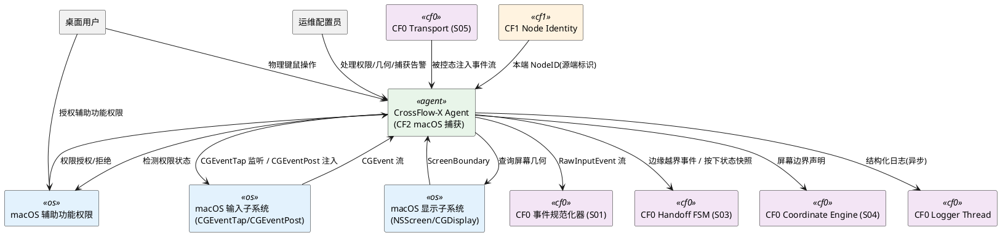
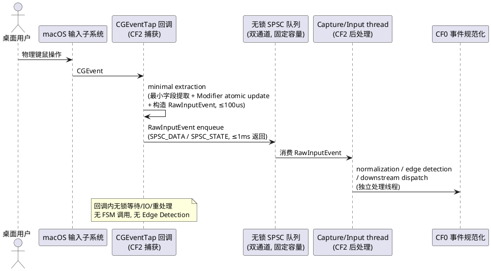
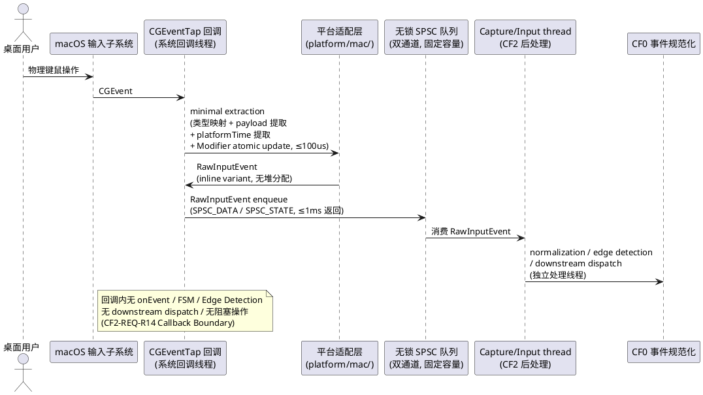
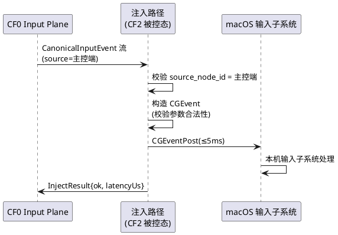
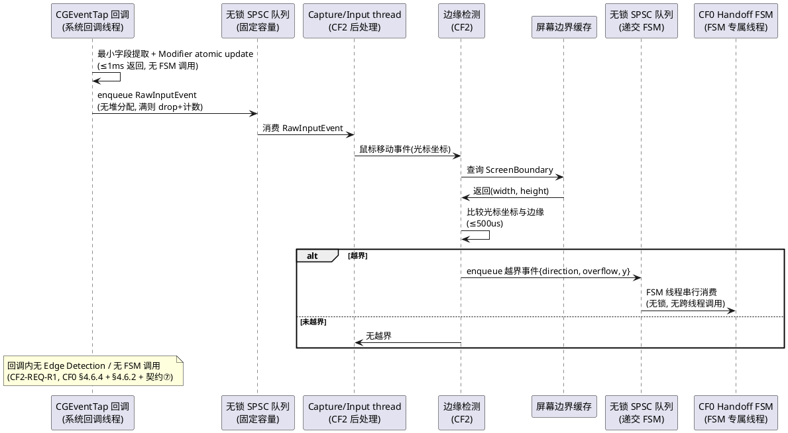
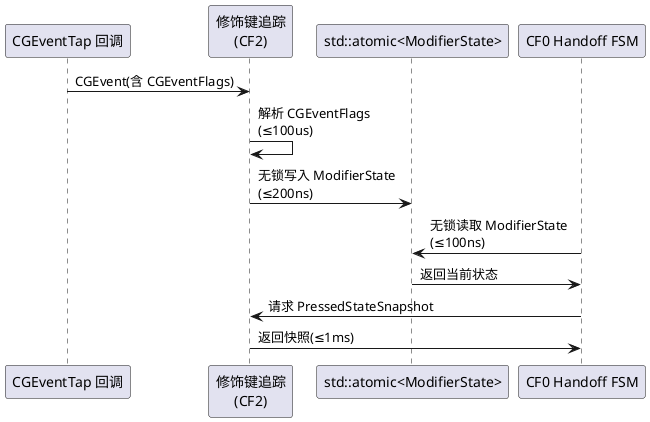
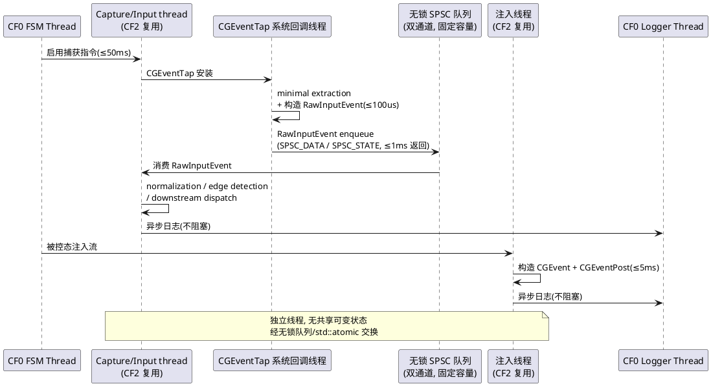

# CrossFlow-X · CF2 macOS 输入捕获需求规格说明书

> **阶段标记**：CF2 — macOS Input Capture
> **规格范围**：CF2-S01 ～ CF2-S06（六个 macOS 输入捕获地基）
> **第一原则**：Driverless User-Mode Architecture —— macOS 输入捕获与注入必须完全在用户态完成，不引入内核扩展（kext）或驱动。
> **CF0 冻结基线引用**：本阶段所有需求严格遵循 `.codeartsdoer/specs/cf0_arch_freeze/spec.md`（v2，892 行）冻结的全部架构基线，包括 Driverless User-Mode Architecture、C++20 技术栈、Canonical Input Event 规范化隔离、Handoff 六态 FSM（ARMED/PENDING/ACK/ACTIVE/COOLDOWN/RECOVERY）、防抖/冷却/驻留/熔断、Input/Control 双平面隔离、FSM 单线程所有权、捕获回调轻量化（≤1ms）、7 个核心契约、CF0 Architecture Safety Invariant（P1 No Split-Brain / P2 No Void-Owner / P3 Recoverable）、并发模型（≤8 线程）、用户态约束。
> **CF1 冻结基线引用**：本阶段复用 CF1 冻结的 Node Identity（Stable NodeID 七要素）、Topology Membership、Session Epoch，作为捕获事件的源端标识与拓扑邻居查询依据；不修改 CF1 身份与发现机制。
> **CF0 接口契约引用**：CF2 实现 CF0 冻结的 `IInputCapture`、`IInputInjector`、`IMonotonicClock`、`IScreenQuery` 四个平台抽象接口（见 `platform/common/platform_ports.hpp`）的 macOS 适配层，不修改接口签名。
> **文档状态**：DRAFT v1.4（Amendment）→ 待用户审查冻结（Evidence-First，先规格后实现，不进入 Design，不直接 Coding）

> **Amendment v1.1 变更记录（受控修订，不删除重写）**
> **修订背景**：大G 项目经理 Requirements Gate 审查裁决 = CONDITIONAL FAIL / REVISION REQUIRED，发现 7 项问题（5 BLOCKER + 1 BLOCKER + 1 REQUIRED）。本次 Amendment 仅修复下列 7 项，不改变主体结构 / 六个模块 / CF0-CF1 边界 / Driverless 原则 / 安全目标，不修改 CF0/CF1 Frozen 文档，不进入 Design，不直接 Coding。所有修订保持 EARS 格式 + Contract / Invariant / Violation / Observable Evidence / Acceptance Test 统一验证格式。
> **修订项**：
> - **CF2-REQ-R1 (🔴 BLOCKER)**：Callback / Edge Detection / FSM 边界冲突。修正：Edge Detection 移出 CGEventTap 回调，改为 Capture/Input thread 的捕获后处理；回调仅做最小字段提取 + Modifier atomic update + RawInputEvent enqueue；越界事件经无锁 SPSC 队列递交 CF0 FSM（复用 CF0 §4.6.4 回调轻量化 + §4.6.2 FSM 单线程所有权 + 契约⑦）。涉及 §4.1.5、§5.1.1 规则 2、§5.4.1 规则 6/7、§5.4.2。
> - **CF2-REQ-R2 (🔴 BLOCKER)**：CGEvent Mouse Location 与 RelativeDelta 语义错误。修正：CF2-S03 接收 CanonicalInputEvent 的 RelativeDelta 语义（CF0-COORD-001）；macOS adapter 基于 RelativeDelta 经 CGEventSetDoubleValueField(kCGMouseEventDeltaX/Y) + CGEventPost 注入，或基于当前有效 cursor location + delta 计算目标 location 后 CGEventPost；ACTIVE 进入一次性定位用 AbsolutePosition（CF0-COORD-002）。涉及 §5.3.1 规则 2。
> - **CF2-REQ-R3 (🔴 BLOCKER)**：atomic lock-free + 100ns 硬指标定义不当。修正：分两层 — Architecture Requirement（CF0 inherited Gate：is_lock_free() 编译期 static_assert，复用 CF0 §8.2.8 + design §2.7.3）+ Performance Evidence（CI/physical validation benchmark P50/P95/P99，目标 P50 读 ≤100ns / 写 ≤200ns，测量型 DFX 而非可移植功能 Contract）。涉及 §4.1.6、§5.5.1 规则 3/4、§9.5。
> - **CF2-REQ-R4 (🔴 BLOCKER)**：Callback allocation / RawInputEvent / queue contract 不完整。修正：CGEventTap 回调不得触发动态堆分配；callback 使用预分配/固定容量无锁传递结构；RawInputEvent payload 为 inline variant（无 heap）；callback → Capture/Input thread 经无锁 SPSC 队列（容量固定，默认 256，复用 CF0 design §2.7.3）；队列满执行明确 drop policy（丢弃 + 计数告警），不得阻塞 callback。涉及 §5.1.1 规则 2、§5.2.1 规则 8、新增 §5.2.1 规则 11。
> - **CF2-REQ-R5 (🔴 BLOCKER)**：PressedStateSnapshot 并发 ownership 不完整。修正：定义明确 snapshot ownership model — fixed-size pressed-key bitmap + fixed-size pressed-button bitmap + atomic snapshot / SPSC transfer；键盘是有限键码集合，不使用动态 vector。涉及 §4.6.4、§5.5.1 规则 5、§6.4。
> - **CF2-REQ-R6 (🔴 BLOCKER)**：ScreenBoundary 与 CF0 Coordinate Space 对齐不明确。修正：CF2 是"CF0 Logical Screen Space 的 macOS 实现"，查询 macOS native screen geometry 并归一化为 CF0 Frozen 的 ScreenBoundary 语义（origin=(0,0) 左上角，CF0 §5.4.1.4 + 契约⑤）；macOS native 坐标系差异（NSScreen 左下角原点 / CGDisplay 左上角原点 / 多显示器排列）在 platform/mac/ 适配层消化，不让 CF2 发明坐标语义。涉及 §5.4.1 规则 2、§6.5。
> - **CF2-REQ-R7 (🟠 REQUIRED)**：releaseAllPressed failure path 不完整。修正：Disconnect → snapshot → release attempt → success CLOSED / failure retry with bounded completion / local safety degradation；有界重试（≤3 次，每次 ≤30ms），不无限重试；超界仍失败则 local safety degradation（强制清空内部按下状态 + 告警 CFX-E-INJ-RELEASE-FAILED + 通知 CF0 FSM 进 RECOVERY），保证 P3 Recoverable。涉及 §5.3.1 规则 6、§5.3.3 异常 4、§9.3。
> **未变更项（v1.1）**：六个模块（CF2-S01～S06）、CF0-CF1 边界、Driverless User-Mode Architecture、CF0 Safety Invariant（P1/P2/P3）、CF0 七契约、CF0 8 线程模型、CF1 Node Identity、第一原则落地路径全部保持不变。

> **Amendment v1.2 变更记录（受控修订，不删除重写）**
> **修订背景**：大G 项目经理对 v1.1 的 Requirements Gate 复审裁决 = CONDITIONAL FAIL / REVISION REQUIRED，发现 4 项新的内部 Contract 冲突 / 未闭合点（2 BLOCKER + 2 REQUIRED）。v1.1 已正确修复原 R1-R7 的方向，本次 Amendment 仅修复下列 4 项新问题（R8-R11），不改变主体结构 / 六个模块 / CF0-CF1 边界 / Driverless 原则 / 安全目标 / R1-R7 已修复内容，不修改 CF0/CF1 Frozen 文档，不进入 Design，不直接 Coding。所有修订保持 EARS 格式 + Contract / Invariant / Violation / Observable Evidence / Acceptance Test 统一验证格式。
> **修订项**：
> - **CF2-REQ-R8 (🔴 BLOCKER)**：Callback Contract 与 §7.1 接口表仍然冲突。问题：§5.4.2 已画成 Tap → SPSC → Capture/Input thread → Edge Detection → SPSC → CF0 FSM，但 §7.1 仍写 "IInputCapture.start(onEvent) → 回调内转换 CGEvent→RawInputEvent 并异步调用 onEvent"，"回调内调用 onEvent" 与 R1 刚冻结的"callback 不调用消费者逻辑"冲突。修正：§7.1 改成与 R1 完全一致——CGEventTap callback 仅做最小字段提取 + Modifier atomic update + RawInputEvent enqueue 到无锁 SPSC 队列（**callback 不调用 onEvent**）；Capture/Input thread 消费队列后才调用 onEvent 进行 downstream dispatch。这是 Requirements Contract，不留给 Design 阶段解释。涉及 §7.1 接口表 IInputCapture.start(onEvent) 行。
> - **CF2-REQ-R9 (🔴 BLOCKER)**：R7 的 ≤100ms 与"3 次 × ≤30ms"存在数学冲突（最坏 4×30ms=120ms > 100ms）。修正：采用**总预算优先**而非次数优先。releaseAllPressed total deadline ≤ 100ms，所有 snapshot / release attempt / retry / result validation / degradation notification 均计入同一个 ≤ 100ms bounded completion budget；deadline reached → local safety degradation（强制清空内部按下状态 + 告警 CFX-E-INJ-RELEASE-FAILED + 通知 CF0 FSM 进 RECOVERY），保证 P3 Recoverable 可证。retry 在剩余预算内进行，不固定"次数 × 每次时延"乘积。涉及 §4.2.5、§5.3.1 规则 6、§5.3.3 异常 4、§9.3 CF2-S03-REQ-002。
> - **CF2-REQ-R10 (🟠 REQUIRED)**：Queue-full Drop Policy 仍然不是确定性的（R4 写"丢弃最旧或最新"给 Design 留两个分支）。修正：Requirements 冻结唯一 Drop Policy——MouseMove / Wheel（高频、可重采样、无状态副作用）→ **Drop Oldest**（保最新，复用 CF0 §4.2.3 Input Plane 最新优先语义）；Key/Button Press / Release（状态变更事件，丢一侧会粘键 / 状态不一致）→ **不允许丢**，队列满时执行 backpressure safeguard：callback 仍不阻塞（保 R1/R4），该事件经 fallback atomic counter 标记 "press/release sequence gap"，Capture/Input thread 消费时检测 gap → 触发 PressedStateSnapshot 重同步（强制重新 snapshot + 通知 CF0 FSM 校验按下状态一致性），recovery invariant = 按下状态最终一致。涉及 §5.2.1 规则 11。
> - **CF2-REQ-R11 (🟠 REQUIRED)**：PressedStateSnapshot 的 atomic bitmap 仍需要明确"原子对象尺寸"+ 当前文本给了"std::atomic<Bitmap> 或 SPSC"两个架构分支。修正：Requirements 冻结**唯一 ownership model = 方案 B**（Capture thread 单线程 owns mutable bitmap → SPSC snapshot publication → FSM/injection thread owns immutable snapshot），删除"std::atomic<Bitmap> 或 SPSC"二选一分支。冻结 bitmap 尺寸：KeyCodeBitmap = 固定 256-bit 位图（位宽 = 256，对应 macOS 虚拟键码 0-255，编译期确定）；MouseButtonBitmap = 固定 8-bit 位图（位宽 = 8，对应 MouseButton 枚举基数 ≤ 8，编译期确定）。方案 B 完全符合 CF0 §4.6.2 FSM 单线程所有权 + §2.7.3 SPSC 队列模式，且不依赖 std::atomic<256-bit> 的平台 lock-free 保证（256-bit atomic 在目标平台不一定 lock-free，强行要求会把架构可行性绑死平台特性）。ModifierState 保持 std::atomic<ModifierState>（小位图，CF0 已冻结 is_lock_free，不变）。涉及 §4.6.4、§5.5.1 规则 5、§6.4。
> **未变更项（v1.2）**：六个模块（CF2-S01～S06）、CF0-CF1 边界、Driverless User-Mode Architecture、CF0 Safety Invariant（P1/P2/P3）、CF0 七契约、CF0 8 线程模型、CF1 Node Identity、第一原则落地路径、R1-R7 已修复内容全部保持不变。

> **Amendment v1.3 变更记录（受控修订，不删除重写）**
> **修订背景**：大G 项目经理对 v1.2 的 Requirements Gate 复审裁决 = CONDITIONAL FAIL / REVISION REQUIRED。v1.2 已正确修复 R8/R9/R11，但 R10（Queue-full Drop Policy 对 Key/Button Press/Release）仍然没有形成可证明的闭环。核心问题：v1.2 的 "backpressure safeguard = gap counter++ + PressedStateSnapshot 重同步" 实际上是 "丢事件 + 记录 gap"，而 R11 冻结了 Capture thread owns mutable bitmap，CGEventTap callback 不能修改 bitmap——如果 KeyDown(A) 发生时 SPSC 已满，事件无法 enqueue，Capture thread 根本没收到 KeyDown(A)，bitmap[A] 不知道 A 已按下，所谓 "重同步" 没有可靠的真实状态来源，直接影响安全路径 disconnect → PressedStateSnapshot → releaseAllPressed（snapshot 不知道 A 被按下则无法释放 A，触碰 P2 No Void-Owner / P3 Recoverable）。本次 Amendment 仅修复 R10 + 文档一致性，不改变主体结构 / 六个模块 / CF0-CF1 边界 / Driverless 原则 / 安全目标 / R1-R9/R11 已修复内容，不修改 CF0/CF1 Frozen 文档，不进入 Design，不直接 Coding。所有修订保持 EARS 格式 + Contract / Invariant / Violation / Observable Evidence / Acceptance Test 统一验证格式。
> **修订项**：
> - **CF2-REQ-R10 (🔴 BLOCKER，v1.2 → v1.3 重新修复)**：Queue-full Drop Policy 对 Key/Button Press/Release 仍然没有形成可证明的闭环。修正：**废弃 v1.2 的单通道 + gap counter 模型，冻结双通道模型（方案 A：为状态变更事件建立保留通道）**——CGEventTap callback 按事件类型分发到两个独立无锁 SPSC 队列：SPSC_DATA（MouseMove/Wheel，Drop Oldest）+ SPSC_STATE（Key/Button Press/Release，reserved capacity，必须可靠进入 STATE lane）。SPSC_STATE 具有预留容量（默认 64，按 "单次用户操作 burst 内状态变更事件数上界 + 余量" 预留，人类输入速率有限，正常设计条件下 callback 无需等待即可提交状态事件）。SPSC_STATE 饱和（异常过载）时执行 **确定性安全降级**（非简单 gap++）：callback 设置 stateChannelSaturated + 告警 CFX-E-CAP-STATE-CHANNEL-SATURATED；Capture thread 检测饱和 → **authoritative resynchronization**（修饰键: CGEventSourceFlagsState ground truth + 按键/按钮: bitmap best-effort + FSM 进 RECOVERY），**不依赖 gap counter 神奇恢复**。**PressedState authoritative source 冻结**：CGEvent callback → SPSC_STATE → Capture thread → mutable bitmap → SPSC snapshot publication → FSM/Injection thread，只有 Capture thread 的 bitmap 是权威状态。涉及 §4.6.4、§5.2.1 规则 11、§9.2。
> - **文档一致性修复（顺手，非 Blocker）**：§5.1.1 规则 2 仍使用 "将 CGEvent 转换为 RawInputEvent 并异步派发"，与 §5.4/§7.1 已更严格定义不一致。修正：§5.1.1 规则 2、§5.1.2、§5.6.2 的流程文字统一为 "CGEventTap callback → minimal extraction → RawInputEvent enqueue → Capture/Input thread → normalization / edge detection / downstream dispatch"。涉及 §5.1.1 规则 2、§5.1.2、§5.6.2。
> **未变更项（v1.3）**：六个模块（CF2-S01～S06）、CF0-CF1 边界、Driverless User-Mode Architecture、CF0 Safety Invariant（P1/P2/P3）、CF0 七契约、CF0 8 线程模型、CF1 Node Identity、第一原则落地路径、R1-R9/R11 已修复内容全部保持不变。

> **Amendment v1.4 变更记录（受控修订，不删除重写）**
> **修订背景**：大G 项目经理对 v1.3 的 Requirements Gate 复审裁决 = CONDITIONAL FAIL / REVISION REQUIRED。v1.3 已正确修复 R8/R9/R10/R11 核心架构（双通道 + authoritative resynchronization + ownership model + bounded completion），但全文 Callback Boundary 一致性未完全闭合——v1.3 在核心 R10 修复中已正确冻结 callback 边界（callback 仅 enqueue，不调用 onEvent/FSM/Edge Detection），但旧文本残留导致全文 Contract 冲突：§5.1.1 规则 9 仍写"回调仅做 CGEvent→RawInputEvent 转换 + 异步派发"，§5.2.2 时序图仍描述 callback 内完成全部转换并返回，多处"异步派发"/"回调内派发"措辞与 R8 冻结的"callback 不调用 onEvent"冲突。本次 Amendment 仅修复 R14（全文 Callback Boundary 一致性），不改变主体结构 / 六个模块 / CF0-CF1 边界 / Driverless 原则 / 安全目标 / R1-R11 已修复内容 / 双通道架构 / SPSC_DATA=256 / SPSC_STATE=64 / STATE saturation safety path / CGEventSourceFlagsState / bitmap ownership / RECOVERY / R9 ≤100ms / R11 ownership / CF0/CF1 Frozen boundary，不修改 CF0/CF1 Frozen 文档，不进入 Design，不直接 Coding。所有修订保持 EARS 格式 + Contract / Invariant / Violation / Observable Evidence / Acceptance Test 统一验证格式。
> **修订项**：
> - **CF2-REQ-R14 (🔴 BLOCKER)**：全文 Callback Boundary 一致性未完全闭合。冻结唯一 Callback Boundary 模型：**CGEventTap callback → minimal field extraction → Modifier atomic update → RawInputEvent enqueue（SPSC_DATA 或 SPSC_STATE）→ Capture/Input thread → normalization → edge detection → downstream dispatch / CF0 FSM**。callback MUST NOT：call onEvent / call FSM / perform edge detection / perform handoff decision / perform downstream dispatch / perform blocking operation。具体修改点：(1) §2 领域术语 Capture Thread 定义统一为新模型（callback 在系统回调线程仅 enqueue，Capture/Input thread 消费 SPSC 队列执行后处理）；(2) §4.6.4 规则 5 "异步派发"→"RawInputEvent enqueue 到无锁 SPSC 队列"；(3) §5.1.1 规则 2 验收条件 b "回调内派发"→"enqueue"；(4) §5.1.1 规则 9 统一为"callback 仅做 minimal field extraction + Modifier atomic update + RawInputEvent enqueue，不调用 onEvent/FSM/Edge Detection/downstream dispatch"；(5) §5.2.2 时序图重绘为 callback → minimal extraction → enqueue → Capture/Input thread → normalization → dispatch（原时序图描述 callback 内完成全部转换并返回，与新模型冲突）；(6) §5.6.1 规则 3 "异步派发"→"RawInputEvent enqueue"；(7) §9.1 CF2-S01-REQ-002 Contract/Invariant/Violation 统一 Callback Boundary。涉及 §2、§4.6.4、§5.1.1 规则 2/9、§5.2.2、§5.6.1 规则 3、§9.1。
> **未变更项（v1.4）**：六个模块（CF2-S01～S06）、CF0-CF1 边界、Driverless User-Mode Architecture、CF0 Safety Invariant（P1/P2/P3）、CF0 七契约、CF0 8 线程模型、CF1 Node Identity、第一原则落地路径、R1-R11 已修复内容、双通道架构（SPSC_DATA=256 / SPSC_STATE=64）、STATE saturation safety path、CGEventSourceFlagsState ground truth、bitmap ownership（方案 B SPSC snapshot publication）、RECOVERY、R9 ≤100ms total deadline、R11 ownership model、CF0/CF1 Frozen boundary 全部保持不变。

---

# **1. 组件定位**

## **1.1 核心职责**

本组件负责在 macOS 端通过用户态 API（CGEventTap / CGEventPost）实现物理键鼠输入的捕获、规范化与注入，是 CrossFlow-X 在 macOS 平台的输入采集与注入地基，为 Input Plane 提供源端事件流、为被控态提供本机注入能力。

## **1.2 核心输入**

1. **macOS 物理键鼠操作**：桌面用户在 macOS 主控端物理设备的鼠标移动、按钮按下/释放、滚轮滚动、按键按下/释放操作，来源为 macOS 输入子系统（HID 层）经 CGEventTap 上报的 CGEvent 流。
2. **捕获启停指令**：来自 CF0 Handoff FSM 状态变更的捕获启停信号——主控态启用捕获、被控态/空闲态按需暂停或切换捕获模式，来源为 CF0 FSM Thread。
3. **注入事件流**：被控态下从 Input Plane 接收的规范输入事件流，来源为 CF0 Transport Layer（对端主控端转发）。
4. **屏幕几何查询请求**：来自 CF0 Coordinate Engine 与边缘越界检测的屏幕边界查询请求，来源为 CF0-S04 坐标空间模块。
5. **强制释放指令**：链路断开或控制权丢失时来自 CF0 Handoff FSM 的键鼠状态强制释放指令，来源为 CF0 FSM Thread（RECOVERY 态触发）。
6. **修饰键同步快照**：Handoff 完成时来自 CF0 Handoff Orchestrator 的源端修饰键状态快照，用于被控态注入前显式对齐，来源为 CF0-S03。

## **1.3 核心输出**

1. **RawInputEvent 流**：从 macOS CGEvent 转换的平台无关原始输入事件流，输出至 CF0 事件规范化器（IEventNormalizer）进一步转换为 CanonicalInputEvent。
2. **本机注入结果**：被控态下向 macOS 输入子系统注入规范事件后的结果（InjectResult），含成功标志、失败计数、注入延迟。
3. **屏幕边界声明**：macOS 主显示器逻辑宽高与原点声明（ScreenBoundary），输出至 CF0 Coordinate Engine 与 CF1 Capabilities。
4. **按下状态快照**：当前所有处于按下状态的键与鼠标按钮快照（PressedStateSnapshot），输出至 CF0 Handoff FSM 用于断线释放。
5. **边缘越界事件**：鼠标光标越过屏幕逻辑边缘的越界事件（方向 + 越界量），输出至 CF0 Handoff FSM 触发 Handoff。
6. **结构化日志**：含 NodeID、事件序号、捕获/注入延迟、CGEventTap 状态等结构化字段的日志，交由 CF0 Logger Thread 异步写入。

## **1.4 职责边界**

本组件 **不负责** 以下事项：

1. **不负责规范输入事件的最终语义化**：本组件仅将 CGEvent 转换为平台无关的 RawInputEvent；RawInputEvent 到 CanonicalInputEvent 的序号分配、时间戳标注、源端 NodeID 标注归属 CF0-S01 事件规范化器（IEventNormalizer）。本组件仅做平台特殊逻辑的隔离消化，不承担业务语义化。
2. **不负责 Handoff FSM 驱动**：控制权转移的状态机驱动、冷却期/停留时间/抖动熔断判定归属 CF0-S03，CF2 仅提供边缘越界事件信号供其消费。
3. **不负责坐标换算**：越界量到目标端入射坐标的换算归属 CF0-S04 Coordinate Engine，CF2 仅提供本端屏幕边界声明与越界量。
4. **不负责传输层帧编解码**：二进制帧编解码、双平面通道、心跳、断线判定归属 CF0-S05，CF2 产出的事件流经 CF0 传输层转发。
5. **不负责端点身份与发现**：NodeID 生成、mDNS 发现、配对、注册、拓扑成员管理归属 CF1，CF2 仅复用本端 NodeID 作为事件源端标识。
6. **不负责 Windows 平台捕获**：Windows 输入注入归属 CF3，CF2 仅实现 macOS 适配层；但 CF2 的接口实现不得引入 macOS 特殊逻辑到 Core 层（CF0 契约①）。
7. **不引入内核扩展或驱动**：第一版禁止引入 kext、Virtual HID 驱动、内核态注入；全部捕获与注入必须经用户态 CGEventTap / CGEventPost 完成（CF0 Driverless User-Mode Architecture）。
8. **不采集屏幕画面**：本组件不采集、不编码、不传输任何屏幕像素数据（CF0 §1.4.1）；屏幕边界查询仅返回逻辑几何，不读取像素。
9. **不破坏 CF0 Architecture Safety Invariant**：CF2 的捕获失败、注入失败、CGEventTap 异常、屏幕几何变更，都不得导致 CF0 Safety Invariant（P1/P2/P3）被破坏。

---

# **2. 领域术语**

**CGEventTap**
: macOS Core Graphics 提供的用户态输入事件监听机制，通过安装事件 tap 回调在用户态拦截并处理 HID 层输入事件；是 Driverless User-Mode Architecture 在 macOS 端的核心载体。
: 备注：CF2 的捕获地基，不引入 kext。

**CGEventPost**
: macOS Core Graphics 提供的用户态输入事件注入机制，通过构造 CGEvent 并 post 到输入子系统实现本机注入；被控态下使用。
: 备注：与 CGEventTap 对称的注入路径。

**CGEventFlags**
: macOS CGEvent 携带的修饰键状态位图，包含 Shift / Control / Option / Command 等修饰键的按下状态；CF2 需将其解析为平台无关的 ModifierState。

**RawInputEvent**
: 平台无关的原始输入事件表示，由 CF0 `platform_ports.hpp` 定义，含 platformTime、kind、payload；是 CGEvent 经平台适配层转换后的中间表示，尚未分配规范序号与时间戳。
: 备注：CF2 产出，CF0-S01 消费。

**CaptureHandle**
: 捕获会话句柄，由 CF0 `IInputCapture.start()` 返回，含 id 与 active 标志；用于管理捕获生命周期。

**Capture Thread**
: 专责消费无锁 SPSC 队列中的 RawInputEvent 并执行 normalization / edge detection / downstream dispatch 的用户态线程；CGEventTap callback 运行在 macOS 系统回调线程，仅做 minimal field extraction + Modifier atomic update + RawInputEvent enqueue 到 SPSC 队列（SPSC_DATA / SPSC_STATE），禁止在回调内执行重处理、禁止调用 onEvent / FSM / Edge Detection / downstream dispatch（CF0 §4.6.4 捕获回调轻量化，CF2-REQ-R14 Callback Boundary 统一）。
: 备注：CF0 8 线程模型中的捕获线程，CF2 不得新增线程。

**Injection Path**
: 被控态下从 Input Plane 消费规范输入事件并经 CGEventPost 注入本机的路径；与捕获路径相互独立，禁止共享可变状态。

**Screen Boundary Query**
: 查询 macOS 主显示器逻辑几何（原点、宽高）的用户态操作，经 NSScreen / CGDisplay API 完成；返回 ScreenBoundary 供坐标换算与边缘检测。

**Edge Overflow Detection**
: 实时比较鼠标光标坐标与屏幕逻辑边缘，当光标越过边缘时产生越界事件（方向 + 越界量）的检测机制；是 Handoff 触发的信号源。

**Modifier State Tracking**
: 独立追踪修饰键（Shift/Ctrl/Option/Cmd）按下/释放状态的无锁状态维护机制；使用 std::atomic<ModifierState> 保证跨线程读取无锁（CF0 §4.6.5 共享状态无锁优先）。

**Pressed State Snapshot**
: 当前所有处于按下状态的键与鼠标按钮的快照，用于断线释放时生成强制释放指令清单；由 CF0 PressedStateSnapshot 承载。

**Tap Headroom**
: CGEventTap 回调的执行时间预算上限；CF2 必须保证回调在 ≤1ms 内返回（CF0 §4.6.4），超时即视为架构破坏。

**User-Mode Constraint**
: CF2 全部实现禁止依赖内核扩展、驱动安装或特权提升；违反即视为架构破坏（CF0 §4.5.3 用户态约束）。
: 备注：CF2 的红线约束。

**Platform Adaptation Layer**
: 消化 macOS 平台特殊逻辑（CGEvent 类型映射、CGEventFlags 解析、CGDisplay 几何查询）的适配层；平台头文件（CGEvent.h、NSScreen.h）仅允许出现在此层，禁止泄漏到 Core 业务层（CF0 契约①）。

**Event Tap Failure**
: CGEventTap 因权限不足、系统资源耗尽、用户禁用辅助功能权限等导致的捕获失败状态；CF2 必须检测并降级处理，不得崩溃。

**Accessibility Permission**
: macOS 辅助功能权限（Accessibility / Input Monitoring），CGEventTap 捕获输入事件所需的前置用户授权；CF2 必须检测权限状态并引导用户授权，权限缺失时不得静默失败。

---

# **3. 角色与边界**

## **3.1 核心角色**

- **桌面用户**：在 macOS 主控端通过物理键鼠操作驱动系统的最终用户；其操作经 CGEventTap 被捕获，其授权辅助功能权限是捕获前置条件。
- **运维配置员**：负责处理 CGEventTap 权限告警、屏幕几何异常、捕获失败等运行时异常的人员。

## **3.2 外部系统**

- **macOS 输入子系统（HID 层）**：提供 CGEventTap 事件监听与 CGEventPost 事件注入的操作系统用户态接口；CF2 的核心依赖。
- **macOS 显示子系统**：提供 NSScreen / CGDisplay 屏幕几何查询的操作系统接口；CF2 屏幕边界查询的依赖。
- **macOS 辅助功能权限系统**：管理 Accessibility / Input Monitoring 权限授权的操作系统安全机制；CGEventTap 的前置条件。
- **CF0 事件规范化器（IEventNormalizer）**：CF2 产出的 RawInputEvent 经其转换为 CanonicalInputEvent；CF2 不承担最终语义化。
- **CF0 Handoff FSM（IHandoffOrchestrator）**：CF2 产出的边缘越界事件供其消费触发 Handoff；CF2 不驱动 FSM。
- **CF0 Coordinate Engine（ICoordMapper）**：CF2 提供屏幕边界声明供其坐标换算；CF2 不做跨端换算。
- **CF0 Transport Layer（IInputPlaneChannel）**：被控态下 CF2 从其接收规范输入事件流用于注入。
- **CF0 Logger Thread**：CF2 全部日志经其异步写入，禁止在捕获/注入热路径同步写日志。
- **CF1 Node Identity**：CF2 复用本端 Stable NodeID 作为捕获事件的源端标识；不修改身份机制。

## **3.3 交互上下文**

---

# **4. DFX约束**

> **CF0 基线延续**：CF2 必须遵循 CF0 §4 全部 DFX 约束（C++20 基线、性能红线、并发模型 ≤8 线程、用户态约束、捕获回调 ≤1ms 等）。本章仅列出 CF2 增量 DFX 约束，不重复 CF0 已冻结内容。

## **4.1 性能**

1. **CGEventTap 回调延迟上限**：CGEventTap 回调从被调用到返回的延迟必须 ≤ 1ms（复用 CF0 §4.6.4）；回调内禁止执行锁等待、I/O、内存分配、跨平面调用或同步日志写入。
2. **CGEvent 到 RawInputEvent 转换延迟**：单个 CGEvent 转换为 RawInputEvent 的延迟必须 ≤ 100us；转换仅做类型映射与字段提取，禁止重处理。
3. **CGEventPost 注入延迟**：单个 CanonicalInputEvent 经 CGEventPost 注入本机的延迟必须 ≤ 5ms；批量注入（injectBatch）单帧延迟必须 ≤ 10ms。
4. **屏幕边界查询延迟**：ScreenBoundary 查询延迟必须 ≤ 10ms；查询结果可缓存，分辨率变更时失效重查。
5. **边缘越界检测延迟**：从鼠标移动事件到越界判定完成的延迟必须 ≤ 500us；**检测在 Capture/Input thread（回调后处理线程）完成，不在 CGEventTap 回调内完成**（CF2-REQ-R1 修订：Edge Detection 是 Input Plane 的捕获后处理，不是回调内调用）。回调仅做最小字段提取 + Modifier atomic update + RawInputEvent enqueue（≤1ms 返回，复用 CF0 §4.6.4）；越界事件经无锁 SPSC 队列递交 CF0 Handoff FSM（复用 CF0 §4.6.2 FSM 单线程所有权 + 契约⑦ CF0-ARCH-CONCURRENCY-002），CF2 不在回调内直接调用 FSM 或产生越界事件给 FSM。
6. **修饰键状态读取延迟（CF2-REQ-R3 分层）**：
   - **Architecture Requirement（CF0 inherited Gate）**：ModifierState 必须采用无锁原子访问 `std::atomic<ModifierState>`，目标平台（Apple Clang ≥15 / MSVC ≥19.3x / Clang ≥17，CF0 §4.5.5 编译器矩阵）必须验证 `is_lock_free() == true`（编译期 `static_assert`，复用 CF0 §8.2.8 + design §2.7.3，此为 CF0 已 Frozen 的硬 Gate，非 CF2 自行定义的可移植保证）；捕获回调线程写入，FSM 线程与注入路径读取，禁止互斥量（复用 CF0 §4.6.5）。
   - **Performance Evidence（测量型 DFX，非可移植功能 Contract）**：在 CI / physical validation 中 benchmark 记录读取/写入延迟 P50/P95/P99；目标 P50 读 ≤ 100ns / 写 ≤ 200ns（在参考硬件上测量，不作为源码可移植硬性 Contract，架构不达标时升级目标平台或加宽预算而非破坏 is_lock_free()）。
7. **按下状态快照生成延迟**：PressedStateSnapshot 生成延迟必须 ≤ 1ms；快照用于断线释放，必须即时可用。
8. **捕获启停延迟**：从收到捕获启停指令到 CGEventTap 实际启用/禁用的延迟必须 ≤ 50ms。

## **4.2 可靠性**

1. **CGEventTap 失败检测**：CGEventTap 创建失败、回调异常、系统禁用 tap 时，CF2 必须在 ≤ 200ms 内检测并进入降级态，不崩溃，记录告警 CFX-E-CAP-TAP-FAIL。
2. **辅助功能权限缺失处理**：CGEventTap 需要的 Accessibility / Input Monitoring 权限缺失时，CF2 必须检测权限状态，拒绝启动捕获，记录告警 CFX-W-CAP-A11Y-DENIED，引导用户授权；权限恢复后自动重试启动。
3. **注入失败重试**：CGEventPost 注入失败时，CF2 必须记录失败计数，单帧失败不中断注入流；连续失败超过阈值（默认 10 帧）时记录告警 CFX-W-INJ-FAIL-STREAK 并通知 CF0 FSM。
4. **屏幕几何变更适应**：macOS 分辨率变更、显示器连接/断开时，CF2 必须在 ≤ 1s 内重新查询屏幕边界并更新缓存，通知 CF0 Coordinate Engine；进行中的 Handoff 以新边界为准（复用 CF0 §5.4.1.6）。
5. **断线释放可靠性（CF2-REQ-R9 修订，总预算优先）**：被控态链路断开时，CF2 必须在 **total deadline ≤ 100ms** 内释放所有按下键与鼠标按钮（复用 CF0 §4.2.1）；**所有 snapshot、release attempt、retry、result validation、degradation notification 均计入同一个 ≤ 100ms bounded completion budget**（不采用"次数 × 每次时延"乘积模型，避免最坏情况超界）；deadline reached 仍失败 → local safety degradation。释放清单经 CGEventPost 发送合成释放事件。
6. **捕获不丢失本端控制**：主控态下捕获失败不得导致本端键鼠永久失效；捕获失败时本端物理键鼠仍作用于本机（CF0 P2 No Void-Owner 保持）。
7. **CF0 Safety Invariant 延续**：CF2 的捕获失败、注入失败、权限缺失、几何变更，都不得导致 CF0 Safety Invariant（P1/P2/P3）被破坏；失败时端点保持当前状态，不产生虚假控制权或控制权丢失。

## **4.3 安全性**

1. **辅助功能权限最小化**：CF2 仅申请 CGEventTap 所需的最小权限（Accessibility + Input Monitoring）；不申请无关权限。
2. **捕获事件不外泄**：CGEventTap 捕获的原始事件仅流向 CF0 事件规范化器与 Input Plane；禁止写入磁盘、禁止经 Control Plane 传输原始 CGEvent、禁止日志记录事件完整内容（仅记录元数据）。
3. **注入仅接受主控端流**：被控态注入路径仅接受当前主控端经 Input Plane 转发的规范事件；非主控端事件拒绝注入（复用 CF0 §4.3.4 控制权不可窃取）。
4. **用户态约束红线**：CF2 全部实现禁止依赖内核扩展、驱动安装、root 特权或 SIP 禁用；违反即视为架构破坏（复用 CF0 §4.5.3）。
5. **CGEvent 构造安全**：注入路径构造 CGEvent 时必须校验参数合法性（坐标范围、键码范围、按钮范围）；非法参数丢弃并记录告警，不注入。

## **4.4 可维护性**

1. **结构化日志**：CF2 全部日志必须包含 NodeID、事件序号（若涉及）、捕获/注入延迟、CGEventTap 状态、屏幕边界等结构化字段，交由 CF0 Logger Thread 异步写入。
2. **运行时可观测**：必须暴露当前捕获状态（active/inactive/degraded）、CGEventTap 句柄状态、屏幕边界、修饰键状态、最近一次捕获/注入延迟、注入失败计数等运行时指标。
3. **权限状态可观测**：必须暴露当前 Accessibility / Input Monitoring 权限状态，供运维监控与告警。
4. **捕获/注入事件审计**：捕获启停、注入失败、权限变更、几何变更、tap 失败事件必须记录审计日志，含时间戳、NodeID、事件类型、结果。

## **4.5 兼容性**

1. **CF0 基线兼容**：CF2 必须遵循 CF0 冻结的全部兼容性约束（C++20 基线、编译器矩阵、用户态约束、操作系统兼容 macOS 12+）。
2. **macOS 版本兼容**：CF2 必须支持 macOS 12（Monterey）及以上；macOS 12 以下不支持并明确告警。CGEventTap / CGEventPost / NSScreen API 在 macOS 12+ 稳定可用。
3. **接口契约不修改**：CF2 必须实现 CF0 `IInputCapture`/`IInputInjector`/`IMonotonicClock`/`IScreenQuery` 接口签名，不修改接口定义；接口签名变更归属 CF0 冻结基线，CF2 无权修改。
4. **平台逻辑隔离红线**：macOS 平台头文件（CGEvent.h、NSScreen.h、CGDisplay.h 等）仅允许出现在 `platform/mac/` 适配层；Core 层（`core/`）禁止包含任何平台头文件或平台条件编译宏（CF0 契约①）。
5. **多显示器合并声明**：第一版每个 macOS 端点按单一逻辑屏幕处理（复用 CF0 §5.4.1.7）；若存在多显示器，必须将其合并声明为单一逻辑边界或明确声明不支持。

## **4.6 并发与线程安全**

> **CF0 基线延续**：CF2 必须遵循 CF0 §4.6 全部并发约束（≤8 线程、FSM 单线程所有权、捕获回调轻量化、共享状态无锁优先、禁止阻塞热路径）。本章仅列出 CF2 增量约束。

1. **不新增线程**：CF2 复用 CF0 8 线程模型中的捕获线程与注入线程，不新增线程；CF2 的捕获回调运行在 CGEventTap 系统回调线程（不计入 8 线程预算，但受 ≤1ms 回调约束）。
2. **捕获与注入路径隔离**：CGEventTap 捕获路径与 CGEventPost 注入路径必须运行在相互独立的线程上，禁止共享可变状态；跨路径数据交换必须经无锁队列或 std::atomic（复用 CF0 §4.6.3）。
3. **修饰键状态无锁**：ModifierState 必须使用 std::atomic<ModifierState> 无锁存储，捕获回调写入、FSM 线程读取，禁止互斥量（复用 CF0 §4.6.5）。
4. **按下状态快照无锁优先（CF2-REQ-R5/R11 修订，唯一 ownership model 冻结）**：PressedStateSnapshot 生成必须采用无锁 ownership model，**禁止使用 std::vector 等动态容器承载按下集合**（动态 vector 无法保证 snapshot 不与写操作发生 data race）。**CF2-REQ-R11 冻结唯一 ownership model = 方案 B（SPSC snapshot publication），删除"std::atomic<Bitmap> 或 SPSC"二选一分支**。具体模型：
   - **fixed-size pressed-key bitmap（尺寸冻结）**：按下普通键集合为固定大小位图 `KeyCodeBitmap`，**位宽 = 256 bit**（对应 macOS 虚拟键码 0-255，编译期确定，预留扩展）；
   - **fixed-size pressed-button bitmap（尺寸冻结）**：按下鼠标按钮集合为固定大小位图 `MouseButtonBitmap`，**位宽 = 8 bit**（对应 MouseButton 枚举基数 ≤ 8，编译期确定）；
   - **ownership model = 方案 B（SPSC snapshot publication，唯一冻结）**：**Capture thread 单线程 owns mutable KeyCodeBitmap / MouseButtonBitmap**（单线程写，无竞争）→ snapshot 请求经无锁 SPSC 队列递交 → **Capture thread 发布 immutable snapshot 副本**（拷贝当前 bitmap 到 snapshot 对象）→ **FSM/injection thread owns immutable snapshot**（单线程消费，无竞争）。此模型完全符合 CF0 §4.6.2 FSM 单线程所有权 + CF0 design §2.7.3 SPSC 队列模式，**不依赖 std::atomic<256-bit> 的平台 lock-free 保证**（256-bit atomic 在目标平台不一定 lock-free，强行要求会把架构可行性绑死平台特性）；
   - **ModifierState 保持 std::atomic<ModifierState>（不变）**：ModifierState 为小位图（Shift/Ctrl/Option/Cmd 4 bit），CF0 已冻结 `is_lock_free()` static_assert（复用 CF0 §8.2.8 + design §2.7.3），CF2 不改变；
   - **生成延迟**：≤ 1ms（SPSC snapshot publication：Capture thread 拷贝 256+8 bit bitmap 到 snapshot 对象，无锁竞争）；
   - 复用 CF0 §4.6.5 共享状态无锁优先。键盘是有限键码集合，不需要动态 vector。
   - **PressedState authoritative source 冻结（CF2-REQ-R10 v1.3 新增）**：PressedState 的权威状态来源链路为 **CGEvent callback → SPSC_STATE（state event reliable lane，reserved capacity，详见 §5.2.1 规则 11）→ Capture thread → mutable KeyCodeBitmap / MouseButtonBitmap → SPSC snapshot publication → FSM / Injection thread**。**只有 Capture thread 的 bitmap 是 PressedState 的权威状态**；SPSC_STATE 是状态事件到达 Capture thread 的可靠通道；gap counter（v1.2 已废弃）不能被当成 state recovery 本身。若 SPSC_STATE 饱和导致状态事件无法到达 Capture thread，Requirements 定义的真实可验证 resynchronization source =（修饰键: `CGEventSourceFlagsState(kCGEventSourceStateCombinedSessionState)` ground truth）+（按键/按钮: bitmap best-effort + FSM 进 RECOVERY + 用户自然释放），不依赖被丢弃的单个事件，不依赖 gap counter 神奇恢复（详见 §5.2.1 规则 11 drop policy）。
5. **禁止阻塞捕获回调**：CGEventTap 回调内禁止执行磁盘 I/O、网络等待、锁竞争、sleep、同步日志写入、跨平面调用；回调仅做 minimal field extraction + Modifier atomic update + RawInputEvent enqueue 到无锁 SPSC 队列（SPSC_DATA / SPSC_STATE），不调用 onEvent / FSM / Edge Detection / downstream dispatch（复用 CF0 §4.6.4，CF2-REQ-R14 Callback Boundary 统一）。

---

# **5. 核心能力**

## **5.1 macOS 用户态输入捕获（CF2-S01）**

本模块定义通过 CGEventTap 在用户态捕获 macOS 物理键鼠输入的核心机制，是 Driverless User-Mode Architecture 在 macOS 端的捕获地基。

### **5.1.1 业务规则**

1. **用户态捕获规则**：当 macOS 端需要捕获物理键鼠输入时，系统必须通过 CGEventTap 在用户态安装事件 tap 回调完成捕获；禁止引入内核扩展、驱动或特权提升。
   a. 验收条件：[macOS 端启动捕获] → [经 CGEventTap 安装用户态 tap，无 kext/驱动/root 特权]
   b. 验收条件：[审查 platform/mac/ 实现] → [仅使用 CGEventTap 等 Core Graphics 用户态 API，无 IOKit kext]

2. **CGEventTap 回调轻量化规则**：CGEventTap 回调必须仅做轻量采集——**CGEventTap callback → minimal extraction（最小字段提取 + Modifier atomic update）→ RawInputEvent enqueue（到无锁 SPSC 队列，详见 §5.2.1 规则 11 双通道）→ Capture/Input thread → normalization / edge detection / downstream dispatch**，禁止在回调内执行锁等待、I/O、内存分配、跨平面调用或同步日志写入；回调返回延迟必须 ≤ 1ms。**回调内禁止直接调用 CF0 Handoff FSM、禁止产生越界事件给 FSM、禁止执行 Edge Detection**（CF2-REQ-R1 修订：Edge Detection 是 Input Plane 的捕获后处理，不是 CGEventTap callback 内的 FSM 调用；流程为 CGEventTap callback → 最小字段提取 + Modifier atomic update + RawInputEvent enqueue → Capture/Input thread → Edge Detection → 越界事件经无锁 SPSC 队列递交 CF0 Handoff FSM，复用 CF0 §4.6.4 回调轻量化 + §4.6.2 FSM 单线程所有权 + 契约⑦ CF0-ARCH-CONCURRENCY-002/003）。
   a. 验收条件：[测量 CGEventTap 回调耗时] → [≤ 1ms，无锁等待/IO/内存分配]
   b. 验收条件：[回调内 enqueue RawInputEvent 到无锁 SPSC 队列] → [callback 仅 enqueue 不调用消费者逻辑，Capture/Input thread 异步消费，回调不阻塞等待处理完成]
   c. 验收条件：[审查回调代码] → [无 FSM 直接调用、无越界事件产生、无 Edge Detection；越界事件由 Capture/Input thread 后处理经 SPSC 队列递交 FSM]
   d. 验收条件：[审查回调内存行为] → [无动态堆分配，RawInputEvent 传递遵循 §5.2.1 规则 11（无锁 SPSC + 固定容量 + drop policy，CF2-REQ-R4）]

3. **捕获事件完备性规则**：CGEventTap 必须监听并捕获以下完整事件类型：鼠标移动（kCGEventMouseMoved）、鼠标按钮按下（kCGEventLeftMouseDown / kCGEventRightMouseDown / kCGEventOtherMouseDown）、鼠标按钮释放（对应 Up）、滚轮滚动（kCGEventScrollWheel）、按键按下（kCGEventKeyDown）、按键释放（kCGEventKeyUp）；缺一不可（复用 CF0 §5.1.1.4-5 鼠标/键盘完备性）。
   a. 验收条件：[用户执行移动/按下/释放/滚轮/按键] → [CGEventTap 均捕获并产出对应 RawInputEvent]

4. **捕获启停规则**：当收到 CF0 FSM 的捕获启停指令时，CF2 必须在 ≤ 50ms 内启用或禁用 CGEventTap；主控态启用捕获，被控态可暂停捕获（避免本端物理输入干扰注入）或切换为透传模式。
   a. 验收条件：[FSM 转入主控态 + 启用捕获指令] → [≤ 50ms 内 CGEventTap active]
   b. 验收条件：[FSM 转入被控态 + 暂停捕获指令] → [≤ 50ms 内 CGEventTap inactive 或透传]

5. **捕获句柄管理规则**：CF2 必须通过 CaptureHandle 管理捕获会话生命周期；start() 返回有效句柄，stop(handle) 释放 tap 资源；句柄 active 标志准确反映 tap 状态。
   a. 验收条件：[start() 成功] → [返回 CaptureHandle{id>0, active=true}]
   b. 验收条件：[stop(handle)] → [tap 释放，handle.active=false，无资源泄漏]

6. **辅助功能权限前置规则**：CGEventTap 安装前必须检测 Accessibility / Input Monitoring 权限；权限缺失时拒绝启动捕获，记录告警 CFX-W-CAP-A11Y-DENIED，引导用户授权；权限恢复后自动重试。
   a. 验收条件：[权限缺失 + 尝试启动捕获] → [拒绝启动，告警 CFX-W-CAP-A11Y-DENIED，引导授权]
   b. 验收条件：[用户授权后] → [自动重试启动捕获，成功后 active=true]

7. **CGEventTap 失败降级规则**：CGEventTap 创建失败、回调异常、系统禁用 tap 时，CF2 必须在 ≤ 200ms 内检测并进入降级态，不崩溃，记录告警 CFX-E-CAP-TAP-FAIL；降级态下本端物理键鼠仍作用于本机（P2 No Void-Owner 保持）。
   a. 验收条件：[CGEventTap 创建失败] → [≤ 200ms 内进入降级态，告警 CFX-E-CAP-TAP-FAIL，不崩溃]
   b. 验收条件：[降级态 + 本端物理键鼠操作] → [本机正常响应，不失效]

8. **禁止项：禁止内核态捕获**：CF2 禁止以内核扩展、IOKit 驱动、HID 驱动或任何内核态机制实现输入捕获；必须完全经用户态 CGEventTap 完成。
   a. 验收条件：[审查 platform/mac/ 实现] → [无 kext/IOKit 驱动/HID 驱动，仅 CGEventTap]

9. **禁止项：禁止回调内重处理**：CGEventTap 回调禁止执行规范化序号分配、时间戳标注、源端 NodeID 标注、坐标换算、Handoff 判定等业务逻辑；这些归属 CF0 处理线程，回调仅做 minimal field extraction + Modifier atomic update + RawInputEvent enqueue 到无锁 SPSC 队列（SPSC_DATA / SPSC_STATE），不调用 onEvent / FSM / Edge Detection / downstream dispatch（CF2-REQ-R14 修订，统一 Callback Boundary）。
   a. 验收条件：[审查回调代码] → [仅含 minimal field extraction + Modifier atomic update + RawInputEvent enqueue，无 onEvent / FSM / Edge Detection / downstream dispatch 调用，无业务逻辑]

### **5.1.2 交互流程**

### **5.1.3 异常场景**

1. **辅助功能权限缺失**
   a. 触发条件：macOS Accessibility / Input Monitoring 权限未授予。
   b. 系统行为：拒绝启动 CGEventTap，记录告警 CFX-W-CAP-A11Y-DENIED，引导用户在系统偏好设置授权；本端物理键鼠仍作用于本机。
   c. 用户感知：捕获未启动，提示需授权辅助功能权限；授权后自动恢复。

2. **CGEventTap 创建失败**
   a. 触发条件：系统资源耗尽、tap 数量超限、API 返回错误。
   b. 系统行为：进入降级态，记录告警 CFX-E-CAP-TAP-FAIL，不崩溃；本端键鼠正常作用于本机。
   c. 用户感知：切换能力不可用，本端键鼠正常；日志提示 tap 创建失败。

3. **CGEventTap 回调异常**
   a. 触发条件：回调执行中抛出异常或超时（>1ms）。
   b. 系统行为：记录告警，该事件丢弃，不影响后续事件捕获；连续异常超阈值进入降级态。
   c. 用户感知：可能丢失单次输入，不卡死；日志出现回调异常告警。

4. **系统禁用 tap**
   a. 触发条件：macOS 运行时禁用输入监听（如安全策略、用户撤销权限）。
   b. 系统行为：检测 tap 失效，进入降级态，告警，本端键鼠保持可用。
   c. 用户感知：切换暂停，本端正常；权限恢复后自动重试。

---

## **5.2 CGEvent 规范化适配（CF2-S02）**

本模块定义将 macOS CGEvent 转换为平台无关 RawInputEvent 的适配机制，是 CF0 契约①（规范化隔离）在 macOS 端的落地地基。

### **5.2.1 业务规则**

1. **平台逻辑隔离规则**：macOS 平台特殊逻辑（CGEvent 类型映射、CGEventFlags 解析、CGEvent 字段提取、坐标增量计算）必须被隔离在 `platform/mac/` 适配层内部；Core 业务层（`core/`）禁止包含任何 macOS 平台头文件（CGEvent.h、CGEventType 等）或平台条件编译宏（`#ifdef __APPLE__`）。
   a. 验收条件：[审查 core/ 层代码] → [不出现 CGEvent.h、CGEventType、#ifdef __APPLE__ 等平台引用]
   b. 验收条件：[审查 platform/mac/ 层] → [平台逻辑在此层消化，产出平台无关 RawInputEvent]

2. **CGEvent 类型映射规则**：CF2 必须将 macOS CGEvent 类型完整映射到 RawEventKind 枚举：kCGEventMouseMoved → MouseMove、kCGEventLeftMouseDown/RightMouseDown/OtherMouseDown → MouseButtonPress、对应 Up → MouseButtonRelease、kCGEventScrollWheel → Wheel、kCGEventKeyDown → KeyPress、kCGEventKeyUp → KeyRelease；映射不得丢失事件语义。
   a. 验收条件：[macOS 产生 kCGEventLeftMouseDown] → [产出 RawInputEvent{kind=MouseButtonPress, payload.button=Left}]
   b. 验收条件：[macOS 产生 kCGEventKeyDown] → [产出 RawInputEvent{kind=KeyPress, payload.keyCode=对应键码}]

3. **鼠标增量提取规则**：CGEvent 鼠标移动事件必须提取 deltaX / deltaY 增量字段填充 RawMouseMovePayload；增量必须为有符号整数，反映相对上一次位置的位移。
   a. 验收条件：[鼠标向右移动 10px] → [RawMouseMovePayload.deltaX = 10]
   b. 验收条件：[鼠标向左移动 5px] → [RawMouseMovePayload.deltaX = -5]

4. **滚轮增量提取规则**：CGEvent 滚轮事件必须提取 scrollDelta 填充 RawWheelPayload.delta，提取滚轮轴（垂直/水平）填充 RawWheelPayload.axis。
   a. 验收条件：[垂直滚轮向上滚动] → [RawWheelPayload{delta>0, axis=Vertical}]

5. **键码映射规则**：macOS 虚拟键码（kVK_*）必须映射到平台无关 KeyCode 枚举；映射表必须覆盖字母键、数字键、功能键、方向键、修饰键等全部常见键；未映射键码记录告警并丢弃。
   a. 验收条件：[按下 kVK_ANSI_A] → [产出 RawKeyPayload.keyCode = 对应 KeyCode::A]
   b. 验收条件：[按下未映射键码] → [丢弃，告警 CFX-W-CAP-UNKNOWN-KEYCODE]

6. **鼠标按钮映射规则**：macOS 鼠标按钮（kCGMouseButtonLeft/Right/Center/Other）必须映射到平台无关 MouseButton 枚举。
   a. 验收条件：[kCGMouseButtonLeft] → [MouseButton::Left]

7. **platformTime 提取规则**：RawInputEvent.platformTime 必须从 CGEventTimestamp 提取，作为平台时间戳供 CF0 进一步转换为规范单调时间戳。
   a. 验收条件：[CGEvent 携带 timestamp T] → [RawInputEvent.platformTime = T]

8. **转换延迟规则（CF2-REQ-R4 修订）**：单个 CGEvent 转换为 RawInputEvent 的延迟必须 ≤ 100us；转换仅做类型映射与字段提取，禁止锁等待、禁止 I/O。**callback 不得触发动态堆分配**（`new`/`malloc`/容器扩容）：RawInputEvent 及其 RawPayload variant 必须为 **inline variant**（无 heap 分配，所有 payload 类型固定大小且栈上构造）；所谓"除 variant 构造"仅指 inline std::variant 在栈上的就地构造，不包含任何堆分配。callback 使用预分配/固定容量的无锁传递结构将 RawInputEvent enqueue 到 Capture/Input thread。
   a. 验收条件：[测量单次转换耗时] → [≤ 100us]
   b. 验收条件：[审查回调转换代码] → [无 new/malloc/容器扩容；RawPayload 为 inline variant，所有 payload 固定大小栈上构造]

9. **禁止项：禁止 Core 层平台污染**：Core 业务层禁止包含 macOS 平台头文件或平台条件分支；平台差异必须在 `platform/mac/` 适配层消化（复用 CF0 契约①禁止项）。
   a. 验收条件：[grep core/ 层] → [不存在 CGEvent、CGEventType、#ifdef __APPLE__]

10. **禁止项：禁止转换丢失语义**：CGEvent → RawInputEvent 转换禁止丢失事件语义（类型、按钮、键码、增量、时间戳）；无法映射的字段必须记录告警，不得静默丢弃。
    a. 验收条件：[审查转换路径] → [全部字段映射或告警，无静默丢弃]

11. **RawInputEvent 传递契约（CF2-REQ-R4 新增，CF2-REQ-R10 v1.2 → v1.3 重新修复，双通道 + authoritative resynchronization）**：CGEventTap callback → Capture/Input thread 的 RawInputEvent 传递必须满足下列契约，复用 CF0 design §2.7.3 无锁 SPSC 队列。**v1.3 废弃 v1.2 的单通道 + gap counter 模型**（v1.2 的 `pressReleaseGapCounter` + "PressedStateSnapshot 重同步" 实际是 "丢事件 + 记录 gap"，而 R11 冻结 Capture thread owns mutable bitmap，callback 不能修改 bitmap，被丢弃的状态事件无法反映到 bitmap，gap counter 不提供 state recovery，所谓 "重同步" 没有可靠的真实状态来源），**冻结双通道模型（方案 A：为状态变更事件建立保留通道）**：
    - **双通道模型概述**：CGEventTap callback 按事件类型将 RawInputEvent 分发到两个独立的无锁 SPSC 队列——SPSC_DATA（高频事件）与 SPSC_STATE（状态变更事件）。两个队列共享同一对生产者/消费者（callback 为唯一生产者，Capture/Input thread 为唯一消费者），不新增线程（遵守 CF0 契约⑦ ≤8 线程 + R1/R4 回调轻量化 + 无堆分配）。
    - **SPSC_DATA（高频事件通道）**：
      - **事件类型**：MouseMove / Wheel（高频、可重采样、无状态副作用）；
      - **队列类型**：无锁 SPSC（单生产者单消费者），callback 为唯一生产者，Capture/Input thread 为唯一消费者；
      - **队列容量**：固定（默认 256，复用 CF0 design §2.7.3），编译期确定，禁止动态扩容；
      - **队列存储**：预分配固定大小 RawInputEvent（inline variant），enqueue 为无锁原子写，无堆分配；
      - **Drop Policy（队列满）**：**Drop Oldest**（丢弃队列中最旧事件，腾出槽位 enqueue 当前事件；保最新，复用 CF0 §4.2.3 Input Plane 最新优先语义）+ 原子计数器 `droppedOldestCount++` + 异步告警标记 CFX-W-CAP-QUEUE-DROP；
      - **语义**：高频可重采样事件，允许丢，保最新。
    - **SPSC_STATE（状态变更事件通道，reserved capacity）**：
      - **事件类型**：Key/Button Press / Release（KeyDown/KeyUp/ButtonDown/ButtonUp，状态变更事件，丢一侧会粘键 / 状态不一致）；
      - **队列类型**：无锁 SPSC（单生产者单消费者），callback 为唯一生产者，Capture/Input thread 为唯一消费者；
      - **队列容量**：固定（默认 64，编译期确定），**具有 reserved capacity / 保留槽位**，禁止动态扩容；
      - **Reserved Capacity 语义**：状态通道容量按 "单次用户操作 burst 内状态变更事件数上界 + 余量" 预留。人类输入速率有限（单次 burst 内 Key/Button Press/Release 事件数远低于 64），Capture thread 消费速率远高于人类输入速率，**正常设计条件下 callback 无需等待即可提交状态事件，SPSC_STATE 不满**；状态通道满表示系统已严重过载（Capture thread 卡死或极慢，超出设计预留），属异常情况；
      - **队列存储**：预分配固定大小 RawInputEvent（inline variant），enqueue 为无锁原子写，无堆分配；
      - **Drop Policy（队列满，异常安全降级，CF2-REQ-R10 v1.3 冻结，确定性机制，非简单 gap++）**：状态通道满时 callback 仍不阻塞（保 R1/R4），该状态事件无法 enqueue → 执行下列 **确定性安全降级**：
        - (a) callback 设置 `stateChannelSaturated = true`（std::atomic<bool>）+ `stateChannelSaturatedCount++`（std::atomic<uint64_t>）+ 异步告警 CFX-E-CAP-STATE-CHANNEL-SATURATED（错误级，非警告级，表示状态事件丢失）；
        - (b) **不使用 gap counter 假定 snapshot 可神奇恢复**（v1.2 的 `pressReleaseGapCounter` 模型已废弃：R11 冻结 Capture thread owns mutable bitmap，callback 不能修改 bitmap，被丢弃的状态事件无法反映到 bitmap，gap counter 不提供 state recovery）；
        - (c) **authoritative resynchronization（真实可验证的 resynchronization source，由 Capture thread 执行）**：Capture thread 检测 `stateChannelSaturated == true` → 触发 authoritative resynchronization：
          - **修饰键**：从 `CGEventSourceFlagsState(kCGEventSourceStateCombinedSessionState)` 查询当前真实修饰键状态（macOS Core Graphics 用户态 API，ground truth，不违反 Driverless User-Mode Architecture），以此重建 ModifierState；
          - **普通按键 / 鼠标按钮**：macOS 无 "查询当前所有按下键" 的用户态 API → 采用 **bitmap best-effort + RECOVERY 降级**：Capture thread 当前 KeyCodeBitmap / MouseButtonBitmap 是 "饱和前最后一次成功消费的一致状态"（由 R11 SPSC snapshot publication 保证无 data race，可能滞后但一致，非被丢弃的单个事件），以此作为 best-effort 释放依据；同时标记 bitmap 为 `stale`（不可信完整），通知 CF0 FSM 进入 RECOVERY 态；
          - **recovery invariant**：resynchronization 后 ModifierState = macOS HID 层当前真实状态（ground truth）；KeyCodeBitmap / MouseButtonBitmap = best-effort（饱和前一致状态，可能滞后）；FSM 进入 RECOVERY 态后停止捕获，用户物理松手将自然释放残留按下键（真正按下但 bitmap 未记录的键），系统在有限时间内回到满足 P1 ∧ P2 的状态（**P3 Recoverable 可证**：不依赖 gap counter 神奇恢复，不依赖被丢弃的单个事件，不无限卡死，不产生虚假控制权）；
          - **FSM 通知**：resynchronization 完成后通知 CF0 FSM 校验按下状态一致性（FSM 以最新 PressedStateSnapshot 为准，snapshot 中 modifiers 为 ground truth、keys/buttons 为 best-effort + stale 标记）；
          - **降级退出**：`stateChannelSaturated` 清除需 Capture thread 完成 resynchronization + SPSC_STATE 通道排空 + FSM 确认 RECOVERY 完成，避免反复降级。
    - **PressedState authoritative source 冻结（CF2-REQ-R10 v1.3）**：PressedState 的权威状态来源链路为 **CGEvent callback → SPSC_STATE（state event reliable lane，reserved capacity）→ Capture thread → mutable KeyCodeBitmap / MouseButtonBitmap → SPSC snapshot publication → FSM / Injection thread**。**只有 Capture thread 的 bitmap 是 PressedState 的权威状态**；SPSC_STATE 是状态事件到达 Capture thread 的可靠通道；gap counter（v1.2 已废弃）不能被当成 state recovery 本身。若 SPSC_STATE 饱和导致状态事件无法到达 Capture thread，Requirements 定义的真实可验证 resynchronization source =（修饰键: CGEventSourceFlagsState ground truth）+（按键/按钮: bitmap best-effort + FSM 进 RECOVERY + 用户自然释放），不依赖被丢弃的单个事件（详见 §4.6.4 authoritative source 冻结）。
    - **enqueue 行为**：callback 仅做 enqueue（SPSC_DATA 或 SPSC_STATE），不阻塞等待消费者，不调用消费者逻辑；
    - **drop policy 可观测**：`droppedOldestCount`（SPSC_DATA drop）、`stateChannelSaturatedCount`（SPSC_STATE 饱和次数）、`stateChannelSaturated`（当前是否饱和）必须可经运行时指标暴露，供运维监控。
    a. 验收条件：[审查 callback → Capture/Input thread 传递] → [双通道无锁 SPSC：SPSC_DATA（MouseMove/Wheel）+ SPSC_STATE（Key/Button Press/Release），固定容量，callback 仅 enqueue，无堆分配，不新增线程]
    b. 验收条件：[队列满 + callback enqueue MouseMove/Wheel 到 SPSC_DATA] → [Drop Oldest + droppedOldestCount++ + 告警标记 CFX-W-CAP-QUEUE-DROP，callback 不阻塞，保最新]
    c. 验收条件：[正常设计条件 + callback enqueue Key/Button Press/Release 到 SPSC_STATE] → [reserved capacity 保证通道不满，状态事件可靠进入 STATE lane，Capture thread 消费后更新 bitmap，bitmap 为 PressedState 权威状态]
    d. 验收条件：[异常过载 + SPSC_STATE 队列满 + callback enqueue Key/Button Press/Release] → [确定性安全降级：stateChannelSaturated=true + stateChannelSaturatedCount++ + 告警 CFX-E-CAP-STATE-CHANNEL-SATURATED，callback 不阻塞；Capture thread 检测饱和 → authoritative resynchronization（修饰键: CGEventSourceFlagsState ground truth + 按键/按钮: bitmap best-effort + FSM 进 RECOVERY），不依赖 gap counter 神奇恢复，不依赖被丢弃的单个事件]
    e. 验收条件：[resynchronization 后] → [ModifierState = macOS HID ground truth；KeyCodeBitmap/MouseButtonBitmap = best-effort + stale；FSM 在 RECOVERY 态停止捕获，用户松手后系统回到 P1 ∧ P2，P3 Recoverable 可证，无无限卡死，无虚假控制权]
    f. 验收条件：[运行时查询 droppedOldestCount / stateChannelSaturatedCount / stateChannelSaturated] → [可观测，供运维监控]
    g. 验收条件：[审查 drop policy] → [双通道冻结：SPSC_DATA Drop Oldest + SPSC_STATE reserved capacity + 确定性安全降级，无 v1.2 gap counter 神奇恢复，无 "最旧或最新" 二选一歧义，无 Press/Release 丢弃导致的不可恢复状态不一致，PressedState authoritative source 链路可追溯]

### **5.2.2 交互流程**

### **5.2.3 异常场景**

1. **未知 CGEvent 类型**
   a. 触发条件：收到规范映射表未定义的 CGEvent 类型。
   b. 系统行为：丢弃该事件，记录告警 CFX-W-CAP-UNKNOWN-EVENT-TYPE，不影响后续事件。
   c. 用户感知：无直接感知；日志出现未知事件类型告警。

2. **未映射键码**
   a. 触发条件：按下映射表未覆盖的 macOS 虚拟键码。
   b. 系统行为：丢弃该按键事件，记录告警 CFX-W-CAP-UNKNOWN-KEYCODE，不影响其他事件。
   c. 用户感知：该键不产生转发；日志提示未映射键码。

3. **CGEvent 字段提取失败**
   a. 触发条件：CGEvent 字段访问 API 返回异常或空值。
   b. 系统行为：丢弃该事件，记录告警，不影响后续事件。
   c. 用户感知：可能丢失单次输入，不卡死。

---

## **5.3 macOS 用户态输入注入（CF2-S03）**

本模块定义被控态下通过 CGEventPost 向 macOS 输入子系统注入规范输入事件的机制，是被控态本机注入的地基。

### **5.3.1 业务规则**

1. **用户态注入规则**：当 macOS 端处于被控态需要注入对端转发的事件时，系统必须通过 CGEventPost 在用户态构造并注入 CGEvent；禁止引入内核扩展或驱动。
   a. 验收条件：[被控态 + 收到规范输入事件] → [经 CGEventPost 用户态注入，无 kext/驱动]

2. **规范事件到 CGEvent 构造规则**：CF2 必须将 CanonicalInputEvent 完整构造为 CGEvent 并经 CGEventPost 注入；构造不得丢失事件语义。**鼠标移动注入必须遵循 CF0 Frozen 的 RelativeDelta 语义**（CF2-REQ-R2 修订，CF0-COORD-001/003/005，CF0 design §2.10.0.2/§2.10.0.5）：CF2-S03 接收的 CanonicalInputEvent.MouseMotionPayload 在核心控制路径上为 RelativeDelta{deltaX, deltaY}，macOS adapter 必须采用下列之一正确注入方式，**禁止简单写 `CGEventCreateMouseEvent(deltaX, deltaY)`**（CGEvent mouse event creation API 使用的是鼠标位置坐标，不是 RelativeDelta）：
   - 方式 A（delta 字段注入）：构造 CGEvent 后调用 `CGEventSetDoubleValueField(event, kCGMouseEventDeltaX, deltaX)` / `kCGMouseEventDeltaY` 设置相对运动，再 `CGEventPost(kCGHIDEventTap, event)`；
   - 方式 B（location 换算注入）：查询当前有效 cursor location (curX, curY)，计算目标 location (curX + deltaX, curY + deltaY)，调用 `CGEventCreateMouseEvent(NULL, kCGEventMouseMoved, CGPointMake(targetX, targetY), 0)` + `CGEventPost`；
   - **ACTIVE 进入一次性光标定位**使用 AbsolutePosition（CF0-COORD-002）：`CGEventCreateMouseEvent(NULL, kCGEventMouseMoved, CGPointMake(entry.x, entry.y), 0)` + `CGEventPost`，定位完成后后续鼠标移动切换回 RelativeDelta。
   鼠标按下/释放构造对应 button state（CGEventCreateMouseEvent with kCGEventLeftMouseDown/RightMouseDown/OtherMouseDown 及对应 Up）、滚轮构造 CGEventCreateScrollWheelEvent、按键按下/释放构造 CGEventCreateKeyboardEvent(keyCode, keyDown)；macOS 平台坐标转换逻辑隔离在 platform/mac/ 适配层（契约①）。
   a. 验收条件：[收到鼠标移动 RelativeDelta{deltaX=10, deltaY=0}] → [经方式 A 或 B 注入，光标相对移动 10px，不传绝对坐标]
   b. 验收条件：[收到按键按下 KeyCode::A] → [构造 CGEvent keyDown=A 并 post，本机产生 'a' 输入]
   c. 验收条件：[ACTIVE 进入 + AbsolutePosition{entry.x=5, entry.y=540}] → [一次性 CGEventCreateMouseEvent(location=(5,540)) + CGEventPost 定位，后续切换回 RelativeDelta]
   d. 验收条件：[审查 platform/mac/ 注入代码] → [无 CGEventCreateMouseEvent(deltaX, deltaY) 误用；delta 经 kCGMouseEventDeltaX/Y 字段或 location 换算注入]

3. **注入仅接受主控端流规则**：被控态注入路径仅接受当前主控端经 Input Plane 转发的规范事件；事件 source_node_id 必须等于当前主控端 NodeID，否则拒绝注入并记录安全告警（复用 CF0 §4.3.4 控制权不可窃取）。
   a. 验收条件：[事件 source_node_id = 当前主控端] → [接受注入]
   b. 验收条件：[事件 source_node_id ≠ 当前主控端] → [拒绝注入，告警 CFX-E-INJ-UNAUTHORIZED-SOURCE]

4. **注入延迟规则**：单个 CanonicalInputEvent 经 CGEventPost 注入延迟必须 ≤ 5ms；批量注入（injectBatch）单帧延迟必须 ≤ 10ms。
   a. 验收条件：[测量单次注入耗时] → [≤ 5ms]
   b. 验收条件：[测量批量注入 100 帧耗时] → [≤ 10ms 单帧平均]

5. **修饰键显式同步规则**：Handoff 完成后目标端进入被控态时，CF2 必须根据源端修饰键状态快照显式构造并注入修饰键按下/释放事件，对齐本端修饰键状态；禁止依赖隐式状态（复用 CF0 §5.1.1.6 修饰键独立追踪）。
   a. 验收条件：[Handoff 完成 + 源端 Shift 按下] → [目标端显式注入 Shift 按下，本端 ModifierState 对齐]

6. **断线强制释放规则（CF2-REQ-R7/R9 修订，total deadline bounded completion）**：被控态链路断开时，CF2 必须按下列有限步骤释放本端键鼠状态，**全部步骤计入同一个 total deadline ≤ 100ms bounded completion budget**（复用 CF0 §4.2.1 ≤100ms 释放目标；**不采用"次数 × 每次时延"乘积模型**，因最坏 4×30ms=120ms > 100ms 会破坏 P3 可证性）：
   - **Step 1（snapshot，计入预算）**：经 §4.6.4 ownership model 无锁生成 PressedStateSnapshot（≤1ms，计入 total budget）；
   - **Step 2（release attempt，计入预算）**：根据 snapshot 构造合成释放事件，经 CGEventPost 注入；**"调用 releaseAllPressed" ≠ "物理键已经释放"**，必须验证注入结果（result validation 计入 total budget）；
   - **Step 3（success CLOSED）**：若全部合成释放事件注入成功且本端无残留按下状态 → 释放完成，状态 CLOSED（total elapsed ≤ 100ms）；
   - **Step 4（failure retry within remaining budget）**：若 CGEventPost 失败或释放后仍有残留 → **在剩余 total budget 内有界重试**（每次 retry 含重新 snapshot + 重新注入 + result validation，均计入同一 total budget；retry 次数与每次时延不固定，由剩余预算决定），**禁止无限重试、禁止超出 100ms total deadline**（否则影响 P3 Recoverable 可证性）；
   - **Step 5（deadline reached → local safety degradation）**：total deadline ≤ 100ms reached 仍失败 → 强制清空内部按下状态记录（local safety degradation，本端不再认为有键按下）+ 告警 CFX-E-INJ-RELEASE-FAILED + 通知 CF0 FSM 进入 RECOVERY 态，保证 P3 Recoverable（系统在 ≤100ms + ε 有限时间内回到满足 P1 ∧ P2 的状态）。
   a. 验收条件：[被控态链路断开 + 存在按下键 A、B + 按下鼠标左键 + 注入全部成功] → [≤ 100ms total budget 内注入 A 释放、B 释放、左键释放，本端无残留，状态 CLOSED]
   b. 验收条件：[CGEventPost 失败或释放后仍有残留] → [在剩余 total budget 内有界重试，不无限重试，不超出 100ms total deadline]
   c. 验收条件：[100ms total deadline reached 仍失败] → [强制清空内部按下状态 + 告警 CFX-E-INJ-RELEASE-FAILED + 通知 CF0 FSM 进 RECOVERY，P3 Recoverable 保持]
   d. 验收条件：[审查释放路径] → [无无限重试循环，total deadline ≤ 100ms bounded completion 可验证，无"次数 × 每次时延"乘积超界风险]

7. **注入失败处理规则**：CGEventPost 注入失败时，CF2 必须记录失败计数（InjectResult.failedCount），单帧失败不中断注入流；连续失败超过阈值（默认 10 帧）时记录告警 CFX-W-INJ-FAIL-STREAK 并通知 CF0 FSM。
   a. 验收条件：[单次注入失败] → [failedCount++，继续注入后续帧]
   b. 验收条件：[连续 10 次注入失败] → [告警 CFX-W-INJ-FAIL-STREAK，通知 FSM]

8. **CGEvent 构造参数校验规则**：构造 CGEvent 前必须校验参数合法性——坐标在屏幕有效范围内、键码在合法范围、按钮在合法枚举内；非法参数丢弃并记录告警，不注入。
   a. 验收条件：[收到非法键码] → [丢弃，告警 CFX-W-INJ-INVALID-PARAM，不注入]
   b. 验收条件：[收到坐标超出屏幕范围] → [钳制到有效范围后注入，或丢弃并告警]

9. **禁止项：禁止非主控端注入**：被控态注入路径禁止接受非当前主控端的事件流；禁止主控态下执行注入（主控态本端物理输入直接作用于本机，无需注入）。
   a. 验收条件：[主控态 + 收到注入事件] → [拒绝注入，本端物理输入直接作用]

10. **禁止项：禁止注入恢复按下状态**：链路重连恢复后禁止自动注入断线前的按下状态（复用 CF0 §5.5.3.6）；需用户重新操作。
    a. 验收条件：[重连恢复] → [不注入幽灵按下，此前按下状态不恢复]

### **5.3.2 交互流程**

### **5.3.3 异常场景**

1. **非主控端事件注入尝试**
   a. 触发条件：收到 source_node_id ≠ 当前主控端的事件。
   b. 系统行为：拒绝注入，记录安全告警 CFX-E-INJ-UNAUTHORIZED-SOURCE。
   c. 用户感知：无注入发生；日志出现未授权源告警。

2. **CGEventPost 注入失败**
   a. 触发条件：CGEventPost API 返回错误或本机输入子系统拒绝。
   b. 系统行为：记录失败计数，单帧不中断；连续失败超阈值告警并通知 FSM。
   c. 用户感知：可能丢失单次注入，不卡死；连续失败时切换可能暂停。

3. **非法参数注入**
   a. 触发条件：收到非法键码、超出范围坐标或无效按钮。
   b. 系统行为：丢弃该事件，记录告警 CFX-W-INJ-INVALID-PARAM，不注入。
   c. 用户感知：该输入不产生效果；日志提示非法参数。

4. **断线释放未完成 / CGEventPost 失败 / releaseAllPressed 失败（CF2-REQ-R7/R9 修订，total deadline）**
   a. 触发条件：断线释放指令发出后 100ms total deadline 内仍有未释放的按下状态；或 CGEventPost 本身返回错误；或 releaseAllPressed 返回失败结果。"调用 releaseAllPressed" ≠ "物理键已经释放"。
   b. 系统行为：按 §5.3.1 规则 6 Step 4 **在剩余 total budget ≤ 100ms 内有界重试**（含重新 snapshot + 重新注入 + result validation，均计入同一 total budget；retry 次数与每次时延不固定，由剩余预算决定），告警 CFX-W-INJ-RELEASE-INCOMPLETE；**禁止无限重试、禁止超出 100ms total deadline**；100ms deadline reached 仍失败则按 Step 5 进入 **local safety degradation**——强制清空内部按下状态记录 + 告警 CFX-E-INJ-RELEASE-FAILED + 通知 CF0 FSM 进入 RECOVERY 态，保证 P3 Recoverable。
   c. 用户感知：可能出现短暂"粘键"，有界重试或 local safety degradation 后恢复；日志提示释放未完成与最终处置（CLOSED / degraded）；不出现无限重试卡死，不出现"次数 × 每次时延"乘积超界。

---

## **5.4 屏幕边界查询与边缘越界检测（CF2-S04）**

本模块定义 macOS 屏幕几何查询与鼠标边缘越界检测机制，是 Handoff 触发信号与坐标换算的几何地基。

### **5.4.1 业务规则**

1. **用户态屏幕查询规则**：CF2 必须通过 NSScreen / CGDisplay 用户态 API 查询 macOS 主显示器逻辑几何（原点、宽高）；禁止依赖内核态或特权操作。
   a. 验收条件：[查询屏幕边界] → [经 NSScreen/CGDisplay 用户态 API 返回 ScreenBoundary]

2. **屏幕边界声明规则（CF2-REQ-R6 修订）**：**CF2 是"CF0 Logical Screen Space 的 macOS 实现"**，不是自行发明坐标语义的"主显示器局部坐标适配器"。CF2 查询 macOS native screen geometry（NSScreen / CGDisplay）并**归一化为 CF0 已 Frozen 的 ScreenBoundary 语义**：原点固定为屏幕左上角 (0,0)（复用 CF0 §5.4.1.4 坐标原点规则 + 契约⑤ Coordinate Space + CF0 design §2.10.0 ScreenBoundary.originX/originY=0）；宽高为正整数。**macOS native 坐标系差异在 platform/mac/ 适配层消化**（NSScreen 原点在主显示器左下角、CGDisplay 原点在主显示器左上角、多显示器排列可能产生负坐标），适配层负责将 native geometry 转换为 CF0 Frozen 的左上角 (0,0) 原点语义后呈现给 Core 层，**禁止让 CF2 发明坐标语义或假定 native origin 直接等于 (0,0)**。多显示器合并规则引用 CF0 §5.4.1.7（第一版每端点按单一逻辑屏幕处理，合并取包围盒或声明不支持）。
   a. 验收条件：[查询 ScreenBoundary] → [返回 CF0 Frozen 语义：origin=(0,0) 左上角, width>0, height>0，native 坐标系差异已在 platform/mac/ 消化]
   b. 验收条件：[macOS 多显示器 / NSScreen 左下角原点 / CGDisplay 左上角原点] → [platform/mac/ 适配层归一化为 CF0 左上角 (0,0) 语义，Core 层不感知 native 差异]
   c. 验收条件：[审查 Core 层] → [不出现 NSScreen/CGDisplay native 坐标假设，仅依赖 CF0 ScreenBoundary 语义]

3. **查询延迟与缓存规则**：ScreenBoundary 查询延迟必须 ≤ 10ms；查询结果可缓存，分辨率变更或显示器连接/断开时失效重查并更新缓存。
   a. 验收条件：[测量查询耗时] → [≤ 10ms]
   b. 验收条件：[分辨率变更] → [缓存失效，重查并更新，通知 CF0 Coordinate Engine]

4. **分辨率变更适应规则**：macOS 分辨率变更、显示器连接/断开、显示器镜像变更时，CF2 必须在 ≤ 1s 内重新查询屏幕边界、更新缓存、通知 CF0 Coordinate Engine；进行中的 Handoff 以新边界为准（复用 CF0 §5.4.1.6）。
   a. 验收条件：[分辨率从 1080p 变更为 2160p] → [≤ 1s 内 ScreenBoundary 更新，CF0 Coordinate Engine 收到新边界]

5. **多显示器合并声明规则**：第一版每个 macOS 端点按单一逻辑屏幕处理（复用 CF0 §5.4.1.7）；若存在多显示器，必须将其合并声明为单一逻辑边界（取包围盒）或明确声明不支持；未声明合并策略的多显示器端点拒绝加入拓扑。
   a. 验收条件：[端点存在多显示器 + 声明合并] → [合并为单一逻辑边界，取包围盒]
   b. 验收条件：[端点存在多显示器 + 未声明合并] → [拒绝加入拓扑，提示需声明合并或不支持]

6. **边缘越界检测规则**：当鼠标移动事件产生时，CF2 必须在 **Capture/Input thread（回调后处理线程）** 内（≤ 500us）实时比较光标坐标与屏幕逻辑边缘；光标越过左边缘（x < 0）或右边缘（x > width）时产生越界事件（方向 + 越界量）；上/下边缘不触发（复用 CF0 §5.4.1.2）。**检测不在 CGEventTap 回调内完成**（CF2-REQ-R1 修订）。完整流程：CGEventTap callback → 最小字段提取 + Modifier atomic update + RawInputEvent enqueue（≤1ms 返回，复用 CF0 §4.6.4）→ Capture/Input thread 消费 RawInputEvent → Edge Detection 比较光标坐标与屏幕逻辑边缘（≤500us）→ 若越界则产生 EdgeOverflowEvent 经无锁 SPSC 队列递交 CF0 Handoff FSM（复用 CF0 §4.6.2 FSM 单线程所有权 + 契约⑦ CF0-ARCH-CONCURRENCY-002）。CF2 不在回调内直接调用 FSM，不创造 CF0 FSM 与系统回调线程的新调用关系。
   a. 验收条件：[光标 x = width + 5] → [Capture/Input thread 产生右边缘越界事件，越界量=5，经 SPSC 队列递交 FSM]
   b. 验收条件：[光标 x = -3] → [Capture/Input thread 产生左边缘越界事件，越界量=3，经 SPSC 队列递交 FSM]
   c. 验收条件：[光标 y < 0 或 y > height] → [不产生越界事件，不触发 Handoff]
   d. 验收条件：[审查回调代码] → [回调内无 Edge Detection、无 FSM 调用、无越界事件产生；Edge Detection 在 Capture/Input thread 完成]

7. **越界事件输出规则**：越界事件必须经**无锁 SPSC 队列**递交 CF0 Handoff FSM 供其消费触发 Handoff（CF2-REQ-R1 修订：复用 CF0 §4.6.2 FSM 单线程所有权 + 契约⑦ CF0-ARCH-CONCURRENCY-002，FSM 由专属线程串行消费，CF2 不跨线程直接调用 FSM）；越界事件含边缘方向（左/右）与越界量（像素）；纵向坐标供 CF0 Coordinate Engine 按比例映射。
   a. 验收条件：[右边缘越界 5px，纵向 540] → [Capture/Input thread 输出越界事件{direction=Right, overflow=5, y=540} 经 SPSC 队列递交 FSM，FSM 线程串行消费]
   b. 验收条件：[审查越界事件递交路径] → [经无锁 SPSC 队列，无跨线程 FSM 直接调用，无锁竞争]

8. **越界检测不依赖画面规则**：边缘越界检测必须仅基于光标坐标与声明的逻辑边界比较，禁止依赖任何屏幕画面、截图、像素数据（复用 CF0 契约⑤）。
   a. 验收条件：[越界检测过程] → [不读取、不传输任何像素数据，仅坐标比较]

9. **禁止项：禁止上下边缘触发**：第一版禁止上/下边缘越界触发 Handoff；仅左/右边缘映射到邻居方向（复用 CF0 §5.4.1.2）。
   a. 验收条件：[光标越过上边缘] → [不触发 Handoff，光标停留本端上边缘]

10. **禁止项：禁止画面依赖**：屏幕边界查询与越界检测禁止依赖屏幕画面、截图、像素比对；必须仅基于声明边界与光标坐标（复用 CF0 契约⑤禁止项）。
    a. 验收条件：[断开画面采集（本就不存在）] → [边界查询与越界检测仍正常工作]

### **5.4.2 交互流程**

### **5.4.3 异常场景**

1. **屏幕几何查询失败**
   a. 触发条件：NSScreen / CGDisplay API 返回错误或无显示器。
   b. 系统行为：使用上次缓存边界（若有）或告警 CFX-E-CAP-SCREEN-QUERY-FAIL；无缓存时拒绝越界检测。
   c. 用户感知：越界检测可能暂停；日志提示屏幕查询失败。

2. **分辨率变更期间越界**
   a. 触发条件：分辨率变更瞬间鼠标越界，边界尚未更新。
   b. 系统行为：以旧边界判定越界，Handoff 若受影响则按 CF0 §5.4.3.1 重新换算或回退；边界更新后后续越界用新边界。
   c. 用户感知：变更瞬间可能短暂回退，随后正常。

3. **多显示器未声明**
   a. 触发条件：端点存在多显示器但未声明合并策略。
   b. 系统行为：拒绝加入拓扑，提示需声明合并或不支持（复用 CF0 §5.4.3.2）。
   c. 用户感知：端点无法参与切换，配置界面给出提示。

4. **越界量超出目标屏范围**
   a. 触发条件：单次越界量过大，换算后入射坐标超出目标端屏幕范围。
   b. 系统行为：由 CF0 Coordinate Engine 钳制到目标端有效范围（复用 CF0 §5.4.3.3）；CF2 仅输出越界量，不钳制。
   c. 用户感知：光标出现在目标端边缘内侧，切换完成。

---

## **5.5 修饰键状态追踪（CF2-S05）**

本模块定义 macOS 修饰键（Shift/Control/Option/Command）按下/释放状态的独立无锁追踪机制，是跨端切换修饰键显式同步的状态地基。

### **5.5.1 业务规则**

1. **修饰键独立追踪规则**：修饰键（Shift/Control/Option/Command）的按下与释放状态必须作为独立状态字段维护，不得隐含于普通按键事件流中；跨端切换时修饰键状态必须显式同步（复用 CF0 §5.1.1.6）。
   a. 验收条件：[按下 Shift] → [ModifierState.Shift = true，独立于普通按键事件]
   b. 验收条件：[Handoff 完成] → [目标端收到 ModifierState 显式同步，不依赖隐式状态]

2. **CGEventFlags 解析规则**：CF2 必须从 CGEvent 携带的 CGEventFlags 位图解析修饰键状态：kCGEventFlagMaskShift → Shift、kCGEventFlagMaskControl → Control、kCGEventFlagMaskOption → Option、kCGEventFlagMaskCommand → Command；解析在捕获回调内完成（≤100us）。
   a. 验收条件：[CGEventFlags 含 kCGEventFlagMaskShift] → [ModifierState.Shift = true]
   b. 验收条件：[CGEventFlags 不含 kCGEventFlagMaskShift] → [ModifierState.Shift = false]

3. **无锁状态存储规则（CF2-REQ-R3 分层）**：
   - **Architecture Requirement（CF0 inherited Gate）**：ModifierState 必须使用 `std::atomic<ModifierState>` 无锁存储；目标平台（CF0 §4.5.5 编译器矩阵）必须验证 `is_lock_free() == true`（编译期 `static_assert`，复用 CF0 §8.2.8 + design §2.7.3，此为 CF0 已 Frozen 的硬 Gate，非 CF2 自行定义的可移植保证）；捕获回调线程写入，FSM 线程与注入路径读取，禁止互斥量（复用 CF0 §4.6.5）。
   - **Performance Evidence（测量型 DFX）**：CI / physical validation benchmark 记录并发读写延迟 P50/P95/P99，目标 P50 读 ≤ 100ns / 写 ≤ 200ns（参考硬件测量，非源码可移植硬性 Contract）。
   a. 验收条件：[审查 ModifierState 存储] → [std::atomic<ModifierState>，编译期 static_assert(is_lock_free())，无 std::mutex]
   b. 验收条件：[CI benchmark 并发读写 ModifierState] → [记录 P50/P95/P99，参考硬件上 P50 读 ≤ 100ns / 写 ≤ 200ns；不达标时加宽预算而非破坏 is_lock_free()]

4. **修饰键状态读取延迟规则（CF2-REQ-R3 测量型 DFX）**：本规则为 Performance Evidence（测量型 DFX），非可移植功能 Contract。Architecture Requirement（`is_lock_free() == true` 编译期 static_assert）已在规则 3 定义为 CF0 inherited Gate。在 CI / physical validation 中 benchmark 记录读取/写入延迟 P50/P95/P99；目标 P50 读 ≤ 100ns / 写 ≤ 200ns（参考硬件测量值，不达标时加宽预算或升级目标平台，而非破坏 `is_lock_free()`）。
   a. 验收条件：[CI benchmark 测量读取耗时] → [记录 P50/P95/P99，参考硬件 P50 ≤ 100ns]
   b. 验收条件：[CI benchmark 测量写入耗时] → [记录 P50/P95/P99，参考硬件 P50 ≤ 200ns]

5. **按下状态快照生成规则（CF2-REQ-R5/R11 修订，唯一 ownership model 冻结）**：CF2 必须能即时生成 PressedStateSnapshot，包含当前 ModifierState、按下鼠标按钮位图（MouseButtonBitmap，**位宽 = 8 bit 冻结**）、按下普通键位图（KeyCodeBitmap，**位宽 = 256 bit 冻结**）；生成延迟必须 ≤ 1ms；快照用于断线释放与 Handoff 时修饰键同步。**按下集合必须采用 fixed-size bitmap + 唯一冻结的 SPSC snapshot publication ownership model**（详见 §4.6.4：Capture thread owns mutable bitmap → SPSC snapshot publication → FSM/injection thread owns immutable snapshot），**禁止使用 std::vector 等动态容器承载按下集合**（动态 vector 无法保证 snapshot 不与捕获线程写操作发生 data race；键盘是有限键码集合，固定大小位图即可承载），**禁止使用 std::atomic<KeyCodeBitmap> / std::atomic<MouseButtonBitmap> 整体原子化**（256-bit atomic 在目标平台不一定 lock-free，方案 B SPSC snapshot publication 已冻结为唯一 model）。
   a. 验收条件：[请求 PressedStateSnapshot] → [≤ 1ms 内返回，含 modifiers + MouseButtonBitmap(8bit) + KeyCodeBitmap(256bit)，无 std::vector，无 data race]
   b. 验收条件：[并发：Capture thread owns mutable bitmap + FSM/injection thread owns immutable snapshot] → [经 SPSC snapshot publication（Capture thread 发布 immutable 副本，FSM/injection thread 消费），无锁竞争，无 data race，无 std::atomic<Bitmap> 整体原子化]
   c. 验收条件：[审查 ownership model] → [唯一冻结方案 B SPSC snapshot publication，无"std::atomic<Bitmap> 或 SPSC"二选一分支]

6. **修饰键状态对齐规则**：Handoff 完成后目标端进入被控态时，CF2 必须根据源端 ModifierState 快照显式构造并注入修饰键按下/释放事件，对齐本端 ModifierState；对齐后本端状态与源端一致。
   a. 验收条件：[源端 Shift+Ctrl 按下 + Handoff 完成] → [目标端注入 Shift 按下 + Ctrl 按下，本端 ModifierState={Shift:true, Ctrl:true}]

7. **禁止项：禁止修饰键隐式传递**：修饰键状态禁止隐含于普通按键事件流中传递；必须作为独立 ModifierState 字段显式同步（复用 CF0 §5.1.1.6）。
   a. 验收条件：[审查事件流] → [修饰键状态独立字段，不隐含于普通按键]

8. **禁止项：禁止修饰键状态锁竞争**：ModifierState 读写禁止使用互斥量；必须使用 std::atomic 无锁（复用 CF0 §4.6.5）。
   a. 验收条件：[审查 ModifierState 访问] → [无 std::mutex，使用 std::atomic]

### **5.5.2 交互流程**

### **5.5.3 异常场景**

1. **CGEventFlags 解析异常**
   a. 触发条件：CGEventFlags 字段异常或未知位图。
   b. 系统行为：保留上次 ModifierState，记录告警，不影响事件捕获。
   c. 用户感知：修饰键状态可能短暂不一致；日志提示解析异常。

2. **修饰键状态不一致**
   a. 触发条件：Handoff 完成后目标端 ModifierState 与源端不符。
   b. 系统行为：以源端显式同步快照为准，强制对齐本端 ModifierState（复用 CF0 §5.1.3.4）。
   c. 用户感知：修饰键行为符合预期，不出现"粘键"。

---

## **5.6 捕获线程与生命周期管理（CF2-S06）**

本模块定义 CF2 捕获/注入路径的线程模型与生命周期管理，是 CF0 并发模型契约⑦在 macOS 端的落地地基。

### **5.6.1 业务规则**

1. **不新增线程规则**：CF2 必须复用 CF0 8 线程模型中的捕获线程与注入线程，不新增线程；CF2 的 CGEventTap 回调运行在 macOS 系统回调线程（不计入 8 线程预算，但受 ≤1ms 回调约束）；CF2 全部线程必须使用 std::jthread（复用 CF0 §4.6.1）。
   a. 验收条件：[统计 CF2 新增线程数] → [0，复用 CF0 捕获/注入线程]
   b. 验收条件：[审查 CF2 线程创建] → [长生命周期线程使用 std::jthread]

2. **捕获与注入路径隔离规则**：CGEventTap 捕获路径与 CGEventPost 注入路径必须运行在相互独立的线程上，禁止共享可变状态；跨路径数据交换必须经无锁队列或 std::atomic（复用 CF0 §4.6.3）。
   a. 验收条件：[审查捕获/注入线程] → [独立线程，无共享可变状态]
   b. 验收条件：[跨路径数据交换] → [经无锁队列或 std::atomic，无互斥量]

3. **捕获回调不阻塞规则**：CGEventTap 回调内禁止执行磁盘 I/O、网络等待、锁竞争、sleep、同步日志写入、跨平面调用；回调仅做 minimal field extraction + Modifier atomic update + RawInputEvent enqueue 到无锁 SPSC 队列（SPSC_DATA / SPSC_STATE），不调用 onEvent / FSM / Edge Detection / downstream dispatch（复用 CF0 §4.6.4，CF2-REQ-R14 Callback Boundary 统一）；回调返回延迟必须 ≤ 1ms。
   a. 验收条件：[审查回调代码] → [无 I/O/锁/sleep/同步日志/跨平面调用]
   b. 验收条件：[测量回调耗时] → [≤ 1ms]

4. **热路径无锁优先规则**：捕获/注入热路径的共享状态（ModifierState、按下状态、捕获句柄 active 标志）必须使用 std::atomic 或无锁数据结构；禁止在热路径使用互斥量（复用 CF0 §4.6.5）。
   a. 验收条件：[审查热路径状态访问] → [std::atomic 或无锁，无 std::mutex]

5. **禁止阻塞热路径规则**：捕获回调与注入路径禁止执行阻塞操作（磁盘 I/O、网络等待、锁竞争、sleep）；日志写入必须异步派发到 CF0 Logger Thread（复用 CF0 §4.6.6）。
   a. 验收条件：[审查热路径] → [无阻塞 I/O/网络/锁/sleep，日志异步]

6. **生命周期管理规则**：CF2 必须通过 CaptureHandle 管理捕获会话生命周期；start() 创建 tap 并返回句柄，stop(handle) 释放 tap 资源；进程终止时所有 tap 必须在 ≤ 200ms 内释放（复用 CF0 §4.6.9 终止清理契约）。
   a. 验收条件：[start() → stop()] → [tap 创建与释放，无资源泄漏]
   b. 验收条件：[进程终止] → [≤ 200ms 内所有 tap 释放，无悬挂]

7. **RAII 资源管理规则**：CF2 全部资源（CGEventTap、CGEvent、屏幕边界缓存）必须使用 RAII 管理；禁止裸 new/delete（复用 CF0 §8.3.4）。
   a. 验收条件：[审查 CF2 资源管理] → [RAII，无裸 new/delete]

8. **禁止项：禁止隐式线程创建**：CF2 禁止隐式线程创建（裸 std::thread 散布）；长生命周期线程必须使用 std::jthread 并显式声明职责与所有权（复用 CF0 §4.6.1）。
   a. 验收条件：[审查 CF2 代码] → [无裸 std::thread，长生命周期用 std::jthread]

9. **禁止项：禁止热路径互斥量**：捕获回调与注入热路径禁止使用 std::mutex::lock；必须使用 std::atomic 或无锁队列（复用 CF0 §4.6.5）。
   a. 验收条件：[审查热路径代码] → [无 std::mutex::lock]

10. **禁止项：禁止线程数超限**：CF2 不得导致 Agent 进程线程数超过 CF0 上限 8（复用 CF0 §4.6.8）。
    a. 验收条件：[统计 Agent 线程数] → [≤ 8]

### **5.6.2 交互流程**

### **5.6.3 异常场景**

1. **线程创建失败**
   a. 触发条件：std::jthread 创建失败（资源耗尽）。
   b. 系统行为：进入降级态，告警 CFX-E-CAP-THREAD-FAIL，不崩溃；本端键鼠保持可用。
   c. 用户感知：切换不可用，本端正常；日志提示线程创建失败。

2. **回调超时**
   a. 触发条件：CGEventTap 回调执行超过 1ms。
   b. 系统行为：记录告警 CFX-W-CAP-CALLBACK-SLOW，该事件仍处理但标记超时；连续超时进入降级态。
   c. 用户感知：可能轻微延迟；日志出现回调超时告警。

3. **进程终止清理超时**
   a. 触发条件：进程终止时 tap 释放超过 200ms。
   b. 系统行为：强制释放，记录告警；可能产生短暂资源残留但进程仍退出。
   c. 用户感知：进程退出；日志提示清理超时。

---

# **6. 数据约束**

> **CF0 基线延续**：CF2 复用 CF0 冻结的 CanonicalInputEvent、ScreenBoundary、ModifierState、MouseButton、KeyCode、WheelAxis 等领域对象，不重新定义。本章仅列出 CF2 增量数据约束。

## **6.1 RawInputEvent（CF0 定义，CF2 产出）**

1. **platformTime**：macOS CGEventTimestamp，无符号 64 位整数，单位为 mach absolute time；由 CF2 从 CGEvent 提取，供 CF0 转换为规范单调时间戳。
2. **kind**：RawEventKind 枚举，由 CF2 从 CGEventType 映射，取值为 {MouseMove, MouseButtonPress, MouseButtonRelease, Wheel, KeyPress, KeyRelease}。
3. **payload**：RawPayload variant，由 CF2 从 CGEvent 字段构造，取值为 RawMouseMovePayload / RawMouseButtonPayload / RawWheelPayload / RawKeyPayload 之一。

## **6.2 CaptureHandle（CF0 定义，CF2 产出）**

1. **id**：捕获会话标识，无符号 32 位整数，由 CF2 在 start() 时分配，唯一标识一次捕获会话。
2. **active**：捕获活跃标志，布尔值；true 表示 CGEventTap 已安装且回调活跃，false 表示已停止或降级。

## **6.3 InjectResult（CF0 定义，CF2 产出）**

1. **ok**：注入成功标志，布尔值；true 表示该次注入成功。
2. **failedCount**：注入失败计数，无符号 32 位整数；单次注入为 0 或 1，批量注入为该批次失败帧数。
3. **latencyUs**：注入延迟，无符号 64 位整数，单位微秒；单次注入必须 ≤ 5000（5ms）。

## **6.4 PressedStateSnapshot（CF0 定义，CF2 产出，CF2-REQ-R5/R11 修订，唯一 ownership model 冻结）**

1. **modifiers**：当前修饰键状态，ModifierState 位图；由 CF2 从 std::atomic<ModifierState> 无锁读取（is_lock_free static_assert，复用 CF0 §8.2.8；ModifierState 为小位图，保持 atomic 不变）。
2. **pressedMouseButtons**：当前按下的鼠标按钮位图，**MouseButtonBitmap**（fixed-size 位图，**位宽 = 8 bit 冻结**，对应 MouseButton 枚举基数 ≤ 8，编译期确定）；由 Capture thread 单线程 owns mutable bitmap，经 SPSC snapshot publication 发布 immutable 副本给 FSM/injection thread。**禁止使用 std::vector<MouseButton>**（动态 vector 无法保证 snapshot 无 data race）；**禁止使用 std::atomic<MouseButtonBitmap> 整体原子化**（方案 B SPSC snapshot publication 已冻结为唯一 model，详见 §4.6.4）。
3. **pressedKeys**：当前按下的普通键位图，**KeyCodeBitmap**（fixed-size 位图，**位宽 = 256 bit 冻结**，对应 macOS 虚拟键码 0-255，编译期确定；键盘为有限键码集合）；由 Capture thread 单线程 owns mutable bitmap，经 SPSC snapshot publication 发布 immutable 副本给 FSM/injection thread。**禁止使用 std::vector<KeyCode>**；**禁止使用 std::atomic<KeyCodeBitmap> 整体原子化**（256-bit atomic 在目标平台不一定 lock-free，方案 B SPSC snapshot publication 已冻结为唯一 model，详见 §4.6.4）。
4. **ownership model（唯一冻结 = 方案 B SPSC snapshot publication）**：Capture thread 单线程 owns mutable KeyCodeBitmap / MouseButtonBitmap（单线程写，无竞争）→ snapshot 请求经无锁 SPSC 队列递交 → Capture thread 发布 immutable snapshot 副本（拷贝当前 bitmap）→ FSM/injection thread owns immutable snapshot（单线程消费，无竞争）。无锁竞争，无 data race，不依赖 std::atomic<256-bit> 平台 lock-free 保证（详见 §4.6.4）。**删除"std::atomic<Bitmap> 或 SPSC"二选一分支，Requirements 冻结唯一 model，不给 Design 留两个分支**。

## **6.5 ScreenBoundary（CF0 定义，CF2 产出，CF2-REQ-R6 修订）**

1. **origin**：屏幕原点，固定为 (0, 0) 左上角——此为 **CF0 Frozen 语义**（复用 CF0 §5.4.1.4 + 契约⑤ + CF0 design §2.10.0），**不是 macOS native 坐标系的直接假定**。macOS adapter（platform/mac/）负责将 native geometry（NSScreen 左下角原点 / CGDisplay 左上角原点 / 多显示器排列可能负坐标）归一化为 CF0 Frozen 的左上角 (0,0) 语义后呈现给 Core 层。
2. **width**：屏幕逻辑宽度，正整数，单位像素；由 CF2 从 NSScreen/CGDisplay 查询 native geometry，经 platform/mac/ 适配层归一化为 CF0 逻辑宽度。
3. **height**：屏幕逻辑高度，正整数，单位像素；由 CF2 从 NSScreen/CGDisplay 查询 native geometry，经 platform/mac/ 适配层归一化为 CF0 逻辑高度。
4. **坐标语义归属**：CF2 是"CF0 Logical Screen Space 的 macOS 实现"，不发明坐标语义；native 坐标系差异在 platform/mac/ 消化（契约①），Core 层仅依赖 CF0 Frozen 的 ScreenBoundary 语义。

## **6.6 EdgeOverflowEvent（CF2 新增）**

1. **direction**：越界边缘方向枚举，取值为 {Left, Right}；第一版不含 Up/Down（复用 CF0 §5.4.1.2）。
2. **overflow**：越界量，无符号整数，单位像素；光标越过边缘的像素距离。
3. **cursorY**：越界时光标纵向坐标，无符号整数；供 CF0 Coordinate Engine 按比例映射至目标端纵向。

---

# **7. 与 CF0/CF1 的接口契约**

> **契约性质**：本章定义 CF2 如何复用与扩展 CF0/CF1 冻结的领域模型、接口与架构基线。CF2 不得破坏 CF0/CF1 冻结的任何契约与 Safety Invariant。

## **7.1 实现的 CF0 平台抽象接口**

| CF0 接口 | CF2 实现方式 | CF2 实现约束 |
|---------|-------------|-------------|
| `IInputCapture.start(onEvent)` | 经 CGEventTap 安装用户态事件 tap；**CGEventTap callback 仅做最小字段提取 + Modifier atomic update + RawInputEvent enqueue 到无锁 SPSC 队列（callback 不调用 onEvent、不调用 FSM、不执行 Edge Detection）**；Capture/Input thread 消费 SPSC 队列后才调用 onEvent 进行 downstream dispatch（onEvent 由 Capture/Input thread 触发，不由 callback 触发） | 回调 ≤1ms；callback 不调用 onEvent/FSM；权限前置；失败降级（CF2-REQ-R1/R8，复用 CF0 §4.6.4 + §4.6.2 + 契约⑦） |
| `IInputCapture.stop(handle)` | 释放 CGEventTap 资源，标记 handle.active=false | ≤200ms 释放；RAII |
| `IInputCapture.queryScreenBoundary()` | 经 NSScreen/CGDisplay 查询主显示器几何，返回 ScreenBoundary | ≤10ms；缓存；变更适应 |
| `IInputInjector.inject(event)` | 被控态下构造 CGEvent 并 CGEventPost 注入，返回 InjectResult | ≤5ms；仅主控端流；参数校验 |
| `IInputInjector.injectBatch(events)` | 批量构造并注入，返回 InjectResult | ≤10ms 单帧；零拷贝优先 |
| `IInputInjector.releaseAllPressed(pressed)` | 根据 PressedStateSnapshot 构造合成释放事件并注入 | ≤100ms；断线释放 |
| `IMonotonicClock.nowUs()` | 返回 macOS mach absolute time 转换的微秒单调时间戳 | 单调递增 |
| `IScreenQuery.primaryBoundary()` | 查询主显示器 ScreenBoundary | ≤10ms |

## **7.2 复用的 CF0 领域模型**

| CF0 领域对象 | CF2 复用方式 | CF2 扩展 |
|-------------|-------------|---------|
| `CanonicalInputEvent` | 被控态注入路径消费 | 无扩展，直接复用 |
| `ScreenBoundary` | 屏幕边界查询产出 | 无扩展，直接复用 |
| `ModifierState` | 修饰键状态追踪产出 | 无扩展，直接复用 |
| `MouseButton` / `KeyCode` / `WheelAxis` | CGEvent 字段映射目标枚举 | 无扩展，直接复用 |
| `RawInputEvent` / `RawPayload` | CGEvent 转换产出 | 无扩展，直接复用 |
| `CaptureHandle` / `InjectResult` / `ReleaseResult` / `PressedStateSnapshot` | 捕获/注入生命周期管理 | 无扩展，直接复用 |

## **7.3 复用的 CF0/CF1 接口**

| CF0/CF1 接口 | CF2 调用方式 | CF2 调用约束 |
|---------|-------------|-------------|
| `IEventNormalizer.normalize()` | CF2 产出的 RawInputEvent 经其转换为 CanonicalInputEvent | CF2 不承担最终语义化 |
| `IHandoffOrchestrator.onEdgeOverflow()` | CF2 产出的边缘越界事件供其消费触发 Handoff | CF2 不驱动 FSM |
| `ICoordMapper` | CF2 提供屏幕边界供其坐标换算 | CF2 不做跨端换算 |
| `IInputPlaneChannel.recv()` | 被控态下 CF2 从其接收规范事件流用于注入 | 仅主控端流 |
| CF1 `EndpointIdentity.node_id` | CF2 复用本端 NodeID 作为事件源端标识 | 不修改身份机制 |

## **7.4 CF2 不破坏的 CF0 契约**

| CF0 契约 | CF2 遵守方式 |
|---------|-------------|
| 契约① 规范化隔离 | macOS 平台逻辑隔离在 `platform/mac/` 适配层；Core 层零平台头文件 |
| 契约② Handoff FSM 完整状态 | CF2 不修改 FSM 六态与转移路径；仅提供越界事件信号供 FSM 消费 |
| 契约③ Topology 循环支持 | CF2 不触碰拓扑；屏幕边界与越界检测支持任意拓扑 |
| 契约④ Input Plane 直通 | CF2 捕获产出流向 Input Plane，注入消费 Input Plane；不引入旁路依赖 |
| 契约⑤ Coordinate Space | CF2 仅提供屏幕边界与越界量；坐标换算归属 CF0，不依赖画面 |
| 契约⑥ Transport 双平面隔离 | CF2 不触碰传输层；捕获/注入经 CF0 双平面通道 |
| 契约⑦ Concurrency/Threading | CF2 复用 CF0 线程模型，不新增线程；回调 ≤1ms；热路径无锁 |

## **7.5 CF0 Architecture Safety Invariant 延续**

CF2 的全部机制必须不破坏 CF0 Architecture Safety Invariant：

1. **P1 No Split-Brain**：CF2 的捕获失败、注入失败、权限缺失不得产生虚假控制权；主控态捕获失败时本端保持控制权，不产生双主控。
2. **P2 No Void-Owner**：CF2 的捕获失败、CGEventTap 异常、权限缺失不得导致本地键鼠永久失效；降级态下本端物理键鼠仍作用于本机。
3. **P3 Recoverable**：CF2 的权限恢复、tap 重启、几何变更必须在有限时间内完成（权限恢复自动重试 ≤1s，几何变更适应 ≤1s），回到满足 P1 ∧ P2 的状态。

**验收地位**：CF0-ARCH-SAFETY-001 ～ 006 在 CF2 阶段必须继续可验证通过；CF2 新增机制不得引入新的 Safety Invariant 破坏路径。

---

# **8. CF2 需求与 CF0/CF1 基线对齐总结**

> **对齐性质**：本章总结 CF2 需求与 CF0/CF1 冻结基线的对齐关系，确保 CF2 不偏离、不破坏、不重复 CF0/CF1 已冻结内容。

## **8.1 CF2 增量范围**

CF2 在 CF0/CF1 冻结基线之上，新增六个 macOS 输入捕获地基：

| CF2 模块 | 增量内容 | 依赖的 CF0/CF1 基线 |
|---------|---------|----------------|
| CF2-S01 macOS 用户态输入捕获 | CGEventTap 捕获机制 | CF0 Driverless User-Mode、契约⑦ 并发模型、IInputCapture 接口 |
| CF2-S02 CGEvent 规范化适配 | CGEvent→RawInputEvent 转换，平台逻辑隔离 | CF0 契约① 规范化隔离、RawInputEvent 模型 |
| CF2-S03 macOS 用户态输入注入 | CGEventPost 注入机制 | CF0 IInputInjector 接口、§4.3.4 控制权不可窃取 |
| CF2-S04 屏幕边界查询与边缘越界检测 | NSScreen/CGDisplay 几何查询 + 越界检测 | CF0 契约⑤ Coordinate Space、§5.4 坐标空间、IScreenQuery 接口 |
| CF2-S05 修饰键状态追踪 | CGEventFlags 解析 + 无锁状态维护 | CF0 §5.1.1.6 修饰键独立追踪、§4.6.5 无锁优先 |
| CF2-S06 捕获线程与生命周期管理 | 线程模型与 RAII 生命周期 | CF0 契约⑦ 并发模型、§4.6 并发约束 |

## **8.2 CF2 不引入的内容**

1. **不引入新线程**：CF2 复用 CF0 8 线程模型中的捕获/注入线程，不新增线程（遵守 CF0 契约⑦ ≤8 线程）。
2. **不引入新平面**：CF2 捕获产出流向 Input Plane，注入消费 Input Plane，不引入第三平面（遵守 CF0 契约⑥）。
3. **不引入内核扩展或驱动**：CF2 全部经用户态 CGEventTap/CGEventPost 完成（遵守 CF0 Driverless User-Mode）。
4. **不引入屏幕画面采集**：CF2 不采集、不编码、不传输任何屏幕像素数据（遵守 CF0 §1.4.1）。
5. **不修改 CF0 接口签名**：CF2 实现 CF0 IInputCapture/IInputInjector/IMonotonicClock/IScreenQuery 接口，不修改定义。
6. **不修改 CF0 FSM**：CF2 不修改 Handoff 六态 FSM 与转移路径，仅提供越界事件信号。
7. **不修改 CF1 身份机制**：CF2 复用 CF1 NodeID 作为源端标识，不修改身份与发现。
8. **不负责 Windows 平台**：Windows 输入注入归属 CF3，CF2 仅实现 macOS 适配层。
9. **不引入强加密**：CF2 不触碰加密；捕获/注入不涉及加密协商。

## **8.3 CF2 第一原则落地路径**

> **Driverless User-Mode Architecture —— macOS 输入捕获与注入必须完全在用户态完成。**

| 落地点 | 实现机制 | 对应需求 |
|--------|---------|---------|
| 用户态捕获 | CGEventTap 事件 tap | §5.1.1 规则 1 |
| 用户态注入 | CGEventPost 事件注入 | §5.3.1 规则 1 |
| 无内核扩展 | 禁止 kext/IOKit 驱动 | §5.1.1 规则 8 |
| 平台逻辑隔离 | platform/mac/ 适配层消化 macOS 特殊逻辑 | §5.2.1 规则 1 |
| 回调轻量化 | CGEventTap 回调 ≤1ms，仅轻量采集 | §5.1.1 规则 2 |
| 无锁热路径 | std::atomic 修饰键状态，无互斥量 | §5.5.1 规则 3, §5.6.1 规则 4 |

---

# **9. CF2 Requirement Verification Matrix**

> **矩阵性质**：本章为 CF2 关键安全需求的验证矩阵，将 CF2-S01～CF2-S06 的关键需求统一映射至 Contract / Invariant / Violation / Observable Evidence / Acceptance Test 格式，确保每条需求可验证、可审查、可追溯。矩阵不重复 §5 各规则的完整陈述，仅提取关键需求的核心验证结构。

## **9.1 S01 macOS 用户态输入捕获 验证矩阵**

### CF2-S01-REQ-001：用户态捕获（无内核扩展）
- **Contract**：macOS 输入捕获必须经 CGEventTap 用户态完成；禁止内核扩展、驱动或特权提升。
- **Invariant**：platform/mac/ 实现仅使用 Core Graphics 用户态 API；无 kext/IOKit/root。
- **Violation**：引入 kext、IOKit 驱动或 root 特权实现捕获。
- **Observable Evidence**：审查 platform/mac/ 代码无 IOKit/kext 引用；安装包无内核扩展文件。
- **Acceptance Test**：[macOS 端启动捕获] → [经 CGEventTap 用户态 tap，无 kext/驱动/root 特权]
- **对应规则**：§5.1.1 规则 1, 8

### CF2-S01-REQ-002：回调轻量化（≤1ms，CF2-REQ-R14 Callback Boundary 统一）
- **Contract**：CGEventTap 回调必须 ≤1ms 返回；回调仅做 minimal field extraction + Modifier atomic update + RawInputEvent enqueue 到无锁 SPSC 队列（SPSC_DATA / SPSC_STATE），禁止锁等待/IO/重处理/调用 onEvent / FSM / Edge Detection / downstream dispatch（CF2-REQ-R14 修订，统一 Callback Boundary）。
- **Invariant**：回调耗时 ≤ 1ms；回调内无 mutex::lock/IO/内存分配/跨平面调用；回调不调用 onEvent / FSM / Edge Detection / downstream dispatch。
- **Violation**：回调内执行锁等待、I/O、重处理、调用 onEvent / FSM / Edge Detection / downstream dispatch 或超时 >1ms。
- **Observable Evidence**：回调耗时测量 ≤1ms；回调代码无锁/IO/重处理。
- **Acceptance Test**：[测量 CGEventTap 回调耗时] → [≤ 1ms，无锁等待/IO/内存分配]
- **对应规则**：§5.1.1 规则 2

### CF2-S01-REQ-003：辅助功能权限前置
- **Contract**：CGEventTap 安装前必须检测 Accessibility/Input Monitoring 权限；缺失时拒绝启动并引导授权。
- **Invariant**：权限缺失时 CGEventTap 不启动；权限恢复后自动重试。
- **Violation**：权限缺失时静默失败或崩溃。
- **Observable Evidence**：权限缺失告警 CFX-W-CAP-A11Y-DENIED；授权后自动启动。
- **Acceptance Test**：[权限缺失 + 尝试启动] → [拒绝启动，告警，引导授权；授权后自动恢复]
- **对应规则**：§5.1.1 规则 6

## **9.2 S02 CGEvent 规范化适配 验证矩阵**

### CF2-S02-REQ-001：平台逻辑隔离（契约①）
- **Contract**：macOS 平台逻辑必须隔离在 platform/mac/ 适配层；Core 层零平台头文件/零平台条件宏。
- **Invariant**：core/ 层不含 CGEvent.h/CGEventType/#ifdef __APPLE__。
- **Violation**：Core 层包含 macOS 平台头文件或平台条件分支。
- **Observable Evidence**：grep core/ 无平台引用；platform/mac/ 消化平台逻辑。
- **Acceptance Test**：[审查 core/ 层] → [不出现 CGEvent.h、CGEventType、#ifdef __APPLE__]
- **对应规则**：§5.2.1 规则 1, 9

### CF2-S02-REQ-002：CGEvent 类型完整映射
- **Contract**：CGEvent 类型必须完整映射到 RawEventKind，不丢失事件语义。
- **Invariant**：全部 CGEventType ∈ {MouseMoved, LeftMouseDown/Up, RightMouseDown/Up, OtherMouseDown/Up, ScrollWheel, KeyDown, KeyUp} 有对应 RawEventKind 映射。
- **Violation**：遗漏事件类型或映射丢失语义。
- **Observable Evidence**：映射表覆盖全部事件类型；未映射类型告警。
- **Acceptance Test**：[macOS 产生各类型 CGEvent] → [均产出对应 RawInputEvent，语义不丢失]
- **对应规则**：§5.2.1 规则 2

### CF2-S02-REQ-003：RawInputEvent 双通道传递 + authoritative resynchronization（CF2-REQ-R10 v1.3）
- **Contract**：CGEventTap callback → Capture/Input thread 的 RawInputEvent 传递必须采用双通道无锁 SPSC 模型：SPSC_DATA（MouseMove/Wheel，Drop Oldest）+ SPSC_STATE（Key/Button Press/Release，reserved capacity 默认 64）。SPSC_STATE 具有预留容量，正常设计条件下 callback 无需等待即可提交状态事件。SPSC_STATE 饱和（异常过载）时执行确定性安全降级：callback 设置 stateChannelSaturated + 告警 CFX-E-CAP-STATE-CHANNEL-SATURATED；Capture thread 检测饱和 → authoritative resynchronization（修饰键: CGEventSourceFlagsState ground truth + 按键/按钮: bitmap best-effort + FSM 进 RECOVERY），不依赖 gap counter 神奇恢复。PressedState authoritative source = CGEvent callback → SPSC_STATE → Capture thread → mutable bitmap → SPSC snapshot publication → FSM/Injection thread，只有 Capture thread 的 bitmap 是权威状态。
- **Invariant**：双通道无锁 SPSC（SPSC_DATA + SPSC_STATE），固定容量，callback 仅 enqueue 无堆分配，不新增线程；SPSC_DATA 队列满 → Drop Oldest；SPSC_STATE 正常设计条件下不满（reserved capacity）；SPSC_STATE 饱和 → stateChannelSaturated=true + authoritative resynchronization（修饰键 ground truth + 按键/按钮 best-effort + RECOVERY）；PressedState authoritative source 链路完整可追溯；P3 Recoverable 可证（resynchronization 后系统在有限时间内回到 P1 ∧ P2）。
- **Violation**：使用 v1.2 单通道 + gap counter 模型（gap counter 不提供 state recovery）；或 SPSC_STATE 无 reserved capacity 导致正常条件下状态事件丢失；或 SPSC_STATE 饱和时仅 gap++ 假定 snapshot 可神奇恢复而无真实 resynchronization source；或 callback 修改 bitmap 违反 R11 Capture thread owns mutable bitmap；或 PressedState authoritative source 链路断裂导致 releaseAllPressed 无法正确释放。
- **Observable Evidence**：双通道队列实现（SPSC_DATA + SPSC_STATE）；运行时指标 droppedOldestCount / stateChannelSaturatedCount / stateChannelSaturated 可观测；饱和时告警 CFX-E-CAP-STATE-CHANNEL-SATURATED；resynchronization 日志含修饰键 ground truth 来源（CGEventSourceFlagsState）+ bitmap stale 标记 + FSM RECOVERY 通知；PressedState authoritative source 链路审查可追溯。
- **Acceptance Test**：[正常设计条件 + Key/Button Press/Release] → [SPSC_STATE reserved capacity 保证状态事件可靠进入 STATE lane，Capture thread 消费后更新 bitmap，bitmap 为权威状态]
- **Acceptance Test**：[异常过载 + SPSC_STATE 队列满] → [stateChannelSaturated=true + 告警 CFX-E-CAP-STATE-CHANNEL-SATURATED；Capture thread authoritative resynchronization：修饰键 = CGEventSourceFlagsState ground truth，按键/按钮 = bitmap best-effort + stale，FSM 进 RECOVERY；用户松手后系统回到 P1 ∧ P2，P3 Recoverable 可证]
- **Acceptance Test**：[审查 PressedState authoritative source 链路] → [CGEvent callback → SPSC_STATE → Capture thread → mutable bitmap → SPSC snapshot → FSM/Injection thread，只有 Capture thread bitmap 是权威状态，无 gap counter 神奇恢复]
- **对应规则**：§5.2.1 规则 11, §4.6.4

## **9.3 S03 macOS 用户态输入注入 验证矩阵**

### CF2-S03-REQ-001：注入仅接受主控端流
- **Contract**：被控态注入路径仅接受当前主控端经 Input Plane 转发的规范事件；非主控端事件拒绝。
- **Invariant**：注入事件 source_node_id = 当前主控端 NodeID。
- **Violation**：接受非主控端事件注入。
- **Observable Evidence**：非主控端事件拒绝并告警 CFX-E-INJ-UNAUTHORIZED-SOURCE。
- **Acceptance Test**：[事件 source_node_id ≠ 主控端] → [拒绝注入，告警 CFX-E-INJ-UNAUTHORIZED-SOURCE]
- **对应规则**：§5.3.1 规则 3, 9

### CF2-S03-REQ-002：断线强制释放（total deadline ≤100ms，CF2-REQ-R7/R9 bounded completion）
- **Contract**：被控态链路断开时必须 **total deadline ≤ 100ms** 内释放所有按下键/按钮（成功路径）；**所有 snapshot / release attempt / retry / result validation / degradation notification 计入同一 ≤ 100ms bounded completion budget**（不采用"次数 × 每次时延"乘积模型）；CGEventPost / releaseAllPressed 失败时在剩余 total budget 内有界重试（retry 次数与每次时延不固定，由剩余预算决定），不无限重试，不超出 100ms total deadline；deadline reached 仍失败则 local safety degradation（强制清空内部按下状态 + 告警 CFX-E-INJ-RELEASE-FAILED + 通知 CF0 FSM 进 RECOVERY），保证 P3 Recoverable。
- **Invariant**：成功路径断线后 100ms total budget 内 PressedStateSnapshot 中全部按下状态释放（CLOSED）；失败路径在剩余 total budget 内有界重试后进入 local safety degradation，无无限重试循环，无"次数 × 每次时延"乘积超界。
- **Violation**：断线后超时未释放导致"粘键"；或 release 失败时无限重试卡死影响 P3；或采用"次数 × 每次时延"乘积模型导致最坏情况超 100ms（如 4×30ms=120ms）；或未验证 CGEventPost 注入结果即假定物理键已释放。
- **Observable Evidence**：断线释放日志含释放清单、total elapsed 耗时、最终处置（CLOSED / degraded）；失败路径含剩余预算内重试计数与 CFX-E-INJ-RELEASE-FAILED 告警；total elapsed ≤ 100ms 可验证。
- **Acceptance Test**：[被控态链路断开 + 存在按下键 + 注入成功] → [≤100ms total budget 内全部释放，状态 CLOSED，无残留]
- **Acceptance Test**：[CGEventPost 失败] → [在剩余 total budget ≤ 100ms 内有界重试；deadline reached 仍失败则 local safety degradation + 告警 CFX-E-INJ-RELEASE-FAILED + FSM 进 RECOVERY，P3 保持，无无限重试，无乘积超界]
- **对应规则**：§5.3.1 规则 6, §5.3.3 异常 4, §4.2.5

## **9.4 S04 屏幕边界与边缘越界检测 验证矩阵**

### CF2-S04-REQ-001：越界检测不依赖画面（契约⑤）
- **Contract**：边缘越界检测必须仅基于光标坐标与声明边界比较，禁止依赖画面数据。
- **Invariant**：越界检测输入仅含 {光标坐标, ScreenBoundary}；无像素/截图。
- **Violation**：越界检测读取屏幕画面或像素。
- **Observable Evidence**：越界检测代码无画面读取；仅坐标比较。
- **Acceptance Test**：[断开画面采集] → [越界检测仍正常工作]
- **对应规则**：§5.4.1 规则 8, 10

### CF2-S04-REQ-002：分辨率变更适应（≤1s）
- **Contract**：分辨率/显示器变更时必须 ≤1s 内更新屏幕边界并通知 CF0。
- **Invariant**：变更后 ≤1s 内 ScreenBoundary 更新，CF0 Coordinate Engine 收到新边界。
- **Violation**：变更后边界未更新导致越界检测错误。
- **Observable Evidence**：变更日志含新边界；CF0 收到更新通知。
- **Acceptance Test**：[分辨率从 1080p 变更为 2160p] → [≤1s 内 ScreenBoundary 更新，CF0 收到新边界]
- **对应规则**：§5.4.1 规则 4

## **9.5 S05 修饰键状态追踪 验证矩阵**

### CF2-S05-REQ-001：修饰键无锁状态（std::atomic，CF2-REQ-R3 分层）
- **Contract（Architecture Requirement，CF0 inherited Gate）**：ModifierState 必须使用 `std::atomic<ModifierState>` 无锁存储；目标平台（CF0 §4.5.5 编译器矩阵）必须 `is_lock_free() == true`（编译期 `static_assert`，复用 CF0 §8.2.8 + design §2.7.3）；禁止互斥量。
- **Contract（Performance Evidence，测量型 DFX）**：CI / physical validation benchmark 记录并发读写延迟 P50/P95/P99，目标 P50 读 ≤ 100ns / 写 ≤ 200ns（参考硬件测量，非源码可移植硬性 Contract）。
- **Invariant**：ModifierState 存储为 std::atomic<ModifierState>；编译期 static_assert(is_lock_free())；无 std::mutex。
- **Violation**：使用 std::mutex 保护 ModifierState；或目标平台 is_lock_free() == false 未修复。
- **Observable Evidence**：代码使用 std::atomic + static_assert(is_lock_free())；无 std::mutex；CI benchmark 输出 P50/P95/P99 读/写延迟报告。
- **Acceptance Test**：[并发读写 ModifierState] → [编译期 static_assert(is_lock_free()) 通过；CI benchmark 记录 P50/P95/P99，参考硬件 P50 读 ≤ 100ns / 写 ≤ 200ns]
- **对应规则**：§5.5.1 规则 3, 4, 8

### CF2-S05-REQ-002：修饰键显式同步
- **Contract**：Handoff 完成后目标端必须根据源端快照显式对齐 ModifierState。
- **Invariant**：Handoff 后目标端 ModifierState = 源端快照。
- **Violation**：依赖隐式状态传递修饰键。
- **Observable Evidence**：对齐日志含源端快照与目标端对齐结果。
- **Acceptance Test**：[源端 Shift 按下 + Handoff 完成] → [目标端 ModifierState.Shift=true]
- **对应规则**：§5.5.1 规则 6

## **9.6 S06 捕获线程与生命周期管理 验证矩阵**

### CF2-S06-REQ-001：不新增线程（≤8 线程）
- **Contract**：CF2 复用 CF0 线程模型，不新增线程；Agent 线程数 ≤8。
- **Invariant**：CF2 新增线程数 = 0；Agent 总线程数 ≤8。
- **Violation**：CF2 新增线程导致总数 >8。
- **Observable Evidence**：线程统计 ≤8；CF2 无裸 std::thread。
- **Acceptance Test**：[统计 Agent 线程数] → [≤8，CF2 无新增]
- **对应规则**：§5.6.1 规则 1, 10

### CF2-S06-REQ-002：捕获与注入路径隔离
- **Contract**：CGEventTap 捕获路径与 CGEventPost 注入路径必须独立线程，无共享可变状态。
- **Invariant**：捕获线程 ≠ 注入线程；跨路径交换经无锁队列/std::atomic。
- **Violation**：捕获与注入共享线程或共享可变状态加锁。
- **Observable Evidence**：线程模型文档声明独立；代码无共享可变状态。
- **Acceptance Test**：[审查捕获/注入线程] → [独立线程，无共享可变状态，经无锁交换]
- **对应规则**：§5.6.1 规则 2

## **9.7 验证矩阵与 CF0 Safety Invariant 对齐**

| CF2 需求 | 保障的 CF0 Safety Invariant | 对齐说明 |
|---------|---------------------------|---------|
| CF2-S01-REQ-001（用户态捕获） | P2 No Void-Owner | 用户态捕获失败时本端键鼠仍可用 |
| CF2-S01-REQ-002（回调轻量化） | P1 No Split-Brain | 回调不阻塞保证事件及时派发，不产生控制权悬空 |
| CF2-S01-REQ-003（权限前置） | P2 No Void-Owner | 权限缺失时本端键鼠不失效 |
| CF2-S02-REQ-001（平台隔离） | P3 Recoverable | 平台隔离保证可维护可恢复 |
| CF2-S03-REQ-001（注入仅主控端） | P1 No Split-Brain | 非主控端不注入防止控制权窃取 |
| CF2-S03-REQ-002（断线释放） | P2 No Void-Owner | 断线释放防止"粘键"与控制权悬空 |
| CF2-S04-REQ-001（越界不依赖画面） | P3 Recoverable | 画面无关保证坐标换算可恢复 |
| CF2-S04-REQ-002（分辨率适应） | P3 Recoverable | 几何变更适应保证 Handoff 可恢复 |
| CF2-S05-REQ-001（修饰键无锁） | P1 No Split-Brain | 无锁状态保证跨端同步一致 |
| CF2-S05-REQ-002（修饰键显式同步） | P1 No Split-Brain | 显式同步防止修饰键状态分裂 |
| CF2-S06-REQ-001（不新增线程） | P3 Recoverable | 线程数受控保证可恢复 |
| CF2-S06-REQ-002（路径隔离） | P1 No Split-Brain | 路径隔离防止捕获/注入相互干扰 |
| CF2-S02-REQ-003（双通道 + authoritative resynchronization，R10 v1.3） | P2 No Void-Owner / P3 Recoverable | SPSC_STATE reserved capacity 保证状态事件可靠到达 Capture thread；饱和时 authoritative resynchronization（修饰键 ground truth + bitmap best-effort + RECOVERY）保证 releaseAllPressed 可正确释放，用户松手后系统回到 P1 ∧ P2，不依赖 gap counter 神奇恢复 |

---

> **文档结束**
> 本规格定义 CF2-S01 ～ CF2-S06 六个 macOS 输入捕获地基，严格遵循 CF0/CF1 冻结的全部架构基线（C++20、Driverless User-Mode、Handoff 六态 FSM、7 契约、Safety Invariant、并发模型 ≤8 线程、CF1 Node Identity），落地"Driverless User-Mode Architecture —— macOS 输入捕获与注入必须完全在用户态完成"第一原则，为后续 CF3 ～ CF11 工程实现阶段奠定 macOS 输入捕获基础。
> **本次生成（v1）**：macOS 用户态输入捕获（CGEventTap）；CGEvent 规范化适配（平台逻辑隔离）；macOS 用户态输入注入（CGEventPost）；屏幕边界查询与边缘越界检测；修饰键状态追踪（无锁）；捕获线程与生命周期管理；与 CF0/CF1 接口契约对齐；CF0 Safety Invariant 延续；CF2 Requirement Verification Matrix。
> **保持不变**：不修改 CF0/CF1 Frozen 文档；不引入 Coordinator election / Raft / Paxos；不改变 NodeID/Topology Authority 语义；不修改 Handoff FSM；不引入内核扩展或驱动；不采集屏幕画面；不进入 Design；不直接 Coding。
> 待用户审查确认后，本文档状态由 DRAFT v1.3 转为 FROZEN 并提交 Gate Review。